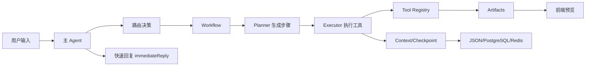
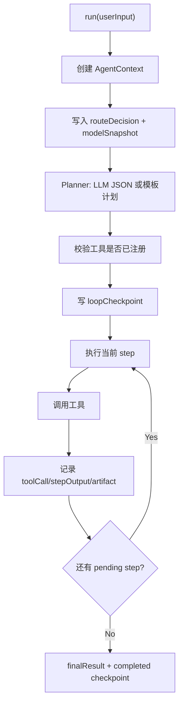

# Agnes Agent Workspace 交付说明

## 项目定位

Agnes Agent Workspace 是一个 Web Agent 工作台原型，不是单页建站 Demo。它围绕主 Agent 调度、多 Workflow 路由、上下文记忆、云端可切换持久化、工具调用、产物预览和可恢复执行构建。

## 已交付功能

| 功能 | 工作流 | 产物 |
| --- | --- | --- |
| 正常对话 | chat direct reply | 文本回答、会话记忆 |
| 检索分析报告 | `web_search -> research_report -> html_export -> summary` | Markdown 报告、HTML 预览、总结 |
| 一键建站 | `website_builder -> summary` | HTML 预览、文件清单、建站说明 |
| PPT 生成 | `presentation_generator -> summary` | slides JSON、Markdown 大纲、HTML deck 预览 |
| 图片/视频 AIGC | `prompt_enhancer -> image_generator/video_generator -> summary` | 增强 prompt、媒体状态/媒体产物、总结 |

AIGC 不直接把用户原话传给生成模型。媒体工作流强制先执行 `prompt_enhancer`，再把增强后的 `enhancedPrompt` 传给图片或视频生成工具。

## CC 源码借鉴内容与个人理解

本项目没有复制 Claude Code 源码，借鉴的是工程思想。

| Claude Code 启发 | 我的理解 | Agnes 实现 |
| --- | --- | --- |
| QueryEngine | Agent 的核心不是“回答”，而是围绕状态持续推进一个任务循环 | `AgentRuntime -> Planner -> Executor -> ContextManager` |
| Tool 抽象 | 能力必须被显式注册、可审计、可回放，不能让模型任意调用未授权动作 | `ToolDefinition` + `ToolRegistry` |
| Context | 多步任务需要一个单一事实来源保存计划、工具输出、产物和最终结论 | `AgentContext` + `ContextManager` |
| Permission/边界 | 密钥、模型、工具和降级策略必须在服务端受控 | `modelProvider.service.ts`、工具白名单、Mock 降级 |
| Trace/可观测 | 用户需要看到 Agent 为什么这么做，而不是只看到最终答案 | `TraceEvent`、Execution details、artifact preview |
| Resume 心智 | 长任务会失败或中断，系统要能从已完成节点继续 | `loopCheckpoint` + `/api/agent/runs/:runId/resume` |

## 与 CC 源码思想的对应关系

| Agnes 代码 | 对应思想 | 说明 |
| --- | --- | --- |
| `packages/agent-core/src/AgentRuntime.ts` | QueryEngine / 主循环 | 创建上下文、调用 Planner、驱动 Executor、写 checkpoint |
| `packages/agent-core/src/Planner.ts` | 任务规划 | 根据意图、上下文、可用工具生成步骤 |
| `packages/agent-core/src/Executor.ts` | Tool use loop | 顺序执行工具，把上游输出喂给下游 |
| `packages/agent-core/src/ToolRegistry.ts` | 工具注册表 | 限制 Planner/Executor 只能使用注册工具 |
| `packages/agent-core/src/ContextManager.ts` | Context | 保存 task、plan、toolCalls、artifacts、trace、checkpoint |
| `apps/server/src/controllers/agent.controller.ts` | 后台任务执行 | `/run-async` 先返回，再后台执行 workflow |
| `apps/server/src/services/modelProvider.service.ts` | 模型与运行配置边界 | 每个 run 捕获模型快照，避免执行中漂移 |
| `apps/server/src/services/storage/*` | 持久化与降级 | JSON/PostgreSQL 适配器，统一保存会话、记忆、报告、工具调用 |

## Codex 交互借鉴

- 单个输入框承载对话和任务，不强迫用户先选复杂模式。
- 任务开始先快速回应，让用户知道系统已接收并路由。
- 中间区域展示会话与 run 卡片，右侧展示产物和工具细节。
- 模型设置靠近输入区，但每个 run 固定快照，保证可复现。
- 历史会话可以恢复，不把每次任务割裂成孤立页面。

## Hardness 工程组织借鉴

- 核心 runtime 与 HTTP/UI 解耦，`agent-core` 不依赖 Express 或 React。
- 工具层通过稳定 contract 接入，新增能力不需要重写主循环。
- 服务端负责依赖注入：模型、搜索、媒体生成、站点启动、存储。
- 存储使用 adapter/fallback：本地 JSON 可演示，PostgreSQL 可云端部署。
- 每个可失败环节都有降级或状态反馈，便于 Demo 和评审。

## 实现工程 Prompt

核心 prompt 设计原则记录在 `prompts.md`，运行时代码在 `packages/prompts/src/`。

实际使用的 prompt 分三层：

1. System prompt：定义 Agnes 是任务驱动 Agent，必须计划、调用工具、总结，不编造事实。
2. Planner prompt：要求模型只输出 JSON 数组，每步绑定注册工具名。
3. Tool prompts：调研、建站、PPT、媒体增强、总结分别有专用约束。

媒体 prompt 的关键约束：

```text
Rewrite the user request into a production-ready image/video generation prompt.
Include subject, scene, style, composition, camera, lighting, quality constraints, and negative constraints.
Output only the optimized prompt text.
```

## 项目实现流程



## Agent 内部调度流程



## 展示效果

可运行 Demo：

```bash
npm run build
npm run dev
```

访问：

- 前端工作台：http://localhost:5173
- 后端健康检查：http://localhost:3001/api/health

验收脚本：

```bash
node scripts/architecture-acceptance.mjs
```

## 验收结论

详见 `docs/acceptance-report.md`。最近一次自动化验收全部通过。

模型切换明确结论：运行中切换模型不会中断当前生成，也不会影响当前 run。当前 run 使用开始时捕获的 `ModelRunSnapshot`，新模型只影响下一次 run。
