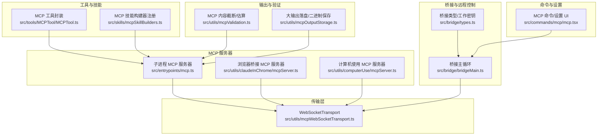
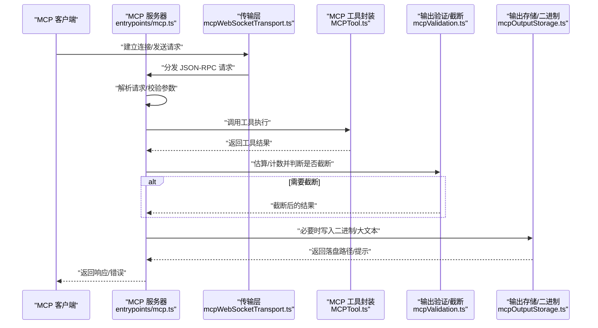
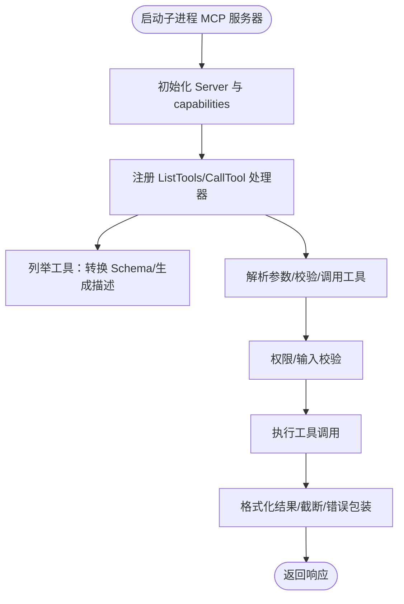
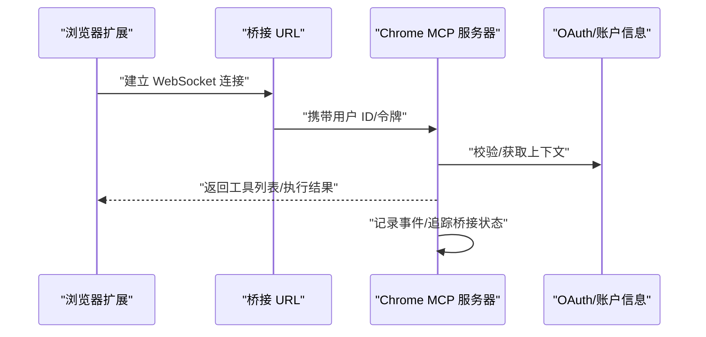
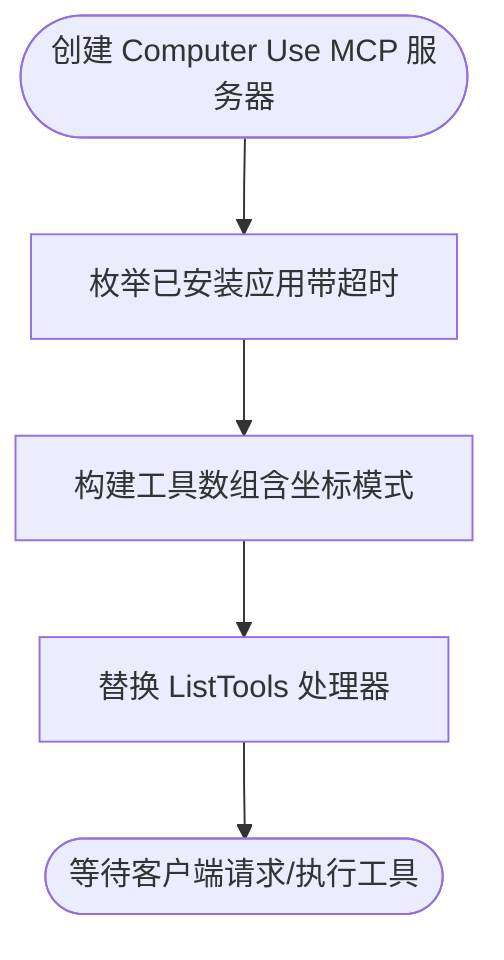
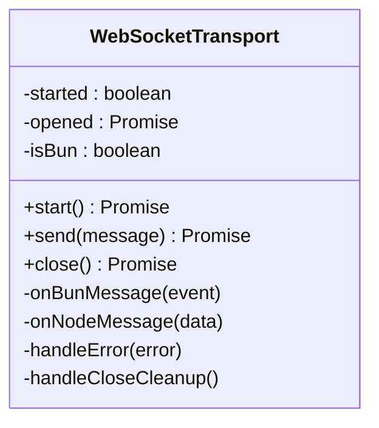
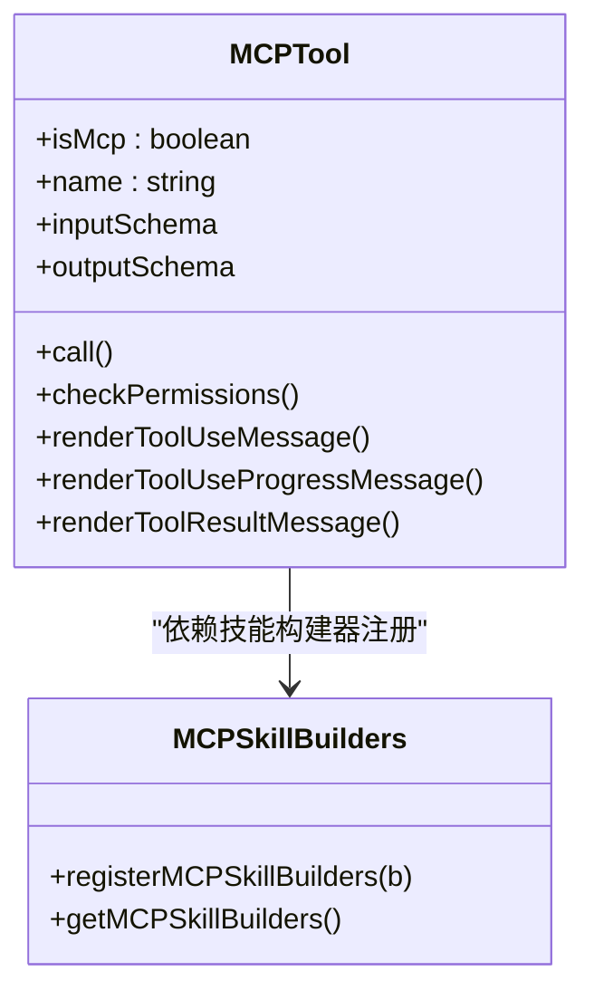
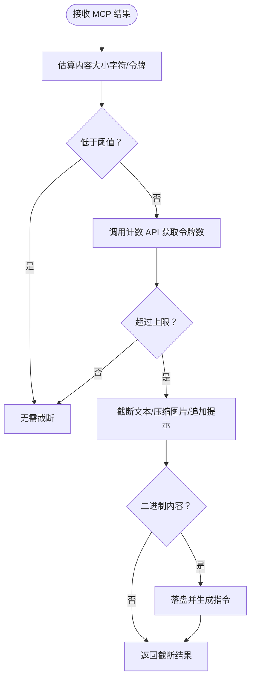
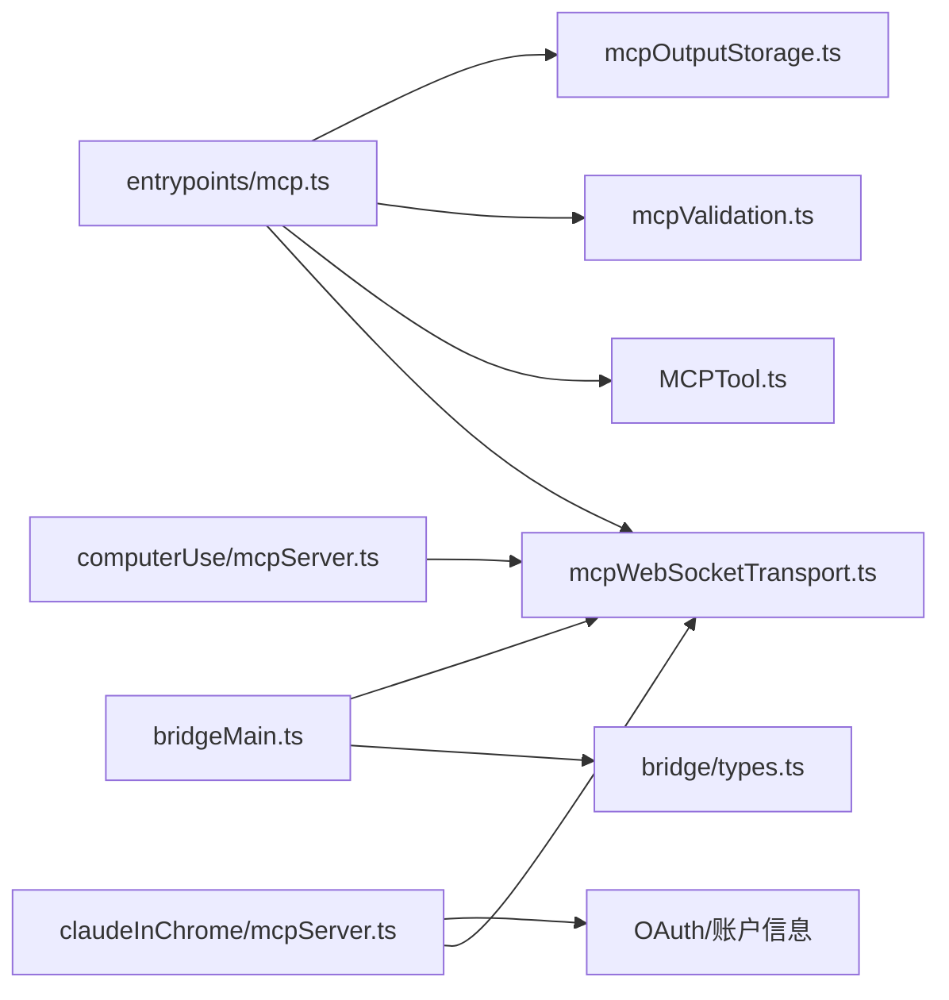

# MCP 高级功能

<cite>
**本文引用的文件**
- [src/entrypoints/mcp.ts](file://src/entrypoints/mcp.ts)
- [src/utils/mcpWebSocketTransport.ts](file://src/utils/mcpWebSocketTransport.ts)
- [src/utils/claudeInChrome/mcpServer.ts](file://src/utils/claudeInChrome/mcpServer.ts)
- [src/utils/computerUse/mcpServer.ts](file://src/utils/computerUse/mcpServer.ts)
- [src/tools/MCPTool/MCPTool.ts](file://src/tools/MCPTool/MCPTool.ts)
- [src/utils/mcpValidation.ts](file://src/utils/mcpValidation.ts)
- [src/utils/mcpOutputStorage.ts](file://src/utils/mcpOutputStorage.ts)
- [src/skills/mcpSkillBuilders.ts](file://src/skills/mcpSkillBuilders.ts)
- [src/bridge/bridgeMain.ts](file://src/bridge/bridgeMain.ts)
- [src/bridge/types.ts](file://src/bridge/types.ts)
- [src/commands/mcp/mcp.tsx](file://src/commands/mcp/mcp.tsx)
</cite>

## 目录
1. [简介](#简介)
2. [项目结构](#项目结构)
3. [核心组件](#核心组件)
4. [架构总览](#架构总览)
5. [详细组件分析](#详细组件分析)
6. [依赖关系分析](#依赖关系分析)
7. [性能考量](#性能考量)
8. [故障排查指南](#故障排查指南)
9. [结论](#结论)
10. [附录](#附录)

## 简介
本文件面向高级开发者与系统架构师，系统性阐述 Claude Code 代码库中 MCP（Model Context Protocol）协议的高级特性与扩展能力。内容涵盖：
- MCP 协议在本仓库中的实现形态：子进程 MCP 服务器、浏览器桥接 MCP 服务器、计算机使用 MCP 服务器等
- 启发式处理机制：请求理解、上下文感知、输出截断与二进制落盘
- 环境变量与头部信息处理：工作密钥解码、环境变量透传、权限模式
- 与 Claude.ai 平台的集成：远程控制桥接、心跳保活、会话超时与重连
- 自定义扩展与插件开发：MCP 工具封装、技能构建器注册、客户端适配
- 高级配置、性能调优与监控：令牌上限、输出截断策略、日志与诊断
- 多服务器管理与负载均衡：桥接轮询、容量唤醒、心跳模式

## 项目结构
围绕 MCP 的关键模块分布如下：
- 入口与服务器
  - 子进程 MCP 服务器入口：[src/entrypoints/mcp.ts](file://src/entrypoints/mcp.ts)
  - 浏览器桥接 MCP 服务器：[src/utils/claudeInChrome/mcpServer.ts](file://src/utils/claudeInChrome/mcpServer.ts)
  - 计算机使用 MCP 服务器：[src/utils/computerUse/mcpServer.ts](file://src/utils/computerUse/mcpServer.ts)
  - WebSocket 传输层：[src/utils/mcpWebSocketTransport.ts](file://src/utils/mcpWebSocketTransport.ts)
- 工具与技能
  - MCP 工具封装：[src/tools/MCPTool/MCPTool.ts](file://src/tools/MCPTool/MCPTool.ts)
  - 技能构建器注册：[src/skills/mcpSkillBuilders.ts](file://src/skills/mcpSkillBuilders.ts)
- 输出与验证
  - 输出截断与存储：[src/utils/mcpValidation.ts](file://src/utils/mcpValidation.ts)、[src/utils/mcpOutputStorage.ts](file://src/utils/mcpOutputStorage.ts)
- 桥接与远程控制
  - 桥接主循环与会话管理：[src/bridge/bridgeMain.ts](file://src/bridge/bridgeMain.ts)
  - 桥接类型与工作密钥：[src/bridge/types.ts](file://src/bridge/types.ts)
- 命令与设置
  - MCP 设置与切换命令：[src/commands/mcp/mcp.tsx](file://src/commands/mcp/mcp.tsx)



图表来源
- [src/entrypoints/mcp.ts:1-197](file://src/entrypoints/mcp.ts#L1-L197)
- [src/utils/mcpWebSocketTransport.ts:1-201](file://src/utils/mcpWebSocketTransport.ts#L1-L201)
- [src/utils/claudeInChrome/mcpServer.ts:1-294](file://src/utils/claudeInChrome/mcpServer.ts#L1-L294)
- [src/utils/computerUse/mcpServer.ts:1-107](file://src/utils/computerUse/mcpServer.ts#L1-L107)
- [src/tools/MCPTool/MCPTool.ts:1-78](file://src/tools/MCPTool/MCPTool.ts#L1-L78)
- [src/skills/mcpSkillBuilders.ts:1-45](file://src/skills/mcpSkillBuilders.ts#L1-L45)
- [src/utils/mcpValidation.ts:1-209](file://src/utils/mcpValidation.ts#L1-L209)
- [src/utils/mcpOutputStorage.ts:1-190](file://src/utils/mcpOutputStorage.ts#L1-L190)
- [src/bridge/bridgeMain.ts:1-800](file://src/bridge/bridgeMain.ts#L1-L800)
- [src/bridge/types.ts:1-263](file://src/bridge/types.ts#L1-L263)
- [src/commands/mcp/mcp.tsx:1-85](file://src/commands/mcp/mcp.tsx#L1-L85)

章节来源
- [src/entrypoints/mcp.ts:1-197](file://src/entrypoints/mcp.ts#L1-L197)
- [src/utils/mcpWebSocketTransport.ts:1-201](file://src/utils/mcpWebSocketTransport.ts#L1-L201)
- [src/utils/claudeInChrome/mcpServer.ts:1-294](file://src/utils/claudeInChrome/mcpServer.ts#L1-L294)
- [src/utils/computerUse/mcpServer.ts:1-107](file://src/utils/computerUse/mcpServer.ts#L1-L107)
- [src/tools/MCPTool/MCPTool.ts:1-78](file://src/tools/MCPTool/MCPTool.ts#L1-L78)
- [src/skills/mcpSkillBuilders.ts:1-45](file://src/skills/mcpSkillBuilders.ts#L1-L45)
- [src/utils/mcpValidation.ts:1-209](file://src/utils/mcpValidation.ts#L1-L209)
- [src/utils/mcpOutputStorage.ts:1-190](file://src/utils/mcpOutputStorage.ts#L1-L190)
- [src/bridge/bridgeMain.ts:1-800](file://src/bridge/bridgeMain.ts#L1-L800)
- [src/bridge/types.ts:1-263](file://src/bridge/types.ts#L1-L263)
- [src/commands/mcp/mcp.tsx:1-85](file://src/commands/mcp/mcp.tsx#L1-L85)

## 核心组件
- 子进程 MCP 服务器：基于 MCP SDK 构建，通过 STDIO 传输，暴露工具列表与工具调用，支持输入/输出 Schema 转换、权限校验与错误处理。
- 浏览器桥接 MCP 服务器：为 Claude in Chrome 提供 MCP 服务，支持桥接 URL、权限模式、设备配对、事件追踪与本地/预发环境切换。
- 计算机使用 MCP 服务器：提供“计算机使用”相关工具描述，动态枚举已安装应用并注入到工具描述中，支持禁用态与坐标模式。
- WebSocketTransport：统一 WebSocket 连接的打开、消息解析、错误与关闭处理，兼容 Bun 与 Node 环境。
- MCP 工具封装：抽象 MCP 工具的输入/输出 Schema、权限检查、结果渲染与截断策略。
- 输出截断与存储：基于令牌估算与实际计数 API 判断是否需要截断；对二进制内容进行落盘并生成可读指令。
- 桥接主循环：负责工作项轮询、心跳保活、会话生命周期管理、容量唤醒与重连逻辑。

章节来源
- [src/entrypoints/mcp.ts:35-196](file://src/entrypoints/mcp.ts#L35-L196)
- [src/utils/claudeInChrome/mcpServer.ts:85-294](file://src/utils/claudeInChrome/mcpServer.ts#L85-L294)
- [src/utils/computerUse/mcpServer.ts:60-107](file://src/utils/computerUse/mcpServer.ts#L60-L107)
- [src/utils/mcpWebSocketTransport.ts:22-201](file://src/utils/mcpWebSocketTransport.ts#L22-L201)
- [src/tools/MCPTool/MCPTool.ts:27-78](file://src/tools/MCPTool/MCPTool.ts#L27-L78)
- [src/utils/mcpValidation.ts:26-209](file://src/utils/mcpValidation.ts#L26-L209)
- [src/utils/mcpOutputStorage.ts:138-190](file://src/utils/mcpOutputStorage.ts#L138-L190)
- [src/bridge/bridgeMain.ts:141-800](file://src/bridge/bridgeMain.ts#L141-L800)

## 架构总览
下图展示 MCP 服务器、传输层、工具与输出处理、桥接主循环之间的交互关系：



图表来源
- [src/entrypoints/mcp.ts:59-188](file://src/entrypoints/mcp.ts#L59-L188)
- [src/utils/mcpWebSocketTransport.ts:142-200](file://src/utils/mcpWebSocketTransport.ts#L142-L200)
- [src/tools/MCPTool/MCPTool.ts:50-78](file://src/tools/MCPTool/MCPTool.ts#L50-L78)
- [src/utils/mcpValidation.ts:151-209](file://src/utils/mcpValidation.ts#L151-L209)
- [src/utils/mcpOutputStorage.ts:138-190](file://src/utils/mcpOutputStorage.ts#L138-L190)

## 详细组件分析

### 子进程 MCP 服务器（STDIO）
- 功能要点
  - 初始化 Server，声明 capabilities（工具能力）
  - 注册 ListTools 与 CallTool 请求处理器
  - 将工具的 Zod Schema 转换为 MCP 所需的 JSON Schema，并过滤根级别 union 类型
  - 统一的工具调用上下文：命令集合、模型、调试开关、非交互会话等
  - 错误处理：记录错误并返回标准化错误内容
- 启发式与上下文
  - 使用 LRU 缓存读取文件状态，避免内存增长
  - 通过工具描述动态生成工具说明，增强上下文感知
- 性能与安全
  - 限制输出大小，避免超大结果直接进入模型上下文
  - 对不可序列化或不兼容的 Schema 进行跳过处理



图表来源
- [src/entrypoints/mcp.ts:35-196](file://src/entrypoints/mcp.ts#L35-L196)

章节来源
- [src/entrypoints/mcp.ts:35-196](file://src/entrypoints/mcp.ts#L35-L196)

### 浏览器桥接 MCP 服务器（Claude in Chrome）
- 功能要点
  - 基于 @ant/claude-for-chrome-mcp 创建服务器，支持桥接 URL、权限模式、设备配对
  - 通过 ClaudeForChromeContext 注入日志、认证、事件追踪、推理回调等
  - 支持本地/预发/生产桥接地址切换
- 与平台集成
  - 通过 OAuth 获取用户 ID 与访问令牌，用于桥接通信
  - 事件追踪仅转发允许的字符串键，避免敏感信息泄露
- 权限与体验
  - 支持 ask/skip_all_permission_checks/follow_a_plan 三种权限模式
  - 设备配对后持久化保存，提升后续连接稳定性



图表来源
- [src/utils/claudeInChrome/mcpServer.ts:51-294](file://src/utils/claudeInChrome/mcpServer.ts#L51-L294)

章节来源
- [src/utils/claudeInChrome/mcpServer.ts:51-294](file://src/utils/claudeInChrome/mcpServer.ts#L51-L294)

### 计算机使用 MCP 服务器
- 功能要点
  - 动态枚举已安装应用，限时完成，失败软降级
  - 构造工具数组并替换 ListTools 处理器，注入应用名称到请求访问描述
  - 支持禁用态与坐标模式，按特性门控启用
- 上下文增强
  - 应用枚举超时或失败不影响调用，仅影响描述提示



图表来源
- [src/utils/computerUse/mcpServer.ts:60-107](file://src/utils/computerUse/mcpServer.ts#L60-L107)

章节来源
- [src/utils/computerUse/mcpServer.ts:60-107](file://src/utils/computerUse/mcpServer.ts#L60-L107)

### WebSocket 传输层
- 功能要点
  - 统一 WebSocket 事件监听与消息解析，兼容 Bun 与 Node
  - 开启前确保连接状态，发送前校验连接状态
  - 错误与关闭事件清理监听器，防止内存泄漏
- 可靠性
  - 通过 readyState 严格控制 start/send/close 行为
  - 记录诊断事件，便于问题定位



图表来源
- [src/utils/mcpWebSocketTransport.ts:22-201](file://src/utils/mcpWebSocketTransport.ts#L22-L201)

章节来源
- [src/utils/mcpWebSocketTransport.ts:22-201](file://src/utils/mcpWebSocketTransport.ts#L22-L201)

### MCP 工具封装与技能构建器
- MCP 工具封装
  - 输入/输出 Schema 采用惰性求值，避免循环依赖
  - 渲染工具使用/进度/结果消息，支持截断检测
- 技能构建器注册
  - 通过注册表在模块初始化时注入 createSkillCommand 与解析函数
  - 解决动态导入在 Bun 环境下的路径问题，避免依赖环



图表来源
- [src/tools/MCPTool/MCPTool.ts:27-78](file://src/tools/MCPTool/MCPTool.ts#L27-L78)
- [src/skills/mcpSkillBuilders.ts:33-44](file://src/skills/mcpSkillBuilders.ts#L33-L44)

章节来源
- [src/tools/MCPTool/MCPTool.ts:27-78](file://src/tools/MCPTool/MCPTool.ts#L27-L78)
- [src/skills/mcpSkillBuilders.ts:33-44](file://src/skills/mcpSkillBuilders.ts#L33-L44)

### 输出截断与存储
- 截断策略
  - 基于令牌估算阈值快速判断是否需要进一步计数
  - 使用计数 API 精确判断是否超过上限，必要时截断文本或压缩图片
- 大输出落盘
  - 二进制内容按 MIME 推导扩展名并写入工具结果目录
  - 生成可读指令，指导模型以偏移/限制方式分块读取



图表来源
- [src/utils/mcpValidation.ts:151-209](file://src/utils/mcpValidation.ts#L151-L209)
- [src/utils/mcpOutputStorage.ts:138-190](file://src/utils/mcpOutputStorage.ts#L138-L190)

章节来源
- [src/utils/mcpValidation.ts:26-209](file://src/utils/mcpValidation.ts#L26-L209)
- [src/utils/mcpOutputStorage.ts:138-190](file://src/utils/mcpOutputStorage.ts#L138-L190)

### 桥接主循环与远程控制
- 轮询与心跳
  - 根据配置在空闲/满载/部分占用状态下采用不同轮询间隔
  - 心跳模式下周期性发送心跳，支持容量唤醒与授权刷新
- 会话生命周期
  - 记录会话开始时间、活动轨迹、标题与工作树
  - 会话结束时归档、清理定时器与工作树，必要时触发重启
- 重连与恢复
  - JWT 过期触发服务端重新派发；环境过期/删除视为致命错误
  - 支持通过会话 ID 恢复会话，强制停止旧实例并重新派发

```mermaid
sequenceDiagram
participant Loop as "桥接主循环"
participant API as "环境 API"
participant Child as "子进程会话"
participant Watchdog as "超时看门狗"
Loop->>API : "轮询工作项"
alt 有工作项
Loop->>Child : "解码工作密钥/启动会话"
Child-->>Loop : "活动/结果/错误"
Loop->>API : "心跳/确认/停止"
else 无工作项
Loop->>Loop : "根据容量选择心跳/慢速轮询"
end
Watchdog-->>Loop : "超时中断"
Loop->>API : "停止工作/归档会话"
```

图表来源
- [src/bridge/bridgeMain.ts:141-800](file://src/bridge/bridgeMain.ts#L141-L800)
- [src/bridge/types.ts:18-176](file://src/bridge/types.ts#L18-L176)

章节来源
- [src/bridge/bridgeMain.ts:141-800](file://src/bridge/bridgeMain.ts#L141-L800)
- [src/bridge/types.ts:18-176](file://src/bridge/types.ts#L18-L176)

### MCP 设置与命令
- 设置界面与切换
  - 支持启用/禁用指定 MCP 服务器或全部服务器
  - 重连特定服务器，或跳转到插件管理页面
- 与桥接联动
  - 在某些用户类型下重定向至插件管理页，便于统一管理 MCP 与插件

章节来源
- [src/commands/mcp/mcp.tsx:63-85](file://src/commands/mcp/mcp.tsx#L63-L85)

## 依赖关系分析
- 组件耦合
  - 子进程 MCP 服务器依赖工具系统与权限校验，输出处理依赖令牌估算与存储模块
  - 浏览器桥接服务器依赖 OAuth 与特性门控，事件追踪与日志独立于业务逻辑
  - 桥接主循环与环境 API 强耦合，心跳与容量控制通过配置驱动
- 外部依赖
  - MCP SDK（Server、STDIO、WebSocket）、@ant/claude-for-chrome-mcp、@ant/computer-use-mcp
  - 分析与诊断日志、令牌估算、图像压缩等工具模块



图表来源
- [src/entrypoints/mcp.ts:1-29](file://src/entrypoints/mcp.ts#L1-L29)
- [src/utils/mcpWebSocketTransport.ts:1-10](file://src/utils/mcpWebSocketTransport.ts#L1-L10)
- [src/tools/MCPTool/MCPTool.ts:1-12](file://src/tools/MCPTool/MCPTool.ts#L1-L12)
- [src/utils/mcpValidation.ts:1-12](file://src/utils/mcpValidation.ts#L1-L12)
- [src/utils/mcpOutputStorage.ts:1-12](file://src/utils/mcpOutputStorage.ts#L1-L12)
- [src/utils/claudeInChrome/mcpServer.ts:1-27](file://src/utils/claudeInChrome/mcpServer.ts#L1-L27)
- [src/utils/computerUse/mcpServer.ts:1-17](file://src/utils/computerUse/mcpServer.ts#L1-L17)
- [src/bridge/bridgeMain.ts:1-58](file://src/bridge/bridgeMain.ts#L1-L58)
- [src/bridge/types.ts:16-51](file://src/bridge/types.ts#L16-L51)

章节来源
- [src/entrypoints/mcp.ts:1-29](file://src/entrypoints/mcp.ts#L1-L29)
- [src/utils/mcpWebSocketTransport.ts:1-10](file://src/utils/mcpWebSocketTransport.ts#L1-L10)
- [src/tools/MCPTool/MCPTool.ts:1-12](file://src/tools/MCPTool/MCPTool.ts#L1-L12)
- [src/utils/mcpValidation.ts:1-12](file://src/utils/mcpValidation.ts#L1-L12)
- [src/utils/mcpOutputStorage.ts:1-12](file://src/utils/mcpOutputStorage.ts#L1-L12)
- [src/utils/claudeInChrome/mcpServer.ts:1-27](file://src/utils/claudeInChrome/mcpServer.ts#L1-L27)
- [src/utils/computerUse/mcpServer.ts:1-17](file://src/utils/computerUse/mcpServer.ts#L1-L17)
- [src/bridge/bridgeMain.ts:1-58](file://src/bridge/bridgeMain.ts#L1-L58)
- [src/bridge/types.ts:16-51](file://src/bridge/types.ts#L16-L51)

## 性能考量
- 输出截断与估算
  - 使用阈值估算避免昂贵的计数 API 调用；仅在接近上限时精确计数
  - 图片压缩优先尝试，失败则跳过，保证吞吐
- 缓存与资源
  - 子进程 MCP 服务器对文件状态使用 LRU 缓存，限制缓存大小与内存占用
- 传输与连接
  - WebSocketTransport 统一事件处理与清理，减少内存泄漏风险
- 桥接轮询与心跳
  - 根据容量动态调整轮询间隔，空闲时降低频率，满载时启用心跳模式
  - 容量唤醒机制在会话结束时立即唤醒，提高资源利用率

## 故障排查指南
- 连接与传输
  - WebSocket 未打开或发送失败：检查 readyState 与连接状态，查看诊断日志
  - 消息解析失败：确认 JSON-RPC 消息格式与解析流程
- 工具调用
  - 工具不存在或未启用：检查工具列表与启用状态
  - 输入校验失败：核对参数与 Schema，关注错误消息
- 输出截断
  - 截断后仍过大：建议使用分页/过滤工具或调整 MCP 服务器能力
  - 二进制内容无法打开：确认扩展名与 MIME 类型映射
- 桥接与远程控制
  - JWT 过期：触发服务端重新派发；检查 OAuth 令牌更新
  - 环境过期/删除：视为致命错误，需重新注册环境
  - 会话超时：看门狗会中断并记录，检查会话活动与资源使用

章节来源
- [src/utils/mcpWebSocketTransport.ts:142-200](file://src/utils/mcpWebSocketTransport.ts#L142-L200)
- [src/entrypoints/mcp.ts:101-187](file://src/entrypoints/mcp.ts#L101-L187)
- [src/utils/mcpValidation.ts:151-209](file://src/utils/mcpValidation.ts#L151-L209)
- [src/utils/mcpOutputStorage.ts:138-190](file://src/utils/mcpOutputStorage.ts#L138-L190)
- [src/bridge/bridgeMain.ts:202-270](file://src/bridge/bridgeMain.ts#L202-L270)

## 结论
本仓库提供了完整的 MCP 协议实现与扩展能力，覆盖从子进程服务器、浏览器桥接到远程控制桥接的全链路。通过启发式截断、二进制落盘、心跳保活与容量唤醒等机制，系统在可用性与性能之间取得平衡。面向高级开发者与架构师，可在现有基础上扩展自定义工具、完善权限与头部处理、优化多服务器负载均衡策略，并结合平台特性门控与遥测体系持续演进。

## 附录
- 自定义扩展与插件开发
  - 工具封装：参考 MCPTool 的输入/输出 Schema 与权限检查，确保渲染与截断策略一致
  - 技能构建器：通过注册表注入技能命令与前端字段解析，避免依赖环
  - 客户端适配：在浏览器桥接或计算机使用场景中，按需注入上下文与特性门控
- 高级配置与监控
  - MCP 输出令牌上限：通过环境变量或特性门控覆盖默认值
  - 日志与诊断：利用诊断日志与事件追踪，聚焦连接失败、消息解析失败与桥接状态
- 多服务器管理与负载均衡
  - 桥接主循环根据容量动态轮询与心跳，配合容量唤醒提升吞吐
  - 会话超时与重连策略保障稳定性，避免单点故障导致的服务中断