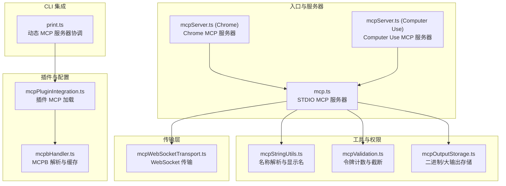
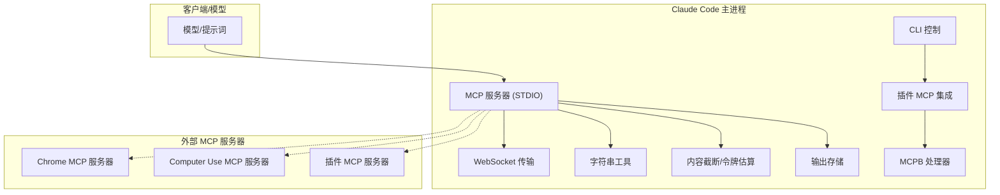
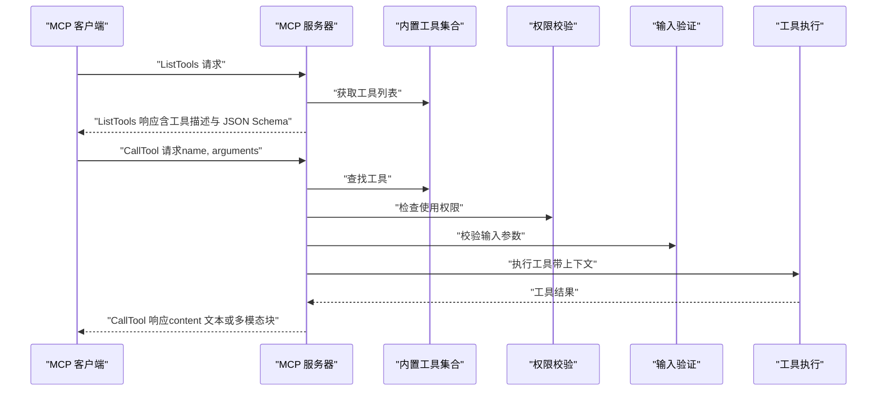
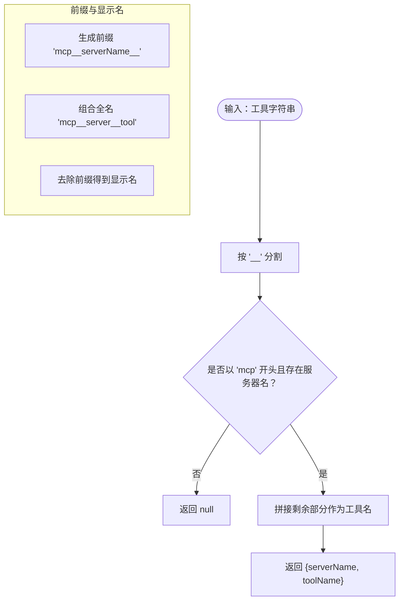
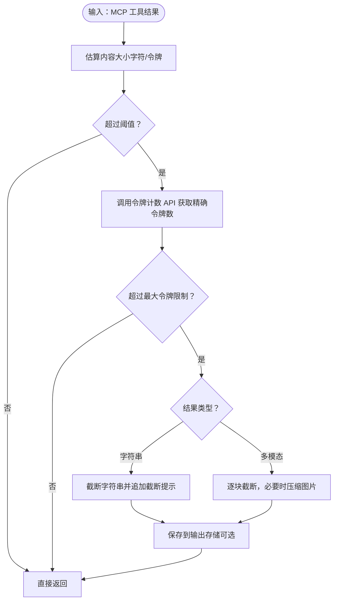
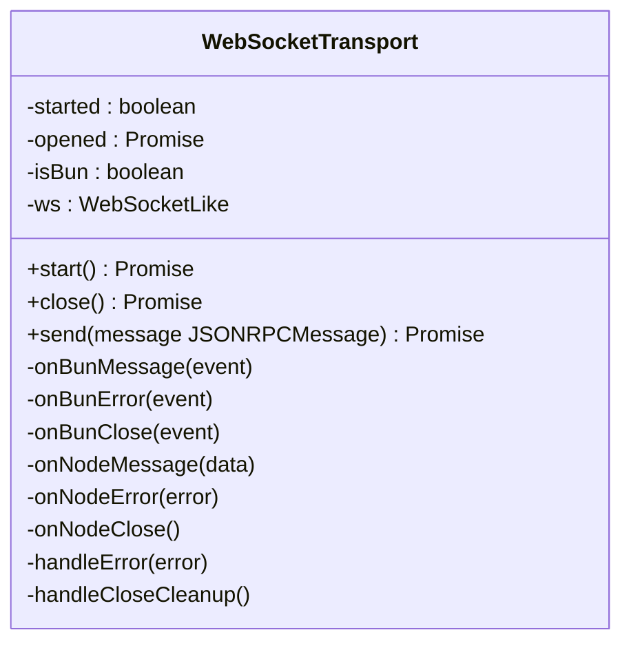
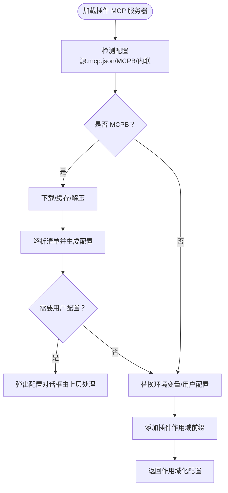
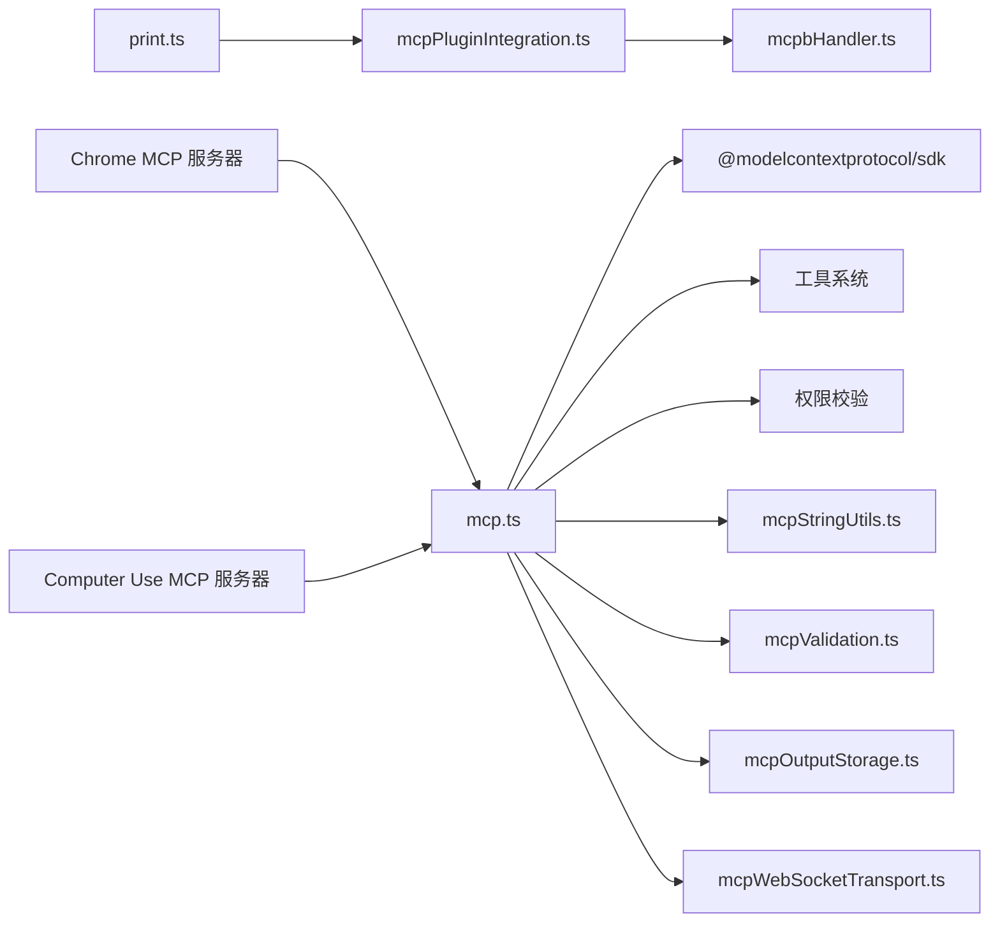

# MCP 协议基础

<cite>
**本文档引用的文件**
- [mcp.ts](file://src/entrypoints/mcp.ts)
- [mcpStringUtils.ts](file://src/services/mcp/mcpStringUtils.ts)
- [mcpValidation.ts](file://src/utils/mcpValidation.ts)
- [mcpOutputStorage.ts](file://src/utils/mcpOutputStorage.ts)
- [mcpWebSocketTransport.ts](file://src/utils/mcpWebSocketTransport.ts)
- [mcpSkillBuilders.ts](file://src/skills/mcpSkillBuilders.ts)
- [mcpServer.ts (Claude in Chrome)](file://src/utils/claudeInChrome/mcpServer.ts)
- [mcpServer.ts (Computer Use)](file://src/utils/computerUse/mcpServer.ts)
- [mcpPluginIntegration.ts](file://src/utils/plugins/mcpPluginIntegration.ts)
- [mcpbHandler.ts](file://src/utils/plugins/mcpbHandler.ts)
- [print.ts](file://src/cli/print.ts)
</cite>

## 目录
1. [简介](#简介)
2. [项目结构](#项目结构)
3. [核心组件](#核心组件)
4. [架构总览](#架构总览)
5. [详细组件分析](#详细组件分析)
6. [依赖关系分析](#依赖关系分析)
7. [性能考量](#性能考量)
8. [故障排查指南](#故障排查指南)
9. [结论](#结论)
10. [附录](#附录)

## 简介
本文件系统性梳理 Claude Code 中的 MCP（Model Context Protocol）协议实现与应用，覆盖协议核心概念、数据结构、消息格式、通信机制、与 Claude Code 生态的集成方式、版本兼容性与扩展机制、标准化实现指南、安全模型与最佳实践。文档面向初学者与开发者，既提供协议概念解释，也给出可操作的实现细节与集成指导。

## 项目结构
Claude Code 的 MCP 实现主要分布在以下模块：
- 入口与服务器：提供 MCP 服务端能力，支持 STDIO 传输与工具暴露。
- 工具与权限：将内置工具暴露为 MCP 工具，并进行权限校验与输入验证。
- 传输层：支持 WebSocket 传输，适配不同运行环境（Node/Bun）。
- 输出与内容截断：对 MCP 工具输出进行大小估算、截断与存储。
- 插件与配置：从插件加载 MCP 服务器配置，支持用户配置与环境变量替换。
- 特定场景服务器：如“Chrome 中的 Claude”、“Computer Use”等专用 MCP 服务器。
- CLI 集成：通过 CLI 控制 MCP 服务器状态与动态配置。

图表来源
- [mcp.ts:35-196](file://src/entrypoints/mcp.ts#L35-L196)
- [mcpStringUtils.ts:1-107](file://src/services/mcp/mcpStringUtils.ts#L1-L107)
- [mcpValidation.ts:1-209](file://src/utils/mcpValidation.ts#L1-L209)
- [mcpOutputStorage.ts:1-190](file://src/utils/mcpOutputStorage.ts#L1-L190)
- [mcpWebSocketTransport.ts:1-201](file://src/utils/mcpWebSocketTransport.ts#L1-L201)
- [mcpPluginIntegration.ts:1-635](file://src/utils/plugins/mcpPluginIntegration.ts#L1-L635)
- [mcpbHandler.ts:1-969](file://src/utils/plugins/mcpbHandler.ts#L1-L969)
- [mcpServer.ts (Claude in Chrome):1-294](file://src/utils/claudeInChrome/mcpServer.ts#L1-L294)
- [mcpServer.ts (Computer Use):1-107](file://src/utils/computerUse/mcpServer.ts#L1-L107)
- [print.ts:5446-5479](file://src/cli/print.ts#L5446-L5479)

章节来源
- [mcp.ts:35-196](file://src/entrypoints/mcp.ts#L35-L196)
- [mcpPluginIntegration.ts:1-635](file://src/utils/plugins/mcpPluginIntegration.ts#L1-L635)
- [mcpbHandler.ts:1-969](file://src/utils/plugins/mcpbHandler.ts#L1-L969)
- [mcpWebSocketTransport.ts:1-201](file://src/utils/mcpWebSocketTransport.ts#L1-L201)
- [mcpValidation.ts:1-209](file://src/utils/mcpValidation.ts#L1-L209)
- [mcpOutputStorage.ts:1-190](file://src/utils/mcpOutputStorage.ts#L1-L190)
- [mcpServer.ts (Claude in Chrome):1-294](file://src/utils/claudeInChrome/mcpServer.ts#L1-L294)
- [mcpServer.ts (Computer Use):1-107](file://src/utils/computerUse/mcpServer.ts#L1-L107)
- [print.ts:5446-5479](file://src/cli/print.ts#L5446-L5479)

## 核心组件
- MCP 服务器（STDIO）
  - 提供 ListTools 与 CallTool 请求处理器，将内置工具暴露为 MCP 工具。
  - 使用 Zod Schema 转换为 JSON Schema，确保 MCP SDK 兼容。
  - 对工具调用进行权限校验、输入验证与错误处理。
- MCP 字符串工具函数
  - 解析/生成 MCP 名称前缀、全名、显示名；用于权限匹配与展示。
- MCP 内容截断与输出存储
  - 基于令牌估算与阈值判断是否需要截断；支持文本与多模态内容。
  - 大输出保存到磁盘并生成读取指引，支持二进制内容写入与扩展名映射。
- WebSocket 传输
  - 统一 WebSocket 事件处理与发送逻辑，适配 Node 与 Bun 环境。
- 插件 MCP 集成
  - 从插件加载 MCP 服务器配置，支持 .mcp.json、MCPB（.mcpb/.dxt）、内联配置。
  - 支持用户配置（含敏感字段分离存储）、环境变量替换、作用域命名避免冲突。
- 特定场景 MCP 服务器
  - “Chrome 中的 Claude”：桥接浏览器扩展与 Claude Code，提供工具调用与权限模式。
  - “Computer Use”：列举已安装应用、构建工具描述、仅在 ListTools 阶段返回工具集。
- CLI 动态 MCP 服务器协调
  - 支持设置/查询 MCP 服务器状态、通道启用、最大思考令牌等控制消息。

章节来源
- [mcp.ts:35-196](file://src/entrypoints/mcp.ts#L35-L196)
- [mcpStringUtils.ts:1-107](file://src/services/mcp/mcpStringUtils.ts#L1-L107)
- [mcpValidation.ts:1-209](file://src/utils/mcpValidation.ts#L1-L209)
- [mcpOutputStorage.ts:1-190](file://src/utils/mcpOutputStorage.ts#L1-L190)
- [mcpWebSocketTransport.ts:1-201](file://src/utils/mcpWebSocketTransport.ts#L1-L201)
- [mcpPluginIntegration.ts:1-635](file://src/utils/plugins/mcpPluginIntegration.ts#L1-L635)
- [mcpbHandler.ts:1-969](file://src/utils/plugins/mcpbHandler.ts#L1-L969)
- [mcpServer.ts (Claude in Chrome):1-294](file://src/utils/claudeInChrome/mcpServer.ts#L1-L294)
- [mcpServer.ts (Computer Use):1-107](file://src/utils/computerUse/mcpServer.ts#L1-L107)
- [print.ts:5446-5479](file://src/cli/print.ts#L5446-L5479)

## 架构总览
下图展示了 MCP 在 Claude Code 中的总体架构：入口服务器负责工具暴露与调用；传输层负责消息收发；插件系统提供动态配置与用户配置；CLI 与状态管理协调服务器生命周期。

图表来源
- [mcp.ts:35-196](file://src/entrypoints/mcp.ts#L35-L196)
- [mcpWebSocketTransport.ts:1-201](file://src/utils/mcpWebSocketTransport.ts#L1-L201)
- [mcpStringUtils.ts:1-107](file://src/services/mcp/mcpStringUtils.ts#L1-L107)
- [mcpValidation.ts:1-209](file://src/utils/mcpValidation.ts#L1-L209)
- [mcpOutputStorage.ts:1-190](file://src/utils/mcpOutputStorage.ts#L1-L190)
- [mcpPluginIntegration.ts:1-635](file://src/utils/plugins/mcpPluginIntegration.ts#L1-L635)
- [mcpbHandler.ts:1-969](file://src/utils/plugins/mcpbHandler.ts#L1-L969)
- [mcpServer.ts (Claude in Chrome):1-294](file://src/utils/claudeInChrome/mcpServer.ts#L1-L294)
- [mcpServer.ts (Computer Use):1-107](file://src/utils/computerUse/mcpServer.ts#L1-L107)
- [print.ts:5446-5479](file://src/cli/print.ts#L5446-L5479)

## 详细组件分析

### MCP 服务器（STDIO）工作流
该服务器实现 MCP 的核心请求处理器：列出工具与调用工具。它将内置工具转换为 MCP 工具，执行权限校验与输入验证，并将结果以 MCP 兼容的消息格式返回。

图表来源
- [mcp.ts:59-188](file://src/entrypoints/mcp.ts#L59-L188)

章节来源
- [mcp.ts:35-196](file://src/entrypoints/mcp.ts#L35-L196)

### MCP 字符串处理与名称规范化
- 名称解析：从字符串中提取服务器名与工具名，支持双下划线分隔的约定。
- 前缀生成：为服务器生成统一前缀，保证工具名唯一性。
- 显示名：移除前缀与后缀，生成用户可见的显示名。
- 权限匹配：优先使用“mcp__server__tool”的全名进行权限规则匹配，避免内置工具与 MCP 替代工具的误判。

图表来源
- [mcpStringUtils.ts:19-106](file://src/services/mcp/mcpStringUtils.ts#L19-L106)

章节来源
- [mcpStringUtils.ts:1-107](file://src/services/mcp/mcpStringUtils.ts#L1-L107)

### MCP 内容截断与输出存储
- 截断阈值：基于令牌估算与阈因子决定是否需要截断，避免超长输出影响上下文。
- 截断策略：对字符串直接截断；对多模态内容逐块评估，优先保留文本，图片尝试压缩后写入。
- 存储策略：二进制内容直接写入磁盘，根据 MIME 类型映射扩展名；提供读取指引与分析要求。
- 指令生成：当输出过大时，生成包含路径、格式、读取建议与完整性要求的指令文本。

图表来源
- [mcpValidation.ts:151-208](file://src/utils/mcpValidation.ts#L151-L208)
- [mcpOutputStorage.ts:39-190](file://src/utils/mcpOutputStorage.ts#L39-L190)

章节来源
- [mcpValidation.ts:1-209](file://src/utils/mcpValidation.ts#L1-L209)
- [mcpOutputStorage.ts:1-190](file://src/utils/mcpOutputStorage.ts#L1-L190)

### WebSocket 传输（跨平台适配）
- 事件监听：统一处理 message/error/close 事件，区分 Node 与 Bun 环境。
- 连接状态：在 start/close 中检查 readyState，确保发送/关闭时机正确。
- 序列化：使用 JSON 序列化/反序列化，结合 JSONRPC 消息模式校验。
- 错误处理：记录诊断日志并触发 onerror 回调，清理监听器防止内存泄漏。

图表来源
- [mcpWebSocketTransport.ts:22-200](file://src/utils/mcpWebSocketTransport.ts#L22-L200)

章节来源
- [mcpWebSocketTransport.ts:1-201](file://src/utils/mcpWebSocketTransport.ts#L1-L201)

### 插件 MCP 服务器加载与配置
- 多源配置：支持 .mcp.json、内联配置、MCPB（.mcpb/.dxt）文件。
- MCPB 流程：下载/缓存/解压/解析清单，生成 MCP 配置；支持用户配置（含敏感字段分离存储）。
- 环境变量替换：支持 ${CLAUDE_PLUGIN_ROOT}、${CLAUDE_PLUGIN_DATA}、${user_config.X} 与通用环境变量。
- 作用域命名：为插件服务器添加前缀避免命名冲突，标记 scope 与 pluginSource。

图表来源
- [mcpPluginIntegration.ts:131-429](file://src/utils/plugins/mcpPluginIntegration.ts#L131-L429)
- [mcpbHandler.ts:698-969](file://src/utils/plugins/mcpbHandler.ts#L698-L969)

章节来源
- [mcpPluginIntegration.ts:1-635](file://src/utils/plugins/mcpPluginIntegration.ts#L1-L635)
- [mcpbHandler.ts:1-969](file://src/utils/plugins/mcpbHandler.ts#L1-L969)

### 特定场景 MCP 服务器
- Chrome 中的 Claude：创建上下文（桥接 URL、权限模式、设备配对、分析事件），通过 STDIO 传输启动服务器。
- Computer Use：枚举已安装应用并注入工具描述，在 ListTools 阶段返回工具数组，实际调用由包装器处理。

章节来源
- [mcpServer.ts (Claude in Chrome):85-275](file://src/utils/claudeInChrome/mcpServer.ts#L85-L275)
- [mcpServer.ts (Computer Use):60-107](file://src/utils/computerUse/mcpServer.ts#L60-L107)

### CLI 动态 MCP 服务器协调
- 设置服务器：接收期望配置，计算新增/删除/替换，协调客户端连接与资源注册。
- 查询状态：聚合三类客户端来源（内置、SDK、动态），返回当前状态。
- 控制消息：支持通道启用、最大思考令牌、上下文用量收集等。

章节来源
- [print.ts:1533-1566](file://src/cli/print.ts#L1533-L1566)
- [print.ts:2944-2960](file://src/cli/print.ts#L2944-L2960)
- [print.ts:5446-5479](file://src/cli/print.ts#L5446-L5479)

## 依赖关系分析
- 组件耦合
  - MCP 服务器依赖工具系统、权限校验、消息构造与日志。
  - 传输层与平台环境解耦，通过统一接口适配 Node 与 Bun。
  - 插件系统与 MCPB 处理器相互协作，前者负责加载与作用域化，后者负责 MCPB 生命周期与用户配置。
- 外部依赖
  - MCP SDK（Server、Transport、JSONRPC 模式）。
  - 插件生态（MCPB、DXT 清单、用户配置 schema）。
  - 平台特性（WebSocket、文件系统、键值存储）。

图表来源
- [mcp.ts:1-28](file://src/entrypoints/mcp.ts#L1-L28)
- [mcpPluginIntegration.ts:1-28](file://src/utils/plugins/mcpPluginIntegration.ts#L1-L28)
- [mcpbHandler.ts:1-23](file://src/utils/plugins/mcpbHandler.ts#L1-L23)
- [mcpWebSocketTransport.ts:1-9](file://src/utils/mcpWebSocketTransport.ts#L1-L9)
- [print.ts:5446-5479](file://src/cli/print.ts#L5446-L5479)

章节来源
- [mcp.ts:1-28](file://src/entrypoints/mcp.ts#L1-L28)
- [mcpPluginIntegration.ts:1-28](file://src/utils/plugins/mcpPluginIntegration.ts#L1-L28)
- [mcpbHandler.ts:1-23](file://src/utils/plugins/mcpbHandler.ts#L1-L23)
- [mcpWebSocketTransport.ts:1-9](file://src/utils/mcpWebSocketTransport.ts#L1-L9)
- [print.ts:5446-5479](file://src/cli/print.ts#L5446-L5479)

## 性能考量
- 工具列表生成
  - 使用 LRU 缓存读取文件状态，限制缓存大小与内存增长。
  - 将 Zod Schema 转换为 JSON Schema，过滤不兼容的根级联合类型。
- 内容截断
  - 先用启发式估算避免昂贵的令牌计数 API；仅在必要时调用 API。
  - 对图片尝试压缩以节省空间，失败则跳过。
- 传输层
  - 统一事件监听与清理，避免重复绑定导致的内存泄漏。
- 插件 MCP
  - MCPB 下载/解压采用进度回调与缓存元数据，减少重复 IO。
  - 环境变量替换与用户配置合并按需执行，避免不必要的开销。

章节来源
- [mcp.ts:40-46](file://src/entrypoints/mcp.ts#L40-L46)
- [mcpValidation.ts:151-178](file://src/utils/mcpValidation.ts#L151-L178)
- [mcpWebSocketTransport.ts:142-168](file://src/utils/mcpWebSocketTransport.ts#L142-L168)
- [mcpbHandler.ts:482-542](file://src/utils/plugins/mcpbHandler.ts#L482-L542)

## 故障排查指南
- 连接问题
  - 检查 WebSocket 是否处于 OPEN 状态再 start/send；若未打开，抛出明确错误并记录诊断日志。
  - 关闭时清理监听器，避免残留事件导致后续异常。
- MCP 服务器状态
  - 通过 CLI 查询 MCP 服务器状态，确认健康状况与连接状态。
  - 若连接失败，检查错误信息并重试；关注“服务器状态：failed/connected/disabled”等状态。
- 输出过大
  - 当输出超过令牌上限，系统会自动截断并保存到磁盘；遵循读取指引逐步读取完整内容。
  - 对二进制内容，确认扩展名映射与文件路径，使用相应工具打开。
- 插件 MCP 配置
  - 若 MCPB 需要用户配置，先完成配置流程；检查用户配置 schema 与必填项。
  - 环境变量缺失会在加载时记录并报告，补齐后再尝试加载。

章节来源
- [mcpWebSocketTransport.ts:142-168](file://src/utils/mcpWebSocketTransport.ts#L142-L168)
- [print.ts:2957-2960](file://src/cli/print.ts#L2957-L2960)
- [mcpOutputStorage.ts:39-59](file://src/utils/mcpOutputStorage.ts#L39-L59)
- [mcpbHandler.ts:737-759](file://src/utils/plugins/mcpbHandler.ts#L737-L759)

## 结论
Claude Code 对 MCP 的实现覆盖了从服务器、传输、工具暴露、权限与输入验证、内容截断与存储、插件加载与配置、到 CLI 协调的完整链路。其设计强调：
- 规范化与兼容性：严格遵循 MCP SDK 的消息格式与 Schema 要求。
- 可靠性与可观测性：完善的错误处理、诊断日志与状态查询。
- 扩展性与安全性：插件 MCP 的作用域化命名、用户配置与敏感信息分离存储。
- 性能与可用性：启发式估算、缓存与压缩策略，保障大输出场景下的稳定性。

## 附录

### MCP 协议数据结构与消息格式
- 请求与响应
  - ListToolsRequest/Response：返回工具数组，包含名称、描述与 JSON Schema 输入/输出。
  - CallToolRequest/Response：携带工具名称与参数，返回文本块或多模态内容块。
- JSON Schema 规范
  - 输入/输出 Schema 通过 Zod 转换为 JSON Schema；根级必须为对象类型，排除 union/discriminatedUnion 等不兼容结构。
- 内容块
  - 文本块：type='text'，text 字段。
  - 图像块：type='image'，支持 base64 数据或 URL，必要时进行压缩。

章节来源
- [mcp.ts:59-188](file://src/entrypoints/mcp.ts#L59-L188)
- [mcpValidation.ts:49-75](file://src/utils/mcpValidation.ts#L49-L75)

### 通信机制与传输
- STDIO：标准输入输出传输，适合子进程启动的 MCP 服务器。
- WebSocket：统一事件处理与 readyState 检查，适配 Node 与 Bun。
- 传输接口：Transport 抽象，便于替换与扩展。

章节来源
- [mcp.ts:190-196](file://src/entrypoints/mcp.ts#L190-L196)
- [mcpWebSocketTransport.ts:22-200](file://src/utils/mcpWebSocketTransport.ts#L22-L200)

### 与 Claude Code 生态的集成
- 工具系统：将内置工具暴露为 MCP 工具，统一权限与输入验证。
- CLI：动态设置/查询 MCP 服务器，通道启用与状态监控。
- 插件生态：支持 MCPB 与 .mcp.json，提供用户配置与环境变量替换。
- 特定场景：Chrome 与 Computer Use MCP 服务器，分别对接浏览器扩展与本地主机能力。

章节来源
- [mcp.ts:33-33](file://src/entrypoints/mcp.ts#L33-L33)
- [print.ts:5446-5479](file://src/cli/print.ts#L5446-L5479)
- [mcpPluginIntegration.ts:131-212](file://src/utils/plugins/mcpPluginIntegration.ts#L131-L212)
- [mcpServer.ts (Claude in Chrome):248-275](file://src/utils/claudeInChrome/mcpServer.ts#L248-L275)
- [mcpServer.ts (Computer Use):85-107](file://src/utils/computerUse/mcpServer.ts#L85-L107)

### 标准化实现指南
- 字符串处理
  - 使用统一前缀与规范化函数生成/解析工具名，避免歧义。
  - 显示名剥离前缀与后缀，保持一致性。
- 数据规范化
  - 输入/输出 Schema 必须满足 MCP SDK 要求（根级对象类型）。
  - 对不兼容的联合类型进行过滤或降级处理。
- 类型定义
  - 明确工具输入/输出类型，使用 JSON Schema 表达约束。
  - 多模态内容块类型与字段保持一致。
- 安全模型与最佳实践
  - 用户配置中的敏感字段分离存储，非敏感字段写入设置文件。
  - 环境变量替换顺序：插件变量 → 用户配置 → 通用环境变量。
  - 插件 MCP 服务器使用作用域前缀避免命名冲突。
  - 输出过大时优先截断并保存到磁盘，提供读取指引与完整性要求。

章节来源
- [mcpStringUtils.ts:39-106](file://src/services/mcp/mcpStringUtils.ts#L39-L106)
- [mcpValidation.ts:14-47](file://src/utils/mcpValidation.ts#L14-L47)
- [mcpOutputStorage.ts:16-28](file://src/utils/mcpOutputStorage.ts#L16-L28)
- [mcpbHandler.ts:193-341](file://src/utils/plugins/mcpbHandler.ts#L193-L341)
- [mcpPluginIntegration.ts:341-360](file://src/utils/plugins/mcpPluginIntegration.ts#L341-L360)