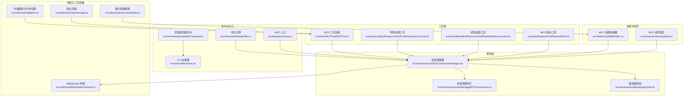
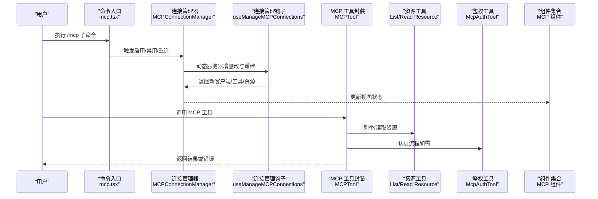
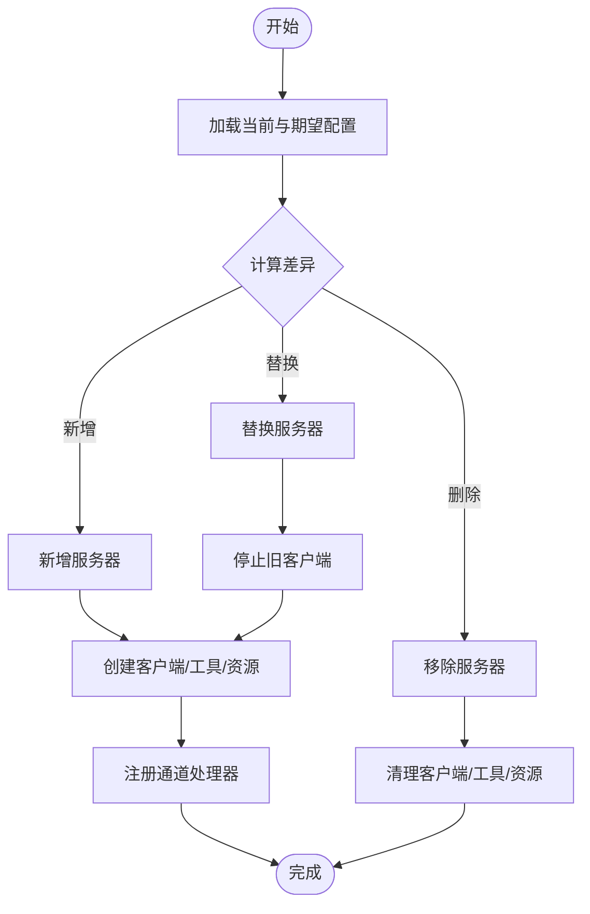
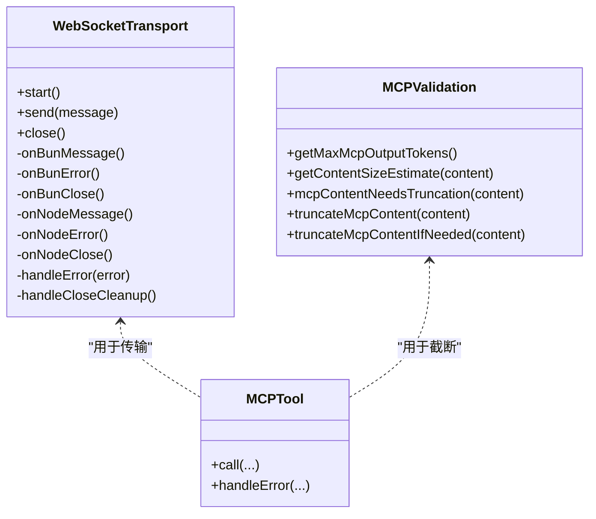
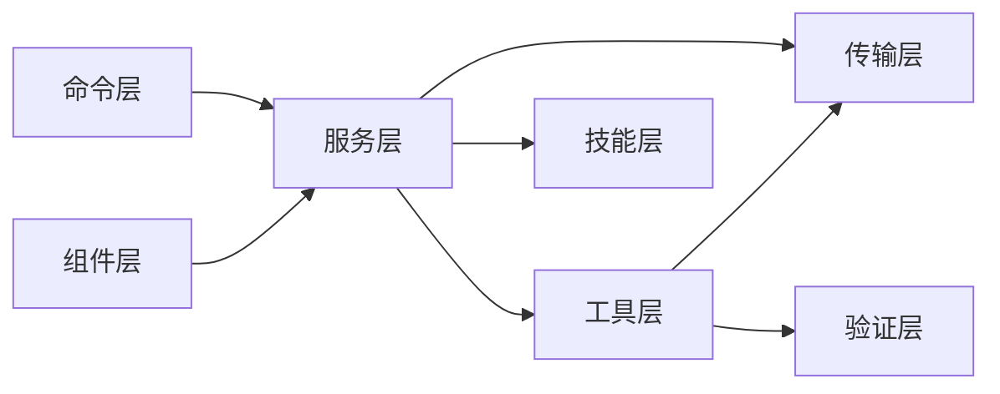

# MCP 协议集成

<cite>
**本文引用的文件**
- [src/entrypoints/mcp.ts](file://src/entrypoints/mcp.ts)
- [src/commands/mcp/index.ts](file://src/commands/mcp/index.ts)
- [src/commands/mcp/mcp.tsx](file://src/commands/mcp/mcp.tsx)
- [src/commands/mcp/addCommand.ts](file://src/commands/mcp/addCommand.ts)
- [src/cli/handlers/mcp.tsx](file://src/cli/handlers/mcp.tsx)
- [src/services/mcp/MCPConnectionManager.tsx](file://src/services/mcp/MCPConnectionManager.tsx)
- [src/services/mcp/useManageMCPConnections.ts](file://src/services/mcp/useManageMCPConnections.ts)
- [src/utils/mcpWebSocketTransport.ts](file://src/utils/mcpWebSocketTransport.ts)
- [src/utils/mcpValidation.ts](file://src/utils/mcpValidation.ts)
- [src/utils/mcpOutputStorage.ts](file://src/utils/mcpOutputStorage.ts)
- [src/utils/mcpInstructionsDelta.ts](file://src/utils/mcpInstructionsDelta.ts)
- [src/tools/MCPTool/MCPTool.ts](file://src/tools/MCPTool/MCPTool.ts)
- [src/tools/ListMcpResourcesTool/ListMcpResourcesTool.ts](file://src/tools/ListMcpResourcesTool/ListMcpResourcesTool.ts)
- [src/tools/ReadMcpResourceTool/ReadMcpResourceTool.ts](file://src/tools/ReadMcpResourceTool/ReadMcpResourceTool.ts)
- [src/tools/McpAuthTool/McpAuthTool.ts](file://src/tools/McpAuthTool/McpAuthTool.ts)
- [src/skills/mcpSkillBuilders.ts](file://src/skills/mcpSkillBuilders.ts)
- [src/services/mcpServerApproval.tsx](file://src/services/mcpServerApproval.tsx)
- [src/components/mcp/index.ts](file://src/components/mcp/index.ts)
- [src/main.tsx](file://src/main.tsx)
</cite>

## 目录
1. [简介](#简介)
2. [项目结构](#项目结构)
3. [核心组件](#核心组件)
4. [架构总览](#架构总览)
5. [组件详解](#组件详解)
6. [依赖关系分析](#依赖关系分析)
7. [性能与安全](#性能与安全)
8. [部署与配置指南](#部署与配置指南)
9. [故障排除](#故障排除)
10. [结论](#结论)

## 简介
本文件系统性梳理 Claude Code 中对 Model Context Protocol（MCP）协议的集成方案，覆盖协议基础、客户端与服务器管理、工具调用、能力协商、连接与传输、资源与权限、输出截断与安全、以及部署与运维实践。目标读者为 MCP 开发者与集成工程师。

## 项目结构
围绕 MCP 的相关模块主要分布在以下区域：
- 命令入口与 CLI：命令注册、添加/移除服务器、交互式设置面板
- 服务层：连接管理、动态配置、权限审批
- 工具层：MCP 工具封装、资源列举与读取、鉴权工具
- 技能层：基于 MCP 的技能构建器
- 工具与实用函数：WebSocket 传输、内容截断与令牌估算、输出存储
- 组件层：MCP 设置面板、列表、详情、重连等 UI 组件

图表来源
- [src/commands/mcp/index.ts](file://src/commands/mcp/index.ts)
- [src/commands/mcp/addCommand.ts](file://src/commands/mcp/addCommand.ts)
- [src/cli/handlers/mcp.tsx](file://src/cli/handlers/mcp.tsx)
- [src/entrypoints/mcp.ts](file://src/entrypoints/mcp.ts)
- [src/services/mcp/MCPConnectionManager.tsx](file://src/services/mcp/MCPConnectionManager.tsx)
- [src/services/mcp/useManageMCPConnections.ts](file://src/services/mcp/useManageMCPConnections.ts)
- [src/services/mcpServerApproval.tsx](file://src/services/mcpServerApproval.tsx)
- [src/tools/MCPTool/MCPTool.ts](file://src/tools/MCPTool/MCPTool.ts)
- [src/tools/ListMcpResourcesTool/ListMcpResourcesTool.ts](file://src/tools/ListMcpResourcesTool/ListMcpResourcesTool.ts)
- [src/tools/ReadMcpResourceTool/ReadMcpResourceTool.ts](file://src/tools/ReadMcpResourceTool/ReadMcpResourceTool.ts)
- [src/tools/McpAuthTool/McpAuthTool.ts](file://src/tools/McpAuthTool/McpAuthTool.ts)
- [src/skills/mcpSkillBuilders.ts](file://src/skills/mcpSkillBuilders.ts)
- [src/components/mcp/index.ts](file://src/components/mcp/index.ts)
- [src/utils/mcpWebSocketTransport.ts](file://src/utils/mcpWebSocketTransport.ts)
- [src/utils/mcpValidation.ts](file://src/utils/mcpValidation.ts)
- [src/utils/mcpOutputStorage.ts](file://src/utils/mcpOutputStorage.ts)
- [src/utils/mcpInstructionsDelta.ts](file://src/utils/mcpInstructionsDelta.ts)

章节来源
- [src/commands/mcp/index.ts](file://src/commands/mcp/index.ts)
- [src/commands/mcp/mcp.tsx](file://src/commands/mcp/mcp.tsx)
- [src/entrypoints/mcp.ts](file://src/entrypoints/mcp.ts)
- [src/services/mcp/MCPConnectionManager.tsx](file://src/services/mcp/MCPConnectionManager.tsx)
- [src/utils/mcpWebSocketTransport.ts](file://src/utils/mcpWebSocketTransport.ts)

## 核心组件
- 命令与入口
  - 命令注册：定义本地 JSX 命令“mcp”，用于管理 MCP 服务器与跳转到插件界面。
  - 添加服务器命令：支持 HTTP/SSE 服务器配置，可选 OAuth 参数与客户端密钥持久化。
  - CLI 处理器：提供删除服务器、清理安全存储、记录分析事件等操作。
  - MCP 入口：应用启动时解析动态 MCP 配置，参与全局状态初始化。
- 连接管理
  - 连接管理器：提供重连与启用/禁用服务器的能力，通过上下文暴露给 UI 和工具。
  - 连接管理钩子：负责动态服务器的增删改、配置对比、客户端与工具的重建与注册。
  - 服务器审批：在首次连接或变更时进行用户审批流程。
- 工具与技能
  - MCP 工具封装：统一 MCP 能力调用、资源读取、能力协商与错误处理。
  - 资源工具：列举与读取服务器资源，支持分页与过滤。
  - 鉴权工具：处理 OAuth/回调端口等认证流程。
  - 技能构建器：将 MCP 能力转化为可复用的技能。
- 传输与工具函数
  - WebSocket 传输：兼容 Bun 与 Node 的 WebSocket 实现，统一消息发送、接收与关闭清理。
  - 内容截断与令牌估算：根据阈值与令牌上限对输出进行截断与提示。
  - 输出存储：对 MCP 输出进行本地存储与缓存。
  - 指令增量更新：对系统指令进行增量调整以适配 MCP 能力。

章节来源
- [src/commands/mcp/index.ts](file://src/commands/mcp/index.ts)
- [src/commands/mcp/addCommand.ts](file://src/commands/mcp/addCommand.ts)
- [src/cli/handlers/mcp.tsx](file://src/cli/handlers/mcp.tsx)
- [src/main.tsx](file://src/main.tsx)
- [src/services/mcp/MCPConnectionManager.tsx](file://src/services/mcp/MCPConnectionManager.tsx)
- [src/services/mcp/useManageMCPConnections.ts](file://src/services/mcp/useManageMCPConnections.ts)
- [src/services/mcpServerApproval.tsx](file://src/services/mcpServerApproval.tsx)
- [src/tools/MCPTool/MCPTool.ts](file://src/tools/MCPTool/MCPTool.ts)
- [src/tools/ListMcpResourcesTool/ListMcpResourcesTool.ts](file://src/tools/ListMcpResourcesTool/ListMcpResourcesTool.ts)
- [src/tools/ReadMcpResourceTool/ReadMcpResourceTool.ts](file://src/tools/ReadMcpResourceTool/ReadMcpResourceTool.ts)
- [src/tools/McpAuthTool/McpAuthTool.ts](file://src/tools/McpAuthTool/McpAuthTool.ts)
- [src/skills/mcpSkillBuilders.ts](file://src/skills/mcpSkillBuilders.ts)
- [src/utils/mcpWebSocketTransport.ts](file://src/utils/mcpWebSocketTransport.ts)
- [src/utils/mcpValidation.ts](file://src/utils/mcpValidation.ts)
- [src/utils/mcpOutputStorage.ts](file://src/utils/mcpOutputStorage.ts)
- [src/utils/mcpInstructionsDelta.ts](file://src/utils/mcpInstructionsDelta.ts)

## 架构总览
下图展示从命令入口到连接管理、工具调用与 UI 展示的整体流程。

图表来源
- [src/commands/mcp/mcp.tsx](file://src/commands/mcp/mcp.tsx)
- [src/services/mcp/MCPConnectionManager.tsx](file://src/services/mcp/MCPConnectionManager.tsx)
- [src/services/mcp/useManageMCPConnections.ts](file://src/services/mcp/useManageMCPConnections.ts)
- [src/tools/MCPTool/MCPTool.ts](file://src/tools/MCPTool/MCPTool.ts)
- [src/tools/ListMcpResourcesTool/ListMcpResourcesTool.ts](file://src/tools/ListMcpResourcesTool/ListMcpResourcesTool.ts)
- [src/tools/ReadMcpResourceTool/ReadMcpResourceTool.ts](file://src/tools/ReadMcpResourceTool/ReadMcpResourceTool.ts)
- [src/tools/McpAuthTool/McpAuthTool.ts](file://src/tools/McpAuthTool/McpAuthTool.ts)
- [src/components/mcp/index.ts](file://src/components/mcp/index.ts)

## 组件详解

### 命令与入口
- 命令注册：将“mcp”注册为本地 JSX 命令，描述为“管理 MCP 服务器”，参数提示为“[enable|disable [server-name]]”。
- 添加服务器命令：支持 HTTP/SSE 类型，可配置请求头、OAuth（clientId/callbackPort/xaa）、客户端密钥持久化。
- CLI 处理器：删除服务器时清理本地存储与客户端配置；记录分析事件；支持按作用域删除。
- MCP 入口：应用启动时解析动态 MCP 配置数组，进行校验与合并，参与全局状态初始化。

章节来源
- [src/commands/mcp/index.ts](file://src/commands/mcp/index.ts)
- [src/commands/mcp/mcp.tsx](file://src/commands/mcp/mcp.tsx)
- [src/commands/mcp/addCommand.ts](file://src/commands/mcp/addCommand.ts)
- [src/cli/handlers/mcp.tsx](file://src/cli/handlers/mcp.tsx)
- [src/main.tsx](file://src/main.tsx)

### 连接管理与动态服务器
- 连接管理器：通过上下文暴露“重连服务器”和“启用/禁用服务器”的能力，供 UI 与命令使用。
- 连接管理钩子：负责 reconcileMcpServers，比较当前与期望配置，执行新增、删除、替换；重建客户端与工具；注册通道处理器；处理连接状态变化。
- 服务器审批：在连接建立前触发审批流程，确保用户授权。

图表来源
- [src/services/mcp/useManageMCPConnections.ts](file://src/services/mcp/useManageMCPConnections.ts)

章节来源
- [src/services/mcp/MCPConnectionManager.tsx](file://src/services/mcp/MCPConnectionManager.tsx)
- [src/services/mcp/useManageMCPConnections.ts](file://src/services/mcp/useManageMCPConnections.ts)
- [src/services/mcpServerApproval.tsx](file://src/services/mcpServerApproval.tsx)

### 工具与资源
- MCP 工具封装：统一处理工具调用、能力协商、错误处理与回退；支持与客户端生命周期联动。
- 资源工具：列举服务器资源并支持分页/过滤；读取指定资源内容。
- 鉴权工具：处理 OAuth 流程（clientId/callbackPort/xaa），必要时读取客户端密钥。
- 技能构建器：将 MCP 能力映射为可组合的技能，便于在对话中调用。

章节来源
- [src/tools/MCPTool/MCPTool.ts](file://src/tools/MCPTool/MCPTool.ts)
- [src/tools/ListMcpResourcesTool/ListMcpResourcesTool.ts](file://src/tools/ListMcpResourcesTool/ListMcpResourcesTool.ts)
- [src/tools/ReadMcpResourceTool/ReadMcpResourceTool.ts](file://src/tools/ReadMcpResourceTool/ReadMcpResourceTool.ts)
- [src/tools/McpAuthTool/McpAuthTool.ts](file://src/tools/McpAuthTool/McpAuthTool.ts)
- [src/skills/mcpSkillBuilders.ts](file://src/skills/mcpSkillBuilders.ts)

### 传输与工具函数
- WebSocket 传输：兼容 Bun 与 Node 的 WebSocket 实现，统一事件监听、消息解析、错误与关闭清理；发送前检查连接状态。
- 内容截断与令牌估算：根据阈值与令牌上限对字符串与内容块进行截断；对图片进行压缩尝试；追加截断提示。
- 输出存储：对 MCP 输出进行本地存储与缓存，便于后续读取与展示。
- 指令增量更新：对系统指令进行增量调整，避免全量覆盖。

图表来源
- [src/utils/mcpWebSocketTransport.ts](file://src/utils/mcpWebSocketTransport.ts)
- [src/utils/mcpValidation.ts](file://src/utils/mcpValidation.ts)
- [src/tools/MCPTool/MCPTool.ts](file://src/tools/MCPTool/MCPTool.ts)

章节来源
- [src/utils/mcpWebSocketTransport.ts](file://src/utils/mcpWebSocketTransport.ts)
- [src/utils/mcpValidation.ts](file://src/utils/mcpValidation.ts)
- [src/utils/mcpOutputStorage.ts](file://src/utils/mcpOutputStorage.ts)
- [src/utils/mcpInstructionsDelta.ts](file://src/utils/mcpInstructionsDelta.ts)

## 依赖关系分析
- 命令层依赖服务层：命令通过连接管理器与动态配置交互。
- 服务层依赖工具层与传输层：连接管理钩子调用工具与传输以维护客户端生命周期。
- 工具层依赖传输层与验证层：工具调用依赖 WebSocket 传输与内容截断。
- 技能层依赖服务层：技能构建器依赖连接状态与资源信息。
- 组件层依赖服务层：UI 组件通过上下文使用连接管理器能力。

图表来源
- [src/commands/mcp/index.ts](file://src/commands/mcp/index.ts)
- [src/services/mcp/MCPConnectionManager.tsx](file://src/services/mcp/MCPConnectionManager.tsx)
- [src/tools/MCPTool/MCPTool.ts](file://src/tools/MCPTool/MCPTool.ts)
- [src/utils/mcpWebSocketTransport.ts](file://src/utils/mcpWebSocketTransport.ts)
- [src/utils/mcpValidation.ts](file://src/utils/mcpValidation.ts)
- [src/skills/mcpSkillBuilders.ts](file://src/skills/mcpSkillBuilders.ts)
- [src/components/mcp/index.ts](file://src/components/mcp/index.ts)

章节来源
- [src/commands/mcp/index.ts](file://src/commands/mcp/index.ts)
- [src/services/mcp/MCPConnectionManager.tsx](file://src/services/mcp/MCPConnectionManager.tsx)
- [src/tools/MCPTool/MCPTool.ts](file://src/tools/MCPTool/MCPTool.ts)
- [src/utils/mcpWebSocketTransport.ts](file://src/utils/mcpWebSocketTransport.ts)
- [src/utils/mcpValidation.ts](file://src/utils/mcpValidation.ts)
- [src/skills/mcpSkillBuilders.ts](file://src/skills/mcpSkillBuilders.ts)
- [src/components/mcp/index.ts](file://src/components/mcp/index.ts)

## 性能与安全
- 性能
  - 传输层：WebSocket 传输在 Bun 与 Node 下均提供一致的事件与发送模型，减少平台差异带来的开销。
  - 截断策略：先用启发式估算判断是否需要进一步调用计数 API，避免不必要的 API 调用；对图片进行压缩尝试，尽量保留视觉信息。
  - 动态服务器管理：仅在配置变化时重建客户端与工具，降低频繁重连与注册的成本。
- 安全
  - 服务器审批：在连接建立前进行用户授权，防止未授权服务器接入。
  - 认证工具：支持 OAuth 与客户端密钥，结合回调端口与客户端 ID 控制访问。
  - 输出存储：对敏感数据进行本地存储与缓存，避免泄露。

章节来源
- [src/utils/mcpWebSocketTransport.ts](file://src/utils/mcpWebSocketTransport.ts)
- [src/utils/mcpValidation.ts](file://src/utils/mcpValidation.ts)
- [src/services/mcpServerApproval.tsx](file://src/services/mcpServerApproval.tsx)
- [src/tools/McpAuthTool/McpAuthTool.ts](file://src/tools/McpAuthTool/McpAuthTool.ts)
- [src/utils/mcpOutputStorage.ts](file://src/utils/mcpOutputStorage.ts)

## 部署与配置指南
- 服务器配置
  - 支持类型：HTTP/SSE。
  - 关键字段：URL、请求头、OAuth（clientId/callbackPort/xaa）、客户端密钥。
  - 配置持久化：添加服务器后可保存客户端密钥；删除服务器会清理本地存储与客户端配置。
- 资源定义
  - 使用资源工具列举与读取服务器资源，支持分页与过滤。
- 访问控制
  - 通过服务器审批流程进行访问授权；可启用/禁用特定服务器。
- 动态配置
  - 应用启动时解析动态 MCP 配置数组，进行校验与合并，参与全局状态初始化。

章节来源
- [src/commands/mcp/addCommand.ts](file://src/commands/mcp/addCommand.ts)
- [src/cli/handlers/mcp.tsx](file://src/cli/handlers/mcp.tsx)
- [src/tools/ListMcpResourcesTool/ListMcpResourcesTool.ts](file://src/tools/ListMcpResourcesTool/ListMcpResourcesTool.ts)
- [src/tools/ReadMcpResourceTool/ReadMcpResourceTool.ts](file://src/tools/ReadMcpResourceTool/ReadMcpResourceTool.ts)
- [src/main.tsx](file://src/main.tsx)

## 故障排除
- 连接失败
  - 检查服务器 URL、网络连通性与认证参数；查看传输层日志与错误事件。
  - 使用重连功能重新建立连接。
- 资源不可用
  - 使用资源工具确认资源是否存在与可访问；若存在分页/过滤能力，优先使用以减少输出。
- 输出过大
  - 系统会自动截断并追加提示；建议使用分页/过滤工具或调整服务器返回规模。
- 权限问题
  - 确认已通过服务器审批；检查 OAuth 配置与客户端密钥是否正确。

章节来源
- [src/utils/mcpWebSocketTransport.ts](file://src/utils/mcpWebSocketTransport.ts)
- [src/utils/mcpValidation.ts](file://src/utils/mcpValidation.ts)
- [src/tools/ListMcpResourcesTool/ListMcpResourcesTool.ts](file://src/tools/ListMcpResourcesTool/ListMcpResourcesTool.ts)
- [src/tools/ReadMcpResourceTool/ReadMcpResourceTool.ts](file://src/tools/ReadMcpResourceTool/ReadMcpResourceTool.ts)
- [src/services/mcpServerApproval.tsx](file://src/services/mcpServerApproval.tsx)

## 结论
Claude Code 对 MCP 的集成以“命令—服务—工具—传输—组件”为主线，实现了从服务器配置、动态管理、能力协商到工具调用与 UI 展示的完整闭环。通过 WebSocket 传输、内容截断与审批机制，兼顾了性能与安全。开发者可基于现有工具与组件快速扩展 MCP 能力，并遵循本文档的部署与故障排除建议进行集成与运维。