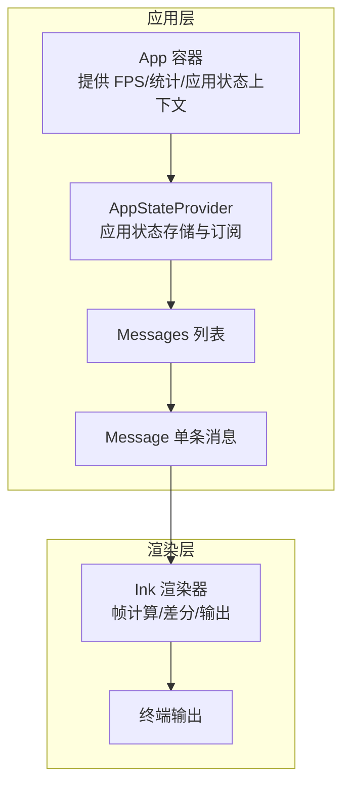
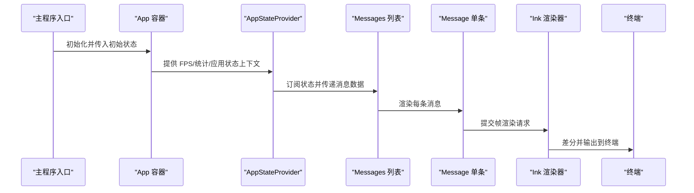
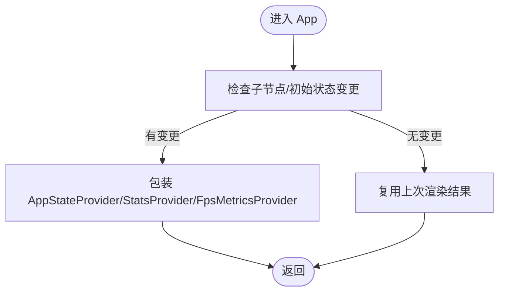
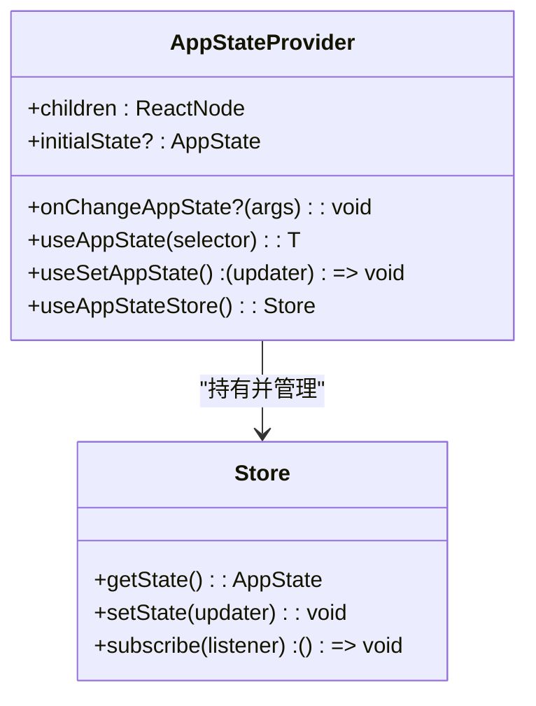
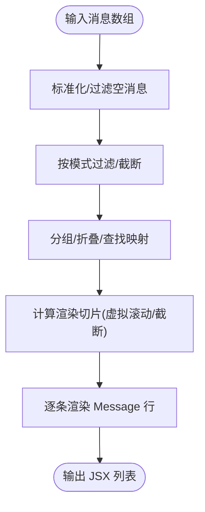
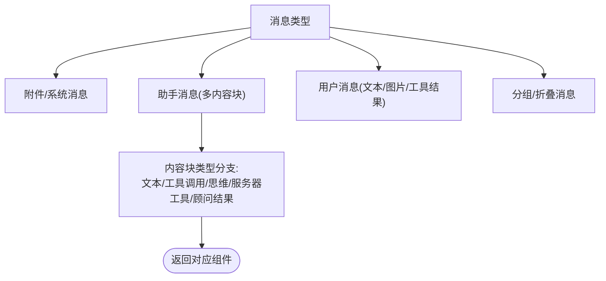
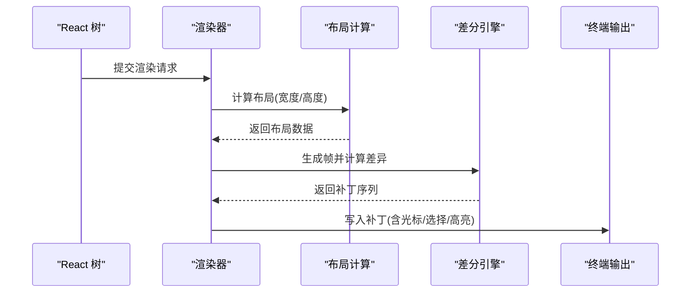
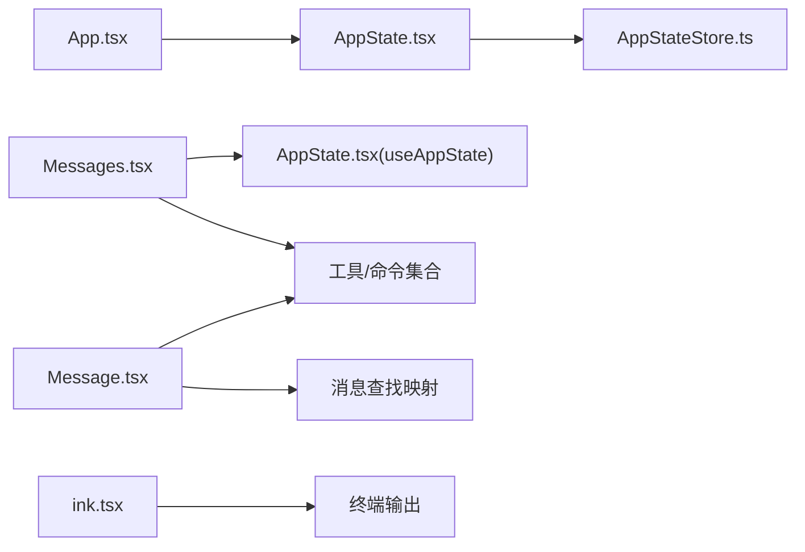

# UI 组件系统

<cite>
**本文档引用的文件**
- [App.tsx](file://src/components/App.tsx)
- [AppState.tsx](file://src/state/AppState.tsx)
- [AppStateStore.ts](file://src/state/AppStateStore.ts)
- [Messages.tsx](file://src/components/Messages.tsx)
- [Message.tsx](file://src/components/Message.tsx)
- [ink.tsx](file://src/ink/ink.tsx)
- [main.tsx](file://src/main.tsx)
</cite>

## 目录
1. [简介](#简介)
2. [项目结构](#项目结构)
3. [核心组件](#核心组件)
4. [架构总览](#架构总览)
5. [详细组件分析](#详细组件分析)
6. [依赖关系分析](#依赖关系分析)
7. [性能考量](#性能考量)
8. [故障排查指南](#故障排查指南)
9. [结论](#结论)
10. [附录](#附录)

## 简介
本文件系统性梳理 Claude Code 的 UI 组件体系，重点覆盖以下方面：
- 组件架构设计：组件分类、通信机制与生命周期管理
- 核心组件功能与使用方式：应用容器、会话消息、设置入口与对话渲染
- Ink 渲染器与终端 UI 特殊考虑：帧渲染、虚拟滚动、选择与高亮等
- 组件开发指南：创建步骤、测试方法、优化技巧与最佳实践
- 状态管理、事件处理与样式定制策略
- 常见问题与调试方法

## 项目结构
该系统采用“状态驱动 + Ink 渲染”的架构：
- 应用容器负责顶层上下文（FPS 指标、统计、应用状态）
- 应用状态通过 Provider 注入到组件树
- Messages/Message 负责消息列表与单条消息渲染
- Ink 渲染器负责将 React 树转换为终端屏幕缓冲并差分输出

**图表来源**
- [App.tsx:19-55](file://src/components/App.tsx#L19-L55)
- [AppState.tsx:37-110](file://src/state/AppState.tsx#L37-L110)
- [Messages.tsx:341-721](file://src/components/Messages.tsx#L341-L721)
- [Message.tsx:58-355](file://src/components/Message.tsx#L58-L355)
- [ink.tsx:420-790](file://src/ink/ink.tsx#L420-L790)

**章节来源**
- [App.tsx:1-56](file://src/components/App.tsx#L1-L56)
- [AppState.tsx:37-110](file://src/state/AppState.tsx#L37-L110)
- [Messages.tsx:341-721](file://src/components/Messages.tsx#L341-L721)
- [Message.tsx:58-355](file://src/components/Message.tsx#L58-L355)
- [ink.tsx:420-790](file://src/ink/ink.tsx#L420-L790)

## 核心组件
- 应用容器组件 App：提供 FPS 指标、统计信息与应用状态上下文，作为交互会话的顶层包装器
- 应用状态模块 AppState/Store：集中式状态管理，支持订阅与更新，提供安全的读取钩子
- 消息列表组件 Messages：负责消息分组、折叠、截断、搜索高亮与虚拟滚动
- 单条消息组件 Message：根据消息类型渲染文本、工具调用、结果、附件等
- Ink 渲染器：将 React 树映射为终端帧，执行布局计算、差分与输出

**章节来源**
- [App.tsx:19-55](file://src/components/App.tsx#L19-L55)
- [AppState.tsx:117-179](file://src/state/AppState.tsx#L117-L179)
- [AppStateStore.ts:89-452](file://src/state/AppStateStore.ts#L89-L452)
- [Messages.tsx:341-721](file://src/components/Messages.tsx#L341-L721)
- [Message.tsx:58-355](file://src/components/Message.tsx#L58-L355)
- [ink.tsx:420-790](file://src/ink/ink.tsx#L420-L790)

## 架构总览
整体流程从顶层 App 进入，通过 AppStateProvider 注入状态，Messages/Message 负责渲染，最终由 Ink 渲染器输出到终端。

**图表来源**
- [main.tsx:585-800](file://src/main.tsx#L585-L800)
- [App.tsx:19-55](file://src/components/App.tsx#L19-L55)
- [AppState.tsx:37-110](file://src/state/AppState.tsx#L37-L110)
- [Messages.tsx:341-721](file://src/components/Messages.tsx#L341-L721)
- [Message.tsx:58-355](file://src/components/Message.tsx#L58-L355)
- [ink.tsx:420-790](file://src/ink/ink.tsx#L420-L790)

## 详细组件分析

### 应用容器组件 App
- 职责：顶层包装器，向上提供 FPS 指标、统计上下文与应用状态
- 关键点：避免重复渲染，按需包裹子树；确保上下文顺序正确

**图表来源**
- [App.tsx:19-55](file://src/components/App.tsx#L19-L55)

**章节来源**
- [App.tsx:19-55](file://src/components/App.tsx#L19-L55)

### 应用状态模块 AppState/Store
- 职责：集中式状态存储、订阅与更新；提供安全的读取钩子
- 关键点：禁止嵌套 Provider；支持外部设置变更同步；提供稳定引用的更新器

**图表来源**
- [AppState.tsx:37-110](file://src/state/AppState.tsx#L37-L110)
- [AppStateStore.ts:454-455](file://src/state/AppStateStore.ts#L454-L455)

**章节来源**
- [AppState.tsx:37-110](file://src/state/AppState.tsx#L37-L110)
- [AppStateStore.ts:454-455](file://src/state/AppStateStore.ts#L454-L455)

### 消息列表组件 Messages
- 职责：消息过滤、重组、分组、折叠、截断与搜索高亮；支持虚拟滚动与全屏模式
- 关键点：长会话截断策略、渲染范围切片、搜索索引缓存、流式工具调用与思维块处理

**图表来源**
- [Messages.tsx:481-543](file://src/components/Messages.tsx#L481-L543)

**章节来源**
- [Messages.tsx:341-721](file://src/components/Messages.tsx#L341-L721)

### 单条消息组件 Message
- 职责：根据消息类型渲染不同内容块（文本、工具调用、结果、附件、系统消息等）
- 关键点：按类型分支渲染；支持思维块隐藏/显示；静态消息在终端尺寸变化时重渲染

**图表来源**
- [Message.tsx:82-355](file://src/components/Message.tsx#L82-L355)

**章节来源**
- [Message.tsx:58-355](file://src/components/Message.tsx#L58-L355)

### Ink 渲染器与终端 UI
- 职责：将 React 树映射为终端帧，执行布局计算、差分与输出；支持选择高亮、搜索定位、光标定位等
- 关键点：帧间隔节流、布局计算、全屏/备选缓冲、光标锚定与自愈、差分优化

**图表来源**
- [ink.tsx:420-790](file://src/ink/ink.tsx#L420-L790)

**章节来源**
- [ink.tsx:420-790](file://src/ink/ink.tsx#L420-L790)

## 依赖关系分析
- App 依赖 AppStateProvider 提供上下文
- Messages 依赖 AppState 钩子与工具/命令集合
- Message 依赖工具/命令与查找映射
- Ink 渲染器独立于业务逻辑，专注终端帧渲染与输出

**图表来源**
- [App.tsx:19-55](file://src/components/App.tsx#L19-L55)
- [AppState.tsx:117-179](file://src/state/AppState.tsx#L117-L179)
- [Messages.tsx:341-721](file://src/components/Messages.tsx#L341-L721)
- [Message.tsx:58-355](file://src/components/Message.tsx#L58-L355)
- [ink.tsx:420-790](file://src/ink/ink.tsx#L420-L790)

**章节来源**
- [App.tsx:19-55](file://src/components/App.tsx#L19-L55)
- [AppState.tsx:117-179](file://src/state/AppState.tsx#L117-L179)
- [Messages.tsx:341-721](file://src/components/Messages.tsx#L341-L721)
- [Message.tsx:58-355](file://src/components/Message.tsx#L58-L355)
- [ink.tsx:420-790](file://src/ink/ink.tsx#L420-L790)

## 性能考量
- 渲染路径优化
  - 虚拟滚动：在全屏环境下启用虚拟列表，避免一次性挂载大量 Fiber 树
  - 截断策略：非虚拟滚动路径下限制最大渲染数量，防止内存与 GC 压力
  - 记忆化：对头部/Logo、消息行等进行 React.memo，减少重渲染
- 布局与差分
  - 布局计算在提交阶段完成，确保布局数据新鲜
  - 差分优化：合并补丁、全屏损伤回退、选择/高亮写入不追踪损伤
- 终端输出
  - 帧间隔节流，避免高频渲染
  - 光标锚定与自愈，保证相对移动一致性

[本节为通用性能建议，无需特定文件引用]

## 故障排查指南
- 渲染异常
  - 检查是否嵌套了多个 AppStateProvider
  - 确认 useAppState/useSetAppState 在 Provider 外部使用时的错误提示
- 消息显示问题
  - 检查消息过滤/截断逻辑（简报模式、转录模式）
  - 核对工具/命令集合与查找映射是否匹配
- 终端输出问题
  - 检查帧差分与光标锚定逻辑
  - 关注全屏/备选缓冲切换与清屏时机
- 性能问题
  - 启用虚拟滚动或调整截断阈值
  - 使用 React.memo 与稳定引用减少重渲染

**章节来源**
- [AppState.tsx:44-47](file://src/state/AppState.tsx#L44-L47)
- [Messages.tsx:278-308](file://src/components/Messages.tsx#L278-L308)
- [ink.tsx:554-567](file://src/ink/ink.tsx#L554-L567)

## 结论
该 UI 组件系统以状态驱动为核心，结合 Ink 渲染器实现高效的终端界面。通过虚拟滚动、截断策略与记忆化等手段，在长会话场景下保持流畅体验。组件间职责清晰，上下文注入合理，便于扩展与维护。

[本节为总结性内容，无需特定文件引用]

## 附录

### 组件开发指南
- 创建步骤
  - 设计组件接口与属性
  - 编写渲染逻辑与类型定义
  - 引入必要的上下文与工具
  - 添加记忆化与性能优化
- 测试方法
  - 单元测试：针对渲染分支与边界条件
  - 集成测试：与 AppState 钩子与 Ink 渲染器联动
- 优化技巧
  - 使用 React.memo 与稳定引用
  - 控制渲染范围与切片
  - 减少不必要的订阅与计算

[本节为通用开发建议，无需特定文件引用]

### 组件状态管理与事件处理
- 状态管理
  - 使用 useAppState/selectors 精准订阅
  - 使用 useSetAppState 获取稳定更新器
- 事件处理
  - 将外部设置变更通过应用状态同步
  - 在渲染器中处理键盘/鼠标事件并触发状态更新

**章节来源**
- [AppState.tsx:142-179](file://src/state/AppState.tsx#L142-L179)
- [AppState.tsx:84-91](file://src/state/AppState.tsx#L84-L91)

### 样式定制与主题
- 主题与样式
  - 通过上下文与全局配置控制样式
  - 在终端环境中遵循 ANSI/终端能力限制
- 自定义建议
  - 优先使用现有设计系统组件
  - 避免复杂布局导致终端渲染压力

[本节为通用样式建议，无需特定文件引用]