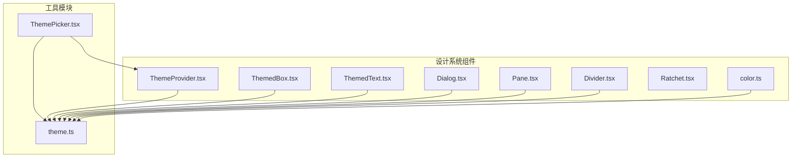
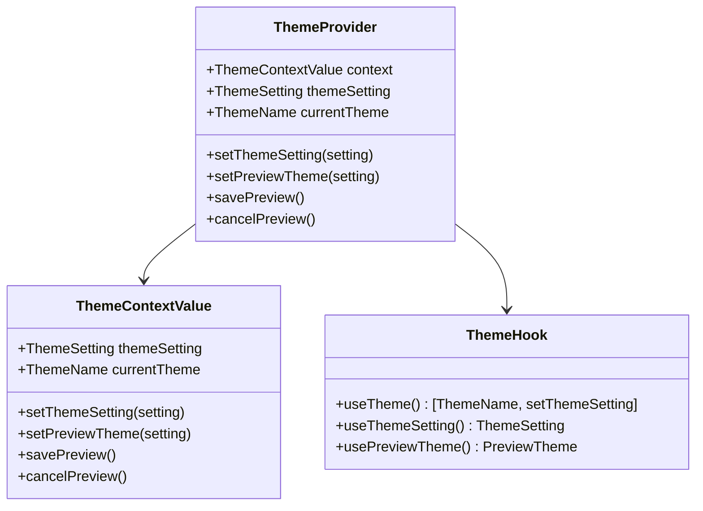
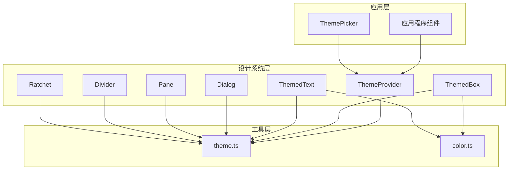
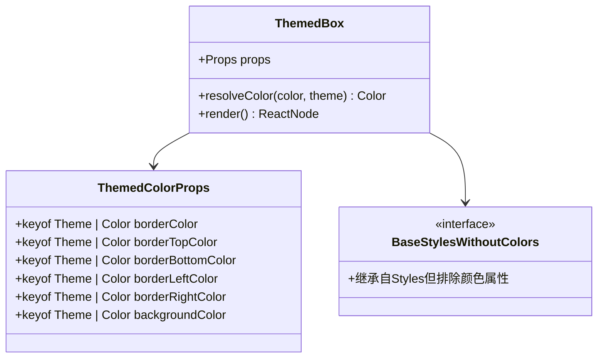
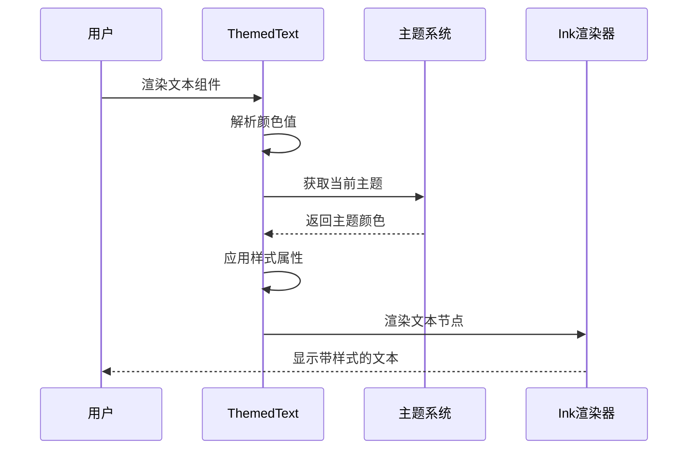
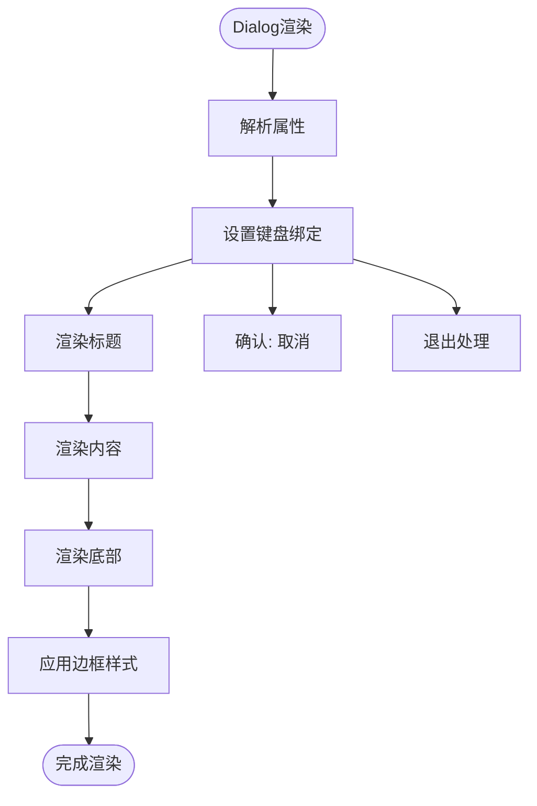
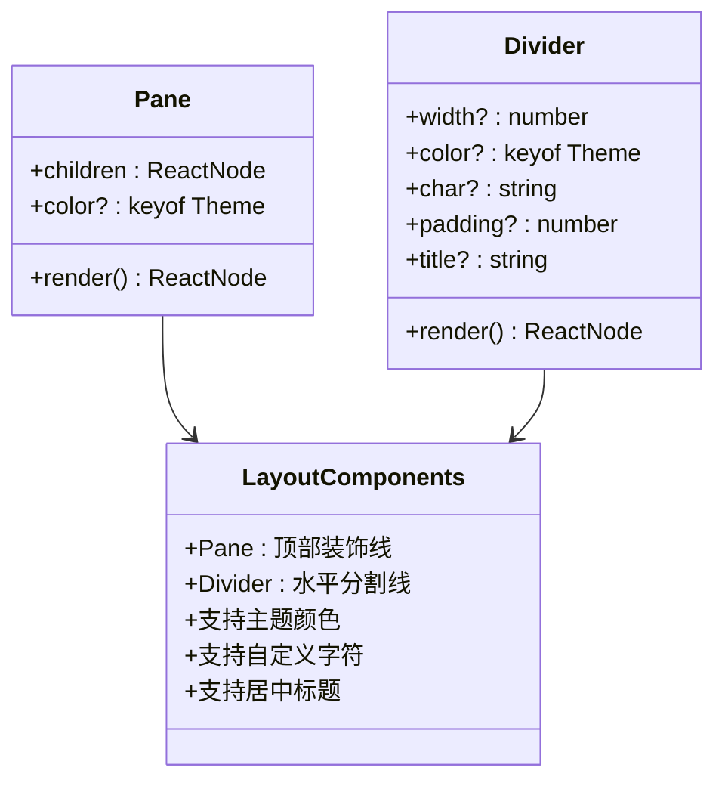
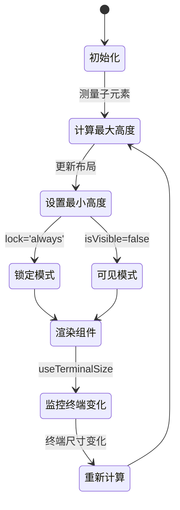
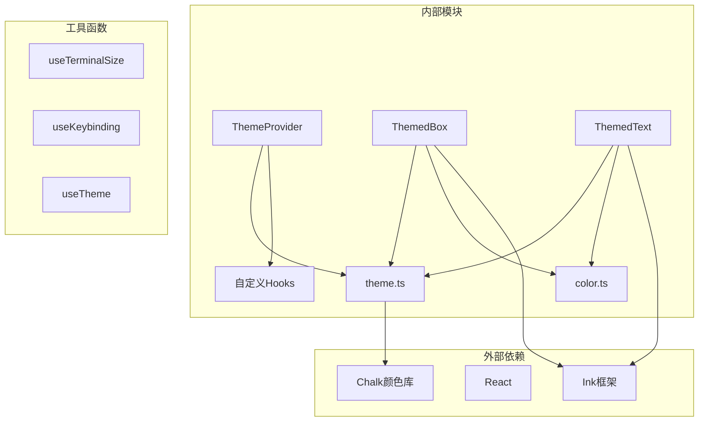

# 设计系统

<cite>
**本文档引用的文件**
- [ThemeProvider.tsx](file://src/components/design-system/ThemeProvider.tsx)
- [ThemedBox.tsx](file://src/components/design-system/ThemedBox.tsx)
- [ThemedText.tsx](file://src/components/design-system/ThemedText.tsx)
- [Dialog.tsx](file://src/components/design-system/Dialog.tsx)
- [Pane.tsx](file://src/components/design-system/Pane.tsx)
- [Divider.tsx](file://src/components/design-system/Divider.tsx)
- [Ratchet.tsx](file://src/components/design-system/Ratchet.tsx)
- [color.ts](file://src/components/design-system/color.ts)
- [theme.ts](file://src/utils/theme.ts)
- [ThemePicker.tsx](file://src/components/ThemePicker.tsx)
</cite>

## 目录
1. [简介](#简介)
2. [项目结构](#项目结构)
3. [核心组件](#核心组件)
4. [架构概览](#架构概览)
5. [详细组件分析](#详细组件分析)
6. [依赖关系分析](#依赖关系分析)
7. [性能考虑](#性能考虑)
8. [故障排除指南](#故障排除指南)
9. [结论](#结论)
10. [附录](#附录)

## 简介

设计系统是 Claude Code 项目中用于构建用户界面的一套完整规范和组件库。该系统提供了统一的颜色管理、主题切换机制、样式组件以及响应式设计支持，确保在不同终端环境中保持一致的视觉体验。

设计系统的核心目标是：
- 提供一致的颜色语义和主题规范
- 支持多种主题模式（深色、浅色、色盲友好等）
- 实现自动主题检测和切换
- 提供响应式布局和终端适配
- 确保无障碍访问和可访问性

## 项目结构

设计系统主要位于 `src/components/design-system/` 目录下，包含以下核心组件：



**图表来源**
- [ThemeProvider.tsx:1-170](file://src/components/design-system/ThemeProvider.tsx#L1-L170)
- [ThemedBox.tsx:1-156](file://src/components/design-system/ThemedBox.tsx#L1-L156)
- [ThemedText.tsx:1-124](file://src/components/design-system/ThemedText.tsx#L1-L124)

**章节来源**
- [ThemeProvider.tsx:1-170](file://src/components/design-system/ThemeProvider.tsx#L1-L170)
- [ThemedBox.tsx:1-156](file://src/components/design-system/ThemedBox.tsx#L1-L156)
- [ThemedText.tsx:1-124](file://src/components/design-system/ThemedText.tsx#L1-L124)

## 核心组件

### 主题提供器（ThemeProvider）

主题提供器是设计系统的核心，负责管理全局主题状态和主题切换逻辑：



**图表来源**
- [ThemeProvider.tsx:8-28](file://src/components/design-system/ThemeProvider.tsx#L8-L28)
- [ThemeProvider.tsx:122-146](file://src/components/design-system/ThemeProvider.tsx#L122-L146)

### 颜色系统

颜色系统提供了主题感知的颜色函数，支持直接颜色值和主题键值两种方式：

```mermaid
flowchart TD
Start([颜色解析开始]) --> CheckInput{检查输入类型}
CheckInput --> |原始颜色值| RawColor[rgb(), #, ansi256(), ansi:]
CheckInput --> |主题键值| ThemeKey[Theme键值]
RawColor --> ReturnRaw[返回原始颜色]
ThemeKey --> GetTheme[获取当前主题]
GetTheme --> ResolveKey[解析主题键值]
ResolveKey --> ReturnResolved[返回解析后的颜色]
ReturnRaw --> End([结束])
ReturnResolved --> End
```

**图表来源**
- [color.ts:9-30](file://src/components/design-system/color.ts#L9-L30)

**章节来源**
- [ThemeProvider.tsx:1-170](file://src/components/design-system/ThemeProvider.tsx#L1-L170)
- [color.ts:1-31](file://src/components/design-system/color.ts#L1-L31)

## 架构概览

设计系统采用分层架构，从底层的颜色管理到顶层的组件使用：



**图表来源**
- [ThemePicker.tsx:30-333](file://src/components/ThemePicker.tsx#L30-L333)
- [ThemeProvider.tsx:43-116](file://src/components/design-system/ThemeProvider.tsx#L43-L116)

## 详细组件分析

### ThemedBox 组件

ThemedBox 是一个主题感知的 Box 组件，支持边框颜色和背景颜色的主题解析：



**图表来源**
- [ThemedBox.tsx:12-37](file://src/components/design-system/ThemedBox.tsx#L12-L37)
- [ThemedBox.tsx:42-50](file://src/components/design-system/ThemedBox.tsx#L42-L50)

### ThemedText 组件

ThemedText 提供了丰富的文本样式选项，支持颜色、粗体、斜体、下划线等多种样式：



**图表来源**
- [ThemedText.tsx:80-123](file://src/components/design-system/ThemedText.tsx#L80-L123)

### Dialog 组件

Dialog 组件提供了对话框功能，包含确认/取消处理和键盘快捷键支持：



**图表来源**
- [Dialog.tsx:30-137](file://src/components/design-system/Dialog.tsx#L30-L137)

**章节来源**
- [ThemedBox.tsx:1-156](file://src/components/design-system/ThemedBox.tsx#L1-L156)
- [ThemedText.tsx:1-124](file://src/components/design-system/ThemedText.tsx#L1-L124)
- [Dialog.tsx:1-138](file://src/components/design-system/Dialog.tsx#L1-L138)

### Pane 和 Divider 组件

Pane 和 Divider 提供了容器和分割线功能，支持主题颜色和自定义样式：



**图表来源**
- [Pane.tsx:33-76](file://src/components/design-system/Pane.tsx#L33-L76)
- [Divider.tsx:66-148](file://src/components/design-system/Divider.tsx#L66-L148)

**章节来源**
- [Pane.tsx:1-77](file://src/components/design-system/Pane.tsx#L1-L77)
- [Divider.tsx:1-149](file://src/components/design-system/Divider.tsx#L1-L149)

### Ratchet 组件

Ratchet 提供了响应式布局功能，根据终端大小动态调整组件高度：



**图表来源**
- [Ratchet.tsx:10-79](file://src/components/design-system/Ratchet.tsx#L10-L79)

**章节来源**
- [Ratchet.tsx:1-80](file://src/components/design-system/Ratchet.tsx#L1-L80)

## 依赖关系分析

设计系统各组件之间的依赖关系如下：



**图表来源**
- [ThemeProvider.tsx:1-8](file://src/components/design-system/ThemeProvider.tsx#L1-L8)
- [ThemedBox.tsx:1-10](file://src/components/design-system/ThemedBox.tsx#L1-L10)
- [ThemedText.tsx:1-7](file://src/components/design-system/ThemedText.tsx#L1-L7)

**章节来源**
- [theme.ts:1-640](file://src/utils/theme.ts#L1-L640)
- [ThemeProvider.tsx:1-170](file://src/components/design-system/ThemeProvider.tsx#L1-L170)

## 性能考虑

设计系统在性能方面采用了多项优化策略：

### 内存优化
- 使用 React.memo 缓存昂贵的渲染操作
- 通过 useMemo 优化主题解析结果
- 避免不必要的重新渲染

### 渲染优化
- 条件渲染减少 DOM 节点数量
- 动态宽度计算避免过度重排
- 主题切换时的缓存机制

### 响应式优化
- 终端尺寸监听的防抖处理
- 视口可见性检测优化
- 条件加载外部依赖

## 故障排除指南

### 主题切换问题

**问题**: 主题切换不生效
**解决方案**:
1. 检查 ThemeProvider 的初始化状态
2. 验证主题设置是否正确保存
3. 确认 useTheme hook 是否正确使用

**问题**: 自动主题检测失效
**解决方案**:
1. 检查终端环境变量 COLORFGBG
2. 验证系统主题监听器是否正常工作
3. 确认 feature('AUTO_THEME') 是否启用

### 颜色显示异常

**问题**: 颜色在某些终端中显示不正确
**解决方案**:
1. 检查终端是否支持真彩色
2. 使用 ANSI 主题作为后备方案
3. 验证颜色值格式是否正确

**问题**: 主题键值解析失败
**解决方案**:
1. 确认主题键值是否存在
2. 检查主题配置文件完整性
3. 验证主题名称是否正确

**章节来源**
- [ThemeProvider.tsx:64-80](file://src/components/design-system/ThemeProvider.tsx#L64-L80)
- [color.ts:14-29](file://src/components/design-system/color.ts#L14-L29)

## 结论

设计系统为 Claude Code 提供了一个完整、灵活且高性能的 UI 解决方案。通过统一的颜色管理、智能的主题切换机制和响应式布局支持，确保了在各种终端环境中的优秀用户体验。

设计系统的主要优势包括：
- **一致性**: 统一的颜色和样式规范
- **可扩展性**: 支持多种主题模式和自定义选项
- **性能优化**: 多层次的缓存和渲染优化
- **无障碍支持**: 色盲友好和高对比度主题
- **开发效率**: 简洁的 API 和丰富的组件库

## 附录

### 主题配置选项

设计系统支持以下主题配置：
- `dark`: 标准深色主题
- `light`: 标准浅色主题  
- `dark-daltonized`: 色盲友好深色主题
- `light-daltonized`: 色盲友好浅色主题
- `dark-ansi`: 仅 ANSI 颜色深色主题
- `light-ansi`: 仅 ANSI 颜色浅色主题
- `auto`: 自动匹配系统主题

### 颜色语义分类

颜色系统按语义分为多个类别：
- **文本颜色**: `text`, `inverseText`, `inactive`
- **状态颜色**: `success`, `error`, `warning`, `merged`
- **界面颜色**: `background`, `subtle`, `suggestion`
- **功能颜色**: `permission`, `autoAccept`, `planMode`
- **特殊用途**: `selectionBg`, `rate_limit_fill`, `rate_limit_empty`

### 组件使用最佳实践

1. **优先使用主题键值**而非硬编码颜色
2. **合理使用 ThemedBox 和 ThemedText**进行样式组合
3. **在需要时使用 Dialog 组件**处理用户交互
4. **利用 Pane 和 Divider**构建清晰的页面结构
5. **使用 Ratchet**实现响应式布局
6. **通过 ThemePicker**提供主题选择功能