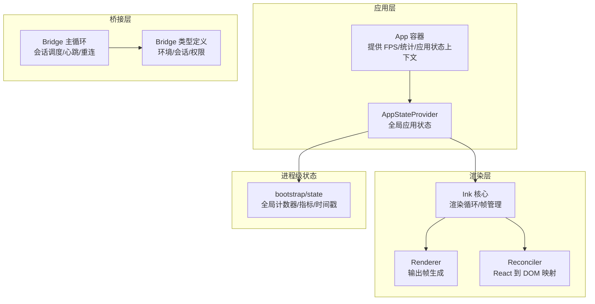
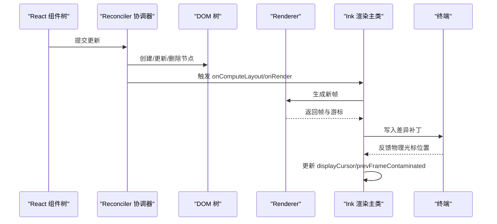
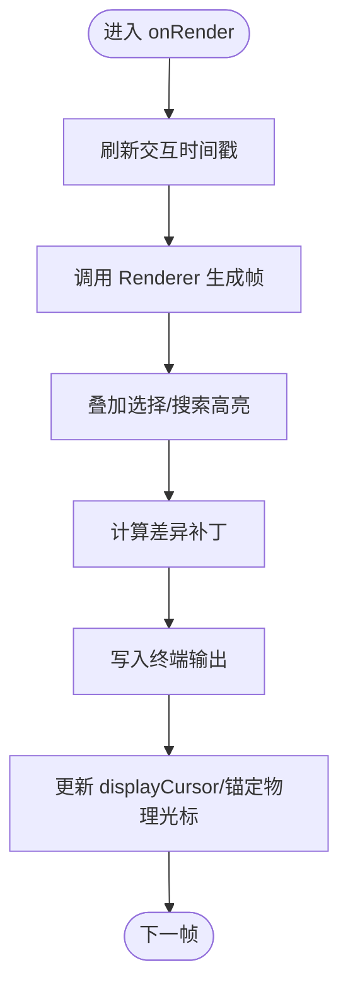
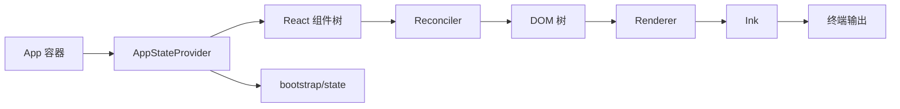
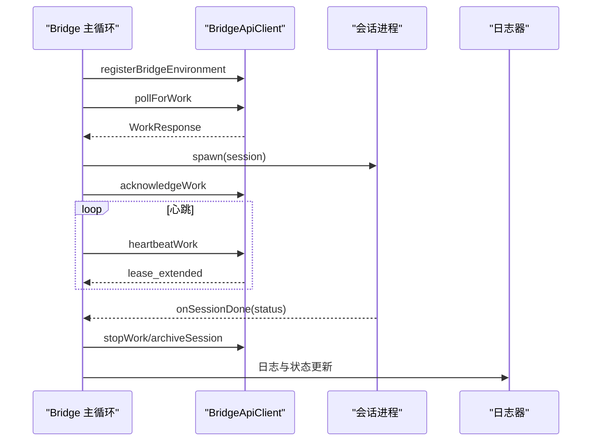
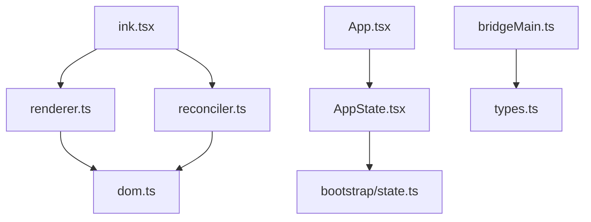

# 组件架构设计

<cite>
**本文引用的文件**
- [src/components/App.tsx](file://src/components/App.tsx)
- [src/ink/ink.tsx](file://src/ink/ink.tsx)
- [src/ink/renderer.ts](file://src/ink/renderer.ts)
- [src/ink/reconciler.ts](file://src/ink/reconciler.ts)
- [src/bootstrap/state.ts](file://src/bootstrap/state.ts)
- [src/state/AppState.tsx](file://src/state/AppState.tsx)
- [src/state/AppStateStore.ts](file://src/state/AppStateStore.ts)
- [src/bridge/bridgeMain.ts](file://src/bridge/bridgeMain.ts)
- [src/bridge/types.ts](file://src/bridge/types.ts)
</cite>

## 目录
1. [简介](#简介)
2. [项目结构](#项目结构)
3. [核心组件](#核心组件)
4. [架构总览](#架构总览)
5. [详细组件分析](#详细组件分析)
6. [依赖关系分析](#依赖关系分析)
7. [性能考量](#性能考量)
8. [故障排查指南](#故障排查指南)
9. [结论](#结论)
10. [附录](#附录)

## 简介
本文件面向前端开发者，系统性阐述 Claude Code 的组件架构设计与实现细节，重点覆盖以下方面：
- 组件系统整体架构：组件分类体系、组件通信机制、组件生命周期管理
- Ink 渲染器工作原理与终端 UI 特殊考虑（布局、光标、选择、高亮等）
- 组件状态管理、事件处理与样式系统
- 组件间依赖关系与数据流
- 组件开发设计原则与最佳实践
- 性能优化策略与调试技巧

## 项目结构
该项目采用“功能域 + 层次化”的组织方式：
- components：可复用 UI 组件与页面容器
- state：应用全局状态与上下文
- bootstrap：进程级全局状态与运行时配置
- ink：自研终端渲染引擎（基于 React Reconciler + Yoga 布局）
- bridge：远程桥接与会话管理
- 其他目录：命令、工具、服务、hooks 等

图示来源
- [src/components/App.tsx:15-56](file://src/components/App.tsx#L15-L56)
- [src/ink/ink.tsx:76-279](file://src/ink/ink.tsx#L76-L279)
- [src/ink/renderer.ts:31-179](file://src/ink/renderer.ts#L31-L179)
- [src/ink/reconciler.ts:224-513](file://src/ink/reconciler.ts#L224-L513)
- [src/bootstrap/state.ts:45-257](file://src/bootstrap/state.ts#L45-L257)
- [src/bridge/bridgeMain.ts:141-800](file://src/bridge/bridgeMain.ts#L141-L800)
- [src/bridge/types.ts:81-263](file://src/bridge/types.ts#L81-L263)

章节来源
- [src/components/App.tsx:15-56](file://src/components/App.tsx#L15-L56)
- [src/ink/ink.tsx:76-279](file://src/ink/ink.tsx#L76-L279)
- [src/ink/renderer.ts:31-179](file://src/ink/renderer.ts#L31-L179)
- [src/ink/reconciler.ts:224-513](file://src/ink/reconciler.ts#L224-L513)
- [src/bootstrap/state.ts:45-257](file://src/bootstrap/state.ts#L45-L257)
- [src/bridge/bridgeMain.ts:141-800](file://src/bridge/bridgeMain.ts#L141-L800)
- [src/bridge/types.ts:81-263](file://src/bridge/types.ts#L81-L263)

## 核心组件
- 应用容器与上下文
  - App：顶层容器，注入 FPS 指标、统计上下文与应用状态
  - AppStateProvider：全局应用状态上下文，支持订阅与设置
- 渲染引擎
  - Ink：终端渲染主类，负责帧计算、差异写入、光标定位、选择与高亮
  - Renderer：根据 Yoga 布局生成屏幕帧
  - Reconciler：React 到 DOM 的协调器，驱动布局与事件
- 进程级状态
  - bootstrap/state：全局计数器、指标、交互时间、会话信息等
- 桥接系统
  - bridgeMain：桥接主循环，会话调度、心跳、重连、容量唤醒
  - types：桥接协议与类型定义

章节来源
- [src/components/App.tsx:15-56](file://src/components/App.tsx#L15-L56)
- [src/state/AppState.tsx:27-110](file://src/state/AppState.tsx#L27-L110)
- [src/state/AppStateStore.ts:89-452](file://src/state/AppStateStore.ts#L89-L452)
- [src/ink/ink.tsx:76-279](file://src/ink/ink.tsx#L76-L279)
- [src/ink/renderer.ts:31-179](file://src/ink/renderer.ts#L31-L179)
- [src/ink/reconciler.ts:224-513](file://src/ink/reconciler.ts#L224-L513)
- [src/bootstrap/state.ts:45-257](file://src/bootstrap/state.ts#L45-L257)
- [src/bridge/bridgeMain.ts:141-800](file://src/bridge/bridgeMain.ts#L141-L800)
- [src/bridge/types.ts:81-263](file://src/bridge/types.ts#L81-L263)

## 架构总览
Ink 渲染器以 React 为声明式入口，通过自定义 Reconciler 将虚拟节点映射到终端 DOM，并使用 Yoga 计算布局。渲染主类 Ink 负责帧生成、差异计算与输出写入；应用状态通过 AppStateProvider 注入到组件树；进程级状态在 bootstrap/state 中集中维护。

图示来源
- [src/ink/reconciler.ts:247-315](file://src/ink/reconciler.ts#L247-L315)
- [src/ink/renderer.ts:31-179](file://src/ink/renderer.ts#L31-L179)
- [src/ink/ink.tsx:420-790](file://src/ink/ink.tsx#L420-L790)

章节来源
- [src/ink/ink.tsx:420-790](file://src/ink/ink.tsx#L420-L790)
- [src/ink/renderer.ts:31-179](file://src/ink/renderer.ts#L31-L179)
- [src/ink/reconciler.ts:247-315](file://src/ink/reconciler.ts#L247-L315)

## 详细组件分析

### 组件分类体系
- 页面容器与布局
  - App：顶层容器，注入 FPS、统计与应用状态
  - FullscreenLayout、VirtualMessageList 等：布局与滚动控制
- 输入与交互
  - PromptInput、TextInput、VimTextInput：输入组件
  - 键盘/鼠标事件处理：焦点管理、选择、搜索高亮
- 结果展示
  - Message、Messages、Markdown、StructuredDiff：消息与差异展示
- 设置与对话框
  - Settings、BridgeDialog、ThemePicker、Feedback 等：配置与反馈
- 工具与任务
  - TaskListV2、AgentProgressLine：任务与进度
- 设计系统与 Hooks
  - design-system、hooks：通用样式与行为钩子

章节来源
- [src/components/App.tsx:15-56](file://src/components/App.tsx#L15-L56)

### 组件通信机制
- 上下文注入
  - App 提供 FPS、统计与应用状态上下文，子树按需消费
- 状态订阅
  - AppStateProvider 使用 useSyncExternalStore 实现细粒度订阅
  - 支持 selector 选择器避免不必要重渲染
- 事件分发
  - 自定义 Dispatcher 将离散事件注入 Reconciler，确保事件优先级与时间戳一致

章节来源
- [src/components/App.tsx:15-56](file://src/components/App.tsx#L15-L56)
- [src/state/AppState.tsx:142-179](file://src/state/AppState.tsx#L142-L179)
- [src/ink/reconciler.ts:187-506](file://src/ink/reconciler.ts#L187-L506)

### 组件生命周期管理
- 渲染周期
  - Reconciler 在提交后触发 onComputeLayout（计算 Yoga 布局）与 onRender（生成帧）
  - Ink.onRender 负责差异计算、光标移动、选择与高亮叠加、输出写入
- 暂停/恢复
  - Ink.pause/resume 控制渲染循环，用于与外部 TUI（如编辑器）协作
- 生命周期钩子
  - 组件挂载时 autoFocus 处理；节点移除时清理 Yoga 引用与焦点管理

章节来源
- [src/ink/reconciler.ts:247-315](file://src/ink/reconciler.ts#L247-L315)
- [src/ink/ink.tsx:790-800](file://src/ink/ink.tsx#L790-L800)
- [src/ink/reconciler.ts:401-424](file://src/ink/reconciler.ts#L401-L424)

### Ink 渲染器工作原理与终端 UI 特殊考虑
- 布局与帧
  - Renderer 基于 Yoga 计算布局，生成屏幕帧；支持主屏与备用屏模式
  - Ink.onRender 计算差异补丁，进行全量或增量输出
- 光标与选择
  - 声明式光标定位：组件可通过 useDeclaredCursor 声明输入光标位置
  - 选择与搜索高亮：在帧缓冲上叠加样式，确保与差异引擎兼容
- 自适应与稳定性
  - alt-screen 模式下锚定物理光标，避免外设刷新导致的漂移
  - prevFrameContaminated 标记防止脏帧复制，保证 blit 正确性
- 性能路径
  - 稳态帧走增量 diff；布局变化或选择/高亮时走全量 damage

图示来源
- [src/ink/ink.tsx:420-790](file://src/ink/ink.tsx#L420-L790)
- [src/ink/renderer.ts:105-177](file://src/ink/renderer.ts#L105-L177)

章节来源
- [src/ink/ink.tsx:420-790](file://src/ink/ink.tsx#L420-L790)
- [src/ink/renderer.ts:105-177](file://src/ink/renderer.ts#L105-L177)

### 组件状态管理、事件处理与样式系统
- 状态管理
  - AppStateStore：集中存储应用状态，支持深不可变与选择器订阅
  - AppStateProvider：提供 setState 与订阅能力，结合 useSettingsChange 同步外部设置变更
- 事件处理
  - Dispatcher：统一事件优先级与时间戳，避免竞态
  - Reconciler.commitUpdate：按属性差异应用样式与事件处理器
- 样式系统
  - DOM 节点样式通过 setStyle 与 applyStyles(Yoga) 应用
  - 文本样式通过 textStyles 传递，支持虚拟文本节点

章节来源
- [src/state/AppStateStore.ts:89-452](file://src/state/AppStateStore.ts#L89-L452)
- [src/state/AppState.tsx:27-110](file://src/state/AppState.tsx#L27-L110)
- [src/ink/reconciler.ts:121-143](file://src/ink/reconciler.ts#L121-L143)
- [src/ink/reconciler.ts:426-459](file://src/ink/reconciler.ts#L426-L459)

### 组件间依赖关系与数据流向
- 数据流
  - App → AppStateProvider → React 组件树
  - React 组件 → Reconciler → DOM → Renderer → Ink → 终端
- 依赖耦合
  - Ink 与 Reconciler 低耦合：通过接口与回调解耦
  - AppState 与 bootstrap/state：前者面向 UI，后者面向进程级指标与时间

图示来源
- [src/components/App.tsx:15-56](file://src/components/App.tsx#L15-L56)
- [src/state/AppState.tsx:27-110](file://src/state/AppState.tsx#L27-L110)
- [src/ink/reconciler.ts:224-513](file://src/ink/reconciler.ts#L224-L513)
- [src/ink/renderer.ts:31-179](file://src/ink/renderer.ts#L31-L179)
- [src/ink/ink.tsx:76-279](file://src/ink/ink.tsx#L76-L279)
- [src/bootstrap/state.ts:45-257](file://src/bootstrap/state.ts#L45-L257)

章节来源
- [src/components/App.tsx:15-56](file://src/components/App.tsx#L15-L56)
- [src/state/AppState.tsx:27-110](file://src/state/AppState.tsx#L27-L110)
- [src/ink/reconciler.ts:224-513](file://src/ink/reconciler.ts#L224-L513)
- [src/ink/renderer.ts:31-179](file://src/ink/renderer.ts#L31-L179)
- [src/ink/ink.tsx:76-279](file://src/ink/ink.tsx#L76-L279)
- [src/bootstrap/state.ts:45-257](file://src/bootstrap/state.ts#L45-L257)

### 桥接系统与远程会话
- 桥接主循环
  - runBridgeLoop：轮询工作项、会话管理、心跳、重连、容量唤醒
  - 支持多会话模式、容量控制与超时管理
- 协议与类型
  - BridgeApiClient：注册环境、轮询工作、确认工作、停止工作、归档会话、心跳
  - SessionHandle：会话生命周期与令牌更新
  - 类型定义涵盖工作密钥、活动记录、权限响应等

图示来源
- [src/bridge/bridgeMain.ts:141-800](file://src/bridge/bridgeMain.ts#L141-L800)
- [src/bridge/types.ts:133-176](file://src/bridge/types.ts#L133-L176)
- [src/bridge/types.ts:178-211](file://src/bridge/types.ts#L178-L211)

章节来源
- [src/bridge/bridgeMain.ts:141-800](file://src/bridge/bridgeMain.ts#L141-L800)
- [src/bridge/types.ts:133-176](file://src/bridge/types.ts#L133-L176)
- [src/bridge/types.ts:178-211](file://src/bridge/types.ts#L178-L211)

## 依赖关系分析
- 组件内聚与解耦
  - Ink 与 Reconciler 通过接口解耦，便于替换渲染后端
  - AppStateProvider 仅暴露最小状态接口，降低对上层组件的耦合
- 外部依赖
  - Yoga 布局引擎：用于高性能布局计算
  - React Reconciler：统一更新与事件模型
  - 终端协议：CSI/DEC/OSC 控制序列，支持鼠标、键盘与扩展键
- 循环依赖规避
  - 通过模块拆分与延迟导入避免循环引用

图示来源
- [src/ink/ink.tsx:76-279](file://src/ink/ink.tsx#L76-L279)
- [src/ink/renderer.ts:31-179](file://src/ink/renderer.ts#L31-L179)
- [src/ink/reconciler.ts:224-513](file://src/ink/reconciler.ts#L224-L513)
- [src/components/App.tsx:15-56](file://src/components/App.tsx#L15-L56)
- [src/state/AppState.tsx:27-110](file://src/state/AppState.tsx#L27-L110)
- [src/bootstrap/state.ts:45-257](file://src/bootstrap/state.ts#L45-L257)
- [src/bridge/bridgeMain.ts:141-800](file://src/bridge/bridgeMain.ts#L141-L800)
- [src/bridge/types.ts:81-263](file://src/bridge/types.ts#L81-L263)

章节来源
- [src/ink/ink.tsx:76-279](file://src/ink/ink.tsx#L76-L279)
- [src/ink/renderer.ts:31-179](file://src/ink/renderer.ts#L31-L179)
- [src/ink/reconciler.ts:224-513](file://src/ink/reconciler.ts#L224-L513)
- [src/components/App.tsx:15-56](file://src/components/App.tsx#L15-L56)
- [src/state/AppState.tsx:27-110](file://src/state/AppState.tsx#L27-L110)
- [src/bootstrap/state.ts:45-257](file://src/bootstrap/state.ts#L45-L257)
- [src/bridge/bridgeMain.ts:141-800](file://src/bridge/bridgeMain.ts#L141-L800)
- [src/bridge/types.ts:81-263](file://src/bridge/types.ts#L81-L263)

## 性能考量
- 布局与渲染
  - Yoga 布局缓存与增量 diff：减少重复计算
  - 稳态帧走增量输出，布局变化时走全量 damage
- 事件与更新
  - 事件优先级与批处理：Dispatcher 与 discreteUpdates 降低抖动
  - useSyncExternalStore：细粒度订阅，避免无关重渲染
- 终端输出
  - 优化差异补丁顺序，减少光标移动与闪烁
  - 5 分钟一次的字符/超链接池重置，平衡内存与性能
- 进程级指标
  - bootstrap/state 提供交互时间戳与计数器，便于性能分析与告警

章节来源
- [src/ink/ink.tsx:600-790](file://src/ink/ink.tsx#L600-L790)
- [src/ink/renderer.ts:114-149](file://src/ink/renderer.ts#L114-L149)
- [src/ink/reconciler.ts:247-315](file://src/ink/reconciler.ts#L247-L315)
- [src/bootstrap/state.ts:680-795](file://src/bootstrap/state.ts#L680-L795)

## 故障排查指南
- 渲染问题
  - 检查 Yoga 布局维度是否有效（高度/宽度必须有限且非负）
  - 关注 debugRepaints 环境变量，启用调试重绘链路
- 事件与焦点
  - 确认事件处理器正确绑定，避免在文本节点中嵌套 Box
  - 检查焦点管理器与 autoFocus 行为
- 终端光标与选择
  - 若出现光标漂移，检查 alt-screen 模式下的物理光标锚定逻辑
  - 选择/高亮叠加后需标记 prevFrameContaminated，确保下一帧全量绘制
- 桥接与会话
  - 心跳失败与 401/403：触发服务器重新派发工作
  - 容量唤醒：会话结束应唤醒睡眠，立即接受新工作

章节来源
- [src/ink/renderer.ts:52-82](file://src/ink/renderer.ts#L52-L82)
- [src/ink/reconciler.ts:338-400](file://src/ink/reconciler.ts#L338-L400)
- [src/bridge/bridgeMain.ts:202-270](file://src/bridge/bridgeMain.ts#L202-L270)
- [src/bridge/bridgeMain.ts:442-591](file://src/bridge/bridgeMain.ts#L442-L591)

## 结论
该架构以 React 为声明入口，Ink 为终端渲染核心，配合 AppStateProvider 与 bootstrap/state 实现了清晰的状态与生命周期管理。通过 Yoga 布局与增量 diff，系统在终端 UI 场景下实现了高效稳定的渲染路径；桥接系统则提供了可扩展的远程会话管理能力。遵循本文的设计原则与最佳实践，可在保证性能的同时提升组件可维护性与可测试性。

## 附录
- 设计原则与最佳实践
  - 保持组件职责单一，通过上下文与状态共享实现解耦
  - 使用 selector 与细粒度订阅，避免不必要的重渲染
  - 事件处理统一通过 Dispatcher，确保优先级与时序一致性
  - 终端 UI 遵循 Ink 的光标、选择与高亮约束，避免跨帧状态不一致
- 调试技巧
  - 启用 CLAUDE_CODE_DEBUG_REPAINTS 查看重绘链路
  - 使用 COMMIT_LOG 观察提交与布局耗时
  - 通过环境变量控制扩展键与修改其他键报告，减少终端编辑器干扰