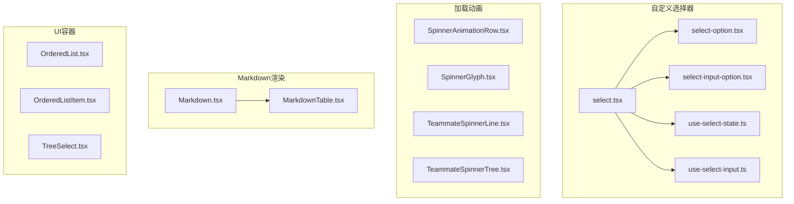
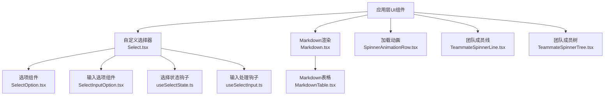
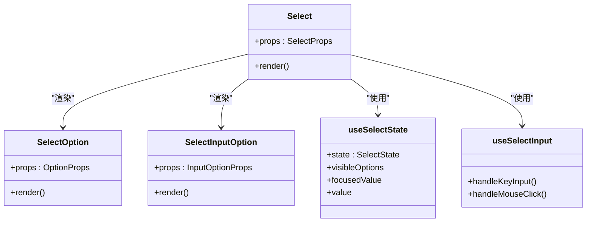
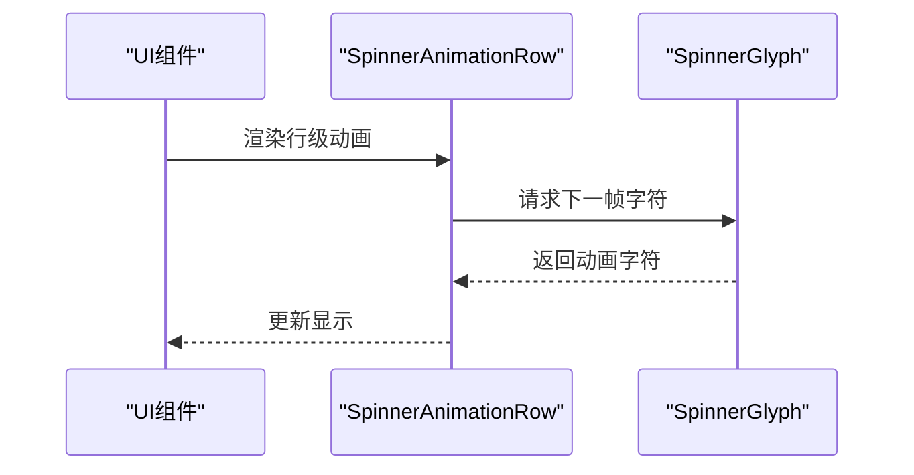
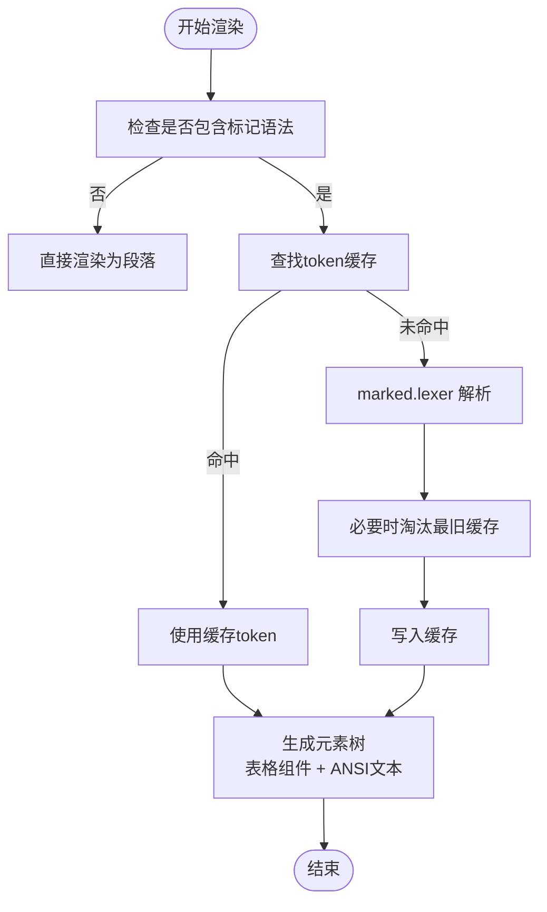
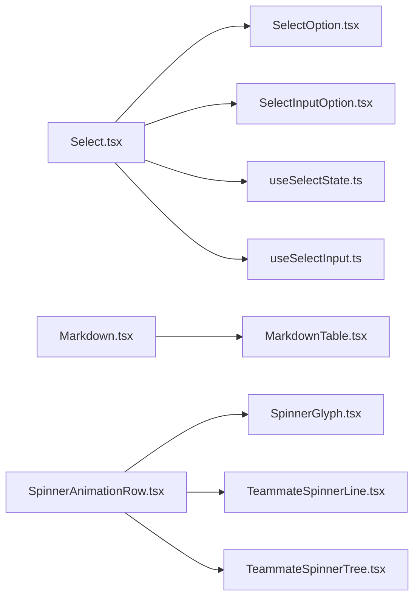

# UI系统组件

<cite>
**本文档引用的文件**
- [src/components/CustomSelect/select.tsx](file://src/components/CustomSelect/select.tsx)
- [src/components/CustomSelect/select-option.tsx](file://src/components/CustomSelect/select-option.tsx)
- [src/components/CustomSelect/select-input-option.tsx](file://src/components/CustomSelect/select-input-option.tsx)
- [src/components/CustomSelect/use-select-state.ts](file://src/components/CustomSelect/use-select-state.ts)
- [src/components/CustomSelect/use-select-input.ts](file://src/components/CustomSelect/use-select-input.ts)
- [src/components/Spinner/SpinnerAnimationRow.tsx](file://src/components/Spinner/SpinnerAnimationRow.tsx)
- [src/components/Spinner/SpinnerGlyph.tsx](file://src/components/Spinner/SpinnerGlyph.tsx)
- [src/components/Spinner/TeammateSpinnerLine.tsx](file://src/components/Spinner/TeammateSpinnerLine.tsx)
- [src/components/Spinner/TeammateSpinnerTree.tsx](file://src/components/Spinner/TeammateSpinnerTree.tsx)
- [src/components/Markdown.tsx](file://src/components/Markdown.tsx)
- [src/components/MarkdownTable.tsx](file://src/components/MarkdownTable.tsx)
- [src/components/ui/OrderedList.tsx](file://src/components/ui/OrderedList.tsx)
- [src/components/ui/OrderedListItem.tsx](file://src/components/ui/OrderedListItem.tsx)
- [src/components/ui/TreeSelect.tsx](file://src/components/ui/TreeSelect.tsx)
</cite>

## 目录
1. [简介](#简介)
2. [项目结构](#项目结构)
3. [核心组件](#核心组件)
4. [架构总览](#架构总览)
5. [详细组件分析](#详细组件分析)
6. [依赖关系分析](#依赖关系分析)
7. [性能考量](#性能考量)
8. [故障排除指南](#故障排除指南)
9. [结论](#结论)
10. [附录](#附录)

## 简介
本文件系统性梳理并深入解析该代码库中的UI系统组件，重点覆盖以下方面：
- 自定义选择器组件：支持多种布局、输入选项、图片粘贴与编辑器集成等高级交互
- 加载动画组件：多形态的旋转指示器与团队成员状态动画
- Markdown 渲染组件：高性能标记解析、流式渲染与语法高亮集成
- 对话框组件：树形选择与有序列表等UI容器组件

文档将从架构、数据流、处理逻辑、集成点、错误处理与性能特性等维度进行剖析，并提供属性、事件、样式定制与扩展方法，帮助开发者快速上手与深度定制。

## 项目结构
UI相关组件主要分布在以下路径：
- 自定义选择器：src/components/CustomSelect/*
- 加载动画：src/components/Spinner/*
- Markdown 渲染：src/components/Markdown.tsx 与 MarkdownTable.tsx
- UI 容器与选择：src/components/ui/*

**图表来源**
- [src/components/CustomSelect/select.tsx:192-623](file://src/components/CustomSelect/select.tsx#L192-L623)
- [src/components/CustomSelect/select-option.tsx](file://src/components/CustomSelect/select-option.tsx)
- [src/components/CustomSelect/select-input-option.tsx](file://src/components/CustomSelect/select-input-option.tsx)
- [src/components/CustomSelect/use-select-state.ts](file://src/components/CustomSelect/use-select-state.ts)
- [src/components/CustomSelect/use-select-input.ts](file://src/components/CustomSelect/use-select-input.ts)
- [src/components/Spinner/SpinnerAnimationRow.tsx](file://src/components/Spinner/SpinnerAnimationRow.tsx)
- [src/components/Spinner/SpinnerGlyph.tsx](file://src/components/Spinner/SpinnerGlyph.tsx)
- [src/components/Spinner/TeammateSpinnerLine.tsx](file://src/components/Spinner/TeammateSpinnerLine.tsx)
- [src/components/Spinner/TeammateSpinnerTree.tsx](file://src/components/Spinner/TeammateSpinnerTree.tsx)
- [src/components/Markdown.tsx:78-171](file://src/components/Markdown.tsx#L78-L171)
- [src/components/MarkdownTable.tsx](file://src/components/MarkdownTable.tsx)
- [src/components/ui/OrderedList.tsx](file://src/components/ui/OrderedList.tsx)
- [src/components/ui/OrderedListItem.tsx](file://src/components/ui/OrderedListItem.tsx)
- [src/components/ui/TreeSelect.tsx](file://src/components/ui/TreeSelect.tsx)

**章节来源**
- [src/components/CustomSelect/select.tsx:192-623](file://src/components/CustomSelect/select.tsx#L192-L623)
- [src/components/Spinner/SpinnerAnimationRow.tsx](file://src/components/Spinner/SpinnerAnimationRow.tsx)
- [src/components/Markdown.tsx:78-171](file://src/components/Markdown.tsx#L78-L171)
- [src/components/ui/OrderedList.tsx](file://src/components/ui/OrderedList.tsx)

## 核心组件
本节概述四大UI组件的核心职责与能力边界：
- 自定义选择器（Select）：提供多布局、可内嵌输入、图片粘贴、外部编辑器集成、焦点与滚动控制等
- 加载动画（Spinner系列）：提供行级动画、字符闪烁、团队成员树状/线性状态动画
- Markdown 渲染（Markdown/StreamingMarkdown）：高性能解析、缓存、ANSI格式化、表格组件、流式增量渲染
- 对话框/容器（TreeSelect、OrderedList、OrderedListItem）：树形选择与有序列表展示

**章节来源**
- [src/components/CustomSelect/select.tsx:192-623](file://src/components/CustomSelect/select.tsx#L192-L623)
- [src/components/Spinner/SpinnerAnimationRow.tsx](file://src/components/Spinner/SpinnerAnimationRow.tsx)
- [src/components/Markdown.tsx:78-171](file://src/components/Markdown.tsx#L78-L171)
- [src/components/ui/TreeSelect.tsx](file://src/components/ui/TreeSelect.tsx)
- [src/components/ui/OrderedList.tsx](file://src/components/ui/OrderedList.tsx)
- [src/components/ui/OrderedListItem.tsx](file://src/components/ui/OrderedListItem.tsx)

## 架构总览
下图展示UI组件的高层交互与依赖关系：

**图表来源**
- [src/components/CustomSelect/select.tsx:192-623](file://src/components/CustomSelect/select.tsx#L192-L623)
- [src/components/CustomSelect/select-option.tsx](file://src/components/CustomSelect/select-option.tsx)
- [src/components/CustomSelect/select-input-option.tsx](file://src/components/CustomSelect/select-input-option.tsx)
- [src/components/CustomSelect/use-select-state.ts](file://src/components/CustomSelect/use-select-state.ts)
- [src/components/CustomSelect/use-select-input.ts](file://src/components/CustomSelect/use-select-input.ts)
- [src/components/Markdown.tsx:78-171](file://src/components/Markdown.tsx#L78-L171)
- [src/components/MarkdownTable.tsx](file://src/components/MarkdownTable.tsx)
- [src/components/Spinner/SpinnerAnimationRow.tsx](file://src/components/Spinner/SpinnerAnimationRow.tsx)
- [src/components/Spinner/TeammateSpinnerLine.tsx](file://src/components/Spinner/TeammateSpinnerLine.tsx)
- [src/components/Spinner/TeammateSpinnerTree.tsx](file://src/components/Spinner/TeammateSpinnerTree.tsx)

## 详细组件分析

### 自定义选择器组件（Select）
- 组件职责
  - 提供三种布局模式：紧凑、展开、紧凑垂直
  - 支持普通选项与“输入型”选项（可内联编辑、占位符、初始值、空提交行为）
  - 图片粘贴与移除、外部编辑器触发、光标重置策略
  - 焦点与选中状态管理、滚动边界回调、禁用态与只读态
- 关键属性（部分）
  - isDisabled：禁用用户输入
  - disableSelection：阻止回车选择，仅允许滚动
  - hideIndexes：隐藏序号索引
  - visibleOptionCount：可见选项数量
  - highlightText：高亮匹配文本
  - options：选项数组（含描述、禁用、输入型等）
  - defaultValue/defaultFocusValue：默认值与初始聚焦值
  - layout：布局模式
  - inlineDescriptions：内联描述
  - onUpFromFirstItem/onDownFromLastItem：滚动边界回调
  - onInputModeToggle：切换输入模式
  - onOpenEditor：打开外部编辑器
  - onImagePaste/onRemoveImage：图片粘贴与移除
  - pastedContents：粘贴内容映射
- 事件回调
  - onCancel：取消
  - onChange：选中值变更
  - onFocus：焦点值变更（单向通知）
- 内部机制
  - useSelectState：维护选项列表、可见范围、当前值与焦点值
  - useSelectInput：键盘与鼠标交互处理（上下移动、选择、输入、图片选择）
  - 输入型选项通过内部 Map 管理每个选项的输入值，支持初始值同步与异步更新
  - 布局渲染按需计算最大标签宽度，两列布局时对齐描述列

**图表来源**
- [src/components/CustomSelect/select.tsx:192-623](file://src/components/CustomSelect/select.tsx#L192-L623)
- [src/components/CustomSelect/select-option.tsx](file://src/components/CustomSelect/select-option.tsx)
- [src/components/CustomSelect/select-input-option.tsx](file://src/components/CustomSelect/select-input-option.tsx)
- [src/components/CustomSelect/use-select-state.ts](file://src/components/CustomSelect/use-select-state.ts)
- [src/components/CustomSelect/use-select-input.ts](file://src/components/CustomSelect/use-select-input.ts)

**章节来源**
- [src/components/CustomSelect/select.tsx:28-191](file://src/components/CustomSelect/select.tsx#L28-L191)
- [src/components/CustomSelect/select.tsx:192-623](file://src/components/CustomSelect/select.tsx#L192-L623)
- [src/components/CustomSelect/select-option.tsx](file://src/components/CustomSelect/select-option.tsx)
- [src/components/CustomSelect/select-input-option.tsx](file://src/components/CustomSelect/select-input-option.tsx)
- [src/components/CustomSelect/use-select-state.ts](file://src/components/CustomSelect/use-select-state.ts)
- [src/components/CustomSelect/use-select-input.ts](file://src/components/CustomSelect/use-select-input.ts)

### 加载动画组件（Spinner系列）
- 组件职责
  - 行级动画：逐行推进的旋转指示器
  - 字符闪烁：单字符闪烁效果
  - 团队成员线性/树状：展示多个成员的加载状态
- 典型用法
  - 在长时间任务或远程调用期间显示进度
  - 可根据主题与尺寸进行样式定制
- 扩展建议
  - 可通过主题变量与尺寸参数实现统一风格
  - 可结合状态机在不同阶段切换动画类型

**图表来源**
- [src/components/Spinner/SpinnerAnimationRow.tsx](file://src/components/Spinner/SpinnerAnimationRow.tsx)
- [src/components/Spinner/SpinnerGlyph.tsx](file://src/components/Spinner/SpinnerGlyph.tsx)

**章节来源**
- [src/components/Spinner/SpinnerAnimationRow.tsx](file://src/components/Spinner/SpinnerAnimationRow.tsx)
- [src/components/Spinner/SpinnerGlyph.tsx](file://src/components/Spinner/SpinnerGlyph.tsx)
- [src/components/Spinner/TeammateSpinnerLine.tsx](file://src/components/Spinner/TeammateSpinnerLine.tsx)
- [src/components/Spinner/TeammateSpinnerTree.tsx](file://src/components/Spinner/TeammateSpinnerTree.tsx)

### Markdown 渲染组件（Markdown/StreamingMarkdown）
- 组件职责
  - 使用 marked 解析标记，缓存 token 以提升虚拟滚动性能
  - 表格使用专用组件渲染，其他内容通过 ANSI 文本输出
  - 支持语法高亮与延迟加载，避免首屏阻塞
  - 流式渲染：按块边界增量解析，稳定前缀复用，不稳定后缀增量渲染
- 性能优化
  - 模块级 token 缓存（LRU 驱动），基于内容哈希键
  - 快速路径：无标记语法时直接作为段落渲染
  - 流式渲染：仅解析新增块，避免全量重算
- 关键属性
  - children：Markdown 文本
  - dimColor：整体颜色淡化
  - StreamingMarkdown：children 为流式增量文本
- 事件与扩展
  - 通过设置禁用语法高亮实现降级渲染
  - 可结合主题与高亮模块实现样式与配色定制

**图表来源**
- [src/components/Markdown.tsx:37-71](file://src/components/Markdown.tsx#L37-L71)
- [src/components/Markdown.tsx:123-171](file://src/components/Markdown.tsx#L123-L171)
- [src/components/Markdown.tsx:186-235](file://src/components/Markdown.tsx#L186-L235)

**章节来源**
- [src/components/Markdown.tsx:11-15](file://src/components/Markdown.tsx#L11-L15)
- [src/components/Markdown.tsx:37-71](file://src/components/Markdown.tsx#L37-L71)
- [src/components/Markdown.tsx:123-171](file://src/components/Markdown.tsx#L123-L171)
- [src/components/Markdown.tsx:186-235](file://src/components/Markdown.tsx#L186-L235)
- [src/components/MarkdownTable.tsx](file://src/components/MarkdownTable.tsx)

### 对话框/容器组件（TreeSelect、OrderedList、OrderedListItem）
- TreeSelect：树形选择容器，支持层级展开与选择
- OrderedList/OrderedListItem：有序列表与条目，用于结构化展示
- 设计原则
  - 语义化结构，便于无障碍访问
  - 与主题系统解耦，通过样式变量实现统一风格
  - 可组合性强，支持自定义渲染与交互

**章节来源**
- [src/components/ui/TreeSelect.tsx](file://src/components/ui/TreeSelect.tsx)
- [src/components/ui/OrderedList.tsx](file://src/components/ui/OrderedList.tsx)
- [src/components/ui/OrderedListItem.tsx](file://src/components/ui/OrderedListItem.tsx)

## 依赖关系分析
- 自定义选择器
  - Select 依赖 SelectOption/SelectInputOption 进行渲染
  - 通过 useSelectState/useSelectInput 管理状态与交互
- Markdown 渲染
  - Markdown 依赖 MarkdownTable 与 ANSI 输出
  - 通过缓存与流式算法降低重排成本
- 加载动画
  - 各子组件独立，通过统一的动画序列与主题变量协作
- UI 容器
  - TreeSelect、OrderedList/Item 为纯展示组件，依赖主题与布局系统

**图表来源**
- [src/components/CustomSelect/select.tsx:192-623](file://src/components/CustomSelect/select.tsx#L192-L623)
- [src/components/CustomSelect/select-option.tsx](file://src/components/CustomSelect/select-option.tsx)
- [src/components/CustomSelect/select-input-option.tsx](file://src/components/CustomSelect/select-input-option.tsx)
- [src/components/CustomSelect/use-select-state.ts](file://src/components/CustomSelect/use-select-state.ts)
- [src/components/CustomSelect/use-select-input.ts](file://src/components/CustomSelect/use-select-input.ts)
- [src/components/Markdown.tsx:78-171](file://src/components/Markdown.tsx#L78-L171)
- [src/components/MarkdownTable.tsx](file://src/components/MarkdownTable.tsx)
- [src/components/Spinner/SpinnerAnimationRow.tsx](file://src/components/Spinner/SpinnerAnimationRow.tsx)
- [src/components/Spinner/SpinnerGlyph.tsx](file://src/components/Spinner/SpinnerGlyph.tsx)
- [src/components/Spinner/TeammateSpinnerLine.tsx](file://src/components/Spinner/TeammateSpinnerLine.tsx)
- [src/components/Spinner/TeammateSpinnerTree.tsx](file://src/components/Spinner/TeammateSpinnerTree.tsx)

**章节来源**
- [src/components/CustomSelect/select.tsx:192-623](file://src/components/CustomSelect/select.tsx#L192-L623)
- [src/components/Markdown.tsx:78-171](file://src/components/Markdown.tsx#L78-L171)
- [src/components/Spinner/SpinnerAnimationRow.tsx](file://src/components/Spinner/SpinnerAnimationRow.tsx)

## 性能考量
- 自定义选择器
  - 通过可见范围裁剪与布局优化减少渲染节点数
  - 输入型选项的值管理采用 Map，避免不必要的重渲染
- Markdown 渲染
  - 模块级 token 缓存（LRU），基于内容哈希键，滚动回看不重复解析
  - 快速路径：无标记语法时直接渲染为段落
  - 流式渲染：仅解析新增块，稳定前缀复用
- 加载动画
  - 动画序列与字符资源分离，按需渲染，避免阻塞主线程

**章节来源**
- [src/components/CustomSelect/select.tsx:37-71](file://src/components/CustomSelect/select.tsx#L37-L71)
- [src/components/Markdown.tsx:22-71](file://src/components/Markdown.tsx#L22-L71)
- [src/components/Markdown.tsx:186-235](file://src/components/Markdown.tsx#L186-L235)

## 故障排除指南
- 自定义选择器
  - 焦点异常：确认 defaultFocusValue 与 defaultValue 设置一致；避免双向绑定导致反馈环
  - 输入型选项为空提交：根据 allowEmptySubmitToCancel 控制行为
  - 图片粘贴：确保 onImagePaste/onRemoveImage 正确传入；pastedContents 映射正确
- Markdown 渲染
  - 首次渲染卡顿：检查语法高亮模块加载策略；可降级为禁用高亮
  - 流式渲染错位：确认 children 替换时边界重置逻辑生效
- 加载动画
  - 卡顿：检查动画帧率与主题变量；避免在动画期间执行重计算

**章节来源**
- [src/components/CustomSelect/select.tsx:320-348](file://src/components/CustomSelect/select.tsx#L320-L348)
- [src/components/Markdown.tsx:81-101](file://src/components/Markdown.tsx#L81-L101)
- [src/components/Markdown.tsx:196-235](file://src/components/Markdown.tsx#L196-L235)

## 结论
该UI系统组件围绕“高性能、可定制、可扩展”的设计目标构建：
- 自定义选择器提供丰富的交互与布局能力，适合复杂配置场景
- 加载动画组件覆盖常见状态提示，具备良好的可扩展性
- Markdown 渲染在性能与功能间取得平衡，支持流式与高亮
- UI 容器组件保持简洁与可组合，便于业务扩展

建议在实际使用中：
- 明确组件职责边界，避免过度耦合
- 利用主题与样式变量统一风格
- 在长列表与流式渲染场景中关注缓存与增量更新策略
- 通过回调与状态钩子实现灵活的交互与扩展

## 附录
- 属性与事件清单（示例）
  - 自定义选择器：isDisabled、disableSelection、hideIndexes、visibleOptionCount、highlightText、options、defaultValue、onCancel、onChange、onFocus、layout、inlineDescriptions、onUpFromFirstItem、onDownFromLastItem、onInputModeToggle、onOpenEditor、onImagePaste、onRemoveImage、pastedContents
  - Markdown：children、dimColor、StreamingMarkdown 的 children
  - 加载动画：根据具体组件传入主题与尺寸参数
  - UI 容器：TreeSelect、OrderedList、OrderedListItem 的通用属性与渲染插槽