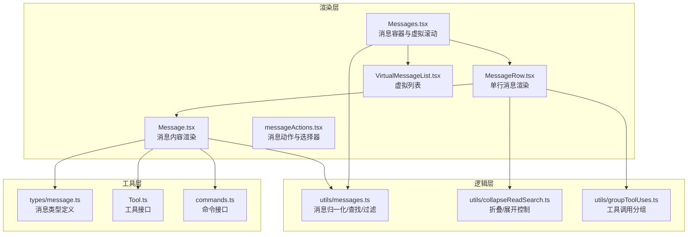
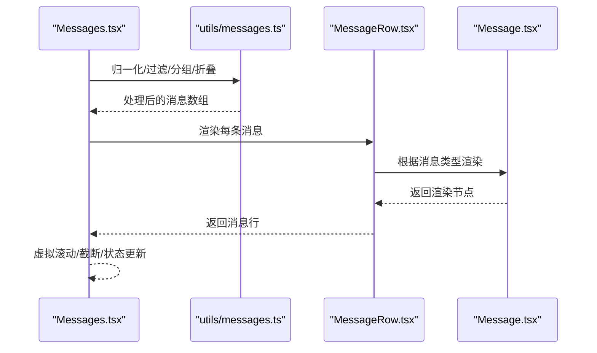
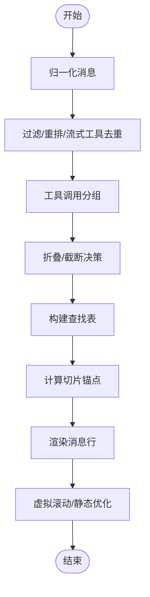
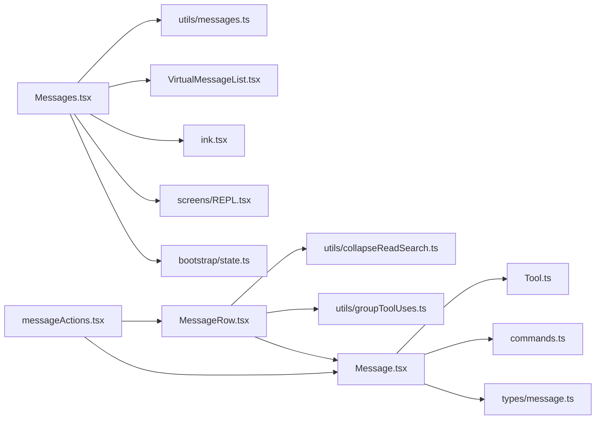

# 消息组件

<cite>
**本文档引用的文件**
- [Messages.tsx](file://src/components/Messages.tsx)
- [Message.tsx](file://src/components/Message.tsx)
- [MessageRow.tsx](file://src/components/MessageRow.tsx)
- [messageActions.tsx](file://src/components/messageActions.tsx)
- [MessageSelector.tsx](file://src/components/MessageSelector.tsx)
- [VirtualMessageList.tsx](file://src/components/VirtualMessageList.tsx)
- [MessageModel.tsx](file://src/components/MessageModel.tsx)
- [MessageTimestamp.tsx](file://src/components/MessageTimestamp.tsx)
- [OffscreenFreeze.tsx](file://src/components/OffscreenFreeze.tsx)
- [Markdown.tsx](file://src/components/Markdown.tsx)
- [messages.ts](file://src/utils/messages.ts)
- [collapseReadSearch.ts](file://src/utils/collapseReadSearch.ts)
- [groupToolUses.ts](file://src/utils/groupToolUses.ts)
- [messages.ts](file://src/types/message.ts)
- [Tool.ts](file://src/Tool.ts)
- [commands.ts](file://src/commands.ts)
- [screens/REPL.tsx](file://src/screens/REPL.tsx)
- [ink.tsx](file://src/ink.tsx)
- [useTerminalSize.ts](file://src/hooks/useTerminalSize.ts)
- [bootstrap/state.ts](file://src/bootstrap/state.ts)
- [useTerminalNotification.ts](file://src/ink/useTerminalNotification.ts)
- [statusNoticeDefinitions.tsx](file://src/components/StatusNotices.ts)
- [LogoV2.tsx](file://src/components/LogoV2/LogoV2.tsx)
- [FullscreenLayout.tsx](file://src/components/FullscreenLayout.tsx)
- [VirtualMessageList.tsx](file://src/components/VirtualMessageList.tsx)
</cite>

## 目录
1. [简介](#简介)
2. [项目结构](#项目结构)
3. [核心组件](#核心组件)
4. [架构总览](#架构总览)
5. [详细组件分析](#详细组件分析)
6. [依赖关系分析](#依赖关系分析)
7. [性能考虑](#性能考虑)
8. [故障排除指南](#故障排除指南)
9. [结论](#结论)
10. [附录](#附录)

## 简介
本文件系统性阐述消息显示系统的实现与使用方法，覆盖用户消息、助手消息、工具使用消息、系统消息等多种消息类型。内容包括：
- 消息组件的属性、事件与状态管理
- 消息渲染流程、交互机制与历史管理
- 与状态管理系统的集成方式
- 可定制性与扩展方法
- 面向开发者的使用指南与最佳实践

## 项目结构
消息系统由三层协作构成：
- 渲染层：负责将消息列表渲染为终端界面元素
- 逻辑层：负责消息的归一化、分组、折叠、查找与状态计算
- 工具层：提供工具调用、命令解析与消息类型定义

**图表来源**
- [Messages.tsx:341-721](file://src/components/Messages.tsx#L341-L721)
- [MessageRow.tsx:93-287](file://src/components/MessageRow.tsx#L93-L287)
- [Message.tsx:58-626](file://src/components/Message.tsx#L58-L626)
- [messageActions.tsx:158-187](file://src/components/messageActions.tsx#L158-L187)
- [VirtualMessageList.tsx](file://src/components/VirtualMessageList.tsx)

**章节来源**
- [Messages.tsx:1-834](file://src/components/Messages.tsx#L1-L834)
- [Message.tsx:1-627](file://src/components/Message.tsx#L1-L627)
- [MessageRow.tsx:1-383](file://src/components/MessageRow.tsx#L1-L383)
- [messageActions.tsx:1-450](file://src/components/messageActions.tsx#L1-L450)

## 核心组件
- Messages：消息容器，负责消息预处理、分组、折叠、截断与渲染；支持虚拟滚动、转录模式、简报模式等高级特性。
- MessageRow：单条消息行的渲染与布局，处理元数据显示、静态渲染优化与动画控制。
- Message：具体消息内容的渲染器，按消息类型路由到对应子组件（文本、工具调用、系统消息等）。
- messageActions：消息动作系统，提供复制、编辑、展开/折叠等交互能力，并与键盘绑定集成。

**章节来源**
- [Messages.tsx:207-778](file://src/components/Messages.tsx#L207-L778)
- [MessageRow.tsx:15-383](file://src/components/MessageRow.tsx#L15-L383)
- [Message.tsx:32-626](file://src/components/Message.tsx#L32-L626)
- [messageActions.tsx:142-271](file://src/components/messageActions.tsx#L142-L271)

## 架构总览
消息渲染采用“预处理 + 路由渲染”的双阶段设计：
- 预处理阶段：归一化消息、构建查找表、应用分组与折叠策略、决定是否截断与虚拟滚动。
- 渲染阶段：逐行渲染，根据消息类型与上下文动态选择渲染组件，支持静态渲染优化与动画控制。

**图表来源**
- [Messages.tsx:475-529](file://src/components/Messages.tsx#L475-L529)
- [MessageRow.tsx:93-287](file://src/components/MessageRow.tsx#L93-L287)
- [Message.tsx:58-230](file://src/components/Message.tsx#L58-L230)

## 详细组件分析

### Messages 组件
职责与特性：
- 输入：原始消息数组、工具集合、命令集合、屏幕模式、流式工具调用、光标状态等。
- 预处理：归一化消息、重排顺序、分组工具调用、折叠通知、构建查找表、决定截断与虚拟滚动。
- 渲染：生成消息行列表，支持转录模式、简报模式、思维隐藏、流式文本与思维块渲染。
- 性能：提供安全的切片锚点以避免长历史导致的内存与渲染压力；支持虚拟滚动与静态渲染优化。

关键属性与事件：
- 属性：messages、tools、commands、verbose、toolJSX、toolUseConfirmQueue、inProgressToolUseIDs、isMessageSelectorVisible、conversationId、screen、streamingToolUses、showAllInTranscript、agentDefinitions、hideLogo、isLoading、hidePastThinking、streamingThinking、streamingText、isBriefOnly、unseenDivider、scrollRef、trackStickyPrompt、jumpRef、onSearchMatchesChange、scanElement、setPositions、disableRenderCap、cursor、setCursor、cursorNavRef、renderRange。
- 事件：onOpenRateLimitOptions、onSearchMatchesChange、setPositions、setCursor。

状态管理集成：
- 通过 React.memo 与 useMemo 降低重渲染成本。
- 使用 useTerminalNotification 控制进度条状态。
- 通过 VirtualMessageList 实现高性能滚动。

**图表来源**
- [Messages.tsx:475-543](file://src/components/Messages.tsx#L475-L543)

**章节来源**
- [Messages.tsx:207-778](file://src/components/Messages.tsx#L207-L778)

### MessageRow 组件
职责与特性：
- 计算消息是否处于“飞行中”（流式中或未解析完成），决定是否静态渲染。
- 决定是否显示元数据（时间戳、模型信息）。
- 处理折叠/展开组的状态与动画。
- 提供消息动作栏与键盘绑定集成。

关键属性：
- message、isUserContinuation、hasContentAfter、tools、commands、verbose、inProgressToolUseIDs、streamingToolUseIDs、screen、canAnimate、onOpenRateLimitOptions、lastThinkingBlockId、latestBashOutputUUID、columns、isLoading、lookups。

**章节来源**
- [MessageRow.tsx:15-383](file://src/components/MessageRow.tsx#L15-L383)

### Message 组件
职责与特性：
- 根据消息类型路由到具体渲染器：
  - 用户消息：文本、图片、工具结果
  - 助手消息：文本、工具调用、思维块、顾问结果
  - 系统消息：本地命令输出、紧凑边界、微紧凑边界等
  - 附件消息：队列命令、诊断信息等
  - 分组/折叠消息：工具调用聚合与搜索读取组
- 支持思维块可见性控制、bash 输出自动展开、动画与静态渲染切换。

关键属性：
- message、lookups、containerWidth、addMargin、tools、commands、verbose、inProgressToolUseIDs、progressMessagesForMessage、shouldAnimate、shouldShowDot、style、width、isTranscriptMode、isStatic、onOpenRateLimitOptions、isActiveCollapsedGroup、isUserContinuation、lastThinkingBlockId、latestBashOutputUUID。

**章节来源**
- [Message.tsx:32-626](file://src/components/Message.tsx#L32-L626)

### messageActions 动作系统
职责与特性：
- 定义可操作的消息类型与动作（复制、编辑、展开/折叠、复制主输入等）。
- 提供键盘绑定与导航（上一条/下一条、顶部/底部、用户消息导航）。
- 与消息选择器集成，提供高亮背景与状态上下文。

关键能力：
- isNavigableMessage：判断消息是否可操作。
- copyTextOf：提取可复制文本。
- useMessageActions：返回动作处理器与 enter 入口。
- MessageActionsBar：渲染动作提示栏。

**章节来源**
- [messageActions.tsx:18-271](file://src/components/messageActions.tsx#L18-L271)

### 虚拟滚动与性能优化
- VirtualMessageList：在全屏环境下启用虚拟滚动，仅渲染可视区域，显著降低内存占用与重绘成本。
- shouldRenderStatically：在消息完全稳定时标记为静态，避免不必要的重渲染。
- computeSliceStart：基于锚点的切片策略，避免因分组/压缩导致的索引漂移。

**章节来源**
- [Messages.tsx:309-340](file://src/components/Messages.tsx#L309-L340)
- [MessageRow.tsx:289-334](file://src/components/MessageRow.tsx#L289-L334)

## 依赖关系分析
消息系统的关键依赖链如下：

**图表来源**
- [Messages.tsx:1-834](file://src/components/Messages.tsx#L1-L834)
- [MessageRow.tsx:1-383](file://src/components/MessageRow.tsx#L1-L383)
- [Message.tsx:1-627](file://src/components/Message.tsx#L1-L627)
- [messageActions.tsx:1-450](file://src/components/messageActions.tsx#L1-L450)

**章节来源**
- [Messages.tsx:1-834](file://src/components/Messages.tsx#L1-L834)
- [MessageRow.tsx:1-383](file://src/components/MessageRow.tsx#L1-L383)
- [Message.tsx:1-627](file://src/components/Message.tsx#L1-L627)
- [messageActions.tsx:1-450](file://src/components/messageActions.tsx#L1-L450)

## 性能考虑
- 长历史优化：通过切片锚点与 Cap 步进策略避免索引漂移与全量重渲染。
- 静态渲染：在消息稳定后标记为静态，减少 Fiber 树更新。
- 虚拟滚动：在全屏模式下启用，仅挂载可视项，降低内存与重绘。
- 进度条：结合 useTerminalNotification 在非远程/非主动模式下显示进度。
- 布局优化：OffscreenFreeze 与 Memo 包裹减少不必要的 DOM 更新。

[本节为通用指导，无需特定文件引用]

## 故障排除指南
常见问题与定位建议：
- 消息不显示或被截断
  - 检查是否处于转录模式或简报模式，确认 filterForBriefTool 与 dropTextInBriefTurns 的行为。
  - 确认 MAX_MESSAGES_TO_SHOW_IN_TRANSCRIPT_MODE 与 computeSliceStart 的切片逻辑。
- 思维块不显示
  - 检查 hidePastThinking 与 lastThinkingBlockId 的计算逻辑。
  - 确认 streamingThinking 的可见性判定。
- 工具调用未解析
  - 检查 inProgressToolUseIDs 与 resolvedToolUseIDs 的同步状态。
  - 确认 shouldRenderStatically 的判定条件。
- 虚拟滚动异常
  - 检查 scrollRef 是否传递以及 isEnvTruthy(CL AUDE_CODE_DISABLE_VIRTUAL_SCROLL)。
  - 确认 VirtualMessageList 的高度缓存与可见性管理。

**章节来源**
- [Messages.tsx:381-419](file://src/components/Messages.tsx#L381-L419)
- [MessageRow.tsx:315-334](file://src/components/MessageRow.tsx#L315-L334)

## 结论
消息组件通过清晰的分层设计与严格的性能优化，在保证功能完整性的同时实现了高效的终端渲染体验。开发者可通过消息动作系统与虚拟滚动机制扩展与定制消息展示，满足不同场景下的交互与性能需求。

[本节为总结性内容，无需特定文件引用]

## 附录

### 消息类型与渲染映射
- 用户消息：文本、图片、工具结果
- 助手消息：文本、工具调用、思维块、顾问结果
- 系统消息：本地命令输出、紧凑边界、微紧凑边界、API 指标等
- 附件消息：队列命令、诊断信息、钩子错误等
- 分组/折叠消息：工具调用聚合与搜索读取组

**章节来源**
- [Message.tsx:82-354](file://src/components/Message.tsx#L82-L354)
- [MessageRow.tsx:114-139](file://src/components/MessageRow.tsx#L114-L139)

### 状态与事件清单
- 状态：verbose、inProgressToolUseIDs、streamingToolUseIDs、lastThinkingBlockId、latestBashOutputUUID、cursor、isBriefOnly、hidePastThinking、isLoading、isMessageSelectorVisible
- 事件：onOpenRateLimitOptions、onSearchMatchesChange、setPositions、setCursor

**章节来源**
- [Messages.tsx:207-275](file://src/components/Messages.tsx#L207-L275)
- [MessageRow.tsx:15-38](file://src/components/MessageRow.tsx#L15-L38)