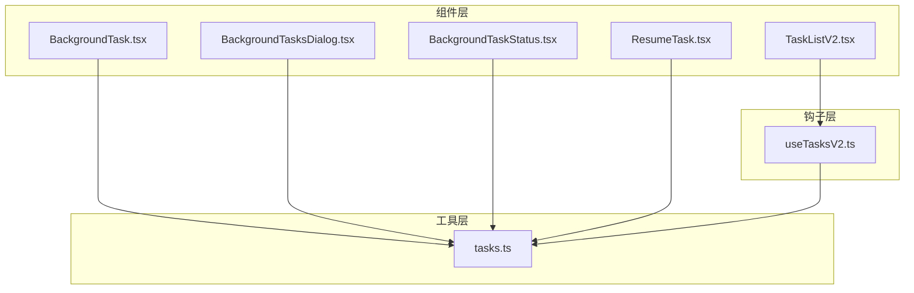
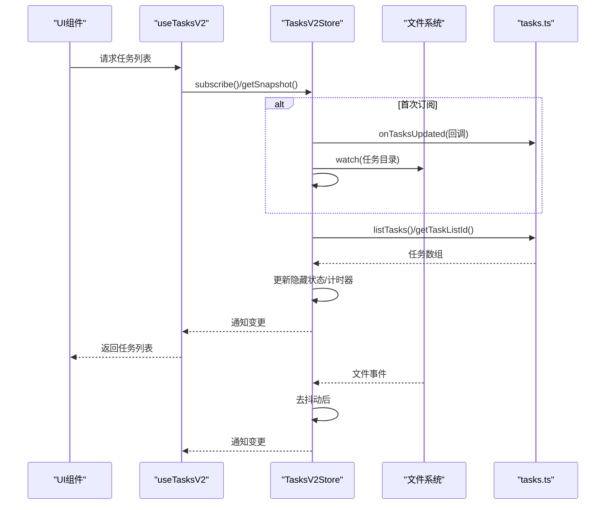
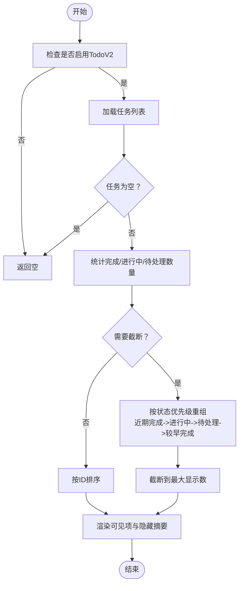
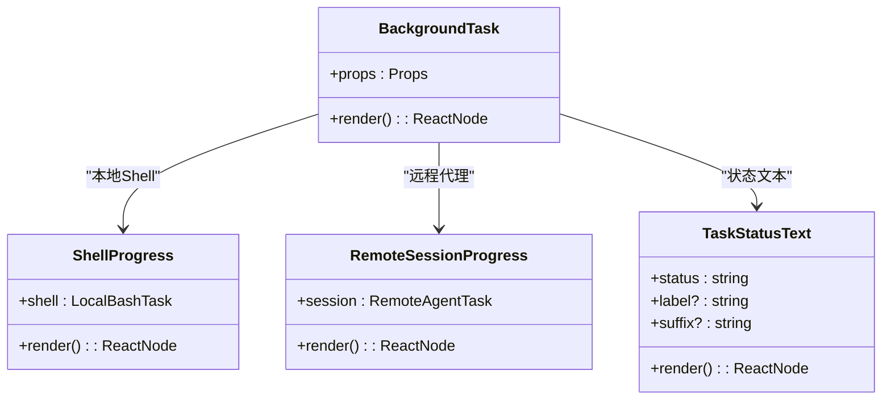
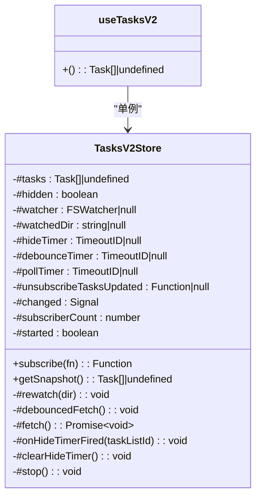
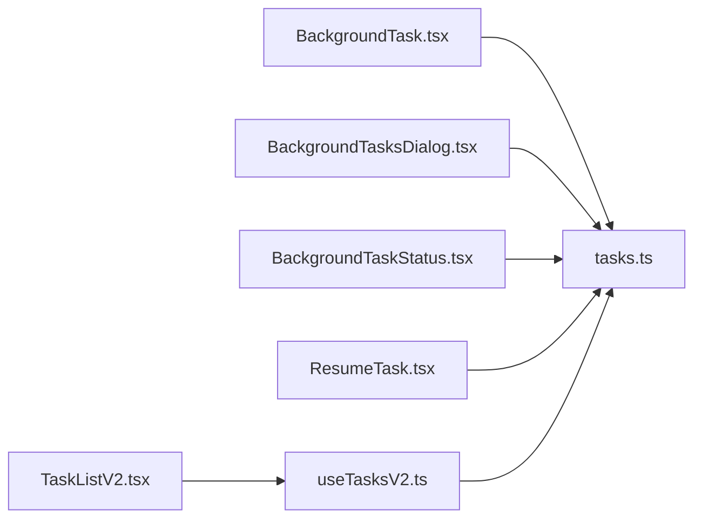

# 任务组件

<cite>
**本文档引用的文件**
- [TaskListV2.tsx](file://src/components/TaskListV2.tsx)
- [useTasksV2.ts](file://src/hooks/useTasksV2.ts)
- [tasks.ts](file://src/utils/tasks.ts)
- [BackgroundTask.tsx](file://src/components/tasks/BackgroundTask.tsx)
- [BackgroundTasksDialog.tsx](file://src/components/tasks/BackgroundTasksDialog.tsx)
- [BackgroundTaskStatus.tsx](file://src/components/tasks/BackgroundTaskStatus.tsx)
- [ResumeTask.tsx](file://src/components/ResumeTask.tsx)
</cite>

## 目录
1. [简介](#简介)
2. [项目结构](#项目结构)
3. [核心组件](#核心组件)
4. [架构总览](#架构总览)
5. [详细组件分析](#详细组件分析)
6. [依赖关系分析](#依赖关系分析)
7. [性能考量](#性能考量)
8. [故障排查指南](#故障排查指南)
9. [结论](#结论)
10. [附录](#附录)

## 简介
本文件系统性梳理任务组件体系，覆盖任务列表组件、后台任务对话框、任务详情对话框以及任务状态组件。文档从架构设计、数据流、处理逻辑、集成点、错误处理与性能特性等维度进行深入解析，并提供可定制与扩展建议，帮助开发者快速上手并高效集成任务系统。

## 项目结构
任务相关代码主要分布在以下模块：
- 组件层：任务列表、后台任务展示、对话框与状态显示
- 钩子层：统一的任务列表订阅与缓存管理
- 工具层：任务模型定义、文件存储、锁机制、状态查询

图表来源
- [TaskListV2.tsx:1-378](file://src/components/TaskListV2.tsx#L1-L378)
- [useTasksV2.ts:1-251](file://src/hooks/useTasksV2.ts#L1-L251)
- [tasks.ts:1-863](file://src/utils/tasks.ts#L1-L863)
- [BackgroundTask.tsx:1-345](file://src/components/tasks/BackgroundTask.tsx#L1-L345)
- [BackgroundTasksDialog.tsx](file://src/components/tasks/BackgroundTasksDialog.tsx)
- [BackgroundTaskStatus.tsx](file://src/components/tasks/BackgroundTaskStatus.tsx)
- [ResumeTask.tsx](file://src/components/ResumeTask.tsx)

章节来源
- [TaskListV2.tsx:1-378](file://src/components/TaskListV2.tsx#L1-L378)
- [useTasksV2.ts:1-251](file://src/hooks/useTasksV2.ts#L1-L251)
- [tasks.ts:1-863](file://src/utils/tasks.ts#L1-L863)
- [BackgroundTask.tsx:1-345](file://src/components/tasks/BackgroundTask.tsx#L1-L345)

## 核心组件
- 任务列表组件（TaskListV2）：负责渲染当前任务集合，支持按状态优先级截断显示、最近完成任务保活、团队成员活动摘要、阻塞关系可视化等。
- 后台任务组件（BackgroundTask）：针对不同任务类型（本地Shell、远程代理、进程内同伴、工作流、MCP监控、Dream）提供统一的进度与状态展示。
- 任务订阅钩子（useTasksV2）：基于文件系统监听与信号通知，提供稳定的任务列表订阅与隐藏策略。
- 工具函数（tasks.ts）：定义任务模型、状态枚举、文件存储路径、高水位标记、锁机制、任务增删改查、阻塞关系维护、代理占用检查、团队成员状态统计等。

章节来源
- [TaskListV2.tsx:17-211](file://src/components/TaskListV2.tsx#L17-L211)
- [BackgroundTask.tsx:13-345](file://src/components/tasks/BackgroundTask.tsx#L13-L345)
- [useTasksV2.ts:29-229](file://src/hooks/useTasksV2.ts#L29-L229)
- [tasks.ts:69-89](file://src/utils/tasks.ts#L69-L89)

## 架构总览
任务系统采用“文件持久化 + 文件系统监听 + 内部信号通知”的混合架构：
- 数据持久化：以JSON文件形式存储每个任务，目录按任务列表ID组织，避免跨会话冲突。
- 实时更新：通过文件系统监听与内部信号通知实现跨进程/跨会话的即时刷新。
- 订阅模式：统一的TasksV2Store封装了文件监听、去抖动、隐藏计时器、轮询回退等细节，供多个UI组件共享。
- 模型与约束：严格的Zod Schema校验任务字段，确保数据一致性；文件锁保障并发安全。

图表来源
- [useTasksV2.ts:29-199](file://src/hooks/useTasksV2.ts#L29-L199)
- [tasks.ts:443-456](file://src/utils/tasks.ts#L443-L456)

章节来源
- [useTasksV2.ts:29-199](file://src/hooks/useTasksV2.ts#L29-L199)
- [tasks.ts:19-67](file://src/utils/tasks.ts#L19-L67)

## 详细组件分析

### 任务列表组件（TaskListV2）
职责与特性
- 接收任务数组，按终端尺寸动态决定可见数量，优先展示最近完成、进行中、待处理与较早完成的任务。
- 支持“近期完成”保活（30秒内）自动刷新，避免频繁重渲染。
- 团队模式下，根据活跃同伴的最近活动生成简洁描述，并为同伴名称映射主题色。
- 可作为独立组件输出统计摘要（总数、已完成、进行中、待处理）。

关键算法流程

图表来源
- [TaskListV2.tsx:135-189](file://src/components/TaskListV2.tsx#L135-L189)

章节来源
- [TaskListV2.tsx:17-211](file://src/components/TaskListV2.tsx#L17-L211)

### 后台任务组件（BackgroundTask）
职责与特性
- 面向不同任务类型（本地Shell、远程代理、本地代理、进程内同伴、工作流、MCP监控、Dream）提供一致的展示与状态文本。
- 对于本地Shell任务，展示命令或监控描述与进度条；对于远程代理，区分评审会话与普通会话；对于进程内同伴，展示颜色化的同伴名与活动摘要；对于工作流与MCP监控，展示阶段与计数信息；对于Dream，展示阶段与影响范围。
- 使用截断策略控制活动描述宽度，保证在窄终端下的可读性。

组件关系图

图表来源
- [BackgroundTask.tsx:13-345](file://src/components/tasks/BackgroundTask.tsx#L13-L345)

章节来源
- [BackgroundTask.tsx:13-345](file://src/components/tasks/BackgroundTask.tsx#L13-L345)

### 任务订阅钩子（useTasksV2）
职责与特性
- 提供稳定的任务列表订阅接口，支持禁用路径（非交互会话或非队长权限）。
- 内部使用TasksV2Store单例，避免多处重复监听导致的资源浪费与抖动。
- 隐藏策略：当所有任务完成后延迟5秒隐藏列表，期间如有新活动则重置计时器。
- 轮询回退：仅在存在未完成任务时启动轮询，降低空转开销。

类图

图表来源
- [useTasksV2.ts:29-199](file://src/hooks/useTasksV2.ts#L29-L199)

章节来源
- [useTasksV2.ts:29-251](file://src/hooks/useTasksV2.ts#L29-L251)

### 工具函数（tasks.ts）
职责与特性
- 定义任务模型与状态枚举，提供Zod Schema校验与类型推断。
- 任务列表ID解析：支持显式环境变量、进程内同伴上下文、团队名、领导团队名与会话ID的优先级解析。
- 文件存储：确保任务目录存在、生成任务文件路径、读写任务JSON。
- 并发安全：通过文件锁与高水位标记防止ID复用与竞态条件。
- 任务操作：创建、读取、更新、删除、阻塞关系维护、代理占用检查、团队成员状态统计。
- 事件通知：提供同一进程内的任务更新通知，驱动UI即时刷新。

章节来源
- [tasks.ts:69-89](file://src/utils/tasks.ts#L69-L89)
- [tasks.ts:199-231](file://src/utils/tasks.ts#L199-L231)
- [tasks.ts:284-308](file://src/utils/tasks.ts#L284-L308)
- [tasks.ts:370-391](file://src/utils/tasks.ts#L370-L391)
- [tasks.ts:393-441](file://src/utils/tasks.ts#L393-L441)
- [tasks.ts:443-456](file://src/utils/tasks.ts#L443-L456)
- [tasks.ts:458-486](file://src/utils/tasks.ts#L458-L486)
- [tasks.ts:541-612](file://src/utils/tasks.ts#L541-L612)
- [tasks.ts:618-692](file://src/utils/tasks.ts#L618-L692)
- [tasks.ts:763-798](file://src/utils/tasks.ts#L763-L798)

### 任务状态组件（BackgroundTaskStatus）
职责与特性
- 用于展示后台任务的状态文本与图标，配合不同任务类型的进度组件使用，统一风格与可读性。

章节来源
- [BackgroundTaskStatus.tsx](file://src/components/tasks/BackgroundTaskStatus.tsx)

### 任务详情对话框（BackgroundTasksDialog）
职责与特性
- 展示后台任务的完整详情与交互入口，便于用户查看与管理任务执行过程。

章节来源
- [BackgroundTasksDialog.tsx](file://src/components/tasks/BackgroundTasksDialog.tsx)

### 任务恢复组件（ResumeTask）
职责与特性
- 提供任务恢复能力，允许用户在合适时机继续之前中断或暂停的任务。

章节来源
- [ResumeTask.tsx](file://src/components/ResumeTask.tsx)

## 依赖关系分析
- 组件依赖钩子：任务列表组件依赖useTasksV2获取任务数据，后台任务组件直接依赖工具层的任务状态模型。
- 钩子依赖工具：useTasksV2依赖tasks.ts提供的任务列表ID解析、文件监听、任务读写与通知机制。
- 工具层依赖：tasks.ts依赖文件系统API、锁文件机制、Zod Schema、日志与错误处理工具。

图表来源
- [TaskListV2.tsx:1-378](file://src/components/TaskListV2.tsx#L1-L378)
- [useTasksV2.ts:1-251](file://src/hooks/useTasksV2.ts#L1-L251)
- [tasks.ts:1-863](file://src/utils/tasks.ts#L1-L863)
- [BackgroundTask.tsx:1-345](file://src/components/tasks/BackgroundTask.tsx#L1-L345)
- [BackgroundTasksDialog.tsx](file://src/components/tasks/BackgroundTasksDialog.tsx)
- [BackgroundTaskStatus.tsx](file://src/components/tasks/BackgroundTaskStatus.tsx)
- [ResumeTask.tsx](file://src/components/ResumeTask.tsx)

章节来源
- [TaskListV2.tsx:1-378](file://src/components/TaskListV2.tsx#L1-L378)
- [useTasksV2.ts:1-251](file://src/hooks/useTasksV2.ts#L1-L251)
- [tasks.ts:1-863](file://src/utils/tasks.ts#L1-L863)

## 性能考量
- 文件监听与去抖动：通过去抖动减少频繁刷新，仅在必要时触发读取与渲染。
- 隐藏策略：全部任务完成后延迟隐藏，避免无意义的渲染与布局变化。
- 轮询回退：仅在存在未完成任务时启用轮询，降低空闲时的CPU与IO消耗。
- 渲染优化：组件内部使用编译器运行时的局部缓存策略，避免不必要的重渲染。
- 锁与并发：采用带退避的文件锁，减少锁竞争带来的阻塞时间，提升并发安全性。

## 故障排查指南
常见问题与定位
- 任务列表不显示：确认TodoV2开关与团队权限；检查任务目录是否存在与可读写。
- 任务状态不更新：检查文件系统监听是否生效，确认同一进程内通知是否触发。
- 任务ID冲突：确认高水位标记是否正确写入，避免删除/重置任务后ID复用。
- 代理占用冲突：检查代理忙碌检查逻辑，确认任务列表级锁是否正确获取。
- 进程内同伴活动不显示：确认同伴上下文与颜色映射配置是否正确。

章节来源
- [useTasksV2.ts:90-105](file://src/hooks/useTasksV2.ts#L90-L105)
- [tasks.ts:147-188](file://src/utils/tasks.ts#L147-L188)
- [tasks.ts:541-612](file://src/utils/tasks.ts#L541-L612)
- [tasks.ts:618-692](file://src/utils/tasks.ts#L618-L692)

## 结论
任务组件体系通过清晰的分层与稳健的并发控制，实现了跨进程、跨会话的任务持久化与实时展示。组件间职责明确、耦合度低，既满足日常使用场景，也为扩展与定制提供了良好基础。建议在集成时关注任务列表ID解析、文件锁与隐藏策略的配置，以获得最佳体验。

## 附录
- 任务模型字段与状态
  - 字段：id、subject、description、activeForm、owner、status、blocks、blockedBy、metadata
  - 状态：pending、in_progress、completed
- 任务操作要点
  - 创建：原子性分配ID，写入文件并通知
  - 更新：文件锁保护，避免竞态
  - 删除：更新高水位标记，清理阻塞关系
  - 阻塞：双向维护blocks与blockedBy
  - 代理占用：支持原子性检查与抢占
- 可定制与扩展
  - 新增任务类型：在BackgroundTask中扩展类型分支与展示组件
  - 自定义隐藏策略：调整useTasksV2中的隐藏延迟与轮询间隔
  - 自定义存储：替换tasks.ts中的文件路径与锁策略（需保持并发安全）

章节来源
- [tasks.ts:69-89](file://src/utils/tasks.ts#L69-L89)
- [tasks.ts:284-308](file://src/utils/tasks.ts#L284-L308)
- [tasks.ts:370-391](file://src/utils/tasks.ts#L370-L391)
- [tasks.ts:393-441](file://src/utils/tasks.ts#L393-L441)
- [tasks.ts:458-486](file://src/utils/tasks.ts#L458-L486)
- [tasks.ts:541-612](file://src/utils/tasks.ts#L541-L612)
- [tasks.ts:618-692](file://src/utils/tasks.ts#L618-L692)
- [BackgroundTask.tsx:24-345](file://src/components/tasks/BackgroundTask.tsx#L24-L345)