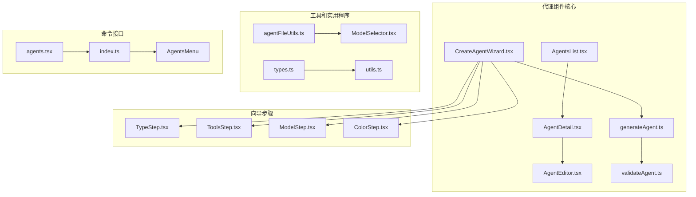
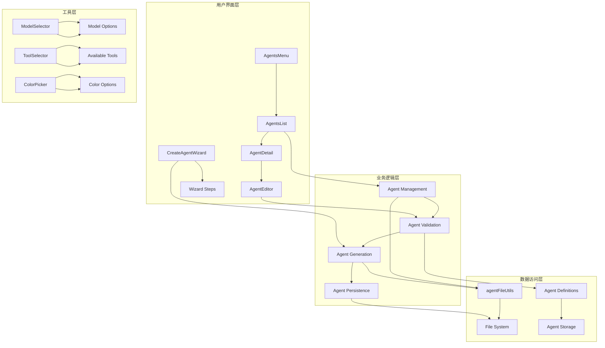
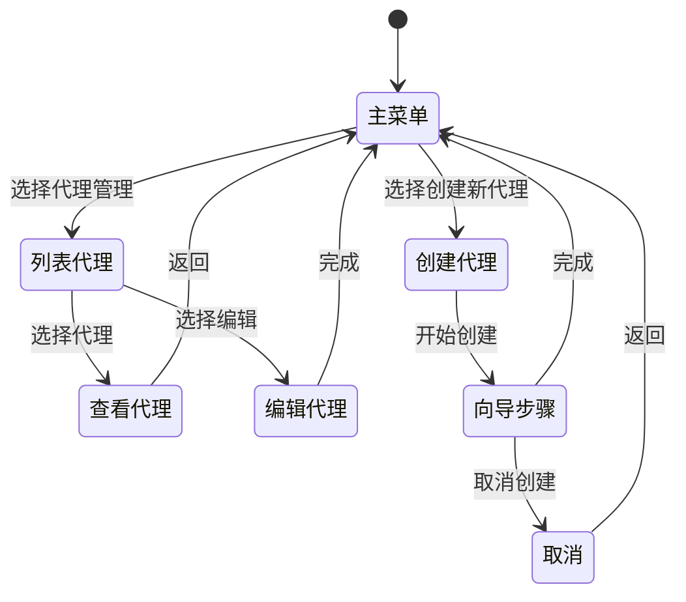
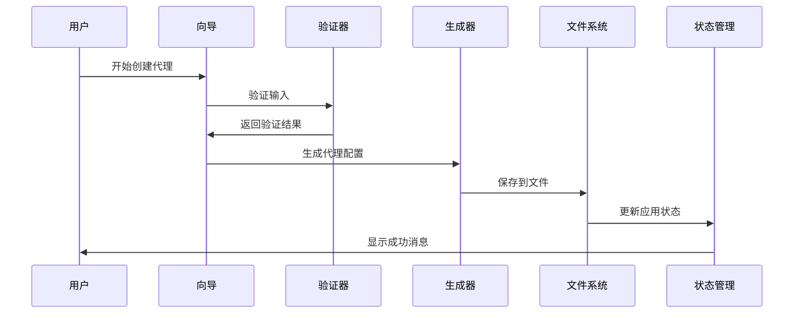
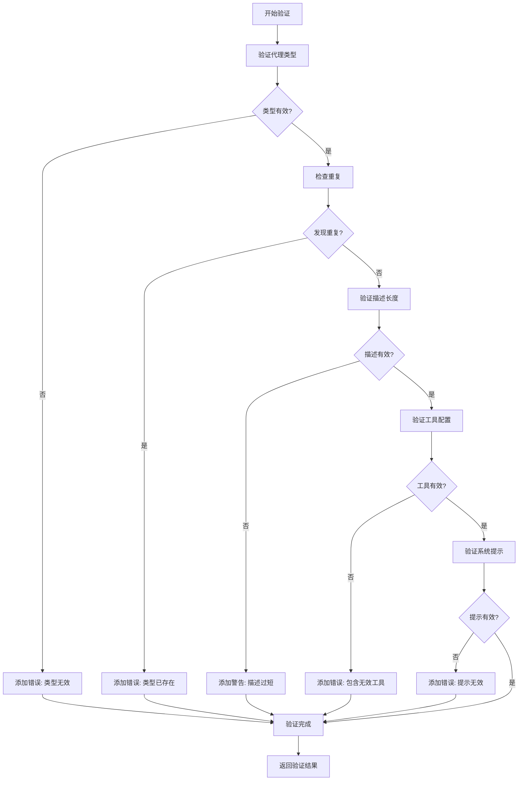
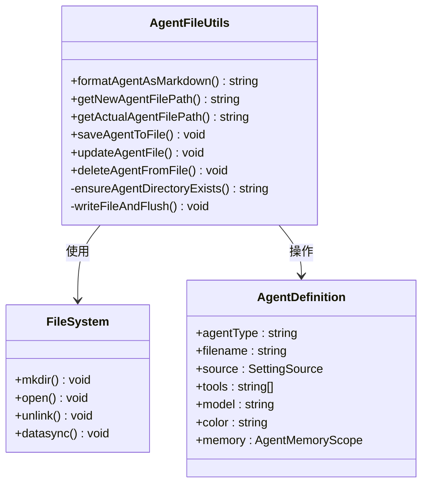
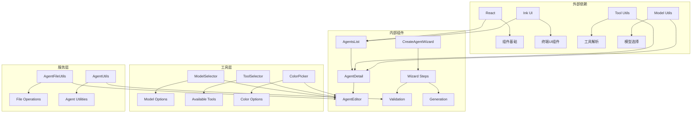

# 代理组件

<cite>
**本文档引用的文件**
- [AgentsList.tsx](file://src/components/agents/AgentsList.tsx)
- [AgentDetail.tsx](file://src/components/agents/AgentDetail.tsx)
- [AgentEditor.tsx](file://src/components/agents/AgentEditor.tsx)
- [CreateAgentWizard.tsx](file://src/components/agents/new-agent-creation/CreateAgentWizard.tsx)
- [generateAgent.ts](file://src/components/agents/generateAgent.ts)
- [validateAgent.ts](file://src/components/agents/validateAgent.ts)
- [agentFileUtils.ts](file://src/components/agents/agentFileUtils.ts)
- [ModelSelector.tsx](file://src/components/agents/ModelSelector.tsx)
- [types.ts](file://src/components/agents/types.ts)
- [utils.ts](file://src/components/agents/utils.ts)
- [agents.tsx](file://src/commands/agents/agents.tsx)
- [index.ts](file://src/commands/agents/index.ts)
</cite>

## 目录
1. [简介](#简介)
2. [项目结构](#项目结构)
3. [核心组件](#核心组件)
4. [架构概览](#架构概览)
5. [详细组件分析](#详细组件分析)
6. [依赖关系分析](#依赖关系分析)
7. [性能考虑](#性能考虑)
8. [故障排除指南](#故障排除指南)
9. [结论](#结论)
10. [附录](#附录)

## 简介

代理组件是 Claude Code 应用程序中的核心功能模块，用于管理和操作智能代理（Agents）。这些代理是能够执行特定任务的 AI 助手，可以被配置为具有不同的模型、工具集、记忆能力和行为特征。

本组件系统提供了完整的代理生命周期管理，包括代理的发现、查看、编辑、创建和删除功能。它支持多种代理类型，从内置代理到用户自定义代理，再到插件代理，并提供了强大的配置选项和验证机制。

## 项目结构

代理组件系统采用模块化设计，主要分布在以下目录中：

**图表来源**
- [AgentsList.tsx:1-440](file://src/components/agents/AgentsList.tsx#L1-L440)
- [AgentEditor.tsx:1-178](file://src/components/agents/AgentEditor.tsx#L1-L178)
- [CreateAgentWizard.tsx:1-97](file://src/components/agents/new-agent-creation/CreateAgentWizard.tsx#L1-L97)

**章节来源**
- [AgentsList.tsx:1-440](file://src/components/agents/AgentsList.tsx#L1-L440)
- [AgentDetail.tsx:1-220](file://src/components/agents/AgentDetail.tsx#L1-L220)
- [AgentEditor.tsx:1-178](file://src/components/agents/AgentEditor.tsx#L1-L178)

## 核心组件

### 代理列表组件 (AgentsList)

代理列表组件负责显示和管理所有可用的代理。它支持多种筛选模式，包括显示所有代理、内置代理和插件代理。

**主要特性：**
- 按名称排序的代理列表
- 支持键盘导航和选择
- 显示代理的模型信息和内存配置
- 处理代理覆盖和优先级
- 提供创建新代理的选项

**章节来源**
- [AgentsList.tsx:1-440](file://src/components/agents/AgentsList.tsx#L1-L440)

### 代理详情组件 (AgentDetail)

代理详情组件提供代理的完整信息展示，包括系统提示、工具配置、模型设置等。

**主要特性：**
- 显示代理的完整配置信息
- 展示系统提示内容
- 列出已授权的工具
- 显示模型和权限模式
- 提供颜色标识和内存配置

**章节来源**
- [AgentDetail.tsx:1-220](file://src/components/agents/AgentDetail.tsx#L1-L220)

### 代理编辑组件 (AgentEditor)

代理编辑组件允许用户修改现有代理的配置，包括工具、模型和颜色设置。

**主要特性：**
- 菜单驱动的编辑界面
- 工具选择器集成
- 模型选择器集成
- 颜色选择器集成
- 实时配置验证
- 文件系统更新

**章节来源**
- [AgentEditor.tsx:1-178](file://src/components/agents/AgentEditor.tsx#L1-L178)

### 代理创建向导 (CreateAgentWizard)

创建向导提供了一个分步流程来创建新的代理，包括类型选择、工具配置、模型设置等步骤。

**主要特性：**
- 分步向导界面
- 类型选择步骤
- 工具配置步骤
- 模型选择步骤
- 颜色配置步骤
- 内存配置步骤（可选）
- 最终确认步骤

**章节来源**
- [CreateAgentWizard.tsx:1-97](file://src/components/agents/new-agent-creation/CreateAgentWizard.tsx#L1-L97)

## 架构概览

代理组件系统采用分层架构设计，确保了良好的模块分离和可维护性：

**图表来源**
- [agents.tsx:1-12](file://src/commands/agents/agents.tsx#L1-L12)
- [agentFileUtils.ts:1-273](file://src/components/agents/agentFileUtils.ts#L1-L273)

## 详细组件分析

### 代理状态管理

代理组件使用集中式状态管理来跟踪代理的当前状态和用户交互：

**图表来源**
- [types.ts:14-27](file://src/components/agents/types.ts#L14-L27)

**章节来源**
- [types.ts:1-28](file://src/components/agents/types.ts#L1-L28)

### 代理创建流程

代理创建过程涉及多个步骤和验证机制：

**图表来源**
- [CreateAgentWizard.tsx:26-97](file://src/components/agents/new-agent-creation/CreateAgentWizard.tsx#L26-L97)
- [validateAgent.ts:35-110](file://src/components/agents/validateAgent.ts#L35-L110)
- [generateAgent.ts:122-198](file://src/components/agents/generateAgent.ts#L122-L198)

**章节来源**
- [CreateAgentWizard.tsx:1-97](file://src/components/agents/new-agent-creation/CreateAgentWizard.tsx#L1-L97)
- [validateAgent.ts:1-110](file://src/components/agents/validateAgent.ts#L1-L110)
- [generateAgent.ts:1-198](file://src/components/agents/generateAgent.ts#L1-L198)

### 代理配置验证

代理配置验证确保代理设置的有效性和一致性：

**图表来源**
- [validateAgent.ts:35-110](file://src/components/agents/validateAgent.ts#L35-L110)

**章节来源**
- [validateAgent.ts:1-110](file://src/components/agents/validateAgent.ts#L1-L110)

### 文件系统操作

代理文件管理提供了完整的文件操作功能：

**图表来源**
- [agentFileUtils.ts:1-273](file://src/components/agents/agentFileUtils.ts#L1-L273)

**章节来源**
- [agentFileUtils.ts:1-273](file://src/components/agents/agentFileUtils.ts#L1-L273)

## 依赖关系分析

代理组件系统具有清晰的依赖层次结构：

**图表来源**
- [ModelSelector.tsx:1-68](file://src/components/agents/ModelSelector.tsx#L1-L68)
- [agentFileUtils.ts:1-273](file://src/components/agents/agentFileUtils.ts#L1-L273)

**章节来源**
- [ModelSelector.tsx:1-68](file://src/components/agents/ModelSelector.tsx#L1-L68)
- [agentFileUtils.ts:1-273](file://src/components/agents/agentFileUtils.ts#L1-L273)

## 性能考虑

代理组件系统在设计时考虑了多种性能优化策略：

### 渲染优化
- 使用 React.memo 缓存昂贵的渲染操作
- 惰性加载代理数据以减少初始渲染时间
- 条件渲染避免不必要的 DOM 更新

### 数据处理优化
- 批量更新应用状态减少重渲染次数
- 智能缓存代理配置信息
- 异步文件操作避免阻塞主线程

### 内存管理
- 及时清理未使用的组件引用
- 合理的组件卸载机制
- 避免内存泄漏的事件监听器管理

## 故障排除指南

### 常见问题和解决方案

**代理无法保存**
- 检查文件权限和磁盘空间
- 验证代理类型是否符合命名规则
- 确认目标目录是否存在

**代理配置无效**
- 使用验证器检查配置格式
- 确认工具名称拼写正确
- 验证系统提示的长度和内容

**向导步骤卡住**
- 检查网络连接状态
- 确认模型选择有效
- 验证代理类型唯一性

**章节来源**
- [validateAgent.ts:15-33](file://src/components/agents/validateAgent.ts#L15-L33)
- [agentFileUtils.ts:178-203](file://src/components/agents/agentFileUtils.ts#L178-L203)

## 结论

代理组件系统提供了一个完整、灵活且用户友好的代理管理解决方案。通过模块化设计和清晰的架构分离，该系统能够：

- 支持多种代理类型和配置选项
- 提供直观的用户界面和交互体验
- 确保数据的一致性和完整性
- 具备良好的可扩展性和可维护性

该系统为开发者提供了丰富的定制选项，同时保持了简单易用的使用体验。无论是简单的代理查看还是复杂的代理创建和编辑，用户都能获得流畅的操作体验。

## 附录

### API 参考

**代理状态类型**
- `main-menu`: 主菜单状态
- `list-agents`: 代理列表状态
- `agent-menu`: 代理菜单状态
- `view-agent`: 查看代理状态
- `create-agent`: 创建代理状态
- `edit-agent`: 编辑代理状态
- `delete-confirm`: 删除确认状态

**章节来源**
- [types.ts:14-27](file://src/components/agents/types.ts#L14-L27)

### 配置选项

**代理文件格式**
- YAML 格式头部包含元数据
- 系统提示作为文件主体
- 支持工具、模型、颜色、内存等配置

**章节来源**
- [agentFileUtils.ts:18-55](file://src/components/agents/agentFileUtils.ts#L18-L55)