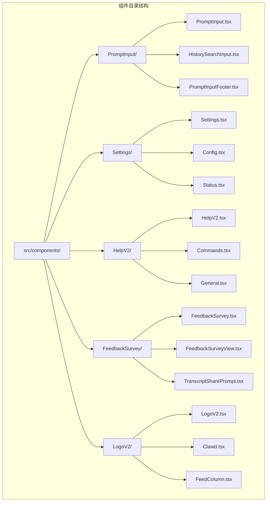
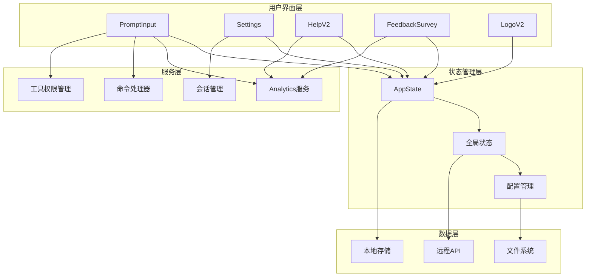
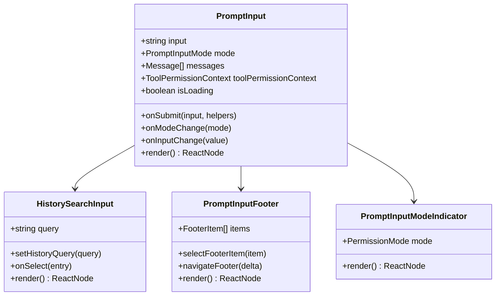
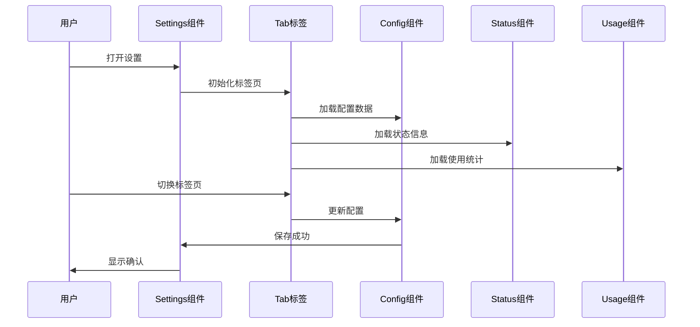
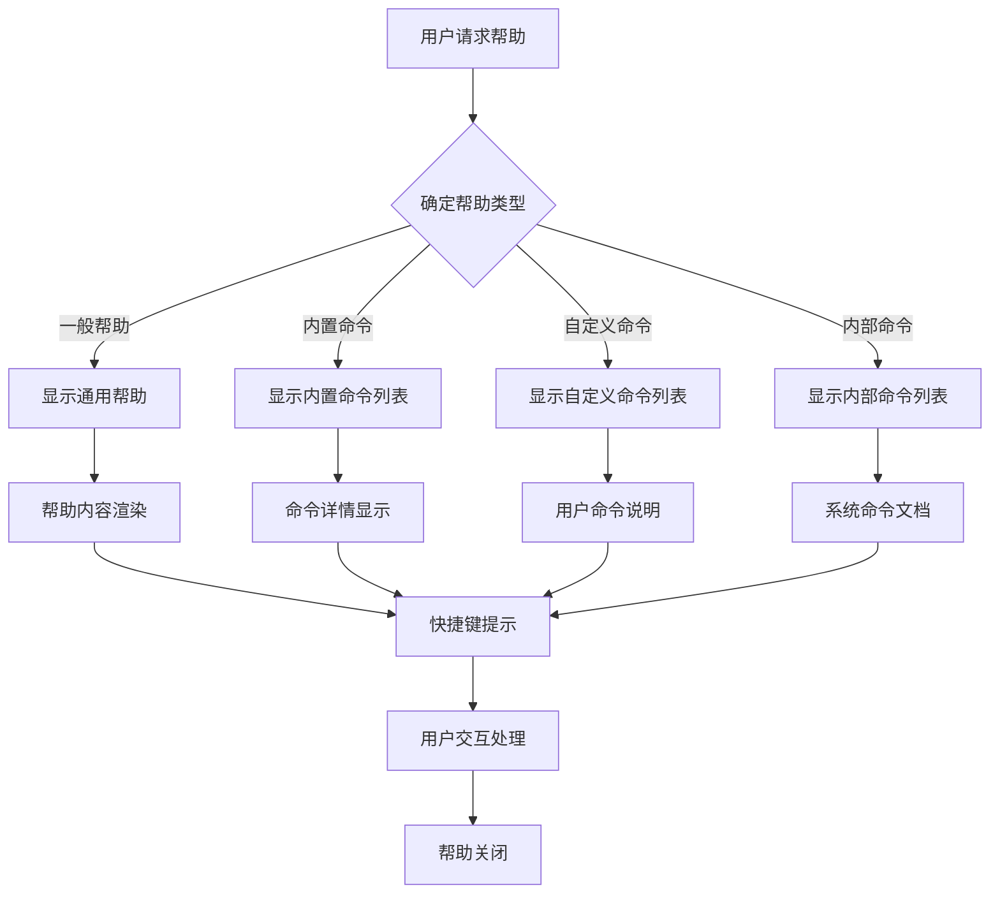
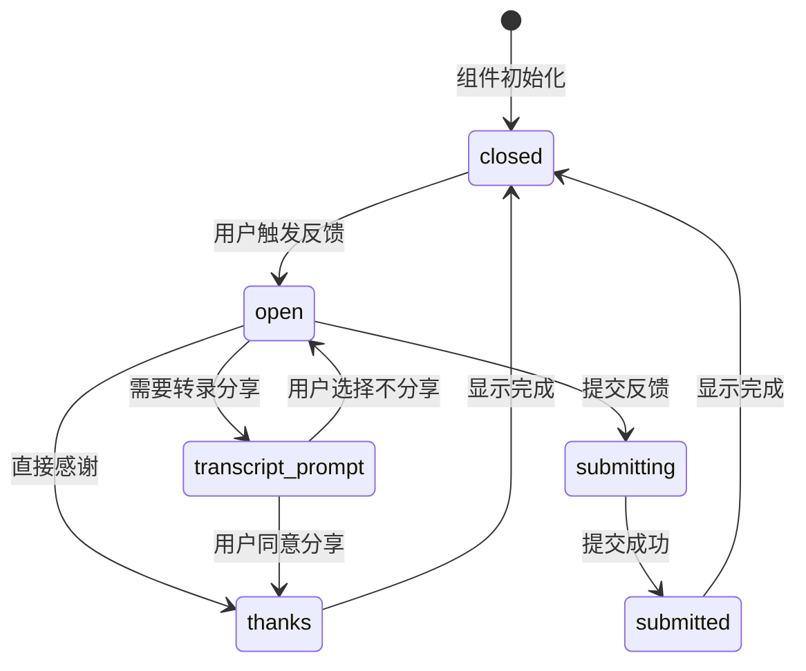
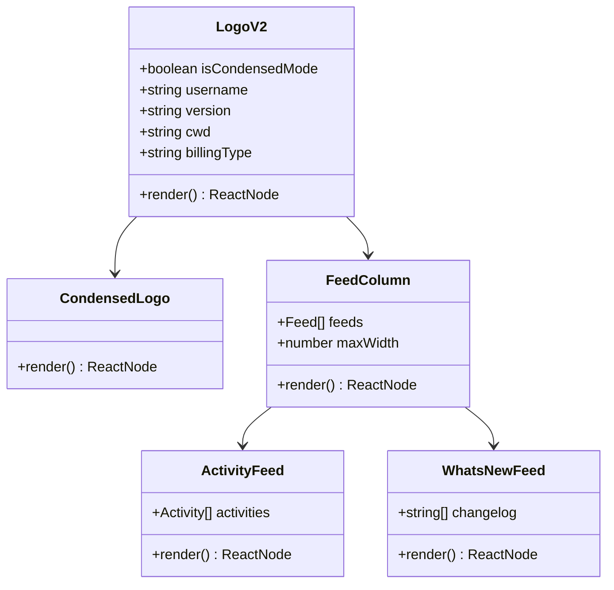
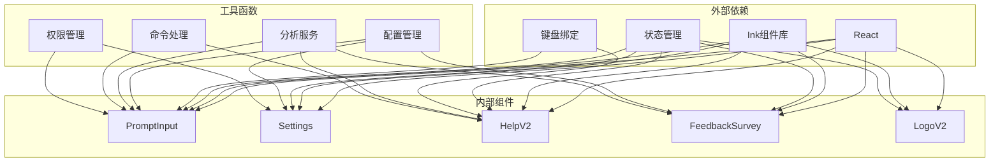

# 专用组件

<cite>
**本文档引用的文件**
- [PromptInput.tsx](file://src/components/PromptInput/PromptInput.tsx)
- [Settings.tsx](file://src/components/Settings/Settings.tsx)
- [HelpV2.tsx](file://src/components/HelpV2/HelpV2.tsx)
- [FeedbackSurvey.tsx](file://src/components/FeedbackSurvey/FeedbackSurvey.tsx)
- [LogoV2.tsx](file://src/components/LogoV2/LogoV2.tsx)
</cite>

## 目录
1. [简介](#简介)
2. [项目结构](#项目结构)
3. [核心组件](#核心组件)
4. [架构概览](#架构概览)
5. [详细组件分析](#详细组件分析)
6. [依赖分析](#依赖分析)
7. [性能考虑](#性能考虑)
8. [故障排除指南](#故障排除指南)
9. [结论](#结论)

## 简介

本文档详细介绍Claude Code代码库中五个专用组件的设计与实现：提示输入组件、设置管理组件、帮助系统组件、反馈调查组件和品牌标识组件。这些组件构成了系统的用户界面核心，提供了完整的交互体验。

每个组件都经过精心设计，具有清晰的职责分离、良好的可扩展性以及丰富的定制选项。通过本文档，开发者可以深入了解这些组件的工作原理、API接口以及最佳实践。

## 项目结构

专用组件主要位于`src/components/`目录下，采用模块化设计：



**图表来源**
- [PromptInput.tsx](file://src/components/PromptInput/PromptInput.tsx)
- [Settings.tsx](file://src/components/Settings/Settings.tsx)
- [HelpV2.tsx](file://src/components/HelpV2/HelpV2.tsx)
- [FeedbackSurvey.tsx](file://src/components/FeedbackSurvey/FeedbackSurvey.tsx)
- [LogoV2.tsx](file://src/components/LogoV2/LogoV2.tsx)

## 核心组件

### 提示输入组件 (PromptInput)

提示输入组件是系统的核心交互入口，提供了智能的文本输入体验。该组件集成了多种高级功能：

**主要特性：**
- 智能命令识别和高亮显示
- 历史搜索功能
- 多模式支持（普通模式、快速模式、思考模式）
- 实时建议和自动补全
- 键盘快捷键支持
- 多种输入模式切换

**关键属性：**
- `input`: 当前输入内容
- `mode`: 输入模式（普通/快速/思考）
- `messages`: 消息历史
- `toolPermissionContext`: 工具权限上下文
- `stashedPrompt`: 缓存的提示信息

**事件处理：**
- `onSubmit`: 提交处理
- `onModeChange`: 模式变更
- `onInputChange`: 输入变更
- `onAgentSubmit`: 代理提交

### 设置管理组件 (Settings)

设置管理组件提供了完整的配置界面，支持多标签页管理和实时配置更新。

**标签页功能：**
- **状态标签**: 系统状态监控和诊断
- **配置标签**: 全局配置管理
- **使用量标签**: 使用统计和配额信息
- **门禁标签**: 权限控制和访问管理

**核心功能：**
- 配置项的增删改查
- 实时状态监控
- 配置导入导出
- 权限验证和安全检查

### 帮助系统组件 (HelpV2)

帮助系统组件提供了全面的帮助文档和命令参考。

**组织结构：**
- **通用标签**: 基础使用指南
- **命令标签**: 内置命令参考
- **自定义命令标签**: 用户自定义命令
- **内部命令标签**: 系统级命令（特定环境）

**特色功能：**
- 搜索和过滤功能
- 快捷键显示
- 命令分类和分组
- 在线文档链接

### 反馈调查组件 (FeedbackSurvey)

反馈调查组件提供了用户反馈收集和处理机制。

**状态管理：**
- `closed`: 关闭状态
- `open`: 打开状态
- `thanks`: 感谢状态
- `transcript_prompt`: 转录提示状态
- `submitting`: 提交中状态
- `submitted`: 已提交状态

**交互流程：**
1. 用户触发反馈
2. 显示反馈表单
3. 收集用户意见
4. 处理转录分享
5. 显示感谢信息

### 品牌标识组件 (LogoV2)

品牌标识组件负责展示Claude Code的品牌形象和相关信息。

**布局模式：**
- **紧凑模式**: 简洁版本，适合小屏幕
- **水平模式**: 宽屏布局
- **垂直模式**: 标准布局

**动态内容：**
- 最新活动流
- 版本更新通知
- 用户欢迎消息
- 系统状态指示器

**组件层次：**
- 主标题和版本信息
- 用户信息和工作目录
- 活动流和通知
- 系统状态和调试信息

**章节来源**
- [PromptInput.tsx:194-800](file://src/components/PromptInput/PromptInput.tsx#L194-L800)
- [Settings.tsx:22-137](file://src/components/Settings/Settings.tsx#L22-L137)
- [HelpV2.tsx:20-184](file://src/components/HelpV2/HelpV2.tsx#L20-L184)
- [FeedbackSurvey.tsx:20-174](file://src/components/FeedbackSurvey/FeedbackSurvey.tsx#L20-L174)
- [LogoV2.tsx:47-527](file://src/components/LogoV2/LogoV2.tsx#L47-L527)

## 架构概览

专用组件采用分层架构设计，确保了良好的模块化和可维护性：



**图表来源**
- [PromptInput.tsx:194-800](file://src/components/PromptInput/PromptInput.tsx#L194-L800)
- [Settings.tsx:22-137](file://src/components/Settings/Settings.tsx#L22-L137)
- [HelpV2.tsx:20-184](file://src/components/HelpV2/HelpV2.tsx#L20-L184)
- [FeedbackSurvey.tsx:20-174](file://src/components/FeedbackSurvey/FeedbackSurvey.tsx#L20-L174)
- [LogoV2.tsx:47-527](file://src/components/LogoV2/LogoV2.tsx#L47-L527)

## 详细组件分析

### 提示输入组件深度分析

提示输入组件是整个系统最复杂的组件之一，集成了众多高级功能：



**图表来源**
- [PromptInput.tsx:124-189](file://src/components/PromptInput/PromptInput.tsx#L124-L189)

**核心功能实现：**

1. **智能命令识别**: 组件能够识别和高亮显示各种命令格式，包括斜杠命令、关键词触发等。

2. **历史搜索**: 集成历史查询功能，支持模糊匹配和快速导航。

3. **多模式支持**: 支持普通模式、快速模式、思考模式等多种输入模式。

4. **实时建议**: 基于当前输入提供智能建议和自动补全。

**使用示例：**
```typescript
// 基本使用
<PromptInput
  input={userInput}
  onInputChange={setUserInput}
  onSubmit={handleSubmit}
  mode="normal"
  toolPermissionContext={permissionContext}
/>

// 高级配置
<PromptInput
  input={input}
  onInputChange={handleChange}
  onSubmit={handleSubmit}
  messages={conversationHistory}
  stashedPrompt={cachedPrompt}
  vimMode={vimMode}
  helpOpen={helpVisible}
/>
```

**章节来源**
- [PromptInput.tsx:194-800](file://src/components/PromptInput/PromptInput.tsx#L194-L800)

### 设置管理组件详细分析

设置管理组件采用标签页架构，提供了清晰的功能分区：



**图表来源**
- [Settings.tsx:22-137](file://src/components/Settings/Settings.tsx#L22-L137)

**组件特性：**

1. **动态标签页**: 根据功能需求动态显示不同的标签页。

2. **实时更新**: 配置更改后立即生效，无需重启应用。

3. **权限控制**: 不同标签页需要相应的权限才能访问。

4. **错误处理**: 完善的错误处理和回滚机制。

**配置管理流程：**
```typescript
// 配置更新流程
interface ConfigUpdate {
  key: string;
  value: any;
  oldValue: any;
  timestamp: Date;
}

// 验证配置
function validateConfig(config: ConfigUpdate): boolean {
  // 配置验证逻辑
  return true;
}

// 应用配置
function applyConfig(config: ConfigUpdate): Promise<void> {
  // 应用配置到系统
  return Promise.resolve();
}
```

**章节来源**
- [Settings.tsx:22-137](file://src/components/Settings/Settings.tsx#L22-L137)

### 帮助系统组件深度解析

帮助系统组件提供了多层次的帮助信息组织：



**图表来源**
- [HelpV2.tsx:20-184](file://src/components/HelpV2/HelpV2.tsx#L20-L184)

**命令分类机制：**
- **内置命令**: 系统预定义的标准命令
- **自定义命令**: 用户或团队定义的命令
- **内部命令**: 系统级特殊命令（特定环境下可用）

**搜索和过滤功能：**
```typescript
// 命令搜索算法
function searchCommands(commands: Command[], query: string): Command[] {
  return commands.filter(cmd => 
    cmd.name.toLowerCase().includes(query.toLowerCase()) ||
    cmd.description.toLowerCase().includes(query.toLowerCase()) ||
    cmd.keywords.some(keyword => 
      keyword.toLowerCase().includes(query.toLowerCase())
    )
  );
}
```

**章节来源**
- [HelpV2.tsx:20-184](file://src/components/HelpV2/HelpV2.tsx#L20-L184)

### 反馈调查组件完整分析

反馈调查组件实现了完整的用户反馈收集流程：



**图表来源**
- [FeedbackSurvey.tsx:20-174](file://src/components/FeedbackSurvey/FeedbackSurvey.tsx#L20-L174)

**状态管理机制：**
组件使用状态机模式管理复杂的用户交互流程，确保用户体验的一致性和完整性。

**数字输入处理：**
```typescript
// 延迟数字输入处理
function useDebouncedDigitInput(options: {
  inputValue: string;
  setInputValue: (value: string) => void;
  isValidDigit: (char: string) => boolean;
  enabled: boolean;
  once: boolean;
  onDigit: () => void;
}): void {
  // 数字输入处理逻辑
}
```

**章节来源**
- [FeedbackSurvey.tsx:20-174](file://src/components/FeedbackSurvey/FeedbackSurvey.tsx#L20-L174)

### 品牌标识组件全面解析

品牌标识组件展现了Claude Code的品牌形象和系统状态：



**图表来源**
- [LogoV2.tsx:47-527](file://src/components/LogoV2/LogoV2.tsx#L47-L527)

**布局适配机制：**
组件根据终端宽度自动调整布局模式，确保在不同设备上的最佳显示效果。

**动态内容生成：**
```typescript
// 动态内容生成器
function generateDynamicContent(): DynamicContent[] {
  const content: DynamicContent[] = [];
  
  // 添加最新活动
  content.push(createRecentActivityFeed());
  
  // 添加项目引导
  if (shouldShowProjectOnboarding()) {
    content.push(createProjectOnboardingFeed());
  }
  
  // 添加来宾通行证
  if (useShowGuestPassesUpsell()) {
    content.push(createGuestPassesFeed());
  }
  
  return content;
}
```

**章节来源**
- [LogoV2.tsx:47-527](file://src/components/LogoV2/LogoV2.tsx#L47-L527)

## 依赖分析

专用组件之间的依赖关系体现了清晰的架构设计：



**图表来源**
- [PromptInput.tsx:1-100](file://src/components/PromptInput/PromptInput.tsx#L1-L100)
- [Settings.tsx:1-20](file://src/components/Settings/Settings.tsx#L1-L20)
- [HelpV2.tsx:1-15](file://src/components/HelpV2/HelpV2.tsx#L1-L15)
- [FeedbackSurvey.tsx:1-10](file://src/components/FeedbackSurvey/FeedbackSurvey.tsx#L1-L10)
- [LogoV2.tsx:1-25](file://src/components/LogoV2/LogoV2.tsx#L1-L25)

**依赖特点：**
- **低耦合**: 各组件间依赖关系清晰，便于独立开发和测试
- **高内聚**: 每个组件专注于特定功能领域
- **可替换性**: 通过接口抽象，便于替换底层实现

## 性能考虑

专用组件在设计时充分考虑了性能优化：

### 渲染优化
- **虚拟滚动**: 大量数据的高效渲染
- **懒加载**: 按需加载组件和资源
- **防抖处理**: 输入和搜索操作的性能优化
- **记忆化**: 复杂计算结果的缓存

### 内存管理
- **组件卸载清理**: 自动清理事件监听器和定时器
- **状态最小化**: 仅存储必要的状态数据
- **垃圾回收**: 及时释放不再使用的对象

### 网络优化
- **请求合并**: 减少网络请求次数
- **缓存策略**: 智能的数据缓存机制
- **离线支持**: 部分功能的离线可用性

## 故障排除指南

### 常见问题及解决方案

**提示输入组件问题：**
- **输入无响应**: 检查键盘绑定配置和焦点状态
- **命令识别失败**: 验证命令格式和权限设置
- **历史搜索异常**: 清理历史缓存并重新加载

**设置管理组件问题：**
- **配置不生效**: 检查权限和配置验证规则
- **标签页加载失败**: 确认网络连接和API可用性
- **状态同步问题**: 重置状态缓存并重新初始化

**帮助系统问题：**
- **命令搜索无结果**: 检查命令索引和搜索算法
- **文档链接失效**: 更新文档URL和版本信息
- **快捷键冲突**: 调整快捷键配置避免冲突

**反馈调查问题：**
- **反馈提交失败**: 检查网络连接和服务器状态
- **转录分享异常**: 验证文件格式和大小限制
- **状态显示错误**: 重置反馈状态并重新初始化

**品牌标识问题：**
- **布局错乱**: 调整终端尺寸或禁用动态布局
- **内容加载缓慢**: 清理缓存并优化图片资源
- **主题显示异常**: 检查主题配置和CSS样式

**章节来源**
- [PromptInput.tsx:194-800](file://src/components/PromptInput/PromptInput.tsx#L194-L800)
- [Settings.tsx:22-137](file://src/components/Settings/Settings.tsx#L22-L137)
- [HelpV2.tsx:20-184](file://src/components/HelpV2/HelpV2.tsx#L20-L184)
- [FeedbackSurvey.tsx:20-174](file://src/components/FeedbackSurvey/FeedbackSurvey.tsx#L20-L174)
- [LogoV2.tsx:47-527](file://src/components/LogoV2/LogoV2.tsx#L47-L527)

## 结论

专用组件系统展现了现代前端架构的最佳实践。通过模块化设计、清晰的职责分离和完善的错误处理机制，这些组件为用户提供了一致且高效的交互体验。

**主要优势：**
- **高度可定制**: 每个组件都支持丰富的配置选项
- **良好的扩展性**: 清晰的接口设计便于功能扩展
- **优秀的性能**: 多层次的优化确保流畅的用户体验
- **强大的功能**: 集成了众多高级功能满足复杂需求

**未来发展：**
- **AI集成增强**: 进一步整合AI助手功能
- **多平台支持**: 扩展到更多平台和设备
- **个性化定制**: 更灵活的个性化选项
- **性能持续优化**: 持续改进性能和用户体验

这些专用组件不仅为当前功能提供了坚实基础，也为未来的功能扩展和技术演进做好了充分准备。