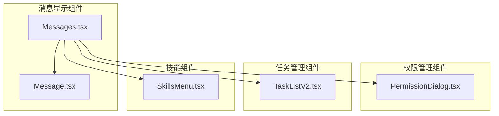
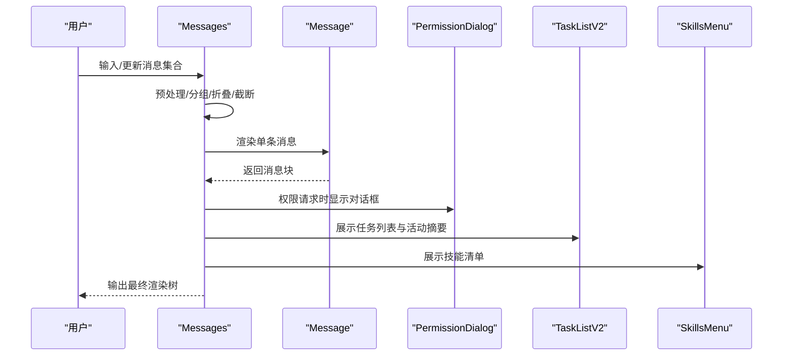
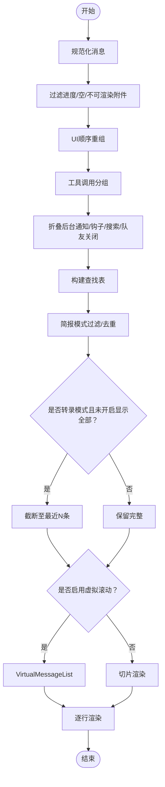
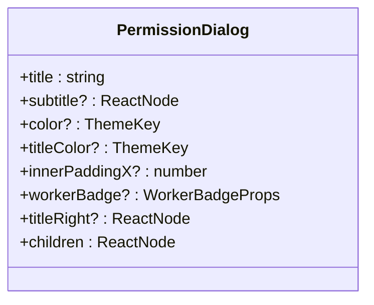
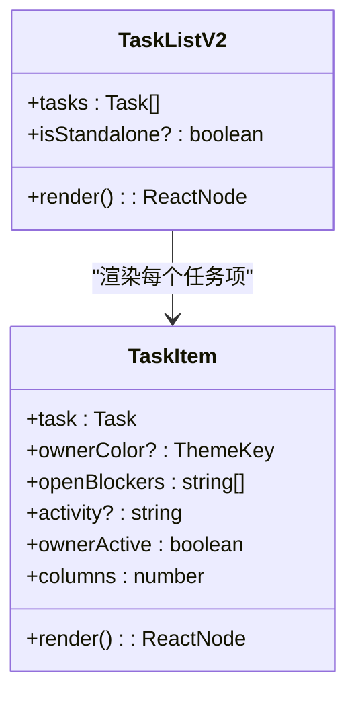
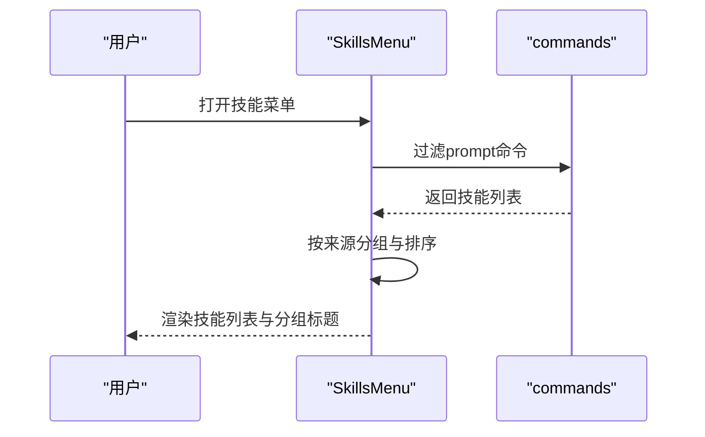
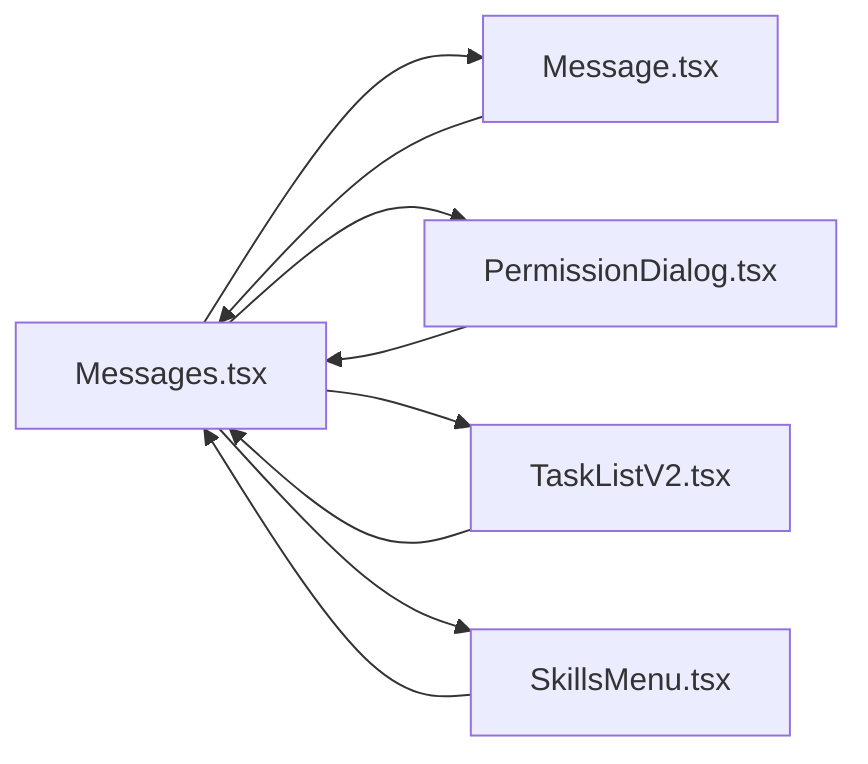

# 功能组件

<cite>
**本文档引用的文件**
- [Message.tsx](file://src/components/Message.tsx)
- [Messages.tsx](file://src/components/Messages.tsx)
- [PermissionDialog.tsx](file://src/components/permissions/PermissionDialog.tsx)
- [TaskListV2.tsx](file://src/components/TaskListV2.tsx)
- [SkillsMenu.tsx](file://src/components/skills/SkillsMenu.tsx)
</cite>

## 目录
1. [简介](#简介)
2. [项目结构](#项目结构)
3. [核心组件](#核心组件)
4. [架构总览](#架构总览)
5. [详细组件分析](#详细组件分析)
6. [依赖分析](#依赖分析)
7. [性能考虑](#性能考虑)
8. [故障排除指南](#故障排除指南)
9. [结论](#结论)
10. [附录](#附录)

## 简介
本文件系统性梳理与说明代码库中的四大功能组件：消息显示组件、权限管理组件、任务管理组件与技能组件。内容涵盖组件职责、属性与事件、状态管理、渲染流程、组件间协作与数据共享机制，并提供可定制与扩展建议，帮助开发者快速理解与高效集成。

## 项目结构
四大组件分别位于以下目录：
- 消息显示组件：src/components/Message.tsx、src/components/Messages.tsx
- 权限管理组件：src/components/permissions/PermissionDialog.tsx
- 任务管理组件：src/components/TaskListV2.tsx
- 技能组件：src/components/skills/SkillsMenu.tsx

**图表来源**
- [Message.tsx](file://src/components/Message.tsx)
- [Messages.tsx](file://src/components/Messages.tsx)
- [PermissionDialog.tsx](file://src/components/permissions/PermissionDialog.tsx)
- [TaskListV2.tsx](file://src/components/TaskListV2.tsx)
- [SkillsMenu.tsx](file://src/components/skills/SkillsMenu.tsx)

**章节来源**
- [Message.tsx](file://src/components/Message.tsx)
- [Messages.tsx](file://src/components/Messages.tsx)
- [PermissionDialog.tsx](file://src/components/permissions/PermissionDialog.tsx)
- [TaskListV2.tsx](file://src/components/TaskListV2.tsx)
- [SkillsMenu.tsx](file://src/components/skills/SkillsMenu.tsx)

## 核心组件
- 消息显示组件（Message/Messages）：负责对话消息的渲染、分组、折叠、截断与动画控制；支持转录模式、简报模式、思维流展示等。
- 权限管理组件（PermissionDialog）：统一呈现权限请求对话框，支持标题、副标题、颜色主题、右侧装饰与子内容布局。
- 任务管理组件（TaskListV2）：以终端友好的方式展示任务列表，支持按状态排序、最近完成任务高亮、活动摘要聚合、多源任务合并。
- 技能组件（SkillsMenu）：展示技能清单，按来源（设置、插件、MCP）分组，提供快捷提示与令牌估算信息。

**章节来源**
- [Message.tsx](file://src/components/Message.tsx)
- [Messages.tsx](file://src/components/Messages.tsx)
- [PermissionDialog.tsx](file://src/components/permissions/PermissionDialog.tsx)
- [TaskListV2.tsx](file://src/components/TaskListV2.tsx)
- [SkillsMenu.tsx](file://src/components/skills/SkillsMenu.tsx)

## 架构总览
消息显示组件作为中枢，协调工具调用、权限请求、任务与技能等周边能力：
- Messages 负责消息预处理（去重、重组、分组、折叠）、虚拟滚动、截断策略与渲染范围切片。
- Message 负责具体消息块的渲染分支（文本、思考、工具调用、附件等），并支持转录模式下的思考隐藏。
- PermissionDialog 为权限请求提供统一 UI 容器。
- TaskListV2 提供任务概览与活动摘要，便于在消息上下文中进行任务状态可视化。
- SkillsMenu 展示可用技能，支持来源分组与快捷操作。

**图表来源**
- [Messages.tsx](file://src/components/Messages.tsx)
- [Message.tsx](file://src/components/Message.tsx)
- [PermissionDialog.tsx](file://src/components/permissions/PermissionDialog.tsx)
- [TaskListV2.tsx](file://src/components/TaskListV2.tsx)
- [SkillsMenu.tsx](file://src/components/skills/SkillsMenu.tsx)

## 详细组件分析

### 消息显示组件（Message/Messages）
- 职责
  - 将消息数组转换为可渲染的 UI 结构，支持多种消息类型（用户、助手、系统、附件、工具调用等）。
  - 在转录模式下控制思考块的可见性与最后思考块定位。
  - 支持简报模式过滤与文本去重，提升信息密度。
  - 提供虚拟滚动与安全渲染上限，避免长会话内存与性能问题。
- 关键属性
  - Messages：messages、tools、commands、verbose、toolJSX、toolUseConfirmQueue、inProgressToolUseIDs、isMessageSelectorVisible、screen、streamingToolUses、isBriefOnly、unseenDivider、scrollRef、cursor、renderRange 等。
  - Message：message、lookups、containerWidth、addMargin、tools、commands、verbose、inProgressToolUseIDs、progressMessagesForMessage、shouldAnimate、shouldShowDot、style、width、isTranscriptMode、onOpenRateLimitOptions、isActiveCollapsedGroup、isUserContinuation、lastThinkingBlockId、latestBashOutputUUID。
- 状态与事件
  - 状态：expandedKeys（展开键集合）、selectedIdx（选中索引）、searchTextCache（搜索文本缓存）、sliceAnchorRef（渲染切片锚点）。
  - 事件：onOpenRateLimitOptions、setCursor、onSearchMatchesChange、scanElement、setPositions。
- 数据流
  - 预处理链：normalize → 过滤（进度/空消息/不可渲染附件）→ 重组（UI顺序）→ 分组（工具调用）→ 折叠（后台通知/钩子/搜索/队友关闭）→ 查找表（lookup）。
  - 渲染链：虚拟滚动或切片渲染 → 消息行渲染 → 可点击区域判定 → 选择态与展开态联动。
- 性能优化
  - React.memo + 自定义比较函数，避免频繁重渲染。
  - 切片锚定（基于 UUID 前缀）与固定步长推进，减少长度波动带来的重排。
  - 虚拟滚动替代全量挂载，限制 Fiber 树规模。
  - 流式工具调用与思考内容的增量渲染，降低抖动。

**图表来源**
- [Messages.tsx](file://src/components/Messages.tsx)

**章节来源**
- [Message.tsx](file://src/components/Message.tsx)
- [Messages.tsx](file://src/components/Messages.tsx)

### 权限管理组件（PermissionDialog）
- 职责
  - 统一呈现权限请求对话框，支持标题、副标题、颜色主题、右侧装饰与子内容布局。
- 关键属性
  - title、subtitle、color、titleColor、innerPaddingX、workerBadge、titleRight、children。
- 使用场景
  - 在消息渲染过程中，当需要用户授权某项工具或操作时，通过 PermissionDialog 包裹权限请求 UI。
- 扩展建议
  - 可增加图标、描述文案、快捷键提示等，提升可发现性与可操作性。

**图表来源**
- [PermissionDialog.tsx](file://src/components/permissions/PermissionDialog.tsx)

**章节来源**
- [PermissionDialog.tsx](file://src/components/permissions/PermissionDialog.tsx)

### 任务管理组件（TaskListV2）
- 职责
  - 在终端界面中以紧凑列表形式展示任务，支持按状态优先级排序、最近完成高亮、阻塞关系显示、活动摘要聚合与多源任务合并。
- 关键属性
  - tasks、isStandalone。
- 状态与行为
  - 记录最近完成时间戳，30秒内完成的任务在顶部优先展示。
  - 根据终端尺寸动态计算最大显示行数，超过阈值时进行截断并提供“隐藏摘要”提示。
  - 支持多源任务（本地、插件、MCP）与团队成员活动摘要聚合。
- 可定制性
  - 可通过 isStandalone 控制是否显示统计头部与缩进。
  - 可根据列宽动态调整显示策略（如显示所有者、活动摘要等）。

**图表来源**
- [TaskListV2.tsx](file://src/components/TaskListV2.tsx)

**章节来源**
- [TaskListV2.tsx](file://src/components/TaskListV2.tsx)

### 技能组件（SkillsMenu）
- 职责
  - 展示技能清单，按来源（设置、插件、MCP）分组，提供快捷提示与令牌估算信息。
- 关键属性
  - onExit、commands。
- 行为与数据
  - 过滤出类型为 prompt 的命令，按来源分组并排序。
  - 对 MCP 技能提取服务器名，对文件型技能显示路径。
  - 提供“无技能”提示与关闭快捷键。
- 可定制性
  - 可扩展来源类型与分组逻辑，支持更多技能来源。
  - 可自定义技能项的展示格式与元信息（如令牌估算、插件名称等）。

**图表来源**
- [SkillsMenu.tsx](file://src/components/skills/SkillsMenu.tsx)

**章节来源**
- [SkillsMenu.tsx](file://src/components/skills/SkillsMenu.tsx)

## 依赖分析
- 组件耦合
  - Messages 与 Message：消息渲染的父子关系，Messages 负责预处理与调度，Message 负责具体块渲染。
  - Messages 与 PermissionDialog：在需要权限确认时，由 Messages 触发 PermissionDialog 显示。
  - Messages 与 TaskListV2：在消息上下文中展示任务列表与活动摘要，增强交互上下文。
  - Messages 与 SkillsMenu：在需要调用技能时，由 Messages 触发技能菜单展示。
- 外部依赖
  - 终端渲染（ink）、主题与样式、虚拟滚动（VirtualMessageList）、工具与命令系统、消息预处理工具集（normalize、collapse、lookup）。
- 循环依赖风险
  - 当前结构清晰，未见循环导入；若后续扩展，需避免在消息渲染中直接引入权限/任务/技能的复杂逻辑，保持职责单一。

**图表来源**
- [Messages.tsx](file://src/components/Messages.tsx)
- [Message.tsx](file://src/components/Message.tsx)
- [PermissionDialog.tsx](file://src/components/permissions/PermissionDialog.tsx)
- [TaskListV2.tsx](file://src/components/TaskListV2.tsx)
- [SkillsMenu.tsx](file://src/components/skills/SkillsMenu.tsx)

**章节来源**
- [Messages.tsx](file://src/components/Messages.tsx)
- [Message.tsx](file://src/components/Message.tsx)
- [PermissionDialog.tsx](file://src/components/permissions/PermissionDialog.tsx)
- [TaskListV2.tsx](file://src/components/TaskListV2.tsx)
- [SkillsMenu.tsx](file://src/components/skills/SkillsMenu.tsx)

## 性能考虑
- 渲染上限与切片
  - 未启用虚拟滚动时，采用基于 UUID 锚点的切片策略，避免按计数切片导致的滚动回溯与全屏重绘。
- 虚拟滚动
  - 在全屏环境启用 VirtualMessageList，将内存占用与重绘成本限制在可视范围内。
- 消息预处理
  - 预处理链（去重、重组、分组、折叠、查找表）一次性完成，避免每次渲染重复计算。
- 比较与记忆化
  - Messages 使用自定义 memo 比较，仅在必要字段变化时重渲染，显著降低频繁变更带来的抖动。
- 流式渲染
  - 工具调用与思考内容的增量渲染，配合稳定 key 生成，避免组件反复挂载。

[本节为通用指导，无需特定文件引用]

## 故障排除指南
- 思考内容不显示
  - 检查是否处于转录模式且 hidePastThinking 启用；确认 lastThinkingBlockId 是否正确推导。
- 最新 Bash 输出未展开
  - 检查 latestBashOutputUUID 推导逻辑与 isUserContinuation 标记。
- 任务列表为空
  - 确认 isTodoV2Enabled 开关与 tasks 数组非空；检查 isStandalone 与终端宽度对显示的影响。
- 技能菜单无结果
  - 确认 commands 中存在类型为 prompt 的命令，且 loadedFrom 属于允许来源（skills/commands_DEPRECATED/plugin/mcp）。
- 权限对话框不出现
  - 确认在需要授权时由 Messages 触发 PermissionDialog，并传入正确的标题与子内容。

**章节来源**
- [Messages.tsx](file://src/components/Messages.tsx)
- [TaskListV2.tsx](file://src/components/TaskListV2.tsx)
- [SkillsMenu.tsx](file://src/components/skills/SkillsMenu.tsx)
- [PermissionDialog.tsx](file://src/components/permissions/PermissionDialog.tsx)

## 结论
四大功能组件围绕消息渲染与交互体验展开：消息显示组件承担中枢职责，权限管理组件提供一致的授权入口，任务管理组件与技能组件分别在上下文中提供任务与技能的可视化与操作入口。通过预处理、切片、虚拟滚动与记忆化等手段，系统在长会话与复杂交互下仍能保持流畅与稳定。开发者可在各自组件边界内进行定制与扩展，同时遵循统一的主题与布局规范，确保整体一致性。

[本节为总结性内容，无需特定文件引用]

## 附录
- 组件集成与使用示例（路径指引）
  - 消息渲染：在应用主屏中引入 Messages，并传入 messages、tools、commands、screen 等参数。
  - 权限请求：在消息渲染中检测到需要授权时，包裹 PermissionDialog 并传入标题与子内容。
  - 任务展示：在消息上下文中引入 TaskListV2，并传入 tasks 与 isStandalone。
  - 技能展示：在需要时调用 SkillsMenu，并传入 onExit 与 commands。
- 可定制与扩展建议
  - 消息显示：新增消息类型时，在 Message 的渲染分支中添加对应处理；在 Messages 的预处理链中补充相应折叠/分组逻辑。
  - 权限管理：在 PermissionDialog 中扩展颜色主题与装饰元素，以适配不同权限场景。
  - 任务管理：扩展任务来源与活动摘要算法，支持更多团队协作场景。
  - 技能组件：扩展来源类型与分组规则，支持更多外部技能源（如远程服务）。

[本节为通用指导，无需特定文件引用]