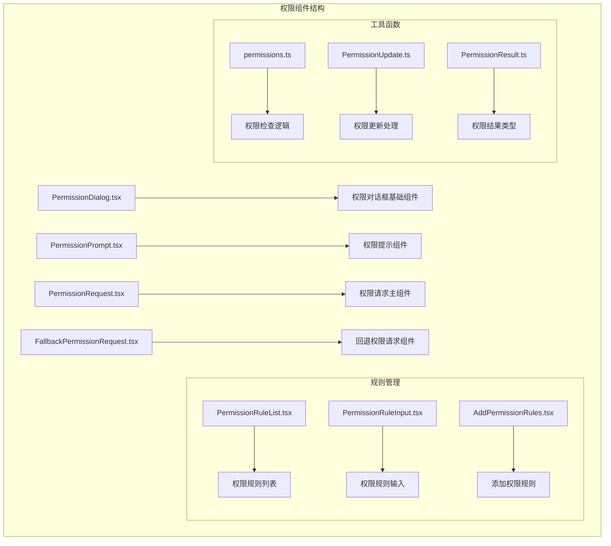
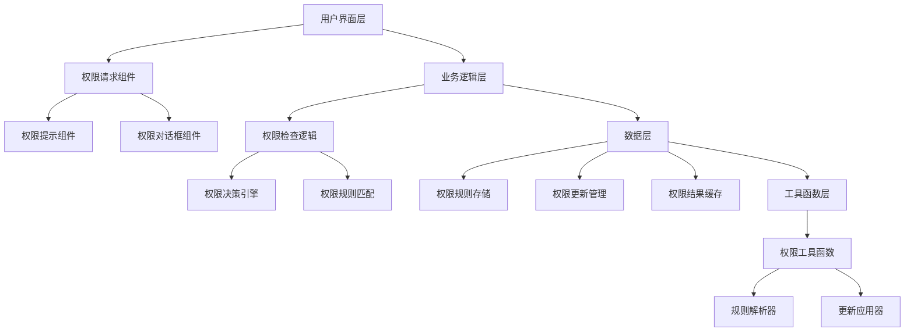
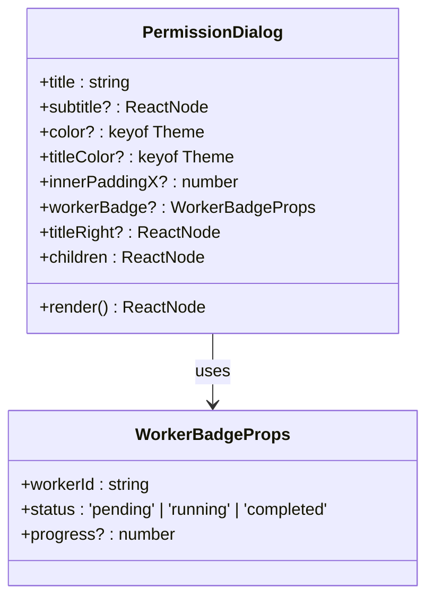
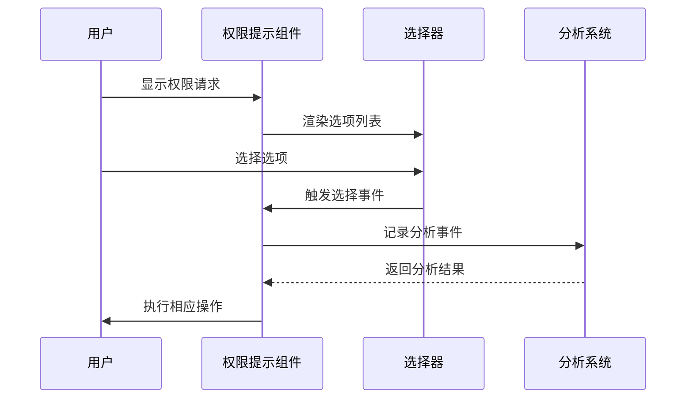
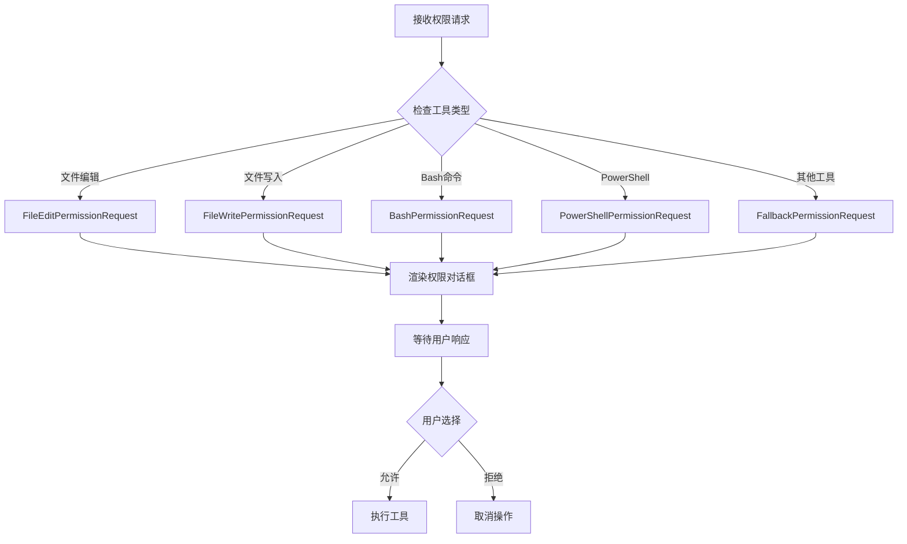
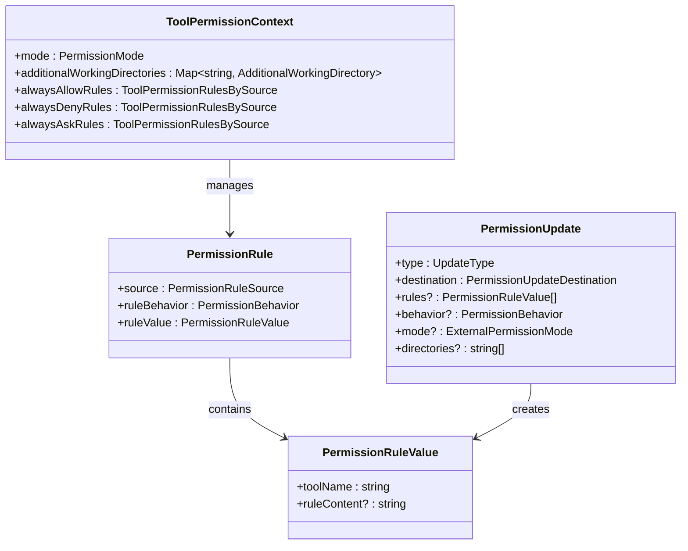
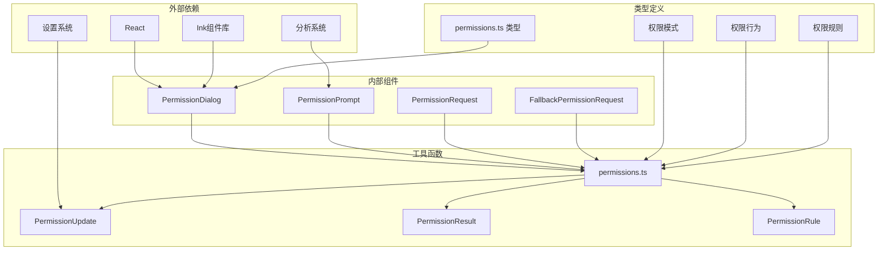

# 权限组件

<cite>
**本文档引用的文件**
- [PermissionDialog.tsx](file://src/components/permissions/PermissionDialog.tsx)
- [PermissionPrompt.tsx](file://src/components/permissions/PermissionPrompt.tsx)
- [PermissionRequest.tsx](file://src/components/permissions/PermissionRequest.tsx)
- [FallbackPermissionRequest.tsx](file://src/components/permissions/FallbackPermissionRequest.tsx)
- [PermissionRuleList.tsx](file://src/components/permissions/rules/PermissionRuleList.tsx)
- [permissions.ts](file://src/utils/permissions/permissions.ts)
- [PermissionResult.ts](file://src/utils/permissions/PermissionResult.ts)
- [PermissionRule.ts](file://src/utils/permissions/PermissionRule.ts)
- [PermissionUpdate.ts](file://src/utils/permissions/PermissionUpdate.ts)
- [permissions.ts（类型定义）](file://src/types/permissions.ts)
</cite>

## 目录
1. [简介](#简介)
2. [项目结构](#项目结构)
3. [核心组件](#核心组件)
4. [架构概览](#架构概览)
5. [详细组件分析](#详细组件分析)
6. [依赖关系分析](#依赖关系分析)
7. [性能考虑](#性能考虑)
8. [故障排除指南](#故障排除指南)
9. [结论](#结论)

## 简介

权限组件是 Claude Code 中用于管理系统权限控制的核心模块。该组件体系提供了完整的权限请求、决策和管理功能，包括权限对话框、权限提示组件、权限规则管理和权限决策组件等核心功能。

权限组件的主要目标是：
- 提供用户友好的权限请求界面
- 实现智能的权限决策逻辑
- 支持灵活的权限规则配置
- 确保系统安全性和可控性

## 项目结构

权限组件位于 `src/components/permissions/` 目录下，采用按功能模块组织的结构：

**图表来源**
- [PermissionDialog.tsx:1-72](file://src/components/permissions/PermissionDialog.tsx#L1-L72)
- [PermissionPrompt.tsx:1-336](file://src/components/permissions/PermissionPrompt.tsx#L1-L336)
- [PermissionRequest.tsx:1-217](file://src/components/permissions/PermissionRequest.tsx#L1-L217)

**章节来源**
- [PermissionDialog.tsx:1-72](file://src/components/permissions/PermissionDialog.tsx#L1-L72)
- [PermissionPrompt.tsx:1-336](file://src/components/permissions/PermissionPrompt.tsx#L1-L336)
- [PermissionRequest.tsx:1-217](file://src/components/permissions/PermissionRequest.tsx#L1-L217)

## 核心组件

### 权限对话框组件

权限对话框是所有权限相关组件的基础容器，提供统一的视觉样式和布局结构。

**主要特性：**
- 可定制的主题颜色系统
- 工作器徽章支持
- 响应式布局设计
- 子组件嵌套能力

### 权限提示组件

权限提示组件提供用户交互界面，支持选项选择和反馈输入功能。

**核心功能：**
- 动态选项生成
- 反馈输入模式切换
- 键盘快捷键支持
- 分析事件记录

### 权限请求主组件

权限请求主组件负责协调不同类型的权限请求处理，根据工具类型选择相应的权限请求组件。

**关键机制：**
- 工具类型到组件的映射
- 权限决策状态管理
- 用户交互事件处理
- 通知消息显示

**章节来源**
- [PermissionDialog.tsx:7-16](file://src/components/permissions/PermissionDialog.tsx#L7-L16)
- [PermissionPrompt.tsx:10-29](file://src/components/permissions/PermissionPrompt.tsx#L10-L29)
- [PermissionRequest.tsx:83-127](file://src/components/permissions/PermissionRequest.tsx#L83-L127)

## 架构概览

权限组件系统采用分层架构设计，从底层的权限检查逻辑到顶层的用户界面组件：

**图表来源**
- [permissions.ts:473-520](file://src/utils/permissions/permissions.ts#L473-L520)
- [PermissionRequest.tsx:47-82](file://src/components/permissions/PermissionRequest.tsx#L47-L82)

## 详细组件分析

### 权限对话框组件深度分析

权限对话框组件是权限系统的基础容器，提供统一的视觉呈现和布局结构。

**图表来源**
- [PermissionDialog.tsx:7-16](file://src/components/permissions/PermissionDialog.tsx#L7-L16)

**组件属性详解：**
- `title`: 对话框标题，必填参数
- `subtitle`: 副标题内容，可选
- `color`: 主题颜色，支持自定义
- `titleColor`: 标题颜色，可选
- `innerPaddingX`: 内边距水平方向，可选
- `workerBadge`: 工作器徽章信息，可选
- `titleRight`: 标题右侧内容，可选
- `children`: 子组件内容，必填

### 权限提示组件深度分析

权限提示组件提供用户交互界面，支持动态选项生成和反馈输入功能。

**图表来源**
- [PermissionPrompt.tsx:137-181](file://src/components/permissions/PermissionPrompt.tsx#L137-L181)

**核心功能实现：**
- 动态选项转换为选择器兼容格式
- 输入模式切换（Tab键展开反馈输入）
- 分析事件记录和追踪
- 键盘快捷键绑定

**章节来源**
- [PermissionPrompt.tsx:45-326](file://src/components/permissions/PermissionPrompt.tsx#L45-L326)

### 权限请求主组件深度分析

权限请求主组件负责协调不同工具类型的权限请求处理。

**图表来源**
- [PermissionRequest.tsx:47-82](file://src/components/permissions/PermissionRequest.tsx#L47-L82)

**工具类型映射：**
- 文件编辑工具 → FileEditPermissionRequest
- 文件写入工具 → FileWritePermissionRequest  
- Bash工具 → BashPermissionRequest
- PowerShell工具 → PowerShellPermissionRequest
- 其他工具 → FallbackPermissionRequest

**章节来源**
- [PermissionRequest.tsx:146-216](file://src/components/permissions/PermissionRequest.tsx#L146-L216)

### 权限规则管理系统

权限规则管理系统提供完整的规则配置、管理和查询功能。

**图表来源**
- [PermissionRule.ts:1-41](file://src/utils/permissions/PermissionRule.ts#L1-L41)
- [PermissionUpdate.ts:55-188](file://src/utils/permissions/PermissionUpdate.ts#L55-L188)
- [permissions.ts（类型定义）:44-80](file://src/types/permissions.ts#L44-L80)

**章节来源**
- [PermissionRuleList.tsx:1-800](file://src/components/permissions/rules/PermissionRuleList.tsx#L1-L800)
- [PermissionUpdate.ts:1-390](file://src/utils/permissions/PermissionUpdate.ts#L1-L390)

## 依赖关系分析

权限组件系统具有清晰的依赖层次结构：

**图表来源**
- [permissions.ts:1-100](file://src/utils/permissions/permissions.ts#L1-L100)
- [PermissionRequest.tsx:1-50](file://src/components/permissions/PermissionRequest.tsx#L1-L50)

**依赖特点：**
- 低耦合高内聚的设计原则
- 清晰的职责分离
- 可测试性强的模块化结构
- 类型安全的接口设计

**章节来源**
- [permissions.ts:1-1487](file://src/utils/permissions/permissions.ts#L1-L1487)
- [permissions.ts（类型定义）:1-442](file://src/types/permissions.ts#L1-L442)

## 性能考虑

权限组件在设计时充分考虑了性能优化：

### 缓存策略
- 使用React.memo缓存组件渲染结果
- 智能的状态更新避免不必要的重渲染
- 规则匹配结果的缓存机制

### 异步处理
- 权限检查的异步执行
- 分类器决策的非阻塞处理
- 大量规则的分页显示

### 内存管理
- 组件卸载时的资源清理
- 事件监听器的正确移除
- 大对象的及时释放

## 故障排除指南

### 常见问题及解决方案

**权限请求不显示**
- 检查工具是否在权限规则中被正确识别
- 验证权限模式设置是否正确
- 确认用户是否有足够的权限查看权限请求

**权限决策错误**
- 检查分类器配置和网络连接
- 验证权限规则的语法正确性
- 查看日志中的错误信息

**界面显示异常**
- 确认主题设置的完整性
- 检查终端兼容性问题
- 验证组件的props传递

**章节来源**
- [permissions.ts:473-800](file://src/utils/permissions/permissions.ts#L473-L800)
- [PermissionPrompt.tsx:252-264](file://src/components/permissions/PermissionPrompt.tsx#L252-L264)

## 结论

权限组件系统提供了完整、灵活且高性能的权限管理解决方案。通过模块化的架构设计、清晰的职责分离和完善的类型系统，该组件体系能够满足各种复杂的权限管理需求。

**主要优势：**
- 完整的权限生命周期管理
- 灵活的规则配置系统
- 用户友好的交互界面
- 强大的扩展性和定制能力
- 良好的性能表现和可维护性

**适用场景：**
- 开发者工具的权限控制
- 企业级应用的安全管理
- 多用户环境下的权限隔离
- 自动化脚本的权限审批

该权限组件系统为Claude Code提供了坚实的安全基础，确保系统在提供强大功能的同时保持高度的安全性和可控性。