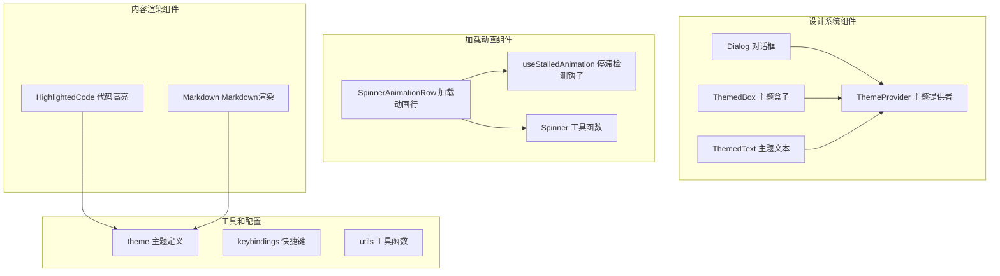
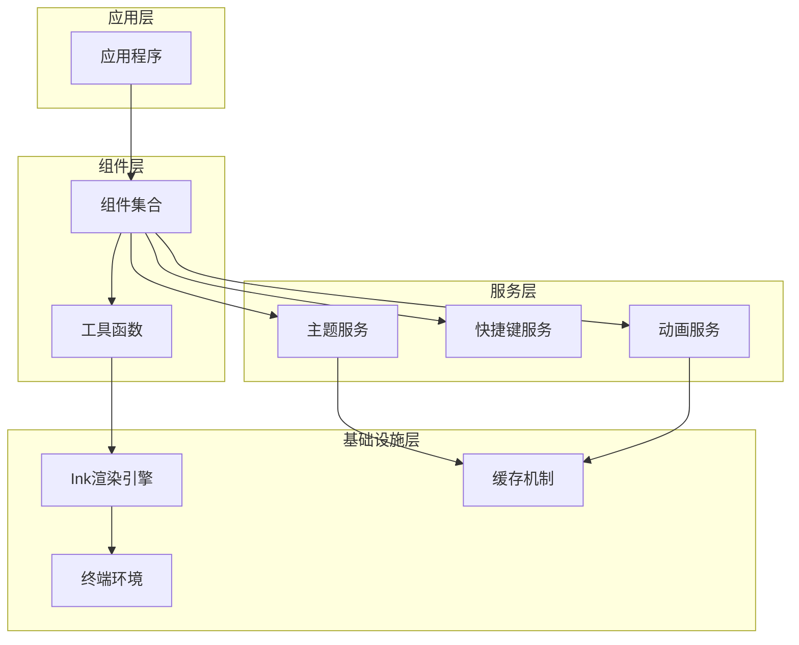
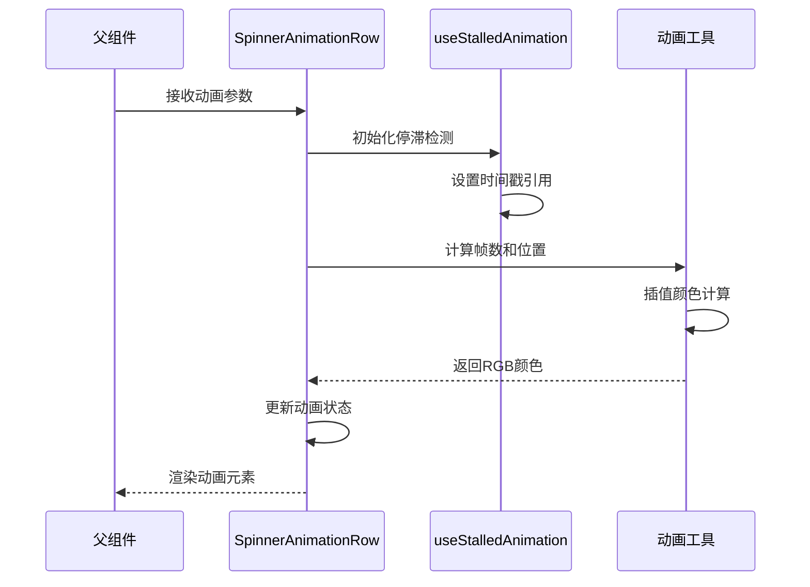
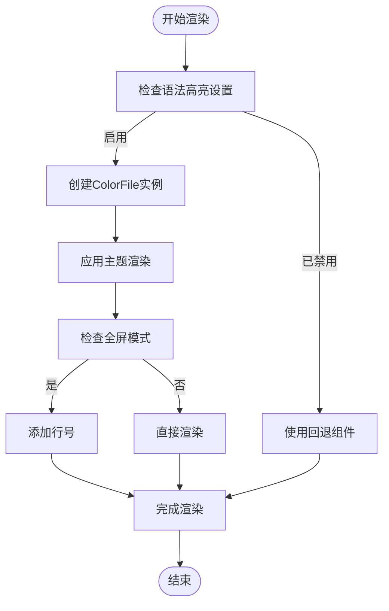
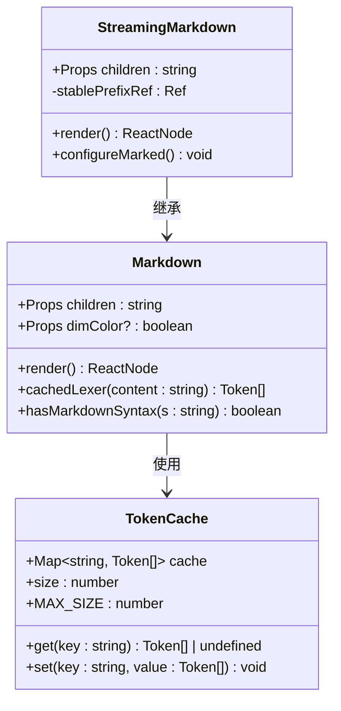
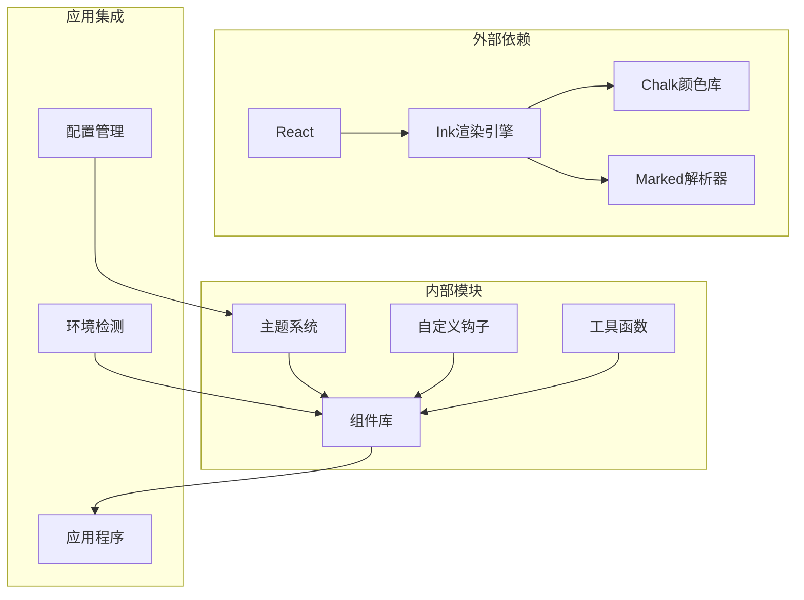

# UI 框架组件

<cite>
**本文档引用的文件**
- [Dialog.tsx](file://src/components/design-system/Dialog.tsx)
- [ThemedBox.tsx](file://src/components/design-system/ThemedBox.tsx)
- [ThemedText.tsx](file://src/components/design-system/ThemedText.tsx)
- [ThemeProvider.tsx](file://src/components/design-system/ThemeProvider.tsx)
- [theme.ts](file://src/utils/theme.ts)
- [SpinnerAnimationRow.tsx](file://src/components/Spinner/SpinnerAnimationRow.tsx)
- [useStalledAnimation.ts](file://src/components/Spinner/useStalledAnimation.ts)
- [utils.ts](file://src/components/Spinner/utils.ts)
- [HighlightedCode.tsx](file://src/components/HighlightedCode.tsx)
- [Markdown.tsx](file://src/components/Markdown.tsx)
</cite>

## 目录
1. [简介](#简介)
2. [项目结构](#项目结构)
3. [核心组件](#核心组件)
4. [架构概览](#架构概览)
5. [详细组件分析](#详细组件分析)
6. [依赖关系分析](#依赖关系分析)
7. [性能考虑](#性能考虑)
8. [故障排除指南](#故障排除指南)
9. [结论](#结论)

## 简介

本UI框架组件库是一个基于React和Ink的现代化终端界面组件系统，专为命令行应用设计。该系统提供了完整的组件生态，包括对话框、按钮、布局容器、文本渲染、加载动画、代码高亮和Markdown渲染等功能。

该组件库的核心设计理念是：
- **主题一致性**：通过统一的主题系统确保视觉风格的一致性
- **可访问性优先**：支持色盲友好模式和键盘导航
- **性能优化**：采用记忆化和缓存策略提升渲染效率
- **响应式设计**：适配不同终端环境和屏幕尺寸
- **无障碍支持**：内置键盘快捷键和屏幕阅读器支持

## 项目结构

UI框架组件库采用模块化的目录结构，主要分为以下几个核心部分：

**图表来源**
- [Dialog.tsx:11-29](file://src/components/design-system/Dialog.tsx#L11-L29)
- [ThemedBox.tsx:12-24](file://src/components/design-system/ThemedBox.tsx#L12-L24)
- [ThemedText.tsx:12-61](file://src/components/design-system/ThemedText.tsx#L12-L61)

**章节来源**
- [Dialog.tsx:1-138](file://src/components/design-system/Dialog.tsx#L1-L138)
- [ThemedBox.tsx:1-156](file://src/components/design-system/ThemedBox.tsx#L1-L156)
- [ThemedText.tsx:1-124](file://src/components/design-system/ThemedText.tsx#L1-L124)

## 核心组件

### 设计系统组件

设计系统组件是整个UI框架的基础，提供了统一的视觉语言和交互模式。

#### Dialog 对话框组件

Dialog组件是一个功能完整的模态对话框，支持多种交互模式和主题定制。

**主要特性：**
- 支持确认/取消操作（Esc/n）
- 内置退出处理（Ctrl+C/D）
- 可自定义输入指导信息
- 边框和颜色主题支持
- 键盘快捷键集成

**关键属性：**
- `title`: 对话框标题（必需）
- `subtitle`: 副标题
- `onCancel`: 取消回调函数
- `color`: 主题颜色键
- `hideInputGuide`: 隐藏输入指导
- `hideBorder`: 隐藏边框
- `isCancelActive`: 控制取消键绑定

#### ThemedBox 主题盒子组件

ThemedBox是对Ink Box组件的增强版本，自动解析主题颜色键并应用到边框和背景。

**核心功能：**
- 自动主题颜色解析
- 支持边框颜色继承
- 性能优化的记忆化
- 事件处理器支持

**颜色属性：**
- `borderColor`: 边框颜色
- `backgroundColor`: 背景颜色
- `borderTopColor`: 顶部边框颜色
- `borderBottomColor`: 底部边框颜色
- `borderLeftColor`: 左侧边框颜色
- `borderRightColor`: 右侧边框颜色

#### ThemedText 主题文本组件

ThemedText提供高级文本渲染功能，支持多种样式和主题集成。

**样式支持：**
- 颜色和背景色
- 粗体、斜体、下划线
- 删除线效果
- 反转颜色
- 文本包装控制

**上下文功能：**
- TextHoverColorContext用于子树颜色覆盖
- 支持悬停状态的颜色变化
- 跨越Box边界的样式继承

**章节来源**
- [Dialog.tsx:11-29](file://src/components/design-system/Dialog.tsx#L11-L29)
- [ThemedBox.tsx:12-50](file://src/components/design-system/ThemedBox.tsx#L12-L50)
- [ThemedText.tsx:9-74](file://src/components/design-system/ThemedText.tsx#L9-L74)

### 主题系统

主题系统是UI框架的核心，提供了完整的颜色管理和动态切换能力。

**主题类型：**
- `dark`: 深色主题
- `light`: 浅色主题
- `light-daltonized`: 色盲友好浅色主题
- `dark-daltonized`: 色盲友好深色主题
- `light-ansi`: ANSI兼容浅色主题
- `dark-ansi`: ANSI兼容深色主题

**主题颜色定义：**
- 语义化颜色：success（成功）、error（错误）、warning（警告）
- 功能性颜色：background（背景）、text（文本）、inactive（非活跃）
- 特殊用途颜色：diffAdded（差异添加）、diffRemoved（差异删除）
- Agent专用颜色：red、blue、green等多色彩方案

**章节来源**
- [theme.ts:4-89](file://src/utils/theme.ts#L4-L89)
- [theme.ts:91-109](file://src/utils/theme.ts#L91-L109)

## 架构概览

UI框架采用分层架构设计，确保组件间的松耦合和高内聚。

**图表来源**
- [ThemeProvider.tsx:43-116](file://src/components/design-system/ThemeProvider.tsx#L43-L116)
- [theme.ts:598-613](file://src/utils/theme.ts#L598-L613)

### 组件通信模式

组件间通信采用以下模式：

1. **上下文传递**：通过React Context实现跨层级数据共享
2. **事件驱动**：使用事件处理器处理用户交互
3. **状态提升**：将共享状态提升到最近的共同祖先
4. **回调模式**：父组件通过回调函数接收子组件状态变化

**章节来源**
- [ThemeProvider.tsx:8-28](file://src/components/design-system/ThemeProvider.tsx#L8-L28)
- [ThemedBox.tsx:56-153](file://src/components/design-system/ThemedBox.tsx#L56-L153)

## 详细组件分析

### 加载动画组件

加载动画组件提供了丰富的视觉反馈，特别是在长时间操作或AI生成过程中。

#### SpinnerAnimationRow 组件

SpinnerAnimationRow是加载动画的核心组件，负责处理复杂的动画逻辑。

**动画特性：**
- 基于50ms帧率的精确动画控制
- 多种动画模式支持：请求中、工具使用、响应中、思考中
- 停滞检测和红色过渡效果
- Token计数平滑动画
- 时间显示和令牌统计

**性能优化：**
- 使用useAnimationFrame减少重渲染
- 内存友好的颜色插值算法
- 条件渲染优化
- 字符宽度缓存

**图表来源**
- [SpinnerAnimationRow.tsx:102-231](file://src/components/Spinner/SpinnerAnimationRow.tsx#L102-L231)
- [useStalledAnimation.ts:6-75](file://src/components/Spinner/useStalledAnimation.ts#L6-L75)

**章节来源**
- [SpinnerAnimationRow.tsx:36-69](file://src/components/Spinner/SpinnerAnimationRow.tsx#L36-L69)
- [useStalledAnimation.ts:14-75](file://src/components/Spinner/useStalledAnimation.ts#L14-L75)

### 代码高亮组件

HighlightedCode组件提供专业的代码语法高亮功能。

**核心功能：**
- 多语言语法高亮支持
- 行号显示
- 全屏模式支持
- 选择性禁用高亮
- 性能优化的渲染

**渲染流程：**
1. 检查语法高亮设置
2. 创建ColorFile实例
3. 渲染主题化代码
4. 处理全屏模式下的行号
5. 提供回退机制

**图表来源**
- [HighlightedCode.tsx:18-136](file://src/components/HighlightedCode.tsx#L18-L136)

**章节来源**
- [HighlightedCode.tsx:11-16](file://src/components/HighlightedCode.tsx#L11-L16)

### Markdown 渲染组件

Markdown组件提供高性能的Markdown渲染功能，支持表格和其他复杂元素。

**渲染策略：**
- 模块级令牌缓存（LRU淘汰）
- 语法检测优化
- 悬挂渲染支持
- 代码高亮集成

**性能优化：**
- 令牌缓存避免重复解析
- 快速路径处理纯文本
- 懒加载CLI高亮功能
- 内存友好的字符串处理

**图表来源**
- [Markdown.tsx:78-171](file://src/components/Markdown.tsx#L78-L171)
- [Markdown.tsx:186-235](file://src/components/Markdown.tsx#L186-L235)

**章节来源**
- [Markdown.tsx:17-36](file://src/components/Markdown.tsx#L17-L36)

## 依赖关系分析

UI框架组件库的依赖关系体现了清晰的分层架构。

**图表来源**
- [theme.ts:1-2](file://src/utils/theme.ts#L1-L2)
- [SpinnerAnimationRow.tsx:1-16](file://src/components/Spinner/SpinnerAnimationRow.tsx#L1-L16)

### 关键依赖链

1. **渲染层依赖**：所有组件都依赖Ink渲染引擎
2. **主题依赖**：组件依赖主题系统进行颜色解析
3. **工具依赖**：组件使用各种工具函数进行优化
4. **环境依赖**：组件根据运行环境调整行为

**章节来源**
- [ThemedBox.tsx:3-9](file://src/components/design-system/ThemedBox.tsx#L3-L9)
- [ThemedText.tsx:4-7](file://src/components/design-system/ThemedText.tsx#L4-L7)

## 性能考虑

UI框架在多个层面实现了性能优化策略：

### 渲染优化

1. **记忆化缓存**：使用React.memo和useMemo避免不必要的重渲染
2. **条件渲染**：根据状态变化智能选择渲染路径
3. **批量更新**：合并状态更新减少渲染次数
4. **虚拟滚动**：对于大量数据的列表使用虚拟化技术

### 内存管理

1. **对象池**：复用昂贵的对象实例
2. **缓存策略**：实现LRU缓存避免内存泄漏
3. **引用清理**：及时清理不再使用的引用
4. **垃圾回收**：合理管理大对象的生命周期

### 网络和I/O优化

1. **懒加载**：按需加载大型依赖
2. **预加载**：提前加载可能需要的资源
3. **节流防抖**：限制高频操作的执行频率
4. **并发控制**：限制同时进行的操作数量

## 故障排除指南

### 常见问题和解决方案

#### 主题相关问题

**问题**：主题切换不生效
**原因**：主题上下文未正确传递
**解决**：确保在应用根部使用ThemeProvider

**问题**：颜色显示异常
**原因**：ANSI颜色支持不兼容
**解决**：检查终端环境，使用ANSI主题

#### 性能问题

**问题**：渲染卡顿
**原因**：频繁的状态更新
**解决**：使用useMemo和React.memo优化

**问题**：内存占用过高
**原因**：缓存未清理
**解决**：实现适当的缓存清理策略

#### 功能问题

**问题**：快捷键无响应
**原因**：键盘事件处理冲突
**解决**：检查事件处理器优先级

**问题**：动画不流畅
**原因**：帧率不足
**解决**：优化动画逻辑，减少重排

**章节来源**
- [ThemeProvider.tsx:43-116](file://src/components/design-system/ThemeProvider.tsx#L43-L116)
- [ThemedBox.tsx:56-153](file://src/components/design-system/ThemedBox.tsx#L56-L153)

## 结论

UI框架组件库提供了一个完整、高性能且易于使用的组件生态系统。其设计特点包括：

**优势总结：**
- **一致性**：统一的设计语言和交互模式
- **可扩展性**：模块化架构支持功能扩展
- **性能**：多层优化确保流畅体验
- **可访问性**：内置无障碍支持和色盲友好模式
- **主题化**：灵活的主题系统支持个性化定制

**最佳实践建议：**
1. 优先使用设计系统提供的基础组件
2. 合理利用主题系统进行品牌定制
3. 注意性能优化，避免不必要的重渲染
4. 充分测试不同终端环境的兼容性
5. 利用无障碍功能提升用户体验

该组件库为构建高质量的命令行应用提供了坚实的基础，通过合理的架构设计和性能优化，能够满足各种复杂应用场景的需求。