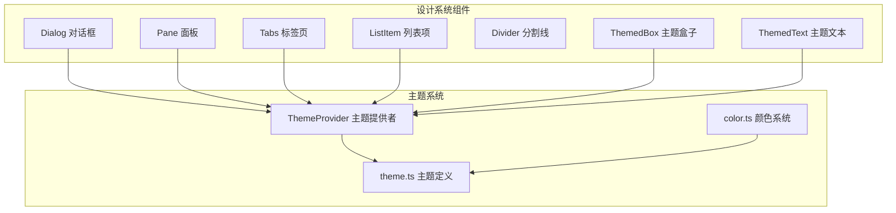
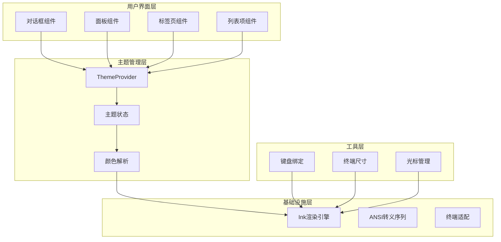
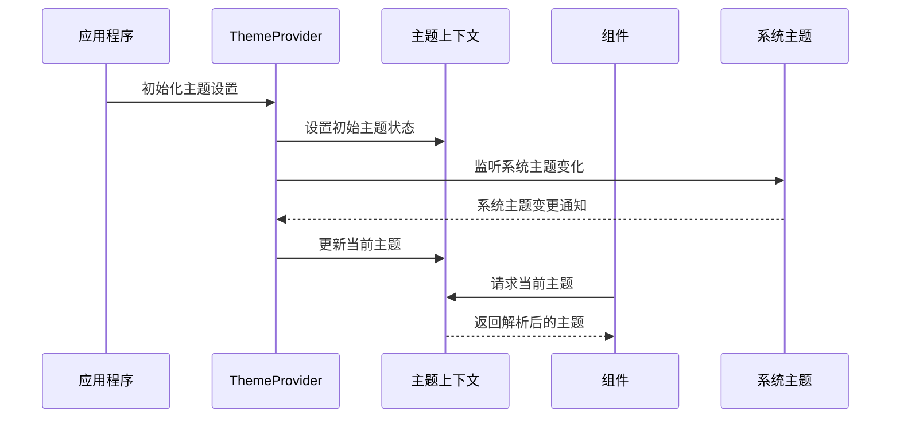
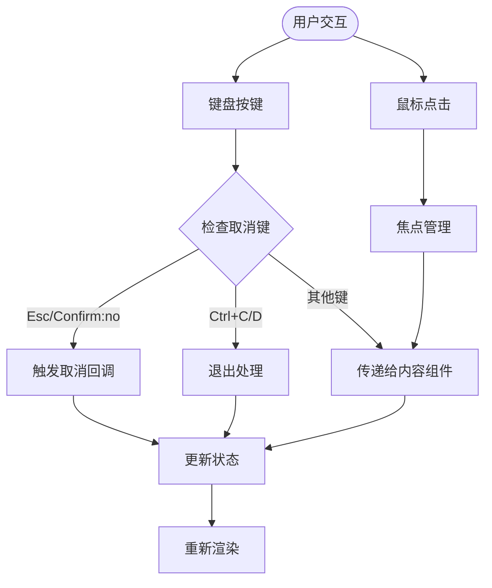
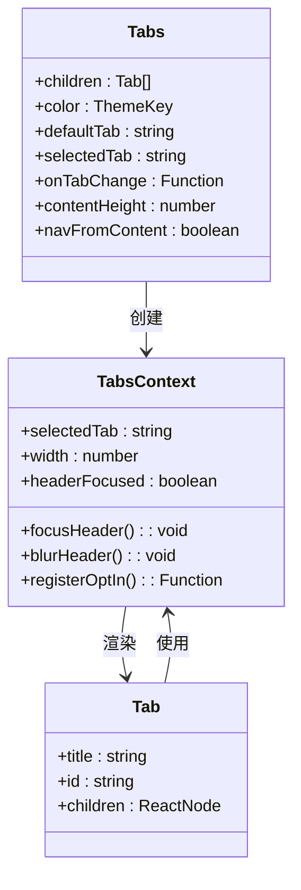
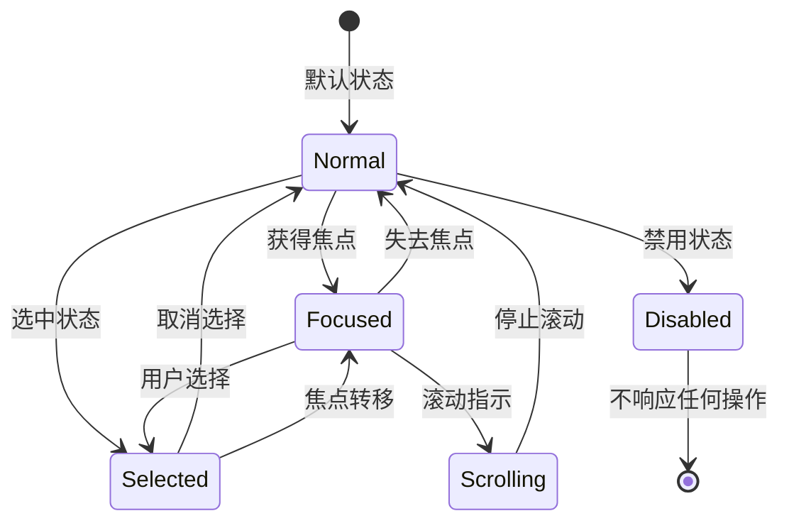
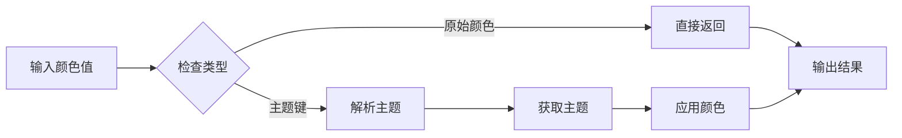
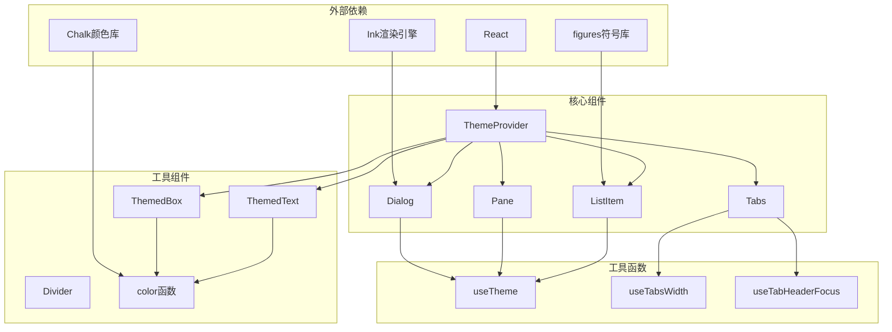

# 设计系统基础组件

<cite>
**本文档引用的文件**
- [Dialog.tsx](file://src/components/design-system/Dialog.tsx)
- [Pane.tsx](file://src/components/design-system/Pane.tsx)
- [Tabs.tsx](file://src/components/design-system/Tabs.tsx)
- [ListItem.tsx](file://src/components/design-system/ListItem.tsx)
- [ThemeProvider.tsx](file://src/components/design-system/ThemeProvider.tsx)
- [color.ts](file://src/components/design-system/color.ts)
- [theme.ts](file://src/utils/theme.ts)
- [ThemedBox.tsx](file://src/components/design-system/ThemedBox.tsx)
- [ThemedText.tsx](file://src/components/design-system/ThemedText.tsx)
- [Divider.tsx](file://src/components/design-system/Divider.tsx)
</cite>

## 目录
1. [简介](#简介)
2. [项目结构](#项目结构)
3. [核心组件](#核心组件)
4. [架构概览](#架构概览)
5. [详细组件分析](#详细组件分析)
6. [依赖关系分析](#依赖关系分析)
7. [性能考虑](#性能考虑)
8. [故障排除指南](#故障排除指南)
9. [结论](#结论)

## 简介

本设计系统基础组件文档深入解析了终端界面中的核心UI组件，包括对话框(Dialog)、面板(Pane)、标签页(Tabs)、列表项(ListItem)等。这些组件构成了终端应用的视觉和交互基础，提供了统一的主题系统、可访问性支持和响应式设计能力。

设计系统采用主题驱动的方式，通过ThemeProvider提供全局主题状态管理，结合color.ts的颜色解析系统，实现了灵活的主题切换和颜色管理。所有组件都遵循一致的设计语言，确保用户体验的连贯性和一致性。

## 项目结构

设计系统组件位于`src/components/design-system/`目录下，采用模块化组织方式：

**图表来源**
- [Dialog.tsx:1-138](file://src/components/design-system/Dialog.tsx#L1-L138)
- [Pane.tsx:1-77](file://src/components/design-system/Pane.tsx#L1-L77)
- [Tabs.tsx:1-340](file://src/components/design-system/Tabs.tsx#L1-L340)
- [ThemeProvider.tsx:1-170](file://src/components/design-system/ThemeProvider.tsx#L1-L170)

**章节来源**
- [Dialog.tsx:1-138](file://src/components/design-system/Dialog.tsx#L1-L138)
- [Pane.tsx:1-77](file://src/components/design-system/Pane.tsx#L1-L77)
- [Tabs.tsx:1-340](file://src/components/design-system/Tabs.tsx#L1-L340)

## 核心组件

### 对话框(Dialog)

Dialog组件是终端应用中最常用的交互组件，提供了完整的对话框功能：

- **核心功能**：标题显示、子标题、内容区域、输入指导
- **键盘导航**：支持Esc取消、Enter确认等快捷键
- **主题集成**：自动继承主题颜色系统
- **可访问性**：内置焦点管理和键盘事件处理

### 面板(Pane)

Pane组件用于创建带边框的容器区域：

- **边框系统**：顶部彩色边框线，符合终端设计规范
- **内边距控制**：左右内边距设置，保持视觉平衡
- **模态兼容**：在模态环境中自动调整布局
- **响应式**：根据终端宽度自适应

### 标签页(Tabs)

Tabs组件提供了完整的标签页导航功能：

- **多标签支持**：动态标签创建和切换
- **键盘导航**：Tab键在标签间切换
- **内容隔离**：每个标签对应独立的内容区域
- **状态管理**：内部状态管理，支持受控和非受控模式

### 列表项(ListItem)

ListItem组件专门用于选择界面：

- **指示器系统**：指针、复选标记、滚动提示
- **状态样式**：焦点、选中、禁用状态的颜色变化
- **描述文本**：支持主文本和副文本显示
- **光标声明**：自动处理终端光标位置

**章节来源**
- [Dialog.tsx:11-29](file://src/components/design-system/Dialog.tsx#L11-L29)
- [Pane.tsx:7-13](file://src/components/design-system/Pane.tsx#L7-L13)
- [Tabs.tsx:11-47](file://src/components/design-system/Tabs.tsx#L11-L47)
- [ListItem.tsx:7-63](file://src/components/design-system/ListItem.tsx#L7-L63)

## 架构概览

设计系统的整体架构采用分层设计：

**图表来源**
- [ThemeProvider.tsx:43-116](file://src/components/design-system/ThemeProvider.tsx#L43-L116)
- [theme.ts:4-89](file://src/utils/theme.ts#L4-L89)
- [color.ts:9-30](file://src/components/design-system/color.ts#L9-L30)

### 主题提供者工作原理

ThemeProvider采用React Context模式实现全局主题状态管理：

**图表来源**
- [ThemeProvider.tsx:43-116](file://src/components/design-system/ThemeProvider.tsx#L43-L116)

**章节来源**
- [ThemeProvider.tsx:1-170](file://src/components/design-system/ThemeProvider.tsx#L1-L170)
- [theme.ts:598-613](file://src/utils/theme.ts#L598-L613)

## 详细组件分析

### 对话框组件深度解析

Dialog组件实现了完整的对话框交互模式：

#### 属性配置
- **title**: 对话框标题，支持React节点
- **subtitle**: 子标题，提供额外信息
- **color**: 主题颜色，支持所有主题键值
- **hideInputGuide**: 隐藏输入指导区域
- **hideBorder**: 隐藏边框
- **inputGuide**: 自定义输入指导内容
- **isCancelActive**: 控制取消功能是否激活

#### 事件处理机制

**图表来源**
- [Dialog.tsx:45-57](file://src/components/design-system/Dialog.tsx#L45-L57)

#### 状态管理

Dialog组件内部维护以下状态：
- **exitState**: 退出状态管理
- **headerFocused**: 头部焦点状态
- **previewMode**: 预览模式状态
- **contentHeight**: 内容高度设置

**章节来源**
- [Dialog.tsx:30-138](file://src/components/design-system/Dialog.tsx#L30-L138)

### 标签页组件高级特性

Tabs组件提供了丰富的标签页管理功能：

#### 标签页上下文系统

**图表来源**
- [Tabs.tsx:48-65](file://src/components/design-system/Tabs.tsx#L48-L65)
- [Tabs.tsx:256-260](file://src/components/design-system/Tabs.tsx#L256-L260)

#### 键盘导航系统

Tabs组件支持多种导航方式：

| 导航方式 | 快捷键 | 功能描述 |
|---------|--------|----------|
| 标签切换 | Tab/Shift+Tab | 在标签间循环切换 |
| 内容导航 | 方向键 | 在标签内容中导航 |
| 快速跳转 | 数字键 | 直接跳转到指定标签 |
| 搜索过滤 | 输入字符 | 过滤显示的标签 |

**章节来源**
- [Tabs.tsx:66-242](file://src/components/design-system/Tabs.tsx#L66-L242)

### 列表项组件设计模式

ListItem组件采用了统一的指示器模式：

#### 指示器系统

**图表来源**
- [ListItem.tsx:104-244](file://src/components/design-system/ListItem.tsx#L104-L244)

#### 样式系统

ListItem组件支持多种样式变体：

| 样式类型 | 属性 | 描述 |
|---------|------|------|
| 基础样式 | styled=true | 自动应用状态样式 |
| 自定义样式 | styled=false | 完全自定义样式 |
| 禁用样式 | disabled=true | 灰显显示，无交互 |
| 滚动指示 | showScrollUp/Down | 显示滚动方向指示器 |

**章节来源**
- [ListItem.tsx:1-244](file://src/components/design-system/ListItem.tsx#L1-L244)

### 主题系统深度解析

#### 颜色解析机制

color.ts提供了主题感知的颜色函数：

**图表来源**
- [color.ts:9-30](file://src/components/design-system/color.ts#L9-L30)

#### 支持的主题类型

系统支持多种主题类型以适应不同需求：

| 主题类型 | 特点 | 适用场景 |
|---------|------|----------|
| dark | 深色背景，高对比度 | 夜间使用，节省电量 |
| light | 浅色背景，柔和色调 | 白天使用，舒适阅读 |
| light-daltonized | 色盲友好配色 | 色觉障碍用户 |
| dark-daltonized | 深色色盲友好 | 夜间色盲用户 |
| light-ansi | 仅支持16色 | 旧终端兼容 |
| dark-ansi | 深色16色模式 | 旧终端兼容 |

**章节来源**
- [color.ts:1-31](file://src/components/design-system/color.ts#L1-L31)
- [theme.ts:91-109](file://src/utils/theme.ts#L91-L109)

## 依赖关系分析

设计系统的组件间存在清晰的依赖层次：

**图表来源**
- [ThemeProvider.tsx:1-170](file://src/components/design-system/ThemeProvider.tsx#L1-L170)
- [Tabs.tsx:1-10](file://src/components/design-system/Tabs.tsx#L1-L10)

### 关键依赖关系

1. **ThemeProvider依赖关系**：
   - 使用React Context进行状态管理
   - 依赖Ink的stdin监听功能
   - 依赖系统主题检测API

2. **组件间通信**：
   - 所有组件通过ThemeProvider获取主题状态
   - Tabs组件通过Context共享标签状态
   - ListItem组件通过useDeclaredCursor管理光标

3. **工具函数依赖**：
   - useTheme钩子提供主题访问
   - useTabsWidth钩子提供宽度计算
   - useTabHeaderFocus钩子提供焦点管理

**章节来源**
- [Tabs.tsx:234-242](file://src/components/design-system/Tabs.tsx#L234-L242)
- [ListItem.tsx:5-6](file://src/components/design-system/ListItem.tsx#L5-L6)

## 性能考虑

设计系统在性能方面采用了多项优化策略：

### 渲染优化

1. **记忆化缓存**：大量使用React.memo和useMemo避免不必要的重渲染
2. **条件渲染**：根据状态变化智能选择渲染路径
3. **虚拟滚动**：长列表使用虚拟化技术提升性能

### 主题切换优化

1. **增量更新**：主题切换时只更新受影响的组件
2. **缓存机制**：主题颜色解析结果缓存
3. **批量更新**：多个主题变更合并处理

### 内存管理

1. **清理机制**：自动清理事件监听器和定时器
2. **引用优化**：使用useCallback稳定函数引用
3. **资源释放**：组件卸载时释放所有资源

## 故障排除指南

### 常见问题及解决方案

#### 主题不生效

**问题症状**：组件颜色与预期不符
**可能原因**：
- ThemeProvider未正确包裹应用
- 主题键名拼写错误
- 颜色值格式不正确

**解决步骤**：
1. 确认ThemeProvider在应用根部
2. 检查主题键名是否存在于theme.ts
3. 验证颜色值格式（rgb/#/ansi）

#### 键盘导航失效

**问题症状**：Tab键无法在组件间切换
**可能原因**：
- isCancelActive设置为false
- 父级容器阻止了键盘事件
- 组件处于禁用状态

**解决步骤**：
1. 检查Dialog组件的isCancelActive属性
2. 确认父级容器没有阻止键盘事件
3. 验证组件状态不是disabled

#### 样式异常

**问题症状**：组件样式显示不正确
**可能原因**：
- 缺少必要的样式属性
- 样式优先级冲突
- 终端不支持某些样式

**解决步骤**：
1. 检查组件的样式属性配置
2. 验证样式优先级顺序
3. 测试不同终端的兼容性

**章节来源**
- [ThemeProvider.tsx:43-116](file://src/components/design-system/ThemeProvider.tsx#L43-L116)
- [Dialog.tsx:45-57](file://src/components/design-system/Dialog.tsx#L45-L57)

## 结论

设计系统基础组件提供了完整的终端UI解决方案，具有以下特点：

1. **统一性**：所有组件遵循一致的设计语言和交互模式
2. **可扩展性**：模块化设计便于功能扩展和定制
3. **可访问性**：内置键盘导航和屏幕阅读器支持
4. **性能优化**：采用多种优化策略确保流畅体验
5. **主题系统**：灵活的主题切换和颜色管理

通过合理使用这些组件，开发者可以快速构建专业级的终端应用程序，同时保持良好的用户体验和代码可维护性。建议在实际项目中遵循组件的最佳实践，充分利用主题系统和可访问性特性，以获得最佳的开发和用户体验。