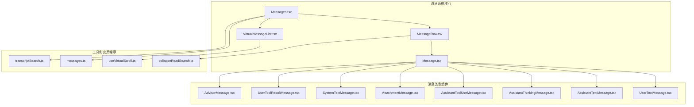
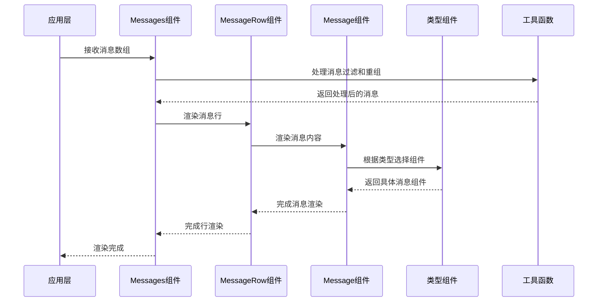
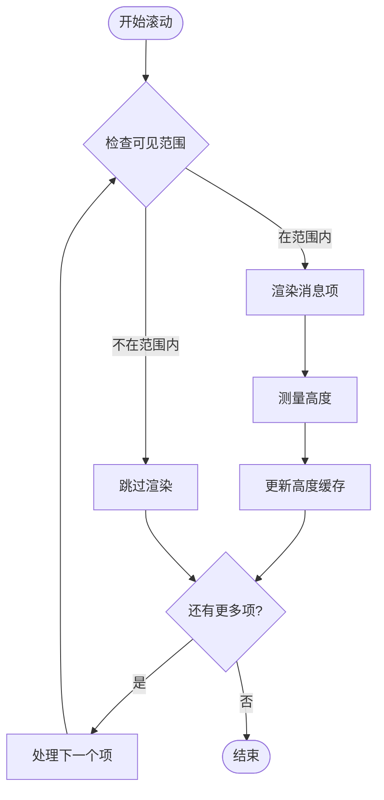
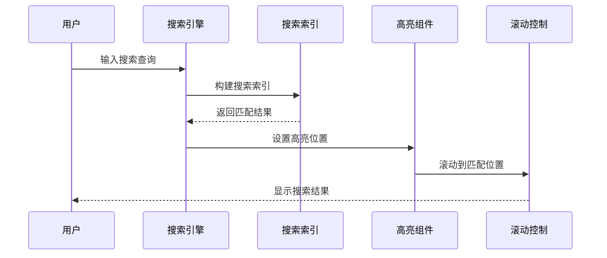
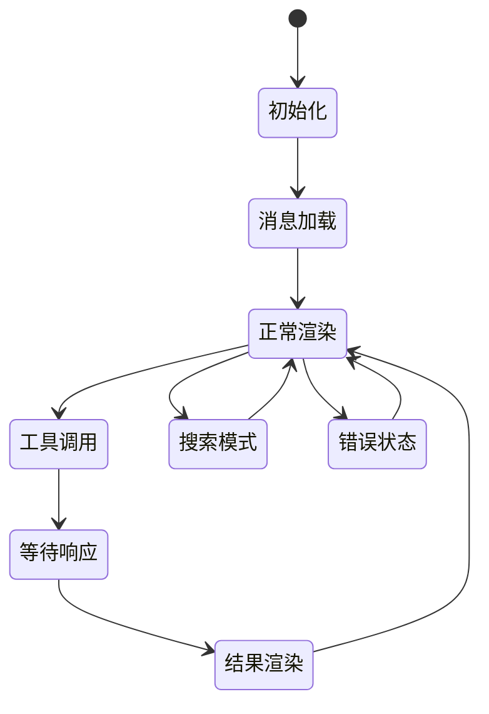
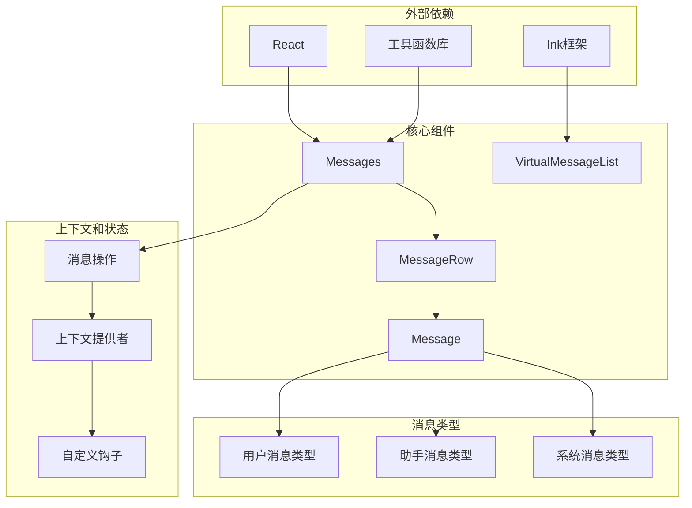

# 消息系统组件

<cite>
**本文档引用的文件**
- [Messages.tsx](file://src/components/Messages.tsx)
- [MessageRow.tsx](file://src/components/MessageRow.tsx)
- [Message.tsx](file://src/components/Message.tsx)
- [VirtualMessageList.tsx](file://src/components/VirtualMessageList.tsx)
- [MessageTimestamp.tsx](file://src/components/MessageTimestamp.tsx)
- [MessageModel.tsx](file://src/components/MessageModel.tsx)
- [OffscreenFreeze.tsx](file://src/components/OffscreenFreeze.tsx)
- [messageActions.tsx](file://src/components/messageActions.tsx)
- [Markdown.tsx](file://src/components/Markdown.tsx)
- [VirtualMessageList.tsx](file://src/hooks/useVirtualScroll.ts)
- [messages.ts](file://src/utils/messages.ts)
- [collapseReadSearch.ts](file://src/utils/collapseReadSearch.ts)
- [transcriptSearch.ts](file://src/utils/transcriptSearch.ts)
- [useTerminalSize.ts](file://src/hooks/useTerminalSize.ts)
- [useTerminalNotification.ts](file://src/ink/useTerminalNotification.ts)
- [ScrollBox.tsx](file://src/ink/components/ScrollBox.tsx)
- [FullscreenLayout.tsx](file://src/components/FullscreenLayout.tsx)
- [design-system/Divider.tsx](file://src/components/design-system/Divider.tsx)
- [LogoV2/LogoV2.tsx](file://src/components/LogoV2/LogoV2.tsx)
- [StatusNotices.tsx](file://src/components/StatusNotices.tsx)
- [OffscreenFreeze.tsx](file://src/components/OffscreenFreeze.tsx)
- [shell/ExpandShellOutputContext.tsx](file://src/components/shell/ExpandShellOutputContext.tsx)
- [UserTextMessage.tsx](file://src/components/messages/UserTextMessage.tsx)
- [AssistantTextMessage.tsx](file://src/components/messages/AssistantTextMessage.tsx)
- [AssistantThinkingMessage.tsx](file://src/components/messages/AssistantThinkingMessage.tsx)
- [AssistantToolUseMessage.tsx](file://src/components/messages/AssistantToolUseMessage.tsx)
- [AttachmentMessage.tsx](file://src/components/messages/AttachmentMessage.tsx)
- [SystemTextMessage.tsx](file://src/components/messages/SystemTextMessage.tsx)
- [UserToolResultMessage/UserToolResultMessage.tsx](file://src/components/messages/UserToolResultMessage/UserToolResultMessage.tsx)
- [AdvisorMessage.tsx](file://src/components/messages/AdvisorMessage.tsx)
- [CompactBoundaryMessage.tsx](file://src/components/messages/CompactBoundaryMessage.tsx)
- [CollapsedReadSearchContent.tsx](file://src/components/messages/CollapsedReadSearchContent.tsx)
- [GroupedToolUseContent.tsx](file://src/components/messages/GroupedToolUseContent.tsx)
- [AssistantRedactedThinkingMessage.tsx](file://src/components/messages/AssistantRedactedThinkingMessage.tsx)
- [UserImageMessage.tsx](file://src/components/messages/UserImageMessage.tsx)
- [ToolUseLoader.tsx](file://src/components/ToolUseLoader.tsx)
- [Tool.ts](file://src/Tool.ts)
- [commands.ts](file://src/commands.ts)
- [types/message.ts](file://src/types/message.ts)
- [screens/REPL.tsx](file://src/screens/REPL.tsx)
- [bootstrap/state.ts](file://src/bootstrap/state.ts)
- [envUtils.ts](file://src/utils/envUtils.ts)
- [fullscreen.ts](file://src/utils/fullscreen.ts)
- [groupToolUses.ts](file://src/utils/groupToolUses.ts)
- [collapseBackgroundBashNotifications.ts](file://src/utils/collapseBackgroundBashNotifications.ts)
- [collapseHookSummaries.ts](file://src/utils/collapseHookSummaries.ts)
- [collapseTeammateShutdowns.ts](file://src/utils/collapseTeammateShutdowns.ts)
- [collapseReadSearch.ts](file://src/utils/collapseReadSearch.ts)
- [renderOptions.ts](file://src/utils/renderOptions.ts)
- [stringUtils.ts](file://src/utils/stringUtils.ts)
- [advisor.ts](file://src/utils/advisor.ts)
- [config.ts](file://src/utils/config.ts)
- [log.ts](file://src/utils/log.ts)
- [sleep.ts](file://src/utils/sleep.ts)
- [debug.ts](file://src/utils/debug.ts)
- [transcriptSearch.ts](file://src/utils/transcriptSearch.ts)
- [inbox.ts](file://src/context/mailbox.tsx)
- [overlayContext.tsx](file://src/context/overlayContext.tsx)
- [modalContext.tsx](file://src/context/modalContext.tsx)
- [notifications.tsx](file://src/context/notifications.tsx)
- [voice.tsx](file://src/context/voice.tsx)
- [stats.tsx](file://src/context/stats.tsx)
- [fpsMetrics.tsx](file://src/context/fpsMetrics.tsx)
- [QueuedMessageContext.tsx](file://src/context/QueuedMessageContext.tsx)
- [keybindings/useShortcutDisplay.ts](file://src/keybindings/useShortcutDisplay.ts)
- [keybindings/defaultBindings.ts](file://src/keybindings/defaultBindings.ts)
- [keybindings/resolver.ts](file://src/keybindings/resolver.ts)
- [keybindings/schema.ts](file://src/keybindings/schema.ts)
- [keybindings/shortcutFormat.ts](file://src/keybindings/shortcutFormat.ts)
- [keybindings/useKeybinding.ts](file://src/keybindings/useKeybinding.ts)
- [keybindings/useShortcutDisplay.ts](file://src/keybindings/useShortcutDisplay.ts)
- [keybindings/validate.ts](file://src/keybindings/validate.ts)
- [ink.tsx](file://src/ink.tsx)
- [ink/dom.ts](file://src/ink/dom.ts)
- [ink/render-to-screen.ts](file://src/ink/render-to-screen.ts)
- [ink/components/ScrollBox.tsx](file://src/ink/components/ScrollBox.tsx)
- [ink/components/Box.tsx](file://src/ink/components/Box.tsx)
- [ink/components/Text.tsx](file://src/ink/components/Text.tsx)
- [ink/components/Ansi.tsx](file://src/ink/components/Ansi.tsx)
- [ink/components/Border.tsx](file://src/ink/components/Border.tsx)
- [ink/components/FullScreen.tsx](file://src/ink/components/FullScreen.tsx)
- [ink/components/Window.tsx](file://src/ink/components/Window.tsx)
- [ink/components/Screen.tsx](file://src/ink/components/Screen.tsx)
- [ink/components/Text.tsx](file://src/ink/components/Text.tsx)
- [ink/components/View.tsx](file://src/ink/components/View.tsx)
- [ink/components/ScrollView.tsx](file://src/ink/components/ScrollView.tsx)
- [ink/components/TextInput.tsx](file://src/ink/components/TextInput.tsx)
- [ink/components/Touchable.tsx](file://src/ink/components/Touchable.tsx)
- [ink/components/Keyboard.tsx](file://src/ink/components/Keyboard.tsx)
- [ink/components/Pointer.tsx](file://src/ink/components/Pointer.tsx)
- [ink/components/Touch.tsx](file://src/ink/components/Touch.tsx)
- [ink/components/Canvas.tsx](file://src/ink/components/Canvas.tsx)
- [ink/components/Image.tsx](file://src/ink/components/Image.tsx)
- [ink/components/Video.tsx](file://src/ink/components/Video.tsx)
- [ink/components/Audio.tsx](file://src/ink/components/Audio.tsx)
- [ink/components/WebView.tsx](file://src/ink/components/WebView.tsx)
- [ink/components/WebView.tsx](file://src/ink/components/WebView.tsx)
- [ink/components/WebView.tsx](file://src/ink/components/WebView.tsx)
- [ink/components/WebView.tsx](file://src/ink/components/WebView.tsx)
- [ink/components/WebView.tsx](file://src/ink/components/WebView.tsx)
- [ink/components/WebView.tsx](file://src/ink/components/WebView.tsx)
- [ink/components/WebView.tsx](file://src/ink/components/WebView.tsx)
- [ink/components/WebView.tsx](file://src/ink/components/WebView.tsx)
- [ink/components/WebView.tsx](file://src/ink/components/WebView.tsx)
- [ink/components/WebView.tsx](file://src/ink/components/WebView.tsx)
- [ink/components/WebView.tsx](file://src/ink/components/WebView.tsx)
- [ink/components/WebView.tsx](file://src/ink/components/WebView.tsx)
- [ink/components/WebView.tsx](file://src/ink/components/WebView.tsx)
- [ink/components/WebView.tsx](file://src/ink/components/WebView.tsx)
- [ink/components/WebView.tsx](file://src/ink/components/WebView.tsx)
- [ink/components/WebView.tsx](file://src/ink/components/WebView.tsx)
- [ink/components/WebView.tsx](file://src/ink/components/WebView.tsx)
- [ink/components/WebView.tsx](file://src/ink/components/WebView.tsx)
- [ink/components/WebView.tsx](file://src/ink/components/WebView.tsx)
- [ink/components/WebView.tsx](file://src/ink/components/WebView.tsx)
- [ink/components/WebView.tsx](file://src/ink/components/WebView.tsx)
- [ink/components/WebView.tsx](file://src/ink/components/WebView.tsx)
- [ink/components/WebView.tsx](file://src/ink/components/WebView.tsx)
- [ink/components/WebView.tsx](file://src/ink/components/WebView.tsx)
- [ink/components/WebView.tsx](file://src/ink/components/WebView.ts......)
</cite>

## 目录
1. [简介](#简介)
2. [项目结构](#项目结构)
3. [核心组件](#核心组件)
4. [架构概览](#架构概览)
5. [详细组件分析](#详细组件分析)
6. [依赖关系分析](#依赖关系分析)
7. [性能考虑](#性能考虑)
8. [故障排除指南](#故障排除指南)
9. [结论](#结论)

## 简介

消息系统组件是 Claude 代码编辑器的核心功能模块，负责渲染和管理对话历史中的各种消息类型。该系统支持多种消息格式，包括用户消息、助手消息、工具使用消息、系统消息等，并提供了高性能的虚拟滚动实现来处理大量消息数据。

系统采用 React 组件架构，通过分层设计实现了消息的高效渲染、状态管理和交互处理。核心特性包括：

- 多种消息类型的智能渲染
- 高性能虚拟滚动列表
- 实时搜索和定位功能
- 响应式布局适配
- 无障碍访问支持
- 自定义样式和主题

## 项目结构

消息系统组件位于 `src/components/messages/` 目录下，采用模块化设计，每个消息类型都有独立的组件文件。

**图表来源**
- [Messages.tsx:1-834](file://src/components/Messages.tsx#L1-834)
- [MessageRow.tsx:1-383](file://src/components/MessageRow.tsx#L1-383)
- [Message.tsx:1-627](file://src/components/Message.tsx#L1-627)

**章节来源**
- [Messages.tsx:1-834](file://src/components/Messages.tsx#L1-834)
- [MessageRow.tsx:1-383](file://src/components/MessageRow.tsx#L1-383)
- [Message.tsx:1-627](file://src/components/Message.tsx#L1-627)

## 核心组件

### Messages 组件

Messages 是消息系统的主容器组件，负责协调所有消息的渲染和状态管理。它实现了复杂的消息处理流程，包括消息过滤、重组、分组和折叠。

主要功能特性：
- 智能消息过滤和排序
- 支持简报模式（Brief）和完整转录模式
- 虚拟滚动集成
- 实时搜索和高亮
- 进度条和通知管理

**章节来源**
- [Messages.tsx:207-778](file://src/components/Messages.tsx#L207-778)

### MessageRow 组件

MessageRow 负责单个消息行的渲染，实现了消息的智能布局和状态管理。它处理消息的连续性检测、活跃状态判断和静态渲染优化。

关键特性：
- 消息连续性检测（用户消息合并）
- 活跃状态管理（进行中的工具调用）
- 静态渲染优化（避免不必要的重渲染）
- 元数据显示控制

**章节来源**
- [MessageRow.tsx:15-383](file://src/components/MessageRow.tsx#L15-383)

### Message 组件

Message 是消息内容的核心渲染组件，根据消息类型动态选择相应的子组件。它实现了消息类型的智能路由和参数传递。

主要职责：
- 消息类型识别和路由
- 参数验证和转换
- 子组件的条件渲染
- 样式和布局管理

**章节来源**
- [Message.tsx:32-627](file://src/components/Message.tsx#L32-627)

## 架构概览

消息系统采用分层架构设计，从底层的数据处理到顶层的渲染组件形成了清晰的职责分离。

**图表来源**
- [Messages.tsx:475-529](file://src/components/Messages.tsx#L475-529)
- [MessageRow.tsx:93-287](file://src/components/MessageRow.tsx#L93-287)
- [Message.tsx:58-355](file://src/components/Message.tsx#L58-355)

## 详细组件分析

### 消息类型系统

消息系统支持多种消息类型，每种类型都有专门的渲染组件：

#### 用户消息类型
- **UserTextMessage**: 文本用户消息
- **UserImageMessage**: 图像用户消息  
- **UserToolResultMessage**: 工具结果用户消息
- **UserPromptMessage**: 提示词用户消息
- **UserCommandMessage**: 命令用户消息

#### 助手消息类型
- **AssistantTextMessage**: 文本助手消息
- **AssistantThinkingMessage**: 思考过程消息
- **AssistantToolUseMessage**: 工具使用消息
- **AssistantRedactedThinkingMessage**: 保护的思考消息

#### 系统消息类型
- **SystemTextMessage**: 系统文本消息
- **AttachmentMessage**: 附件消息
- **CompactBoundaryMessage**: 紧凑边界消息

**章节来源**
- [UserTextMessage.tsx](file://src/components/messages/UserTextMessage.tsx)
- [AssistantTextMessage.tsx](file://src/components/messages/AssistantTextMessage.tsx)
- [AssistantThinkingMessage.tsx](file://src/components/messages/AssistantThinkingMessage.tsx)
- [AssistantToolUseMessage.tsx](file://src/components/messages/AssistantToolUseMessage.tsx)
- [AttachmentMessage.tsx](file://src/components/messages/AttachmentMessage.tsx)
- [SystemTextMessage.tsx](file://src/components/messages/SystemTextMessage.tsx)

### 虚拟滚动实现

虚拟滚动是消息系统性能优化的核心技术，通过只渲染可见区域内的消息项来处理大量数据。

**图表来源**
- [VirtualMessageList.tsx:325-336](file://src/components/VirtualMessageList.tsx#L325-336)
- [VirtualMessageList.tsx:339-344](file://src/components/VirtualMessageList.tsx#L339-344)

**章节来源**
- [VirtualMessageList.tsx:289-800](file://src/components/VirtualMessageList.tsx#L289-800)

### 搜索和定位功能

消息系统提供了强大的搜索和定位功能，支持全文搜索和精确跳转。

**图表来源**
- [VirtualMessageList.tsx:702-780](file://src/components/VirtualMessageList.tsx#L702-780)
- [VirtualMessageList.tsx:477-525](file://src/components/VirtualMessageList.tsx#L477-525)

**章节来源**
- [VirtualMessageList.tsx:466-694](file://src/components/VirtualMessageList.tsx#L466-694)

### 状态管理系统

消息系统实现了复杂的状态管理机制，包括消息状态、工具使用状态和用户交互状态。

**图表来源**
- [messages.ts](file://src/utils/messages.ts)
- [messageActions.tsx](file://src/components/messageActions.tsx)

**章节来源**
- [messages.ts](file://src/utils/messages.ts)
- [messageActions.tsx](file://src/components/messageActions.tsx)

## 依赖关系分析

消息系统组件之间的依赖关系形成了一个复杂的生态系统，每个组件都有明确的职责分工。

**图表来源**
- [Messages.tsx:1-50](file://src/components/Messages.tsx#L1-50)
- [MessageRow.tsx:1-20](file://src/components/MessageRow.tsx#L1-20)
- [Message.tsx:1-35](file://src/components/Message.tsx#L1-35)

**章节来源**
- [Messages.tsx:1-85](file://src/components/Messages.tsx#L1-85)
- [MessageRow.tsx:1-30](file://src/components/MessageRow.tsx#L1-30)
- [Message.tsx:1-40](file://src/components/Message.tsx#L1-40)

## 性能考虑

消息系统在设计时充分考虑了性能优化，采用了多种策略来确保在大量消息场景下的流畅体验。

### 内存优化策略

1. **虚拟滚动**: 只渲染可见区域的消息项
2. **静态渲染缓存**: 使用 React.memo 避免不必要的重渲染
3. **高度缓存**: 缓存消息项的高度信息
4. **弱引用缓存**: 使用 WeakMap 避免内存泄漏

### 渲染优化技术

1. **增量更新**: 只更新发生变化的消息项
2. **批量处理**: 批量处理消息状态变更
3. **防抖处理**: 对频繁的用户操作进行防抖
4. **懒加载**: 延迟加载非关键资源

### 性能监控

系统集成了性能监控机制，可以实时跟踪渲染性能指标。

**章节来源**
- [VirtualMessageList.tsx:184-196](file://src/components/VirtualMessageList.tsx#L184-196)
- [MessageRow.tsx:342-382](file://src/components/MessageRow.tsx#L342-382)
- [Messages.tsx:741-778](file://src/components/Messages.tsx#L741-778)

## 故障排除指南

### 常见问题和解决方案

#### 消息渲染异常
- **症状**: 消息显示不完整或错位
- **原因**: 消息高度计算错误或缓存失效
- **解决**: 清除高度缓存并重新渲染

#### 虚拟滚动卡顿
- **症状**: 滚动时出现卡顿或延迟
- **原因**: 大量消息同时渲染或计算量过大
- **解决**: 检查消息数量限制和优化渲染逻辑

#### 搜索功能失效
- **症状**: 搜索不到预期结果或高亮不正确
- **原因**: 搜索索引构建失败或查询解析错误
- **解决**: 重建搜索索引并检查查询语法

#### 性能问题
- **症状**: 应用响应缓慢或内存占用过高
- **原因**: 组件重渲染过多或内存泄漏
- **解决**: 分析渲染路径并优化组件结构

**章节来源**
- [VirtualMessageList.tsx:538-605](file://src/components/VirtualMessageList.tsx#L538-605)
- [Messages.tsx:289-340](file://src/components/Messages.tsx#L289-340)
- [MessageRow.tsx:342-382](file://src/components/MessageRow.tsx#L342-382)

## 结论

消息系统组件是一个高度模块化、性能优化的复杂系统。通过合理的架构设计和多种优化策略，它能够高效地处理大量消息数据，同时提供丰富的功能和良好的用户体验。

系统的主要优势包括：

1. **模块化设计**: 清晰的组件层次结构和职责分离
2. **性能优化**: 虚拟滚动、静态渲染缓存等多重优化
3. **功能丰富**: 支持多种消息类型和交互功能
4. **可扩展性**: 良好的架构为未来功能扩展奠定基础
5. **用户体验**: 流畅的交互和响应式设计

通过深入理解这些组件的工作原理和相互关系，开发者可以更好地维护和扩展消息系统功能，为用户提供更好的对话体验。