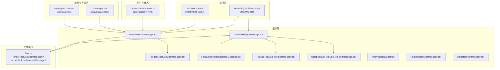
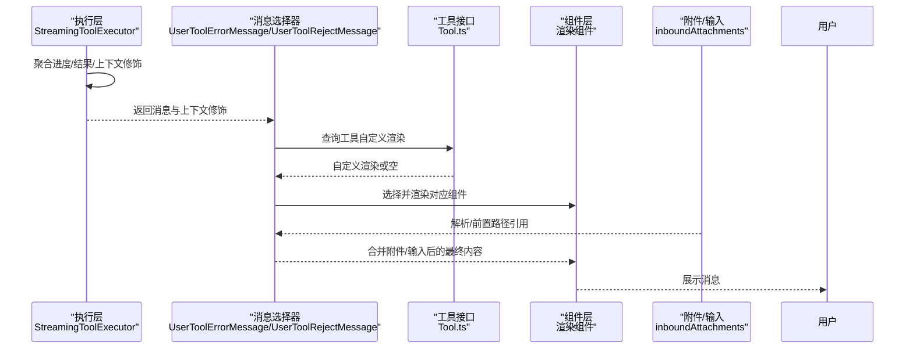
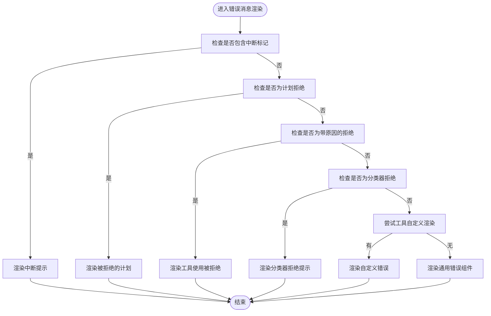
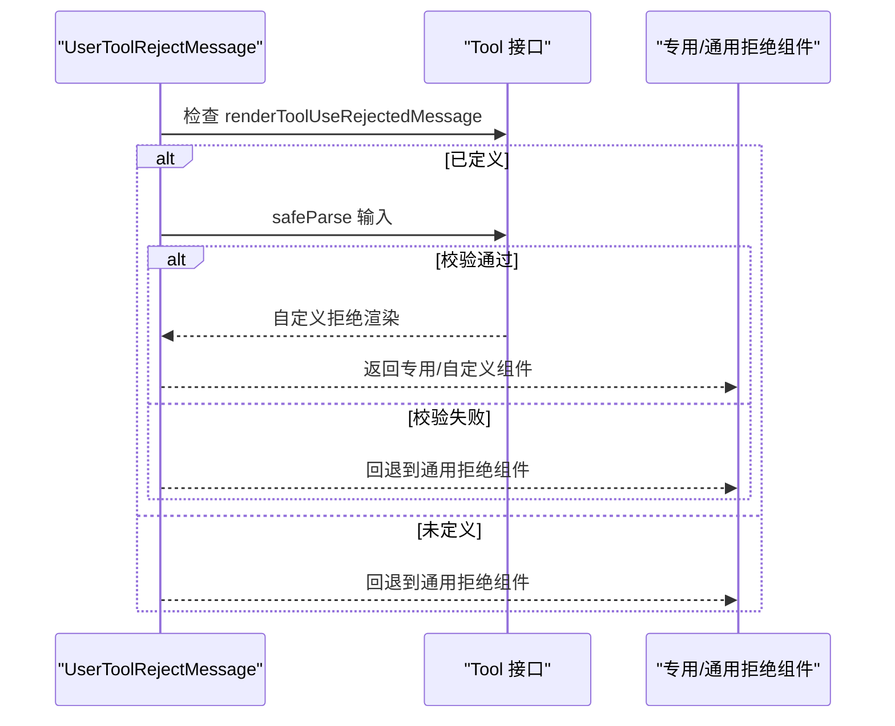
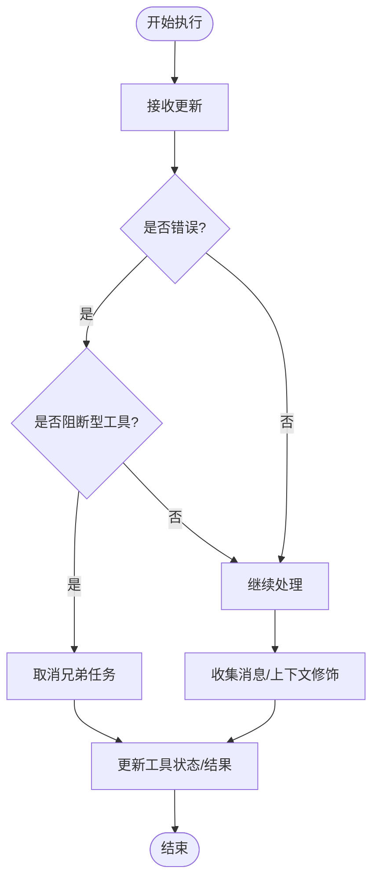
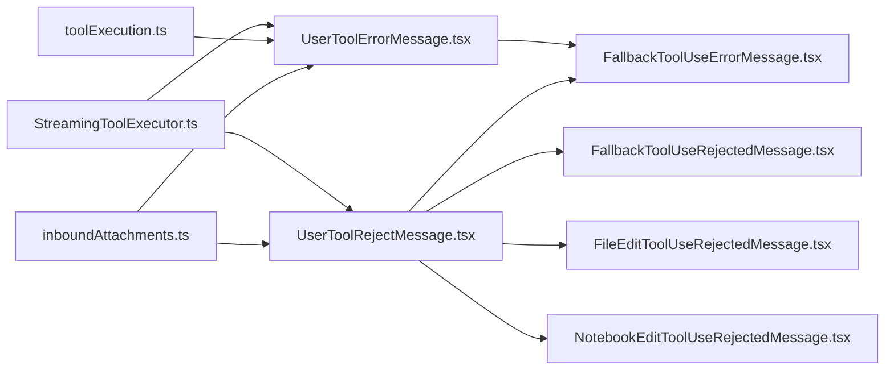

# 工具结果消息

<cite>
**本文引用的文件**
- [Tool.ts](file://src/Tool.ts)
- [UserToolErrorMessage.tsx](file://src/components/messages/UserToolResultMessage/UserToolErrorMessage.tsx)
- [UserToolRejectMessage.tsx](file://src/components/messages/UserToolResultMessage/UserToolRejectMessage.tsx)
- [FallbackToolUseErrorMessage.tsx](file://src/components/FallbackToolUseErrorMessage.tsx)
- [FallbackToolUseRejectedMessage.tsx](file://src/components/FallbackToolUseRejectedMessage.tsx)
- [FileEditToolUseRejectedMessage.tsx](file://src/components/FileEditToolUseRejectedMessage.tsx)
- [NotebookEditToolUseRejectedMessage.tsx](file://src/components/NotebookEditToolUseRejectedMessage.tsx)
- [InterruptedByUser.tsx](file://src/components/InterruptedByUser.tsx)
- [RejectedToolUseMessage.tsx](file://src/components/messages/UserToolResultMessage/RejectedToolUseMessage.tsx)
- [RejectedPlanMessage.tsx](file://src/components/messages/UserToolResultMessage/RejectedPlanMessage.tsx)
- [StreamingToolExecutor.ts](file://src/services/tools/StreamingToolExecutor.ts)
- [toolExecution.ts](file://src/services/tools/toolExecution.ts)
- [Messages.tsx](file://src/components/Messages.tsx)
- [messageActions.tsx](file://src/components/messageActions.tsx)
- [inboundAttachments.ts](file://src/bridge/inboundAttachments.ts)
</cite>

## 目录
1. [简介](#简介)
2. [项目结构](#项目结构)
3. [核心组件](#核心组件)
4. [架构总览](#架构总览)
5. [详细组件分析](#详细组件分析)
6. [依赖关系分析](#依赖关系分析)
7. [性能考量](#性能考量)
8. [故障排查指南](#故障排查指南)
9. [结论](#结论)
10. [附录](#附录)

## 简介
本文件系统性梳理“工具结果消息”的设计与实现，覆盖以下主题：
- 工具执行结果的类型与呈现：成功、错误、取消、拒绝（含计划拒绝、工具使用拒绝）等
- 展示逻辑、状态跟踪与用户反馈机制
- 渲染策略、附件处理与交互能力
- 样式定制与用户体验优化建议

目标是帮助开发者与产品人员理解工具结果消息在前端如何被生成、选择与渲染，并为扩展与优化提供依据。

## 项目结构
围绕工具结果消息的关键目录与文件：
- 组件层：消息渲染组件位于 components/messages/UserToolResultMessage 及其子组件
- 工具接口：定义工具如何自定义错误/拒绝消息的入口
- 执行层：工具执行与进度消息的收集、合并与状态更新
- 附件与输入：入站附件解析与前置路径引用，辅助消息渲染
- 搜索与可访问性：消息文本抽取与可读性控制

图表来源
- [UserToolErrorMessage.tsx:23-102](file://src/components/messages/UserToolResultMessage/UserToolErrorMessage.tsx#L23-L102)
- [UserToolRejectMessage.tsx:21-94](file://src/components/messages/UserToolResultMessage/UserToolRejectMessage.tsx#L21-L94)
- [Tool.ts:636-667](file://src/Tool.ts#L636-L667)
- [StreamingToolExecutor.ts:354-386](file://src/services/tools/StreamingToolExecutor.ts#L354-L386)
- [toolExecution.ts:1039-1071](file://src/services/tools/toolExecution.ts#L1039-L1071)
- [inboundAttachments.ts:136-175](file://src/bridge/inboundAttachments.ts#L136-L175)
- [Messages.tsx:639-660](file://src/components/Messages.tsx#L639-L660)
- [messageActions.tsx:430-449](file://src/components/messageActions.tsx#L430-L449)

章节来源
- [Tool.ts:636-667](file://src/Tool.ts#L636-L667)
- [UserToolErrorMessage.tsx:23-102](file://src/components/messages/UserToolResultMessage/UserToolErrorMessage.tsx#L23-L102)
- [UserToolRejectMessage.tsx:21-94](file://src/components/messages/UserToolResultMessage/UserToolRejectMessage.tsx#L21-L94)
- [StreamingToolExecutor.ts:354-386](file://src/services/tools/StreamingToolExecutor.ts#L354-L386)
- [toolExecution.ts:1039-1071](file://src/services/tools/toolExecution.ts#L1039-L1071)
- [inboundAttachments.ts:136-175](file://src/bridge/inboundAttachments.ts#L136-L175)
- [Messages.tsx:639-660](file://src/components/Messages.tsx#L639-L660)
- [messageActions.tsx:430-449](file://src/components/messageActions.tsx#L430-L449)

## 核心组件
- 错误消息渲染器
  - UserToolErrorMessage：根据内容特征选择中断、计划拒绝、带原因的拒绝或通用错误；若工具未自定义，则回退到 FallbackToolUseErrorMessage
  - FallbackToolUseErrorMessage：对非字符串内容给出默认提示，对字符串内容进行标签清理、截断与“展开查看”提示
- 拒绝消息渲染器
  - UserToolRejectMessage：优先调用工具自定义渲染；若无自定义或参数校验失败则回退到 FallbackToolUseRejectedMessage
  - FallbackToolUseRejectedMessage：通用“用户拒绝”提示
  - FileEditToolUseRejectedMessage：针对文件编辑的拒绝，支持显示预览/差异
  - NotebookEditToolUseRejectedMessage：针对笔记本单元的拒绝，支持显示源码预览
- 中断提示
  - InterruptedByUser：用于“被中断”类消息
- 计划/工具使用拒绝
  - RejectedPlanMessage：渲染被拒绝的计划
  - RejectedToolUseMessage：渲染“工具使用被拒绝”

章节来源
- [UserToolErrorMessage.tsx:23-102](file://src/components/messages/UserToolResultMessage/UserToolErrorMessage.tsx#L23-L102)
- [FallbackToolUseErrorMessage.tsx:16-115](file://src/components/FallbackToolUseErrorMessage.tsx#L16-L115)
- [UserToolRejectMessage.tsx:21-94](file://src/components/messages/UserToolResultMessage/UserToolRejectMessage.tsx#L21-L94)
- [FallbackToolUseRejectedMessage.tsx:5-15](file://src/components/FallbackToolUseRejectedMessage.tsx#L5-L15)
- [FileEditToolUseRejectedMessage.tsx:24-169](file://src/components/FileEditToolUseRejectedMessage.tsx#L24-L169)
- [NotebookEditToolUseRejectedMessage.tsx:16-91](file://src/components/NotebookEditToolUseRejectedMessage.tsx#L16-L91)
- [InterruptedByUser.tsx:4-14](file://src/components/InterruptedByUser.tsx#L4-L14)
- [RejectedPlanMessage.tsx:9-30](file://src/components/messages/UserToolResultMessage/RejectedPlanMessage.tsx#L9-L30)
- [RejectedToolUseMessage.tsx:5-15](file://src/components/messages/UserToolResultMessage/RejectedToolUseMessage.tsx#L5-L15)

## 架构总览
工具结果消息从“执行层”产生，经“消息选择器”决定具体渲染组件，最终在“组件层”完成 UI 呈现。附件与输入解析在消息生成前参与内容准备，搜索与可读性由“搜索与可访问”模块保障。

图表来源
- [StreamingToolExecutor.ts:354-386](file://src/services/tools/StreamingToolExecutor.ts#L354-L386)
- [UserToolErrorMessage.tsx:23-102](file://src/components/messages/UserToolResultMessage/UserToolErrorMessage.tsx#L23-L102)
- [UserToolRejectMessage.tsx:21-94](file://src/components/messages/UserToolResultMessage/UserToolRejectMessage.tsx#L21-L94)
- [Tool.ts:636-667](file://src/Tool.ts#L636-L667)
- [inboundAttachments.ts:136-175](file://src/bridge/inboundAttachments.ts#L136-L175)

## 详细组件分析

### 错误消息渲染流程
- 内容特征识别
  - 中断：包含特定中断标记时，直接渲染“被中断”
  - 计划拒绝：以特定前缀开头时，渲染“被拒绝的计划”
  - 带原因的拒绝：以特定前缀开头时，渲染“工具使用被拒绝”
  - 分类器拒绝：在特定特性开启时，按分类器拒绝文案渲染
  - 其他：调用工具自定义渲染；若无自定义则回退到通用错误组件
- 通用错误组件策略
  - 非字符串内容：默认提示“工具执行失败”
  - 字符串内容：提取并清理错误标签，按是否 verbose 截断，提供“展开查看”提示

图表来源
- [UserToolErrorMessage.tsx:23-102](file://src/components/messages/UserToolResultMessage/UserToolErrorMessage.tsx#L23-L102)
- [FallbackToolUseErrorMessage.tsx:16-115](file://src/components/FallbackToolUseErrorMessage.tsx#L16-L115)
- [InterruptedByUser.tsx:4-14](file://src/components/InterruptedByUser.tsx#L4-L14)
- [RejectedPlanMessage.tsx:9-30](file://src/components/messages/UserToolResultMessage/RejectedPlanMessage.tsx#L9-L30)
- [RejectedToolUseMessage.tsx:5-15](file://src/components/messages/UserToolResultMessage/RejectedToolUseMessage.tsx#L5-L15)

章节来源
- [UserToolErrorMessage.tsx:23-102](file://src/components/messages/UserToolResultMessage/UserToolErrorMessage.tsx#L23-L102)
- [FallbackToolUseErrorMessage.tsx:16-115](file://src/components/FallbackToolUseErrorMessage.tsx#L16-L115)

### 拒绝消息渲染流程
- 工具自定义优先：若工具定义了 renderToolUseRejectedMessage，则解析输入模式后调用
- 参数校验：若输入不满足工具 schema，则回退到通用拒绝组件
- 文件/笔记本专用：文件编辑与笔记本编辑提供更丰富的拒绝视图（预览/差异）

图表来源
- [UserToolRejectMessage.tsx:21-94](file://src/components/messages/UserToolResultMessage/UserToolRejectMessage.tsx#L21-L94)
- [Tool.ts:636-667](file://src/Tool.ts#L636-L667)
- [FileEditToolUseRejectedMessage.tsx:24-169](file://src/components/FileEditToolUseRejectedMessage.tsx#L24-L169)
- [NotebookEditToolUseRejectedMessage.tsx:16-91](file://src/components/NotebookEditToolUseRejectedMessage.tsx#L16-L91)
- [FallbackToolUseRejectedMessage.tsx:5-15](file://src/components/FallbackToolUseRejectedMessage.tsx#L5-L15)

章节来源
- [UserToolRejectMessage.tsx:21-94](file://src/components/messages/UserToolResultMessage/UserToolRejectMessage.tsx#L21-L94)
- [Tool.ts:636-667](file://src/Tool.ts#L636-L667)

### 执行与状态跟踪
- 进度与结果聚合：执行器在流式过程中将“进度/结果/上下文修饰”写入工具对象，最终统一更新状态
- 错误传播：当某工具出现错误且属于阻断型（如 Bash），会触发兄弟任务取消
- 权限拒绝与错误注入：当权限决策为拒绝或错误时，注入带内容块的用户消息，便于后续渲染

图表来源
- [StreamingToolExecutor.ts:354-386](file://src/services/tools/StreamingToolExecutor.ts#L354-L386)
- [toolExecution.ts:1039-1071](file://src/services/tools/toolExecution.ts#L1039-L1071)

章节来源
- [StreamingToolExecutor.ts:354-386](file://src/services/tools/StreamingToolExecutor.ts#L354-L386)
- [toolExecution.ts:1039-1071](file://src/services/tools/toolExecution.ts#L1039-L1071)

### 附件与输入处理
- 入站附件解析：从消息中提取附件，解析为本地路径前缀
- 内容前置：将路径前缀附加到文本块，确保引用正确
- 与渲染结合：解析后的前缀参与最终消息内容，影响路径显示与交互

章节来源
- [inboundAttachments.ts:136-175](file://src/bridge/inboundAttachments.ts#L136-L175)

### 搜索与可读性
- 文本抽取：优先使用工具自定义的 extractSearchText，否则回退到通用规则
- 结果文本：从 tool_result 的内容块中提取可读文本，便于复制/搜索

章节来源
- [Messages.tsx:639-660](file://src/components/Messages.tsx#L639-L660)
- [messageActions.tsx:430-449](file://src/components/messageActions.tsx#L430-L449)

## 依赖关系分析
- 组件依赖
  - UserToolErrorMessage 依赖工具接口与通用错误组件
  - UserToolRejectMessage 依赖工具接口与专用/通用拒绝组件
  - FallbackToolUseErrorMessage 依赖消息响应容器与终端工具
- 执行依赖
  - StreamingToolExecutor 负责进度/结果聚合与状态更新
  - toolExecution 在权限/错误场景注入消息
- 附件依赖
  - inboundAttachments 为消息渲染提供前置路径引用

图表来源
- [UserToolErrorMessage.tsx:23-102](file://src/components/messages/UserToolResultMessage/UserToolErrorMessage.tsx#L23-L102)
- [UserToolRejectMessage.tsx:21-94](file://src/components/messages/UserToolResultMessage/UserToolRejectMessage.tsx#L21-L94)
- [FallbackToolUseErrorMessage.tsx:16-115](file://src/components/FallbackToolUseErrorMessage.tsx#L16-L115)
- [FallbackToolUseRejectedMessage.tsx:5-15](file://src/components/FallbackToolUseRejectedMessage.tsx#L5-L15)
- [FileEditToolUseRejectedMessage.tsx:24-169](file://src/components/FileEditToolUseRejectedMessage.tsx#L24-L169)
- [NotebookEditToolUseRejectedMessage.tsx:16-91](file://src/components/NotebookEditToolUseRejectedMessage.tsx#L16-L91)
- [StreamingToolExecutor.ts:354-386](file://src/services/tools/StreamingToolExecutor.ts#L354-L386)
- [toolExecution.ts:1039-1071](file://src/services/tools/toolExecution.ts#L1039-L1071)
- [inboundAttachments.ts:136-175](file://src/bridge/inboundAttachments.ts#L136-L175)

## 性能考量
- 渲染缓存：组件内部广泛使用记忆化与局部状态缓存，减少重复计算
- 截断与延迟：错误消息默认截断，仅在需要时展开，降低渲染开销
- 进度消息过滤：在渲染前对进度消息进行过滤，避免冗余渲染
- 附件解析：解析与前置路径引用为异步操作，尽量在消息生成阶段完成，减少渲染时 IO

## 故障排查指南
- 中断消息未显示
  - 检查消息内容是否包含中断标记
  - 确认渲染分支是否命中中断分支
- 计划/工具使用拒绝未正确渲染
  - 确认消息内容前缀是否正确
  - 检查工具自定义渲染是否返回空值
- 通用错误组件显示“工具执行失败”
  - 确认传入内容是否为字符串
  - 检查标签清理与截断逻辑是否符合预期
- 附件路径显示异常
  - 检查入站附件解析与前置路径引用流程
  - 确认最终消息内容中是否包含正确的路径前缀

章节来源
- [UserToolErrorMessage.tsx:23-102](file://src/components/messages/UserToolResultMessage/UserToolErrorMessage.tsx#L23-L102)
- [UserToolRejectMessage.tsx:21-94](file://src/components/messages/UserToolResultMessage/UserToolRejectMessage.tsx#L21-L94)
- [FallbackToolUseErrorMessage.tsx:16-115](file://src/components/FallbackToolUseErrorMessage.tsx#L16-L115)
- [inboundAttachments.ts:136-175](file://src/bridge/inboundAttachments.ts#L136-L175)

## 结论
工具结果消息体系通过“执行层—选择器—组件层”的分层设计，实现了灵活而一致的消息呈现。工具可通过自定义渲染提升用户理解与操作效率，同时通用回退组件保证了兜底体验。附件与输入处理、搜索与可读性支持进一步完善了整体可用性。建议在新增工具时优先实现自定义错误/拒绝渲染，并关注截断与可展开策略，以获得最佳用户体验。

## 附录
- 样式与主题
  - 使用主题与终端尺寸钩子，适配不同终端宽度与主题色
  - 通过 MessageResponse 容器统一消息外层布局
- 交互与可访问
  - 提供“展开查看”与“折叠显示”能力，平衡信息密度与可读性
  - 文本抽取与复制支持，便于用户导出与反馈