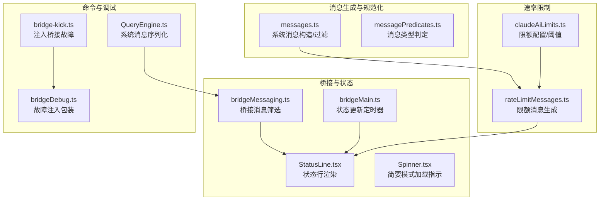
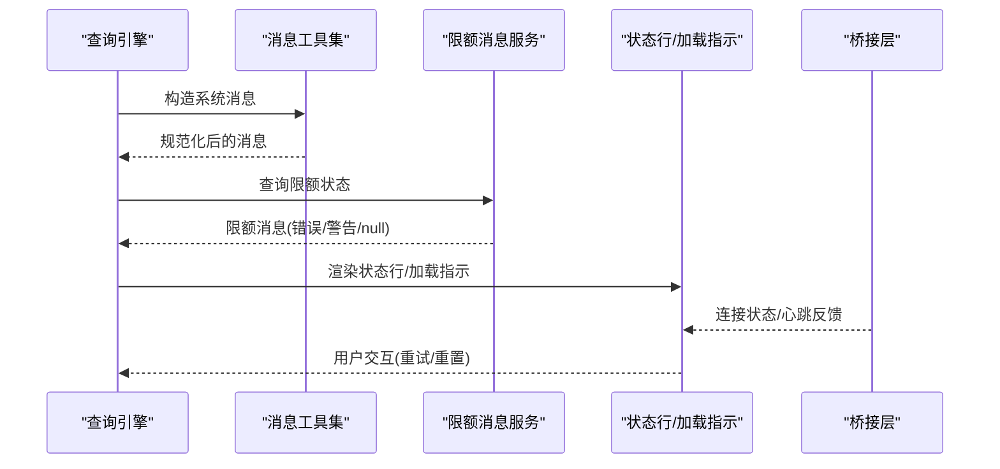
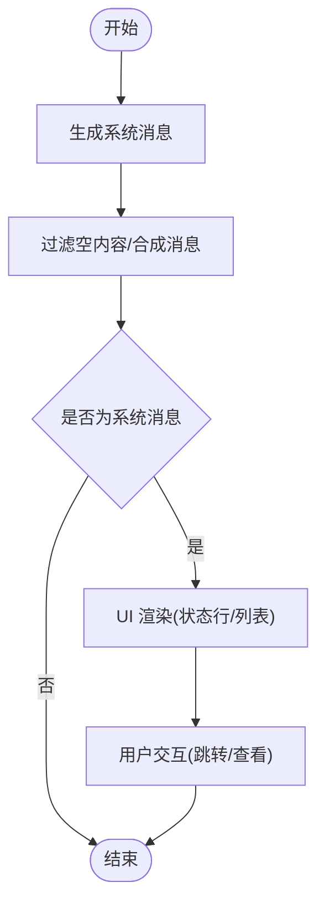
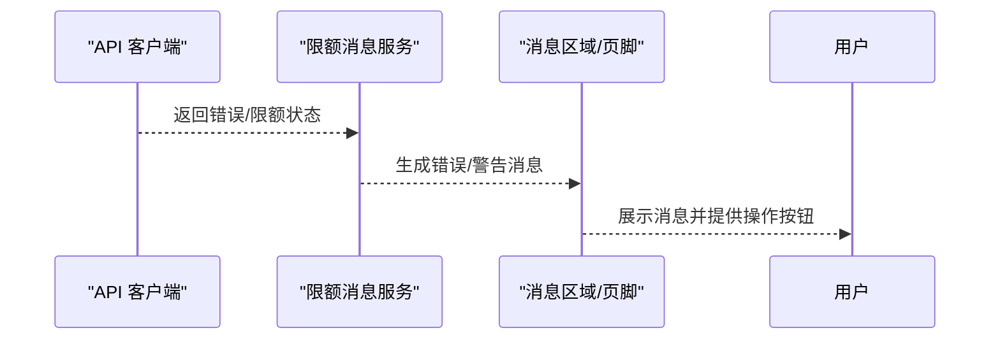
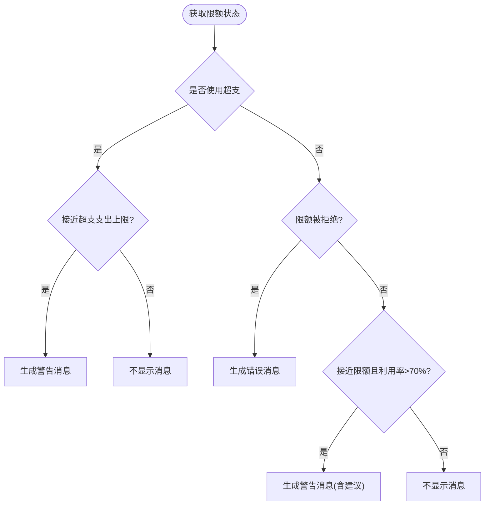
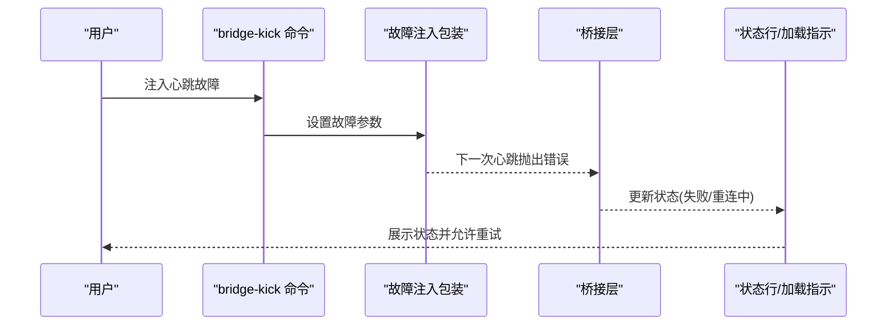
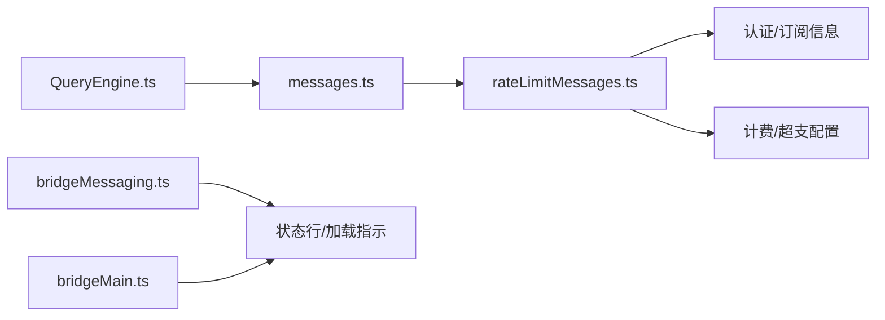

# 系统消息类型

<cite>
**本文档引用的文件**
- [src/utils/messages.ts](file://src/utils/messages.ts)
- [src/services/rateLimitMessages.ts](file://src/services/rateLimitMessages.ts)
- [src/services/claudeAiLimits.ts](file://src/services/claudeAiLimits.ts)
- [src/constants/messages.ts](file://src/constants/messages.ts)
- [src/utils/messagePredicates.ts](file://src/utils/messagePredicates.ts)
- [src/components/messageActions.tsx](file://src/components/messageActions.tsx)
- [src/bridge/bridgeMessaging.ts](file://src/bridge/bridgeMessaging.ts)
- [src/bridge/bridgeMain.ts](file://src/bridge/bridgeMain.ts)
- [src/components/StatusLine.tsx](file://src/components/StatusLine.tsx)
- [src/components/Spinner.tsx](file://src/components/Spinner.tsx)
- [src/QueryEngine.ts](file://src/QueryEngine.ts)
- [src/commands/bridge-kick.ts](file://src/commands/bridge-kick.ts)
- [src/bridge/bridgeDebug.ts](file://src/bridge/bridgeDebug.ts)
- [src/main.tsx](file://src/main.tsx)
</cite>

## 目录
1. [简介](#简介)
2. [项目结构](#项目结构)
3. [核心组件](#核心组件)
4. [架构总览](#架构总览)
5. [详细组件分析](#详细组件分析)
6. [依赖关系分析](#依赖关系分析)
7. [性能考量](#性能考量)
8. [故障排查指南](#故障排查指南)
9. [结论](#结论)
10. [附录](#附录)

## 简介
本文件系统性梳理系统消息类型在代码库中的实现与使用方式，覆盖以下主题：
- 系统文本消息：用于信息提示、状态通知、上下文补充等
- API 错误消息：对后端 API 返回错误进行统一格式化与展示
- 速率限制消息：包含早期预警、错误提示与恢复建议
- 关闭消息：会话结束、桥接断开、心跳失败等场景的通知
- 触发条件、显示逻辑与用户交互处理
- 错误处理机制、状态通知与恢复策略
- 样式定制与用户体验设计指南

## 项目结构
系统消息在多处模块中被生成与消费，主要分布如下：
- 消息生成与规范化：位于消息工具集中，负责构造系统消息、识别合成消息、过滤空内容等
- 速率限制消息：由速率限制服务统一生成，供 UI 与通知使用
- 早期预警与限额计算：限额服务提供阈值与重置时间，驱动 UI 提示
- 桥接层与状态行：桥接层负责连接状态更新，状态行负责渲染与展示
- 命令与调试：命令注入桥接故障，辅助测试与恢复

**图表来源**
- [src/utils/messages.ts](file://src/utils/messages.ts)
- [src/utils/messagePredicates.ts](file://src/utils/messagePredicates.ts)
- [src/services/rateLimitMessages.ts](file://src/services/rateLimitMessages.ts)
- [src/services/claudeAiLimits.ts](file://src/services/claudeAiLimits.ts)
- [src/bridge/bridgeMessaging.ts](file://src/bridge/bridgeMessaging.ts)
- [src/bridge/bridgeMain.ts](file://src/bridge/bridgeMain.ts)
- [src/components/StatusLine.tsx](file://src/components/StatusLine.tsx)
- [src/components/Spinner.tsx](file://src/components/Spinner.tsx)
- [src/QueryEngine.ts](file://src/QueryEngine.ts)
- [src/commands/bridge-kick.ts](file://src/commands/bridge-kick.ts)
- [src/bridge/bridgeDebug.ts](file://src/bridge/bridgeDebug.ts)

**章节来源**
- [src/utils/messages.ts](file://src/utils/messages.ts)
- [src/services/rateLimitMessages.ts](file://src/services/rateLimitMessages.ts)
- [src/services/claudeAiLimits.ts](file://src/services/claudeAiLimits.ts)
- [src/bridge/bridgeMessaging.ts](file://src/bridge/bridgeMessaging.ts)
- [src/bridge/bridgeMain.ts](file://src/bridge/bridgeMain.ts)
- [src/components/StatusLine.tsx](file://src/components/StatusLine.tsx)
- [src/components/Spinner.tsx](file://src/components/Spinner.tsx)
- [src/QueryEngine.ts](file://src/QueryEngine.ts)
- [src/commands/bridge-kick.ts](file://src/commands/bridge-kick.ts)
- [src/bridge/bridgeDebug.ts](file://src/bridge/bridgeDebug.ts)

## 核心组件
- 系统文本消息生成与过滤
  - 统一构造系统消息、识别合成消息（如中断、取消）、过滤空内容
  - 支持将多内容块规范化为独立消息，保证顺序与唯一性
- API 错误消息
  - 对 API 错误进行格式化，区分错误与警告级别
  - 通过前缀匹配识别速率限制类错误
- 速率限制消息
  - 基于限额状态生成“接近/超出”提示与恢复建议
  - 针对不同订阅类型与限额类型输出差异化文案
- 关闭与桥接状态消息
  - 桥接心跳失败、强制重连、状态描述等
  - 状态行与加载指示器联动，确保用户感知到连接状态变化

**章节来源**
- [src/utils/messages.ts](file://src/utils/messages.ts)
- [src/services/rateLimitMessages.ts](file://src/services/rateLimitMessages.ts)
- [src/services/claudeAiLimits.ts](file://src/services/claudeAiLimits.ts)
- [src/bridge/bridgeMessaging.ts](file://src/bridge/bridgeMessaging.ts)
- [src/bridge/bridgeMain.ts](file://src/bridge/bridgeMain.ts)
- [src/components/StatusLine.tsx](file://src/components/StatusLine.tsx)
- [src/components/Spinner.tsx](file://src/components/Spinner.tsx)

## 架构总览
系统消息在运行时的流转路径如下：
- 消息生成：工具函数根据业务场景构造系统消息
- 过滤与判定：判断是否为空消息、是否为合成消息、是否需要转发至桥接
- 展示与通知：状态行渲染、加载指示、速率限制提示
- 错误与恢复：API 错误格式化、限额错误提示、桥接故障注入与恢复

**图表来源**
- [src/QueryEngine.ts](file://src/QueryEngine.ts)
- [src/utils/messages.ts](file://src/utils/messages.ts)
- [src/services/rateLimitMessages.ts](file://src/services/rateLimitMessages.ts)
- [src/components/StatusLine.tsx](file://src/components/StatusLine.tsx)
- [src/components/Spinner.tsx](file://src/components/Spinner.tsx)
- [src/bridge/bridgeMessaging.ts](file://src/bridge/bridgeMessaging.ts)

## 详细组件分析

### 系统文本消息
- 作用
  - 提供信息性提示、上下文补充、状态说明
  - 区分系统消息子类型（如 API 指标、停用钩子摘要、轮次耗时、内存保存、代理被终止、远行摘要等）
- 触发条件
  - 查询引擎在特定事件（如压缩边界、API 错误重试）时生成系统消息
  - 工具或钩子在执行过程中插入系统消息以增强可追溯性
- 显示逻辑
  - 仅在 UI 中可见的系统消息不会参与对话流
  - 系统消息在消息列表中按子类型分类展示
- 用户交互
  - 部分系统消息可作为导航锚点，便于用户跳转到对应上下文

**图表来源**
- [src/utils/messages.ts](file://src/utils/messages.ts)
- [src/QueryEngine.ts](file://src/QueryEngine.ts)
- [src/components/messageActions.tsx](file://src/components/messageActions.tsx)

**章节来源**
- [src/utils/messages.ts](file://src/utils/messages.ts)
- [src/QueryEngine.ts](file://src/QueryEngine.ts)
- [src/components/messageActions.tsx](file://src/components/messageActions.tsx)

### API 错误消息
- 作用
  - 将后端 API 错误统一格式化为可读消息
  - 识别速率限制类错误，避免脆弱字符串匹配
- 触发条件
  - API 请求失败时，错误对象被转换为系统消息
  - 速率限制错误通过前缀匹配识别
- 显示逻辑
  - 错误消息在主消息区域展示，警告消息在页脚显示
  - 不同订阅类型与限额类型输出差异化文案
- 用户交互
  - 提供重试、升级、请求额外用量等操作入口

**图表来源**
- [src/services/rateLimitMessages.ts](file://src/services/rateLimitMessages.ts)
- [src/services/claudeAiLimits.ts](file://src/services/claudeAiLimits.ts)

**章节来源**
- [src/services/rateLimitMessages.ts](file://src/services/rateLimitMessages.ts)
- [src/services/claudeAiLimits.ts](file://src/services/claudeAiLimits.ts)

### 速率限制消息
- 生成规则
  - 优先检查超支使用（overage）状态；若接近超支支出上限则给出警告
  - 当限额被拒绝时，生成错误级消息
  - 接近限额时生成警告消息，并根据订阅类型与限额类型附加升级/请求额外用量建议
- 显示位置
  - 错误消息在主消息区域展示
  - 警告消息在页脚展示，避免干扰对话
- 恢复策略
  - 提示用户等待重置时间
  - 团队/企业用户在启用超支时可请求更多用量
  - 升级套餐以提升限额

**图表来源**
- [src/services/rateLimitMessages.ts](file://src/services/rateLimitMessages.ts)
- [src/services/claudeAiLimits.ts](file://src/services/claudeAiLimits.ts)

**章节来源**
- [src/services/rateLimitMessages.ts](file://src/services/rateLimitMessages.ts)
- [src/services/claudeAiLimits.ts](file://src/services/claudeAiLimits.ts)

### 关闭消息与桥接状态
- 作用
  - 在桥接断开、心跳失败、强制重连等场景向用户提示当前状态
- 触发条件
  - 心跳返回特定状态码或注入故障
  - 强制重连触发环境重建
- 显示逻辑
  - 状态行显示连接状态与标题
  - 加载指示器在简要模式下保持稳定高度，避免布局抖动
- 用户交互
  - 用户可选择重试、等待自动重连或手动重连

**图表来源**
- [src/commands/bridge-kick.ts](file://src/commands/bridge-kick.ts)
- [src/bridge/bridgeDebug.ts](file://src/bridge/bridgeDebug.ts)
- [src/bridge/bridgeMain.ts](file://src/bridge/bridgeMain.ts)
- [src/components/StatusLine.tsx](file://src/components/StatusLine.tsx)
- [src/components/Spinner.tsx](file://src/components/Spinner.tsx)

**章节来源**
- [src/commands/bridge-kick.ts](file://src/commands/bridge-kick.ts)
- [src/bridge/bridgeDebug.ts](file://src/bridge/bridgeDebug.ts)
- [src/bridge/bridgeMain.ts](file://src/bridge/bridgeMain.ts)
- [src/components/StatusLine.tsx](file://src/components/StatusLine.tsx)
- [src/components/Spinner.tsx](file://src/components/Spinner.tsx)

## 依赖关系分析
- 模块耦合
  - 消息工具集与系统消息类型强耦合，负责构造与过滤
  - 限额消息服务依赖认证与计费工具，决定文案与建议
  - 桥接层负责消息筛选与转发，影响 UI 的显示范围
- 外部依赖
  - 认证与订阅类型信息用于差异化文案
  - 时间格式化工具用于重置时间展示

**图表来源**
- [src/utils/messages.ts](file://src/utils/messages.ts)
- [src/services/rateLimitMessages.ts](file://src/services/rateLimitMessages.ts)
- [src/bridge/bridgeMessaging.ts](file://src/bridge/bridgeMessaging.ts)
- [src/bridge/bridgeMain.ts](file://src/bridge/bridgeMain.ts)
- [src/QueryEngine.ts](file://src/QueryEngine.ts)

**章节来源**
- [src/utils/messages.ts](file://src/utils/messages.ts)
- [src/services/rateLimitMessages.ts](file://src/services/rateLimitMessages.ts)
- [src/bridge/bridgeMessaging.ts](file://src/bridge/bridgeMessaging.ts)
- [src/bridge/bridgeMain.ts](file://src/bridge/bridgeMain.ts)
- [src/QueryEngine.ts](file://src/QueryEngine.ts)

## 性能考量
- 消息数组遍历优化
  - 使用反向遍历快速定位最后一条助手消息，减少大数组扫描成本
- 空消息过滤
  - 在渲染前过滤空内容与合成消息，降低 UI 渲染压力
- 状态更新节流
  - 桥接状态更新采用定时器，首次立即刷新避免竞态

**章节来源**
- [src/utils/messages.ts](file://src/utils/messages.ts)
- [src/bridge/bridgeMain.ts](file://src/bridge/bridgeMain.ts)

## 故障排查指南
- 速率限制相关
  - 若出现“接近限额”警告但利用率较低，检查早期预警阈值与重置时间
  - 团队/企业用户未见升级建议时，确认是否已启用超支与计费访问权限
- 桥接状态异常
  - 使用桥接命令注入心跳故障，观察 UI 是否正确显示失败状态
  - 手动触发重连，确认状态行与加载指示是否同步更新
- 消息未显示
  - 检查消息是否为系统消息且被 UI 判定为不可导航
  - 确认消息内容是否为空或为合成消息

**章节来源**
- [src/services/rateLimitMessages.ts](file://src/services/rateLimitMessages.ts)
- [src/commands/bridge-kick.ts](file://src/commands/bridge-kick.ts)
- [src/bridge/bridgeDebug.ts](file://src/bridge/bridgeDebug.ts)
- [src/components/messageActions.tsx](file://src/components/messageActions.tsx)

## 结论
系统消息类型在本项目中承担了信息提示、状态通知与用户引导的重要职责。通过统一的消息生成与过滤、差异化的限额提示以及桥接状态可视化，系统在复杂场景下仍能保持清晰的用户感知与可控的交互流程。建议在后续迭代中持续完善消息的可读性与可操作性，并加强跨模块的一致性与可维护性。

## 附录
- 样式定制与用户体验设计建议
  - 信息性系统消息应使用柔和色彩与较小字号，避免干扰主对话
  - 警告消息在页脚展示时需明确“重置时间/升级/请求额外用量”等操作入口
  - 加载指示器在简要模式下保持稳定高度，防止布局抖动
  - 对于桥接状态，提供一键重试与自动重连策略，减少用户干预