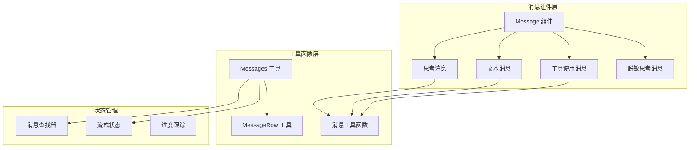
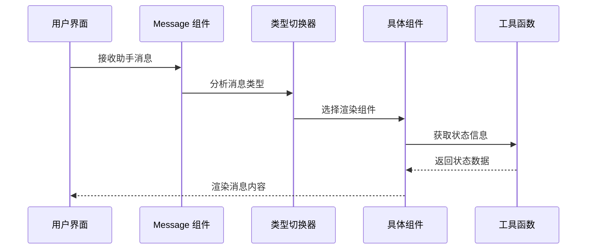
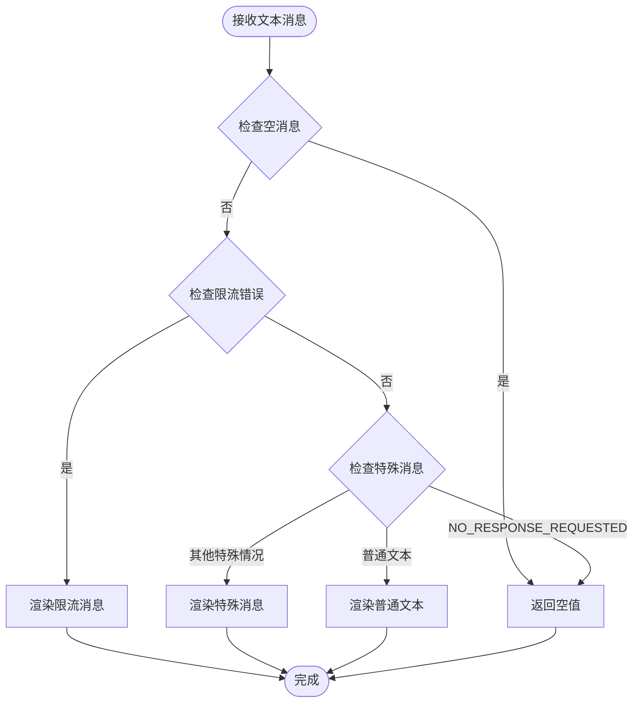
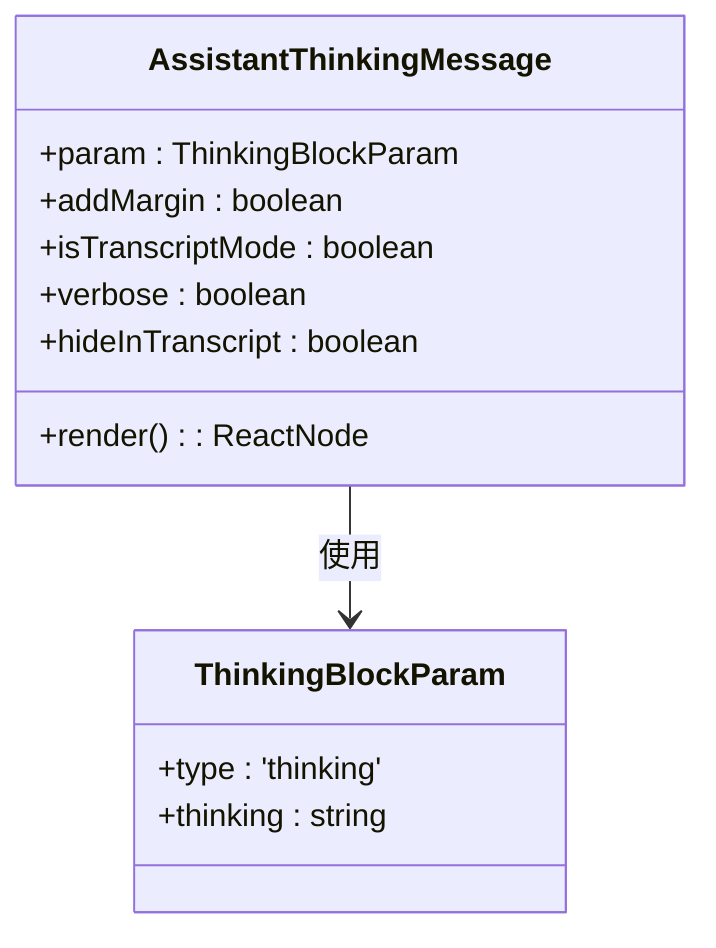
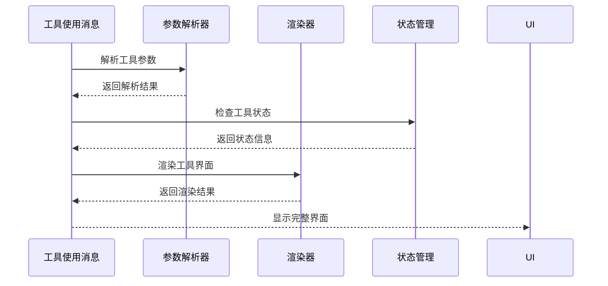
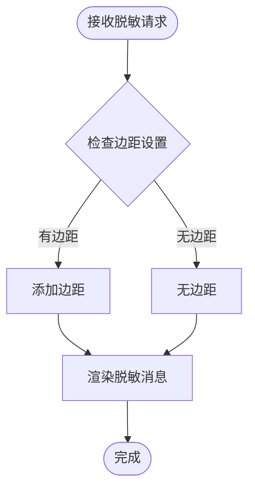

# 助手消息类型

<cite>
**本文档引用的文件**
- [Message.tsx](file://src/components/Message.tsx)
- [Messages.tsx](file://src/components/Messages.tsx)
- [MessageRow.tsx](file://src/components/MessageRow.tsx)
- [AssistantTextMessage.tsx](file://src/components/messages/AssistantTextMessage.tsx)
- [AssistantThinkingMessage.tsx](file://src/components/messages/AssistantThinkingMessage.tsx)
- [AssistantToolUseMessage.tsx](file://src/components/messages/AssistantToolUseMessage.tsx)
- [AssistantRedactedThinkingMessage.tsx](file://src/components/messages/AssistantRedactedThinkingMessage.tsx)
- [messages.ts](file://src/utils/messages.ts)
</cite>

## 目录
1. [简介](#简介)
2. [项目结构](#项目结构)
3. [核心组件](#核心组件)
4. [架构概览](#架构概览)
5. [详细组件分析](#详细组件分析)
6. [依赖关系分析](#依赖关系分析)
7. [性能考虑](#性能考虑)
8. [故障排除指南](#故障排除指南)
9. [结论](#结论)

## 简介

助手消息类型是 Claude Code 应用程序中用于处理和显示 AI 助手回复的核心组件系统。该系统支持多种消息组件，包括文本回复、思考过程消息、工具使用消息和脱敏思考消息等。本文档深入介绍了这些消息类型的实现细节、渲染策略、流式输出处理和状态更新机制。

## 项目结构

助手消息系统的架构基于模块化设计，主要包含以下核心组件：



**图表来源**
- [Message.tsx:58-156](file://src/components/Message.tsx#L58-L156)
- [Messages.tsx:289-309](file://src/components/MessageRow.tsx#L289-L309)

**章节来源**
- [Message.tsx:1-200](file://src/components/Message.tsx#L1-L200)
- [Messages.tsx:1-200](file://src/components/Messages.tsx#L1-L200)

## 核心组件

助手消息系统的核心组件包括：

### 主要消息类型
- **文本消息**：处理标准的文本回复内容
- **思考消息**：显示 AI 的内部思考过程
- **工具使用消息**：展示 AI 计划使用的工具及其参数
- **脱敏思考消息**：在特定模式下隐藏详细的思考内容

### 渲染策略
系统采用条件渲染策略，根据消息类型和上下文环境动态选择合适的渲染组件。每个消息组件都实现了优化的渲染逻辑，确保高效的用户界面更新。

**章节来源**
- [AssistantTextMessage.tsx:47-270](file://src/components/messages/AssistantTextMessage.tsx#L47-L270)
- [AssistantThinkingMessage.tsx:19-86](file://src/components/messages/AssistantThinkingMessage.tsx#L19-L86)
- [AssistantToolUseMessage.tsx:35-368](file://src/components/messages/AssistantToolUseMessage.tsx#L35-L368)
- [AssistantRedactedThinkingMessage.tsx:7-31](file://src/components/messages/AssistantRedactedThinkingMessage.tsx#L7-L31)

## 架构概览

助手消息系统的整体架构采用分层设计，确保了良好的可维护性和扩展性：



**图表来源**
- [Message.tsx:82-156](file://src/components/Message.tsx#L82-L156)
- [messages.ts:1170-1200](file://src/utils/messages.ts#L1170-L1200)

系统的核心优势在于其模块化的组件设计和高效的渲染机制，能够处理复杂的多内容块消息并提供流畅的用户体验。

## 详细组件分析

### 文本消息组件 (AssistantTextMessage)

文本消息组件负责处理标准的文本回复内容，具有以下特性：



**图表来源**
- [AssistantTextMessage.tsx:60-227](file://src/components/messages/AssistantTextMessage.tsx#L60-L227)

#### 关键功能
- **错误处理**：识别并处理各种 API 错误消息
- **限流检测**：自动检测和显示速率限制相关消息
- **特殊消息处理**：处理系统预定义的特殊消息类型
- **智能截断**：对长错误消息进行智能截断显示

**章节来源**
- [AssistantTextMessage.tsx:28-195](file://src/components/messages/AssistantTextMessage.tsx#L28-L195)

### 思考消息组件 (AssistantThinkingMessage)

思考消息组件专门用于显示 AI 的内部思考过程：



**图表来源**
- [AssistantThinkingMessage.tsx:7-18](file://src/components/messages/AssistantThinkingMessage.tsx#L7-L18)

#### 渲染策略
- **转录模式**：在转录模式下显示完整思考内容
- **详细模式**：在详细模式下显示完整思考内容
- **默认模式**：仅显示简化的思考提示
- **隐藏机制**：支持在特定情况下隐藏思考内容

**章节来源**
- [AssistantThinkingMessage.tsx:19-86](file://src/components/messages/AssistantThinkingMessage.tsx#L19-L86)

### 工具使用消息组件 (AssistantToolUseMessage)

工具使用消息组件是最复杂的组件之一，负责处理 AI 计划使用的各种工具：



**图表来源**
- [AssistantToolUseMessage.tsx:61-120](file://src/components/messages/AssistantToolUseMessage.tsx#L61-L120)

#### 核心功能
- **参数验证**：使用 Zod 模式验证工具输入参数
- **状态跟踪**：监控工具调用的进度和状态
- **权限检查**：集成权限审批流程
- **进度显示**：实时显示工具执行进度
- **错误处理**：优雅处理工具调用失败

**章节来源**
- [AssistantToolUseMessage.tsx:35-368](file://src/components/messages/AssistantToolUseMessage.tsx#L35-L368)

### 脱敏思考消息组件 (AssistantRedactedThinkingMessage)

脱敏思考消息组件用于在特定安全模式下隐藏详细的思考内容：



**图表来源**
- [AssistantRedactedThinkingMessage.tsx:12-29](file://src/components/messages/AssistantRedactedThinkingMessage.tsx#L12-L29)

#### 安全特性
- **内容隐藏**：完全隐藏详细的思考内容
- **视觉提示**：提供简化的视觉指示
- **模式适配**：根据上下文自动调整显示方式

**章节来源**
- [AssistantRedactedThinkingMessage.tsx:7-31](file://src/components/messages/AssistantRedactedThinkingMessage.tsx#L7-L31)

## 依赖关系分析

助手消息系统的关键依赖关系如下：

```mermaid
graph TB
subgraph "外部依赖"
SDK[@anthropic-ai/sdk]
React[React]
Ink[Ink 组件库]
end
subgraph "内部模块"
Message[Message 组件]
Components[消息组件]
Utils[工具函数]
Hooks[React Hooks]
end
subgraph "类型定义"
Types[消息类型]
Blocks[内容块类型]
Tools[工具类型]
end
SDK --> Message
React --> Message
Ink --> Components
Message --> Components
Message --> Utils
Components --> Hooks
Utils --> Types
Components --> Blocks
Components --> Tools
```

**图表来源**
- [Message.tsx:1-50](file://src/components/Message.tsx#L1-L50)
- [messages.ts:1-50](file://src/utils/messages.ts#L1-L50)

### 主要依赖项
- **@anthropic-ai/sdk**：提供标准化的消息格式和类型定义
- **React**：提供组件化开发框架
- **Ink**：提供终端友好的 UI 组件
- **Zod**：提供运行时类型验证

**章节来源**
- [Message.tsx:1-32](file://src/components/Message.tsx#L1-L32)
- [messages.ts:1-50](file://src/utils/messages.ts#L1-L50)

## 性能考虑

助手消息系统在设计时充分考虑了性能优化：

### 渲染优化
- **记忆化缓存**：使用 React.memo 和 useMemo 避免不必要的重新渲染
- **条件渲染**：根据消息类型和状态动态选择渲染路径
- **批量更新**：合并多个状态变更以减少重排次数

### 内存管理
- **对象池**：复用已创建的消息对象
- **垃圾回收**：及时清理不再使用的组件实例
- **内存泄漏防护**：确保事件监听器正确清理

### 流式处理
- **增量渲染**：支持流式内容的增量渲染
- **背压控制**：防止大量消息导致的性能问题
- **虚拟滚动**：对长消息列表使用虚拟化技术

## 故障排除指南

### 常见问题及解决方案

#### 消息渲染异常
**症状**：某些消息无法正确显示或显示为空白
**原因**：消息类型不匹配或缺少必要的属性
**解决方案**：
1. 检查消息的 `type` 属性是否正确
2. 验证消息内容是否符合预期格式
3. 确认相关工具组件是否正确注册

#### 思考消息显示问题
**症状**：思考消息显示不完整或完全不显示
**原因**：转录模式设置或权限限制
**解决方案**：
1. 检查 `isTranscriptMode` 和 `verbose` 参数
2. 验证用户权限设置
3. 确认消息的 `hideInTranscript` 标志

#### 工具使用消息错误
**症状**：工具调用显示为错误或卡住
**原因**：工具参数验证失败或权限问题
**解决方案**：
1. 检查工具输入参数的 Zod 验证
2. 确认工具权限配置
3. 查看工具执行日志

**章节来源**
- [AssistantTextMessage.tsx:196-227](file://src/components/messages/AssistantTextMessage.tsx#L196-L227)
- [AssistantToolUseMessage.tsx:89-93](file://src/components/messages/AssistantToolUseMessage.tsx#L89-L93)

## 结论

助手消息类型系统通过模块化设计和精心优化的渲染策略，成功实现了复杂 AI 助手消息的高效处理和显示。系统的主要优势包括：

1. **模块化架构**：清晰的组件分离和职责划分
2. **性能优化**：多层缓存和增量渲染机制
3. **安全性**：完整的权限控制和内容脱敏机制
4. **可扩展性**：灵活的工具集成和自定义能力

该系统为开发者提供了强大的基础，可以轻松扩展新的消息类型和功能，同时保持优秀的性能表现和用户体验。