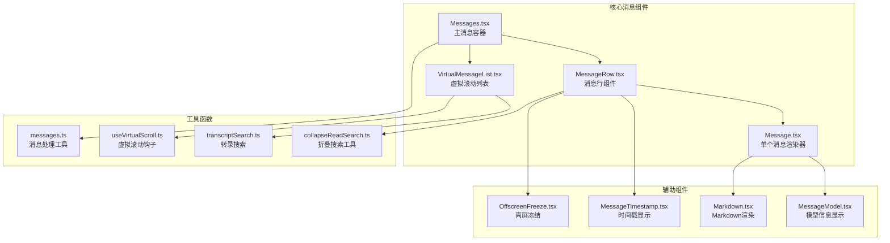
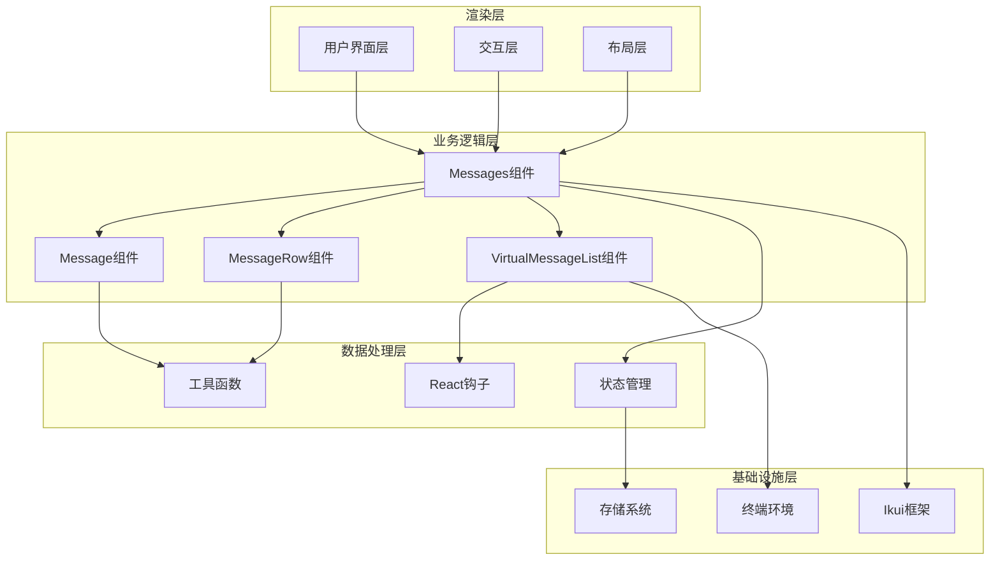
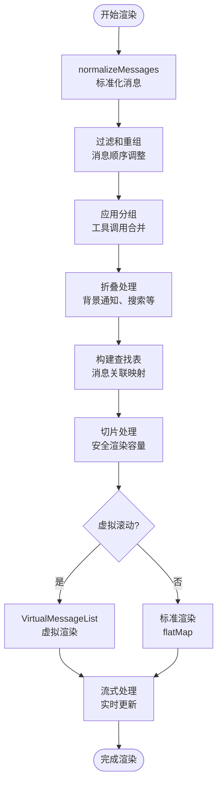
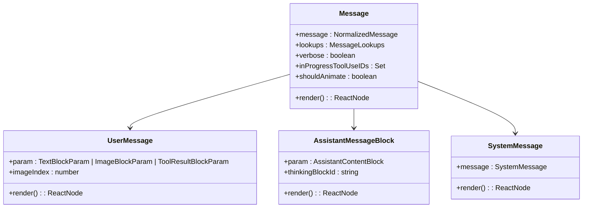
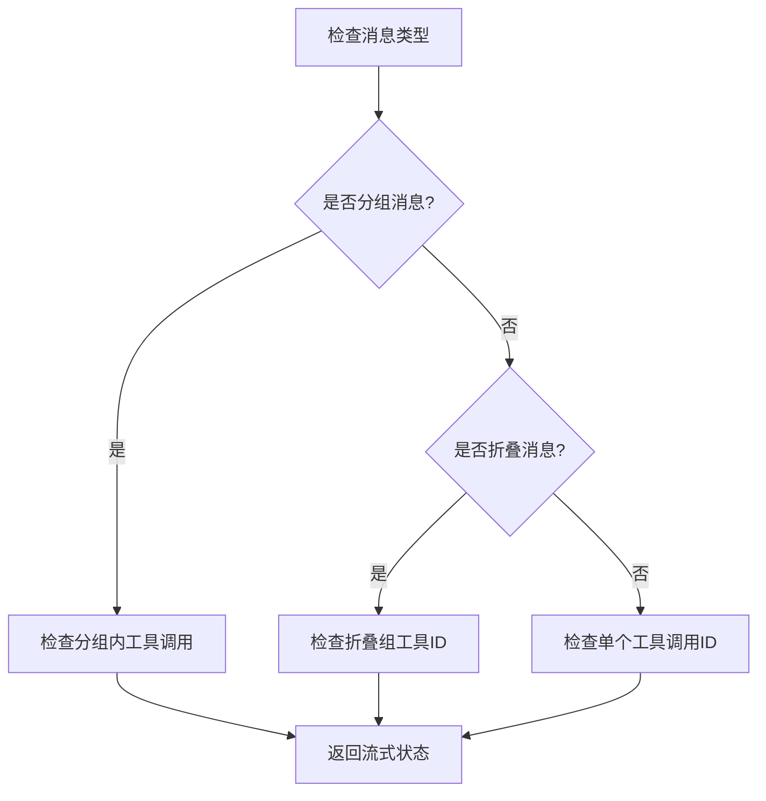
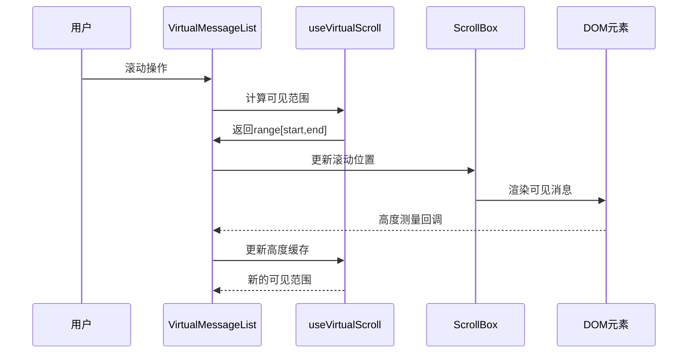
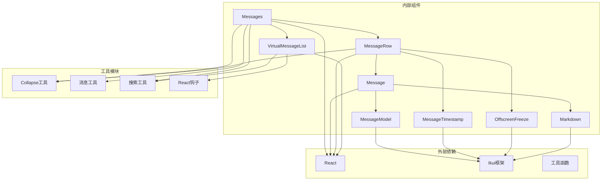
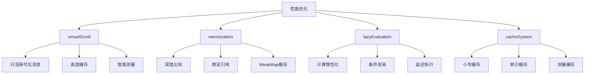

# 核心消息组件

<cite>
**本文档引用的文件**
- [Messages.tsx](file://src/components/Messages.tsx)
- [Message.tsx](file://src/components/Message.tsx)
- [MessageRow.tsx](file://src/components/MessageRow.tsx)
- [VirtualMessageList.tsx](file://src/components/VirtualMessageList.tsx)
- [MessageModel.tsx](file://src/components/MessageModel.ts)
- [MessageTimestamp.tsx](file://src/components/MessageTimestamp.tsx)
- [OffscreenFreeze.tsx](file://src/components/OffscreenFreeze.tsx)
- [Markdown.tsx](file://src/components/Markdown.tsx)
- [messageActions.tsx](file://src/components/messageActions.tsx)
- [useVirtualScroll.ts](file://src/hooks/useVirtualScroll.ts)
- [ScrollBox.ts](file://src/ink/components/ScrollBox.js)
- [ink.ts](file://src/ink.ts)
- [messages.ts](file://src/utils/messages.ts)
- [collapseReadSearch.ts](file://src/utils/collapseReadSearch.ts)
- [transcriptSearch.ts](file://src/utils/transcriptSearch.ts)
- [sleep.ts](file://src/utils/sleep.ts)
- [debug.ts](file://src/utils/debug.ts)
</cite>

## 目录
1. [简介](#简介)
2. [项目结构](#项目结构)
3. [核心组件](#核心组件)
4. [架构概览](#架构概览)
5. [详细组件分析](#详细组件分析)
6. [依赖关系分析](#依赖关系分析)
7. [性能考虑](#性能考虑)
8. [故障排除指南](#故障排除指南)
9. [结论](#结论)

## 简介

核心消息组件是 Claude 桌面应用中的消息渲染系统，负责在终端环境中高效显示和交互各种类型的消息内容。该系统包含三个核心组件：Messages、Message 和 MessageRow，以及一个虚拟滚动列表组件 VirtualMessageList。

这些组件共同实现了以下功能：
- 支持多种消息类型的渲染（用户消息、助手消息、系统消息、附件等）
- 实时流式更新和增量渲染
- 高效的虚拟滚动以处理大量消息
- 搜索和导航功能
- 响应式布局和样式系统
- 性能优化和内存管理

## 项目结构

核心消息组件位于 `src/components/` 目录下，主要文件包括：



**图表来源**
- [Messages.tsx:1-834](file://src/components/Messages.tsx#L1-834)
- [Message.tsx:1-627](file://src/components/Message.tsx#L1-627)
- [MessageRow.tsx:1-383](file://src/components/MessageRow.tsx#L1-383)
- [VirtualMessageList.tsx:1-1082](file://src/components/VirtualMessageList.tsx#L1-1082)

**章节来源**
- [Messages.tsx:1-834](file://src/components/Messages.tsx#L1-834)
- [Message.tsx:1-627](file://src/components/Message.tsx#L1-627)
- [MessageRow.tsx:1-383](file://src/components/MessageRow.tsx#L1-383)
- [VirtualMessageList.tsx:1-1082](file://src/components/VirtualMessageList.tsx#L1-1082)

## 核心组件

### Messages 组件

Messages 是整个消息系统的主容器，负责：
- 消息数据的预处理和过滤
- 虚拟滚动的条件控制
- 消息渲染的性能优化
- 搜索和导航功能集成

### Message 组件

Message 组件负责单个消息的渲染，支持多种消息类型：
- 用户消息（文本、图片、工具结果）
- 助手消息（文本、思考过程、工具调用）
- 系统消息（状态通知、错误信息）
- 附件消息（文件、命令等）

### MessageRow 组件

MessageRow 是消息行的包装组件，提供：
- 消息元数据的显示（时间戳、模型信息）
- 消息状态的可视化（加载中、完成等）
- 交互功能（点击展开、悬停效果）

### VirtualMessageList 组件

VirtualMessageList 提供高性能的虚拟滚动：
- 只渲染可见区域的消息
- 智能的高度缓存和测量
- 平滑的滚动体验
- 搜索和导航功能

**章节来源**
- [Messages.tsx:207-778](file://src/components/Messages.tsx#L207-778)
- [Message.tsx:32-627](file://src/components/Message.tsx#L32-627)
- [MessageRow.tsx:15-383](file://src/components/MessageRow.tsx#L15-383)
- [VirtualMessageList.tsx:69-113](file://src/components/VirtualMessageList.tsx#L69-113)

## 架构概览

核心消息组件采用分层架构设计，确保了良好的可维护性和扩展性：



**图表来源**
- [Messages.tsx:341-721](file://src/components/Messages.tsx#L341-721)
- [VirtualMessageList.tsx:289-415](file://src/components/VirtualMessageList.tsx#L289-415)

该架构的主要特点：
- **分层清晰**：从渲染到数据处理的明确分层
- **职责分离**：每个组件都有明确的职责边界
- **可扩展性**：新的消息类型和功能可以轻松添加
- **性能优化**：通过虚拟滚动和增量渲染提升性能

## 详细组件分析

### Messages 组件深度分析

Messages 组件是整个消息系统的核心，实现了复杂的状态管理和渲染逻辑：

#### 主要功能特性

1. **消息预处理管道**：
   - 消息标准化和过滤
   - 分组和折叠处理
   - 搜索和转录模式支持
   - 流式工具调用处理

2. **虚拟滚动控制**：
   - 条件启用虚拟滚动
   - 安全的渲染容量控制
   - 切片锚点管理

3. **性能优化策略**：
   - 深度记忆化优化
   - 惰性计算和缓存
   - 内存泄漏防护

#### 渲染流程图



**图表来源**
- [Messages.tsx:481-543](file://src/components/Messages.tsx#L481-543)

#### 关键实现细节

1. **消息切片和锚点管理**：
   ```javascript
   // 锚点结构用于保持渲染位置稳定
   type SliceAnchor = {
     uuid: string;
     idx: number;
   } | null;
   ```

2. **流式工具调用处理**：
   - 创建合成消息以支持实时渲染
   - 使用确定性UUID避免React key变化
   - 智能的工具调用ID管理

3. **转录模式支持**：
   - 默认显示最后30条消息
   - 支持完整转录模式
   - Brief模式的特殊处理

**章节来源**
- [Messages.tsx:341-721](file://src/components/Messages.tsx#L341-721)

### Message 组件详细分析

Message 组件负责单个消息的完整渲染，支持复杂的多类型消息：

#### 消息类型支持

1. **用户消息**：
   - 文本消息渲染
   - 图片消息处理
   - 工具结果展示
   - 连续消息检测

2. **助手消息**：
   - 文本内容渲染
   - 思考过程显示
   - 工具调用展示
   - 顾问消息支持

3. **系统消息**：
   - 状态通知
   - 错误信息
   - 紧凑边界处理
   - 历史片段支持

#### 渲染优化策略



**图表来源**
- [Message.tsx:58-590](file://src/components/Message.tsx#L58-590)

#### 性能优化技术

1. **深度记忆化**：
   - React.memo自定义比较器
   - 惰性属性计算
   - 缓存策略优化

2. **条件渲染**：
   - 转录模式下的内容过滤
   - 思考内容的延迟显示
   - 工具结果的智能截断

**章节来源**
- [Message.tsx:58-627](file://src/components/Message.tsx#L58-627)

### MessageRow 组件分析

MessageRow 组件作为消息行的包装器，提供了额外的功能增强：

#### 核心功能

1. **元数据显示**：
   - 时间戳显示
   - 模型信息展示
   - 元数据的条件渲染

2. **交互功能**：
   - 点击展开/收起
   - 悬停效果
   - 离屏冻结优化

3. **状态管理**：
   - 加载状态指示
   - 工具调用进度
   - 消息流式状态

#### 流式消息检测



**图表来源**
- [MessageRow.tsx:296-334](file://src/components/MessageRow.tsx#L296-334)

**章节来源**
- [MessageRow.tsx:93-383](file://src/components/MessageRow.tsx#L93-383)

### VirtualMessageList 组件分析

VirtualMessageList 是高性能虚拟滚动的核心实现：

#### 虚拟滚动架构



**图表来源**
- [VirtualMessageList.tsx:325-336](file://src/components/VirtualMessageList.tsx#L325-336)

#### 关键优化技术

1. **增量键数组管理**：
   - 避免每次渲染重建完整键数组
   - 支持流式消息追加
   - 智能的前缀匹配优化

2. **高度缓存系统**：
   - 浮点数数组存储高度
   - 宽度变化时的缓存失效
   - 智能的测量回调

3. **搜索和导航**：
   - 实时搜索索引构建
   - 位置扫描和高亮
   - 智能的锚点跟踪

**章节来源**
- [VirtualMessageList.tsx:289-800](file://src/components/VirtualMessageList.tsx#L289-800)

## 依赖关系分析

核心消息组件之间的依赖关系体现了清晰的架构设计：



**图表来源**
- [Messages.tsx:1-50](file://src/components/Messages.tsx#L1-50)
- [MessageRow.tsx:1-20](file://src/components/MessageRow.tsx#L1-20)

### 主要依赖关系

1. **React 生态系统**：
   - React.memo 用于性能优化
   - useCallback 和 useMemo 用于状态管理
   - useRef 和 useState 用于本地状态

2. **Ikui 框架**：
   - Box 和 Text 组件用于布局
   - stringWidth 用于宽度计算
   - DOM 元素处理

3. **工具函数模块**：
   - 消息处理和转换
   - 折叠和分组算法
   - 搜索和索引构建

**章节来源**
- [Messages.tsx:1-85](file://src/components/Messages.tsx#L1-85)
- [MessageRow.tsx:1-15](file://src/components/MessageRow.tsx#L1-15)

## 性能考虑

核心消息组件在设计时充分考虑了性能优化，采用了多种策略来确保在大量消息场景下的流畅运行：

### 内存管理策略

1. **虚拟滚动**：
   - 仅渲染可见区域的消息
   - 智能的高度缓存减少重复计算
   - 流式消息的增量渲染

2. **记忆化优化**：
   - 深度自定义的 React.memo 比较器
   - WeakMap 缓存避免内存泄漏
   - 惰性计算和按需更新

3. **渲染容量控制**：
   - 安全的渲染上限防止内存溢出
   - 切片锚点机制保持渲染稳定性
   - 条件禁用虚拟滚动的降级方案

### 渲染性能优化



**图表来源**
- [Messages.tsx:314-340](file://src/components/Messages.tsx#L314-340)
- [MessageRow.tsx:342-381](file://src/components/MessageRow.tsx#L342-381)

### 性能监控和调试

1. **调试日志系统**：
   - 详细的性能指标记录
   - 搜索和导航行为追踪
   - 渲染过程的逐步调试

2. **内存使用监控**：
   - 周期性的内存使用报告
   - 缓存命中率统计
   - DOM 元素数量监控

**章节来源**
- [VirtualMessageList.tsx:16-18](file://src/components/VirtualMessageList.tsx#L16-18)
- [Messages.tsx:278-307](file://src/components/Messages.tsx#L278-307)

## 故障排除指南

### 常见问题和解决方案

#### 渲染性能问题

**问题**：消息列表滚动卡顿
**原因**：虚拟滚动未正确启用或缓存失效
**解决方案**：
1. 检查 scrollRef 是否正确传递
2. 验证 columns 属性的变化
3. 确认高度缓存的有效性

#### 内存泄漏问题

**问题**：长时间运行后内存持续增长
**原因**：缓存未正确清理或引用循环
**解决方案**：
1. 检查 WeakMap 缓存的使用
2. 验证组件卸载时的清理逻辑
3. 监控缓存大小和生命周期

#### 搜索功能异常

**问题**：搜索结果不准确或无响应
**原因**：搜索索引未正确构建或缓存问题
**解决方案**：
1. 确认 warmSearchIndex 的调用
2. 检查 extractSearchText 函数的实现
3. 验证搜索查询的大小写处理

### 调试技巧

1. **启用调试模式**：
   ```javascript
   // 在开发环境中启用详细日志
   const debug = process.env.NODE_ENV === 'development';
   ```

2. **性能分析**：
   - 使用浏览器开发者工具的性能面板
   - 监控渲染时间和内存使用
   - 分析组件重渲染的原因

3. **消息追踪**：
   - 启用详细的消息处理日志
   - 跟踪消息状态变化
   - 监控虚拟滚动的性能指标

**章节来源**
- [VirtualMessageList.tsx:797-800](file://src/components/VirtualMessageList.tsx#L797-800)
- [debug.ts](file://src/utils/debug.ts)

## 结论

核心消息组件展现了现代前端应用中消息渲染系统的最佳实践。通过精心设计的架构和多种性能优化策略，该系统能够高效处理大量消息，同时保持良好的用户体验。

### 主要成就

1. **架构设计**：清晰的分层架构和职责分离
2. **性能优化**：虚拟滚动、记忆化和缓存策略
3. **可扩展性**：模块化的组件设计支持功能扩展
4. **用户体验**：流畅的交互和响应式设计

### 技术亮点

- 深度集成的虚拟滚动系统
- 智能的缓存和记忆化机制
- 灵活的消息类型支持
- 高效的搜索和导航功能
- 完善的性能监控和调试工具

该系统为类似的消息渲染需求提供了优秀的参考实现，其设计理念和优化策略值得在其他项目中借鉴和应用。