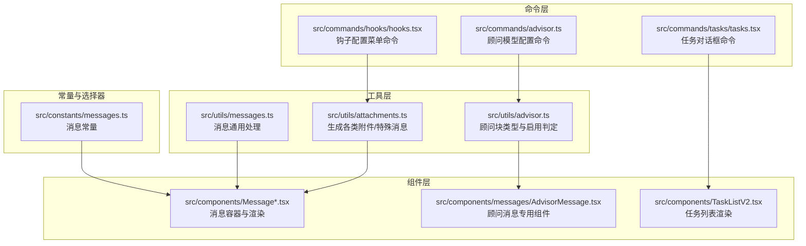
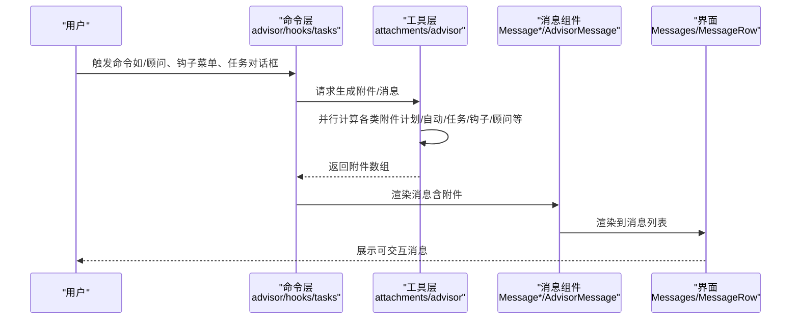
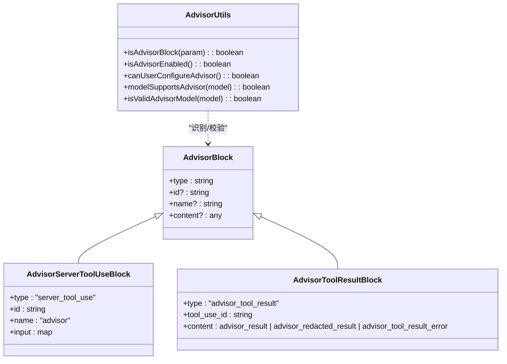
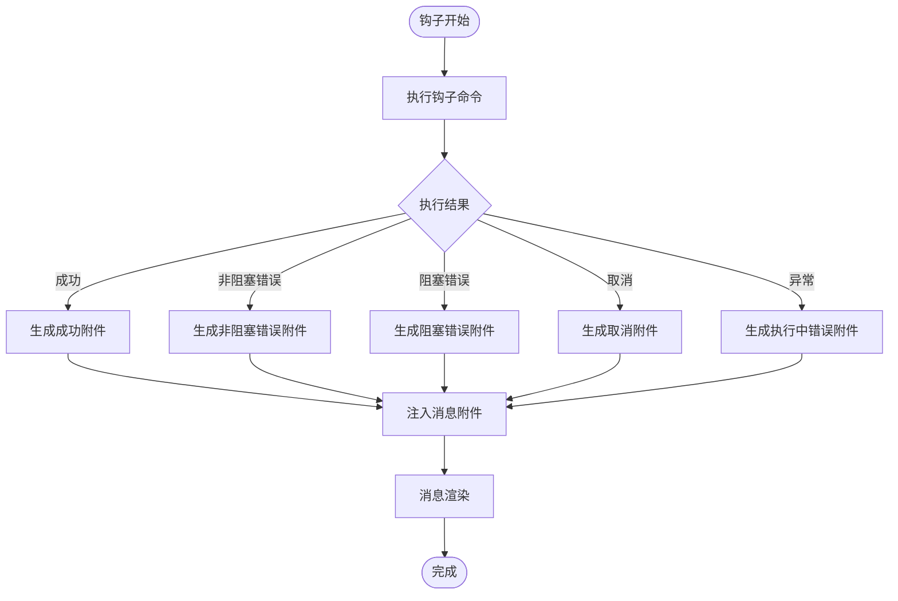
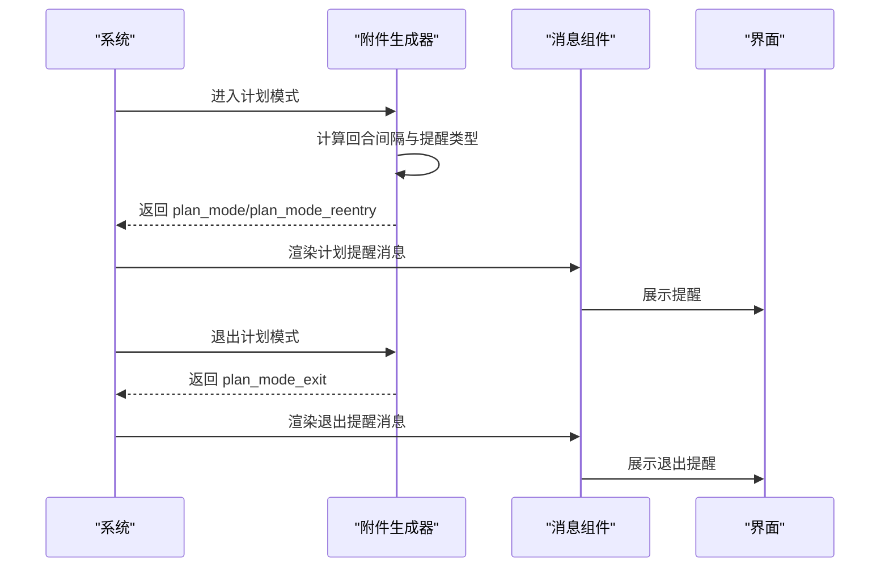
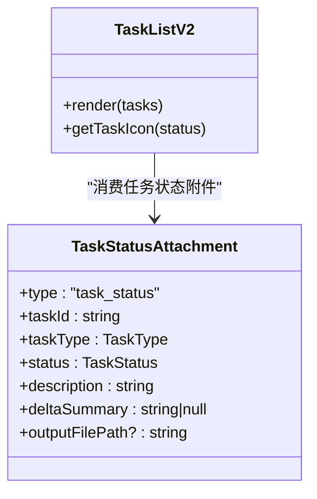
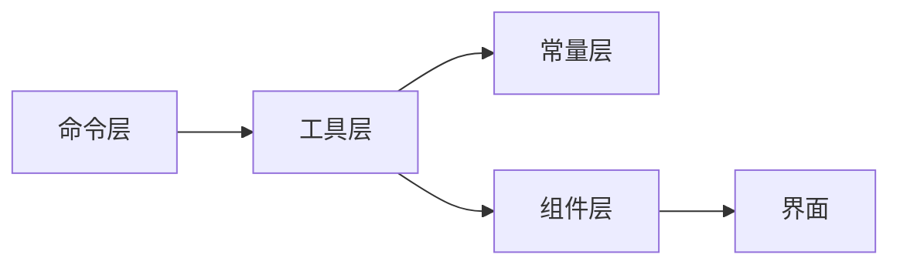

# 特殊消息类型

<cite>
**本文引用的文件**
- [src/utils/attachments.ts](file://src/utils/attachments.ts)
- [src/utils/advisor.ts](file://src/utils/advisor.ts)
- [src/commands/advisor.ts](file://src/commands/advisor.ts)
- [src/commands/hooks/hooks.tsx](file://src/commands/hooks/hooks.tsx)
- [src/commands/tasks/tasks.tsx](file://src/commands/tasks/tasks.tsx)
- [src/components/messages/AdvisorMessage.tsx](file://src/components/messages/AdvisorMessage.tsx)
- [src/components/TaskListV2.tsx](file://src/components/TaskListV2.tsx)
- [src/components/Message.tsx](file://src/components/Message.tsx)
- [src/components/Messages.tsx](file://src/components/Messages.tsx)
- [src/components/MessageRow.tsx](file://src/components/MessageRow.tsx)
- [src/components/MessageModel.tsx](file://src/components/MessageModel.tsx)
- [src/components/MessageResponse.tsx](file://src/components/MessageResponse.tsx)
- [src/components/MessageTimestamp.tsx](file://src/components/MessageTimestamp.tsx)
- [src/components/MessageSelector.tsx](file://src/components/MessageSelector.tsx)
- [src/components/VirtualMessageList.tsx](file://src/components/VirtualMessageList.tsx)
- [src/constants/messages.ts](file://src/constants/messages.ts)
- [src/utils/messages.ts](file://src/utils/messages.ts)
</cite>

## 目录
1. [引言](#引言)
2. [项目结构](#项目结构)
3. [核心组件](#核心组件)
4. [架构总览](#架构总览)
5. [详细组件分析](#详细组件分析)
6. [依赖关系分析](#依赖关系分析)
7. [性能考量](#性能考量)
8. [故障排查指南](#故障排查指南)
9. [结论](#结论)
10. [附录](#附录)

## 引言
本文件聚焦“特殊消息类型”，系统性梳理并解释以下几类在会话中承担特定业务职责的消息与附件：顾问消息、钩子进度消息、计划模式消息（含进入/退出）、自动模式消息（含退出）、任务状态消息、队列命令消息、以及与之配套的渲染与交互机制。我们将从系统架构、数据流、处理逻辑、用户交互到扩展开发给出完整说明，并提供可视化图示帮助理解。

## 项目结构
围绕“特殊消息”的实现，主要涉及以下层次：
- 工具层：负责生成各类“附件”（包含特殊消息），并按规则节流与聚合
- 命令层：提供配置与入口（如顾问模型设置、钩子配置菜单、任务对话框）
- 组件层：负责消息的渲染与交互（文本、思考、工具调用、附件等）
- 消息常量与工具：统一消息类型定义与通用消息处理逻辑

图表来源
- [src/utils/attachments.ts:743-1003](file://src/utils/attachments.ts#L743-L1003)
- [src/utils/advisor.ts:1-146](file://src/utils/advisor.ts#L1-L146)
- [src/commands/advisor.ts:1-110](file://src/commands/advisor.ts#L1-L110)
- [src/commands/hooks/hooks.tsx:1-13](file://src/commands/hooks/hooks.tsx#L1-L13)
- [src/commands/tasks/tasks.tsx:1-8](file://src/commands/tasks/tasks.tsx#L1-L8)
- [src/components/messages/AdvisorMessage.tsx](file://src/components/messages/AdvisorMessage.tsx)
- [src/components/TaskListV2.tsx:190-336](file://src/components/TaskListV2.tsx#L190-L336)
- [src/components/Message.tsx](file://src/components/Message.tsx)
- [src/components/Messages.tsx](file://src/components/Messages.tsx)
- [src/components/MessageRow.tsx](file://src/components/MessageRow.tsx)
- [src/components/MessageModel.tsx](file://src/components/MessageModel.tsx)
- [src/components/MessageResponse.tsx](file://src/components/MessageResponse.tsx)
- [src/components/MessageTimestamp.tsx](file://src/components/MessageTimestamp.tsx)
- [src/components/MessageSelector.tsx](file://src/components/MessageSelector.tsx)
- [src/components/VirtualMessageList.tsx](file://src/components/VirtualMessageList.tsx)
- [src/constants/messages.ts](file://src/constants/messages.ts)
- [src/utils/messages.ts](file://src/utils/messages.ts)

章节来源
- [src/utils/attachments.ts:743-1003](file://src/utils/attachments.ts#L743-L1003)
- [src/utils/advisor.ts:1-146](file://src/utils/advisor.ts#L1-L146)
- [src/commands/advisor.ts:1-110](file://src/commands/advisor.ts#L1-L110)
- [src/commands/hooks/hooks.tsx:1-13](file://src/commands/hooks/hooks.tsx#L1-L13)
- [src/commands/tasks/tasks.tsx:1-8](file://src/commands/tasks/tasks.tsx#L1-L8)

## 核心组件
- 附件生成器（附件工厂）：集中产出“特殊消息”与“普通消息附件”。通过多路并行计算与节流策略控制频率与体积，确保上下文稳定与性能可控。
- 顾问消息：基于顾问工具块的专用消息类型，支持加密脱敏结果与错误反馈。
- 钩子进度消息：异步钩子执行的响应与状态，包含成功、取消、错误、阻塞等多态附件。
- 计划/自动模式消息：在进入/退出计划或自动模式时注入的提醒附件，带稀疏/全量提醒策略。
- 任务状态消息：任务状态变更、输出路径、描述摘要等信息的附件化表达。
- 队列命令消息：系统内排队的命令以附件形式注入，保留来源、元信息与图片粘贴内容。

章节来源
- [src/utils/attachments.ts:440-718](file://src/utils/attachments.ts#L440-L718)
- [src/utils/advisor.ts:9-34](file://src/utils/advisor.ts#L9-L34)

## 架构总览
下图展示“特殊消息”的端到端流程：命令触发 → 附件生成 → 消息渲染 → 用户交互。

图表来源
- [src/commands/advisor.ts:16-94](file://src/commands/advisor.ts#L16-L94)
- [src/commands/hooks/hooks.tsx:6-12](file://src/commands/hooks/hooks.tsx#L6-L12)
- [src/commands/tasks/tasks.tsx:5-7](file://src/commands/tasks/tasks.tsx#L5-L7)
- [src/utils/attachments.ts:743-1003](file://src/utils/attachments.ts#L743-L1003)
- [src/components/messages/AdvisorMessage.tsx](file://src/components/messages/AdvisorMessage.tsx)
- [src/components/Message.tsx](file://src/components/Message.tsx)
- [src/components/Messages.tsx](file://src/components/Messages.tsx)
- [src/components/MessageRow.tsx](file://src/components/MessageRow.tsx)

## 详细组件分析

### 顾问消息（Advisor）
- 类型与启用判定：通过顾问块类型识别与实验开关判断是否启用；支持模型能力校验与用户可配置性。
- 业务逻辑：在调用顾问工具前后，系统注入“服务器工具调用”与“工具结果”两类块，结果可能为明文、脱敏密文或错误码。
- 渲染机制：专用组件负责展示顾问建议、提示与错误信息；与常规文本消息组件协同显示。
- 用户交互：通过命令设置顾问模型，切换后提示当前主模型是否支持顾问工具。

图表来源
- [src/utils/advisor.ts:9-34](file://src/utils/advisor.ts#L9-L34)
- [src/utils/advisor.ts:60-106](file://src/utils/advisor.ts#L60-L106)
- [src/components/messages/AdvisorMessage.tsx](file://src/components/messages/AdvisorMessage.tsx)

章节来源
- [src/utils/advisor.ts:1-146](file://src/utils/advisor.ts#L1-L146)
- [src/commands/advisor.ts:16-94](file://src/commands/advisor.ts#L16-L94)
- [src/components/messages/AdvisorMessage.tsx](file://src/components/messages/AdvisorMessage.tsx)

### 钩子进度消息（Hook）
- 类型与状态：涵盖成功、取消、非阻塞错误、执行中错误、阻塞错误、额外上下文、系统消息、权限决策等多态附件。
- 业务逻辑：异步钩子执行期间，系统记录进程ID、事件名、命令、stdout/stderr/exitCode等；结束后汇总为附件。
- 渲染机制：消息组件根据附件类型选择对应渲染器，支持在列表中高亮与展开查看细节。
- 用户交互：钩子配置菜单由命令触发，允许用户管理工具权限与钩子行为。

图表来源
- [src/utils/attachments.ts:352-438](file://src/utils/attachments.ts#L352-L438)
- [src/utils/attachments.ts:964-966](file://src/utils/attachments.ts#L964-L966)
- [src/commands/hooks/hooks.tsx:6-12](file://src/commands/hooks/hooks.tsx#L6-L12)

章节来源
- [src/utils/attachments.ts:352-438](file://src/utils/attachments.ts#L352-L438)
- [src/utils/attachments.ts:964-966](file://src/utils/attachments.ts#L964-L966)
- [src/commands/hooks/hooks.tsx:1-13](file://src/commands/hooks/hooks.tsx#L1-L13)

### 计划审批消息（Plan Mode）
- 类型与节流：包含“进入计划模式”“重新进入”“退出计划模式”三类附件；采用“人类回合计数+周期性全量提醒”的节流策略。
- 业务逻辑：在计划模式下，按回合阈值定期注入“计划模式提醒”；退出时一次性注入“退出提醒”。
- 渲染机制：消息组件识别附件类型，渲染不同文案与样式；支持区分主/子代理场景。
- 用户交互：命令入口用于进入/退出计划模式，系统自动注入上下文提醒。

图表来源
- [src/utils/attachments.ts:1186-1273](file://src/utils/attachments.ts#L1186-L1273)
- [src/utils/attachments.ts:1335-1400](file://src/utils/attachments.ts#L1335-L1400)

章节来源
- [src/utils/attachments.ts:1186-1273](file://src/utils/attachments.ts#L1186-L1273)
- [src/utils/attachments.ts:1335-1400](file://src/utils/attachments.ts#L1335-L1400)

### 自动模式消息（Auto Mode）
- 类型与节流：包含“自动模式提醒”“自动模式退出”两类附件；同样基于人类回合计数与周期性全量提醒。
- 业务逻辑：在自动模式或“计划+自动”状态下，按回合阈值注入提醒；退出时一次性注入退出提醒。
- 渲染机制：消息组件识别附件类型，渲染相应文案；与计划模式类似，支持区分主/子代理。
- 用户交互：命令入口用于进入/退出自动模式，系统自动注入上下文提醒。

章节来源
- [src/utils/attachments.ts:1335-1400](file://src/utils/attachments.ts#L1335-L1400)

### 任务分配消息（Task Status）
- 类型与内容：包含任务ID、类型、状态、描述、输出路径、摘要等字段的附件。
- 业务逻辑：任务状态变更时，系统生成任务状态附件；与任务列表组件配合，提供可视化与交互。
- 渲染机制：消息组件渲染任务状态；任务列表组件负责统计与图标化展示（进行中/已完成/待办）。

图表来源
- [src/utils/attachments.ts:610-618](file://src/utils/attachments.ts#L610-L618)
- [src/components/TaskListV2.tsx:212-241](file://src/components/TaskListV2.tsx#L212-L241)

章节来源
- [src/utils/attachments.ts:610-618](file://src/utils/attachments.ts#L610-L618)
- [src/components/TaskListV2.tsx:190-336](file://src/components/TaskListV2.tsx#L190-L336)

### 队列命令消息（Queued Command）
- 类型与内容：包含原始提示、来源UUID、图片粘贴ID、命令模式、来源与元信息等字段的附件。
- 业务逻辑：系统内排队的命令以附件形式注入，保留来源与元信息；支持图片粘贴内容转为多模态块。
- 渲染机制：消息组件识别“队列命令”附件，渲染为系统通知式消息，支持图片预览与来源标识。

章节来源
- [src/utils/attachments.ts:1046-1083](file://src/utils/attachments.ts#L1046-L1083)

## 依赖关系分析
- 附件生成器对消息类型与工具能力有强依赖：需要根据当前模式（计划/自动）、工具可用性、模型能力、权限上下文动态决定是否注入某类附件。
- 命令层与工具层解耦：命令仅负责入口与上下文准备，具体附件生成由工具层完成。
- 组件层对附件类型有明确分支：不同类型附件映射到不同渲染器，保证一致性与可维护性。

图表来源
- [src/commands/advisor.ts:16-94](file://src/commands/advisor.ts#L16-L94)
- [src/utils/attachments.ts:743-1003](file://src/utils/attachments.ts#L743-L1003)
- [src/constants/messages.ts](file://src/constants/messages.ts)
- [src/components/Message.tsx](file://src/components/Message.tsx)
- [src/components/Messages.tsx](file://src/components/Messages.tsx)

章节来源
- [src/utils/attachments.ts:743-1003](file://src/utils/attachments.ts#L743-L1003)
- [src/constants/messages.ts](file://src/constants/messages.ts)

## 性能考量
- 并行计算：附件生成采用多路并行，减少单次请求延迟。
- 节流与去重：计划/自动模式提醒按回合计数节流；日期变化提醒仅在跨日时触发一次。
- 安全与体积：对大文件与内存片段设置字节上限，避免上下文膨胀；图片粘贴内容进行尺寸调整与降采样。
- 错误兜底：附件计算失败时记录日志并返回空集合，不影响主流程。

章节来源
- [src/utils/attachments.ts:1005-1042](file://src/utils/attachments.ts#L1005-L1042)
- [src/utils/attachments.ts:269-289](file://src/utils/attachments.ts#L269-L289)
- [src/utils/attachments.ts:1103-1129](file://src/utils/attachments.ts#L1103-L1129)

## 故障排查指南
- 顾问消息不生效
  - 检查顾问是否启用与用户是否可配置
  - 确认当前主模型是否支持顾问工具
  - 使用命令查询/设置顾问模型
- 钩子消息异常
  - 查看附件中的错误类型（阻塞/非阻塞/执行中）
  - 检查钩子命令、stdout/stderr/exitCode
- 计划/自动模式提醒过于频繁
  - 检查回合计数与提醒周期配置
  - 确认是否处于“重新进入”或“退出”阶段
- 任务状态未更新
  - 检查任务状态附件是否被正确生成
  - 确认任务列表组件是否消费了该附件

章节来源
- [src/utils/advisor.ts:60-106](file://src/utils/advisor.ts#L60-L106)
- [src/utils/attachments.ts:1186-1273](file://src/utils/attachments.ts#L1186-L1273)
- [src/utils/attachments.ts:1335-1400](file://src/utils/attachments.ts#L1335-L1400)
- [src/utils/attachments.ts:610-618](file://src/utils/attachments.ts#L610-L618)

## 结论
特殊消息类型通过“附件工厂”与“专用组件”实现了业务语义与渲染解耦，既保证了系统在复杂模式下的上下文稳定性，又提供了丰富的用户交互与可观测性。通过命令入口与工具层的协作，用户可以灵活配置与使用顾问、钩子、计划/自动模式、任务与队列命令等能力。

## 附录
- 扩展开发建议
  - 新增附件类型：在附件工厂中新增类型与生成函数，并在消息组件中添加对应渲染器
  - 新增命令入口：在命令层注册新命令，准备上下文并调用附件生成器
  - 性能优化：遵循现有节流与并行策略，避免在渲染期做重型计算
  - 可观测性：为新附件类型增加统计埋点与错误日志，便于问题定位