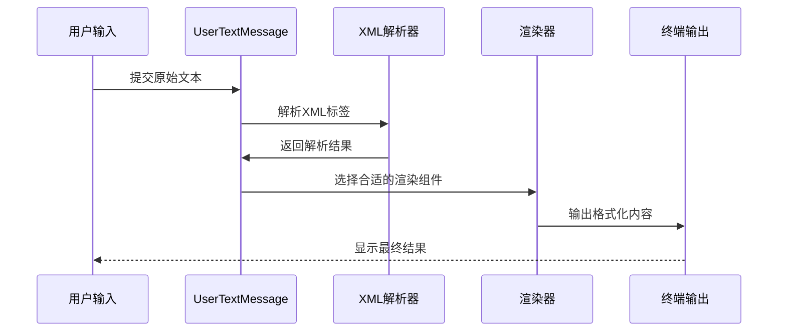
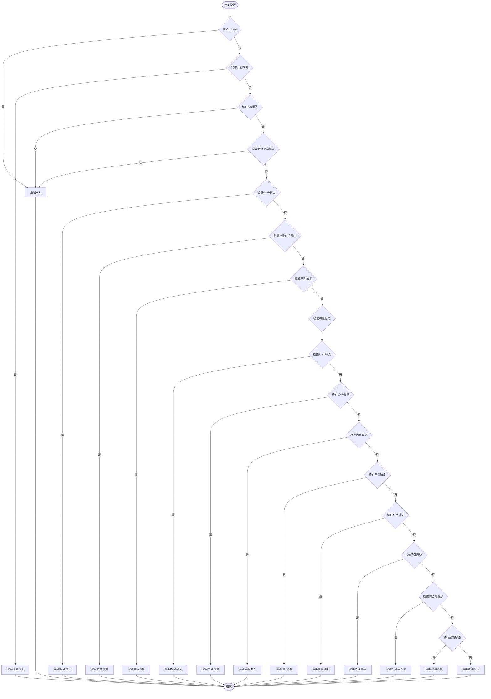
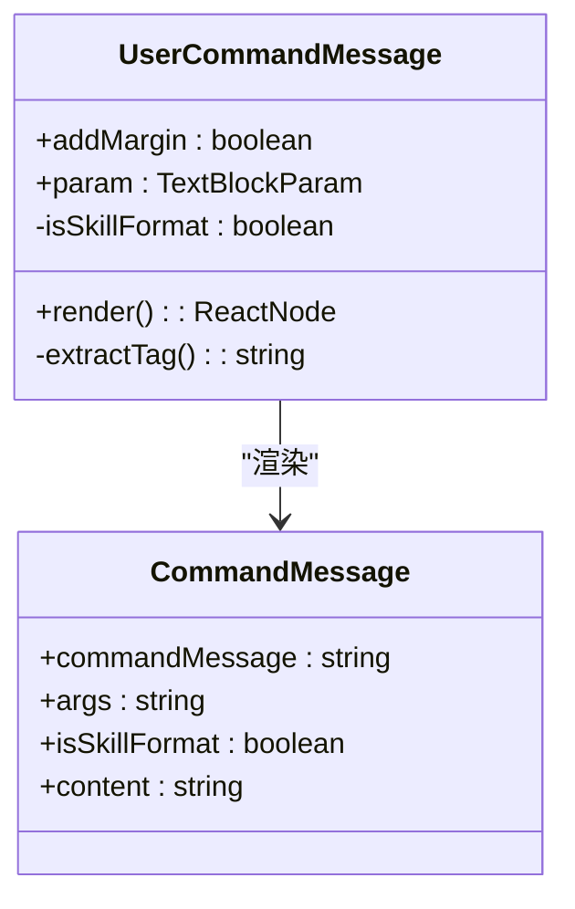
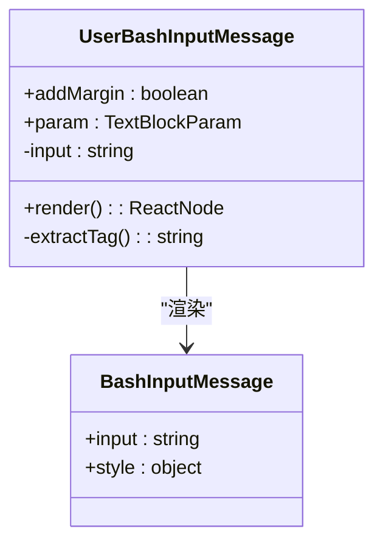
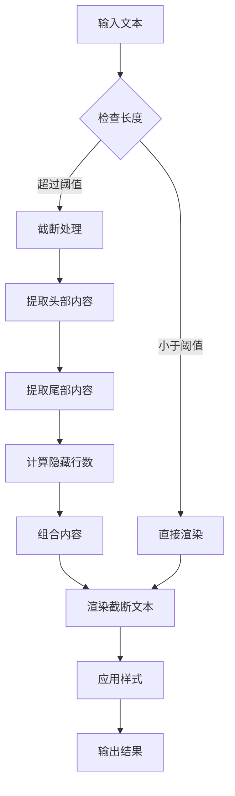
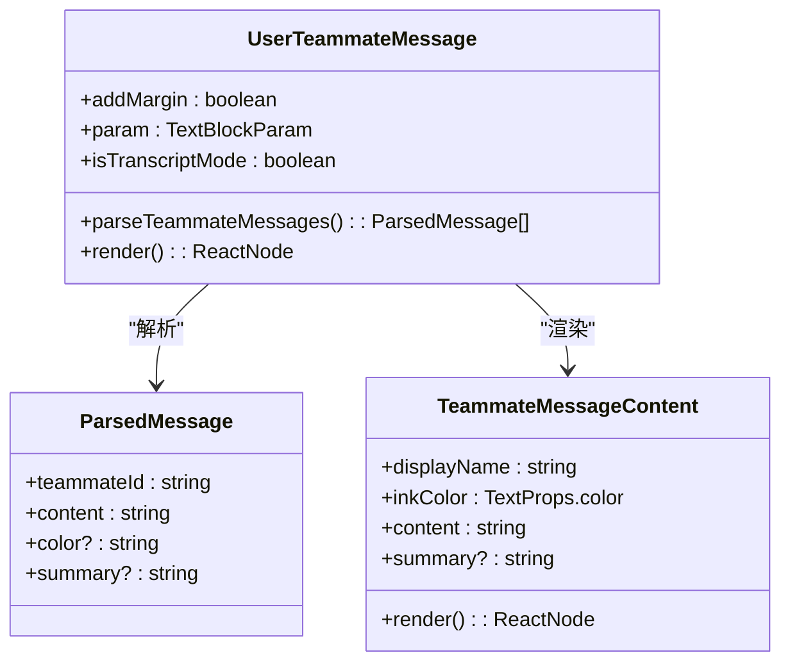
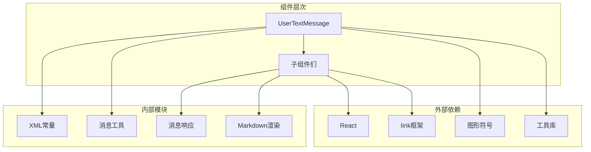

# 用户消息类型

<cite>
**本文档引用的文件**
- [UserTextMessage.tsx](file://src/components/messages/UserTextMessage.tsx)
- [UserCommandMessage.tsx](file://src/components/messages/UserCommandMessage.tsx)
- [UserBashInputMessage.tsx](file://src/components/messages/UserBashInputMessage.tsx)
- [UserImageMessage.tsx](file://src/components/messages/UserImageMessage.tsx)
- [UserPromptMessage.tsx](file://src/components/messages/UserPromptMessage.tsx)
- [UserPlanMessage.tsx](file://src/components/messages/UserPlanMessage.tsx)
- [UserTeammateMessage.tsx](file://src/components/messages/UserTeammateMessage.tsx)
- [UserAgentNotificationMessage.tsx](file://src/components/messages/UserAgentNotificationMessage.tsx)
- [UserLocalCommandOutputMessage.tsx](file://src/components/messages/UserLocalCommandOutputMessage.tsx)
- [UserMemoryInputMessage.tsx](file://src/components/messages/UserMemoryInputMessage.tsx)
- [UserResourceUpdateMessage.tsx](file://src/components/messages/UserResourceUpdateMessage.tsx)
- [xml.ts](file://src/constants/xml.ts)
- [messages.ts](file://src/utils/messages.ts)
</cite>

## 目录
1. [简介](#简介)
2. [项目结构](#项目结构)
3. [核心组件](#核心组件)
4. [架构概览](#架构概览)
5. [详细组件分析](#详细组件分析)
6. [依赖分析](#依赖分析)
7. [性能考虑](#性能考虑)
8. [故障排除指南](#故障排除指南)
9. [结论](#结论)

## 简介

用户消息类型是 Claude Code 应用程序中用于渲染和处理用户生成内容的核心组件系统。该系统支持多种消息格式，包括纯文本消息、命令消息、Bash 输入消息、图片消息以及各种特殊用途的消息类型。

这些组件通过统一的接口接收用户输入，解析特定格式的内容，并将其转换为适合终端显示的视觉元素。每个组件都经过精心设计，以确保在不同场景下都能提供一致且直观的用户体验。

## 项目结构

用户消息组件位于 `src/components/messages/` 目录下，采用模块化设计，每个消息类型都有独立的组件文件：

```mermaid
graph TB
subgraph "用户消息组件"
UserTextMessage[UserTextMessage.tsx]
UserCommandMessage[UserCommandMessage.tsx]
UserBashInputMessage[UserBashInputMessage.tsx]
UserImageMessage[UserImageMessage.tsx]
UserPromptMessage[UserPromptMessage.tsx]
UserPlanMessage[UserPlanMessage.tsx]
UserTeammateMessage[UserTeammateMessage.tsx]
UserAgentNotificationMessage[UserAgentNotificationMessage.tsx]
UserLocalCommandOutputMessage[UserLocalCommandOutputMessage.tsx]
UserMemoryInputMessage[UserMemoryInputMessage.tsx]
UserResourceUpdateMessage[UserResourceUpdateMessage.tsx]
end
subgraph "支持文件"
xmlConstants[xml.ts]
messageUtils[messages.ts]
end
UserTextMessage --> xmlConstants
UserTextMessage --> messageUtils
UserCommandMessage --> xmlConstants
UserCommandMessage --> messageUtils
UserBashInputMessage --> messageUtils
UserImageMessage --> messageUtils
UserPromptMessage --> messageUtils
UserTeammateMessage --> xmlConstants
UserTeammateMessage --> messageUtils
```



**图表来源**
- [UserTextMessage.tsx:1-275](file://src/components/messages/UserTextMessage.tsx#L1-L275)
- [xml.ts:1-87](file://src/constants/xml.ts#L1-L87)
- [messages.ts:633-687](file://src/utils/messages.ts#L633-L687)

**章节来源**
- [UserTextMessage.tsx:1-275](file://src/components/messages/UserTextMessage.tsx#L1-L275)
- [xml.ts:1-87](file://src/constants/xml.ts#L1-L87)

## 核心组件

用户消息系统包含以下主要组件：

### 文本消息组件
- **UserTextMessage**: 主要的文本消息处理器，负责识别和渲染各种特殊格式的用户消息
- **UserPromptMessage**: 标准用户提示消息的渲染组件
- **UserPlanMessage**: 计划模式消息的专用渲染器

### 命令相关组件
- **UserCommandMessage**: Slash 命令的渲染组件
- **UserBashInputMessage**: Bash 命令输入的可视化组件
- **UserLocalCommandOutputMessage**: 本地命令输出的处理组件

### 特殊功能组件
- **UserImageMessage**: 图片附件的渲染组件
- **UserTeammateMessage**: 团队成员消息的处理组件
- **UserAgentNotificationMessage**: 代理通知消息的渲染组件
- **UserMemoryInputMessage**: 内存输入消息的处理组件
- **UserResourceUpdateMessage**: 资源更新消息的渲染组件

**章节来源**
- [UserTextMessage.tsx:1-275](file://src/components/messages/UserTextMessage.tsx#L1-L275)
- [UserPromptMessage.tsx:1-80](file://src/components/messages/UserPromptMessage.tsx#L1-L80)
- [UserCommandMessage.tsx:1-108](file://src/components/messages/UserCommandMessage.tsx#L1-L108)

## 架构概览

用户消息系统采用分层架构设计，具有清晰的职责分离：



**图表来源**
- [UserTextMessage.tsx:29-274](file://src/components/messages/UserTextMessage.tsx#L29-L274)
- [messages.ts:633-687](file://src/utils/messages.ts#L633-L687)

系统的核心处理流程包括：

1. **输入验证**: 检查消息内容的有效性和完整性
2. **格式识别**: 通过 XML 标签识别消息类型
3. **内容提取**: 使用正则表达式提取特定格式的内容
4. **组件选择**: 根据消息类型选择相应的渲染组件
5. **样式应用**: 应用适当的视觉样式和主题
6. **输出渲染**: 将内容渲染到终端界面

**章节来源**
- [UserTextMessage.tsx:39-58](file://src/components/messages/UserTextMessage.tsx#L39-L58)
- [messages.ts:633-687](file://src/utils/messages.ts#L633-L687)

## 详细组件分析

### 文本消息处理系统

UserTextMessage 是整个用户消息系统的核心组件，负责处理所有类型的用户文本输入：



**图表来源**
- [UserTextMessage.tsx:29-274](file://src/components/messages/UserTextMessage.tsx#L29-L274)

#### 核心处理逻辑

1. **内容验证**: 首先检查消息是否为空或包含特殊标记
2. **类型识别**: 通过多种条件判断确定消息的具体类型
3. **组件渲染**: 为每种类型选择专门的渲染组件
4. **性能优化**: 使用记忆化缓存避免重复计算

**章节来源**
- [UserTextMessage.tsx:39-58](file://src/components/messages/UserTextMessage.tsx#L39-L58)
- [UserTextMessage.tsx:117-139](file://src/components/messages/UserTextMessage.tsx#L117-L139)

### 命令消息渲染

命令消息系统支持多种类型的命令输入和输出：

#### Slash 命令渲染

UserCommandMessage 专门处理以斜杠开头的命令：



**图表来源**
- [UserCommandMessage.tsx:8-11](file://src/components/messages/UserCommandMessage.tsx#L8-L11)

#### Bash 输入渲染

UserBashInputMessage 处理 Bash 命令输入：



**图表来源**
- [UserBashInputMessage.tsx:6-9](file://src/components/messages/UserBashInputMessage.tsx#L6-L9)

**章节来源**
- [UserCommandMessage.tsx:1-108](file://src/components/messages/UserCommandMessage.tsx#L1-L108)
- [UserBashInputMessage.tsx:1-58](file://src/components/messages/UserBashInputMessage.tsx#L1-L58)

### 图片消息处理

UserImageMessage 提供了完整的图片渲染功能：

```mermaid
sequenceDiagram
participant ImageMessage as UserImageMessage
participant ImageStore as 图像存储
participant HyperlinkSupport as 超链接支持
participant Terminal as 终端
participant Link as 可点击链接
ImageMessage->>ImageStore : 获取图像路径
ImageMessage->>HyperlinkSupport : 检查超链接支持
alt 支持超链接
ImageMessage->>Link : 创建可点击链接
Link->>Terminal : 渲染链接
else 不支持超链接
ImageMessage->>Terminal : 渲染静态文本
end
Terminal-->>ImageMessage : 显示图像占位符
```

**图表来源**
- [UserImageMessage.tsx:20-58](file://src/components/messages/UserImageMessage.tsx#L20-L58)

#### 图像渲染特性

1. **动态检测**: 自动检测终端对超链接的支持能力
2. **条件渲染**: 根据支持情况选择不同的显示方式
3. **样式定制**: 支持边距控制和连接线样式
4. **错误处理**: 当图像不可用时显示友好的占位符

**章节来源**
- [UserImageMessage.tsx:1-59](file://src/components/messages/UserImageMessage.tsx#L1-L59)

### 提示消息优化

UserPromptMessage 包含了多项性能优化措施：

#### 字符限制和截断



**图表来源**
- [UserPromptMessage.tsx:64-70](file://src/components/messages/UserPromptMessage.tsx#L64-L70)

#### 性能优化策略

1. **字符限制**: 最大显示 10,000 个字符，避免渲染性能问题
2. **智能截断**: 保留前 2,500 和后 2,500 个字符
3. **行数统计**: 计算并显示被隐藏的行数
4. **记忆化缓存**: 使用 useMemo 避免重复计算

**章节来源**
- [UserPromptMessage.tsx:20-30](file://src/components/messages/UserPromptMessage.tsx#L20-L30)
- [UserPromptMessage.tsx:64-70](file://src/components/messages/UserPromptMessage.tsx#L64-L70)

### 团队消息处理

UserTeammateMessage 支持复杂的团队协作场景：

#### 消息解析和过滤



**图表来源**
- [UserTeammateMessage.tsx:19-24](file://src/components/messages/UserTeammateMessage.tsx#L19-L24)

#### 高级功能

1. **多消息支持**: 单个文本块中支持多个团队消息
2. **JSON 结构化**: 支持结构化 JSON 消息的解析
3. **生命周期管理**: 过滤系统关闭等生命周期消息
4. **颜色定制**: 支持自定义显示颜色
5. **摘要功能**: 支持消息摘要显示

**章节来源**
- [UserTeammateMessage.tsx:25-48](file://src/components/messages/UserTeammateMessage.tsx#L25-L48)
- [UserTeammateMessage.tsx:55-142](file://src/components/messages/UserTeammateMessage.tsx#L55-L142)

## 依赖分析

用户消息系统具有清晰的依赖关系：



**图表来源**
- [UserTextMessage.tsx:1-21](file://src/components/messages/UserTextMessage.tsx#L1-L21)
- [UserCommandMessage.tsx:1-7](file://src/components/messages/UserCommandMessage.tsx#L1-L7)

### 关键依赖关系

1. **XML 解析**: 依赖 xml.ts 中的标签常量进行消息类型识别
2. **消息工具**: 使用 messages.ts 中的工具函数进行内容提取和验证
3. **样式系统**: 通过 Ink 框架提供的组件进行样式渲染
4. **性能优化**: 利用 React 的 memo 和 useMemo 进行性能优化

**章节来源**
- [UserTextMessage.tsx:5-21](file://src/components/messages/UserTextMessage.tsx#L5-L21)
- [messages.ts:633-687](file://src/utils/messages.ts#L633-L687)

## 性能考虑

用户消息系统在设计时充分考虑了性能因素：

### 渲染优化

1. **记忆化缓存**: 所有组件都使用 React 的记忆化机制避免不必要的重新渲染
2. **早期返回**: 对于空内容或无效消息直接返回，避免额外处理
3. **条件渲染**: 只在必要时创建和渲染子组件

### 内存管理

1. **字符串截断**: 对长文本进行智能截断，避免内存占用过高
2. **组件复用**: 同一类型的消息共享相同的渲染逻辑
3. **清理机制**: 及时释放不再使用的组件实例

### 渲染性能

1. **批量处理**: 支持一次性处理多个消息，减少渲染调用次数
2. **懒加载**: 按需加载大型组件，提高初始渲染速度
3. **虚拟化**: 对大量消息列表使用虚拟化技术

## 故障排除指南

### 常见问题和解决方案

#### 消息不显示

**症状**: 用户输入后没有看到任何输出

**可能原因**:
1. 消息内容为空或只包含空白字符
2. 消息被标记为本地命令警告
3. XML 标签格式不正确

**解决方法**:
1. 检查输入内容是否有效
2. 验证 XML 标签的正确性
3. 查看控制台错误信息

#### 渲染异常

**症状**: 消息显示格式错误或样式异常

**可能原因**:
1. 样式配置错误
2. 组件状态不一致
3. 缓存数据过期

**解决方法**:
1. 刷新页面重置组件状态
2. 检查样式配置文件
3. 清除浏览器缓存

#### 性能问题

**症状**: 应用响应缓慢或卡顿

**可能原因**:
1. 消息数量过多
2. 大型文本未正确截断
3. 组件渲染循环

**解决方法**:
1. 实施消息分页显示
2. 优化文本截断算法
3. 检查组件渲染逻辑

**章节来源**
- [UserTextMessage.tsx:39-41](file://src/components/messages/UserTextMessage.tsx#L39-L41)
- [UserPromptMessage.tsx:72-75](file://src/components/messages/UserPromptMessage.tsx#L72-L75)

## 结论

用户消息类型系统是一个高度模块化、性能优化的组件集合。它通过清晰的架构设计和丰富的功能特性，为用户提供了一致且高效的交互体验。

### 主要优势

1. **模块化设计**: 每个消息类型都有独立的组件，便于维护和扩展
2. **性能优化**: 采用多种优化策略确保系统的高效运行
3. **功能丰富**: 支持多种消息格式和特殊场景
4. **易于扩展**: 清晰的接口设计便于添加新的消息类型

### 技术特色

1. **智能解析**: 基于 XML 标签的智能消息识别系统
2. **样式定制**: 灵活的样式系统支持个性化定制
3. **无障碍支持**: 考虑了屏幕阅读器等辅助技术的兼容性
4. **错误处理**: 完善的错误处理和恢复机制

这个系统为 Claude Code 应用程序提供了强大的用户消息处理能力，是整个应用程序的重要基础设施之一。