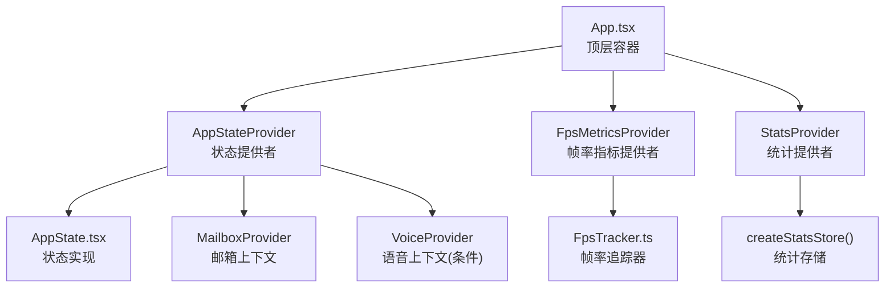
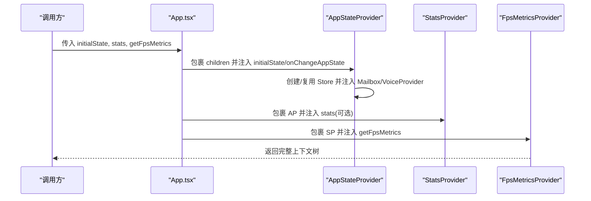
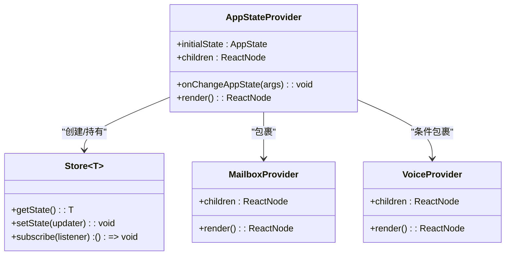
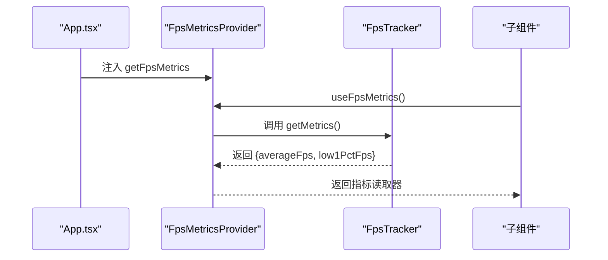
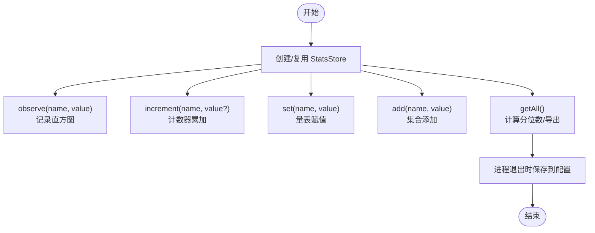
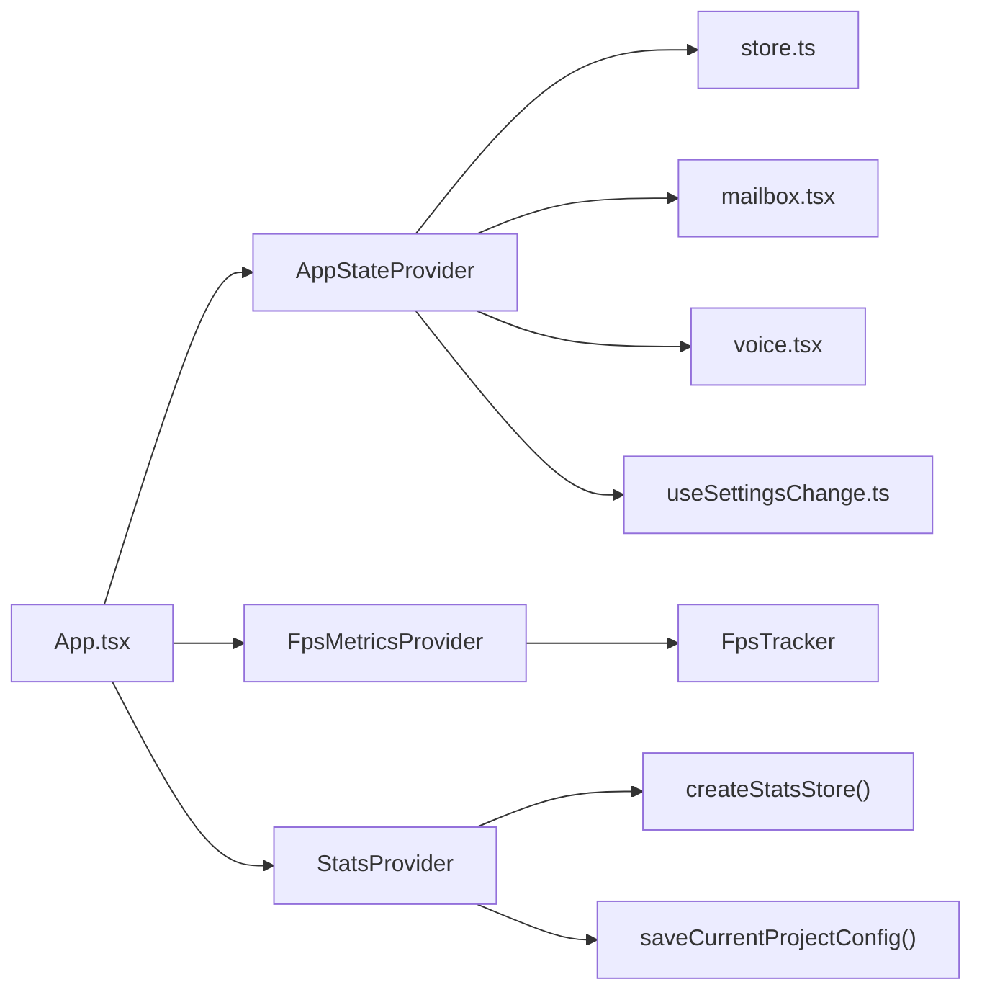

# 应用容器组件

<cite>
**本文档引用的文件**
- [App.tsx](file://src/components/App.tsx)
- [AppState.tsx](file://src/state/AppState.tsx)
- [AppStateStore.ts](file://src/state/AppStateStore.ts)
- [fpsMetrics.tsx](file://src/context/fpsMetrics.tsx)
- [stats.tsx](file://src/context/stats.tsx)
- [fpsTracker.ts](file://src/utils/fpsTracker.ts)
- [mailbox.tsx](file://src/context/mailbox.tsx)
- [voice.tsx](file://src/context/voice.tsx)
- [useSettingsChange.ts](file://src/hooks/useSettingsChange.ts)
- [store.ts](file://src/state/store.ts)
- [replLauncher.tsx](file://src/replLauncher.tsx)
- [main.tsx](file://src/main.tsx)
</cite>

## 目录
1. [简介](#简介)
2. [项目结构](#项目结构)
3. [核心组件](#核心组件)
4. [架构总览](#架构总览)
5. [详细组件分析](#详细组件分析)
6. [依赖关系分析](#依赖关系分析)
7. [性能考虑](#性能考虑)
8. [故障排除指南](#故障排除指南)
9. [结论](#结论)
10. [附录](#附录)

## 简介
本文件系统性解析应用容器组件 App 的设计与实现，重点覆盖以下方面：
- App.tsx 作为顶层包装器的设计理念与渲染流程
- AppStateProvider 如何提供全局应用状态上下文与订阅机制
- FpsMetricsProvider 与 StatsProvider 的性能监控与统计能力
- 组件初始化、状态管理与上下文传递机制
- 使用示例、最佳实践、性能优化建议与故障排除

## 项目结构
App.tsx 位于组件层，负责将全局状态、性能指标与统计上下文注入到组件树中；其内部组合了 AppStateProvider（状态）、FpsMetricsProvider（帧率指标）与 StatsProvider（统计）三个关键上下文提供者。

图表来源
- [App.tsx:19-55](file://src/components/App.tsx#L19-L55)
- [AppState.tsx:37-110](file://src/state/AppState.tsx#L37-L110)
- [fpsMetrics.tsx:10-26](file://src/context/fpsMetrics.tsx#L10-L26)
- [stats.tsx:104-156](file://src/context/stats.tsx#L104-L156)
- [fpsTracker.ts:6-47](file://src/utils/fpsTracker.ts#L6-L47)
- [mailbox.tsx:8-30](file://src/context/mailbox.tsx#L8-L30)
- [voice.tsx:23-39](file://src/context/voice.tsx#L23-L39)

章节来源
- [App.tsx:1-56](file://src/components/App.tsx#L1-L56)
- [AppState.tsx:1-200](file://src/state/AppState.tsx#L1-L200)
- [stats.tsx:1-220](file://src/context/stats.tsx#L1-L220)
- [fpsMetrics.tsx:1-30](file://src/context/fpsMetrics.tsx#L1-L30)
- [fpsTracker.ts:1-48](file://src/utils/fpsTracker.ts#L1-L48)
- [mailbox.tsx:1-38](file://src/context/mailbox.tsx#L1-L38)
- [voice.tsx:1-88](file://src/context/voice.tsx#L1-L88)

## 核心组件
- App 容器：聚合状态、性能与统计上下文，向子组件树提供统一入口。
- AppStateProvider：基于自定义 Store 实现的状态提供者，支持订阅与外部设置变更同步。
- FpsMetricsProvider：通过 FpsTracker 提供帧率指标读取器。
- StatsProvider：提供统计存储与会话级指标持久化能力。

章节来源
- [App.tsx:19-55](file://src/components/App.tsx#L19-L55)
- [AppState.tsx:37-110](file://src/state/AppState.tsx#L37-L110)
- [stats.tsx:104-156](file://src/context/stats.tsx#L104-L156)
- [fpsMetrics.tsx:10-26](file://src/context/fpsMetrics.tsx#L10-L26)

## 架构总览
App.tsx 将三个上下文提供者按顺序嵌套，形成“状态 → 统计 → 帧率”的层次化上下文链路。子组件可通过对应的 hooks 获取所需能力。

图表来源
- [App.tsx:19-55](file://src/components/App.tsx#L19-L55)
- [AppState.tsx:37-110](file://src/state/AppState.tsx#L37-L110)
- [stats.tsx:104-156](file://src/context/stats.tsx#L104-L156)
- [fpsMetrics.tsx:10-26](file://src/context/fpsMetrics.tsx#L10-L26)

## 详细组件分析

### App.tsx：顶层容器与上下文装配
- 设计目标：为交互式会话提供统一的顶层包装，集中注入状态、统计与帧率上下文。
- 关键点：
  - 接收 initialState、stats、getFpsMetrics 与 children。
  - 通过三重 Provider 嵌套，确保上下文顺序与作用域正确。
  - 使用记忆化策略避免不必要的重渲染（内部使用 React 编译器缓存标记）。

章节来源
- [App.tsx:1-56](file://src/components/App.tsx#L1-L56)

### AppStateProvider：全局应用状态上下文
- 职责：
  - 创建并持有应用状态 Store（初始状态来自 getDefaultAppState 或传入 initialState）。
  - 注入 MailboxProvider 与 VoiceProvider（条件加载），为消息队列与语音功能提供上下文。
  - 订阅设置变更，通过 applySettingsChange 同步权限规则与钩子配置。
  - 防止重复嵌套（HasAppStateContext 检测）。
- 状态订阅：
  - useAppState(selector) 基于 useSyncExternalStore 订阅状态切片，仅在选择值变化时重渲染。
  - useSetAppState 返回稳定引用，避免因状态更新导致的额外重渲染。
- 设置变更同步：
  - useSettingsChange 订阅设置变更检测器，触发 applySettingsChange，保证权限规则与钩子配置同步。

图表来源
- [AppState.tsx:37-110](file://src/state/AppState.tsx#L37-L110)
- [store.ts:10-35](file://src/state/store.ts#L10-L35)
- [mailbox.tsx:8-30](file://src/context/mailbox.tsx#L8-L30)
- [voice.tsx:23-39](file://src/context/voice.tsx#L23-L39)

章节来源
- [AppState.tsx:1-200](file://src/state/AppState.tsx#L1-L200)
- [store.ts:1-35](file://src/state/store.ts#L1-L35)
- [mailbox.tsx:1-38](file://src/context/mailbox.tsx#L1-L38)
- [voice.tsx:1-88](file://src/context/voice.tsx#L1-L88)
- [useSettingsChange.ts:1-26](file://src/hooks/useSettingsChange.ts#L1-L26)

### FpsMetricsProvider：帧率性能监控
- 能力：
  - 通过 FpsTracker 记录帧耗时并计算平均帧率与低百分位帧率。
  - 提供 useFpsMetrics hook 以在组件树中读取当前帧率指标。
- 数据流：
  - getFpsMetrics 由上层传入，App.tsx 将其注入到 FpsMetricsProvider。
  - 子组件通过 useFpsMetrics 获取指标读取器，用于 UI 展示或诊断。

图表来源
- [fpsMetrics.tsx:10-29](file://src/context/fpsMetrics.tsx#L10-L29)
- [fpsTracker.ts:6-47](file://src/utils/fpsTracker.ts#L6-L47)
- [App.tsx:46-54](file://src/components/App.tsx#L46-L54)

章节来源
- [fpsMetrics.tsx:1-30](file://src/context/fpsMetrics.tsx#L1-L30)
- [fpsTracker.ts:1-48](file://src/utils/fpsTracker.ts#L1-L48)
- [App.tsx:1-56](file://src/components/App.tsx#L1-L56)

### StatsProvider：统计与指标持久化
- 能力：
  - 提供 createStatsStore，支持计数器、量表、直方图与集合等多类型指标。
  - 支持观察数值分布（分位数）、集合去重计数与全量导出。
  - 在进程退出时自动保存最近会话指标到项目配置。
- 使用方式：
  - useCounter/useGauge/useTimer/useSet 提供便捷 hook。
  - useStats 获取底层统计存储实例。

图表来源
- [stats.tsx:28-98](file://src/context/stats.tsx#L28-L98)
- [stats.tsx:104-156](file://src/context/stats.tsx#L104-L156)

章节来源
- [stats.tsx:1-220](file://src/context/stats.tsx#L1-L220)

### 初始化与上下文传递机制
- 入口与装配：
  - REPL 启动器通过 launchRepl 动态导入 App，并将 initialState、stats、getFpsMetrics 传入。
  - main.tsx 中完成大量启动前置工作后，最终进入 REPL 渲染流程。
- 上下文传递：
  - App.tsx 通过 Provider 嵌套确保上下文从外到内依次生效。
  - 子组件通过对应 hooks 访问状态、统计或帧率指标。

章节来源
- [replLauncher.tsx:12-22](file://src/replLauncher.tsx#L12-L22)
- [main.tsx:1-200](file://src/main.tsx#L1-L200)

## 依赖关系分析
- App.tsx 依赖：
  - AppStateProvider（状态）
  - FpsMetricsProvider（帧率）
  - StatsProvider（统计）
- AppStateProvider 依赖：
  - Store（状态存储）
  - MailboxProvider（消息队列）
  - VoiceProvider（语音，条件）
  - useSettingsChange（设置变更同步）
- StatsProvider 依赖：
  - createStatsStore（统计存储工厂）
  - saveCurrentProjectConfig（持久化）
- FpsMetricsProvider 依赖：
  - FpsTracker（指标计算）

图表来源
- [App.tsx:1-56](file://src/components/App.tsx#L1-L56)
- [AppState.tsx:1-200](file://src/state/AppState.tsx#L1-L200)
- [stats.tsx:1-220](file://src/context/stats.tsx#L1-L220)
- [fpsMetrics.tsx:1-30](file://src/context/fpsMetrics.tsx#L1-L30)
- [fpsTracker.ts:1-48](file://src/utils/fpsTracker.ts#L1-L48)
- [store.ts:1-35](file://src/state/store.ts#L1-L35)
- [useSettingsChange.ts:1-26](file://src/hooks/useSettingsChange.ts#L1-L26)
- [mailbox.tsx:1-38](file://src/context/mailbox.tsx#L1-L38)
- [voice.tsx:1-88](file://src/context/voice.tsx#L1-L88)

章节来源
- [App.tsx:1-56](file://src/components/App.tsx#L1-L56)
- [AppState.tsx:1-200](file://src/state/AppState.tsx#L1-L200)
- [stats.tsx:1-220](file://src/context/stats.tsx#L1-L220)
- [fpsMetrics.tsx:1-30](file://src/context/fpsMetrics.tsx#L1-L30)
- [fpsTracker.ts:1-48](file://src/utils/fpsTracker.ts#L1-L48)
- [store.ts:1-35](file://src/state/store.ts#L1-L35)
- [useSettingsChange.ts:1-26](file://src/hooks/useSettingsChange.ts#L1-L26)
- [mailbox.tsx:1-38](file://src/context/mailbox.tsx#L1-L38)
- [voice.tsx:1-88](file://src/context/voice.tsx#L1-L88)

## 性能考虑
- 渲染优化：
  - App.tsx 内部使用 React 编译器缓存标记，减少重复渲染。
  - AppStateProvider 对 Store 创建与 Provider 包裹进行记忆化处理。
- 订阅与重渲染：
  - useAppState 使用 useSyncExternalStore，仅在选择值变化时触发重渲染。
  - useSetAppState 返回稳定引用，避免因状态更新导致的额外重渲染。
- 统计开销：
  - StatsStore 使用固定容量蓄水池采样与分位数计算，控制内存与 CPU 开销。
  - 进程退出时批量保存指标，避免频繁 IO。
- 帧率监控：
  - FpsTracker 仅在有数据时返回指标，避免空数据场景的误判。

章节来源
- [App.tsx:1-56](file://src/components/App.tsx#L1-L56)
- [AppState.tsx:142-179](file://src/state/AppState.tsx#L142-L179)
- [stats.tsx:28-98](file://src/context/stats.tsx#L28-L98)
- [fpsTracker.ts:20-47](file://src/utils/fpsTracker.ts#L20-L47)

## 故障排除指南
- “AppStateProvider 不能嵌套”错误
  - 现象：在已存在 AppStateProvider 的上下文中再次使用 AppStateProvider。
  - 处理：确保 App.tsx 仅包裹一次状态提供者，避免重复嵌套。
  - 参考：AppStateProvider 内部 HasAppStateContext 检测逻辑。
- “useStats 必须在 StatsProvider 内使用”
  - 现象：未在 StatsProvider 下使用 useStats。
  - 处理：确认 App.tsx 已正确包裹 StatsProvider。
- “useMailbox 必须在 MailboxProvider 内使用”
  - 现象：未在 MailboxProvider 下使用 useMailbox。
  - 处理：确认 AppStateProvider 已包裹 MailboxProvider。
- 设置变更未生效
  - 现象：修改设置后未触发权限或钩子更新。
  - 处理：检查 useSettingsChange 是否正确订阅，applySettingsChange 是否被调用。
- 帧率指标为空
  - 现象：FpsMetrics 为 undefined。
  - 处理：确认 FpsTracker 已记录至少一次帧耗时，且时间窗口有效。

章节来源
- [AppState.tsx:44-47](file://src/state/AppState.tsx#L44-L47)
- [stats.tsx:157-163](file://src/context/stats.tsx#L157-L163)
- [mailbox.tsx:31-37](file://src/context/mailbox.tsx#L31-L37)
- [useSettingsChange.ts:1-26](file://src/hooks/useSettingsChange.ts#L1-L26)
- [fpsTracker.ts:20-32](file://src/utils/fpsTracker.ts#L20-L32)

## 结论
App.tsx 通过三层上下文提供者实现了“状态—统计—性能”的一体化容器设计，配合 AppStateProvider 的订阅机制与记忆化策略，既保证了全局状态的一致性与高效更新，又为性能监控与统计分析提供了开箱即用的能力。合理使用各上下文提供的 hooks，可在不侵入业务逻辑的前提下实现可观测性与可维护性的平衡。

## 附录

### 组件属性与使用示例
- App 属性
  - getFpsMetrics: () => FpsMetrics | undefined
  - stats?: StatsStore
  - initialState: AppState
  - children: React.ReactNode
- 使用示例（REPL 启动器）
  - 通过 launchRepl 动态导入 App，并传入上述属性，再渲染 REPL 子组件。

章节来源
- [App.tsx:8-13](file://src/components/App.tsx#L8-L13)
- [replLauncher.tsx:12-22](file://src/replLauncher.tsx#L12-L22)

### 最佳实践
- 在应用根部仅保留一个 App 容器，避免重复包裹状态提供者。
- 使用 useAppState 的 selector 返回现有对象引用，避免每次返回新对象导致的不必要重渲染。
- 使用 useCounter/useGauge/useTimer/useSet 等 hook 管理指标，避免直接操作底层存储。
- 在需要同步读取最新状态的回调中，使用 useGetVoiceState 等同步读取器，确保一致性。

章节来源
- [AppState.tsx:126-179](file://src/state/AppState.tsx#L126-L179)
- [voice.tsx:85-87](file://src/context/voice.tsx#L85-L87)
- [stats.tsx:164-219](file://src/context/stats.tsx#L164-L219)