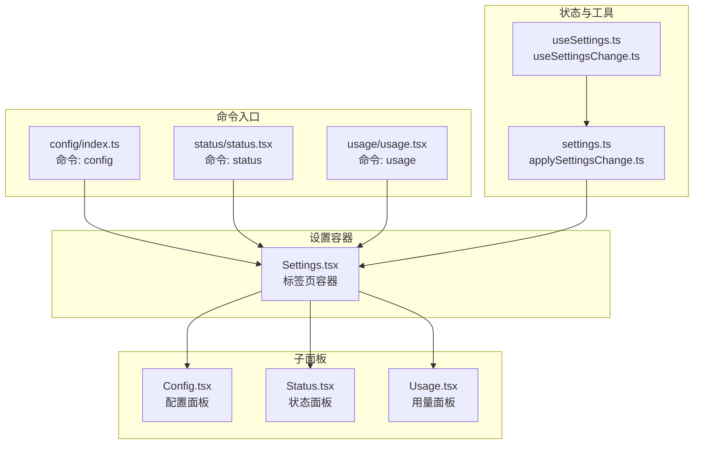
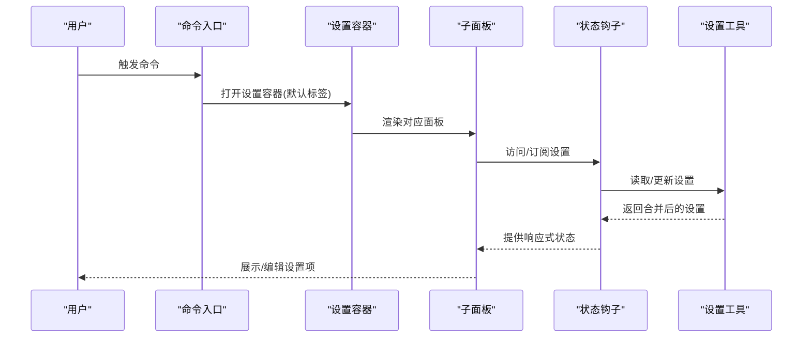
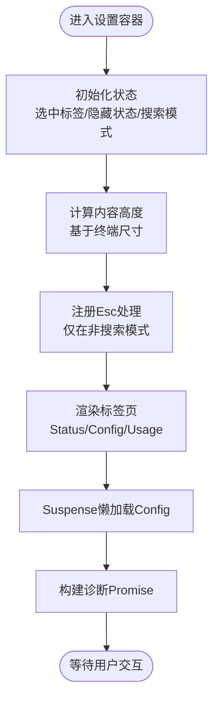
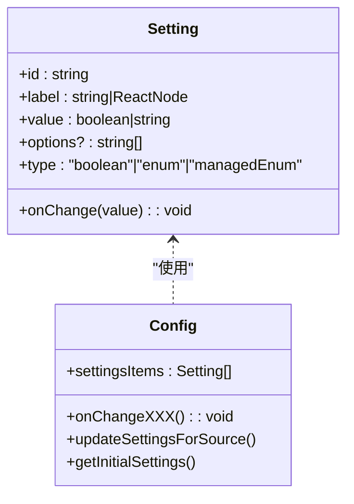
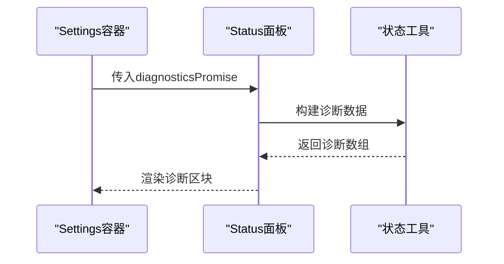
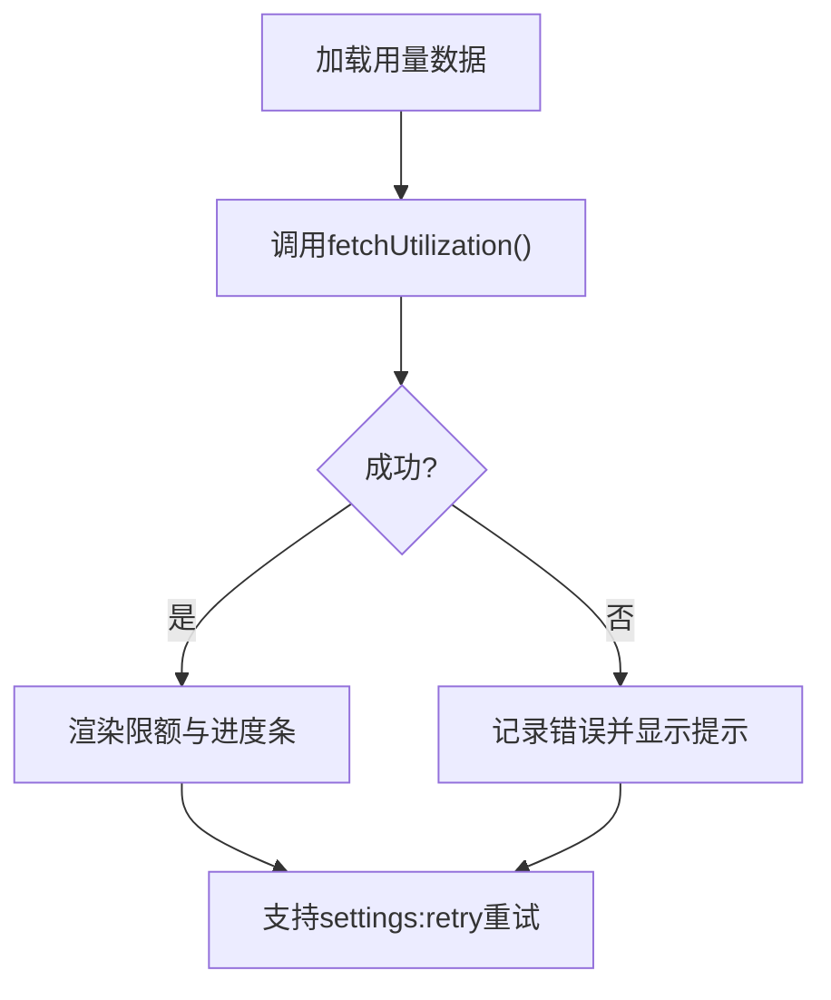
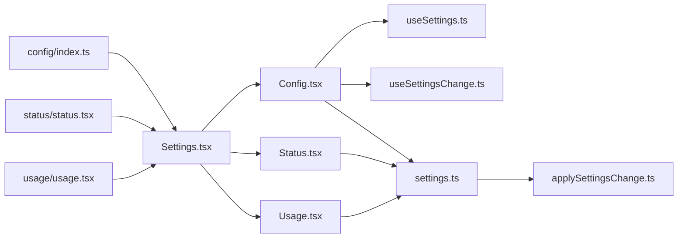

# 设置组件

<cite>
**本文档引用的文件**
- [Settings.tsx](file://src/components/Settings/Settings.tsx)
- [Config.tsx](file://src/components/Settings/Config.tsx)
- [Status.tsx](file://src/components/Settings/Status.tsx)
- [Usage.tsx](file://src/components/Settings/Usage.tsx)
- [useSettings.ts](file://src/hooks/useSettings.ts)
- [useSettingsChange.ts](file://src/hooks/useSettingsChange.ts)
- [applySettingsChange.ts](file://src/utils/settings/applySettingsChange.ts)
- [settings.ts](file://src/utils/settings/settings.ts)
- [config/index.ts](file://src/commands/config/index.ts)
- [status/status.tsx](file://src/commands/status/status.tsx)
- [usage/usage.tsx](file://src/commands/usage/usage.tsx)
</cite>

## 目录
1. [简介](#简介)
2. [项目结构](#项目结构)
3. [核心组件](#核心组件)
4. [架构总览](#架构总览)
5. [详细组件分析](#详细组件分析)
6. [依赖关系分析](#依赖关系分析)
7. [性能考虑](#性能考虑)
8. [故障排除指南](#故障排除指南)
9. [结论](#结论)
10. [附录](#附录)

## 简介
本文件系统性梳理设置组件系统的整体架构与实现细节，覆盖设置界面的组织方式、Config（配置）、Status（状态）与 Usage（用量）三大面板的功能与配置项、数据绑定与验证、持久化机制、响应式设计与主题适配、扩展与自定义配置指南，以及默认值管理、导入导出与批量操作支持等高级能力。

## 项目结构
设置组件系统围绕命令入口、设置面板容器与三个子面板展开，并通过全局状态与设置工具链完成数据流闭环：

- 命令入口：提供打开设置面板的命令别名与上下文封装
- 设置容器：负责标签页切换、键盘快捷键处理、内容高度计算与子面板渲染
- 子面板：
  - Config：用户可交互的配置面板，支持搜索、分组菜单与即时反馈
  - Status：系统诊断信息展示，包含账户、模型、IDE/MCP、沙箱与设置来源等
  - Usage：用量与限额可视化，支持重试与错误提示

**图表来源**
- [Settings.tsx:1-137](file://src/components/Settings/Settings.tsx#L1-137)
- [Config.tsx:1-800](file://src/components/Settings/Config.tsx#L1-800)
- [Status.tsx:1-241](file://src/components/Settings/Status.tsx#L1-241)
- [Usage.tsx:1-377](file://src/components/Settings/Usage.tsx#L1-377)
- [useSettings.ts:1-18](file://src/hooks/useSettings.ts#L1-18)
- [useSettingsChange.ts:1-26](file://src/hooks/useSettingsChange.ts#L1-26)
- [settings.ts:812-868](file://src/utils/settings/settings.ts#L812-868)
- [applySettingsChange.ts:33-92](file://src/utils/settings/applySettingsChange.ts#L33-92)

**章节来源**
- [Settings.tsx:1-137](file://src/components/Settings/Settings.tsx#L1-137)
- [config/index.ts:1-11](file://src/commands/config/index.ts#L1-11)
- [status/status.tsx:1-7](file://src/commands/status/status.tsx#L1-7)
- [usage/usage.tsx:1-7](file://src/commands/usage/usage.tsx#L1-7)

## 核心组件
- 设置容器组件 Settings：负责标签页管理、键盘事件处理（Esc关闭）、内容高度计算、延迟加载子面板与诊断数据构建。
- 配置面板 Config：提供丰富的设置项（布尔、枚举、受管枚举），支持搜索模式、子菜单、变更追踪与即时反馈。
- 状态面板 Status：聚合版本、会话、工作目录、账户、API提供商、IDE/MCP、沙箱与设置来源等信息，并异步加载系统诊断。
- 用量面板 Usage：展示当前会话、周限额与可选的Sonnet限额，支持重试与错误提示；对额外用量进行条件展示与格式化。

**章节来源**
- [Settings.tsx:22-129](file://src/components/Settings/Settings.tsx#L22-129)
- [Config.tsx:85-175](file://src/components/Settings/Config.tsx#L85-175)
- [Status.tsx:102-186](file://src/components/Settings/Status.tsx#L102-186)
- [Usage.tsx:174-264](file://src/components/Settings/Usage.tsx#L174-264)

## 架构总览
设置系统采用“命令入口 → 容器 → 子面板”的层次化结构，配合全局状态钩子与设置工具链实现数据的读取、变更与持久化：

- 命令层：通过本地JSX命令打开设置容器并指定默认标签页
- 容器层：统一处理键盘事件、尺寸计算与子面板渲染
- 工具层：设置读写、合并策略、验证与缓存管理
- 状态层：React Hook提供响应式设置访问与变更监听

**图表来源**
- [config/index.ts:3-8](file://src/commands/config/index.ts#L3-8)
- [status/status.tsx:5-6](file://src/commands/status/status.tsx#L5-6)
- [usage/usage.tsx:4-5](file://src/commands/usage/usage.tsx#L4-5)
- [Settings.tsx:22-129](file://src/components/Settings/Settings.tsx#L22-129)
- [useSettings.ts:15-17](file://src/hooks/useSettings.ts#L15-17)
- [settings.ts:812-868](file://src/utils/settings/settings.ts#L812-868)

## 详细组件分析

### 设置容器组件（Settings）
- 功能要点
  - 标签页管理：根据默认标签页选择初始显示面板
  - 键盘事件：在非搜索模式下拦截Esc以关闭对话框
  - 内容高度：根据终端尺寸动态计算面板高度，避免布局抖动
  - 延迟加载：Config使用Suspense按需加载，减少首屏负担
  - 诊断数据：预构建Status面板的诊断Promise，避免重复请求
- 关键实现
  - 使用useState维护选中标签与隐藏状态
  - 使用useTerminalSize与modal上下文计算内容高度
  - 使用useKeybinding在特定上下文中注册Esc处理
  - 使用Suspense包裹Config以支持异步子树

**图表来源**
- [Settings.tsx:22-129](file://src/components/Settings/Settings.tsx#L22-129)

**章节来源**
- [Settings.tsx:22-129](file://src/components/Settings/Settings.tsx#L22-129)

### 配置面板（Config）
- 数据模型与类型
  - Setting基础类型：布尔、枚举、受管枚举三类
  - 支持自定义搜索与子菜单（如Theme、Model、OutputStyle等）
- 数据绑定与验证
  - 读取：通过getInitialSettings()获取合并后的设置快照
  - 写入：updateSettingsForSource()执行深度合并与数组去重
  - 验证：Zod Schema校验，错误格式化与缓存
- 持久化机制
  - 文件写入：writeFileSyncAndFlush_DEPRECATED()确保落盘
  - 缓存失效：resetSettingsCache()保证后续读取一致性
  - Git忽略：对.local文件自动添加.gitignore规则
- 响应式与主题适配
  - 即时更新：修改后同步更新AppState与本地状态
  - 主题：ThemePicker直接调用useThemeSetting进行切换
- 搜索与导航
  - SearchBox集成useSearchInput，支持Esc退出与光标偏移
  - 顶部变更追踪：记录用户已修改的键值对，便于回滚或提示

**图表来源**
- [Config.tsx:60-83](file://src/components/Settings/Config.tsx#L60-83)
- [Config.tsx:264-799](file://src/components/Settings/Config.tsx#L264-799)
- [settings.ts:416-524](file://src/utils/settings/settings.ts#L416-524)

**章节来源**
- [Config.tsx:60-175](file://src/components/Settings/Config.tsx#L60-175)
- [Config.tsx:264-799](file://src/components/Settings/Config.tsx#L264-799)
- [settings.ts:416-524](file://src/utils/settings/settings.ts#L416-524)

### 状态面板（Status）
- 数据来源
  - 版本、会话名称、会话ID、工作目录、账户与API提供商
  - IDE/MCP连接状态、沙箱配置与设置来源
- 诊断数据
  - 异步构建安装与内存诊断，Status容器内统一加载
- 呈现方式
  - 分区展示：主要信息与次要信息两段属性列表
  - 可折叠：在模态场景下自动调整flexGrow以适配滚动

**图表来源**
- [Status.tsx:54-56](file://src/components/Settings/Status.tsx#L54-56)
- [Status.tsx:102-186](file://src/components/Settings/Status.tsx#L102-186)

**章节来源**
- [Status.tsx:19-56](file://src/components/Settings/Status.tsx#L19-56)
- [Status.tsx:102-186](file://src/components/Settings/Status.tsx#L102-186)

### 用量面板（Usage）
- 数据获取
  - 通过fetchUtilization()异步拉取用量与限额
  - 失败时记录日志并格式化错误消息
- 可视化
  - 进度条展示使用率与剩余时间
  - 条件显示：仅在订阅计划为Max/Team或未知时显示Sonnet限额
- 交互
  - 支持settings:retry快捷键重试
  - Esc关闭提示

**图表来源**
- [Usage.tsx:183-201](file://src/components/Settings/Usage.tsx#L183-201)
- [Usage.tsx:211-229](file://src/components/Settings/Usage.tsx#L211-229)
- [Usage.tsx:247-264](file://src/components/Settings/Usage.tsx#L247-264)

**章节来源**
- [Usage.tsx:174-264](file://src/components/Settings/Usage.tsx#L174-264)

## 依赖关系分析
- 命令到容器
  - config/status/usage命令分别打开Settings并设置默认标签
- 容器到子面板
  - Settings根据defaultTab渲染对应面板，Config使用Suspense延迟加载
- 子面板到状态与工具
  - Config依赖useSettings/useSettingsChange获取与监听设置
  - Config与Status/Usage均依赖settings.ts提供的读写与合并逻辑
- 工具到应用状态
  - applySettingsChange在设置变更时同步更新AppState与权限上下文

**图表来源**
- [config/index.ts:3-8](file://src/commands/config/index.ts#L3-8)
- [status/status.tsx:5-6](file://src/commands/status/status.tsx#L5-6)
- [usage/usage.tsx:4-5](file://src/commands/usage/usage.tsx#L4-5)
- [Settings.tsx:22-129](file://src/components/Settings/Settings.tsx#L22-129)
- [Config.tsx:85-175](file://src/components/Settings/Config.tsx#L85-175)
- [Status.tsx:102-186](file://src/components/Settings/Status.tsx#L102-186)
- [Usage.tsx:174-264](file://src/components/Settings/Usage.tsx#L174-264)
- [useSettings.ts:15-17](file://src/hooks/useSettings.ts#L15-17)
- [useSettingsChange.ts:7-25](file://src/hooks/useSettingsChange.ts#L7-25)
- [settings.ts:812-868](file://src/utils/settings/settings.ts#L812-868)
- [applySettingsChange.ts:33-92](file://src/utils/settings/applySettingsChange.ts#L33-92)

**章节来源**
- [Settings.tsx:22-129](file://src/components/Settings/Settings.tsx#L22-129)
- [settings.ts:812-868](file://src/utils/settings/settings.ts#L812-868)
- [applySettingsChange.ts:33-92](file://src/utils/settings/applySettingsChange.ts#L33-92)

## 性能考虑
- 惰性加载：Config使用Suspense延迟加载，降低首屏渲染压力
- 缓存策略：settings.ts对解析结果与会话缓存进行管理，避免重复磁盘I/O
- 合并与去重：数组合并采用uniq去重，减少无效写入与冲突
- 键盘事件优化：仅在必要上下文注册Esc处理，避免全局监听带来的开销
- 终端尺寸感知：根据rows与modal上下文动态计算高度，减少布局抖动

[本节为通用指导，不涉及具体文件分析]

## 故障排除指南
- 设置读取失败
  - 检查文件是否存在与JSON语法是否正确
  - 若存在语法错误，返回错误而非覆盖原始文件
- 设置写入失败
  - 确认目标目录可写，必要时手动创建
  - 查看日志中的错误信息定位问题
- 设置未生效
  - 确认是否处于受管策略源（policySettings）优先级覆盖
  - 使用getSettingsWithSources()检查合并顺序与来源
- 用量面板加载失败
  - 使用settings:retry快捷键重试
  - 检查网络与认证状态

**章节来源**
- [settings.ts:453-524](file://src/utils/settings/settings.ts#L453-524)
- [Usage.tsx:205-210](file://src/components/Settings/Usage.tsx#L205-210)

## 结论
设置组件系统通过清晰的层次化结构与完善的工具链，实现了从命令入口到面板渲染、从数据读取到持久化的完整闭环。Config面板提供丰富的交互与即时反馈，Status与Usage分别承担诊断与用量展示职责。通过缓存、合并与验证机制，系统在保证一致性的同时兼顾性能与可维护性。

[本节为总结性内容，不涉及具体文件分析]

## 附录

### 默认值管理
- 合并优先级：userSettings → projectSettings → localSettings → policySettings
- 读取策略：getInitialSettings()返回合并后的设置快照
- 会话缓存：getSettingsWithErrors()对整会话生命周期缓存，避免重复I/O
- 受管策略：policySettings采用“首个有内容的源优先”策略，确保管理员策略的权威性

**章节来源**
- [settings.ts:812-868](file://src/utils/settings/settings.ts#L812-868)
- [settings.ts:674-784](file://src/utils/settings/settings.ts#L674-784)

### 导入导出与批量操作
- 导入/导出
  - 通过文件系统读写settings.json及其变体（.local、.claude目录）
  - 支持多源文件合并与去重，便于团队共享配置片段
- 批量操作
  - 数组字段采用合并去重策略，调用方需自行计算最终状态
  - 受管枚举项（如Theme、OutputStyle）通过专用子菜单或组件处理

**章节来源**
- [settings.ts:298-307](file://src/utils/settings/settings.ts#L298-307)
- [settings.ts:529-547](file://src/utils/settings/settings.ts#L529-547)
- [Config.tsx:718-722](file://src/components/Settings/Config.tsx#L718-722)

### 扩展与自定义配置指南
- 新增设置项
  - 在Config.tsx的settingsItems中添加新的Setting条目
  - 对于复杂设置，建议使用子菜单或专用组件（如OutputStylePicker）
- 自定义验证
  - 通过Zod Schema扩展SettingsSchema，确保新增字段的合法性
- 策略源扩展
  - 可在getEnabledSettingSources()中启用新源，遵循现有合并与优先级规则
- 主题与响应式
  - 使用useThemeSetting与useTerminalSize适配不同主题与终端环境

**章节来源**
- [Config.tsx:60-83](file://src/components/Settings/Config.tsx#L60-83)
- [settings.ts:538-547](file://src/utils/settings/settings.ts#L538-547)
- [settings.ts:28-30](file://src/utils/settings/settings.ts#L28-30)