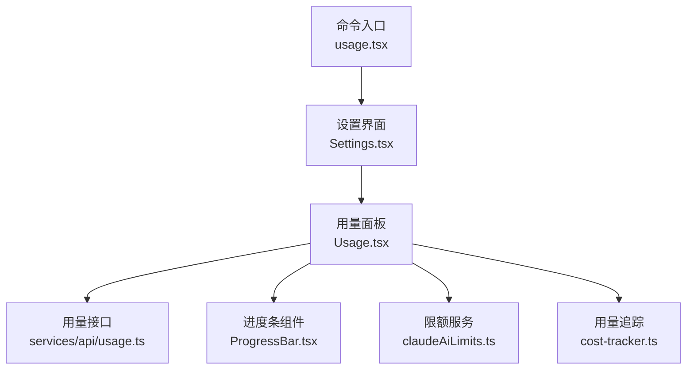
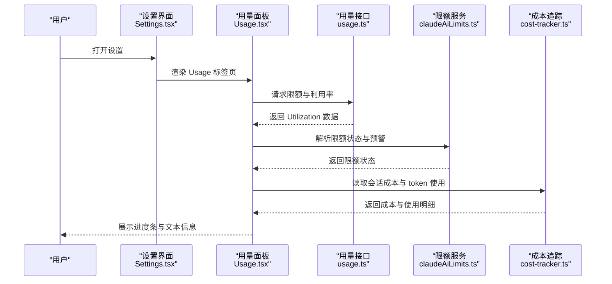
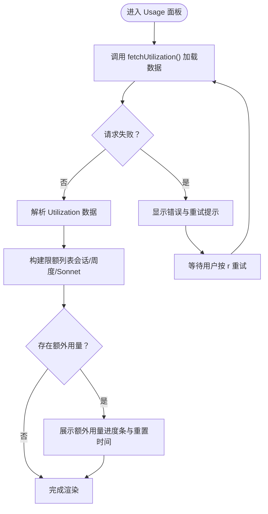
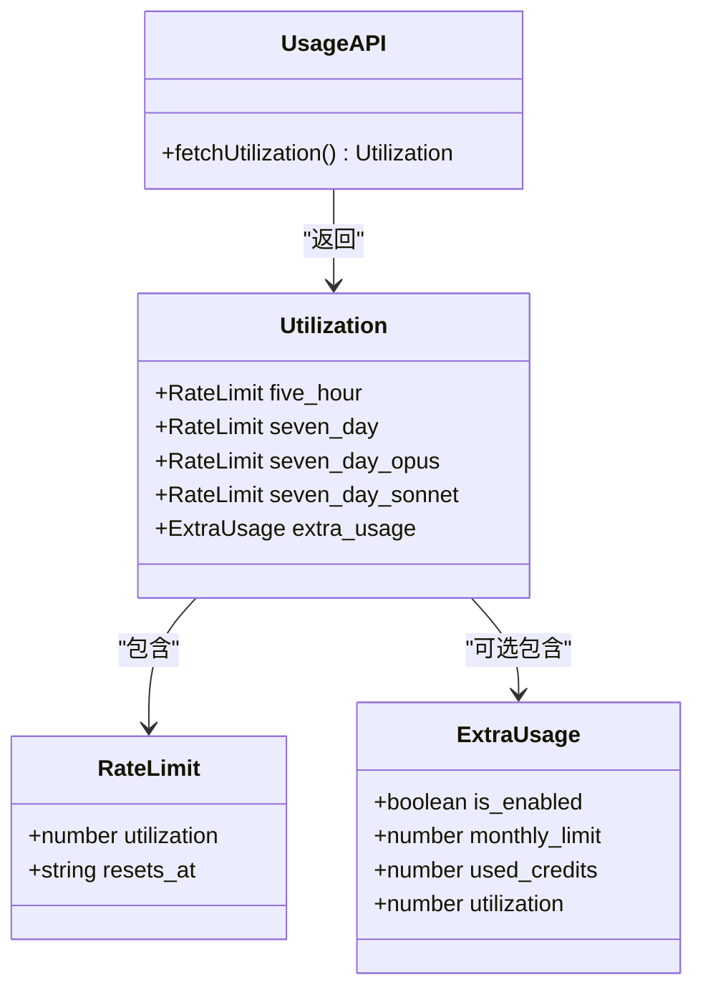
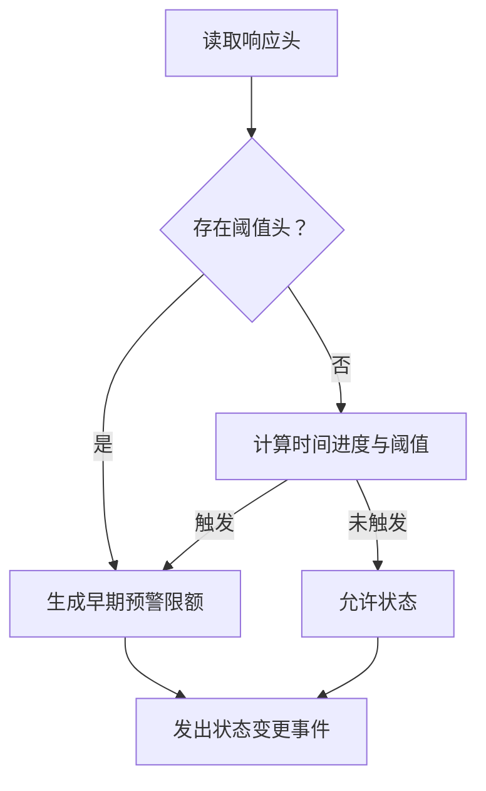
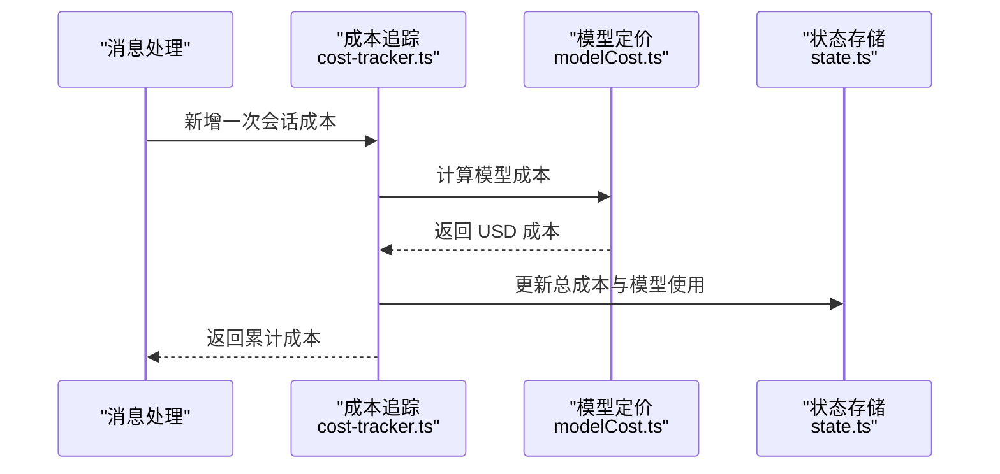
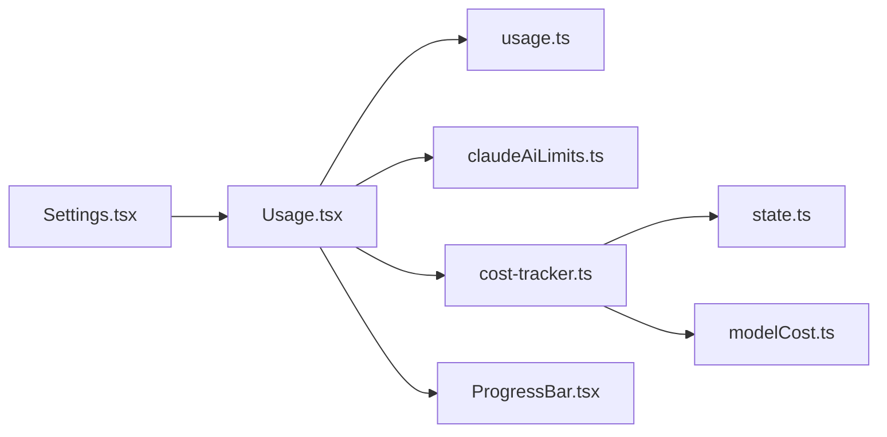

# 用量面板

<cite>
**本文档引用的文件**
- [usage.tsx](file://src/commands/usage/usage.tsx)
- [Settings.tsx](file://src/components/Settings/Settings.tsx)
- [Usage.tsx](file://src/components/Settings/Usage.tsx)
- [usage.ts](file://src/services/api/usage.ts)
- [claudeAiLimits.ts](file://src/services/claudeAiLimits.ts)
- [rateLimitMessages.ts](file://src/services/rateLimitMessages.ts)
- [cost-tracker.ts](file://src/cost-tracker.ts)
- [ProgressBar.tsx](file://src/components/design-system/ProgressBar.tsx)
- [state.ts](file://src/bootstrap/state.ts)
- [modelCost.ts](file://src/utils/modelCost.ts)
- [Stats.tsx](file://src/components/Stats.tsx)
</cite>

## 目录
1. [简介](#简介)
2. [项目结构](#项目结构)
3. [核心组件](#核心组件)
4. [架构总览](#架构总览)
5. [详细组件分析](#详细组件分析)
6. [依赖关系分析](#依赖关系分析)
7. [性能考虑](#性能考虑)
8. [故障排除指南](#故障排除指南)
9. [结论](#结论)
10. [附录](#附录)

## 简介
本文件系统性地解析用量面板组件（Usage Panel）的设计与实现，涵盖以下方面：
- 资源使用统计与计费信息展示：当前会话、周度限额、模型限定限额、额外用量等
- 用量数据的采集、计算与可视化：通过 OAuth 接口获取限额与利用率，前端以进度条直观展示
- 限额监控、预警机制与超限处理：基于响应头的阈值预警、时间相对阈值回退策略、超支时的额外用量提示
- 时间范围、聚合方式与数据精度：按 5 小时窗口与 7 天窗口统计，利用率百分比与重置时间
- 扩展方法与自定义统计维度：如何新增限额类型、如何扩展可视化与交互
- 历史图表、趋势预测与成本分析：现有统计图表与成本追踪能力的集成点

## 项目结构
用量面板位于设置界面的“Usage”标签页中，由命令入口触发，最终渲染为一个终端内可交互的用量展示组件。

图示来源
- [usage.tsx:1-7](file://src/commands/usage/usage.tsx#L1-L7)
- [Settings.tsx:1-137](file://src/components/Settings/Settings.tsx#L1-L137)
- [Usage.tsx:1-377](file://src/components/Settings/Usage.tsx#L1-L377)
- [usage.ts:1-64](file://src/services/api/usage.ts#L1-L64)
- [ProgressBar.tsx:1-86](file://src/components/design-system/ProgressBar.tsx#L1-L86)
- [claudeAiLimits.ts:1-516](file://src/services/claudeAiLimits.ts#L1-L516)
- [cost-tracker.ts:1-324](file://src/cost-tracker.ts#L1-L324)

章节来源
- [usage.tsx:1-7](file://src/commands/usage/usage.tsx#L1-L7)
- [Settings.tsx:1-137](file://src/components/Settings/Settings.tsx#L1-L137)

## 核心组件
- 命令入口：将设置界面切换到“Usage”标签页
- 设置容器：提供标签页切换与内容区域布局
- 用量面板：负责加载限额数据、渲染进度条、显示重置时间与额外用量状态
- 用量接口：封装 OAuth 认证与限额查询
- 进度条组件：用于展示利用率的可视化控件
- 限额服务：提供限额状态、预警与超支处理逻辑
- 成本追踪：记录与汇总会话内的 token 使用与成本

章节来源
- [Usage.tsx:174-265](file://src/components/Settings/Usage.tsx#L174-L265)
- [usage.ts:33-63](file://src/services/api/usage.ts#L33-L63)
- [ProgressBar.tsx:27-85](file://src/components/design-system/ProgressBar.tsx#L27-L85)
- [claudeAiLimits.ts:220-249](file://src/services/claudeAiLimits.ts#L220-L249)
- [cost-tracker.ts:143-175](file://src/cost-tracker.ts#L143-L175)

## 架构总览
用量面板的数据流从用户触发设置中的“Usage”标签开始，经由设置容器加载用量面板组件；用量面板通过用量接口拉取限额与利用率数据，并结合限额服务提供的预警与超支逻辑进行展示；同时，成本追踪模块在会话期间持续累积 token 与成本，供用量面板与统计图表使用。

图示来源
- [Settings.tsx:89-95](file://src/components/Settings/Settings.tsx#L89-L95)
- [Usage.tsx:183-201](file://src/components/Settings/Usage.tsx#L183-L201)
- [usage.ts:33-63](file://src/services/api/usage.ts#L33-L63)
- [claudeAiLimits.ts:454-485](file://src/services/claudeAiLimits.ts#L454-L485)
- [cost-tracker.ts:143-175](file://src/cost-tracker.ts#L143-L175)

## 详细组件分析

### 用量面板组件（Usage）
- 数据加载：首次渲染时调用用量接口，支持错误捕获与重试快捷键
- 可视化：根据可用宽度动态选择长/短模式的进度条布局，展示标题、利用率百分比与重置时间
- 条件展示：仅对订阅计划用户显示用量；根据订阅类型决定是否显示 Sonnet 限额
- 额外用量：当存在额外用量配置时，展示月度消费额度与剩余信用，以及重置时间

图示来源
- [Usage.tsx:174-265](file://src/components/Settings/Usage.tsx#L174-L265)
- [usage.ts:33-63](file://src/services/api/usage.ts#L33-L63)

章节来源
- [Usage.tsx:174-265](file://src/components/Settings/Usage.tsx#L174-L265)

### 用量接口（services/api/usage.ts）
- 类型定义：RateLimit、ExtraUsage、Utilization
- 认证与请求：检查订阅状态与权限范围，生成认证头，调用 OAuth API 获取用量
- 错误处理：拦截 OAuth 过期与认证错误，避免无效请求

图示来源
- [usage.ts:12-31](file://src/services/api/usage.ts#L12-L31)
- [usage.ts:33-63](file://src/services/api/usage.ts#L33-L63)

章节来源
- [usage.ts:1-64](file://src/services/api/usage.ts#L1-L64)

### 限额监控与预警（claudeAiLimits.ts）
- 早期预警：优先检测服务器返回的阈值头；若无，则基于时间相对阈值进行客户端回退判断
- 状态变更：从响应头提取限额状态、重置时间、是否使用额外用量等，并通过事件通知更新
- 错误处理：当出现 429 时，即使无头也标记为拒绝状态

图示来源
- [claudeAiLimits.ts:255-374](file://src/services/claudeAiLimits.ts#L255-L374)
- [claudeAiLimits.ts:454-485](file://src/services/claudeAiLimits.ts#L454-L485)

章节来源
- [claudeAiLimits.ts:1-516](file://src/services/claudeAiLimits.ts#L1-L516)

### 额外用量与超支处理（Usage.tsx + rateLimitMessages.ts）
- 额外用量展示：仅对 Pro/Max 用户显示；若未启用且命令可用，提供启用指引
- 超支提示：当限额被拒绝且存在额外用量允许状态时，提示用户已进入额外用量模式，并显示重置时间

章节来源
- [Usage.tsx:266-376](file://src/components/Settings/Usage.tsx#L266-L376)
- [rateLimitMessages.ts:286-331](file://src/services/rateLimitMessages.ts#L286-L331)

### 成本追踪与统计（cost-tracker.ts + modelCost.ts + state.ts）
- 会话成本：在每次消息后累加输入/输出 token、缓存读写、网络搜索次数与成本
- 模型维度：按模型短名聚合 token 使用与成本，支持快速模式标识
- 会话恢复：从项目配置中恢复上次会话的成本与使用情况
- 定价模型：内置多模型定价表，未知模型使用默认定价并记录事件

图示来源
- [cost-tracker.ts:278-323](file://src/cost-tracker.ts#L278-L323)
- [modelCost.ts:177-180](file://src/utils/modelCost.ts#L177-L180)
- [state.ts:881-916](file://src/bootstrap/state.ts#L881-L916)

章节来源
- [cost-tracker.ts:1-324](file://src/cost-tracker.ts#L1-L324)
- [modelCost.ts:1-232](file://src/utils/modelCost.ts#L1-L232)
- [state.ts:877-916](file://src/bootstrap/state.ts#L877-L916)

### 进度条组件（ProgressBar.tsx）
- 利用率可视化：根据 ratio 与宽度绘制带填充/空闲段的进度条
- 主题适配：支持通过主题键设置填充与空闲颜色

章节来源
- [ProgressBar.tsx:1-86](file://src/components/design-system/ProgressBar.tsx#L1-L86)

### 统计图表与成本分析（Stats.tsx）
- 图表类型：活动热力图、模型 token 趋势图（asciichart）
- 时间范围：支持最近 7 天、30 天与全量天数，自动缩放数据长度
- 成本分析：结合成本追踪模块的 token 使用与成本，生成可视化报告

章节来源
- [Stats.tsx:417-1020](file://src/components/Stats.tsx#L417-L1020)
- [Stats.tsx:945-1018](file://src/components/Stats.tsx#L945-L1018)

## 依赖关系分析
- 用量面板依赖用量接口获取限额数据，依赖限额服务进行状态解析与预警，依赖成本追踪提供会话成本与 token 使用
- 设置容器负责路由与标签页切换，用量面板内部再组织子组件与数据流
- 进度条组件作为通用 UI 组件被用量面板复用

图示来源
- [Settings.tsx:89-95](file://src/components/Settings/Settings.tsx#L89-L95)
- [Usage.tsx:1-377](file://src/components/Settings/Usage.tsx#L1-L377)
- [usage.ts:1-64](file://src/services/api/usage.ts#L1-L64)
- [claudeAiLimits.ts:1-516](file://src/services/claudeAiLimits.ts#L1-L516)
- [cost-tracker.ts:1-324](file://src/cost-tracker.ts#L1-L324)
- [ProgressBar.tsx:1-86](file://src/components/design-system/ProgressBar.tsx#L1-L86)
- [state.ts:877-916](file://src/bootstrap/state.ts#L877-L916)
- [modelCost.ts:1-232](file://src/utils/modelCost.ts#L1-L232)

## 性能考虑
- 请求节流：非必要流量限制下跳过限额检查，减少网络开销
- 本地缓存：限额状态与额外用量禁用原因在全局配置中缓存，避免重复计算
- 渲染优化：进度条组件使用记忆化与最小化重渲染，按可用宽度动态调整布局
- 数据聚合：成本追踪按模型短名聚合，降低存储与计算复杂度

## 故障排除指南
- 无法加载用量数据
  - 检查订阅状态与权限范围；确认 OAuth 令牌有效
  - 使用设置界面的重试快捷键重新加载
- 限额状态异常
  - 若出现 429 错误，系统会强制标记为拒绝状态；检查网络与配额
  - 关注早期预警提示，合理安排使用节奏
- 额外用量不可用
  - 确认账户具备额外用量权限；查看禁用原因缓存
  - 在支持的订阅类型下启用额外用量命令

章节来源
- [usage.ts:33-63](file://src/services/api/usage.ts#L33-L63)
- [claudeAiLimits.ts:487-515](file://src/services/claudeAiLimits.ts#L487-L515)
- [Usage.tsx:205-210](file://src/components/Settings/Usage.tsx#L205-L210)

## 结论
用量面板通过清晰的组件分层与稳健的数据流设计，实现了对限额、利用率与成本的统一展示。其预警机制与超支处理逻辑确保用户在接近或超出限额时获得及时反馈；成本追踪与统计图表则为长期使用分析提供了基础。未来可在限额类型、可视化维度与趋势预测方面继续扩展。

## 附录

### 用量统计的时间范围与聚合方式
- 时间范围：5 小时窗口与 7 天窗口
- 聚合方式：按模型短名聚合 token 使用与成本
- 数据精度：利用率以百分比形式展示，重置时间采用 ISO 8601 字符串

章节来源
- [usage.ts:12-31](file://src/services/api/usage.ts#L12-L31)
- [cost-tracker.ts:181-226](file://src/cost-tracker.ts#L181-L226)

### 扩展方法与自定义统计维度
- 新增限额类型：在限额服务中扩展类型枚举与显示名称映射，并在用量面板中增加对应条目
- 自定义统计维度：在成本追踪模块中扩展模型使用结构与聚合逻辑，配合统计图表组件进行可视化

章节来源
- [claudeAiLimits.ts:29-89](file://src/services/claudeAiLimits.ts#L29-L89)
- [cost-tracker.ts:250-276](file://src/cost-tracker.ts#L250-L276)