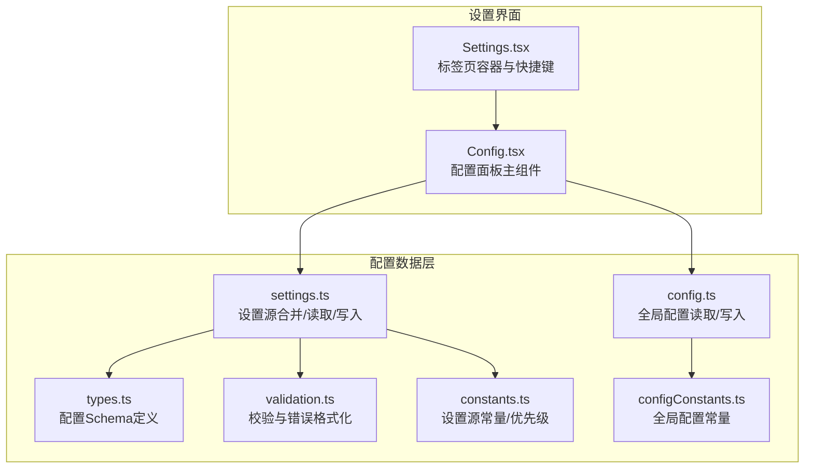
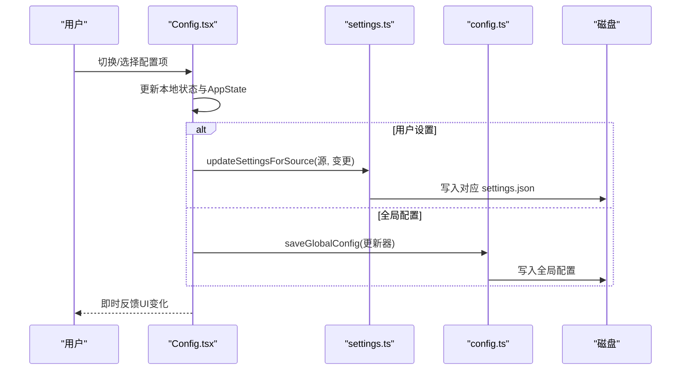
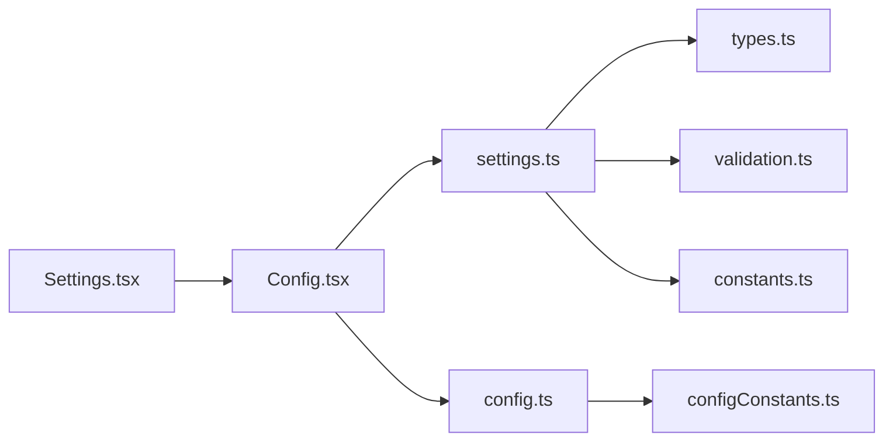

# 配置面板

<cite>
**本文档引用的文件**
- [Config.tsx](file://src/components/Settings/Config.tsx)
- [Settings.tsx](file://src/components/Settings/Settings.tsx)
- [settings.ts](file://src/utils/settings/settings.ts)
- [config.ts](file://src/utils/config.ts)
- [configConstants.ts](file://src/utils/configConstants.ts)
- [constants.ts](file://src/utils/settings/constants.ts)
- [validation.ts](file://src/utils/settings/validation.ts)
- [types.ts](file://src/utils/settings/types.ts)
</cite>

## 目录
1. [简介](#简介)
2. [项目结构](#项目结构)
3. [核心组件](#核心组件)
4. [架构总览](#架构总览)
5. [详细组件分析](#详细组件分析)
6. [依赖关系分析](#依赖关系分析)
7. [性能考虑](#性能考虑)
8. [故障排除指南](#故障排除指南)
9. [结论](#结论)
10. [附录](#附录)

## 简介
本文件系统性地解析配置面板组件（Config）的功能架构与配置管理机制，涵盖配置项分类、验证规则、持久化存储、交互设计、搜索过滤与分组显示、动态加载与热重载、回滚机制、扩展与自定义配置项添加、导入导出与批量修改、配置模板管理等。目标是帮助开发者与高级用户理解配置系统的全貌，并提供可操作的实践指南。

## 项目结构
配置面板位于设置界面的“Config”标签页中，由 Settings.tsx 管理标签页切换与生命周期，Config.tsx 实现具体的配置项渲染、交互与变更处理；底层配置数据通过 settings.ts 提供的设置源合并与写入能力进行持久化；config.ts 提供全局配置的读取与写入；validation.ts 与 types.ts 定义了严格的配置校验与类型约束。

**图表来源**
- [Settings.tsx:1-137](file://src/components/Settings/Settings.tsx#L1-137)
- [Config.tsx:1-1822](file://src/components/Settings/Config.tsx#L1-1822)
- [settings.ts:1-1016](file://src/utils/settings/settings.ts#L1-1016)
- [config.ts:1-1818](file://src/utils/config.ts#L1-1818)
- [types.ts:1-1149](file://src/utils/settings/types.ts#L1-1149)
- [validation.ts:1-266](file://src/utils/settings/validation.ts#L1-266)
- [constants.ts:1-203](file://src/utils/settings/constants.ts#L1-203)
- [configConstants.ts:1-22](file://src/utils/configConstants.ts#L1-22)

**章节来源**
- [Settings.tsx:1-137](file://src/components/Settings/Settings.tsx#L1-137)
- [Config.tsx:1-1822](file://src/components/Settings/Config.tsx#L1-1822)

## 核心组件
- 设置容器（Settings.tsx）
  - 负责标签页管理、快捷键绑定、内容高度计算与子组件挂载。
  - 通过 onIsSearchModeChange 将搜索模式状态传递给 Config，协调 Esc 处理。
- 配置面板（Config.tsx）
  - 定义 Setting 类型与 SettingItem 列表，支持 boolean、enum、managedEnum 三类配置项。
  - 实现搜索过滤、键盘导航、子菜单（主题、模型、输出样式、语言等）弹出交互。
  - 支持即时应用到 AppState 与持久化到磁盘的双写策略。
  - 提供撤销（Escape）与保存（Enter）两种退出路径，带变更汇总反馈。
- 设置工具（settings.ts）
  - 定义设置源优先级与启用列表，提供 getSettingsForSource、updateSettingsForSource 等核心 API。
  - 使用 Zod Schema 进行严格校验，支持数组合并去重、删除键使用 undefined 等约定。
  - 缓存与失效策略确保多源合并的一致性与性能。
- 全局配置工具（config.ts）
  - 定义 GlobalConfig 结构与默认值，提供 saveGlobalConfig/getGlobalConfig 等读写接口。
  - 维护全局配置键集合与类型守卫，保障配置项的类型安全。
- 验证与类型（validation.ts、types.ts）
  - 格式化 Zod 错误为人类可读的 ValidationError，提供字段路径、期望值、建议与文档链接。
  - SettingsSchema 定义完整配置结构，支持向后兼容与 .passthrough() 保留未知字段。
- 常量与优先级（constants.ts、configConstants.ts）
  - SettingSource 源顺序与显示名称，EditableSettingSource 可编辑源集合。
  - 全局配置常量（通知通道、编辑器模式、队友模式等）。

**章节来源**
- [Config.tsx:60-85](file://src/components/Settings/Config.tsx#L60-85)
- [settings.ts:319-368](file://src/utils/settings/settings.ts#L319-368)
- [config.ts:183-578](file://src/utils/config.ts#L183-578)
- [validation.ts:48-77](file://src/utils/settings/validation.ts#L48-77)
- [types.ts:255-800](file://src/utils/settings/types.ts#L255-800)
- [constants.ts:7-22](file://src/utils/settings/constants.ts#L7-22)
- [configConstants.ts:4-22](file://src/utils/configConstants.ts#L4-22)

## 架构总览
配置面板采用“视图-状态-持久化”的分层架构：
- 视图层：Config.tsx 渲染 SettingItem 列表，处理键盘事件与子菜单。
- 状态层：React 状态与 AppStateStore 同步，即时反映 UI 变更。
- 持久化层：settings.ts 与 config.ts 分别负责用户设置与全局配置的读写，遵循“先内存后磁盘”的写入策略以提升交互体验。

**图表来源**
- [Config.tsx:232-261](file://src/components/Settings/Config.tsx#L232-261)
- [settings.ts:416-524](file://src/utils/settings/settings.ts#L416-524)
- [config.ts:797-800](file://src/utils/config.ts#L797-800)

## 详细组件分析

### 配置项分类与类型系统
- Setting 类型
  - boolean：布尔开关，如“显示提示”、“减少动画”、“思维模式”等。
  - enum：下拉枚举，如“默认权限模式”、“通知通道”、“编辑器模式”等。
  - managedEnum：由子菜单处理的复杂枚举，如“主题”、“模型”、“输出样式”、“语言”等。
- SettingItem 结构
  - 包含 id、label、value、onChange、type，以及可选的 searchText 用于搜索匹配。
- 条件展示
  - 基于特性开关、环境变量、终端能力、IDE 连接状态等条件动态增删配置项。

**章节来源**
- [Config.tsx:60-85](file://src/components/Settings/Config.tsx#L60-85)
- [Config.tsx:264-1045](file://src/components/Settings/Config.tsx#L264-1045)

### 验证规则与错误处理
- Schema 校验
  - 使用 Zod 对 settings.json 进行严格校验，支持 unrecognized_keys、invalid_type、invalid_value、too_small 等场景。
- 错误格式化
  - formatZodError 将 ZodError 转换为包含 file、path、message、expected、invalidValue、suggestion、docLink 的结构化错误。
- 权限规则过滤
  - filterInvalidPermissionRules 在 schema 校验前过滤无效权限规则，避免单条规则导致整份文件被拒绝。
- 文件级容错
  - parseSettingsFile 对空文件、语法错误、缺失文件等进行稳健处理，返回空或警告。

**章节来源**
- [validation.ts:97-173](file://src/utils/settings/validation.ts#L97-173)
- [validation.ts:224-265](file://src/utils/settings/validation.ts#L224-265)
- [settings.ts:178-231](file://src/utils/settings/settings.ts#L178-231)

### 持久化存储与写入策略
- 设置源优先级
  - userSettings → projectSettings → localSettings → flagSettings → policySettings（policySettings 采用“首个有内容的源优先”策略）。
- 写入行为
  - updateSettingsForSource 使用 mergeWith 自定义合并逻辑：数组替换、undefined 删除、对象递归合并。
  - 写入前创建目录、标记内部写入、刷新缓存、必要时异步将 localSettings 加入 .gitignore。
- 全局配置
  - saveGlobalConfig 通过回调函数生成新配置，避免竞态；对测试环境有特殊分支。

**章节来源**
- [constants.ts:7-22](file://src/utils/settings/constants.ts#L7-22)
- [settings.ts:416-524](file://src/utils/settings/settings.ts#L416-524)
- [settings.ts:674-796](file://src/utils/settings/settings.ts#L674-796)
- [config.ts:797-800](file://src/utils/config.ts#L797-800)

### 交互设计：搜索、过滤与分组
- 搜索与过滤
  - 支持在列表顶部输入关键字，按 id 或 searchText（label 的扩展文本）进行大小写不敏感匹配。
  - 过滤后自动调整选中索引与滚动偏移，保证可见性。
- 键盘导航
  - 上/下/滚轮：在列表内移动；左/右/Tab：在当前项内循环切换枚举值；Enter：确认/打开子菜单；Esc：取消或关闭子菜单。
  - 搜索模式下 Esc 清空并退出搜索；Enter/↓ 移动到列表。
- 子菜单与弹窗
  - 主题、模型、输出样式、语言、外部 Includes、频道降级、启用自动更新等通过子菜单或对话框完成复杂选择。
- 分组显示
  - 配置项按功能分组（全局设置、权限、通知、输出、IDE 集成、远程控制等），通过条件渲染与特性开关组织。

**章节来源**
- [Config.tsx:1047-1072](file://src/components/Settings/Config.tsx#L1047-1072)
- [Config.tsx:1368-1448](file://src/components/Settings/Config.tsx#L1368-1448)
- [Config.tsx:1450-1599](file://src/components/Settings/Config.tsx#L1450-1599)

### 动态加载、热重载与回滚
- 动态加载
  - getSettingsForSource/getSettingsForSourceUncached 从各源读取并合并；loadManagedFileSettings 支持 managed-settings.json 与 drop-in 文件。
- 热重载
  - 内部写入标记（markInternalWrite）与缓存重置（resetSettingsCache）确保变更生效且避免脏读。
- 回滚机制
  - 挂载时快照 AppState、Theme、Settings、UserMsgOptIn 等；Esc 时按快照逐一恢复，确保一致性。
  - isDirty 标记仅在真正发生用户可见变更时才触发磁盘写入，避免无谓 IO。

**章节来源**
- [settings.ts:319-368](file://src/utils/settings/settings.ts#L319-368)
- [settings.ts:416-524](file://src/utils/settings/settings.ts#L416-524)
- [settings.ts:645-796](file://src/utils/settings/settings.ts#L645-796)
- [Config.tsx:1179-1250](file://src/components/Settings/Config.tsx#L1179-1250)

### 扩展与自定义配置项添加
- 新增 SettingItem
  - 在 settingsItems 中添加新的 Setting 定义，指定 id、label、value、onChange、type 与 options（如为 enum）。
  - 如需复杂 UI，使用 managedEnum 并在子菜单中处理（参考主题、模型、输出样式、语言）。
- 新增设置源
  - 在 SETTING_SOURCES 中注册新源，确保 getEnabledSettingSources 返回包含该源。
  - 提供 getSettingsFilePathForSource 与 getSettingsForSource 的适配。
- 新增 Schema 字段
  - 在 SettingsSchema 中添加字段定义，保持向后兼容；为可选字段使用 .optional()。
  - 如涉及数组合并，确保自定义合并器 settingsMergeCustomizer 正确处理。
- 新增全局配置键
  - 在 GlobalConfig 接口中声明键名与默认值，在 DEFAULT_GLOBAL_CONFIG 初始化。
  - 在 GLOBAL_CONFIG_KEYS 中登记，便于统一校验与日志。

**章节来源**
- [Config.tsx:264-1045](file://src/components/Settings/Config.tsx#L264-1045)
- [constants.ts:7-22](file://src/utils/settings/constants.ts#L7-22)
- [types.ts:255-800](file://src/utils/settings/types.ts#L255-800)
- [config.ts:585-625](file://src/utils/config.ts#L585-625)
- [config.ts:627-666](file://src/utils/config.ts#L627-666)

### 导入导出、批量修改与模板管理
- 导入/导出
  - 通过 updateSettingsForSource 将变更写入 userSettings/projectSettings/localSettings；读取使用 getSettingsForSource。
  - 支持将 settings.json 作为模板在不同项目间迁移，注意字段向后兼容性。
- 批量修改
  - 通过 mergeWith 的自定义合并器实现数组合并与去重；删除键使用 undefined。
  - 在 UI 中可设计“批量勾选”与“一键应用”，结合 onChange 批量调用。
- 模板管理
  - managed-settings.json 与 drop-in 文件提供企业级模板分发；支持多文件按字母序合并。
  - 通过 getManagedSettingsFilePath 与 getManagedSettingsDropInDir 获取路径，loadManagedFileSettings 合并。

**章节来源**
- [settings.ts:74-121](file://src/utils/settings/settings.ts#L74-121)
- [settings.ts:416-524](file://src/utils/settings/settings.ts#L416-524)
- [settings.ts:674-796](file://src/utils/settings/settings.ts#L674-796)

## 依赖关系分析
配置面板的依赖关系清晰，遵循“视图-状态-持久化”分层：

**图表来源**
- [Config.tsx:1-1822](file://src/components/Settings/Config.tsx#L1-1822)
- [settings.ts:1-1016](file://src/utils/settings/settings.ts#L1-1016)
- [config.ts:1-1818](file://src/utils/config.ts#L1-1818)
- [types.ts:1-1149](file://src/utils/settings/types.ts#L1-1149)
- [validation.ts:1-266](file://src/utils/settings/validation.ts#L1-266)
- [constants.ts:1-203](file://src/utils/settings/constants.ts#L1-203)
- [configConstants.ts:1-22](file://src/utils/configConstants.ts#L1-22)
- [Settings.tsx:1-137](file://src/components/Settings/Settings.tsx#L1-137)

**章节来源**
- [Config.tsx:1-1822](file://src/components/Settings/Config.tsx#L1-1822)
- [settings.ts:1-1016](file://src/utils/settings/settings.ts#L1-1016)
- [config.ts:1-1818](file://src/utils/config.ts#L1-1818)

## 性能考虑
- 渲染性能
  - 列表分页与固定可见行数（paneCap）减少重排；滚动窗口根据终端尺寸动态计算。
  - 过滤与滚动偏移同步调整，避免闪烁。
- 读写性能
  - settings.ts 使用缓存与会话缓存，写入后重置缓存，避免重复解析。
  - 写入采用原子写入与 flush，减少中断风险。
- 校验性能
  - Zod 校验在文件读取后进行，错误格式化与提示生成尽量轻量。
- 内存占用
  - 快照仅在挂载时生成，避免持续复制大对象。
  - 通过 isDirty 控制是否触发磁盘写入，降低 IO 压力。

[本节为通用指导，无需特定文件分析]

## 故障排除指南
- 配置文件损坏或 JSON 语法错误
  - parseSettingsFile 对空文件与语法错误进行稳健处理；updateSettingsForSource 在 JSON 语法错误时返回错误而非覆盖。
  - 建议使用 validateSettingsFileContent 在编辑时预检。
- 权限规则无效
  - filterInvalidPermissionRules 会跳过无效规则并给出警告；检查规则字符串格式与权限模式。
- 设置未生效
  - 确认设置源优先级与覆盖关系；检查是否命中 policySettings 的“首个有内容源优先”策略。
  - 确认内部写入标记与缓存重置是否执行。
- 搜索/导航异常
  - 检查 useKeybindings/useKeybinding 的 isActive 条件；确认子菜单与头部焦点状态。
- 回滚失败
  - 确保快照正确保存；检查 AppState 与 Theme 的恢复顺序；避免在子菜单打开时触发回滚。

**章节来源**
- [settings.ts:178-231](file://src/utils/settings/settings.ts#L178-231)
- [settings.ts:416-524](file://src/utils/settings/settings.ts#L416-524)
- [validation.ts:224-265](file://src/utils/settings/validation.ts#L224-265)
- [Config.tsx:1179-1250](file://src/components/Settings/Config.tsx#L1179-1250)

## 结论
配置面板通过清晰的分层架构、严格的类型与校验体系、灵活的设置源合并与持久化策略，实现了易用、可靠、可扩展的配置管理。开发者可在不破坏向后兼容的前提下，安全地扩展配置项与设置源；用户可通过直观的交互与强大的搜索过滤快速定位并修改所需配置。

## 附录

### 配置项类型与示例映射
- boolean：verbose、autoCompactEnabled、respectGitignore、copyFullResponse 等
- enum：defaultPermissionMode、preferredNotifChannel、editorMode、diffTool 等
- managedEnum：theme、model、outputStyle、language、autoUpdatesChannel 等

**章节来源**
- [Config.tsx:264-1045](file://src/components/Settings/Config.tsx#L264-1045)

### 设置源优先级与启用列表
- 优先级：userSettings → projectSettings → localSettings → flagSettings → policySettings
- 启用列表：getEnabledSettingSources 自动包含 policySettings 与 flagSettings

**章节来源**
- [constants.ts:7-22](file://src/utils/settings/constants.ts#L7-22)
- [settings.ts:674-796](file://src/utils/settings/settings.ts#L674-796)