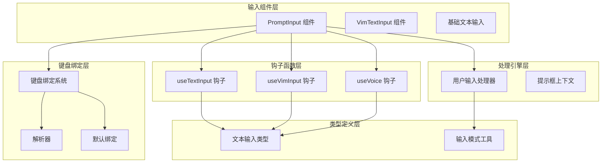
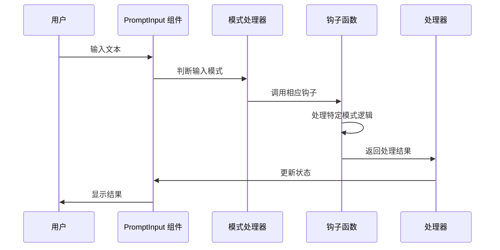
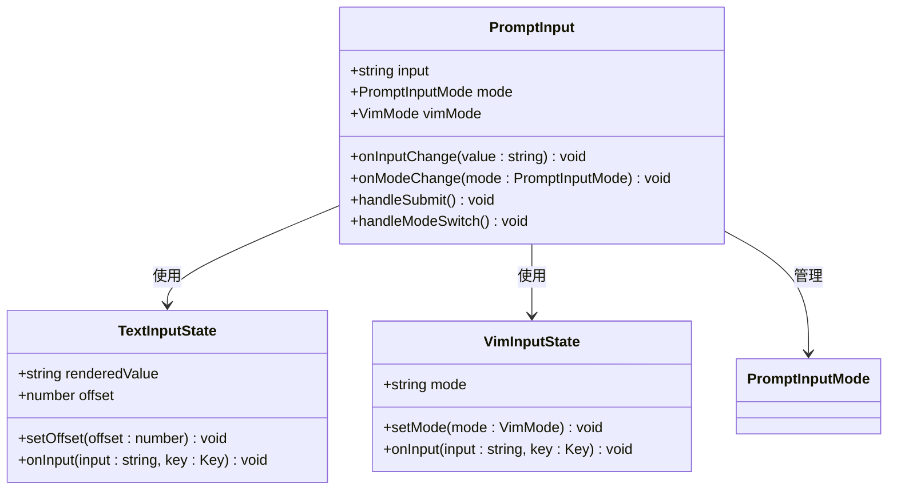
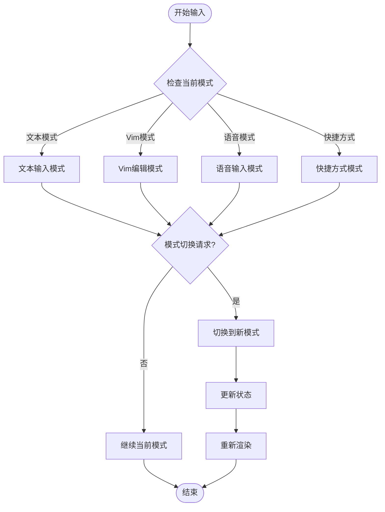
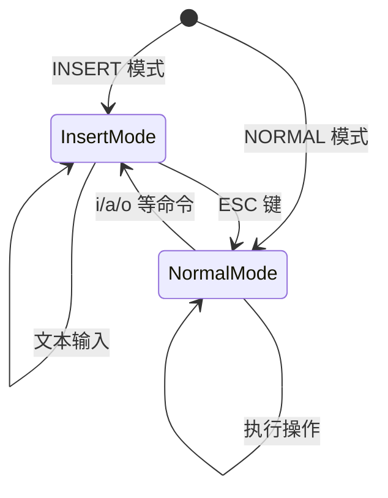
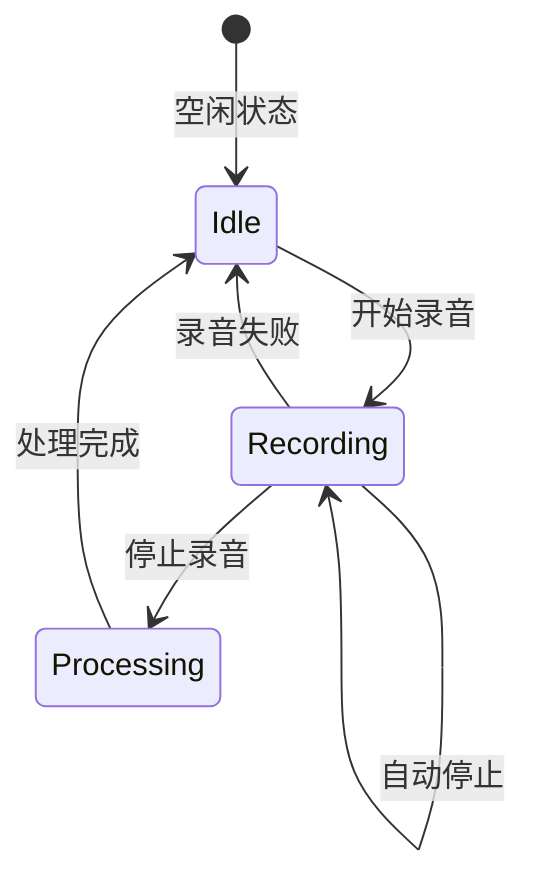
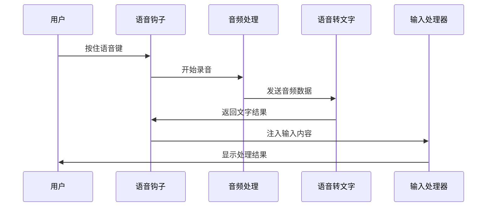
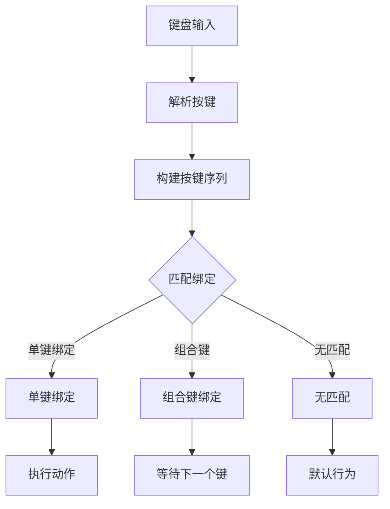
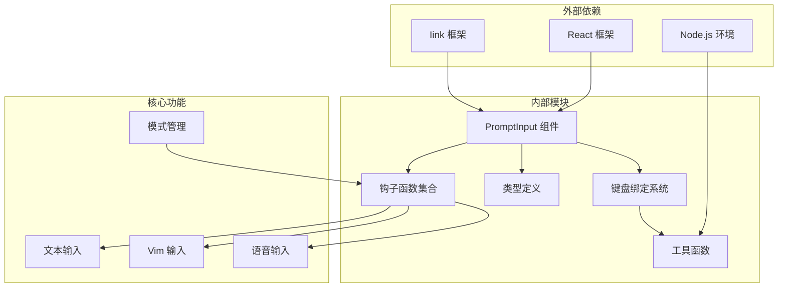

# 输入模式管理

<cite>
**本文档引用的文件**
- [src/components/PromptInput/inputModes.ts](file://src/components/PromptInput/inputModes.ts)
- [src/hooks/useVimInput.ts](file://src/hooks/useVimInput.ts)
- [src/hooks/useVoice.ts](file://src/hooks/useVoice.ts)
- [src/hooks/useTextInput.ts](file://src/hooks/useTextInput.ts)
- [src/types/textInputTypes.ts](file://src/types/textInputTypes.ts)
- [src/components/PromptInput/PromptInput.tsx](file://src/components/PromptInput/PromptInput.tsx)
- [src/components/PromptInput/PromptInputFooter.tsx](file://src/components/PromptInput/PromptInputFooter.tsx)
- [src/hooks/useCommandKeybindings.tsx](file://src/hooks/useCommandKeybindings.tsx)
- [src/keybindings/defaultBindings.ts](file://src/keybindings/defaultBindings.ts)
- [src/keybindings/resolver.ts](file://src/keybindings/resolver.ts)
- [src/utils/processUserInput/processUserInput.ts](file://src/utils/processUserInput/processUserInput.ts)
</cite>

## 目录
1. [简介](#简介)
2. [项目结构](#项目结构)
3. [核心组件](#核心组件)
4. [架构概览](#架构概览)
5. [详细组件分析](#详细组件分析)
6. [依赖关系分析](#依赖关系分析)
7. [性能考虑](#性能考虑)
8. [故障排除指南](#故障排除指南)
9. [结论](#结论)

## 简介

输入模式管理系统是 Claude Code 中负责处理用户输入的核心模块，它支持多种输入模式包括文本输入、Vim 模式、语音输入和快捷方式模式。该系统通过统一的接口管理不同的输入方式，提供灵活的模式切换机制和强大的扩展能力。

系统的主要目标是：
- 提供统一的输入处理接口
- 支持多种输入模式的无缝切换
- 实现高效的键盘快捷键绑定
- 确保无障碍访问支持
- 提供良好的性能表现

## 项目结构

输入模式管理系统主要分布在以下目录中：

**图表来源**
- [src/components/PromptInput/PromptInput.tsx:194-800](file://src/components/PromptInput/PromptInput.tsx#L194-L800)
- [src/hooks/useTextInput.ts:73-530](file://src/hooks/useTextInput.ts#L73-L530)
- [src/hooks/useVimInput.ts:34-317](file://src/hooks/useVimInput.ts#L34-L317)

**章节来源**
- [src/components/PromptInput/PromptInput.tsx:194-800](file://src/components/PromptInput/PromptInput.tsx#L194-L800)
- [src/hooks/useTextInput.ts:73-530](file://src/hooks/useTextInput.ts#L73-L530)
- [src/hooks/useVimInput.ts:34-317](file://src/hooks/useVimInput.ts#L34-L317)

## 核心组件

### PromptInput 组件

PromptInput 是整个输入系统的核心组件，负责协调所有输入模式的工作。它提供了以下关键功能：

- **多模式支持**：同时支持文本输入、Vim 模式、语音输入等多种输入方式
- **状态管理**：维护输入内容、光标位置、模式状态等关键状态
- **事件处理**：处理键盘输入、鼠标交互、粘贴操作等用户事件
- **模式切换**：在不同输入模式之间进行平滑切换

### useTextInput 钩子

useTextInput 提供了基础文本输入的功能，包括：

- **光标控制**：精确的光标位置管理和移动
- **文本编辑**：支持多种编辑操作如删除、复制、粘贴等
- **历史记录**：维护输入历史和导航功能
- **过滤器**：支持输入过滤和转换

### useVimInput 钩子

useVimInput 实现了完整的 Vim 编辑器模式，包括：

- **模式管理**：INSERT 和 NORMAL 两种模式的切换和管理
- **命令执行**：支持 Vim 原生命令和操作符
- **状态持久化**：保持编辑状态和历史记录
- **键盘映射**：将标准键盘输入映射到 Vim 操作

**章节来源**
- [src/components/PromptInput/PromptInput.tsx:194-800](file://src/components/PromptInput/PromptInput.tsx#L194-L800)
- [src/hooks/useTextInput.ts:73-530](file://src/hooks/useTextInput.ts#L73-L530)
- [src/hooks/useVimInput.ts:34-317](file://src/hooks/useVimInput.ts#L34-L317)

## 架构概览

输入模式管理系统采用分层架构设计，确保各组件职责清晰且相互独立：

**图表来源**
- [src/components/PromptInput/PromptInput.tsx:237-800](file://src/components/PromptInput/PromptInput.tsx#L237-L800)
- [src/utils/processUserInput/processUserInput.ts:85-270](file://src/utils/processUserInput/processUserInput.ts#L85-L270)

系统的关键特性包括：

1. **可扩展性**：新的输入模式可以通过钩子机制轻松添加
2. **解耦设计**：各组件间通过明确定义的接口通信
3. **状态隔离**：每种输入模式都有独立的状态管理
4. **性能优化**：通过懒加载和按需初始化提高启动速度

## 详细组件分析

### PromptInput 组件分析

PromptInput 组件是整个输入系统的核心协调者，负责管理所有输入模式的生命周期：

**图表来源**
- [src/components/PromptInput/PromptInput.tsx:124-190](file://src/components/PromptInput/PromptInput.tsx#L124-L190)
- [src/types/textInputTypes.ts:252-260](file://src/types/textInputTypes.ts#L252-L260)

#### 模式切换流程

**图表来源**
- [src/components/PromptInput/PromptInput.tsx:237-800](file://src/components/PromptInput/PromptInput.tsx#L237-L800)
- [src/hooks/useVimInput.ts:297-317](file://src/hooks/useVimInput.ts#L297-L317)

### Vim 模式实现分析

Vim 模式实现了完整的 Vim 编辑器功能，包括：

#### 模式状态管理

**图表来源**
- [src/hooks/useVimInput.ts:49-80](file://src/hooks/useVimInput.ts#L49-L80)

#### 命令执行机制

Vim 模式的命令执行基于状态机设计：

1. **状态跟踪**：维护当前编辑状态和待执行命令
2. **命令解析**：将键盘输入转换为 Vim 命令
3. **操作执行**：执行相应的文本编辑操作
4. **状态更新**：根据操作结果更新编辑状态

**章节来源**
- [src/hooks/useVimInput.ts:175-295](file://src/hooks/useVimInput.ts#L175-L295)

### 语音输入实现分析

语音输入功能提供了语音转文字的能力：

#### 录音状态管理

**图表来源**
- [src/hooks/useVoice.ts:143-155](file://src/hooks/useVoice.ts#L143-L155)

#### 语音处理流程

**图表来源**
- [src/hooks/useVoice.ts:204-522](file://src/hooks/useVoice.ts#L204-L522)

**章节来源**
- [src/hooks/useVoice.ts:1-800](file://src/hooks/useVoice.ts#L1-L800)

### 键盘绑定系统分析

键盘绑定系统提供了灵活的快捷键配置机制：

#### 默认绑定配置

系统提供了丰富的默认快捷键绑定：

| 功能 | 快捷键 | 描述 |
|------|--------|------|
| 模式切换 | Shift+Tab | 在不同输入模式间循环切换 |
| 提交消息 | Enter | 提交当前输入内容 |
| 历史导航 | Up/Down | 导航输入历史记录 |
| 清除输入 | Esc | 清空当前输入内容 |
| 退出程序 | Ctrl+C | 退出应用程序 |

#### 绑定解析机制

**图表来源**
- [src/keybindings/resolver.ts:32-61](file://src/keybindings/resolver.ts#L32-L61)

**章节来源**
- [src/keybindings/defaultBindings.ts:32-341](file://src/keybindings/defaultBindings.ts#L32-L341)
- [src/keybindings/resolver.ts:166-244](file://src/keybindings/resolver.ts#L166-L244)

## 依赖关系分析

输入模式管理系统具有清晰的依赖层次结构：

**图表来源**
- [src/components/PromptInput/PromptInput.tsx:1-800](file://src/components/PromptInput/PromptInput.tsx#L1-L800)
- [src/hooks/useTextInput.ts:1-530](file://src/hooks/useTextInput.ts#L1-L530)

### 关键依赖关系

1. **组件依赖**：PromptInput 组件依赖于各种钩子函数和工具模块
2. **钩子依赖**：各个钩子函数相互独立，通过统一接口进行通信
3. **类型依赖**：所有模块共享统一的类型定义，确保类型安全
4. **键盘绑定依赖**：键盘绑定系统独立于其他模块，提供通用的快捷键处理

**章节来源**
- [src/types/textInputTypes.ts:1-388](file://src/types/textInputTypes.ts#L1-L388)
- [src/components/PromptInput/inputModes.ts:1-34](file://src/components/PromptInput/inputModes.ts#L1-L34)

## 性能考虑

输入模式管理系统在设计时充分考虑了性能优化：

### 内存管理

1. **状态缓存**：使用 React 的状态缓存机制避免不必要的重渲染
2. **懒加载**：语音模块采用懒加载方式，减少初始加载时间
3. **对象复用**：复用已创建的对象实例，减少内存分配

### 计算优化

1. **增量更新**：只更新发生变化的部分，避免全量重渲染
2. **防抖处理**：对频繁触发的操作进行防抖处理
3. **异步处理**：将耗时操作放到后台线程执行

### 网络优化

1. **连接池**：复用语音识别服务的连接
2. **批量处理**：将多个操作合并为批量处理
3. **缓存策略**：对常用数据进行缓存

## 故障排除指南

### 常见问题及解决方案

#### 模式切换问题

**问题**：模式切换不生效或切换后状态异常

**解决方案**：
1. 检查模式状态是否正确更新
2. 确认钩子函数的调用顺序
3. 验证状态同步机制

#### 键盘绑定冲突

**问题**：快捷键绑定不生效或与其他应用冲突

**解决方案**：
1. 检查键盘绑定配置
2. 验证绑定解析逻辑
3. 确认上下文激活状态

#### 语音输入问题

**问题**：语音识别失败或音频质量差

**解决方案**：
1. 检查麦克风权限设置
2. 验证音频设备配置
3. 确认网络连接状态

**章节来源**
- [src/hooks/useVimInput.ts:175-295](file://src/hooks/useVimInput.ts#L175-L295)
- [src/hooks/useVoice.ts:630-631](file://src/hooks/useVoice.ts#L630-L631)

## 结论

输入模式管理系统通过精心设计的架构和实现，成功地提供了灵活、高效、易扩展的多模式输入解决方案。系统的主要优势包括：

1. **模块化设计**：清晰的组件分离和职责划分
2. **扩展性强**：通过钩子机制轻松添加新的输入模式
3. **用户体验好**：流畅的模式切换和响应式界面
4. **性能优异**：优化的内存管理和计算效率
5. **兼容性佳**：支持多种平台和环境

该系统为 Claude Code 提供了强大的输入处理能力，为用户提供了丰富而直观的交互体验。通过持续的优化和改进，系统将继续为用户提供更好的输入体验。