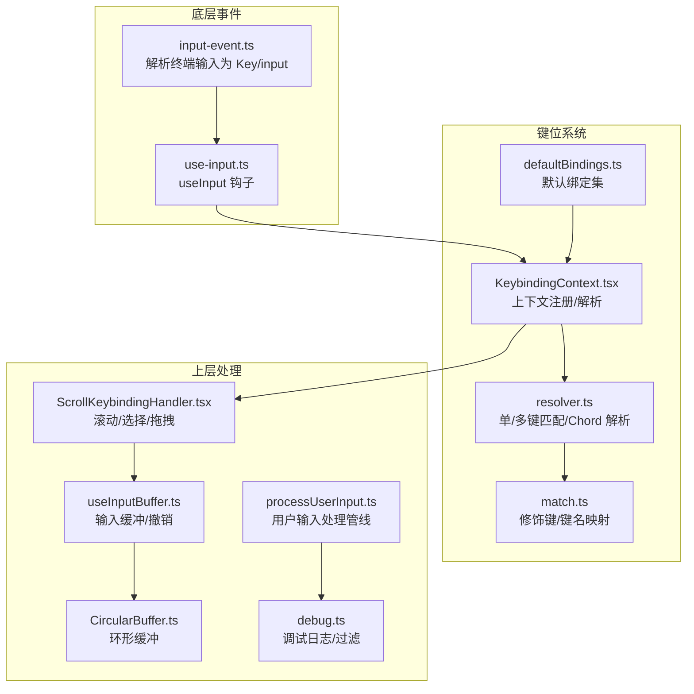
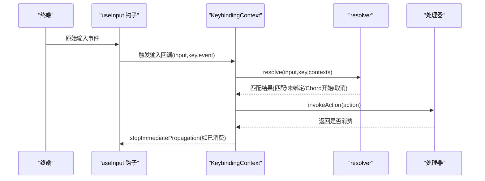
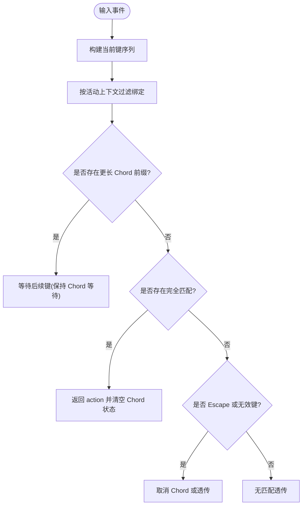
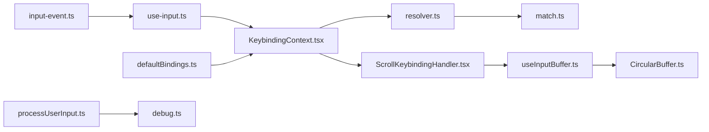

# 输入事件处理

<cite>
**本文引用的文件**
- [useKeybinding.ts](file://src/keybindings/useKeybinding.ts)
- [resolver.ts](file://src/keybindings/resolver.ts)
- [match.ts](file://src/keybindings/match.ts)
- [KeybindingContext.tsx](file://src/keybindings/KeybindingContext.tsx)
- [defaultBindings.ts](file://src/keybindings/defaultBindings.ts)
- [input-event.ts](file://src/ink/events/input-event.ts)
- [useInput.ts](file://src/ink/hooks/use-input.ts/use-input.ts)
- [ScrollKeybindingHandler.tsx](file://src/components/ScrollKeybindingHandler.tsx)
- [useInputBuffer.ts](file://src/hooks/useInputBuffer.ts)
- [CircularBuffer.ts](file://src/utils/CircularBuffer.ts)
- [processUserInput.ts](file://src/utils/processUserInput/processUserInput.ts)
- [debug.ts](file://src/utils/debug.ts)
- [keybindings.ts](file://src/commands/keybindings/keybindings.ts)
- [terminalSetup.tsx](file://src/commands/terminalSetup/terminalSetup.tsx)
- [KeybindingWarnings.tsx](file://src/components/KeybindingWarnings.tsx)
</cite>

## 目录
1. [简介](#简介)
2. [项目结构](#项目结构)
3. [核心组件](#核心组件)
4. [架构总览](#架构总览)
5. [详细组件分析](#详细组件分析)
6. [依赖关系分析](#依赖关系分析)
7. [性能考量](#性能考量)
8. [故障排查指南](#故障排查指南)
9. [结论](#结论)
10. [附录](#附录)

## 简介
本文件系统化梳理输入事件处理体系，覆盖键盘事件捕获、缓冲区管理、事件传播与优先级、快捷键绑定与组合键处理、事件调试与性能监控、以及跨平台兼容策略。目标是帮助开发者快速理解从底层终端输入到高层交互响应的完整链路，并提供可操作的扩展与优化建议。

## 项目结构
输入事件处理由三层协作构成：
- 底层事件解析：将原始终端输入解析为统一的 Key 对象与输入文本。
- 键盘绑定与路由：基于上下文的键位解析、优先级与组合键（Chord）支持。
- 上层处理与缓冲：滚动与选择、输入缓冲、用户提示处理、调试输出与性能监控。

图表来源
- [input-event.ts:1-206](file://src/ink/events/input-event.ts#L1-L206)
- [useInput.ts](file://src/ink/hooks/use-input.ts/use-input.ts)
- [KeybindingContext.tsx:1-243](file://src/keybindings/KeybindingContext.tsx#L1-L243)
- [resolver.ts:1-245](file://src/keybindings/resolver.ts#L1-L245)
- [match.ts:1-121](file://src/keybindings/match.ts#L1-L121)
- [defaultBindings.ts:1-341](file://src/keybindings/defaultBindings.ts#L1-L341)
- [ScrollKeybindingHandler.tsx:1-800](file://src/components/ScrollKeybindingHandler.tsx#L1-L800)
- [useInputBuffer.ts:1-133](file://src/hooks/useInputBuffer.ts#L1-L133)
- [CircularBuffer.ts:1-85](file://src/utils/CircularBuffer.ts#L1-L85)
- [processUserInput.ts:1-606](file://src/utils/processUserInput/processUserInput.ts#L1-L606)
- [debug.ts:1-269](file://src/utils/debug.ts#L1-L269)

章节来源
- [input-event.ts:1-206](file://src/ink/events/input-event.ts#L1-L206)
- [KeybindingContext.tsx:1-243](file://src/keybindings/KeybindingContext.tsx#L1-L243)
- [resolver.ts:1-245](file://src/keybindings/resolver.ts#L1-L245)
- [match.ts:1-121](file://src/keybindings/match.ts#L1-L121)
- [defaultBindings.ts:1-341](file://src/keybindings/defaultBindings.ts#L1-L341)
- [ScrollKeybindingHandler.tsx:1-800](file://src/components/ScrollKeybindingHandler.tsx#L1-L800)
- [useInputBuffer.ts:1-133](file://src/hooks/useInputBuffer.ts#L1-L133)
- [CircularBuffer.ts:1-85](file://src/utils/CircularBuffer.ts#L1-L85)
- [processUserInput.ts:1-606](file://src/utils/processUserInput/processUserInput.ts#L1-L606)
- [debug.ts:1-269](file://src/utils/debug.ts#L1-L269)

## 核心组件
- 事件解析器：将终端输入标准化为 Key 与 input 字符串，处理特殊序列（CSI u、应用小键盘、modifyOtherKeys）与修饰键语义。
- 键位上下文与解析：提供上下文优先级、Chord 前缀匹配、取消与未绑定处理；支持动态注册/注销上下文。
- 快捷键钩子：useKeybinding/useKeybindings 将配置化的动作与组件内的处理器绑定，自动停止事件冒泡。
- 滚动与选择：ScrollKeybindingHandler 提供滚轮加速、拖拽滚动、模态分页键等高级交互。
- 输入缓冲：useInputBuffer 支持去抖、撤销、最大容量限制；CircularBuffer 提供固定窗口的环形队列。
- 用户输入处理：processUserInput 负责命令解析、附件提取、图像处理、权限钩子与结果组装。
- 调试与性能：debug 工具提供过滤、级别控制、异步缓冲写入与符号链接追踪最新日志。

章节来源
- [input-event.ts:1-206](file://src/ink/events/input-event.ts#L1-L206)
- [KeybindingContext.tsx:1-243](file://src/keybindings/KeybindingContext.tsx#L1-L243)
- [resolver.ts:1-245](file://src/keybindings/resolver.ts#L1-L245)
- [match.ts:1-121](file://src/keybindings/match.ts#L1-L121)
- [useKeybinding.ts:1-197](file://src/keybindings/useKeybinding.ts#L1-L197)
- [ScrollKeybindingHandler.tsx:1-800](file://src/components/ScrollKeybindingHandler.tsx#L1-L800)
- [useInputBuffer.ts:1-133](file://src/hooks/useInputBuffer.ts#L1-L133)
- [CircularBuffer.ts:1-85](file://src/utils/CircularBuffer.ts#L1-L85)
- [processUserInput.ts:1-606](file://src/utils/processUserInput/processUserInput.ts#L1-L606)
- [debug.ts:1-269](file://src/utils/debug.ts#L1-L269)

## 架构总览
事件从终端进入后，经由 Ink 的 useInput 钩子收集，再交由 KeybindingContext 进行上下文解析与匹配。匹配成功后调用对应 action 的处理器，必要时通过 stopImmediatePropagation 阻止后续处理器执行。滚动与选择等复杂交互由 ScrollKeybindingHandler 组合 useKeybinding 与 useInput 实现。

图表来源
- [useInput.ts](file://src/ink/hooks/use-input.ts/use-input.ts)
- [KeybindingContext.tsx:1-243](file://src/keybindings/KeybindingContext.tsx#L1-L243)
- [resolver.ts:1-245](file://src/keybindings/resolver.ts#L1-L245)
- [useKeybinding.ts:1-197](file://src/keybindings/useKeybinding.ts#L1-L197)

## 详细组件分析

### 事件捕获与解析（input-event.ts）
- 将终端按键序列解析为 Key 结构体（方向键、功能键、修饰键等），并生成 input 字符串。
- 处理多种协议与模式：
  - CSI u（Kitty 协议）：解析码点与修饰键，转换为标准键名或空字符串。
  - modifyOtherKeys：处理 xterm 的转义序列。
  - 应用小键盘模式：将 Ox 形式映射为数字字符。
  - 特殊序列抑制：对未识别函数键与 ESC-less SGR 鼠标片段进行清理，避免泄漏到输入。
- 修正历史行为差异：例如 meta 标记在 escape 场景下的处理，确保 escape 不带 meta 修饰参与匹配。

章节来源
- [input-event.ts:1-206](file://src/ink/events/input-event.ts#L1-L206)

### 键位系统与上下文（KeybindingContext.tsx、resolver.ts、match.ts）
- 上下文优先级：注册的活动上下文优先于当前组件上下文，最后回退到全局（Global）。优先级去重保留首次出现者。
- 单键匹配：Phase 1 先查找单键绑定，使用 matchesBinding 与修饰键归一化（alt/meta 合并）。
- Chord 支持：
  - 前缀匹配：若当前序列是更长 Chord 的前缀，则等待后续键，避免误触发。
  - 完整匹配：当完整 Chord 匹配时返回 action。
  - 取消与未绑定：Escape 取消；无匹配则根据是否处于 Chord 状态决定取消或透传。
- 修饰键归一化：alt/meta 在终端层面不可区分，统一映射；super（cmd/win）仅在 kitty 协议到达时有效。
- 显示文本：getBindingDisplayText 以用户视角显示绑定（如 opt/alt 的平台差异）。

图表来源
- [resolver.ts:166-244](file://src/keybindings/resolver.ts#L166-L244)
- [match.ts:1-121](file://src/keybindings/match.ts#L1-L121)

章节来源
- [KeybindingContext.tsx:1-243](file://src/keybindings/KeybindingContext.tsx#L1-L243)
- [resolver.ts:1-245](file://src/keybindings/resolver.ts#L1-L245)
- [match.ts:1-121](file://src/keybindings/match.ts#L1-L121)

### 快捷键钩子与事件传播（useKeybinding.ts）
- useKeybinding/useKeybindings 将 action 与处理器注册到 KeybindingContext，并在输入回调中解析结果：
  - 匹配成功：调用处理器，若返回值非 false 则阻止后续传播。
  - Chord 开始/取消：更新等待状态并阻止传播。
  - 未绑定：清除等待状态并阻止传播。
- 支持 Promise 异步处理器（不阻断传播的判定仅针对同步返回 false 的情况）。

章节来源
- [useKeybinding.ts:1-197](file://src/keybindings/useKeybinding.ts#L1-L197)

### 滚动与选择（ScrollKeybindingHandler.tsx）
- 滚轮加速与设备识别：
  - 原生终端：线性窗口加速，结合“编码器弹跳”检测（bounce）切换“滚轮模式”，采用指数衰减曲线提升吞吐。
  - xterm.js（VS Code 等）：基于事件间隔的指数衰减，同批突发（<5ms）视为加速，不同向/长时间空闲重置基础倍率。
  - 速度基线：可通过环境变量调节，适配不同终端的预乘滚轮事件。
- 拖拽滚动：当拖拽超出视口边界时定时滚动，避免选择漂移；对累积行进行捕获与回填，保证复制文本完整性。
- 模态分页键：在无文本输入竞争时启用 g/G、ctrl+u/d/b/f 等分页键，避免与编辑命令冲突。
- 选择扩展与清除：shift+箭头扩展选择；Esc/Ctrl+C 条件消费；普通可打印键清除选择。

章节来源
- [ScrollKeybindingHandler.tsx:1-800](file://src/components/ScrollKeybindingHandler.tsx#L1-L800)

### 输入缓冲与撤销（useInputBuffer.ts、CircularBuffer.ts）
- useInputBuffer：
  - 去抖：短时间内多次变更合并为一次推送，避免高频输入导致的重复处理。
  - 撤销：基于游标索引的线性缓冲，支持向前/向后遍历。
  - 去重：连续相同文本不重复入栈。
  - 容量限制：超过上限丢弃最旧条目。
- CircularBuffer：
  - 固定容量环形队列，自动淘汰最旧项。
  - 支持最近 N 条读取、顺序导出、清空与长度查询。

章节来源
- [useInputBuffer.ts:1-133](file://src/hooks/useInputBuffer.ts#L1-L133)
- [CircularBuffer.ts:1-85](file://src/utils/CircularBuffer.ts#L1-L85)

### 用户输入处理管线（processUserInput.ts）
- 输入类型处理：字符串与富内容块（含图片）混合输入的规范化与图像尺寸调整。
- 附件提取：在合适时机抽取附件消息，支持 IDE 选区与查询来源。
- 命令与技能：斜杠命令解析与执行，桥接安全命令的远程控制路径。
- 钩子与阻断：用户提交前钩子可阻止继续或注入附加上下文。
- 元信息：对粘贴图片添加元数据消息，便于模型可见但用户隐藏。

章节来源
- [processUserInput.ts:1-606](file://src/utils/processUserInput/processUserInput.ts#L1-L606)

### 默认快捷键与跨平台兼容（defaultBindings.ts、terminalSetup.tsx）
- 默认绑定：
  - 平台特定键位：Windows 下图片粘贴使用 alt+v，其他平台使用 ctrl+v。
  - 终端 VT 模式：在支持的 Node/Bun 版本下启用 shift+tab；否则使用 meta+m。
  - 功能开关：根据特性门控启用快捷键（如全局搜索、快速打开、语音激活等）。
- 终端集成：
  - 自动安装 Shift+Enter 发送到终端的发送序列，适配 VS Code、Zed 等编辑器。
  - 生成用户键位模板并打开编辑器，支持键位校验与警告展示。

章节来源
- [defaultBindings.ts:1-341](file://src/keybindings/defaultBindings.ts#L1-L341)
- [keybindings.ts:1-53](file://src/commands/keybindings/keybindings.ts#L1-L53)
- [terminalSetup.tsx:216-530](file://src/commands/terminalSetup/terminalSetup.tsx#L216-L530)
- [KeybindingWarnings.tsx:1-43](file://src/components/KeybindingWarnings.tsx#L1-L43)

## 依赖关系分析
- 事件层依赖：input-event.ts 为 useInput.ts 的输入源，二者共同构成底层事件基础设施。
- 键位层依赖：KeybindingContext.tsx 依赖 resolver.ts 与 match.ts；resolver.ts 再依赖 match.ts 的键名与修饰键匹配逻辑。
- 上层依赖：ScrollKeybindingHandler.tsx 依赖 useKeybinding.ts 与 useInput.ts；useInputBuffer.ts 与 CircularBuffer.ts 作为通用工具被多处复用。
- 配置与命令：defaultBindings.ts 为键位系统提供默认绑定；keybindings.ts 与 terminalSetup.tsx 提供用户配置入口与终端集成。

图表来源
- [input-event.ts:1-206](file://src/ink/events/input-event.ts#L1-L206)
- [useInput.ts](file://src/ink/hooks/use-input.ts/use-input.ts)
- [KeybindingContext.tsx:1-243](file://src/keybindings/KeybindingContext.tsx#L1-L243)
- [resolver.ts:1-245](file://src/keybindings/resolver.ts#L1-L245)
- [match.ts:1-121](file://src/keybindings/match.ts#L1-L121)
- [defaultBindings.ts:1-341](file://src/keybindings/defaultBindings.ts#L1-L341)
- [ScrollKeybindingHandler.tsx:1-800](file://src/components/ScrollKeybindingHandler.tsx#L1-L800)
- [useInputBuffer.ts:1-133](file://src/hooks/useInputBuffer.ts#L1-L133)
- [CircularBuffer.ts:1-85](file://src/utils/CircularBuffer.ts#L1-L85)
- [processUserInput.ts:1-606](file://src/utils/processUserInput/processUserInput.ts#L1-L606)
- [debug.ts:1-269](file://src/utils/debug.ts#L1-L269)

章节来源
- [input-event.ts:1-206](file://src/ink/events/input-event.ts#L1-L206)
- [KeybindingContext.tsx:1-243](file://src/keybindings/KeybindingContext.tsx#L1-L243)
- [resolver.ts:1-245](file://src/keybindings/resolver.ts#L1-L245)
- [match.ts:1-121](file://src/keybindings/match.ts#L1-L121)
- [defaultBindings.ts:1-341](file://src/keybindings/defaultBindings.ts#L1-L341)
- [ScrollKeybindingHandler.tsx:1-800](file://src/components/ScrollKeybindingHandler.tsx#L1-L800)
- [useInputBuffer.ts:1-133](file://src/hooks/useInputBuffer.ts#L1-L133)
- [CircularBuffer.ts:1-85](file://src/utils/CircularBuffer.ts#L1-L85)
- [processUserInput.ts:1-606](file://src/utils/processUserInput/processUserInput.ts#L1-L606)
- [debug.ts:1-269](file://src/utils/debug.ts#L1-L269)

## 性能考量
- 滚轮加速与事件频率：
  - 原生路径：窗口线性加速 + 编码器弹跳检测，结合指数衰减曲线，兼顾精度与吞吐。
  - xterm.js 路径：基于事件间隔的指数衰减，同批突发视为加速，避免高频率下的溢出。
  - 建议：通过环境变量调节基线速度以适配不同终端；在高负载场景下注意避免过高的加速度上限。
- 输入缓冲：
  - 去抖：减少高频输入的处理压力；容量限制防止内存膨胀。
  - 撤销：线性索引访问，时间复杂度 O(1) 移动，空间占用与容量线性相关。
- 日志与调试：
  - 异步缓冲写入：每秒刷新，降低频繁 IO；支持符号链接指向最新日志，便于定位问题。
  - 过滤与级别：通过环境变量与过滤器控制输出粒度，避免生产环境噪声。

章节来源
- [ScrollKeybindingHandler.tsx:172-297](file://src/components/ScrollKeybindingHandler.tsx#L172-L297)
- [useInputBuffer.ts:1-133](file://src/hooks/useInputBuffer.ts#L1-L133)
- [debug.ts:1-269](file://src/utils/debug.ts#L1-L269)

## 故障排查指南
- 键位冲突与未生效：
  - 使用 KeybindingWarnings 组件查看配置问题；确认上下文优先级与是否处于活动状态。
  - 检查是否误触 Chord 取消（Escape）或前缀匹配导致的等待状态。
- 终端集成问题：
  - 通过 keybindings 命令生成模板并检查编辑器打开状态；参考 terminalSetup.tsx 的安装流程。
- 调试日志：
  - 设置 DEBUG/DEBUG_SDK/--debug 或指定 --debug-file；通过 CLAUDE_CODE_DEBUG_LOG_LEVEL 控制级别。
  - 使用 getDebugFilter 过滤特定模块输出；关注最新日志符号链接以便快速定位。

章节来源
- [KeybindingWarnings.tsx:1-43](file://src/components/KeybindingWarnings.tsx#L1-L43)
- [keybindings.ts:1-53](file://src/commands/keybindings/keybindings.ts#L1-L53)
- [terminalSetup.tsx:216-530](file://src/commands/terminalSetup/terminalSetup.tsx#L216-L530)
- [debug.ts:1-269](file://src/utils/debug.ts#L1-L269)

## 结论
该输入事件处理系统以统一的事件解析为基础，通过上下文驱动的键位解析与 Chord 支持实现灵活的快捷键绑定；在滚动与选择等复杂交互中引入滚轮加速与拖拽滚动算法，兼顾体验与性能；配合输入缓冲、调试工具与跨平台兼容策略，形成从底层到上层的完整闭环。建议在扩展新功能时遵循上下文优先级与去抖/撤销等既有模式，确保一致性与可维护性。

## 附录
- 自定义事件处理器与插件扩展：
  - 使用 useKeybinding/useKeybindings 注册 action 与处理器，利用上下文隔离避免冲突。
  - 对需要条件消费的场景，返回 false 让后续处理器有机会接管（如列表导航）。
- 快捷键绑定与组合键：
  - 通过 defaultBindings.ts 与用户键位模板管理；注意平台差异与终端 VT 模式支持。
- 事件调试与性能监控：
  - 使用 debug 工具输出结构化日志，结合过滤器与级别控制，定位性能瓶颈与异常路径。