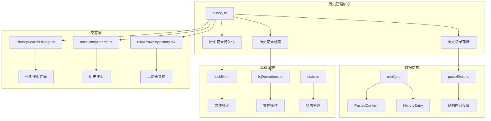
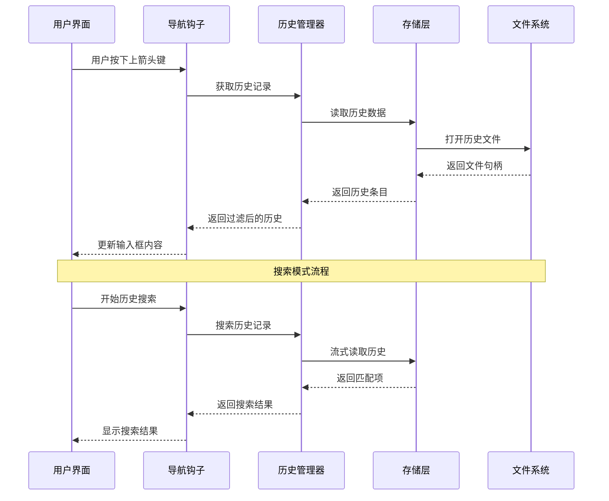
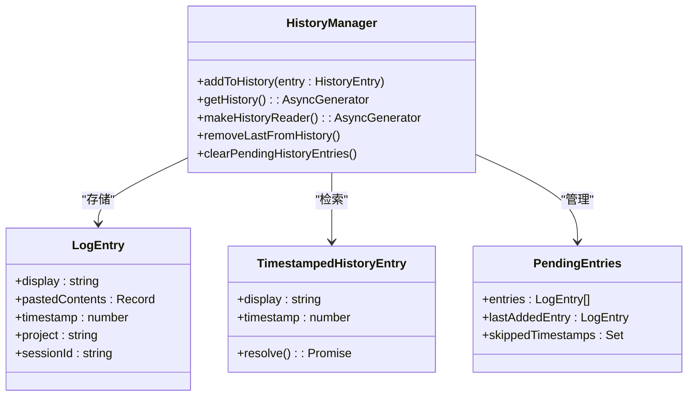
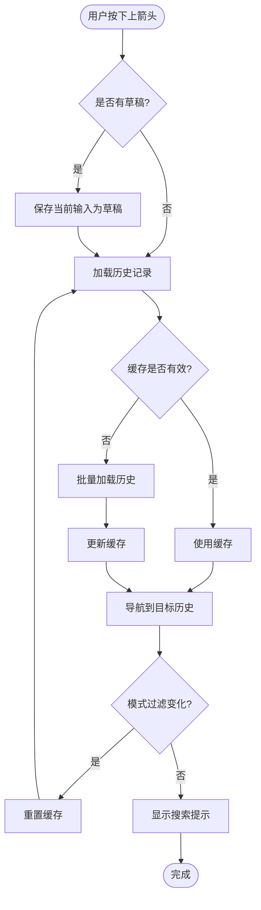
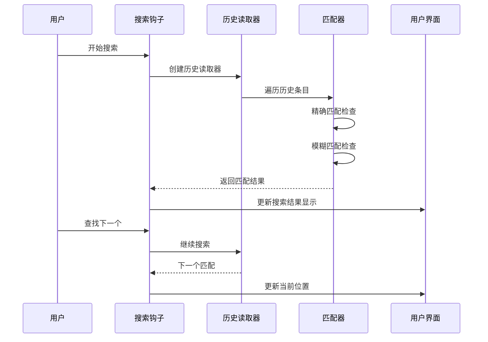
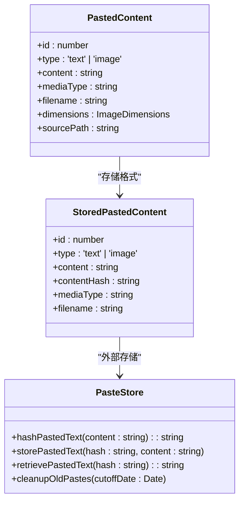
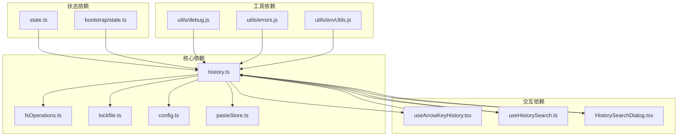

# 输入历史管理

<cite>
**本文档引用的文件**
- [history.ts](file://src/history.ts)
- [useArrowKeyHistory.tsx](file://src/hooks/useArrowKeyHistory.tsx)
- [useHistorySearch.ts](file://src/hooks/useHistorySearch.ts)
- [HistorySearchDialog.tsx](file://src/components/HistorySearchDialog.tsx)
- [config.ts](file://src/utils/config.ts)
- [pasteStore.ts](file://src/utils/pasteStore.ts)
- [fsOperations.ts](file://src/utils/fsOperations.ts)
- [lockfile.ts](file://src/utils/lockfile.ts)
- [state.ts](file://src/bootstrap/state.ts)
</cite>

## 目录
1. [简介](#简介)
2. [项目结构](#项目结构)
3. [核心组件](#核心组件)
4. [架构概览](#架构概览)
5. [详细组件分析](#详细组件分析)
6. [依赖关系分析](#依赖关系分析)
7. [性能考虑](#性能考虑)
8. [故障排除指南](#故障排除指南)
9. [结论](#结论)

## 简介

输入历史管理系统是 Claude Code 中一个关键的功能模块，负责管理用户的输入历史记录。该系统提供了完整的上下箭头导航、历史搜索和智能匹配功能，支持跨会话的历史记录持久化，并具备高效的性能优化机制。

系统的核心特性包括：
- 实时历史记录存储和检索
- 智能模糊搜索和精确匹配
- 上下箭头导航支持模式过滤
- 历史记录的持久化策略
- 存储容量管理和清理机制
- 自定义配置和扩展方法

## 项目结构

输入历史管理系统主要由以下几个核心部分组成：

**图表来源**
- [history.ts:1-465](file://src/history.ts#L1-L465)
- [useArrowKeyHistory.tsx:1-229](file://src/hooks/useArrowKeyHistory.tsx#L1-L229)
- [useHistorySearch.ts:1-304](file://src/hooks/useHistorySearch.ts#L1-L304)

**章节来源**
- [history.ts:1-465](file://src/history.ts#L1-L465)
- [useArrowKeyHistory.tsx:1-229](file://src/hooks/useArrowKeyHistory.tsx#L1-L229)
- [useHistorySearch.ts:1-304](file://src/hooks/useHistorySearch.ts#L1-L304)

## 核心组件

### 历史记录存储系统

历史记录存储系统采用异步流式处理机制，通过 JSON Lines 格式存储历史数据，确保高并发场景下的数据一致性。

**主要特性：**
- 异步批量写入，避免阻塞主线程
- 文件锁定机制，防止并发写入冲突
- 内存缓冲区，减少磁盘 I/O 操作
- 增量刷新机制，平衡实时性和性能

### 智能搜索引擎

系统集成了两种搜索模式：精确匹配和模糊匹配，提供灵活的历史记录查找体验。

**搜索算法：**
- 精确匹配：使用字符串包含检查
- 模糊匹配：基于子序列匹配算法
- 实时预览：搜索结果的即时反馈

### 导航控制系统

上箭头导航系统支持按输入模式过滤的历史记录，提供智能的上下文感知体验。

**导航特性：**
- 模式感知过滤（bash、prompt等）
- 草稿保存和恢复
- 批量加载优化
- 实时缓存管理

**章节来源**
- [history.ts:19-217](file://src/history.ts#L19-L217)
- [useArrowKeyHistory.tsx:12-62](file://src/hooks/useArrowKeyHistory.tsx#L12-L62)
- [useHistorySearch.ts:73-148](file://src/hooks/useHistorySearch.ts#L73-L148)

## 架构概览

输入历史管理系统的整体架构采用分层设计，确保各组件职责清晰且松耦合。

**图表来源**
- [useArrowKeyHistory.tsx:144-182](file://src/hooks/useArrowKeyHistory.tsx#L144-L182)
- [useHistorySearch.ts:73-148](file://src/hooks/useHistorySearch.ts#L73-L148)
- [history.ts:106-143](file://src/history.ts#L106-L143)

## 详细组件分析

### 历史记录存储与检索

历史记录存储系统采用分层架构设计，确保数据的一致性和可靠性。

**图表来源**
- [history.ts:281-464](file://src/history.ts#L281-L464)
- [config.ts:64-72](file://src/utils/config.ts#L64-L72)

#### 存储容量管理

系统实现了智能的存储容量控制机制：

**容量限制：**
- 最大历史项目数：100个
- 大文本内容自动外部存储
- 进程内内存清理

**清理策略：**
- 按时间窗口限制（当前项目窗口内）
- 跳过已删除的条目
- 支持会话隔离

**章节来源**
- [history.ts:19-21](file://src/history.ts#L19-L21)
- [history.ts:178-180](file://src/history.ts#L178-L180)
- [history.ts:436-464](file://src/history.ts#L436-L464)

### 上下箭头导航系统

导航系统提供了高效的上下文感知历史记录访问能力。

**图表来源**
- [useArrowKeyHistory.tsx:124-182](file://src/hooks/useArrowKeyHistory.tsx#L124-L182)
- [useArrowKeyHistory.tsx:183-207](file://src/hooks/useArrowKeyHistory.tsx#L183-L207)

#### 导航优化机制

**批量加载优化：**
- 历史记录按10条批次加载
- 共享加载请求，避免重复读取
- 智能缓存失效机制

**模式过滤：**
- 支持bash、prompt等输入模式
- 模式变化时自动重置缓存
- 实时模式检测和应用

**章节来源**
- [useArrowKeyHistory.tsx:12-62](file://src/hooks/useArrowKeyHistory.tsx#L12-L62)
- [useArrowKeyHistory.tsx:144-207](file://src/hooks/useArrowKeyHistory.tsx#L144-L207)

### 历史搜索系统

历史搜索系统提供了强大的全文搜索和智能匹配功能。

**图表来源**
- [useHistorySearch.ts:73-148](file://src/hooks/useHistorySearch.ts#L73-L148)
- [useHistorySearch.ts:167-170](file://src/hooks/useHistorySearch.ts#L167-L170)

#### 搜索算法实现

**精确匹配算法：**
- 使用字符串包含检查
- 大小写不敏感比较
- 去除空白字符优化

**模糊匹配算法：**
- 基于子序列匹配
- 保持字符相对顺序
- 支持非连续字符匹配

**搜索优化：**
- 实时取消机制
- 去重处理
- 性能监控

**章节来源**
- [useHistorySearch.ts:73-148](file://src/hooks/useHistorySearch.ts#L73-L148)
- [HistorySearchDialog.tsx:111-118](file://src/components/HistorySearchDialog.tsx#L111-L118)

### 粘贴内容管理系统

系统支持复杂的粘贴内容管理，包括文本和图像内容的处理。

**图表来源**
- [config.ts:54-62](file://src/utils/config.ts#L54-L62)
- [history.ts:25-32](file://src/history.ts#L25-L32)
- [pasteStore.ts:10-105](file://src/utils/pasteStore.ts#L10-L105)

#### 存储策略

**内容分类：**
- 小文本内容直接内联存储
- 大文本内容外部存储（哈希索引）
- 图像内容单独处理

**存储优化：**
- 内容可寻址存储
- 哈希计算同步进行
- 异步磁盘写入

**清理机制：**
- 时间戳清理策略
- 磁盘空间监控
- 自动垃圾回收

**章节来源**
- [history.ts:355-409](file://src/history.ts#L355-L409)
- [pasteStore.ts:37-70](file://src/utils/pasteStore.ts#L37-L70)

## 依赖关系分析

输入历史管理系统与其他模块的依赖关系如下：

**图表来源**
- [history.ts:1-17](file://src/history.ts#L1-L17)
- [useArrowKeyHistory.tsx:1-10](file://src/hooks/useArrowKeyHistory.tsx#L1-L10)
- [useHistorySearch.ts:1-13](file://src/hooks/useHistorySearch.ts#L1-L13)

### 外部依赖管理

系统对外部依赖采用了延迟加载和懒加载策略：

**延迟加载模块：**
- proper-lockfile：仅在需要时加载
- graceful-fs：避免启动时的猴子补丁成本
- 其他大型依赖库

**性能优化：**
- 按需加载，减少启动时间
- 缓存已加载模块
- 避免不必要的依赖注入

**章节来源**
- [lockfile.ts:1-44](file://src/utils/lockfile.ts#L1-L44)
- [history.ts:1-17](file://src/history.ts#L1-L17)

## 性能考虑

输入历史管理系统在设计时充分考虑了性能优化，采用了多种策略来确保高效运行。

### I/O 性能优化

**批量写入策略：**
- 内存缓冲区累积10条记录后批量写入
- 异步写入操作，避免阻塞主线程
- 文件锁定机制确保数据一致性

**流式读取优化：**
- 使用异步生成器逐条读取历史记录
- 反向读取优化，优先获取最新记录
- 智能缓存机制减少重复读取

### 内存管理

**内存使用优化：**
- 历史记录窗口大小限制（100条）
- 按需加载机制，避免一次性加载所有历史
- 缓存失效策略，定期清理过期数据

**垃圾回收：**
- 自动清理未使用的缓存
- 进程退出时的资源清理
- 内存泄漏防护机制

### 并发控制

**并发安全：**
- 文件锁定防止并发写入冲突
- 原子性操作确保数据完整性
- 错误恢复机制

**性能监控：**
- 记录关键操作的执行时间
- 监控磁盘I/O性能
- 实时性能指标收集

## 故障排除指南

### 常见问题及解决方案

**历史记录无法保存**
- 检查文件权限和磁盘空间
- 验证配置文件的正确性
- 确认进程具有写入权限

**搜索功能异常**
- 清理损坏的历史文件
- 重启应用程序重新初始化
- 检查网络连接（远程模式）

**内存使用过高**
- 清理历史记录缓存
- 检查是否有内存泄漏
- 调整历史记录数量限制

### 调试和诊断

**日志记录：**
- 启用调试模式获取详细信息
- 监控文件操作错误
- 记录性能瓶颈点

**状态检查：**
- 验证历史文件格式
- 检查粘贴内容存储状态
- 监控系统资源使用情况

**章节来源**
- [history.ts:329-353](file://src/history.ts#L329-L353)
- [history.ts:136-142](file://src/history.ts#L136-L142)

## 结论

输入历史管理系统是一个设计精良、功能完备的历史记录管理解决方案。系统通过合理的架构设计、高效的性能优化和完善的错误处理机制，为用户提供了流畅的历史记录访问体验。

**主要优势：**
- 高性能的异步处理机制
- 智能的缓存和优化策略
- 完善的错误处理和恢复机制
- 灵活的配置和扩展能力

**未来改进方向：**
- 更高级的搜索算法优化
- 分布式历史记录同步
- 更精细的性能监控
- 增强的用户定制功能

该系统为 Claude Code 提供了坚实的历史记录管理基础，支持用户高效地访问和管理他们的输入历史，提升了整体的用户体验。