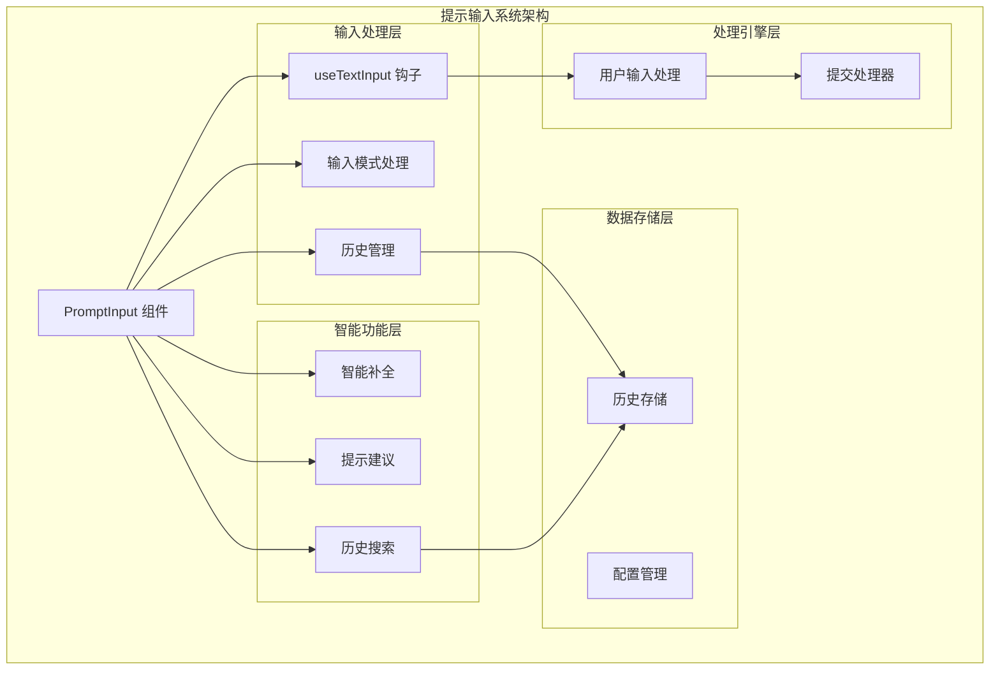
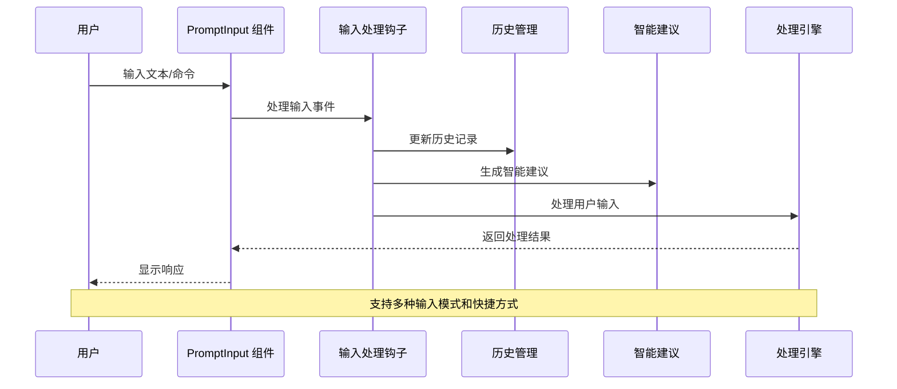
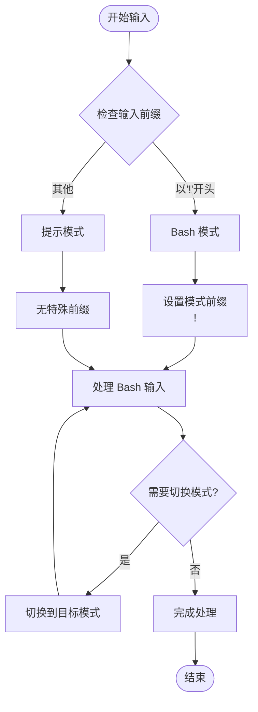
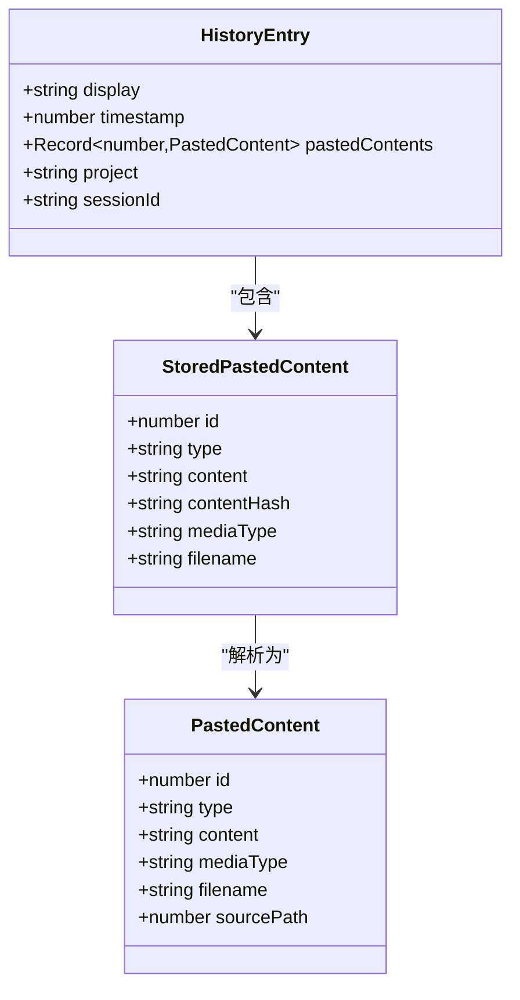
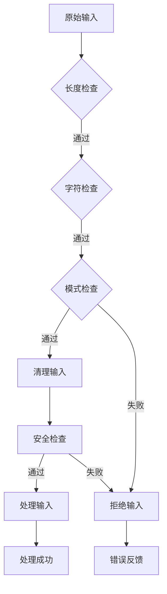
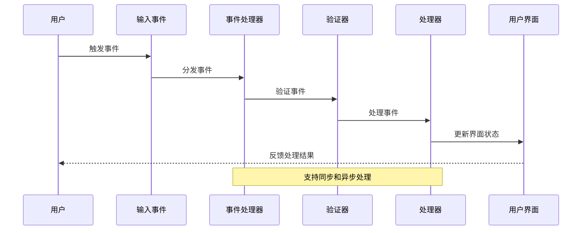
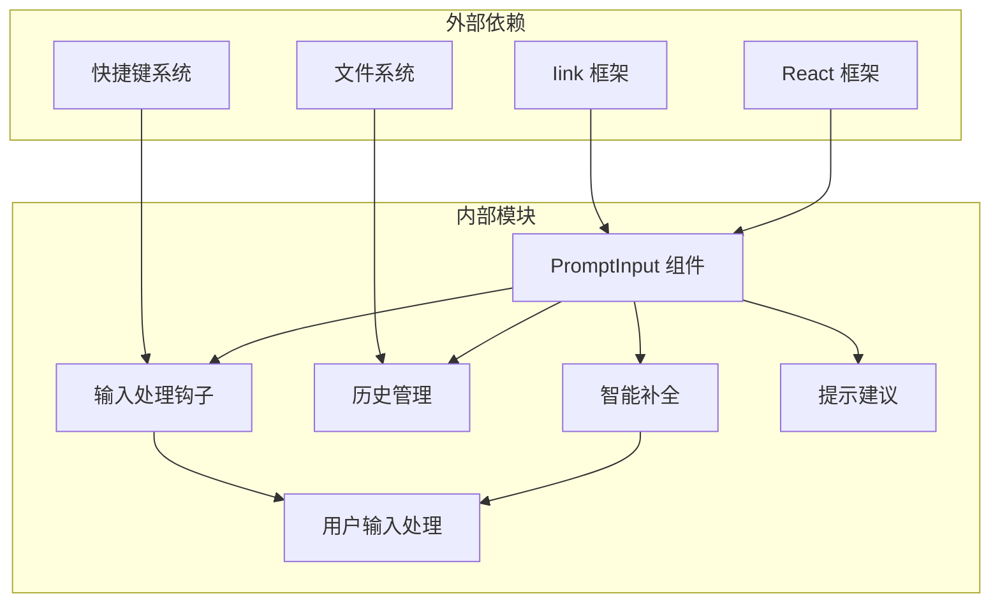

# 提示输入系统

<cite>
**本文档引用的文件**
- [PromptInput.tsx](file://src/components/PromptInput/PromptInput.tsx)
- [useTextInput.ts](file://src/hooks/useTextInput.ts)
- [useArrowKeyHistory.tsx](file://src/hooks/useArrowKeyHistory.tsx)
- [useHistorySearch.ts](file://src/hooks/useHistorySearch.ts)
- [usePromptSuggestion.ts](file://src/hooks/usePromptSuggestion.ts)
- [useTypeahead.tsx](file://src/hooks/useTypeahead.tsx)
- [inputModes.ts](file://src/components/PromptInput/inputModes.ts)
- [textInputTypes.ts](file://src/types/textInputTypes.ts)
- [history.ts](file://src/history.ts)
- [processUserInput.ts](file://src/utils/processUserInput/processUserInput.ts)
- [handlePromptSubmit.ts](file://src/utils/handlePromptSubmit.ts)
</cite>

## 目录
1. [简介](#简介)
2. [项目结构](#项目结构)
3. [核心组件](#核心组件)
4. [架构概览](#架构概览)
5. [详细组件分析](#详细组件分析)
6. [依赖关系分析](#依赖关系分析)
7. [性能考虑](#性能考虑)
8. [故障排除指南](#故障排除指南)
9. [结论](#结论)

## 简介

提示输入系统是 Claude Code 中的核心交互组件，负责处理用户的各种输入方式，包括文本输入、语音输入、快捷方式以及不同输入模式之间的切换。该系统提供了完整的输入处理机制，包括输入历史管理、自动完成和智能提示功能，并实现了严格的输入验证、格式化和安全过滤机制。

系统支持三种主要输入模式：普通提示模式（prompt）、Bash 命令模式（bash）以及任务通知模式（task-notification）。每种模式都有特定的输入处理规则和快捷键绑定。

## 项目结构

提示输入系统采用模块化设计，主要由以下核心部分组成：



**图表来源**
- [PromptInput.tsx:194-237](file://src/components/PromptInput/PromptInput.tsx#L194-L237)
- [useTextInput.ts:73-97](file://src/hooks/useTextInput.ts#L73-L97)
- [inputModes.ts:4-33](file://src/components/PromptInput/inputModes.ts#L4-L33)

**章节来源**
- [PromptInput.tsx:194-237](file://src/components/PromptInput/PromptInput.tsx#L194-L237)
- [useTextInput.ts:73-97](file://src/hooks/useTextInput.ts#L73-L97)
- [inputModes.ts:4-33](file://src/components/PromptInput/inputModes.ts#L4-L33)

## 核心组件

### PromptInput 主组件

PromptInput 是整个提示输入系统的核心组件，负责协调所有输入处理功能。它提供了完整的输入界面，包括输入框、状态指示器、快捷方式提示等。

**主要功能特性：**
- 多模式输入支持（prompt、bash、task-notification）
- 实时输入验证和格式化
- 智能历史管理和搜索
- 自动完成功能
- 语音输入集成
- 快捷方式支持

### 输入处理钩子

useTextInput 钩子提供了底层的输入处理能力，包括键盘事件处理、文本编辑操作、剪贴板集成等。

**核心能力：**
- 键盘快捷键映射
- 文本编辑操作（插入、删除、移动光标）
- 剪贴板内容处理
- 输入过滤和验证
- 光标位置管理

### 历史管理系统

系统实现了完整的输入历史管理功能，包括历史记录的存储、检索、搜索和导航。

**功能特点：**
- 异步历史加载和缓存
- 历史记录去重和排序
- 模式感知的历史筛选
- 实时历史搜索
- 历史记录持久化

**章节来源**
- [PromptInput.tsx:194-800](file://src/components/PromptInput/PromptInput.tsx#L194-L800)
- [useTextInput.ts:73-530](file://src/hooks/useTextInput.ts#L73-L530)
- [history.ts:190-217](file://src/history.ts#L190-L217)

## 架构概览

提示输入系统采用分层架构设计，确保各组件职责清晰、耦合度低。



**图表来源**
- [PromptInput.tsx:237-800](file://src/components/PromptInput/PromptInput.tsx#L237-L800)
- [useTextInput.ts:431-501](file://src/hooks/useTextInput.ts#L431-L501)
- [processUserInput.ts:85-270](file://src/utils/processUserInput/processUserInput.ts#L85-L270)

## 详细组件分析

### 输入模式处理机制

系统支持三种主要输入模式，每种模式都有特定的处理逻辑和快捷键绑定。

#### 模式定义和转换



**图表来源**
- [inputModes.ts:4-33](file://src/components/PromptInput/inputModes.ts#L4-L33)
- [PromptInput.tsx:112-123](file://src/components/PromptInput/PromptInput.tsx#L112-L123)

#### 模式切换逻辑

系统提供了灵活的模式切换机制，支持用户在不同输入模式之间快速切换。

**切换规则：**
- Bash 模式：使用 `!` 前缀标识
- 提示模式：默认模式，无需特殊前缀
- 任务通知模式：用于系统消息显示

**章节来源**
- [inputModes.ts:4-33](file://src/components/PromptInput/inputModes.ts#L4-L33)
- [PromptInput.tsx:112-123](file://src/components/PromptInput/PromptInput.tsx#L112-L123)

### 输入历史管理

历史管理系统提供了完整的输入历史记录功能，包括存储、检索、搜索和导航。

#### 历史记录存储结构



**图表来源**
- [history.ts:219-279](file://src/history.ts#L219-L279)
- [history.ts:25-32](file://src/history.ts#L25-L32)

#### 历史记录加载策略

系统采用了智能的缓存策略来优化历史记录的加载性能：

**缓存机制：**
- 分块加载（每次加载10条记录）
- 并发请求合并
- 模式感知缓存
- 内存缓存 + 磁盘存储

**章节来源**
- [useArrowKeyHistory.tsx:20-62](file://src/hooks/useArrowKeyHistory.tsx#L20-L62)
- [history.ts:190-217](file://src/history.ts#L190-L217)

### 自动完成功能

智能补全系统提供了多种类型的自动完成功能，包括命令补全、文件路径补全、团队成员补全等。

#### 补全类型和处理流程

```mermaid
flowchart TD
Input[用户输入] --> CheckContext{"检查上下文"}
CheckContext --> |命令输入| CommandCompletion[命令补全]
CheckContext --> |文件路径| PathCompletion[路径补全]
CheckContext --> |@提及| MemberCompletion[成员补全]
CheckContext --> |#频道| ChannelCompletion[频道补全]
CommandCompletion --> GenerateCommandList[生成命令列表]
PathCompletion --> GeneratePathList[生成路径列表]
MemberCompletion --> GenerateMemberList[生成成员列表]
ChannelCompletion --> GenerateChannelList[生成频道列表]
GenerateCommandList --> DisplaySuggestions[显示建议]
GeneratePathList --> DisplaySuggestions
GenerateMemberList --> DisplaySuggestions
GenerateChannelList --> DisplaySuggestions
DisplaySuggestions --> UserSelect{"用户选择?"}
UserSelect --> |是| ApplySuggestion[应用建议]
UserSelect --> |否| ContinueInput[继续输入]
ApplySuggestion --> End([完成])
ContinueInput --> End
```

**图表来源**
- [useTypeahead.tsx:533-800](file://src/hooks/useTypeahead.tsx#L533-L800)
- [useTypeahead.tsx:353-478](file://src/hooks/useTypeahead.tsx#L353-L478)

#### 建议生成策略

系统根据不同类型的输入提供相应的建议生成策略：

**命令补全：** 基于可用命令和参数信息生成建议
**路径补全：** 基于文件系统和目录结构生成路径建议  
**成员补全：** 基于团队成员信息生成 @提及建议
**频道补全：** 基于 Slack 频道信息生成 #频道建议

**章节来源**
- [useTypeahead.tsx:533-800](file://src/hooks/useTypeahead.tsx#L533-L800)
- [useTypeahead.tsx:353-478](file://src/hooks/useTypeahead.tsx#L353-L478)

### 输入验证和安全过滤

系统实现了多层次的输入验证和安全过滤机制，确保输入的安全性和有效性。

#### 验证流程



**图表来源**
- [processUserInput.ts:140-270](file://src/utils/processUserInput/processUserInput.ts#L140-L270)
- [handlePromptSubmit.ts:188-225](file://src/utils/handlePromptSubmit.ts#L188-L225)

#### 安全过滤机制

**过滤规则：**
- 禁止危险命令执行
- 过滤恶意输入内容
- 验证文件路径安全性
- 检查权限和访问控制

**章节来源**
- [processUserInput.ts:140-270](file://src/utils/processUserInput/processUserInput.ts#L140-L270)
- [handlePromptSubmit.ts:188-225](file://src/utils/handlePromptSubmit.ts#L188-L225)

### 事件处理和响应

系统提供了完整的事件处理机制，支持各种用户交互和系统事件。

#### 事件处理流程



**图表来源**
- [useTextInput.ts:431-501](file://src/hooks/useTextInput.ts#L431-L501)
- [PromptInput.tsx:237-800](file://src/components/PromptInput/PromptInput.tsx#L237-L800)

**章节来源**
- [useTextInput.ts:431-501](file://src/hooks/useTextInput.ts#L431-L501)
- [PromptInput.tsx:237-800](file://src/components/PromptInput/PromptInput.tsx#L237-L800)

## 依赖关系分析

提示输入系统的依赖关系相对清晰，主要依赖关系如下：



**图表来源**
- [PromptInput.tsx:1-120](file://src/components/PromptInput/PromptInput.tsx#L1-L120)
- [useTextInput.ts:1-30](file://src/hooks/useTextInput.ts#L1-L30)

**章节来源**
- [PromptInput.tsx:1-120](file://src/components/PromptInput/PromptInput.tsx#L1-L120)
- [useTextInput.ts:1-30](file://src/hooks/useTextInput.ts#L1-L30)

## 性能考虑

提示输入系统在设计时充分考虑了性能优化，采用了多种策略来提升用户体验：

### 缓存策略
- 历史记录分块加载和缓存
- 智能的建议生成缓存
- 文件索引的后台预热

### 异步处理
- 非阻塞的历史搜索
- 异步的文件路径补全
- 并发的建议生成

### 内存管理
- 历史记录的内存限制
- 建议列表的动态更新
- 资源的及时释放

## 故障排除指南

### 常见问题和解决方案

**历史记录无法加载**
- 检查文件权限和磁盘空间
- 验证历史文件格式
- 查看系统日志获取详细错误信息

**自动完成功能异常**
- 确认文件索引是否完整
- 检查网络连接（对于远程资源）
- 重启应用以重新初始化缓存

**输入响应延迟**
- 清理内存缓存
- 检查系统资源使用情况
- 关闭不必要的后台应用

**章节来源**
- [history.ts:292-353](file://src/history.ts#L292-L353)
- [useTypeahead.tsx:494-505](file://src/hooks/useTypeahead.tsx#L494-L505)

## 结论

提示输入系统是一个功能完整、架构清晰的输入处理框架。它提供了丰富的输入模式支持、智能的自动完成功能、完善的输入历史管理以及严格的安全过滤机制。

系统的主要优势包括：
- 模块化的架构设计，便于维护和扩展
- 多层次的输入验证和安全过滤
- 智能的缓存和异步处理机制
- 丰富的快捷方式和交互体验

未来可以考虑的改进方向：
- 更强大的自然语言处理能力
- 更智能的上下文感知建议
- 更好的移动端适配
- 更灵活的自定义配置选项