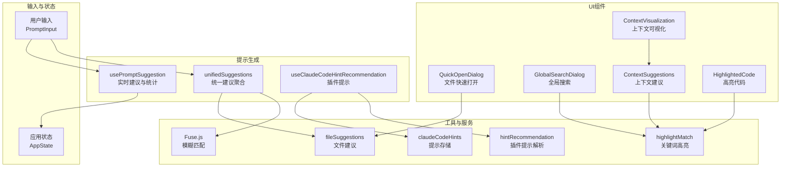
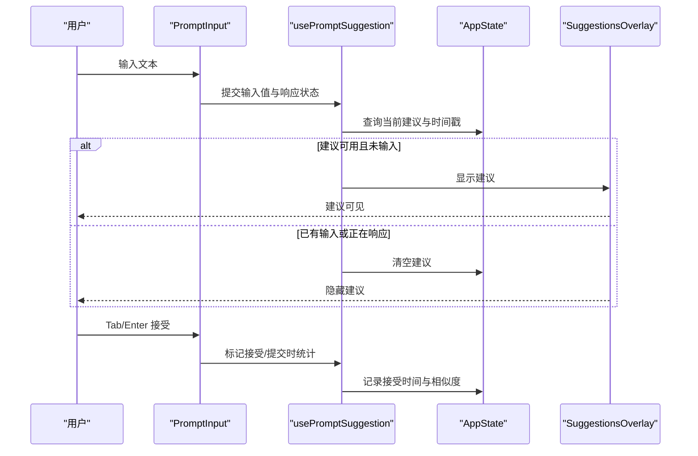
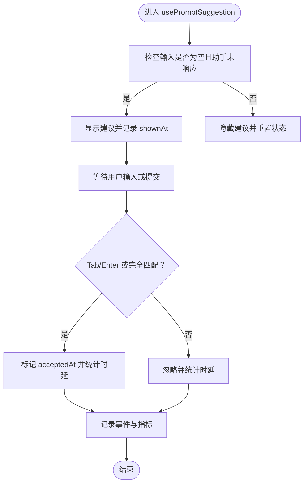
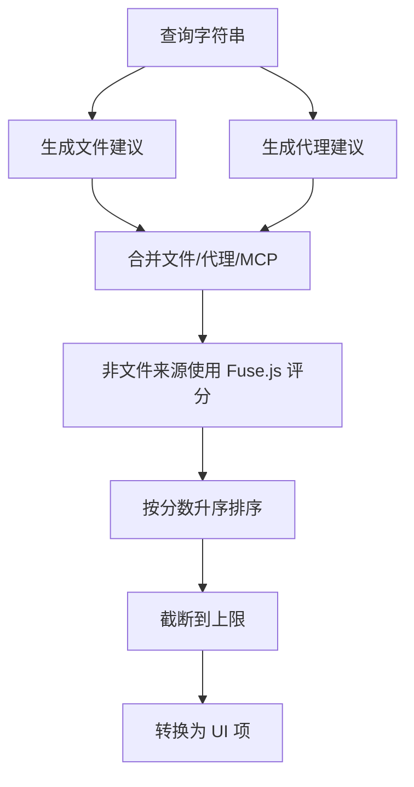
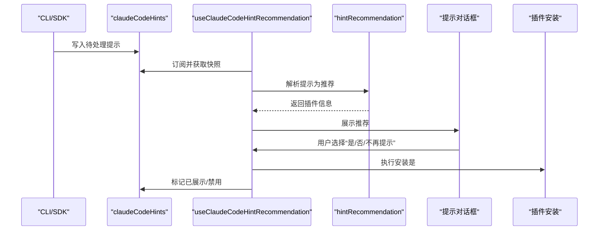
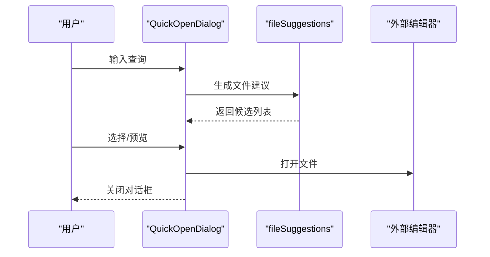
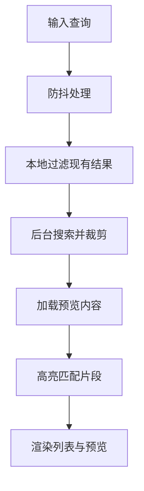
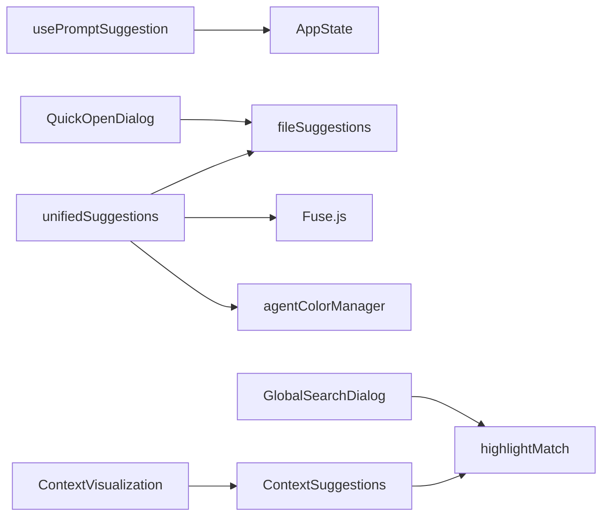

# 智能提示系统

<cite>
**本文档引用的文件**
- [usePromptSuggestion.ts](file://src/hooks/usePromptSuggestion.ts)
- [unifiedSuggestions.ts](file://src/hooks/unifiedSuggestions.ts)
- [useClaudeCodeHintRecommendation.tsx](file://src/hooks/useClaudeCodeHintRecommendation.tsx)
- [print.ts](file://src/cli/print.ts)
- [QuickOpenDialog.tsx](file://src/components/QuickOpenDialog.tsx)
- [GlobalSearchDialog.tsx](file://src/components/GlobalSearchDialog.tsx)
- [ContextVisualization.tsx](file://src/components/ContextVisualization.tsx)
- [ContextSuggestions.tsx](file://src/components/ContextSuggestions.tsx)
- [HighlightedCode.tsx](file://src/components/HighlightedCode.tsx)
- [searchHighlight.ts](file://src/ink/searchHighlight.ts)
- [highlightMatch.tsx](file://src/utils/highlightMatch.tsx)
- [claudeCodeHints.ts](file://src/utils/claudeCodeHints.ts)
- [hintRecommendation.ts](file://src/utils/plugins/hintRecommendation.ts)
- [fileSuggestions.ts](file://src/hooks/fileSuggestions.ts)
- [agentColorManager.ts](file://src/tools/AgentTool/agentColorManager.ts)
- [loadAgentsDir.ts](file://src/tools/AgentTool/loadAgentsDir.ts)
- [format.ts](file://src/utils/format.ts)
- [textHighlighting.ts](file://src/utils/textHighlighting.ts)
- [AppState.tsx](file://src/state/AppState.tsx)
- [AppStateStore.ts](file://src/state/AppStateStore.ts)
- [AppStateSelectors.ts](file://src/state/selectors.ts)
- [store.ts](file://src/state/store.ts)
- [AppState.ts](file://src/state/AppState.ts)
- [AppStateStore.ts](file://src/state/AppStateStore.ts)
- [AppStateSelectors.ts](file://src/state/selectors.ts)
- [store.ts](file://src/state/store.ts)
- [AppState.ts](file://src/state/AppState.ts)
- [AppStateStore.ts](file://src/state/AppStateStore.ts)
- [AppStateSelectors.ts](file://src/state/selectors.ts)
- [store.ts](file://src/state/store.ts)
</cite>

## 目录
1. [简介](#简介)
2. [项目结构](#项目结构)
3. [核心组件](#核心组件)
4. [架构总览](#架构总览)
5. [详细组件分析](#详细组件分析)
6. [依赖关系分析](#依赖关系分析)
7. [性能考虑](#性能考虑)
8. [故障排除指南](#故障排除指南)
9. [结论](#结论)
10. [附录](#附录)

## 简介
本文件系统性地解析智能提示系统的设计与实现，覆盖提示生成算法、实时建议机制、命令补全、文件路径建议、团队成员提及以及关键词高亮等能力。文档还阐述了配置选项、触发条件与显示策略，并提供可扩展的自定义方案与第三方集成方法，最后给出性能优化、缓存策略与用户体验改进建议。

## 项目结构
智能提示系统由前端 Hook、CLI 输出流、对话框组件与状态管理共同构成，围绕输入上下文动态生成建议并进行高亮展示。

**图表来源**
- [usePromptSuggestion.ts:15-178](file://src/hooks/usePromptSuggestion.ts#L15-L178)
- [unifiedSuggestions.ts:111-203](file://src/hooks/unifiedSuggestions.ts#L111-L203)
- [useClaudeCodeHintRecommendation.tsx:24-129](file://src/hooks/useClaudeCodeHintRecommendation.tsx#L24-L129)
- [QuickOpenDialog.tsx:24-243](file://src/components/QuickOpenDialog.tsx#L24-L243)
- [GlobalSearchDialog.tsx:130-245](file://src/components/GlobalSearchDialog.tsx#L130-L245)
- [ContextVisualization.tsx:1-12](file://src/components/ContextVisualization.tsx#L1-L12)
- [ContextSuggestions.tsx](file://src/components/ContextSuggestions.tsx)
- [HighlightedCode.tsx](file://src/components/HighlightedCode.tsx)
- [fileSuggestions.ts](file://src/hooks/fileSuggestions.ts)
- [highlightMatch.tsx](file://src/utils/highlightMatch.tsx)
- [claudeCodeHints.ts](file://src/utils/claudeCodeHints.ts)
- [hintRecommendation.ts](file://src/utils/plugins/hintRecommendation.ts)

**章节来源**
- [usePromptSuggestion.ts:1-178](file://src/hooks/usePromptSuggestion.ts#L1-L178)
- [unifiedSuggestions.ts:1-203](file://src/hooks/unifiedSuggestions.ts#L1-L203)
- [useClaudeCodeHintRecommendation.tsx:1-129](file://src/hooks/useClaudeCodeHintRecommendation.tsx#L1-L129)

## 核心组件
- 实时提示钩子：负责在输入空闲时生成建议、记录曝光与接受行为、统计交互时延与相似度。
- 统一建议聚合：整合文件、MCP 资源与代理三类来源，使用不同策略评分并排序。
- 插件提示钩子：从 CLI/SDK 的提示信号中提取推荐，支持一次性展示与安装流程。
- 文件与全局搜索对话框：提供快速文件打开与全文检索，结合高亮与预览。
- 上下文可视化与高亮：对上下文片段与搜索结果进行高亮渲染。

**章节来源**
- [usePromptSuggestion.ts:15-178](file://src/hooks/usePromptSuggestion.ts#L15-L178)
- [unifiedSuggestions.ts:111-203](file://src/hooks/unifiedSuggestions.ts#L111-L203)
- [useClaudeCodeHintRecommendation.tsx:24-129](file://src/hooks/useClaudeCodeHintRecommendation.tsx#L24-L129)
- [QuickOpenDialog.tsx:24-243](file://src/components/QuickOpenDialog.tsx#L24-L243)
- [GlobalSearchDialog.tsx:130-245](file://src/components/GlobalSearchDialog.tsx#L130-L245)
- [ContextVisualization.tsx:1-12](file://src/components/ContextVisualization.tsx#L1-L12)

## 架构总览
提示系统通过“输入监听—建议生成—状态更新—UI渲染”的闭环工作。CLI 输出流在 SDK 模式下会发出提示消息，前端 Hook 接收后写入应用状态并触发 UI 展示；同时，用户在输入框中的操作也会驱动实时建议的出现与消失。

**图表来源**
- [usePromptSuggestion.ts:38-178](file://src/hooks/usePromptSuggestion.ts#L38-L178)
- [print.ts:2286-2342](file://src/cli/print.ts#L2286-L2342)

**章节来源**
- [usePromptSuggestion.ts:38-178](file://src/hooks/usePromptSuggestion.ts#L38-L178)
- [print.ts:2286-2342](file://src/cli/print.ts#L2286-L2342)

## 详细组件分析

### 实时提示与统计（usePromptSuggestion）
- 触发条件：当助手未在响应且输入为空时显示建议；一旦用户开始输入或助手响应，立即隐藏建议。
- 行为记录：捕获首次按键时间、焦点状态、接受方式（Tab/Enter）与相似度，用于后续分析。
- 状态管理：通过 AppState 写入建议文本、promptId、generationRequestId 与时间戳；支持重置与接受标记。

**图表来源**
- [usePromptSuggestion.ts:38-178](file://src/hooks/usePromptSuggestion.ts#L38-L178)

**章节来源**
- [usePromptSuggestion.ts:15-178](file://src/hooks/usePromptSuggestion.ts#L15-L178)

### 统一建议聚合（unifiedSuggestions）
- 来源整合：文件建议（来自文件索引）、MCP 资源（服务器+URI）、代理（agentType+描述）。
- 评分与排序：
  - 文件建议：沿用底层评分（nucleo），若缺失则默认中间分。
  - 非文件建议：使用 Fuse.js 进行多字段加权模糊匹配，权重包括 displayText/name/server/description/agentType。
- 结果限制：最多返回固定数量的建议项，统一转换为 UI 可渲染的结构。

**图表来源**
- [unifiedSuggestions.ts:111-203](file://src/hooks/unifiedSuggestions.ts#L111-L203)

**章节来源**
- [unifiedSuggestions.ts:111-203](file://src/hooks/unifiedSuggestions.ts#L111-L203)

### 插件提示与安装（useClaudeCodeHintRecommendation）
- 数据来源：CLI/SDK 通过标准错误输出的提示标签，系统将其暂存并在合适时机解析。
- 展示策略：每个插件提示仅展示一次，避免重复打扰；用户可选择安装或关闭提示。
- 安装流程：调用市场安装接口，安装成功后通知用户。

**图表来源**
- [useClaudeCodeHintRecommendation.tsx:24-129](file://src/hooks/useClaudeCodeHintRecommendation.tsx#L24-L129)
- [claudeCodeHints.ts](file://src/utils/claudeCodeHints.ts)
- [hintRecommendation.ts](file://src/utils/plugins/hintRecommendation.ts)

**章节来源**
- [useClaudeCodeHintRecommendation.tsx:1-129](file://src/hooks/useClaudeCodeHintRecommendation.tsx#L1-L129)

### 文件路径建议与快速打开（QuickOpenDialog）
- 功能：模糊搜索文件路径，支持右侧/底部预览，插入或打开文件。
- 交互：输入变化触发异步建议生成；Tab/Shift+Tab 切换动作；插入时可选择是否添加提及前缀。
- 性能：使用 AbortController 取消过时请求，避免竞态；根据终端宽度动态布局。

**图表来源**
- [QuickOpenDialog.tsx:70-167](file://src/components/QuickOpenDialog.tsx#L70-L167)

**章节来源**
- [QuickOpenDialog.tsx:24-243](file://src/components/QuickOpenDialog.tsx#L24-L243)

### 全局搜索与关键词高亮（GlobalSearchDialog）
- 功能：全文搜索日志/内容，支持高亮匹配片段与行号定位。
- 高亮：使用专用高亮模块对匹配文本进行着色，提升可读性。
- 性能：带防抖与裁剪策略，长文本仅保留首尾部分以控制渲染成本。

**图表来源**
- [GlobalSearchDialog.tsx:130-245](file://src/components/GlobalSearchDialog.tsx#L130-L245)
- [highlightMatch.tsx](file://src/utils/highlightMatch.tsx)
- [searchHighlight.ts](file://src/ink/searchHighlight.ts)

**章节来源**
- [GlobalSearchDialog.tsx:130-245](file://src/components/GlobalSearchDialog.tsx#L130-L245)

### 上下文可视化与高亮渲染（ContextVisualization）
- 功能：基于上下文分析生成建议卡片，结合路径显示与格式化工具。
- 高亮：与通用高亮模块协同，确保一致的视觉风格。

**章节来源**
- [ContextVisualization.tsx:1-12](file://src/components/ContextVisualization.tsx#L1-L12)
- [ContextSuggestions.tsx](file://src/components/ContextSuggestions.tsx)
- [HighlightedCode.tsx](file://src/components/HighlightedCode.tsx)

## 依赖关系分析
- 组件耦合：
  - usePromptSuggestion 依赖 AppState 与终端焦点状态，避免循环依赖。
  - unifiedSuggestions 依赖 fileSuggestions、Fuse.js 与代理颜色管理。
  - QuickOpenDialog 依赖文件读取与外部编辑器打开。
- 外部依赖：
  - Fuse.js：用于非文件来源的模糊匹配与评分。
  - React Hooks：useMemo、useEffect、useRef 等保证渲染与副作用可控。
- 状态管理：
  - AppStateStore/Selectors 提供集中式状态访问与订阅。

**图表来源**
- [usePromptSuggestion.ts:1-178](file://src/hooks/usePromptSuggestion.ts#L1-L178)
- [unifiedSuggestions.ts:1-203](file://src/hooks/unifiedSuggestions.ts#L1-L203)
- [QuickOpenDialog.tsx:24-243](file://src/components/QuickOpenDialog.tsx#L24-L243)
- [GlobalSearchDialog.tsx:130-245](file://src/components/GlobalSearchDialog.tsx#L130-L245)
- [ContextVisualization.tsx:1-12](file://src/components/ContextVisualization.tsx#L1-L12)

**章节来源**
- [unifiedSuggestions.ts:1-203](file://src/hooks/unifiedSuggestions.ts#L1-L203)
- [QuickOpenDialog.tsx:24-243](file://src/components/QuickOpenDialog.tsx#L24-L243)
- [GlobalSearchDialog.tsx:130-245](file://src/components/GlobalSearchDialog.tsx#L130-L245)

## 性能考虑
- 异步与取消：
  - 使用 AbortController 取消过时的文件读取与搜索请求，避免 UI 抖动与资源浪费。
- 防抖与裁剪：
  - 全局搜索对查询进行防抖；长文本仅保留首尾片段，降低渲染压力。
- 评分与排序：
  - 文件建议直接复用底层评分；非文件建议使用 Fuse.js 加权评分并限制结果数量。
- 缓存策略：
  - 建议状态在 AppState 中集中管理，避免重复计算；CLI 输出流中对建议进行延迟发射与抑制策略，减少频繁更新。
- 渲染优化：
  - React.memo 与缓存内部状态，减少不必要的重渲染。

[本节为通用性能指导，无需特定文件引用]

## 故障排除指南
- 建议不显示：
  - 检查助手是否处于响应状态或输入是否为空。
  - 查看 AppState 中的建议字段是否被重置。
- 建议接受统计异常：
  - 确认 Tab/Enter 是否正确触发标记；检查相似度与时间戳是否被记录。
- 文件建议无响应：
  - 确认 fileSuggestions 是否正常返回；检查 AbortController 是否提前中断。
- 插件提示未出现：
  - 检查 claudeCodeHints 存储与 hintRecommendation 解析逻辑；确认用户未禁用提示。

**章节来源**
- [usePromptSuggestion.ts:110-178](file://src/hooks/usePromptSuggestion.ts#L110-L178)
- [print.ts:2286-2342](file://src/cli/print.ts#L2286-L2342)
- [useClaudeCodeHintRecommendation.tsx:24-129](file://src/hooks/useClaudeCodeHintRecommendation.tsx#L24-L129)

## 结论
该智能提示系统通过“输入监听—建议生成—状态更新—UI渲染”的闭环设计，实现了命令补全、文件路径建议、团队成员提及与关键词高亮的综合体验。其统一建议聚合与插件提示机制提供了良好的扩展性，配合防抖、取消与缓存策略，兼顾了性能与稳定性。未来可在更多来源（如历史会话、知识库）与更细粒度的个性化权重上进一步增强。

## 附录

### 配置选项与触发条件
- 实时建议
  - 触发：输入为空且助手未响应。
  - 终止：输入变化或助手开始响应。
- 统一建议
  - 来源：文件、MCP 资源、代理。
  - 评分：文件建议复用底层评分；非文件建议使用 Fuse.js 加权评分。
- 插件提示
  - 触发：CLI/SDK 输出提示标签。
  - 展示：每个插件提示仅一次；支持“不再提示”。
- 文件/全局搜索
  - 触发：输入查询；支持预览与插入。
  - 高亮：匹配片段高亮显示。

**章节来源**
- [usePromptSuggestion.ts:38-178](file://src/hooks/usePromptSuggestion.ts#L38-L178)
- [unifiedSuggestions.ts:111-203](file://src/hooks/unifiedSuggestions.ts#L111-L203)
- [useClaudeCodeHintRecommendation.tsx:24-129](file://src/hooks/useClaudeCodeHintRecommendation.tsx#L24-L129)
- [QuickOpenDialog.tsx:70-167](file://src/components/QuickOpenDialog.tsx#L70-L167)
- [GlobalSearchDialog.tsx:130-245](file://src/components/GlobalSearchDialog.tsx#L130-L245)

### 自定义扩展与第三方集成
- 新增建议来源
  - 在 unifiedSuggestions 中新增类型与映射函数，并在聚合阶段加入评分与排序。
- 集成外部工具
  - 将外部 API 的结果转换为统一结构，参与 Fuse.js 评分或直接作为文件建议。
- 插件提示扩展
  - 通过 CLI/SDK 输出新的提示标签，使用 hintRecommendation 解析并接入安装流程。

**章节来源**
- [unifiedSuggestions.ts:111-203](file://src/hooks/unifiedSuggestions.ts#L111-L203)
- [hintRecommendation.ts](file://src/utils/plugins/hintRecommendation.ts)

### 用户体验改进建议
- 建议优先级：根据使用频率与上下文相关性调整显示顺序。
- 交互反馈：增加建议接受后的微反馈（如淡入淡出动画）。
- 键盘快捷键：为建议接受与跳过提供明确快捷键提示。
- 无障碍：确保高亮对比度与键盘导航可达性。

[本节为通用建议，无需特定文件引用]