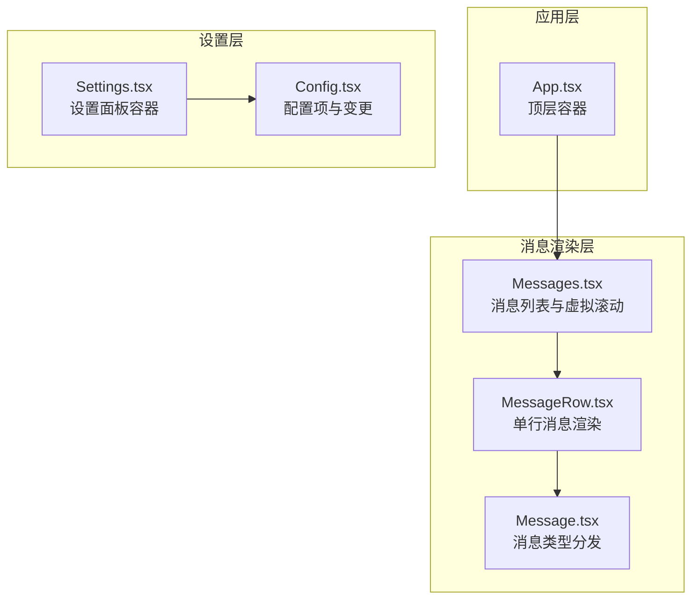
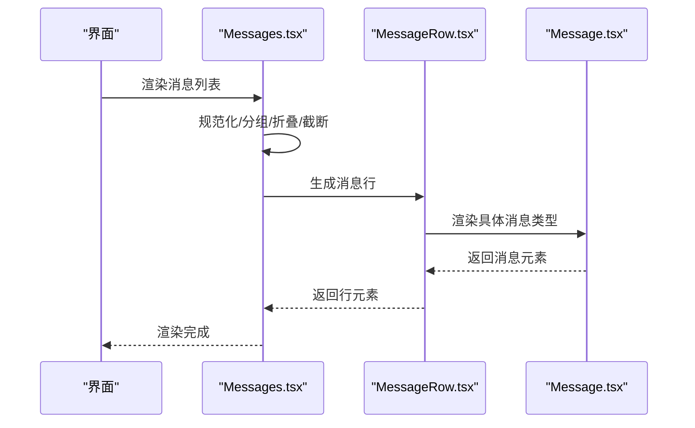
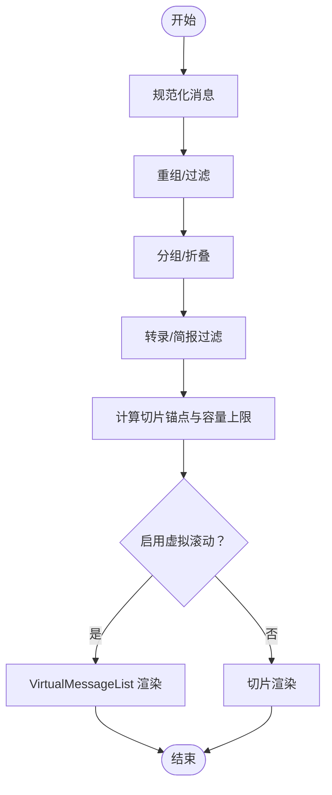
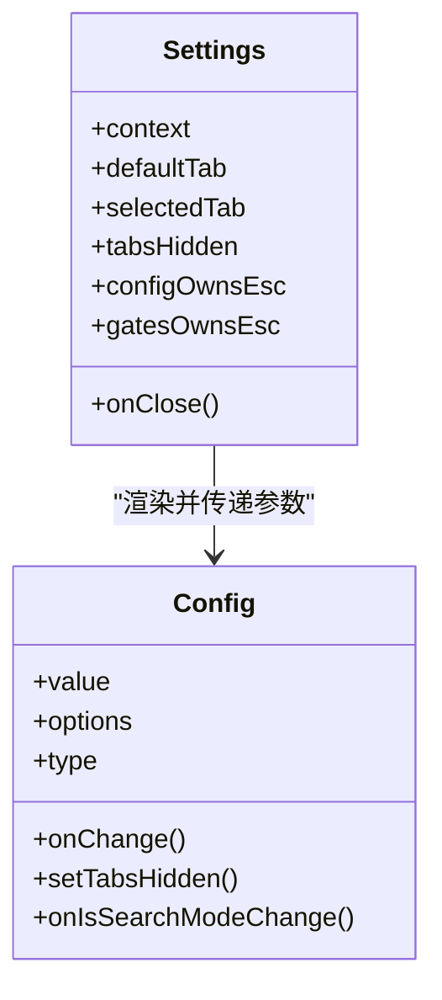
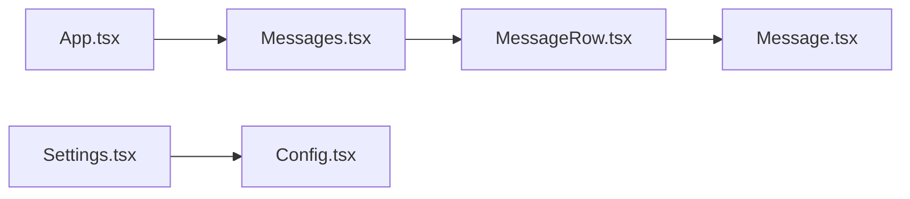

# 核心组件

<cite>
**本文引用的文件**
- [App.tsx](file://src/components/App.tsx)
- [Messages.tsx](file://src/components/Messages.tsx)
- [Message.tsx](file://src/components/Message.tsx)
- [MessageRow.tsx](file://src/components/MessageRow.tsx)
- [Settings.tsx](file://src/components/Settings/Settings.tsx)
- [Config.tsx](file://src/components/Settings/Config.tsx)
</cite>

## 目录
1. [简介](#简介)
2. [项目结构](#项目结构)
3. [核心组件](#核心组件)
4. [架构总览](#架构总览)
5. [详细组件分析](#详细组件分析)
6. [依赖关系分析](#依赖关系分析)
7. [性能考量](#性能考量)
8. [故障排查指南](#故障排查指南)
9. [结论](#结论)
10. [附录](#附录)

## 简介
本文件聚焦于应用容器与消息组件系统，以及设置组件的功能与配置项。目标是为开发者提供可操作的组件使用指南：涵盖组件职责、属性、事件、状态管理、交互流程与自定义方式，并通过图示帮助理解组件间的协作关系。

## 项目结构
围绕“会话交互”这一主线，核心文件分布如下：
- 应用容器：提供全局上下文（FPS指标、统计、应用状态）
- 消息渲染体系：Messages 负责消息分组/折叠/截断与虚拟滚动；MessageRow 渲染单行消息；Message 负责具体消息类型的渲染
- 设置体系：Settings 作为标签页容器，Config 提供具体的配置项与变更逻辑

**图表来源**
- [App.tsx:19-55](file://src/components/App.tsx#L19-L55)
- [Messages.tsx:341-721](file://src/components/Messages.tsx#L341-L721)
- [MessageRow.tsx:93-287](file://src/components/MessageRow.tsx#L93-L287)
- [Message.tsx:58-355](file://src/components/Message.tsx#L58-L355)
- [Settings.tsx:22-129](file://src/components/Settings/Settings.tsx#L22-L129)
- [Config.tsx:85-166](file://src/components/Settings/Config.tsx#L85-L166)

**章节来源**
- [App.tsx:1-56](file://src/components/App.tsx#L1-L56)
- [Messages.tsx:1-834](file://src/components/Messages.tsx#L1-L834)
- [Message.tsx:1-627](file://src/components/Message.tsx#L1-L627)
- [MessageRow.tsx:1-383](file://src/components/MessageRow.tsx#L1-L383)
- [Settings.tsx:1-137](file://src/components/Settings/Settings.tsx#L1-L137)
- [Config.tsx:1-1822](file://src/components/Settings/Config.tsx#L1-L1822)

## 核心组件

### 应用容器 App.tsx
- 职责
  - 为整个交互会话树提供三层上下文：FPS 指标、统计信息、应用状态
  - 通过 Provider 将状态与度量注入子组件树
- 关键属性
  - getFpsMetrics: 获取 FPS 指标的函数
  - stats: 统计存储（可选）
  - initialState: 初始应用状态
  - children: 子组件树
- 性能注意
  - 使用 React 编译器缓存策略，避免不必要的重渲染

**章节来源**
- [App.tsx:8-13](file://src/components/App.tsx#L8-L13)
- [App.tsx:19-55](file://src/components/App.tsx#L19-L55)

### 消息组件系统
- Messages.tsx
  - 负责消息的规范化、分组、折叠、截断、搜索索引、虚拟滚动等
  - 支持“简报模式”过滤与文本去重
  - 提供“未读分隔线”、“转录模式”、“思考内容可见性”等高级特性
  - 对非虚拟滚动路径设置容量上限，防止内存与渲染压力
- MessageRow.tsx
  - 单条消息的渲染包装，处理“是否连续用户消息”、“是否有后续内容”等布局细节
  - 基于 shouldRenderStatically 与 isMessageStreaming/allToolsResolved 进行保守记忆化
- Message.tsx
  - 将消息按类型分发到具体渲染组件（文本、工具调用、附件、系统消息等）
  - 处理“思考块”显示控制、bash 输出展开、Advisor 结果渲染等

**章节来源**
- [Messages.tsx:207-275](file://src/components/Messages.tsx#L207-L275)
- [Messages.tsx:341-721](file://src/components/Messages.tsx#L341-L721)
- [MessageRow.tsx:15-38](file://src/components/MessageRow.tsx#L15-L38)
- [MessageRow.tsx:93-287](file://src/components/MessageRow.tsx#L93-L287)
- [Message.tsx:32-57](file://src/components/Message.tsx#L32-L57)
- [Message.tsx:58-355](file://src/components/Message.tsx#L58-L355)

### 设置组件
- Settings.tsx
  - 作为设置面板的容器，提供“状态/配置/用量/通道”等标签页
  - 管理 ESC 键绑定、内容高度、标签切换、模态与终端尺寸适配
- Config.tsx
  - 定义大量配置项（布尔、枚举、受管枚举），支持即时生效与变更追踪
  - 与 AppState、全局配置、Per-source 设置协同工作，支持回退（Escape）与持久化

**章节来源**
- [Settings.tsx:15-21](file://src/components/Settings/Settings.tsx#L15-L21)
- [Settings.tsx:22-129](file://src/components/Settings/Settings.tsx#L22-L129)
- [Config.tsx:51-84](file://src/components/Settings/Config.tsx#L51-L84)
- [Config.tsx:85-166](file://src/components/Settings/Config.tsx#L85-L166)

## 架构总览
消息渲染链路从 Messages 出发，经过 MessageRow 包装，最终由 Message 分发到具体消息类型组件。设置面板由 Settings 容器承载，Config 提供具体配置项与变更逻辑。

**图表来源**
- [Messages.tsx:475-543](file://src/components/Messages.tsx#L475-L543)
- [MessageRow.tsx:232-254](file://src/components/MessageRow.tsx#L232-L254)
- [Message.tsx:58-355](file://src/components/Message.tsx#L58-L355)

## 详细组件分析

### App.tsx：顶层容器
- 上下文提供者
  - FPS 指标提供者
  - 统计信息提供者
  - 应用状态提供者
- 设计要点
  - 以最小重渲染为目标，利用编译器缓存
  - 将初始化状态与变更回调向下传递

**章节来源**
- [App.tsx:19-55](file://src/components/App.tsx#L19-L55)

### Messages.tsx：消息列表与虚拟滚动
- 数据管线
  - 规范化消息数组
  - 重组顺序、过滤进度消息、构建查找表
  - 分组/折叠/截断（转录模式/简报模式）
  - 计算切片锚点，限制非虚拟滚动路径的消息数量
- 渲染策略
  - 虚拟滚动：基于 ScrollBox 的高度缓存与可见性管理
  - 非虚拟滚动：按容量上限切片，避免内存与渲染压力
- 交互与可见性
  - “未读分隔线”定位
  - “思考内容”可见性控制（转录模式隐藏历史思考）
  - 流式工具调用与文本预览的渲染

**图表来源**
- [Messages.tsx:475-543](file://src/components/Messages.tsx#L475-L543)
- [Messages.tsx:299-340](file://src/components/Messages.tsx#L299-L340)

**章节来源**
- [Messages.tsx:341-721](file://src/components/Messages.tsx#L341-L721)

### MessageRow.tsx：单行消息渲染
- 关键能力
  - 判断“是否连续用户消息”，决定边距与布局
  - 计算“是否有后续内容”，用于保持折叠读/搜组的加载状态
  - 基于 shouldRenderStatically 与 isMessageStreaming/allToolsResolved 的保守记忆化
- 元数据展示
  - 时间戳与模型信息在转录模式下显示

**章节来源**
- [MessageRow.tsx:93-287](file://src/components/MessageRow.tsx#L93-L287)
- [MessageRow.tsx:342-382](file://src/components/MessageRow.tsx#L342-L382)

### Message.tsx：消息类型分发
- 类型分发
  - 用户消息（文本/图片/工具结果）
  - 助手消息（文本/思考/工具调用/Advisor 结果）
  - 系统消息（紧凑边界/本地命令/其他）
  - 工具使用分组与折叠读/搜组
- 特殊处理
  - bash 输出展开（ExpandShellOutputProvider）
  - 思考块可见性（转录模式隐藏历史思考）
  - Connector 文本与 Advisor 结果的特殊渲染

**章节来源**
- [Message.tsx:58-355](file://src/components/Message.tsx#L58-L355)

### Settings.tsx 与 Config.tsx：设置面板与配置项
- Settings.tsx
  - 标签页容器，ESC 键处理，内容高度计算，模态/终端尺寸适配
- Config.tsx
  - 定义配置项类型（布尔/枚举/受管枚举），变更持久化与即时生效
  - 与 AppState、全局配置、Per-source 设置协同，支持回退（Escape）
  - 变更追踪（changes），用于审计与提示

**图表来源**
- [Settings.tsx:15-21](file://src/components/Settings/Settings.tsx#L15-L21)
- [Settings.tsx:22-129](file://src/components/Settings/Settings.tsx#L22-L129)
- [Config.tsx:51-84](file://src/components/Settings/Config.tsx#L51-L84)
- [Config.tsx:85-166](file://src/components/Settings/Config.tsx#L85-L166)

**章节来源**
- [Settings.tsx:22-129](file://src/components/Settings/Settings.tsx#L22-L129)
- [Config.tsx:85-166](file://src/components/Settings/Config.tsx#L85-L166)

## 依赖关系分析
- App.tsx 依赖状态与度量提供者，向上游提供统一上下文
- Messages.tsx 依赖消息工具集（分组/折叠/查找）、虚拟列表、终端尺寸、快捷键显示等
- MessageRow.tsx 依赖消息工具集与静态渲染判定
- Message.tsx 依赖消息类型与各子消息组件
- Settings.tsx 依赖标签页与键盘绑定，Config.tsx 依赖 AppState、全局配置与 Per-source 设置

**图表来源**
- [App.tsx:19-55](file://src/components/App.tsx#L19-L55)
- [Messages.tsx:341-721](file://src/components/Messages.tsx#L341-L721)
- [MessageRow.tsx:93-287](file://src/components/MessageRow.tsx#L93-L287)
- [Message.tsx:58-355](file://src/components/Message.tsx#L58-L355)
- [Settings.tsx:22-129](file://src/components/Settings/Settings.tsx#L22-L129)
- [Config.tsx:85-166](file://src/components/Settings/Config.tsx#L85-L166)

**章节来源**
- [App.tsx:19-55](file://src/components/App.tsx#L19-L55)
- [Messages.tsx:341-721](file://src/components/Messages.tsx#L341-L721)
- [MessageRow.tsx:93-287](file://src/components/MessageRow.tsx#L93-L287)
- [Message.tsx:58-355](file://src/components/Message.tsx#L58-L355)
- [Settings.tsx:22-129](file://src/components/Settings/Settings.tsx#L22-L129)
- [Config.tsx:85-166](file://src/components/Settings/Config.tsx#L85-L166)

## 性能考量
- 虚拟滚动优先：在全屏/滚动箱可用时启用虚拟列表，避免一次性挂载大量 Fiber
- 非虚拟滚动容量上限：防止超大历史导致内存与渲染压力
- 记忆化与保守比较：MessageRow 与 Message 使用保守记忆化，仅在确定不会变化时跳过重渲染
- 流式渲染：流式工具调用与文本预览采用合成消息，避免频繁键变化导致的组件重挂载

[本节为通用指导，不直接分析具体文件]

## 故障排查指南
- 消息渲染异常
  - 检查消息是否被折叠/截断（转录模式/简报模式）
  - 确认 isMessageStreaming/allToolsResolved 是否导致静态渲染误判
- 性能问题
  - 启用虚拟滚动或调整容量上限
  - 检查是否有不必要的 props 变化触发重渲染
- 设置不生效
  - 确认变更写入了正确的配置源（全局/用户/本地）
  - 检查 AppState 同步与回退逻辑（Escape）

[本节为通用指导，不直接分析具体文件]

## 结论
本文梳理了应用容器 App.tsx、消息渲染体系（Messages/MessageRow/Message）与设置体系（Settings/Config）的职责、属性、事件与状态管理。通过图示与分层说明，开发者可以快速理解组件交互、定制渲染策略与配置项，并据此进行扩展与优化。

[本节为总结性内容，不直接分析具体文件]

## 附录

### 组件使用示例与自定义方法（概要）
- 自定义消息渲染
  - 在 Message.tsx 的类型分支中添加新的消息类型分支，并返回对应的子组件
  - 如需静态渲染，确保 shouldRenderStatically 与 areMessagePropsEqual 的判断逻辑正确
- 自定义设置项
  - 在 Config.tsx 中新增 Setting 条目，选择布尔/枚举/受管枚举类型
  - 实现 onChange 并调用 updateSettingsForSource 或 saveGlobalConfig
  - 如需即时生效，同步更新 AppState
- 自定义虚拟滚动行为
  - 在 Messages.tsx 中调整虚拟滚动开关条件与切片策略
  - 注意与渲染范围 renderRange 的配合，避免重复计算

[本节为通用指导，不直接分析具体文件]