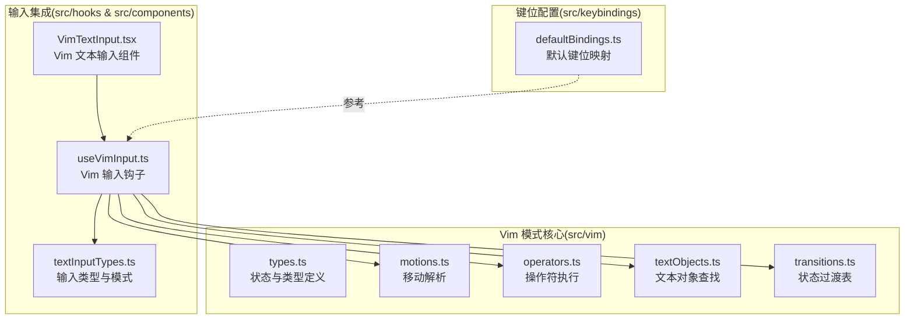
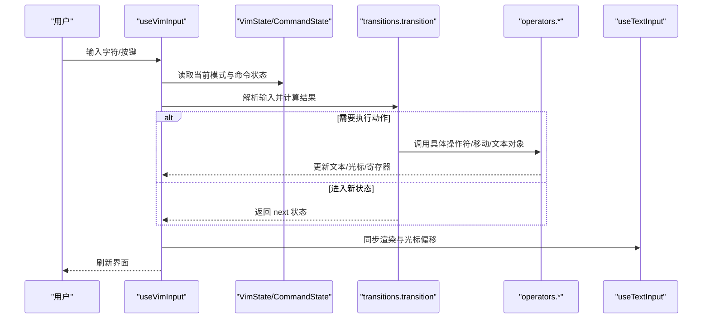
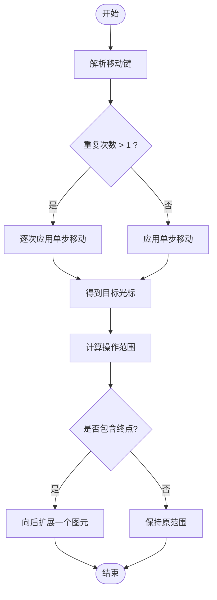
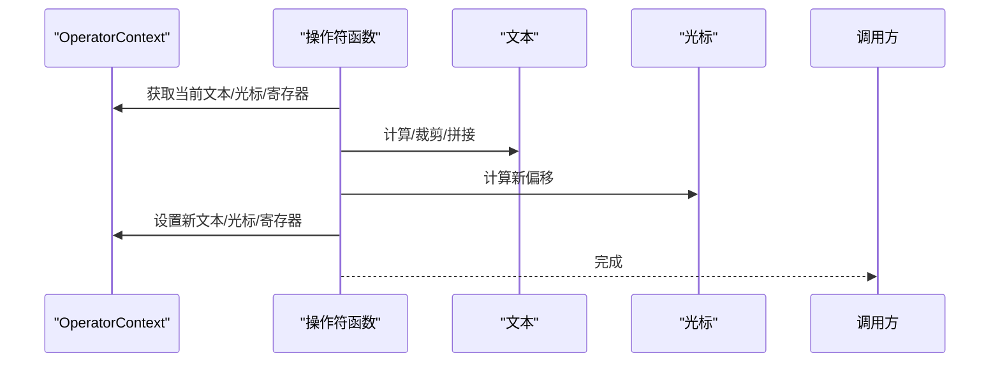
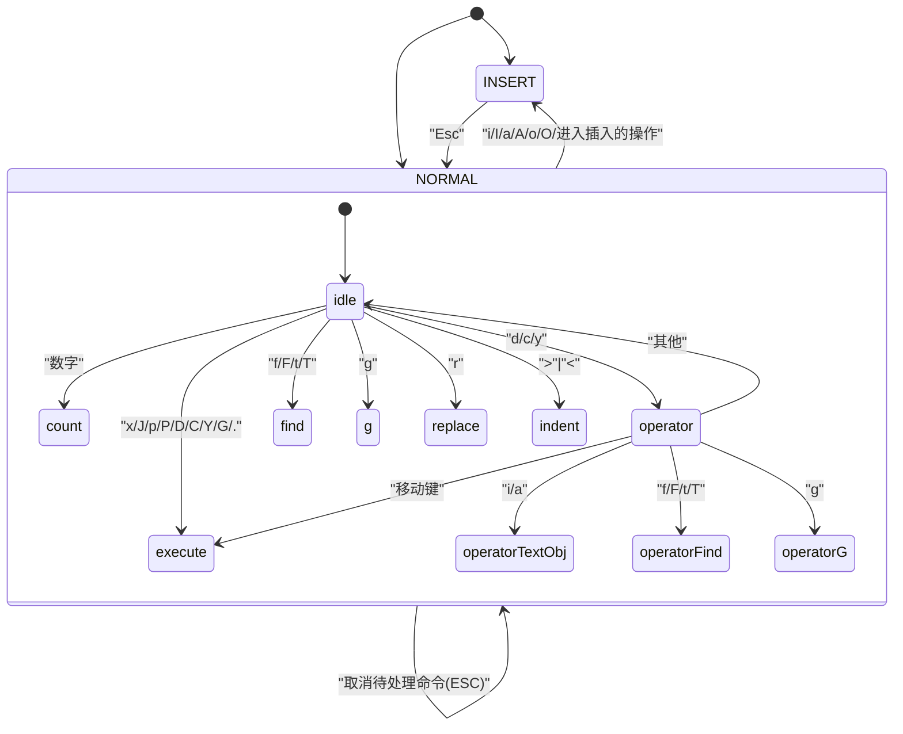
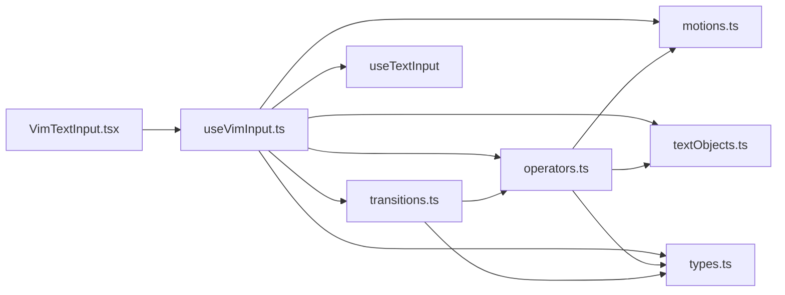

# Vim 模式

<cite>
**本文引用的文件**
- [src/vim/types.ts](file://src/vim/types.ts)
- [src/vim/motions.ts](file://src/vim/motions.ts)
- [src/vim/operators.ts](file://src/vim/operators.ts)
- [src/vim/textObjects.ts](file://src/vim/textObjects.ts)
- [src/vim/transitions.ts](file://src/vim/transitions.ts)
- [src/hooks/useVimInput.ts](file://src/hooks/useVimInput.ts)
- [src/components/VimTextInput.tsx](file://src/components/VimTextInput.tsx)
- [src/types/textInputTypes.ts](file://src/types/textInputTypes.ts)
- [src/keybindings/defaultBindings.ts](file://src/keybindings/defaultBindings.ts)
- [README.md](file://README.md)
</cite>

## 目录
1. [简介](#简介)
2. [项目结构](#项目结构)
3. [核心组件](#核心组件)
4. [架构总览](#架构总览)
5. [详细组件分析](#详细组件分析)
6. [依赖关系分析](#依赖关系分析)
7. [性能考量](#性能考量)
8. [故障排查指南](#故障排查指南)
9. [结论](#结论)
10. [附录：使用示例与快捷键参考](#附录使用示例与快捷键参考)

## 简介
本文件系统性阐述 Claude Code 中 Vim 模式的设计与实现，覆盖命令解析、状态管理、模式切换、命令支持范围（移动、操作符、文本对象、插入模式等）、与现有输入系统的集成方式、配置与自定义、最佳实践与常见问题。目标读者为 Vim 用户与编辑器开发者。

## 项目结构
Vim 模式位于 src/vim 目录，围绕“状态机 + 过渡函数 + 纯函数运算”的分层设计组织，配合 hooks/useVimInput.ts 与 components/VimTextInput.tsx 将状态机接入到终端输入系统中。



**图表来源**
- [src/vim/types.ts:1-200](file://src/vim/types.ts#L1-L200)
- [src/vim/motions.ts:1-83](file://src/vim/motions.ts#L1-L83)
- [src/vim/operators.ts:1-557](file://src/vim/operators.ts#L1-L557)
- [src/vim/textObjects.ts:1-187](file://src/vim/textObjects.ts#L1-L187)
- [src/vim/transitions.ts:1-491](file://src/vim/transitions.ts#L1-L491)
- [src/hooks/useVimInput.ts:1-317](file://src/hooks/useVimInput.ts#L1-L317)
- [src/components/VimTextInput.tsx:1-140](file://src/components/VimTextInput.tsx#L1-L140)
- [src/types/textInputTypes.ts:207-260](file://src/types/textInputTypes.ts#L207-L260)
- [src/keybindings/defaultBindings.ts:1-341](file://src/keybindings/defaultBindings.ts#L1-L341)

**章节来源**
- [src/vim/types.ts:1-200](file://src/vim/types.ts#L1-L200)
- [src/vim/motions.ts:1-83](file://src/vim/motions.ts#L1-L83)
- [src/vim/operators.ts:1-557](file://src/vim/operators.ts#L1-L557)
- [src/vim/textObjects.ts:1-187](file://src/vim/textObjects.ts#L1-L187)
- [src/vim/transitions.ts:1-491](file://src/vim/transitions.ts#L1-L491)
- [src/hooks/useVimInput.ts:1-317](file://src/hooks/useVimInput.ts#L1-L317)
- [src/components/VimTextInput.tsx:1-140](file://src/components/VimTextInput.tsx#L1-L140)
- [src/types/textInputTypes.ts:207-260](file://src/types/textInputTypes.ts#L207-L260)
- [src/keybindings/defaultBindings.ts:1-341](file://src/keybindings/defaultBindings.ts#L1-L341)

## 核心组件
- 状态与类型定义：定义 VimState、CommandState、PersistentState、RecordedChange 等，明确模式与命令状态机的结构与可穷举分支。
- 移动解析：将字符移动键映射为 Cursor 的纯函数计算，返回目标光标位置，并标注是否包含终点、是否按行操作。
- 操作符执行：封装删除、变更、复制、粘贴、缩进、打开行、大小写切换、连接行等操作，统一通过 OperatorContext 抽象副作用。
- 文本对象查找：基于字符集与配对规则，定位内/外两种作用域下的文本对象边界。
- 状态过渡：以 transition 为核心调度器，根据当前 CommandState 与输入字符，决定进入下一状态或直接执行动作。
- 输入钩子与组件：useVimInput.ts 负责模式切换、状态持久化、重放、与基类输入组件的桥接；VimTextInput.tsx 将其作为输入状态源。

**章节来源**
- [src/vim/types.ts:49-120](file://src/vim/types.ts#L49-L120)
- [src/vim/motions.ts:13-83](file://src/vim/motions.ts#L13-L83)
- [src/vim/operators.ts:26-522](file://src/vim/operators.ts#L26-L522)
- [src/vim/textObjects.ts:38-187](file://src/vim/textObjects.ts#L38-L187)
- [src/vim/transitions.ts:59-88](file://src/vim/transitions.ts#L59-L88)
- [src/hooks/useVimInput.ts:34-317](file://src/hooks/useVimInput.ts#L34-L317)
- [src/components/VimTextInput.tsx:101-135](file://src/components/VimTextInput.tsx#L101-L135)

## 架构总览
Vim 模式采用“类型驱动的状态机 + 纯函数运算”的架构。状态机在 NORMAL 模式下解析命令序列，在 INSERT 模式下记录输入以便重复；OperatorContext 统一抽象副作用（文本修改、光标移动、进入插入模式、寄存器与上次查找记忆）；transition 表驱动状态迁移，确保每一步输入都有确定语义。



**图表来源**
- [src/hooks/useVimInput.ts:175-295](file://src/hooks/useVimInput.ts#L175-L295)
- [src/vim/transitions.ts:59-88](file://src/vim/transitions.ts#L59-L88)
- [src/vim/operators.ts:42-557](file://src/vim/operators.ts#L42-L557)
- [src/types/textInputTypes.ts:257-260](file://src/types/textInputTypes.ts#L257-L260)

## 详细组件分析

### 状态机与类型系统
- VimState：INSERT 模式跟踪已输入文本；NORMAL 模式跟踪 CommandState。
- CommandState：覆盖空闲、计数、操作符、操作符计数、查找、g 前缀、替换、缩进等状态。
- PersistentState：记录上次变更、上次查找、寄存器内容及是否按行复制。
- RecordedChange：用于“.”重复的最小可回放单元。

```mermaid
classDiagram
class VimState {
+mode : "INSERT"|"NORMAL"
+insertedText : string
+command : CommandState
}
class CommandState {
+type : "idle"|"count"|"operator"|"operatorCount"
+type : "operatorFind"|"operatorTextObj"|"find"|"g"
+type : "operatorG"|"replace"|"indent"
}
class PersistentState {
+lastChange : RecordedChange?
+lastFind : {type, char}?
+register : string
+registerIsLinewise : boolean
}
class RecordedChange {
+type : "insert"|"operator"|"operatorTextObj"
+type : "operatorFind"|"replace"|"x"|"toggleCase"
+type : "indent"|"openLine"|"join"
}
VimState --> CommandState : "NORMAL 模式"
VimState --> PersistentState : "持久化记忆"
PersistentState --> RecordedChange : "记录最近一次变更"
```

**图表来源**
- [src/vim/types.ts:49-120](file://src/vim/types.ts#L49-L120)
- [src/vim/types.ts:188-200](file://src/vim/types.ts#L188-L200)

**章节来源**
- [src/vim/types.ts:49-120](file://src/vim/types.ts#L49-L120)
- [src/vim/types.ts:188-200](file://src/vim/types.ts#L188-L200)

### 移动解析与范围判定
- resolveMotion：将单个移动键重复应用，返回目标光标；支持 hjkl、gj/gk、单词/WORD、行首/行尾等。
- isInclusiveMotion / isLinewiseMotion：决定操作范围是否包含终点、是否按行处理。
- 与文本对象协同：当移动落在占位符/图片标记内部时，会扩展范围避免破坏结构。



**图表来源**
- [src/vim/motions.ts:13-67](file://src/vim/motions.ts#L13-L67)
- [src/vim/operators.ts:429-475](file://src/vim/operators.ts#L429-L475)

**章节来源**
- [src/vim/motions.ts:13-83](file://src/vim/motions.ts#L13-L83)
- [src/vim/operators.ts:429-475](file://src/vim/operators.ts#L429-L475)

### 操作符执行与副作用抽象
- OperatorContext：统一抽象 setText、setOffset、enterInsert、寄存器、上次查找、变更记录等。
- 删除/变更/复制：按范围提取内容、更新寄存器、修改文本、设置光标偏移、进入插入模式等。
- 特殊操作：x、r、~、J、p/P、>>/<<、o/O 等均有独立实现，遵循一致的副作用接口。



**图表来源**
- [src/vim/operators.ts:26-37](file://src/vim/operators.ts#L26-L37)
- [src/vim/operators.ts:493-522](file://src/vim/operators.ts#L493-L522)

**章节来源**
- [src/vim/operators.ts:26-37](file://src/vim/operators.ts#L26-L37)
- [src/vim/operators.ts:493-522](file://src/vim/operators.ts#L493-L522)

### 文本对象查找
- 支持内/外两种作用域（inner/around），覆盖单词/WORD、引号、括号/中括号/大括号/尖括号等。
- 基于 Grapheme 分段保证多字节与组合字符安全；行内查找配对括号，跨行查找闭合。

```mermaid
flowchart TD
S(["开始"]) --> Type{"对象类型"}
Type --> |w/W| Word["按词/非空白分类"]
Type --> |"',\",`| Quote["行内引号配对"]
Type --> |(,[,{,<| Bracket["按配对规则查找"]
Word --> Scope{"内/外作用域?"}
Quote --> Scope
Bracket --> Scope
Scope --> Range["返回起止偏移"]
Range --> E(["结束"])
```

**图表来源**
- [src/vim/textObjects.ts:38-116](file://src/vim/textObjects.ts#L38-L116)
- [src/vim/textObjects.ts:118-187](file://src/vim/textObjects.ts#L118-L187)

**章节来源**
- [src/vim/textObjects.ts:38-187](file://src/vim/textObjects.ts#L38-L187)

### 状态过渡与模式切换
- transition：根据当前 CommandState 分派到对应处理函数，返回 next 或 execute。
- handleVimInput：将箭头键映射为 hjkl，Backspace/Delete 在不同状态下有不同语义；Esc 在 INSERT 退出到 NORMAL，在 NORMAL 取消待处理命令。
- 模式切换：INSERT→NORMAL 时记录插入文本以便“.”重复；NORMAL→INSERT 时光标左移一格（除非在行首）。



**图表来源**
- [src/vim/transitions.ts:59-88](file://src/vim/transitions.ts#L59-L88)
- [src/hooks/useVimInput.ts:49-80](file://src/hooks/useVimInput.ts#L49-L80)

**章节来源**
- [src/vim/transitions.ts:59-491](file://src/vim/transitions.ts#L59-L491)
- [src/hooks/useVimInput.ts:49-80](file://src/hooks/useVimInput.ts#L49-L80)

### 与现有输入系统的集成
- useVimInput：包装 useTextInput，注入 Vim 特有的输入过滤、模式切换、状态持久化与重放逻辑；暴露 mode 与 setMode。
- VimTextInput：将 useVimInput 的状态注入 BaseTextInput，渲染终端界面。
- 键位配置：defaultBindings.ts 提供平台相关的模式循环键（如 shift+tab 或 meta+m），不影响 Vim 内部状态机，但影响整体交互体验。

**章节来源**
- [src/hooks/useVimInput.ts:34-317](file://src/hooks/useVimInput.ts#L34-L317)
- [src/components/VimTextInput.tsx:101-135](file://src/components/VimTextInput.tsx#L101-L135)
- [src/keybindings/defaultBindings.ts:27-30](file://src/keybindings/defaultBindings.ts#L27-L30)

## 依赖关系分析
- useVimInput 依赖 transitions、operators、motions、textObjects、types，以及 useTextInput。
- VimTextInput 依赖 useVimInput 与 BaseTextInput。
- operators 依赖 motions、textObjects 与 types。
- transitions 依赖 operators、types。



**图表来源**
- [src/hooks/useVimInput.ts:6-26](file://src/hooks/useVimInput.ts#L6-L26)
- [src/components/VimTextInput.tsx:5-9](file://src/components/VimTextInput.tsx#L5-L9)
- [src/vim/transitions.ts:8-38](file://src/vim/transitions.ts#L8-L38)
- [src/vim/operators.ts:7-21](file://src/vim/operators.ts#L7-L21)

**章节来源**
- [src/hooks/useVimInput.ts:6-26](file://src/hooks/useVimInput.ts#L6-L26)
- [src/components/VimTextInput.tsx:5-9](file://src/components/VimTextInput.tsx#L5-L9)
- [src/vim/transitions.ts:8-38](file://src/vim/transitions.ts#L8-L38)
- [src/vim/operators.ts:7-21](file://src/vim/operators.ts#L7-L21)

## 性能考量
- 纯函数优先：motions、textObjects、operators 多为纯函数，便于缓存与测试。
- 图元级遍历：文本对象与移动使用 Grapheme 分段迭代，避免错误切分导致的 O(n) 代价。
- 范围计算：按需扩展范围（如占位符包裹），减少不必要重绘。
- 状态持久化：PersistentState 仅保存必要信息，避免冗余拷贝。

[本节为通用建议，无需特定文件引用]

## 故障排查指南
- Esc 不退出 INSERT：确认 useVimInput 的 ESC 分支未被上层键位系统拦截；Esc 在 NORMAL 下应取消待处理命令。
- Backspace/Delete 语义异常：在 motion-expecting 状态下 Backspace 映射为 h，Delete 映射为 x；在 literal-char 状态（如 replace/find）Backspace/Delete 会被忽略以避免误删。
- 光标位置不正确：INSERT→NORMAL 时会左移一格；若在行首或换行符前不会左移。
- “.”重复无效：检查 PersistentState.lastChange 是否被正确记录；确保 execute* 函数调用 recordChange。
- 粘贴/寄存器行为异常：确认 setRegister/getRegister 的 linewise 标记与内容末尾换行处理一致。

**章节来源**
- [src/hooks/useVimInput.ts:192-201](file://src/hooks/useVimInput.ts#L192-L201)
- [src/hooks/useVimInput.ts:257-272](file://src/hooks/useVimInput.ts#L257-L272)
- [src/hooks/useVimInput.ts:109-173](file://src/hooks/useVimInput.ts#L109-L173)
- [src/vim/operators.ts:500-505](file://src/vim/operators.ts#L500-L505)

## 结论
该 Vim 模式以类型驱动的状态机为核心，结合纯函数运算与统一的副作用抽象，实现了与现有输入系统的无缝集成。其设计兼顾了可维护性与可扩展性，适合进一步完善命令支持、优化性能与增强用户体验。

[本节为总结，无需特定文件引用]

## 附录：使用示例与快捷键参考

### 使用示例（概念性）
- 在 NORMAL 模式下：
  - 输入数字 + 移动键：按倍数移动（如 3j 向下三行）。
  - 输入操作符 + 移动键：执行操作（如 dw 删除到下一个词首）。
  - 输入操作符 + 文本对象：选择对象（如 ci" 替换引号内内容）。
  - 输入 “.”：重复上次变更。
  - 输入 “p/P”：粘贴寄存器内容（行/字符模式由寄存器是否含换行决定）。
  - 输入 “o/O”：在下方/上方打开新行并进入插入模式。
  - 输入 “>>/<<”：缩进/反缩进当前行。
  - 输入 “J”：连接当前行与下一行。
  - 输入 “r<字符>”：替换光标处字符。
  - 输入 “Esc”：取消待处理命令；在 INSERT 模式下退出到 NORMAL。
- 在 INSERT 模式下：
  - 输入任意字符：追加到文本；Backspace/Delete 从 insertedText 回溯。
  - “Esc”：退出到 NORMAL 并将光标左移一格（除非在行首）。

[本节为概念性说明，无需特定文件引用]

### 快捷键参考（与 Vim 一致）
- 移动：h/j/k/l、gj/gk、w/b/e、W/B/E、^、0、$、gg、G、行首/行尾跳转。
- 操作符：d（删除）、c（变更）、y（复制）。
- 文本对象：i/a + 对象类型（如 w、W、"、'、`、(、)、b、[、]、{、}、B、<、>）。
- 查找：f/F/t/T + 字符，;/, 重复上次查找。
- 插入：i/I/a/A/o/O，进入插入模式。
- 其他：x（删除字符）、J（连接行）、p/P（粘贴）、>></<<（缩进）、r（替换）、.（重复）。

[本节为概念性说明，无需特定文件引用]

### 配置与自定义
- 模式切换：可通过 onModeChange 监听模式变化；setMode 可外部切换模式。
- 输入过滤：inputFilter 在 INSERT 模式下生效，确保状态化过滤在任何键按下时解除武装。
- 键位映射：defaultBindings.ts 提供平台相关键位（如 shift+tab 或 meta+m 用于模式循环），不影响 Vim 内部命令解析。

**章节来源**
- [src/types/textInputTypes.ts:207-217](file://src/types/textInputTypes.ts#L207-L217)
- [src/hooks/useVimInput.ts:28-47](file://src/hooks/useVimInput.ts#L28-L47)
- [src/keybindings/defaultBindings.ts:27-30](file://src/keybindings/defaultBindings.ts#L27-L30)

### 最佳实践
- 保持 operators 为纯函数，副作用通过 OperatorContext 注入，便于测试与复用。
- 在 transitions 中集中处理输入映射与状态迁移，避免分散逻辑。
- 使用 Grapheme 分段进行文本遍历，确保多字节与组合字符安全。
- 正确维护 PersistentState，尤其是 lastChange 与 lastFind，保障“.”与 “;” 的一致性。
- 在 NORMAL 模式下谨慎处理箭头键与 Backspace/Delete 的映射，避免破坏用户预期。

[本节为通用建议，无需特定文件引用]