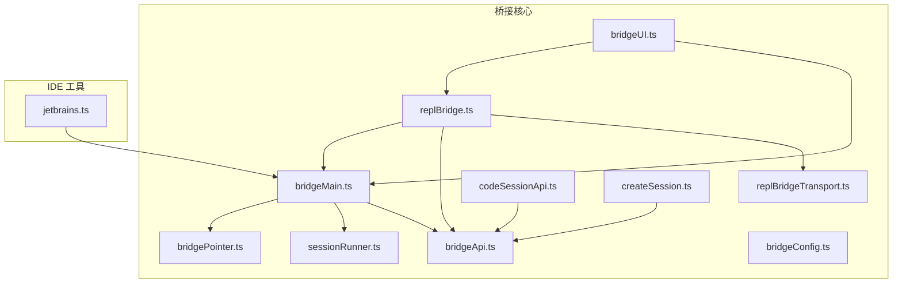
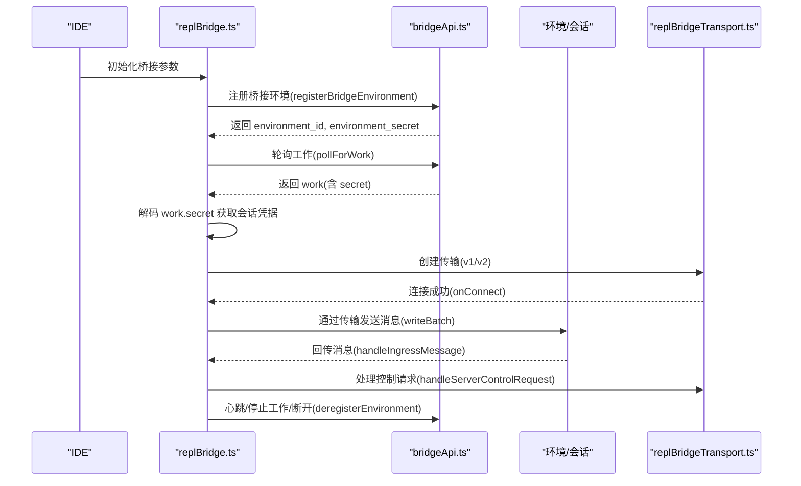
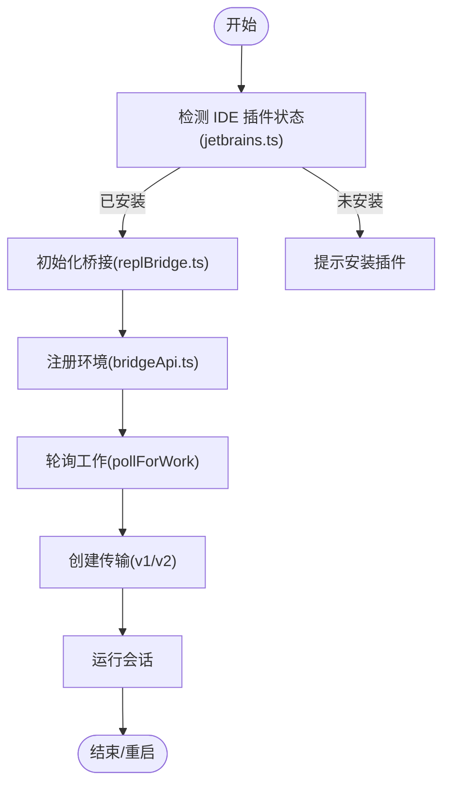
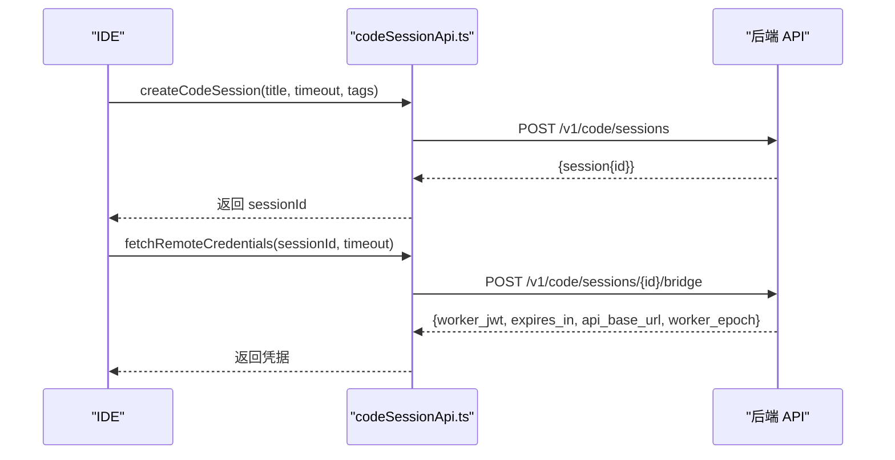
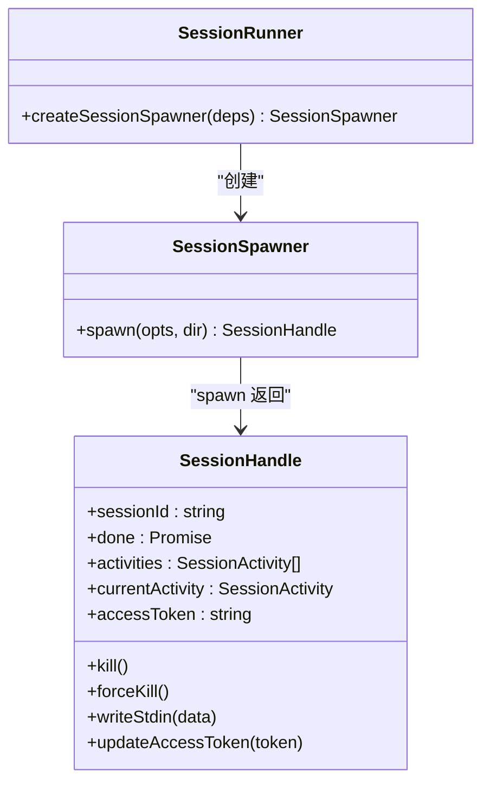
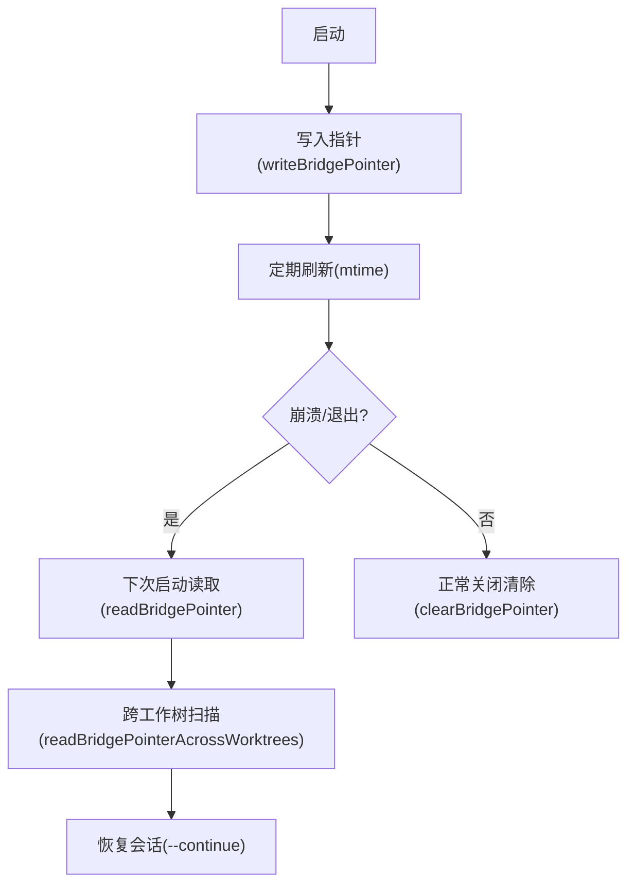
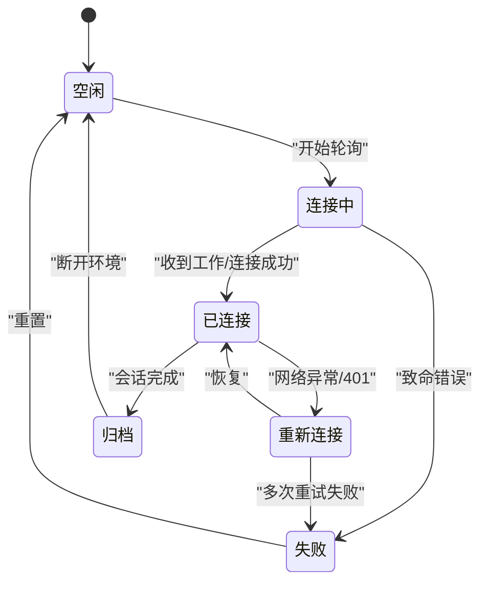
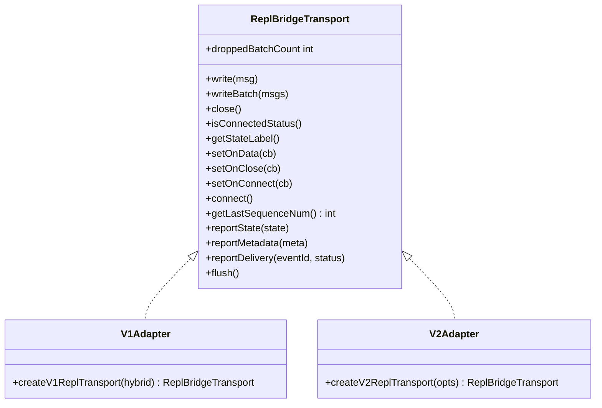
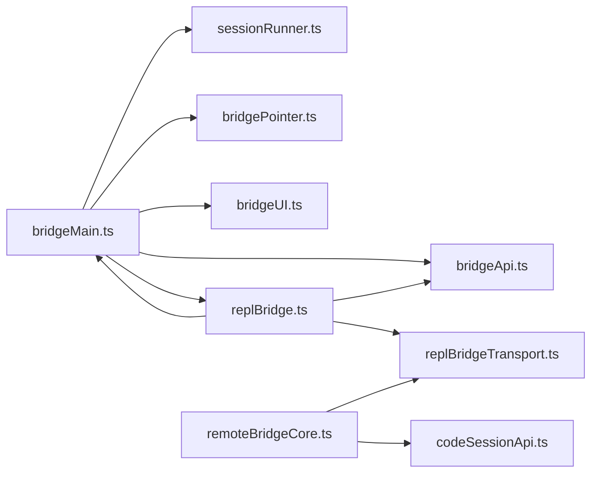

# IDE 集成

<cite>
**本文档引用的文件**
- [bridgeMain.ts](file://src/bridge/bridgeMain.ts)
- [codeSessionApi.ts](file://src/bridge/codeSessionApi.ts)
- [sessionRunner.ts](file://src/bridge/sessionRunner.ts)
- [bridgePointer.ts](file://src/bridge/bridgePointer.ts)
- [types.ts](file://src/bridge/types.ts)
- [bridgeApi.ts](file://src/bridge/bridgeApi.ts)
- [createSession.ts](file://src/bridge/createSession.ts)
- [remoteBridgeCore.ts](file://src/bridge/remoteBridgeCore.ts)
- [replBridge.ts](file://src/bridge/replBridge.ts)
- [replBridgeTransport.ts](file://src/bridge/replBridgeTransport.ts)
- [bridgeConfig.ts](file://src/bridge/bridgeConfig.ts)
- [bridgeUI.ts](file://src/bridge/bridgeUI.ts)
- [bridgeMessaging.ts](file://src/bridge/bridgeMessaging.ts)
- [jetbrains.ts](file://src/utils/jetbrains.ts)
</cite>

## 目录
1. [简介](#简介)
2. [项目结构](#项目结构)
3. [核心组件](#核心组件)
4. [架构总览](#架构总览)
5. [详细组件分析](#详细组件分析)
6. [依赖关系分析](#依赖关系分析)
7. [性能考虑](#性能考虑)
8. [故障排查指南](#故障排查指南)
9. [结论](#结论)
10. [附录](#附录)

## 简介
本文件面向 IDE 开发者，系统性阐述本仓库中 IDE 集成（VS Code 桥接与 JetBrains 桥接）的设计与实现，涵盖：
- VS Code 桥接与 JetBrains 桥接的原理与配置要点
- 代码会话 API 的设计与使用（创建、凭据获取、会话管理）
- 会话运行器工作机制（状态跟踪、资源管理、异常处理）
- 桥接指针（崩溃恢复）的作用与实现
- 常见问题与性能优化建议
- 完整的配置示例与最佳实践

## 项目结构
本项目的 IDE 集成主要集中在 bridge 子系统与相关工具模块中，核心文件组织如下：
- 桥接主循环与环境管理：bridgeMain.ts
- 代码会话 API：codeSessionApi.ts
- 会话运行器（子进程管理、活动追踪、权限请求）：sessionRunner.ts
- 桥接指针（崩溃恢复）：bridgePointer.ts
- 类型定义与接口：types.ts
- 桥接 API 客户端（注册、轮询、心跳、停止工作等）：bridgeApi.ts
- 会话创建与归档（远程控制场景）：createSession.ts
- REPL 环境无关桥接（直接会话入口）：remoteBridgeCore.ts
- REPL 桥接核心（环境注册、轮询、传输选择）：replBridge.ts
- 传输抽象（v1/v2 适配）：replBridgeTransport.ts
- 桥接配置解析（OAuth/URL 覆盖）：bridgeConfig.ts
- 桥接 UI（状态栏、QR、日志）：bridgeUI.ts
- 消息处理与控制请求路由：bridgeMessaging.ts
- JetBrains 插件检测：jetbrains.ts

图表来源
- [bridgeMain.ts:141-591](file://src/bridge/bridgeMain.ts#L141-L591)
- [bridgeApi.ts:68-452](file://src/bridge/bridgeApi.ts#L68-L452)
- [replBridge.ts:260-820](file://src/bridge/replBridge.ts#L260-L820)
- [replBridgeTransport.ts:119-371](file://src/bridge/replBridgeTransport.ts#L119-L371)
- [codeSessionApi.ts:26-169](file://src/bridge/codeSessionApi.ts#L26-L169)
- [createSession.ts:34-180](file://src/bridge/createSession.ts#L34-L180)
- [sessionRunner.ts:248-551](file://src/bridge/sessionRunner.ts#L248-L551)
- [bridgePointer.ts:62-202](file://src/bridge/bridgePointer.ts#L62-L202)
- [bridgeConfig.ts:38-48](file://src/bridge/bridgeConfig.ts#L38-L48)
- [bridgeUI.ts:294-531](file://src/bridge/bridgeUI.ts#L294-L531)
- [jetbrains.ts:134-192](file://src/utils/jetbrains.ts#L134-L192)

章节来源
- [bridgeMain.ts:141-591](file://src/bridge/bridgeMain.ts#L141-L591)
- [replBridge.ts:260-820](file://src/bridge/replBridge.ts#L260-L820)

## 核心组件
- 桥接主循环（环境注册、轮询、心跳、会话生命周期管理）：bridgeMain.ts
- 代码会话 API（创建会话、获取远程凭据）：codeSessionApi.ts
- 会话运行器（子进程 spawn、活动追踪、权限请求、令牌刷新）：sessionRunner.ts
- 桥接指针（崩溃恢复、跨工作树扫描）：bridgePointer.ts
- 桥接 API 客户端（注册环境、轮询工作、心跳、停止工作、断开环境）：bridgeApi.ts
- 会话创建与归档（远程控制场景）：createSession.ts
- REPL 环境无关桥接（直接会话入口，v2 传输）：remoteBridgeCore.ts
- REPL 桥接核心（环境注册、轮询、传输选择、重连策略）：replBridge.ts
- 传输抽象（v1/v2 适配）：replBridgeTransport.ts
- 桥接配置解析（OAuth/URL 覆盖）：bridgeConfig.ts
- 桥接 UI（状态栏、QR、日志）：bridgeUI.ts
- 消息处理与控制请求路由：bridgeMessaging.ts
- JetBrains 插件检测：jetbrains.ts

章节来源
- [types.ts:133-176](file://src/bridge/types.ts#L133-L176)
- [sessionRunner.ts:248-551](file://src/bridge/sessionRunner.ts#L248-L551)
- [bridgeApi.ts:68-452](file://src/bridge/bridgeApi.ts#L68-L452)
- [codeSessionApi.ts:26-169](file://src/bridge/codeSessionApi.ts#L26-L169)
- [createSession.ts:34-180](file://src/bridge/createSession.ts#L34-L180)
- [remoteBridgeCore.ts:140-762](file://src/bridge/remoteBridgeCore.ts#L140-L762)
- [replBridge.ts:260-820](file://src/bridge/replBridge.ts#L260-L820)
- [replBridgeTransport.ts:119-371](file://src/bridge/replBridgeTransport.ts#L119-L371)
- [bridgePointer.ts:62-202](file://src/bridge/bridgePointer.ts#L62-L202)
- [bridgeConfig.ts:38-48](file://src/bridge/bridgeConfig.ts#L38-L48)
- [bridgeUI.ts:294-531](file://src/bridge/bridgeUI.ts#L294-L531)
- [bridgeMessaging.ts:132-391](file://src/bridge/bridgeMessaging.ts#L132-L391)
- [jetbrains.ts:134-192](file://src/utils/jetbrains.ts#L134-L192)

## 架构总览
IDE 集成通过“桥接”在本地与云端服务之间建立稳定连接，支持两种模式：
- 环境模式（replBridge.ts）：通过环境注册、轮询工作、心跳维持，支持 v1/v2 传输切换
- 环境无关模式（remoteBridgeCore.ts）：直接创建代码会话，获取远程凭据，使用 v2 传输

图表来源
- [replBridge.ts:318-420](file://src/bridge/replBridge.ts#L318-L420)
- [bridgeApi.ts:141-452](file://src/bridge/bridgeApi.ts#L141-L452)
- [replBridgeTransport.ts:336-371](file://src/bridge/replBridgeTransport.ts#L336-L371)
- [bridgeMessaging.ts:132-391](file://src/bridge/bridgeMessaging.ts#L132-L391)

## 详细组件分析

### VS Code 桥接与 JetBrains 桥接实现原理
- 共同点
  - 两者均通过桥接 API 客户端与后端交互，遵循统一的环境注册、轮询、心跳协议
  - 支持 v1（HybridTransport）与 v2（SSETransport + CCRClient）传输
  - 使用桥接 UI 展示状态、QR 码与会话链接
- VS Code 桥接
  - 通过 REPL 桥接核心（replBridge.ts）进行环境注册与轮询
  - 在 REPL 模式下可持久化桥接指针（bridgePointer.ts），实现崩溃恢复
  - 使用桥接 UI（bridgeUI.ts）展示状态与 QR 码
- JetBrains 桥接
  - 通过 jetbrains.ts 检测插件安装状态，判断 IDE 可用性
  - 与 VS Code 类似的桥接流程，但针对 JetBrains 平台特性进行适配

图表来源
- [jetbrains.ts:134-192](file://src/utils/jetbrains.ts#L134-L192)
- [replBridge.ts:260-372](file://src/bridge/replBridge.ts#L260-L372)
- [bridgeApi.ts:141-247](file://src/bridge/bridgeApi.ts#L141-L247)

章节来源
- [jetbrains.ts:134-192](file://src/utils/jetbrains.ts#L134-L192)
- [replBridge.ts:260-372](file://src/bridge/replBridge.ts#L260-L372)
- [bridgeUI.ts:294-531](file://src/bridge/bridgeUI.ts#L294-L531)

### 代码会话 API 设计与使用
- 会话创建
  - POST /v1/code/sessions：创建代码会话，返回 session.id（以 cse_ 开头）
  - 支持标题、标签等元数据
- 远程凭据获取
  - POST /v1/code/sessions/{id}/bridge：获取 worker_jwt、expires_in、api_base_url、worker_epoch
  - 每次调用都会增加 worker_epoch（即注册）
- 错误处理
  - 对响应体进行严格校验，记录错误详情
  - 记录调试日志，便于定位问题

图表来源
- [codeSessionApi.ts:26-169](file://src/bridge/codeSessionApi.ts#L26-L169)

章节来源
- [codeSessionApi.ts:26-169](file://src/bridge/codeSessionApi.ts#L26-L169)

### 会话运行器工作机制
- 子进程管理
  - 通过 spawn 启动子进程，传递 SDK URL、会话 ID、访问令牌等参数
  - 支持调试文件输出与转录文件记录
- 活动追踪
  - 解析子进程 stdout 的 NDJSON，提取工具执行、文本、结果、错误等活动
  - 维护最近活动环形缓冲区，用于状态显示
- 权限请求
  - 捕获 control_request（如 can_use_tool），转发到服务器等待用户决策
- 令牌刷新
  - 通过 stdin 发送更新后的会话访问令牌，无需重启子进程
- 异常处理
  - 捕获子进程退出码与信号，区分完成、失败、中断
  - 记录 stderr 最后若干行，辅助诊断

图表来源
- [sessionRunner.ts:248-551](file://src/bridge/sessionRunner.ts#L248-L551)
- [types.ts:178-190](file://src/bridge/types.ts#L178-L190)

章节来源
- [sessionRunner.ts:248-551](file://src/bridge/sessionRunner.ts#L248-L551)
- [types.ts:178-190](file://src/bridge/types.ts#L178-L190)

### 桥接指针的作用与实现
- 作用
  - 在本地崩溃或非正常退出时，保留当前会话信息以便恢复
  - 支持跨 git 工作树扫描，定位最新指针
- 实现
  - 写入：写入 bridge-pointer.json，包含 sessionId、environmentId、来源
  - 读取：校验 JSON 结构与时间戳（超过 TTL 自动清理）
  - 扫描：在多个工作树路径中查找最新指针，匹配 freshest

图表来源
- [bridgePointer.ts:62-202](file://src/bridge/bridgePointer.ts#L62-L202)

章节来源
- [bridgePointer.ts:62-202](file://src/bridge/bridgePointer.ts#L62-L202)

### 会话生命周期与状态管理
- 生命周期阶段
  - 环境注册：registerBridgeEnvironment
  - 轮询工作：pollForWork
  - 接收工作：解码 work.secret，获取会话凭据
  - 心跳维持：heartbeatWork
  - 会话完成：stopWork、archiveSession
  - 断开环境：deregisterEnvironment
- 状态机
  - idle、attached、reconnecting、failed 等状态由 bridgeUI.ts 渲染
  - REPL 桥接核心维护更复杂的状态转换与重连策略

图表来源
- [bridgeUI.ts:376-448](file://src/bridge/bridgeUI.ts#L376-L448)
- [bridgeApi.ts:141-452](file://src/bridge/bridgeApi.ts#L141-L452)
- [replBridge.ts:587-760](file://src/bridge/replBridge.ts#L587-L760)

章节来源
- [bridgeUI.ts:376-448](file://src/bridge/bridgeUI.ts#L376-L448)
- [bridgeApi.ts:141-452](file://src/bridge/bridgeApi.ts#L141-L452)
- [replBridge.ts:587-760](file://src/bridge/replBridge.ts#L587-L760)

### 传输层抽象（v1/v2）
- v1（HybridTransport）
  - WebSocket 读取 + Session-Ingress POST 写入
  - 适用于传统环境模式
- v2（SSETransport + CCRClient）
  - SSE 读取 + CCRClient 写入（/worker/*）
  - 支持 worker_epoch 注册、心跳、状态上报、交付跟踪
  - 409 epoch 不匹配时自动关闭并触发轮询恢复

图表来源
- [replBridgeTransport.ts:23-70](file://src/bridge/replBridgeTransport.ts#L23-L70)
- [replBridgeTransport.ts:119-371](file://src/bridge/replBridgeTransport.ts#L119-L371)

章节来源
- [replBridgeTransport.ts:23-70](file://src/bridge/replBridgeTransport.ts#L23-L70)
- [replBridgeTransport.ts:119-371](file://src/bridge/replBridgeTransport.ts#L119-L371)

### 配置示例与最佳实践
- OAuth 与基础 URL 覆盖
  - 优先使用 CLAUDE_BRIDGE_OAUTH_TOKEN 与 CLAUDE_BRIDGE_BASE_URL（仅限 ant 用户）
  - 否则回退到 OAuth 存储与生产配置
- 传输选择
  - v2 为默认推荐，具备更好的稳定性与功能支持
  - 通过环境变量或配置开关控制是否启用 v2
- 日志与调试
  - 使用 --debug-file 输出调试日志与转录文件
  - 启用 verbose 模式查看更多细节
- 权限与安全
  - 使用受信设备令牌（X-Trusted-Device-Token）增强 elevated 安全策略
  - 严格校验服务器返回的 ID 与响应体，避免注入与越权

章节来源
- [bridgeConfig.ts:38-48](file://src/bridge/bridgeConfig.ts#L38-L48)
- [bridgeApi.ts:84-87](file://src/bridge/bridgeApi.ts#L84-L87)
- [sessionRunner.ts:286-332](file://src/bridge/sessionRunner.ts#L286-L332)

## 依赖关系分析
- 组件耦合
  - bridgeMain.ts 依赖 bridgeApi.ts、sessionRunner.ts、bridgePointer.ts、bridgeUI.ts
  - replBridge.ts 依赖 bridgeApi.ts、replBridgeTransport.ts、bridgeMessaging.ts
  - remoteBridgeCore.ts 依赖 codeSessionApi.ts、replBridgeTransport.ts
- 外部依赖
  - axios 用于 HTTP 请求
  - child_process 用于子进程管理
  - qrcode 用于生成 QR 码
- 循环依赖
  - 通过模块拆分避免循环导入；消息处理与传输抽象相互独立

图表来源
- [bridgeMain.ts:1-120](file://src/bridge/bridgeMain.ts#L1-L120)
- [replBridge.ts:1-80](file://src/bridge/replBridge.ts#L1-L80)
- [remoteBridgeCore.ts:1-80](file://src/bridge/remoteBridgeCore.ts#L1-L80)

章节来源
- [bridgeMain.ts:1-120](file://src/bridge/bridgeMain.ts#L1-L120)
- [replBridge.ts:1-80](file://src/bridge/replBridge.ts#L1-L80)
- [remoteBridgeCore.ts:1-80](file://src/bridge/remoteBridgeCore.ts#L1-L80)

## 性能考虑
- 轮询与心跳
  - 根据配置动态调整轮询间隔与心跳周期，避免过度请求
  - 在容量满载时采用心跳模式，减少不必要的轮询
- 传输选择
  - v2 传输具备更好的稳定性与更低的延迟，推荐优先使用
  - epoch 不匹配时快速关闭并触发轮询恢复，避免长时间阻塞
- 资源管理
  - 子进程退出后及时清理工作树与临时文件
  - 使用环形缓冲区限制活动与 UUID 去重集合大小，控制内存占用
- 缓存与幂等
  - 桥接指针 TTL 控制（4 小时），避免过期指针造成重复恢复
  - 归档接口幂等（409 表示已归档），允许重复调用

## 故障排查指南
- 认证失败（401/403）
  - 检查 OAuth 令牌是否有效，必要时触发刷新
  - 确认组织权限与 Elevated 安全策略
- 环境过期（404/410）
  - 触发重新注册与 reconnectSession，恢复会话
- 网络异常
  - 观察 reconnecting 状态与重连日志，确认网络恢复
  - 检查代理与防火墙设置
- 子进程异常
  - 查看调试日志与转录文件，定位 stderr 输出
  - 确认 --debug-file 与 verbose 模式已启用
- 权限请求超时
  - 确保 IDE 插件正确安装并响应控制请求
  - 检查 outbound-only 模式限制

章节来源
- [bridgeApi.ts:454-524](file://src/bridge/bridgeApi.ts#L454-L524)
- [replBridge.ts:605-760](file://src/bridge/replBridge.ts#L605-L760)
- [bridgeUI.ts:407-448](file://src/bridge/bridgeUI.ts#L407-L448)

## 结论
本仓库提供了完善的 IDE 集成能力，覆盖 VS Code 与 JetBrains 场景，支持环境模式与环境无关模式，具备稳定的传输层抽象、健壮的会话生命周期管理与丰富的调试能力。通过桥接指针与崩溃恢复机制，确保在异常情况下也能快速恢复会话。建议在生产环境中优先使用 v2 传输，并结合严格的权限与安全策略，以获得最佳的开发体验。

## 附录
- 配置项速查
  - CLAUDE_BRIDGE_OAUTH_TOKEN：桥接 OAuth 覆盖
  - CLAUDE_BRIDGE_BASE_URL：桥接 API 基础 URL 覆盖
  - --debug-file：输出调试日志与转录文件
  - --verbose：启用详细日志
  - CLAUDE_CODE_USE_CCR_V2：启用 v2 传输
- 常用命令
  - 创建代码会话：POST /v1/code/sessions
  - 获取远程凭据：POST /v1/code/sessions/{id}/bridge
  - 归档会话：POST /v1/sessions/{id}/archive
  - 重新连接会话：POST /v1/environments/{envId}/bridge/reconnect