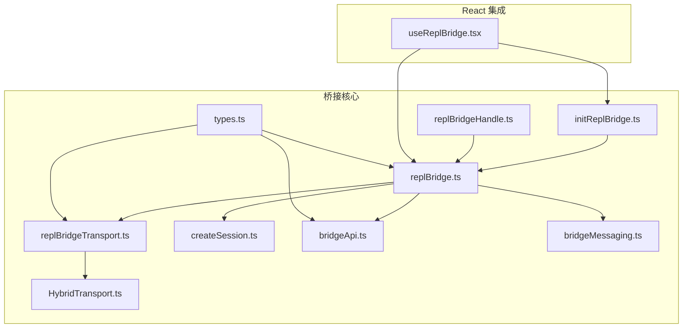
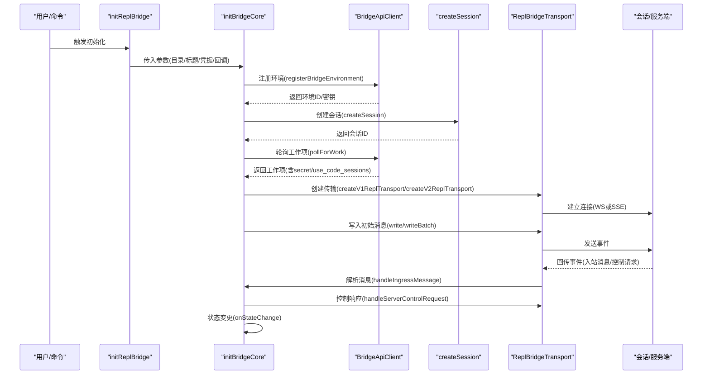
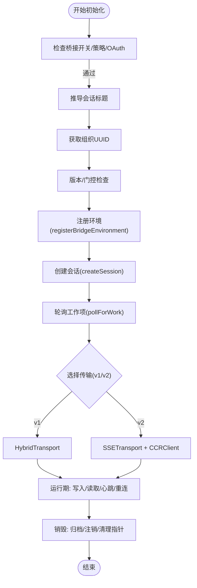
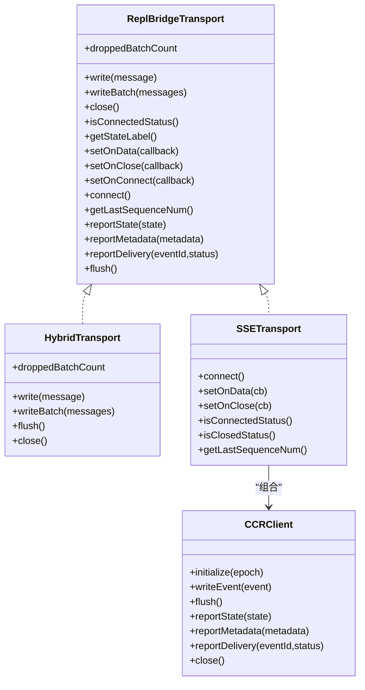
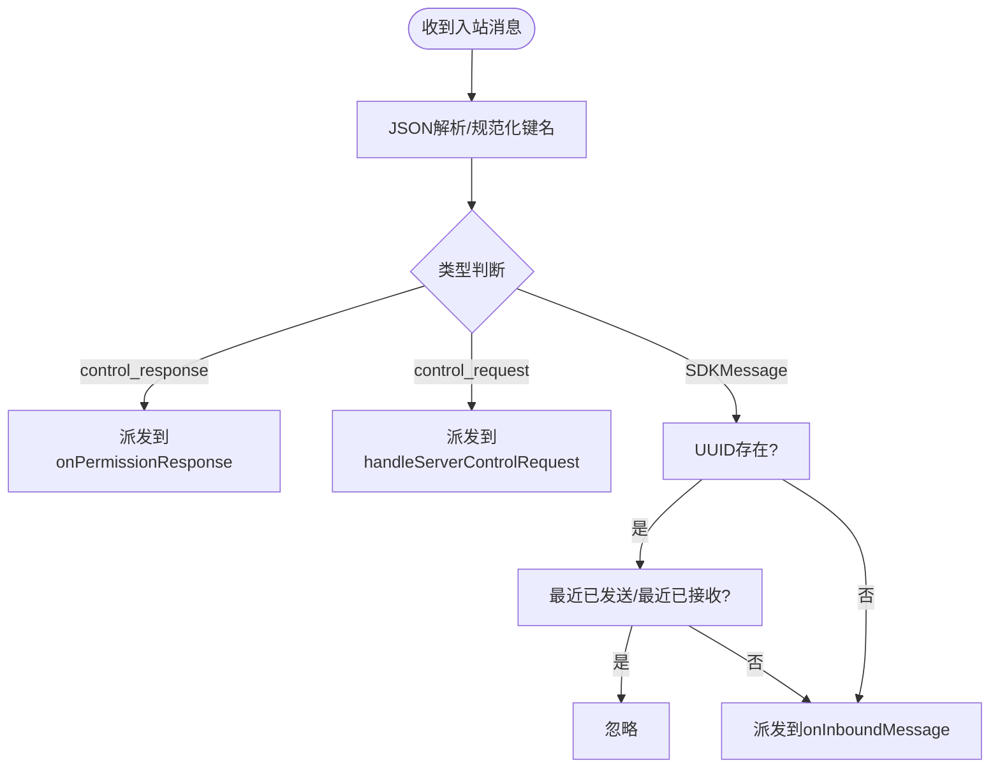
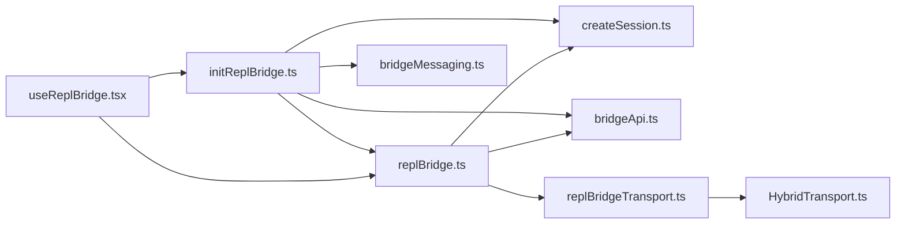

# REPL 会话桥接

<cite>
**本文档引用的文件**
- [replBridge.ts](file://src/bridge/replBridge.ts)
- [replBridgeHandle.ts](file://src/bridge/replBridgeHandle.ts)
- [replBridgeTransport.ts](file://src/bridge/replBridgeTransport.ts)
- [initReplBridge.ts](file://src/bridge/initReplBridge.ts)
- [createSession.ts](file://src/bridge/createSession.ts)
- [types.ts](file://src/bridge/types.ts)
- [bridgeApi.ts](file://src/bridge/bridgeApi.ts)
- [bridgeMessaging.ts](file://src/bridge/bridgeMessaging.ts)
- [useReplBridge.tsx](file://src/hooks/useReplBridge.tsx)
- [HybridTransport.ts](file://src/cli/transports/HybridTransport.ts)
</cite>

## 目录
1. [简介](#简介)
2. [项目结构](#项目结构)
3. [核心组件](#核心组件)
4. [架构总览](#架构总览)
5. [详细组件分析](#详细组件分析)
6. [依赖关系分析](#依赖关系分析)
7. [性能考虑](#性能考虑)
8. [故障排除指南](#故障排除指南)
9. [结论](#结论)
10. [附录](#附录)

## 简介
本文件系统性阐述 REPL 会话桥接功能的架构设计与实现原理，涵盖桥接句柄、传输层、初始化流程与生命周期管理、数据传输机制与协议设计、配置示例与使用方法、状态管理与错误处理、性能优化与调试技巧等。目标是为开发者提供一份完整且可操作的集成指南。

## 项目结构
REPL 会话桥接由多个模块协同完成：
- 初始化与核心逻辑：initReplBridge.ts、replBridge.ts
- 传输层抽象：replBridgeTransport.ts、HybridTransport.ts
- 会话生命周期：createSession.ts、bridgeApi.ts
- 消息路由与去重：bridgeMessaging.ts
- React 集成与状态管理：useReplBridge.tsx
- 全局句柄与工具：replBridgeHandle.ts、types.ts

**图表来源**
- [initReplBridge.ts:110-545](file://src/bridge/initReplBridge.ts#L110-L545)
- [replBridge.ts:260-820](file://src/bridge/replBridge.ts#L260-L820)
- [replBridgeTransport.ts:23-70](file://src/bridge/replBridgeTransport.ts#L23-L70)
- [HybridTransport.ts:54-108](file://src/cli/transports/HybridTransport.ts#L54-L108)
- [createSession.ts:34-180](file://src/bridge/createSession.ts#L34-L180)
- [bridgeApi.ts:68-176](file://src/bridge/bridgeApi.ts#L68-L176)
- [bridgeMessaging.ts:132-208](file://src/bridge/bridgeMessaging.ts#L132-L208)
- [replBridgeHandle.ts:16-37](file://src/bridge/replBridgeHandle.ts#L16-L37)
- [types.ts:81-176](file://src/bridge/types.ts#L81-L176)
- [useReplBridge.tsx:147-680](file://src/hooks/useReplBridge.tsx#L147-L680)

**章节来源**
- [initReplBridge.ts:1-570](file://src/bridge/initReplBridge.ts#L1-L570)
- [replBridge.ts:1-820](file://src/bridge/replBridge.ts#L1-L820)
- [replBridgeTransport.ts:1-371](file://src/bridge/replBridgeTransport.ts#L1-L371)
- [HybridTransport.ts:1-283](file://src/cli/transports/HybridTransport.ts#L1-L283)
- [createSession.ts:1-385](file://src/bridge/createSession.ts#L1-L385)
- [bridgeApi.ts:1-540](file://src/bridge/bridgeApi.ts#L1-L540)
- [bridgeMessaging.ts:1-462](file://src/bridge/bridgeMessaging.ts#L1-L462)
- [replBridgeHandle.ts:1-37](file://src/bridge/replBridgeHandle.ts#L1-L37)
- [types.ts:1-263](file://src/bridge/types.ts#L1-L263)
- [useReplBridge.tsx:1-723](file://src/hooks/useReplBridge.tsx#L1-L723)

## 核心组件
- ReplBridgeHandle：桥接句柄接口，封装会话写入、控制请求/响应发送、结果上报与销毁等能力。
- ReplBridgeTransport：传输层抽象，统一 v1（HybridTransport）与 v2（SSETransport + CCRClient）两种传输路径。
- BridgeApiClient：环境 API 客户端，负责注册环境、轮询工作项、确认工作、心跳、停止工作、注销环境、归档会话、重连会话等。
- SessionHandle：会话句柄，用于与子进程交互（在 REPL 外部场景中使用）。
- BridgeState：桥接状态枚举（ready、connected、reconnecting、failed），用于 UI 与日志反馈。
- 消息处理：handleIngressMessage、handleServerControlRequest、makeResultMessage、BoundedUUIDSet 等，负责消息解析、权限控制响应、回显去重与结果事件构建。

**章节来源**
- [replBridge.ts:70-82](file://src/bridge/replBridge.ts#L70-L82)
- [replBridgeTransport.ts:23-70](file://src/bridge/replBridgeTransport.ts#L23-L70)
- [bridgeApi.ts:133-176](file://src/bridge/bridgeApi.ts#L133-L176)
- [types.ts:178-190](file://src/bridge/types.ts#L178-L190)
- [bridgeMessaging.ts:132-208](file://src/bridge/bridgeMessaging.ts#L132-L208)

## 架构总览
REPL 会话桥接采用“环境注册 → 会话创建 → 轮询工作项 → 建立传输 → 生命周期管理”的分层架构。初始化阶段通过 initReplBridge 组装参数并调用 initBridgeCore；运行时通过 poll loop 获取工作项，解析工作秘密（WorkSecret）选择 v1 或 v2 传输；传输层负责消息读写与状态上报；消息层负责入站消息解析、权限控制请求处理与去重。

**图表来源**
- [initReplBridge.ts:110-545](file://src/bridge/initReplBridge.ts#L110-L545)
- [replBridge.ts:260-820](file://src/bridge/replBridge.ts#L260-L820)
- [bridgeApi.ts:142-247](file://src/bridge/bridgeApi.ts#L142-L247)
- [createSession.ts:34-180](file://src/bridge/createSession.ts#L34-L180)
- [replBridgeTransport.ts:119-371](file://src/bridge/replBridgeTransport.ts#L119-L371)

## 详细组件分析

### 组件A：初始化与生命周期管理
- initReplBridge：负责读取引导状态（目录、会话ID、Git上下文、OAuth）、策略检查、组织UUID获取、版本检查、标题推导、权限模式回调注入、环境/会话创建与归档、outbound-only 模式支持等。
- initBridgeCore：无引导状态依赖的核心桥接逻辑，执行环境注册、会话创建、轮询、传输建立、消息去重、重连策略、持久化指针（崩溃恢复/持续会话）等。
- useReplBridge：React 钩子，自动启停桥接、转发消息、处理入站消息、权限响应、状态同步、失败熔断与自动禁用等。

**图表来源**
- [initReplBridge.ts:110-545](file://src/bridge/initReplBridge.ts#L110-L545)
- [replBridge.ts:260-820](file://src/bridge/replBridge.ts#L260-L820)
- [useReplBridge.tsx:95-680](file://src/hooks/useReplBridge.tsx#L95-L680)

**章节来源**
- [initReplBridge.ts:110-545](file://src/bridge/initReplBridge.ts#L110-L545)
- [replBridge.ts:260-820](file://src/bridge/replBridge.ts#L260-L820)
- [useReplBridge.tsx:95-680](file://src/hooks/useReplBridge.tsx#L95-L680)

### 组件B：传输层设计与协议
- ReplBridgeTransport 抽象：统一 v1 与 v2 的写入、连接、状态查询、关闭、刷新、状态/元数据/交付跟踪上报等接口。
- v1 适配器：HybridTransport，WebSocket 读 + HTTP POST 写，序列化批量上传，带指数退避与抖动，支持静默丢弃检测与延迟批处理。
- v2 适配器：SSETransport + CCRClient，SSE 读 + CCRClient 写，支持 worker epoch、心跳、状态/元数据/交付跟踪上报，异常时关闭并触发重连。
- 协议要点：WorkSecret.use_code_sessions 决定 v2；SSE 序列号承载用于避免历史重放；入站消息按 UUID 去重；控制请求需及时响应以避免 WS 超时。

**图表来源**
- [replBridgeTransport.ts:23-70](file://src/bridge/replBridgeTransport.ts#L23-L70)
- [HybridTransport.ts:54-108](file://src/cli/transports/HybridTransport.ts#L54-L108)
- [replBridgeTransport.ts:119-371](file://src/bridge/replBridgeTransport.ts#L119-L371)

**章节来源**
- [replBridgeTransport.ts:1-371](file://src/bridge/replBridgeTransport.ts#L1-L371)
- [HybridTransport.ts:1-283](file://src/cli/transports/HybridTransport.ts#L1-L283)

### 组件C：消息处理与权限控制
- handleIngressMessage：解析入站消息，过滤非桥接消息，基于 UUID 去重（最近已发送/最近已接收），派发到 onInboundMessage 或 onControlRequest。
- handleServerControlRequest：处理来自服务端的控制请求（initialize/set_model/set_max_thinking_tokens/set_permission_mode/interrupt），在 outbound-only 模式下拒绝可变请求。
- makeResultMessage：构建最小化结果事件，用于归档时触发服务器侧归档。
- BoundedUUIDSet：环形有界集合，用于回显去重与重复消息防护。

**图表来源**
- [bridgeMessaging.ts:132-208](file://src/bridge/bridgeMessaging.ts#L132-L208)

**章节来源**
- [bridgeMessaging.ts:1-462](file://src/bridge/bridgeMessaging.ts#L1-L462)

### 组件D：会话创建与归档
- createBridgeSession：通过 POST /v1/sessions 创建会话，携带标题、事件、Git 源/结果上下文、权限模式等。
- archiveBridgeSession：通过 POST /v1/sessions/{id}/archive 归档会话，幂等处理 409。
- getBridgeSession/updateBridgeSessionTitle：查询与更新会话信息（兼容 cse_* 与 session_*）。

**章节来源**
- [createSession.ts:34-385](file://src/bridge/createSession.ts#L34-L385)

### 组件E：全局句柄与工具
- replBridgeHandle：全局 ReplBridgeHandle 指针，供工具/命令调用（如订阅/取消订阅）。
- types：定义 BridgeConfig、BridgeApiClient 接口、BridgeState、WorkSecret 等类型。

**章节来源**
- [replBridgeHandle.ts:1-37](file://src/bridge/replBridgeHandle.ts#L1-L37)
- [types.ts:1-263](file://src/bridge/types.ts#L1-L263)

## 依赖关系分析
- initReplBridge 依赖 initBridgeCore、createSession、bridgeApi、bridgeMessaging、useReplBridge 等模块。
- initBridgeCore 依赖 bridgeApi、createSession、replBridgeTransport、bridgeMessaging、flushGate、capacityWake、pollConfig、workSecret、sessionIdCompat、concurrentSessions、trustedDevice 等。
- 传输层依赖 HybridTransport（v1）与 SSETransport + CCRClient（v2）。
- React 集成依赖 useReplBridge，负责状态同步、权限回调、入站消息注入、失败熔断与 UI 提示。

**图表来源**
- [initReplBridge.ts:110-545](file://src/bridge/initReplBridge.ts#L110-L545)
- [replBridge.ts:260-820](file://src/bridge/replBridge.ts#L260-L820)
- [replBridgeTransport.ts:23-70](file://src/bridge/replBridgeTransport.ts#L23-L70)
- [HybridTransport.ts:54-108](file://src/cli/transports/HybridTransport.ts#L54-L108)
- [useReplBridge.tsx:147-680](file://src/hooks/useReplBridge.tsx#L147-L680)

**章节来源**
- [initReplBridge.ts:110-545](file://src/bridge/initReplBridge.ts#L110-L545)
- [replBridge.ts:260-820](file://src/bridge/replBridge.ts#L260-L820)
- [replBridgeTransport.ts:1-371](file://src/bridge/replBridgeTransport.ts#L1-L371)
- [HybridTransport.ts:1-283](file://src/cli/transports/HybridTransport.ts#L1-L283)
- [useReplBridge.tsx:1-723](file://src/hooks/useReplBridge.tsx#L1-L723)

## 性能考虑
- 批量与延迟：HybridTransport 对 stream_event 进行最多 100ms 的缓冲聚合，减少 HTTP POST 次数；writeBatch 串行化并批量发送，避免并发写导致的冲突与风暴。
- 指数退避与抖动：uploader 使用指数退避与抖动，避免雪崩；最大连续失败次数可配置，防止持久失败阻塞队列。
- 去重与回显过滤：BoundedUUIDSet 保证回显与重复消息不被二次处理，降低无效负载。
- SSE 序列号承载：v2 通过 lastTransportSequenceNum 与 from_sequence_num 避免历史重放，提升恢复效率。
- 关闭优雅性：close() 提供 3s 关闭宽限期，优先 flush 队列，再关闭资源，确保归档前的最终事件送达。

**章节来源**
- [HybridTransport.ts:117-195](file://src/cli/transports/HybridTransport.ts#L117-L195)
- [bridgeMessaging.ts:419-462](file://src/bridge/bridgeMessaging.ts#L419-L462)
- [replBridgeTransport.ts:119-371](file://src/bridge/replBridgeTransport.ts#L119-L371)

## 故障排除指南
- 认证失败（401）：通过 withOAuthRetry 自动尝试刷新令牌并重试；若失败抛出 BridgeFatalError，提示登录。
- 权限不足（403）：区分可抑制的 403（如外部轮询权限不足）与不可抑制的访问拒绝；后者需检查组织策略。
- 会话过期（404/410）：环境或会话过期，触发重连策略或重新创建会话。
- 速率限制（429）：轮询过于频繁，适当延长轮询间隔。
- 传输异常：v2 在 epoch 不匹配时主动关闭并触发 poll loop 重连；v1 在网络错误或超时时重试。
- 入站消息重复：依赖 recentInboundUUIDs 与 recentPostedUUIDs 去重，避免重复处理与历史重放。
- 失败熔断：useReplBridge 对连续初始化失败进行熔断（默认 3 次），自动禁用并提示重启后重试。

**章节来源**
- [bridgeApi.ts:454-540](file://src/bridge/bridgeApi.ts#L454-L540)
- [bridgeMessaging.ts:132-208](file://src/bridge/bridgeMessaging.ts#L132-L208)
- [useReplBridge.tsx:113-128](file://src/hooks/useReplBridge.tsx#L113-L128)

## 结论
REPL 会话桥接通过清晰的模块划分与抽象层，实现了从环境注册、会话创建到传输层读写的全链路自动化。其核心优势在于：
- 可插拔传输层（v1/v2）与统一抽象接口；
- 强大的消息去重与回显过滤；
- 优雅的失败恢复与重连策略；
- 与 React 的无缝集成与状态同步；
- 面向生产的性能优化（批量、退避、序列号承载）。

这些特性共同构成了一个稳定、可扩展且易于调试的 REPL 集成方案。

## 附录

### 配置示例与使用方法
- 启用桥接：通过设置开关与策略门控，确保用户已登录并具备组织权限。
- 标题推导：支持 /rename、首条与第三条消息触发的标题生成，避免空标题。
- outbound-only 模式：仅转发事件，不接收入站控制，适用于镜像模式。
- 持续会话（KAIROS 助手模式）：通过 bridge-pointer.json 实现跨重启的会话延续。

**章节来源**
- [initReplBridge.ts:247-378](file://src/bridge/initReplBridge.ts#L247-L378)
- [useReplBridge.tsx:164-171](file://src/hooks/useReplBridge.tsx#L164-L171)

### 状态管理与错误处理
- BridgeState：ready/connected/reconnecting/failed，驱动 UI 层状态切换与通知。
- onStateChange：集中处理状态变更，便于 UI 与日志联动。
- 失败熔断：useReplBridge 对连续失败进行熔断，避免无意义重试。

**章节来源**
- [replBridge.ts:83-83](file://src/bridge/replBridge.ts#L83-L83)
- [useReplBridge.tsx:224-365](file://src/hooks/useReplBridge.tsx#L224-L365)

### 调试技巧
- 开启调试日志：利用 logForDebugging/logForDiagnosticsNoPII 输出关键路径日志。
- 传输层诊断：HybridTransport 与 SSETransport 提供详细的诊断事件与错误码。
- 门控与版本检查：在 initReplBridge 中尽早失败，减少无效调用。
- 传输选择：通过 WorkSecret.use_code_sessions 与环境变量控制 v1/v2 选择。

**章节来源**
- [HybridTransport.ts:94-107](file://src/cli/transports/HybridTransport.ts#L94-L107)
- [replBridgeTransport.ts:183-232](file://src/bridge/replBridgeTransport.ts#L183-L232)
- [initReplBridge.ts:400-452](file://src/bridge/initReplBridge.ts#L400-L452)