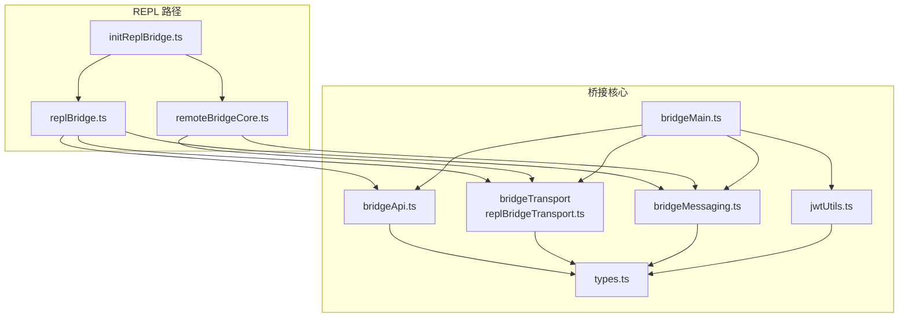
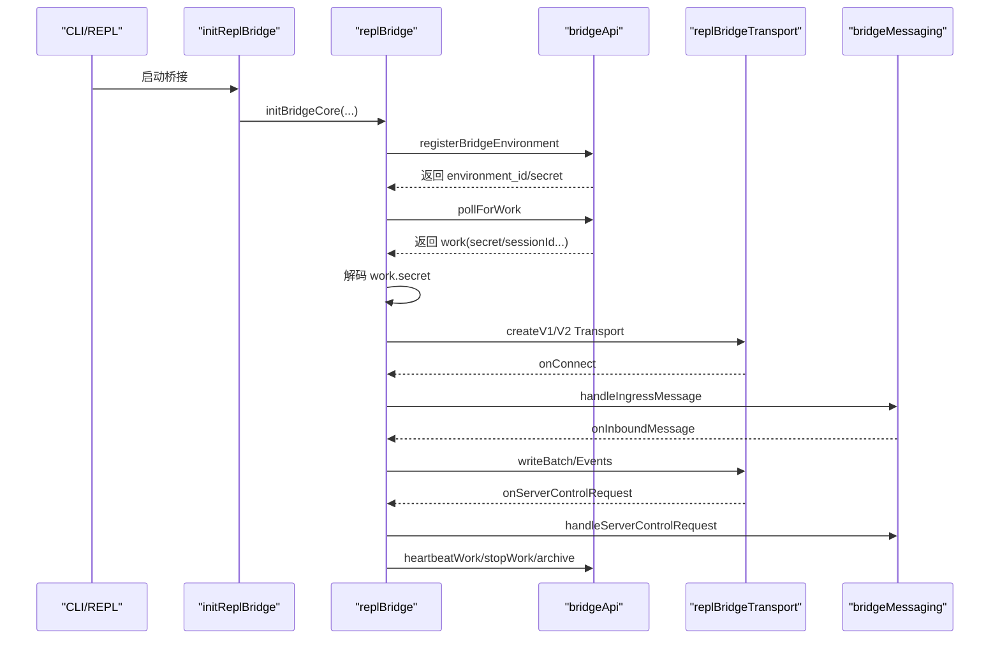
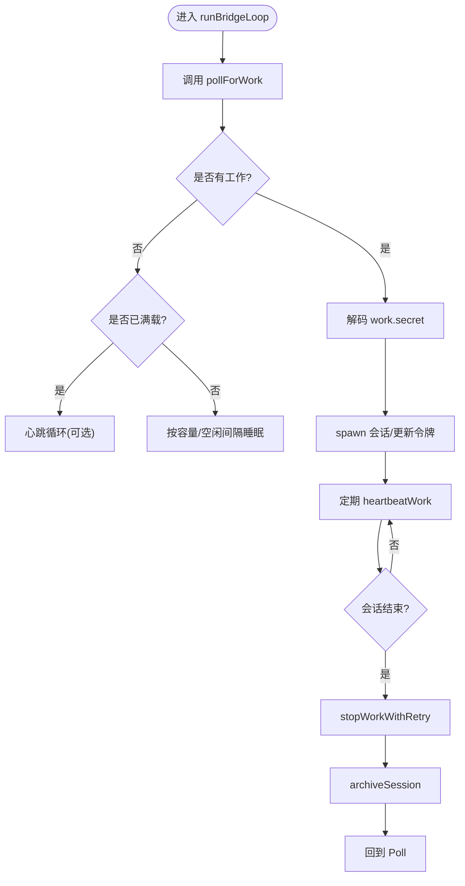
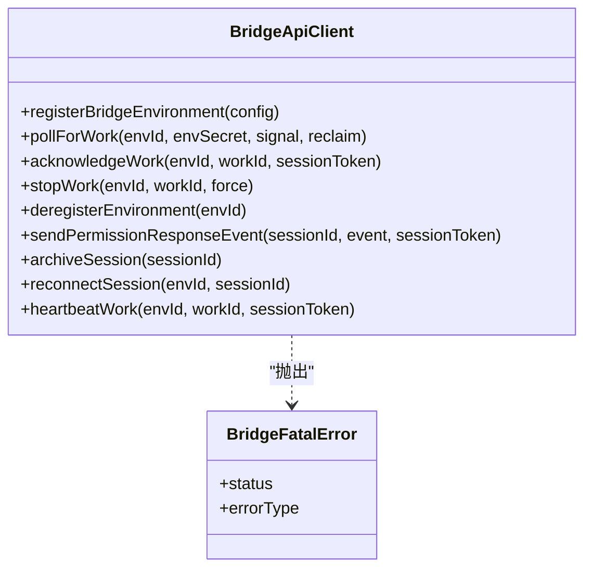
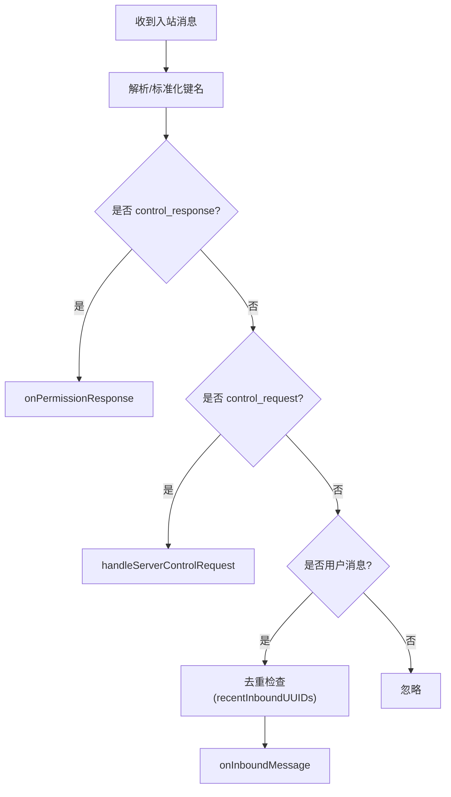
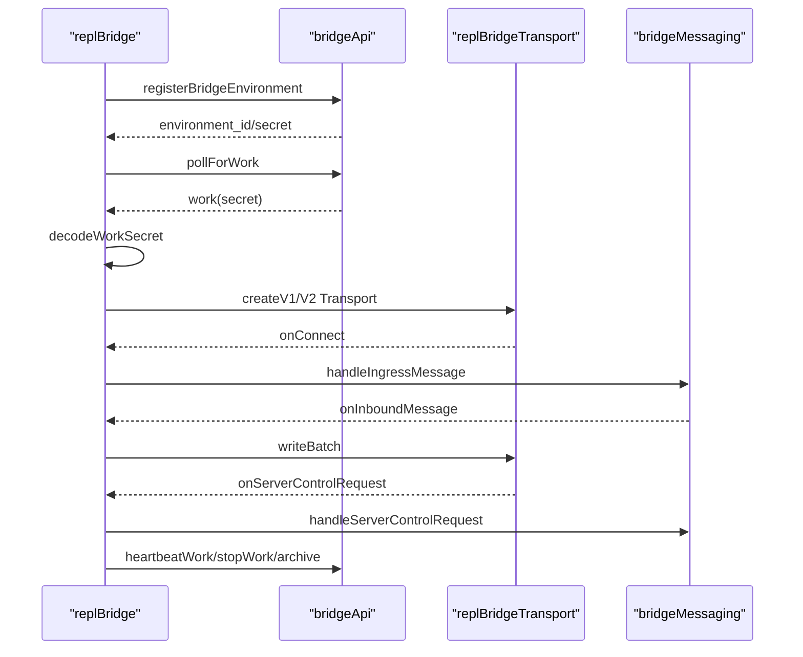
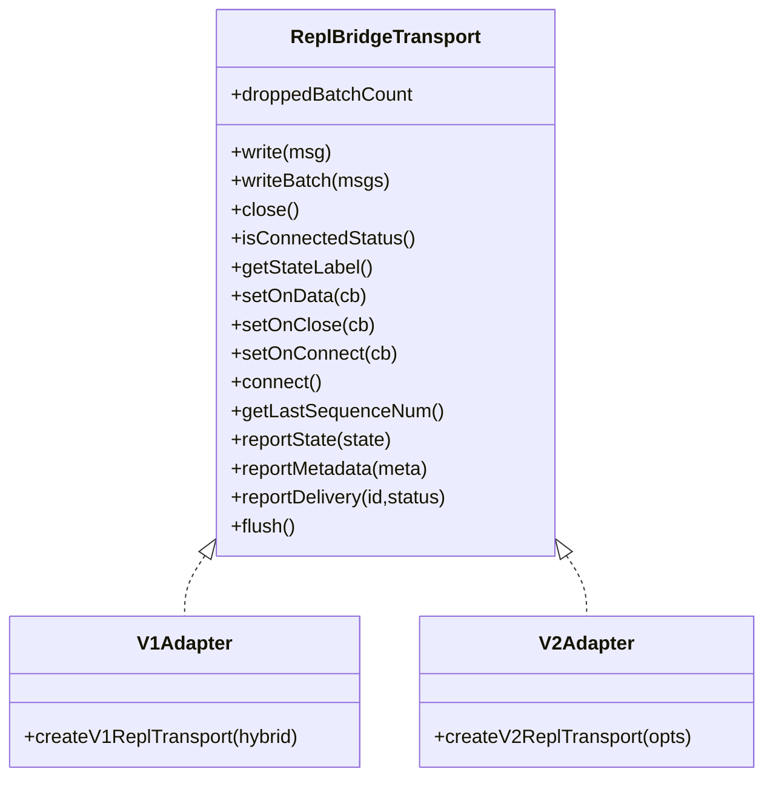
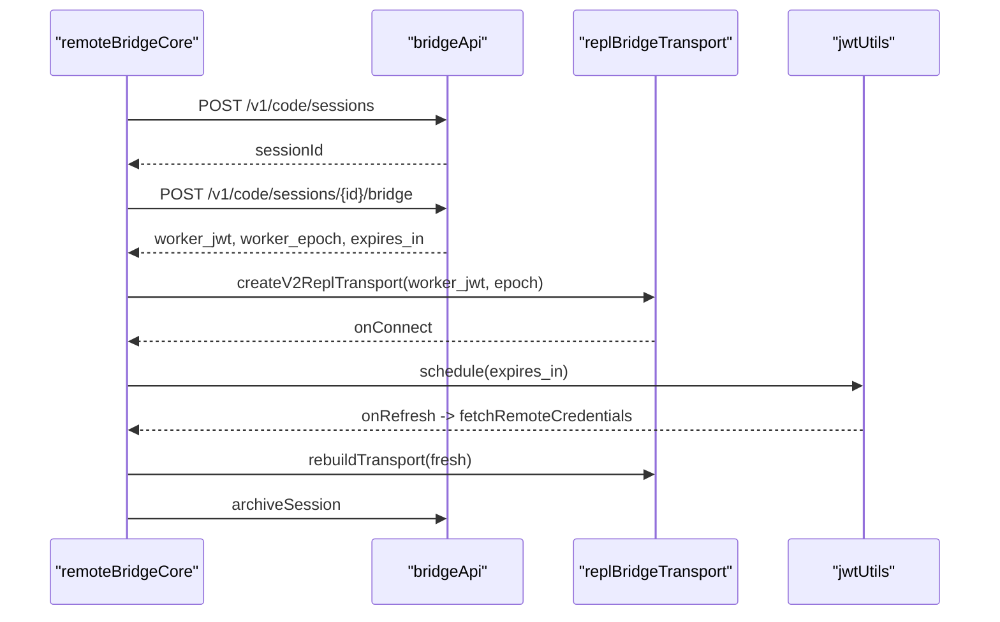
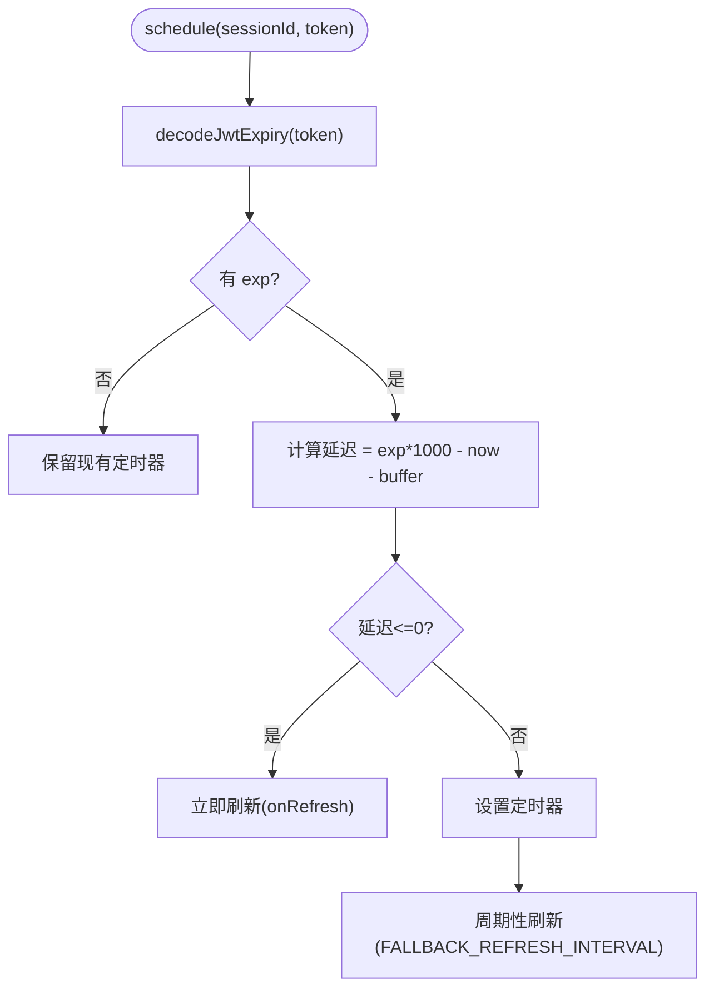
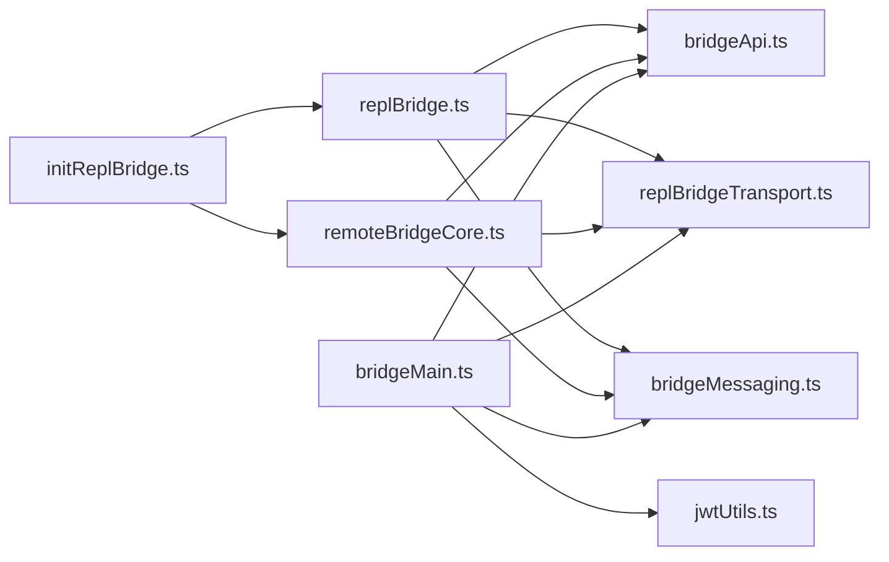

# 桥接系统

<cite>
**本文引用的文件**
- [bridgeMain.ts](file://src/bridge/bridgeMain.ts)
- [bridgeApi.ts](file://src/bridge/bridgeApi.ts)
- [bridgeMessaging.ts](file://src/bridge/bridgeMessaging.ts)
- [replBridge.ts](file://src/bridge/replBridge.ts)
- [replBridgeTransport.ts](file://src/bridge/replBridgeTransport.ts)
- [initReplBridge.ts](file://src/bridge/initReplBridge.ts)
- [remoteBridgeCore.ts](file://src/bridge/remoteBridgeCore.ts)
- [jwtUtils.ts](file://src/bridge/jwtUtils.ts)
- [types.ts](file://src/bridge/types.ts)
- [bridgePermissionCallbacks.ts](file://src/bridge/bridgePermissionCallbacks.ts)
</cite>

## 目录
1. [简介](#简介)
2. [项目结构](#项目结构)
3. [核心组件](#核心组件)
4. [架构总览](#架构总览)
5. [详细组件分析](#详细组件分析)
6. [依赖关系分析](#依赖关系分析)
7. [性能考量](#性能考量)
8. [故障排除指南](#故障排除指南)
9. [结论](#结论)
10. [附录](#附录)

## 简介
本文件系统性阐述 Claude Code 桥接系统的整体设计与实现，覆盖双向通信层、连接管理、消息传递机制、认证与会话执行管理、权限回调处理、REPL 会话桥接与远程控制能力，并提供面向 IDE 开发者与集成开发者的配置与排障建议。文档以代码为依据，通过图示与分层讲解帮助读者快速掌握桥接系统的工作原理与最佳实践。

## 项目结构
桥接系统主要位于 src/bridge 目录，围绕“环境注册—工作轮询—会话建立—消息编解码—传输适配—权限与控制—生命周期管理”构建。关键模块职责如下：
- bridgeMain.ts：桥接主循环、会话池管理、心跳与重连、容量唤醒、日志与状态展示
- bridgeApi.ts：环境与会话 API 客户端封装（注册、轮询、确认、停止、归档、重连、心跳）
- bridgeMessaging.ts：入站消息解析、去重、控制请求路由与响应
- replBridge.ts：REPL 桥接核心（环境注册/会话创建/轮询/入站 WS/传输重建）
- replBridgeTransport.ts：v1/v2 传输抽象（HybridTransport 与 SSE + CCRClient）
- initReplBridge.ts：REPL 包装器（策略门控、OAuth/策略校验、标题派生、调用 initBridgeCore）
- remoteBridgeCore.ts：无环境桥接核心（直接 /bridge 获取 worker JWT，跳过环境层）
- jwtUtils.ts：JWT 解码、过期时间提取、令牌刷新调度器
- types.ts：桥接协议类型、客户端接口、会话句柄、配置等
- bridgePermissionCallbacks.ts：权限请求/响应回调接口定义

图表来源
- [bridgeMain.ts:141-800](file://src/bridge/bridgeMain.ts#L141-L800)
- [bridgeApi.ts:68-452](file://src/bridge/bridgeApi.ts#L68-L452)
- [replBridgeTransport.ts:119-371](file://src/bridge/replBridgeTransport.ts#L119-L371)
- [bridgeMessaging.ts:132-462](file://src/bridge/bridgeMessaging.ts#L132-L462)
- [replBridge.ts:260-800](file://src/bridge/replBridge.ts#L260-L800)
- [remoteBridgeCore.ts:140-800](file://src/bridge/remoteBridgeCore.ts#L140-L800)
- [initReplBridge.ts:110-570](file://src/bridge/initReplBridge.ts#L110-L570)
- [jwtUtils.ts:72-257](file://src/bridge/jwtUtils.ts#L72-L257)
- [types.ts:133-263](file://src/bridge/types.ts#L133-L263)

章节来源
- [bridgeMain.ts:141-800](file://src/bridge/bridgeMain.ts#L141-L800)
- [bridgeApi.ts:68-452](file://src/bridge/bridgeApi.ts#L68-L452)
- [replBridgeTransport.ts:119-371](file://src/bridge/replBridgeTransport.ts#L119-L371)
- [bridgeMessaging.ts:132-462](file://src/bridge/bridgeMessaging.ts#L132-L462)
- [replBridge.ts:260-800](file://src/bridge/replBridge.ts#L260-L800)
- [remoteBridgeCore.ts:140-800](file://src/bridge/remoteBridgeCore.ts#L140-L800)
- [initReplBridge.ts:110-570](file://src/bridge/initReplBridge.ts#L110-L570)
- [jwtUtils.ts:72-257](file://src/bridge/jwtUtils.ts#L72-L257)
- [types.ts:133-263](file://src/bridge/types.ts#L133-L263)

## 核心组件
- 环境与会话 API 客户端：负责环境注册、工作轮询、ACK/STOP、归档、重连、心跳等
- 消息编解码与去重：统一解析 SDK 消息、过滤非桥接消息、回声与重复消息去重
- 传输适配层：v1（HybridTransport）与 v2（SSE + CCRClient），支持 outbound-only 模式
- REPL 桥接核心：初始化、标题派生、历史刷新、权限控制请求/响应、异常恢复
- 无环境桥接核心：直接通过 /bridge 获取 worker JWT，跳过环境层，适合 REPL 场景
- 认证与令牌刷新：OAuth 令牌刷新、JWT 过期前主动刷新、401 自动恢复
- 类型与接口：统一的桥接协议、客户端接口、会话句柄、配置参数

章节来源
- [bridgeApi.ts:68-452](file://src/bridge/bridgeApi.ts#L68-L452)
- [bridgeMessaging.ts:132-462](file://src/bridge/bridgeMessaging.ts#L132-L462)
- [replBridgeTransport.ts:119-371](file://src/bridge/replBridgeTransport.ts#L119-L371)
- [replBridge.ts:260-800](file://src/bridge/replBridge.ts#L260-L800)
- [remoteBridgeCore.ts:140-800](file://src/bridge/remoteBridgeCore.ts#L140-L800)
- [jwtUtils.ts:72-257](file://src/bridge/jwtUtils.ts#L72-L257)
- [types.ts:133-263](file://src/bridge/types.ts#L133-L263)

## 架构总览
桥接系统采用“环境层 + 传输层 + 消息层”的分层设计：
- 环境层：通过 API 客户端完成环境注册、工作轮询、ACK/STOP、心跳、归档与重连
- 传输层：v1 使用混合传输（WebSocket 读 + HTTP 写），v2 使用 SSE 读 + CCRClient 写，支持 outbound-only
- 消息层：统一的消息解析、去重、控制请求路由与响应，支持初始历史刷新与标题派生

图表来源
- [initReplBridge.ts:110-570](file://src/bridge/initReplBridge.ts#L110-L570)
- [replBridge.ts:260-800](file://src/bridge/replBridge.ts#L260-L800)
- [bridgeApi.ts:199-452](file://src/bridge/bridgeApi.ts#L199-L452)
- [replBridgeTransport.ts:119-371](file://src/bridge/replBridgeTransport.ts#L119-L371)
- [bridgeMessaging.ts:132-462](file://src/bridge/bridgeMessaging.ts#L132-L462)

## 详细组件分析

### 组件 A：桥接主循环与会话管理（bridgeMain.ts）
- 主循环负责环境注册、工作轮询、ACK/STOP、心跳、归档与重连
- 支持多会话模式、容量唤醒、超时与中断处理
- 提供状态更新与日志输出，便于诊断与用户反馈

图表来源
- [bridgeMain.ts:141-800](file://src/bridge/bridgeMain.ts#L141-L800)
- [bridgeApi.ts:199-452](file://src/bridge/bridgeApi.ts#L199-L452)

章节来源
- [bridgeMain.ts:141-800](file://src/bridge/bridgeMain.ts#L141-L800)
- [bridgeApi.ts:199-452](file://src/bridge/bridgeApi.ts#L199-L452)

### 组件 B：API 客户端与错误处理（bridgeApi.ts）
- 封装环境注册、工作轮询、ACK/STOP、归档、重连、心跳等 API
- 统一处理 401/403/404/410/429 等错误，区分致命错误与可重试错误
- 支持 OAuth 刷新与可信设备令牌头

图表来源
- [bridgeApi.ts:68-452](file://src/bridge/bridgeApi.ts#L68-L452)
- [types.ts:133-176](file://src/bridge/types.ts#L133-L176)

章节来源
- [bridgeApi.ts:68-452](file://src/bridge/bridgeApi.ts#L68-L452)
- [types.ts:133-176](file://src/bridge/types.ts#L133-L176)

### 组件 C：消息编解码与去重（bridgeMessaging.ts）
- 统一解析 SDK 消息，过滤非桥接消息（如 tool_result、progress）
- 回声与重复消息去重：基于最近发送/接收 UUID 集合
- 控制请求路由：对 server-initiated 的 control_request 进行快速响应，避免服务器挂起

图表来源
- [bridgeMessaging.ts:132-462](file://src/bridge/bridgeMessaging.ts#L132-L462)

章节来源
- [bridgeMessaging.ts:132-462](file://src/bridge/bridgeMessaging.ts#L132-L462)

### 组件 D：REPL 桥接核心（replBridge.ts）
- 初始化：环境注册、会话创建、持久化桥指针（支持 perpetual 模式）
- 传输选择：v1（HybridTransport）或 v2（SSE + CCRClient），根据 work.secret 或环境变量决定
- 异常恢复：环境丢失时尝试原地重连或创建新会话；401 触发 reconnectSession
- 标题派生：基于首条/第三条用户消息生成标题，支持 /rename 覆盖

图表来源
- [replBridge.ts:260-800](file://src/bridge/replBridge.ts#L260-L800)
- [bridgeApi.ts:199-452](file://src/bridge/bridgeApi.ts#L199-L452)
- [replBridgeTransport.ts:119-371](file://src/bridge/replBridgeTransport.ts#L119-L371)
- [bridgeMessaging.ts:132-462](file://src/bridge/bridgeMessaging.ts#L132-L462)

章节来源
- [replBridge.ts:260-800](file://src/bridge/replBridge.ts#L260-L800)
- [bridgeApi.ts:199-452](file://src/bridge/bridgeApi.ts#L199-L452)
- [replBridgeTransport.ts:119-371](file://src/bridge/replBridgeTransport.ts#L119-L371)
- [bridgeMessaging.ts:132-462](file://src/bridge/bridgeMessaging.ts#L132-L462)

### 组件 E：传输适配层（replBridgeTransport.ts）
- v1：HybridTransport（WebSocket 读 + HTTP 写），状态标签与序列号兼容
- v2：SSETransport（读）+ CCRClient（写），支持 outbound-only、epoch 管理、心跳抖动
- 权限上报：reportState/reportMetadata/reportDelivery，用于服务端跟踪处理进度

图表来源
- [replBridgeTransport.ts:23-70](file://src/bridge/replBridgeTransport.ts#L23-L70)
- [replBridgeTransport.ts:78-103](file://src/bridge/replBridgeTransport.ts#L78-L103)
- [replBridgeTransport.ts:119-371](file://src/bridge/replBridgeTransport.ts#L119-L371)

章节来源
- [replBridgeTransport.ts:23-70](file://src/bridge/replBridgeTransport.ts#L23-L70)
- [replBridgeTransport.ts:78-103](file://src/bridge/replBridgeTransport.ts#L78-L103)
- [replBridgeTransport.ts:119-371](file://src/bridge/replBridgeTransport.ts#L119-L371)

### 组件 F：无环境桥接核心（remoteBridgeCore.ts）
- 直接创建会话（POST /v1/code/sessions），再通过 /bridge 获取 worker_jwt 与 worker_epoch
- 建立 v2 传输，使用刷新调度器在 JWT 过期前重建传输
- 401 自动恢复：刷新 OAuth 并重新获取 /bridge 凭据后重建传输
- teardown 顺序：先写 result，再归档会话，必要时 401 重试

图表来源
- [remoteBridgeCore.ts:140-800](file://src/bridge/remoteBridgeCore.ts#L140-L800)
- [bridgeApi.ts:199-452](file://src/bridge/bridgeApi.ts#L199-L452)
- [replBridgeTransport.ts:119-371](file://src/bridge/replBridgeTransport.ts#L119-L371)
- [jwtUtils.ts:72-257](file://src/bridge/jwtUtils.ts#L72-L257)

章节来源
- [remoteBridgeCore.ts:140-800](file://src/bridge/remoteBridgeCore.ts#L140-L800)
- [bridgeApi.ts:199-452](file://src/bridge/bridgeApi.ts#L199-L452)
- [replBridgeTransport.ts:119-371](file://src/bridge/replBridgeTransport.ts#L119-L371)
- [jwtUtils.ts:72-257](file://src/bridge/jwtUtils.ts#L72-L257)

### 组件 G：认证与令牌刷新（jwtUtils.ts）
- 解析 JWT payload/exp，计算过期时间
- 创建刷新调度器：在过期前一定时间触发刷新，支持 fallback 间隔与失败重试
- 多会话场景：为每个 sessionId 维护独立定时器与代数，避免竞态

图表来源
- [jwtUtils.ts:72-257](file://src/bridge/jwtUtils.ts#L72-L257)

章节来源
- [jwtUtils.ts:72-257](file://src/bridge/jwtUtils.ts#L72-L257)

### 组件 H：权限回调与控制请求（bridgePermissionCallbacks.ts）
- 定义权限请求/响应的回调接口，支持取消请求
- 控制请求处理：对 initialize/set_model/set_max_thinking_tokens/set_permission_mode/interrupt 进行响应
- outbound-only 模式下拒绝可变请求，返回明确错误

章节来源
- [bridgePermissionCallbacks.ts:1-44](file://src/bridge/bridgePermissionCallbacks.ts#L1-L44)
- [bridgeMessaging.ts:243-391](file://src/bridge/bridgeMessaging.ts#L243-L391)

## 依赖关系分析
- initReplBridge 作为入口，根据门控与策略决定走 env-based（replBridge）还是 env-less（remoteBridgeCore）
- replBridge 与 remoteBridgeCore 共享 bridgeMessaging 与 replBridgeTransport 抽象
- bridgeMain 与 bridgeApi 协作完成环境层生命周期管理
- jwtUtils 为两类桥接路径提供统一的令牌刷新能力

图表来源
- [initReplBridge.ts:110-570](file://src/bridge/initReplBridge.ts#L110-L570)
- [replBridge.ts:260-800](file://src/bridge/replBridge.ts#L260-L800)
- [remoteBridgeCore.ts:140-800](file://src/bridge/remoteBridgeCore.ts#L140-L800)
- [bridgeApi.ts:68-452](file://src/bridge/bridgeApi.ts#L68-L452)
- [replBridgeTransport.ts:119-371](file://src/bridge/replBridgeTransport.ts#L119-L371)
- [bridgeMessaging.ts:132-462](file://src/bridge/bridgeMessaging.ts#L132-L462)
- [bridgeMain.ts:141-800](file://src/bridge/bridgeMain.ts#L141-L800)
- [jwtUtils.ts:72-257](file://src/bridge/jwtUtils.ts#L72-L257)

章节来源
- [initReplBridge.ts:110-570](file://src/bridge/initReplBridge.ts#L110-L570)
- [replBridge.ts:260-800](file://src/bridge/replBridge.ts#L260-L800)
- [remoteBridgeCore.ts:140-800](file://src/bridge/remoteBridgeCore.ts#L140-L800)
- [bridgeApi.ts:68-452](file://src/bridge/bridgeApi.ts#L68-L452)
- [replBridgeTransport.ts:119-371](file://src/bridge/replBridgeTransport.ts#L119-L371)
- [bridgeMessaging.ts:132-462](file://src/bridge/bridgeMessaging.ts#L132-L462)
- [bridgeMain.ts:141-800](file://src/bridge/bridgeMain.ts#L141-L800)
- [jwtUtils.ts:72-257](file://src/bridge/jwtUtils.ts#L72-L257)

## 性能考量
- 心跳与轮询：在满载时采用心跳模式减少轮询压力，空闲时使用较长轮询间隔
- 刷新调度：在 JWT 过期前 5 分钟触发刷新，避免长时间无响应窗口
- 去重与批处理：BoundedUUIDSet 限制内存占用；v2 写路径使用串行批处理上传
- 传输重建：epoch 变更或 401 时重建传输，确保序列号连续，避免历史重放

## 故障排除指南
- 登录/权限问题
  - 未登录：出现“必须登录才能使用远程控制”的提示，需先执行登录命令
  - 组织策略禁用：检查 allow_remote_control 策略开关
  - 401/403：检查 OAuth 令牌是否过期或被撤销，必要时刷新
- 环境/会话问题
  - 环境过期/删除：触发 fatal 错误，需重新注册环境并重连
  - 会话超时：超过默认 24 小时自动终止，需重启会话
  - 409 epoch 不匹配：v2 传输重建，等待轮询重新派发工作
- 传输问题
  - v1：WebSocket 异常自动恢复，检查网络与代理
  - v2：SSE 重连预算耗尽或 401，触发自动恢复流程
- 日志与诊断
  - 使用调试日志定位问题，关注“reconnected”“heartbeat_mode”“ws_connected”等事件
  - 查看桥接状态显示中的会话计数、活动摘要与标题

章节来源
- [bridgeApi.ts:454-524](file://src/bridge/bridgeApi.ts#L454-L524)
- [bridgeMain.ts:141-800](file://src/bridge/bridgeMain.ts#L141-L800)
- [remoteBridgeCore.ts:468-590](file://src/bridge/remoteBridgeCore.ts#L468-L590)

## 结论
桥接系统通过清晰的分层设计与强大的容错机制，实现了从本地 IDE 到云端会话的稳定连接。其核心优势在于：
- 环境层与传输层解耦，支持 v1/v2 两种传输路径
- 统一的消息编解码与去重，保证数据一致性
- 主动令牌刷新与 401 自动恢复，降低断连风险
- REPL 与无环境桥接双路径，满足不同场景需求

## 附录
- 配置要点
  - 环境注册：提供机器名、目录、分支、仓库 URL、最大会话数、worker 类型
  - 传输选择：通过 work.secret 或环境变量决定 v1/v2；outbound-only 仅启用写路径
  - 标题派生：支持首次与第三次用户消息派生标题，支持 /rename 覆盖
- 安全建议
  - 优先使用 OAuth 令牌，避免明文存储
  - 在多会话场景中使用 per-instance auth，避免进程级环境变量污染
  - 启用可信设备令牌头，提升 elevated 安全级别下的鉴权强度