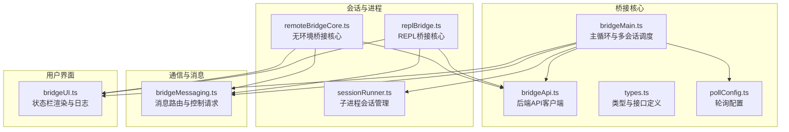
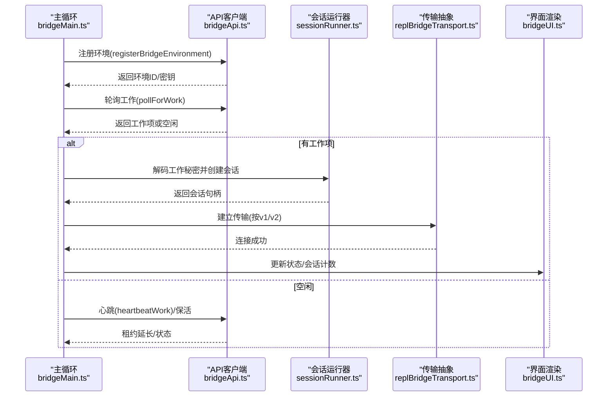
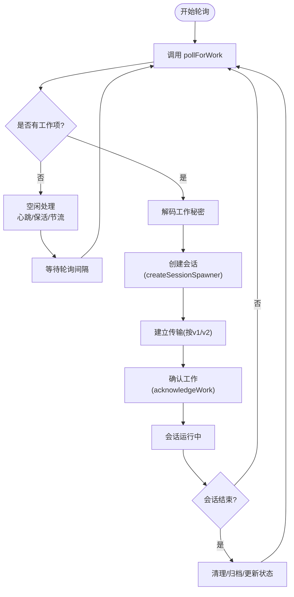
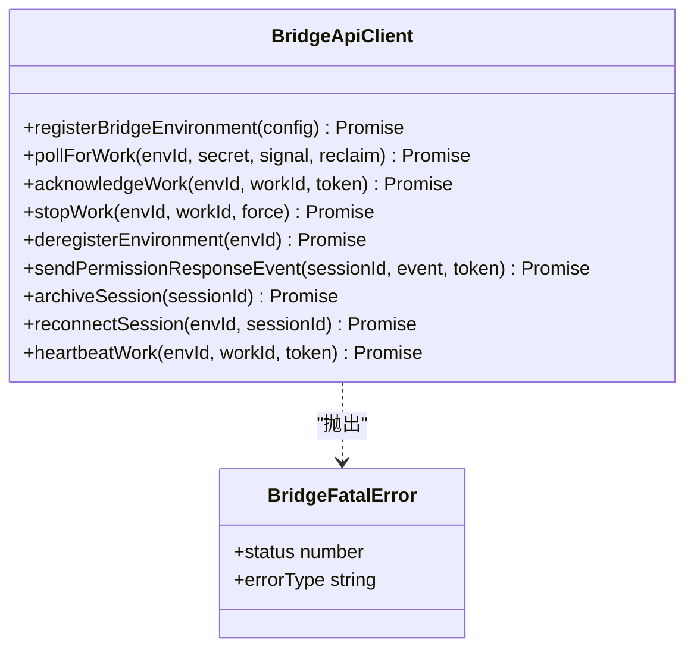
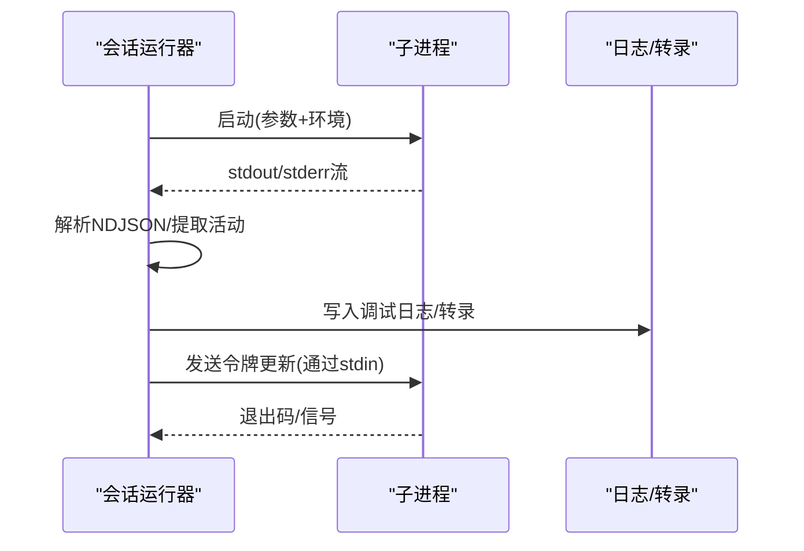
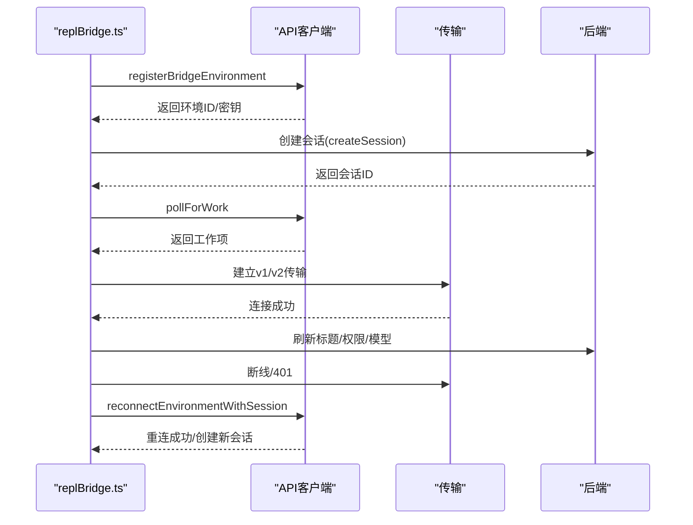
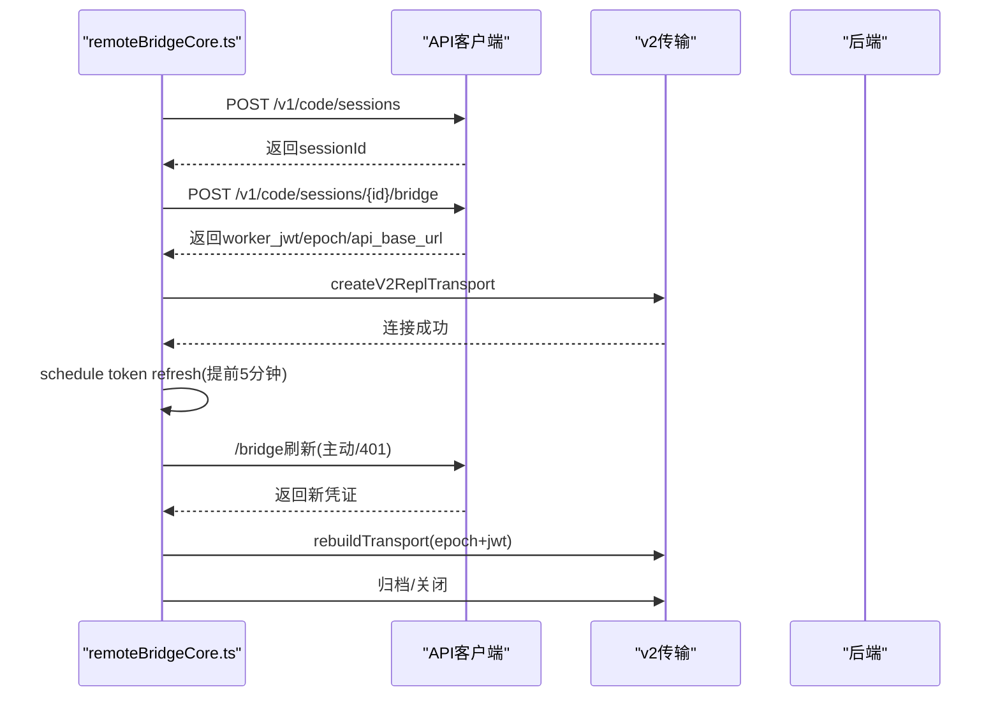
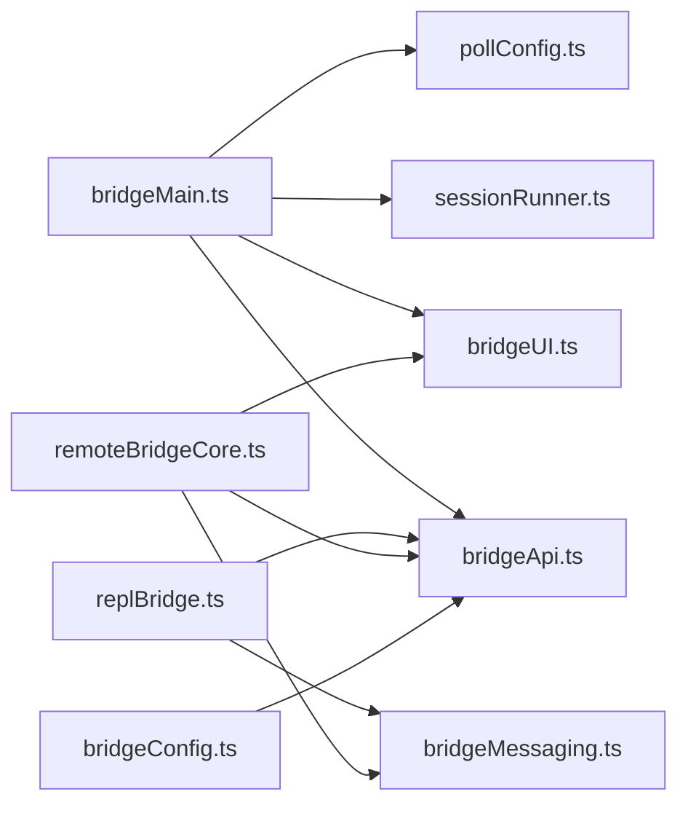

# 桥接架构设计

<cite>
**本文档引用的文件**
- [bridgeMain.ts](file://src/bridge/bridgeMain.ts)
- [bridgeConfig.ts](file://src/bridge/bridgeConfig.ts)
- [types.ts](file://src/bridge/types.ts)
- [bridgeApi.ts](file://src/bridge/bridgeApi.ts)
- [bridgeMessaging.ts](file://src/bridge/bridgeMessaging.ts)
- [sessionRunner.ts](file://src/bridge/sessionRunner.ts)
- [bridgeUI.ts](file://src/bridge/bridgeUI.ts)
- [pollConfig.ts](file://src/bridge/pollConfig.ts)
- [replBridge.ts](file://src/bridge/replBridge.ts)
- [remoteBridgeCore.ts](file://src/bridge/remoteBridgeCore.ts)
</cite>

## 目录
1. [引言](#引言)
2. [项目结构](#项目结构)
3. [核心组件](#核心组件)
4. [架构总览](#架构总览)
5. [详细组件分析](#详细组件分析)
6. [依赖分析](#依赖分析)
7. [性能考虑](#性能考虑)
8. [故障排除指南](#故障排除指南)
9. [结论](#结论)

## 引言
本文件系统性阐述桥接系统的架构设计与实现原理，覆盖主桥接组件、配置管理、状态管理、通信层、初始化流程、生命周期管理、错误处理与可扩展性设计。目标是帮助开发者快速理解桥接系统如何在多会话、多传输协议、多权限策略下稳定运行，并为后续扩展提供清晰的技术决策依据。

## 项目结构
桥接系统位于 src/bridge 目录，围绕“环境注册—工作轮询—会话创建—消息桥接—状态展示—生命周期管理”形成闭环。关键模块包括：
- 环境与API：bridgeMain.ts（主循环）、bridgeApi.ts（后端API封装）
- 配置与参数：bridgeConfig.ts、pollConfig.ts、types.ts
- 会话与进程：sessionRunner.ts（子进程会话管理）、replBridge.ts（REPL桥接核心）、remoteBridgeCore.ts（无环境桥接核心）
- 通信与消息：bridgeMessaging.ts（消息解析与控制请求处理）、replBridgeTransport.ts（传输抽象）
- 用户界面：bridgeUI.ts（终端状态栏渲染与日志）



**图表来源**
- [bridgeMain.ts:141-900](file://src/bridge/bridgeMain.ts#L141-L900)
- [bridgeApi.ts:68-452](file://src/bridge/bridgeApi.ts#L68-L452)
- [types.ts:81-263](file://src/bridge/types.ts#L81-L263)
- [pollConfig.ts:102-111](file://src/bridge/pollConfig.ts#L102-L111)
- [sessionRunner.ts:248-548](file://src/bridge/sessionRunner.ts#L248-L548)
- [replBridge.ts:260-800](file://src/bridge/replBridge.ts#L260-L800)
- [remoteBridgeCore.ts:140-800](file://src/bridge/remoteBridgeCore.ts#L140-L800)
- [bridgeUI.ts:42-531](file://src/bridge/bridgeUI.ts#L42-L531)

**章节来源**
- [bridgeMain.ts:141-900](file://src/bridge/bridgeMain.ts#L141-L900)
- [bridgeApi.ts:68-452](file://src/bridge/bridgeApi.ts#L68-L452)
- [types.ts:81-263](file://src/bridge/types.ts#L81-L263)
- [pollConfig.ts:102-111](file://src/bridge/pollConfig.ts#L102-L111)
- [sessionRunner.ts:248-548](file://src/bridge/sessionRunner.ts#L248-L548)
- [replBridge.ts:260-800](file://src/bridge/replBridge.ts#L260-L800)
- [remoteBridgeCore.ts:140-800](file://src/bridge/remoteBridgeCore.ts#L140-L800)
- [bridgeUI.ts:42-531](file://src/bridge/bridgeUI.ts#L42-L531)

## 核心组件
- 主桥接组件（bridgeMain.ts）：负责环境注册、工作轮询、心跳保活、会话生命周期管理、容量唤醒与状态更新。
- API客户端（bridgeApi.ts）：封装环境注册、工作轮询、确认、停止、注销、权限响应、归档、重连、心跳等后端接口，统一错误处理与重试逻辑。
- 类型与接口（types.ts）：定义工作数据、会话句柄、配置、客户端接口、日志器接口等，确保跨模块契约一致。
- 会话运行器（sessionRunner.ts）：创建子进程、解析活动、转发权限请求、管理调试日志与转录文件、令牌刷新。
- 消息与控制（bridgeMessaging.ts）：解析SDK消息、过滤入站消息、处理服务器控制请求、去重与回显过滤。
- REPL桥接核心（replBridge.ts）：环境模式桥接，支持v1/v2传输切换、断线重连、环境重建、标题派生、权限模式设置。
- 无环境桥接核心（remoteBridgeCore.ts）：直接连接会话入口，无需环境层，支持v2传输、主动令牌刷新、401恢复。
- 轮询配置（pollConfig.ts）：从增长实验服务动态拉取轮询间隔与容量保活策略，带严格校验与默认值。
- 用户界面（bridgeUI.ts）：终端状态栏渲染、QR码生成、日志输出、会话计数与活动显示。

**章节来源**
- [bridgeMain.ts:141-900](file://src/bridge/bridgeMain.ts#L141-L900)
- [bridgeApi.ts:68-452](file://src/bridge/bridgeApi.ts#L68-L452)
- [types.ts:81-263](file://src/bridge/types.ts#L81-L263)
- [sessionRunner.ts:248-548](file://src/bridge/sessionRunner.ts#L248-L548)
- [bridgeMessaging.ts:132-462](file://src/bridge/bridgeMessaging.ts#L132-L462)
- [replBridge.ts:260-800](file://src/bridge/replBridge.ts#L260-L800)
- [remoteBridgeCore.ts:140-800](file://src/bridge/remoteBridgeCore.ts#L140-L800)
- [pollConfig.ts:102-111](file://src/bridge/pollConfig.ts#L102-L111)
- [bridgeUI.ts:42-531](file://src/bridge/bridgeUI.ts#L42-L531)

## 架构总览
桥接系统采用“主循环驱动 + 多传输抽象 + 双桥接路径”的分层架构：
- 主循环层：bridgeMain.ts 统一调度多会话、心跳、轮询与容量管理。
- 传输抽象层：replBridgeTransport.ts 提供v1（混合传输）与v2（SSE+CCRClient）两种传输实现，按工作秘密或配置自动切换。
- 桥接核心层：replBridge.ts（环境模式）与 remoteBridgeCore.ts（无环境模式）分别面向不同使用场景。
- 通信与消息层：bridgeMessaging.ts 提供统一的消息解析、控制请求处理与去重机制。
- 配置与UI层：bridgeConfig.ts、pollConfig.ts、bridgeUI.ts 提供认证、轮询策略与可视化状态。



**图表来源**
- [bridgeMain.ts:141-900](file://src/bridge/bridgeMain.ts#L141-L900)
- [bridgeApi.ts:141-451](file://src/bridge/bridgeApi.ts#L141-L451)
- [sessionRunner.ts:248-548](file://src/bridge/sessionRunner.ts#L248-L548)
- [bridgeUI.ts:294-531](file://src/bridge/bridgeUI.ts#L294-L531)

**章节来源**
- [bridgeMain.ts:141-900](file://src/bridge/bridgeMain.ts#L141-L900)
- [bridgeApi.ts:141-451](file://src/bridge/bridgeApi.ts#L141-L451)
- [sessionRunner.ts:248-548](file://src/bridge/sessionRunner.ts#L248-L548)
- [bridgeUI.ts:294-531](file://src/bridge/bridgeUI.ts#L294-L531)

## 详细组件分析

### 主桥接组件（bridgeMain.ts）
- 职责：环境注册、工作轮询、心跳保活、会话生命周期管理、容量唤醒、状态更新、错误预算与回退、超时与中断处理。
- 关键流程：
  - 初始化：构建会话映射、定时器、容量唤醒、令牌刷新调度器、清理集合。
  - 轮询：根据增长实验配置调整轮询间隔；空闲时进入容量保活模式（心跳或慢速轮询）。
  - 工作项：解码工作秘密、创建会话、建立传输、ACK确认、记录活动与令牌。
  - 结束：清理会话、移除工作树、归档会话、更新状态与日志。
- 错误处理：区分致命错误（401/403/404/410）与一般错误；JWT过期触发重连；超时与中断区分处理。
- 性能特性：指数回退、空闲节流、容量唤醒、令牌预刷新。



**图表来源**
- [bridgeMain.ts:600-900](file://src/bridge/bridgeMain.ts#L600-L900)
- [sessionRunner.ts:248-548](file://src/bridge/sessionRunner.ts#L248-L548)

**章节来源**
- [bridgeMain.ts:141-900](file://src/bridge/bridgeMain.ts#L141-L900)
- [sessionRunner.ts:248-548](file://src/bridge/sessionRunner.ts#L248-L548)

### API客户端（bridgeApi.ts）
- 职责：封装后端API，统一鉴权头、调试日志、错误分类与重试、ID安全校验。
- 关键能力：
  - 环境注册、工作轮询、确认、停止、注销、权限响应、归档、重连、心跳。
  - OAuth 401重试：尝试刷新后重试一次；失败则抛出致命错误。
  - 错误分类：401/403/404/410/429等，配合业务语义化提示。
- 安全：ID路径参数白名单校验，防止注入。



**图表来源**
- [bridgeApi.ts:68-452](file://src/bridge/bridgeApi.ts#L68-L452)
- [types.ts:133-176](file://src/bridge/types.ts#L133-L176)

**章节来源**
- [bridgeApi.ts:68-452](file://src/bridge/bridgeApi.ts#L68-L452)
- [types.ts:133-176](file://src/bridge/types.ts#L133-L176)

### 会话运行器（sessionRunner.ts）
- 职责：子进程会话管理、活动提取、权限请求转发、调试日志与转录、令牌更新。
- 关键机制：
  - 子进程启动：拼接参数、注入环境变量（含会话访问令牌、沙箱开关、v1/v2标志）。
  - 活动解析：从stdout解析NDJSON，提取工具调用、文本、结果与错误，维护环形缓冲区。
  - 权限请求：检测control_request.can_use_tool，转发到上层处理。
  - 令牌刷新：通过stdin发送更新环境变量指令，避免重启。
  - 调试：支持自定义调试文件与转录文件，便于问题定位。



**图表来源**
- [sessionRunner.ts:248-548](file://src/bridge/sessionRunner.ts#L248-L548)

**章节来源**
- [sessionRunner.ts:248-548](file://src/bridge/sessionRunner.ts#L248-L548)

### 消息与控制（bridgeMessaging.ts）
- 职责：统一SDK消息解析、入站消息过滤、控制请求处理、去重与回显过滤。
- 关键点：
  - 入站消息：仅转发用户/助手/本地命令类消息；虚拟消息与内部进度不透传。
  - 控制请求：对initialize/set_model/set_max_thinking_tokens/set_permission_mode/interrupt进行即时响应。
  - 去重：基于最近发送/入站UUID集合，避免回显与重复处理。
  - 结果消息：构造最小化结果事件用于会话归档。

```mermaid
flowchart TD
In["收到入站消息"] --> Parse["解析JSON/标准化键"]
Parse --> Type{"消息类型?"}
Type --> |control_response| Perm["权限响应回调"]
Type --> |control_request| Ctrl["处理控制请求"]
Type --> |user/assistant/system(local_command)| Eligible["是否合格消息?"]
Eligible --> |是| Dedup["去重检查(UUID)"]
Dedup --> |通过| Forward["转发给上层"]
Eligible --> |否| Ignore["忽略"]
Type --> |其他| Ignore
```

**图表来源**
- [bridgeMessaging.ts:132-208](file://src/bridge/bridgeMessaging.ts#L132-L208)
- [bridgeMessaging.ts:243-391](file://src/bridge/bridgeMessaging.ts#L243-L391)

**章节来源**
- [bridgeMessaging.ts:132-208](file://src/bridge/bridgeMessaging.ts#L132-L208)
- [bridgeMessaging.ts:243-391](file://src/bridge/bridgeMessaging.ts#L243-L391)

### REPL桥接核心（replBridge.ts）
- 职责：环境模式桥接，支持v1/v2传输切换、断线重连、环境重建、标题派生、权限模式设置。
- 关键流程：
  - 环境注册：携带worker_type、最大会话数等元数据。
  - 会话创建：在环境中创建会话，持久化桥接指针以支持崩溃恢复。
  - 传输选择：根据工作秘密中的use_code_sessions或环境变量决定v1/v2。
  - 断线恢复：onEnvironmentLost触发重建策略（重连现有会话或创建新会话），保持URL不变。
  - 标题派生：监听首条人类消息，派生会话标题。



**图表来源**
- [replBridge.ts:260-800](file://src/bridge/replBridge.ts#L260-L800)
- [bridgeApi.ts:141-451](file://src/bridge/bridgeApi.ts#L141-L451)

**章节来源**
- [replBridge.ts:260-800](file://src/bridge/replBridge.ts#L260-L800)
- [bridgeApi.ts:141-451](file://src/bridge/bridgeApi.ts#L141-L451)

### 无环境桥接核心（remoteBridgeCore.ts）
- 职责：直接连接会话入口，无需环境层；支持v2传输、主动令牌刷新、401恢复。
- 关键流程：
  - 创建会话：POST /v1/code/sessions，获取会话ID。
  - 获取凭证：POST /v1/code/sessions/{id}/bridge，获取worker_jwt、worker_epoch、api_base_url。
  - 建立v2传输：SSE读 + CCRClient写，携带epoch与令牌。
  - 主动刷新：在expires_in前5分钟刷新JWT并重建传输，epoch必须同步更新。
  - 401恢复：刷新OAuth后重新获取凭证并重建传输。
  - 归档与收尾：发送结果事件，归档会话，关闭传输。



**图表来源**
- [remoteBridgeCore.ts:140-800](file://src/bridge/remoteBridgeCore.ts#L140-L800)
- [bridgeApi.ts:141-451](file://src/bridge/bridgeApi.ts#L141-L451)

**章节来源**
- [remoteBridgeCore.ts:140-800](file://src/bridge/remoteBridgeCore.ts#L140-L800)
- [bridgeApi.ts:141-451](file://src/bridge/bridgeApi.ts#L141-L451)

### 轮询配置（pollConfig.ts）
- 职责：从增长实验服务动态拉取轮询间隔与容量保活策略，带严格校验与默认值。
- 关键点：
  - Schema校验：拒绝小于100ms的间隔，要求至少启用一种容量保活机制。
  - 默认值：多会话与单会话默认值分离，保证向后兼容。
  - 缓存刷新：5分钟缓存窗口，避免频繁网络请求。

**章节来源**
- [pollConfig.ts:102-111](file://src/bridge/pollConfig.ts#L102-L111)

### 用户界面（bridgeUI.ts）
- 职责：终端状态栏渲染、QR码生成、日志输出、会话计数与活动显示。
- 关键点：
  - 状态机：idle/attached/reconnecting/failed，支持连接指示与旋转动画。
  - 多会话列表：显示每个会话标题、URL与当前活动摘要。
  - 交互提示：容量提示、模式切换提示、QR码显示/隐藏。
  - 日志：按需输出详细日志，支持调试文件路径提示。

**章节来源**
- [bridgeUI.ts:42-531](file://src/bridge/bridgeUI.ts#L42-L531)

## 依赖分析
- 组件耦合：
  - bridgeMain.ts 依赖 bridgeApi.ts、sessionRunner.ts、bridgeUI.ts、pollConfig.ts。
  - replBridge.ts/remoteBridgeCore.ts 依赖 bridgeApi.ts、bridgeMessaging.ts、replBridgeTransport.ts。
  - bridgeConfig.ts 为全局认证与URL解析提供统一入口。
- 外部依赖：
  - HTTP客户端（axios）、传输抽象（HybridTransport/SSETransport）、UUID集合（BoundedUUIDSet）。
- 循环依赖规避：
  - 消息处理与桥接核心解耦，通过回调与接口传递；UI与主循环通过状态更新接口解耦。



**图表来源**
- [bridgeMain.ts:141-900](file://src/bridge/bridgeMain.ts#L141-L900)
- [replBridge.ts:260-800](file://src/bridge/replBridge.ts#L260-L800)
- [remoteBridgeCore.ts:140-800](file://src/bridge/remoteBridgeCore.ts#L140-L800)
- [bridgeApi.ts:68-452](file://src/bridge/bridgeApi.ts#L68-L452)
- [bridgeMessaging.ts:132-208](file://src/bridge/bridgeMessaging.ts#L132-L208)
- [bridgeUI.ts:42-531](file://src/bridge/bridgeUI.ts#L42-L531)
- [bridgeConfig.ts:17-48](file://src/bridge/bridgeConfig.ts#L17-L48)

**章节来源**
- [bridgeMain.ts:141-900](file://src/bridge/bridgeMain.ts#L141-L900)
- [replBridge.ts:260-800](file://src/bridge/replBridge.ts#L260-L800)
- [remoteBridgeCore.ts:140-800](file://src/bridge/remoteBridgeCore.ts#L140-L800)
- [bridgeApi.ts:68-452](file://src/bridge/bridgeApi.ts#L68-L452)
- [bridgeMessaging.ts:132-208](file://src/bridge/bridgeMessaging.ts#L132-L208)
- [bridgeUI.ts:42-531](file://src/bridge/bridgeUI.ts#L42-L531)
- [bridgeConfig.ts:17-48](file://src/bridge/bridgeConfig.ts#L17-L48)

## 性能考虑
- 轮询与保活：通过增长实验配置动态调整轮询间隔与容量保活策略，避免过度轮询与空闲浪费。
- 回退与节流：指数回退与空闲节流降低服务器压力，同时保证快速恢复。
- 令牌预刷新：在JWT到期前5分钟主动刷新，减少401导致的抖动。
- 去重与环形缓冲：BoundedUUIDSet与活动环形缓冲限制内存占用，提升长会话稳定性。
- 传输选择：v2传输（SSE+CCRClient）在高并发下具备更好的吞吐与低延迟特性。

## 故障排除指南
- 认证失败（401/403）：
  - 触发OAuth刷新重试；若失败，抛出致命错误并终止。
  - 检查CLAUDE_BRIDGE_*开发覆盖与组织权限。
- 环境过期（404/410）：
  - 触发重连或重建环境与会话；必要时归档旧会话。
- 传输异常（401/409）：
  - v2：主动刷新凭证并重建传输；确保epoch同步更新。
  - v1：重连后继续轮询，保持租约延长。
- 会话超时/中断：
  - 区分超时杀死与服务器/正常关闭；超时会记录并清理资源。
- 日志与诊断：
  - 使用bridgeUI.ts的日志输出与调试文件路径提示；查看NDJSON转录文件定位问题。

**章节来源**
- [bridgeApi.ts:454-540](file://src/bridge/bridgeApi.ts#L454-L540)
- [replBridge.ts:617-800](file://src/bridge/replBridge.ts#L617-L800)
- [remoteBridgeCore.ts:530-760](file://src/bridge/remoteBridgeCore.ts#L530-L760)
- [bridgeUI.ts:322-358](file://src/bridge/bridgeUI.ts#L322-L358)

## 结论
桥接系统通过“主循环驱动 + 传输抽象 + 双桥接路径 + 统一消息处理 + 动态配置 + 可观测UI”的架构，实现了在复杂权限、多会话、多传输协议下的高可用与可扩展性。其模块化设计使各组件职责清晰、耦合度低，便于演进与维护；动态轮询配置与主动令牌刷新提升了稳定性与用户体验；严格的错误分类与去重机制保障了可靠性与一致性。未来可在插件化权限策略、多租户隔离与更细粒度的可观测性方面进一步扩展。