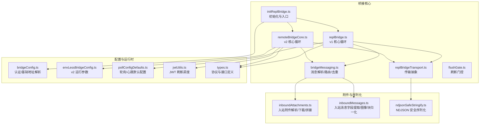
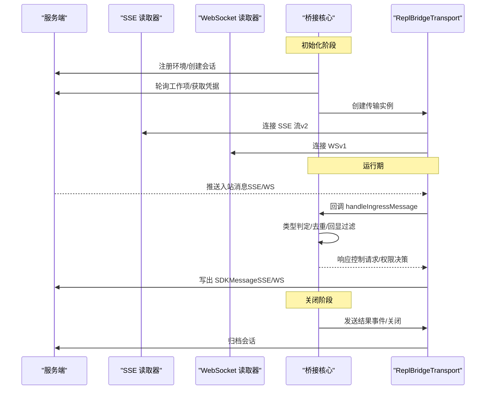
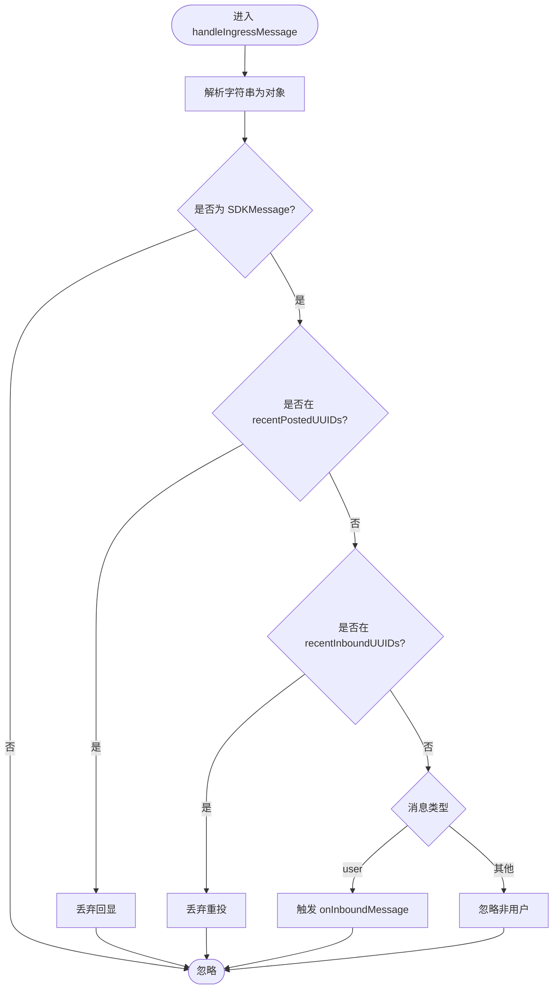
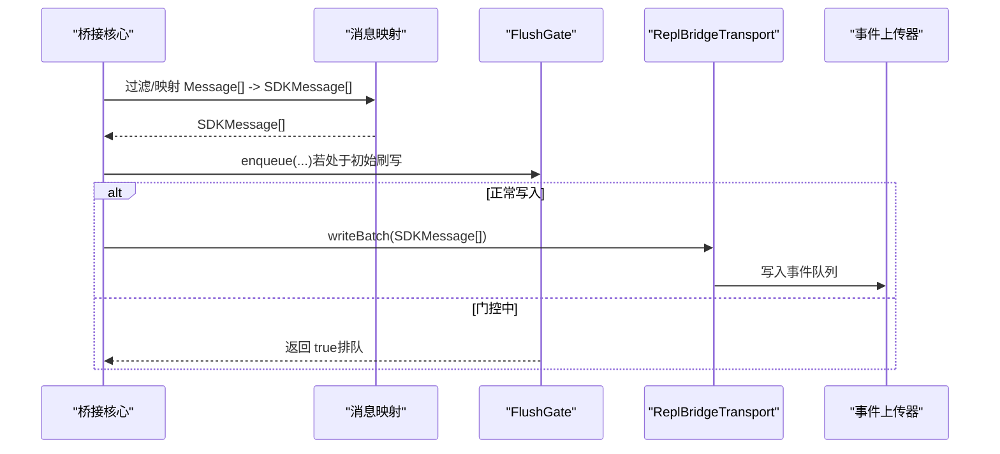
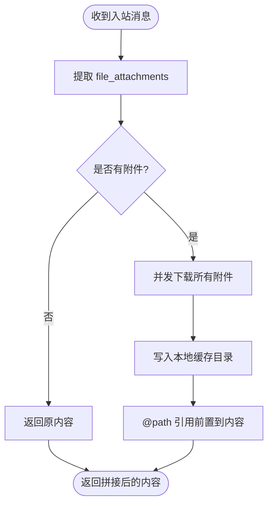
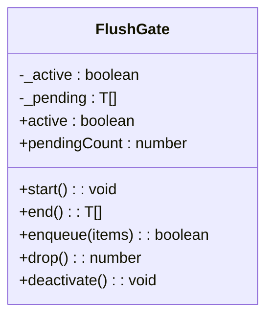
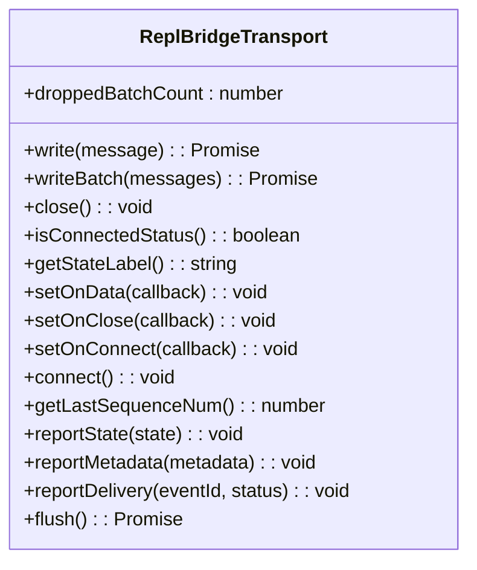
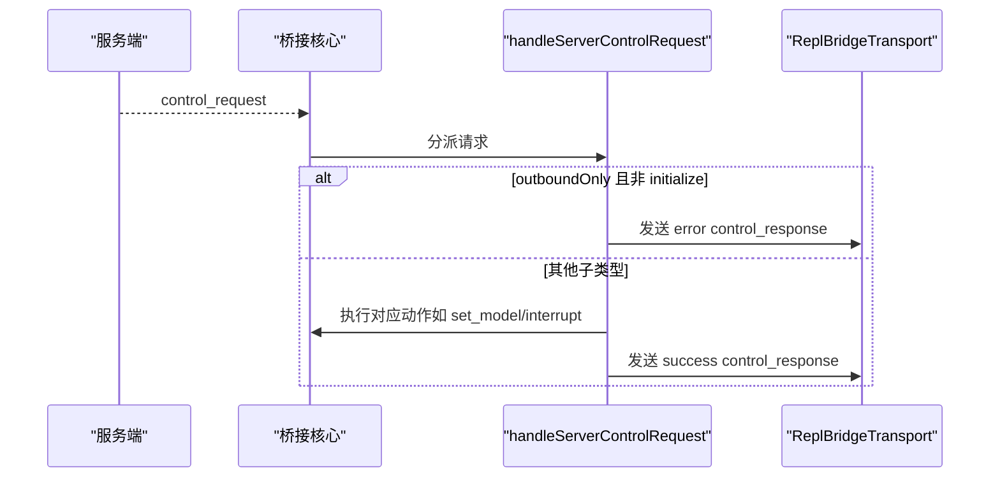
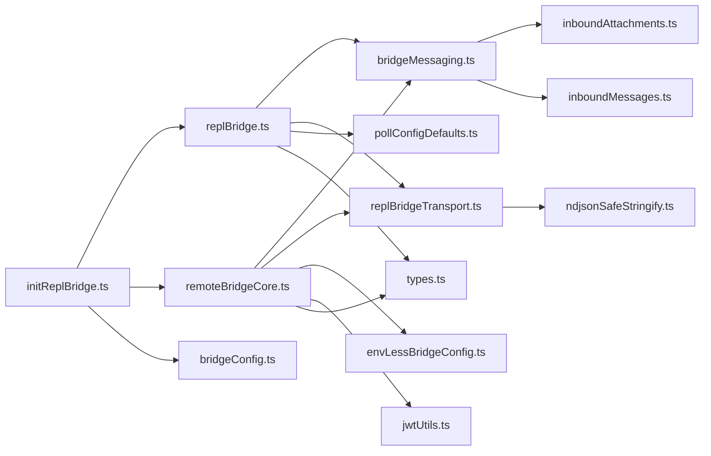
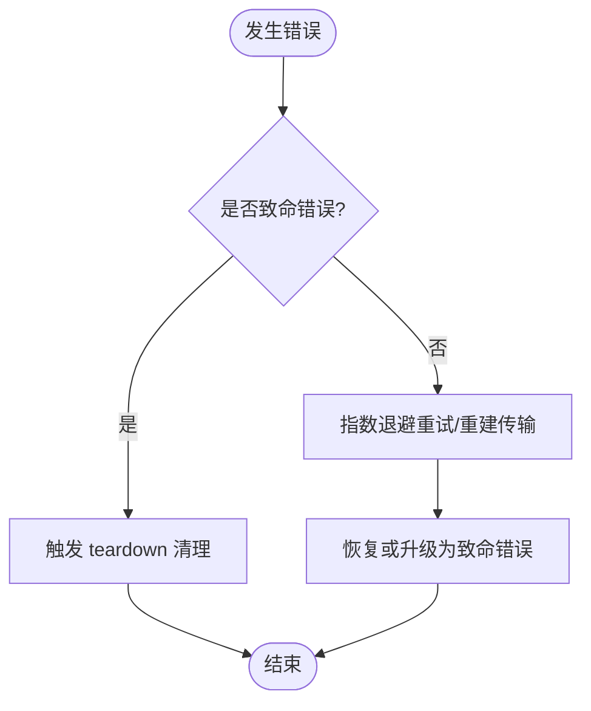

# 消息通信

<cite>
**本文引用的文件**
- [replBridge.ts](file://src/bridge/replBridge.ts)
- [bridgeMessaging.ts](file://src/bridge/bridgeMessaging.ts)
- [inboundMessages.ts](file://src/bridge/inboundMessages.ts)
- [inboundAttachments.ts](file://src/bridge/inboundAttachments.ts)
- [flushGate.ts](file://src/bridge/flushGate.ts)
- [replBridgeTransport.ts](file://src/bridge/replBridgeTransport.ts)
- [bridgeConfig.ts](file://src/bridge/bridgeConfig.ts)
- [types.ts](file://src/bridge/types.ts)
- [remoteBridgeCore.ts](file://src/bridge/remoteBridgeCore.ts)
- [initReplBridge.ts](file://src/bridge/initReplBridge.ts)
- [envLessBridgeConfig.ts](file://src/bridge/envLessBridgeConfig.ts)
- [pollConfigDefaults.ts](file://src/bridge/pollConfigDefaults.ts)
- [jwtUtils.ts](file://src/bridge/jwtUtils.ts)
- [ndjsonSafeStringify.ts](file://src/cli/ndjsonSafeStringify.ts)
- [bridgeApi.ts](file://src/bridge/bridgeApi.ts)
- [debugUtils.ts](file://src/bridge/debugUtils.ts)
</cite>

## 目录
1. [简介](#简介)
2. [项目结构](#项目结构)
3. [核心组件](#核心组件)
4. [架构总览](#架构总览)
5. [详细组件分析](#详细组件分析)
6. [依赖关系分析](#依赖关系分析)
7. [性能考量](#性能考量)
8. [故障排查指南](#故障排查指南)
9. [结论](#结论)
10. [附录：配置与调优](#附录配置与调优)

## 简介
本文件系统性阐述桥接系统的消息通信机制，覆盖消息路由、序列化/反序列化、入站消息处理、附件传输、刷新门控（FlushGate）机制、错误处理与重试、以及配置与性能调优。目标是为网络开发者提供可操作的实现指导与最佳实践。

## 项目结构
桥接系统围绕两条路径展开：
- 环境（Environments API）驱动的 v1 路径：通过轮询工作项、注册环境、心跳保活、断线重连等完成会话生命周期管理。
- 环境无关（Env-less）的 v2 路径：直接通过 /bridge 获取 worker JWT，使用 CCR v2 协议（SSE + CCRClient）进行读写，无需环境层。

图示来源
- [initReplBridge.ts](file://src/bridge/initReplBridge.ts)
- [replBridge.ts](file://src/bridge/replBridge.ts)
- [remoteBridgeCore.ts](file://src/bridge/remoteBridgeCore.ts)
- [bridgeMessaging.ts](file://src/bridge/bridgeMessaging.ts)
- [replBridgeTransport.ts](file://src/bridge/replBridgeTransport.ts)
- [inboundAttachments.ts](file://src/bridge/inboundAttachments.ts)
- [inboundMessages.ts](file://src/bridge/inboundMessages.ts)
- [ndjsonSafeStringify.ts](file://src/cli/ndjsonSafeStringify.ts)
- [bridgeConfig.ts](file://src/bridge/bridgeConfig.ts)
- [envLessBridgeConfig.ts](file://src/bridge/envLessBridgeConfig.ts)
- [pollConfigDefaults.ts](file://src/bridge/pollConfigDefaults.ts)
- [jwtUtils.ts](file://src/bridge/jwtUtils.ts)
- [types.ts](file://src/bridge/types.ts)

章节来源
- [initReplBridge.ts:110-545](file://src/bridge/initReplBridge.ts#L110-L545)
- [replBridge.ts:260-800](file://src/bridge/replBridge.ts#L260-L800)
- [remoteBridgeCore.ts:140-800](file://src/bridge/remoteBridgeCore.ts#L140-L800)
- [bridgeMessaging.ts:126-208](file://src/bridge/bridgeMessaging.ts#L126-L208)
- [replBridgeTransport.ts:23-70](file://src/bridge/replBridgeTransport.ts#L23-L70)
- [inboundAttachments.ts:41-176](file://src/bridge/inboundAttachments.ts#L41-L176)
- [inboundMessages.ts:21-81](file://src/bridge/inboundMessages.ts#L21-L81)
- [ndjsonSafeStringify.ts:24-32](file://src/cli/ndjsonSafeStringify.ts#L24-L32)
- [bridgeConfig.ts:34-49](file://src/bridge/bridgeConfig.ts#L34-L49)
- [envLessBridgeConfig.ts:7-58](file://src/bridge/envLessBridgeConfig.ts#L7-L58)
- [pollConfigDefaults.ts:44-83](file://src/bridge/pollConfigDefaults.ts#L44-L83)
- [jwtUtils.ts:72-257](file://src/bridge/jwtUtils.ts#L72-L257)
- [types.ts:81-263](file://src/bridge/types.ts#L81-L263)

## 核心组件
- 入站消息处理管线
  - 解析与类型守卫：统一解析字符串为 SDKMessage，识别 control_response 与 control_request。
  - 去重与回显过滤：基于最近发送/接收的 UUID 集合，避免重复与回显。
  - 分发：仅对用户消息触发回调；控制请求由服务端控制处理器响应。
- 出站消息序列化
  - 将内部 Message[] 映射为 SDKMessage[]，并注入 session_id。
  - 使用安全的 NDJSON 序列化，避免换行符导致的流分割问题。
- 附件传输
  - 提取 file_attachments，下载到本地缓存目录，生成 @path 引用并前置到内容。
  - 失败降级：无 token/网络/非 2xx/磁盘失败均记录调试日志并跳过该附件。
- 刷新门控（FlushGate）
  - 在初始历史刷写期间阻塞新消息写入，确保服务器端顺序为 [历史...，实时...]。
- 传输抽象（ReplBridgeTransport）
  - v1：HybridTransport（WS 读 + Session-Ingress POST 写）。
  - v2：SSETransport（读）+ CCRClient（写），支持 epoch 管理、交付跟踪、心跳。
- 认证与配置
  - 统一的 OAuth/JWT 获取与覆盖逻辑，基础 URL 解析。
  - v2 参数：重试、超时、心跳、连接超时、最小版本等。
- 错误处理与重试
  - 环境轮询失败指数退避；401 自动刷新；409/401 触发传输重建；致命错误终止并清理。

章节来源
- [bridgeMessaging.ts:126-208](file://src/bridge/bridgeMessaging.ts#L126-L208)
- [bridgeMessaging.ts:243-391](file://src/bridge/bridgeMessaging.ts#L243-L391)
- [inboundAttachments.ts:123-176](file://src/bridge/inboundAttachments.ts#L123-L176)
- [flushGate.ts:16-72](file://src/bridge/flushGate.ts#L16-L72)
- [replBridgeTransport.ts:23-70](file://src/bridge/replBridgeTransport.ts#L23-L70)
- [bridgeConfig.ts:34-49](file://src/bridge/bridgeConfig.ts#L34-L49)
- [envLessBridgeConfig.ts:7-58](file://src/bridge/envLessBridgeConfig.ts#L7-L58)
- [jwtUtils.ts:72-257](file://src/bridge/jwtUtils.ts#L72-L257)

## 架构总览
桥接系统在客户端与服务端之间建立两类通道：
- 入站通道：服务端推送（v1 为 WS，v2 为 SSE），经由 handleIngressMessage 解析后按类型分发。
- 出站通道：客户端通过 ReplBridgeTransport 写入（v1 为 Session-Ingress POST，v2 为 CCRClient 的事件上传）。

图示来源
- [replBridge.ts:529-600](file://src/bridge/replBridge.ts#L529-L600)
- [remoteBridgeCore.ts:380-466](file://src/bridge/remoteBridgeCore.ts#L380-L466)
- [replBridgeTransport.ts:320-371](file://src/bridge/replBridgeTransport.ts#L320-L371)

## 详细组件分析

### 组件A：入站消息处理（解析、验证、分发）
- 解析与类型守卫
  - 使用安全解析与键名兼容化，识别 control_response 与 control_request。
  - 对 SDKMessage 进行类型守卫，确保后续分支安全。
- 去重与回显过滤
  - recentPostedUUIDs：已发送消息的环形去重集合，过滤回显。
  - recentInboundUUIDs：已转发入站提示的环形去重集合，防御服务器重投。
- 分发策略
  - 仅对用户消息触发 onInboundMessage；工具结果、进度等内部消息不透传。
  - 控制请求交由 handleServerControlRequest 快速响应，避免超时。

图示来源
- [bridgeMessaging.ts:126-208](file://src/bridge/bridgeMessaging.ts#L126-L208)

章节来源
- [bridgeMessaging.ts:36-70](file://src/bridge/bridgeMessaging.ts#L36-L70)
- [bridgeMessaging.ts:126-208](file://src/bridge/bridgeMessaging.ts#L126-L208)

### 组件B：出站消息序列化与写入
- 映射与注入
  - 将内部 Message[] 映射为 SDKMessage[]，并注入 session_id。
  - 过滤已发送/初始历史 UUID，避免重复或顺序错乱。
- 安全序列化
  - 使用 ndjsonSafeStringify，将 U+2028/U+2029 转义为 \u2028/\u2029，防止被行终止符切分。
- 写入路径
  - v1：HybridTransport.write/writeBatch。
  - v2：CCRClient.writeEvent/SerialBatchEventUploader，支持批量与顺序保证。

图示来源
- [remoteBridgeCore.ts:607-656](file://src/bridge/remoteBridgeCore.ts#L607-L656)
- [replBridgeTransport.ts:274-283](file://src/bridge/replBridgeTransport.ts#L274-L283)
- [ndjsonSafeStringify.ts:24-32](file://src/cli/ndjsonSafeStringify.ts#L24-L32)

章节来源
- [remoteBridgeCore.ts:607-656](file://src/bridge/remoteBridgeCore.ts#L607-L656)
- [replBridgeTransport.ts:23-70](file://src/bridge/replBridgeTransport.ts#L23-L70)
- [ndjsonSafeStringify.ts:24-32](file://src/cli/ndjsonSafeStringify.ts#L24-L32)

### 组件C：附件传输（实现原理与优化）
- 提取与校验
  - 从消息体提取 file_attachments 数组，使用 Zod 模式校验。
- 下载与落盘
  - 通过 OAuth Token 获取文件内容，写入 ~/.claude/uploads/{sessionId}/。
  - 文件名清洗，前缀加 uuid 前缀避免同名冲突。
- 前置引用
  - 将 @path 引用前置到内容文本块（优先最后一个 text 块，否则追加）。
- 降级策略
  - 无 token、网络错误、非 2xx、磁盘写入失败均记录调试日志并跳过该附件，保证消息仍可达。

图示来源
- [inboundAttachments.ts:41-176](file://src/bridge/inboundAttachments.ts#L41-L176)

章节来源
- [inboundAttachments.ts:41-176](file://src/bridge/inboundAttachments.ts#L41-L176)

### 组件D：刷新门控（FlushGate）机制
- 目标
  - 在初始历史刷写期间阻止实时消息写入，确保服务器端顺序为 [历史...，实时...]。
- 行为
  - start() 启动门控，enqueue(...) 返回 true 并排队。
  - end() 放行并返回队列；drop() 清空并丢弃队列；deactivate() 清除激活状态但保留队列。
- 与 v2 的配合
  - v2 在重建传输时利用门控队列，确保 epoch 变更后仍能有序放行。

图示来源
- [flushGate.ts:16-72](file://src/bridge/flushGate.ts#L16-L72)

章节来源
- [flushGate.ts:16-72](file://src/bridge/flushGate.ts#L16-L72)
- [remoteBridgeCore.ts:477-527](file://src/bridge/remoteBridgeCore.ts#L477-L527)

### 组件E：传输抽象（ReplBridgeTransport）
- v1：HybridTransport
  - 读：WebSocket 数据回调；写：按消息 POST 到 Session-Ingress。
  - 不使用 SSE 序号，重连语义不同。
- v2：SSETransport + CCRClient
  - 读：SSE 事件流；写：CCRClient 事件上传器。
  - 支持 epoch 管理、交付跟踪（received/processing/processed）、心跳、传输重建。
  - outboundOnly 模式：仅写入，不接收入站事件。

图示来源
- [replBridgeTransport.ts:23-70](file://src/bridge/replBridgeTransport.ts#L23-L70)

章节来源
- [replBridgeTransport.ts:119-371](file://src/bridge/replBridgeTransport.ts#L119-L371)

### 组件F：控制请求处理（handleServerControlRequest）
- 支持子类型：initialize、set_model、set_max_thinking_tokens、set_permission_mode、interrupt。
- outboundOnly 模式下，除 initialize 外的可变请求返回错误，避免“假成功”。
- 权限模式决策通过回调返回，避免模块耦合。

图示来源
- [bridgeMessaging.ts:243-391](file://src/bridge/bridgeMessaging.ts#L243-L391)

章节来源
- [bridgeMessaging.ts:243-391](file://src/bridge/bridgeMessaging.ts#L243-L391)

## 依赖关系分析
- 初始化与入口
  - initReplBridge 根据策略选择 v1 或 v2 路径，准备标题、组织 UUID、Git 上下文等。
- 核心循环
  - v1：环境轮询、工作项分配、心跳、断线重连、环境重建。
  - v2：直接获取 worker JWT，SSE 读 + CCRClient 写，JWT 刷新与传输重建。
- 传输与消息
  - ReplBridgeTransport 抽象 v1/v2 差异；bridgeMessaging 统一入站解析与去重；ndjsonSafeStringify 保障序列化安全。
- 附件与图像
  - inboundAttachments 与 inboundMessages 负责附件下载与图像块归一化。
- 配置与运行时
  - bridgeConfig 提供认证与基础 URL；envLessBridgeConfig 提供 v2 参数；pollConfigDefaults 提供 v1 默认轮询/心跳；jwtUtils 提供 JWT 刷新调度。

图示来源
- [initReplBridge.ts:410-545](file://src/bridge/initReplBridge.ts#L410-L545)
- [replBridge.ts:529-600](file://src/bridge/replBridge.ts#L529-L600)
- [remoteBridgeCore.ts:380-466](file://src/bridge/remoteBridgeCore.ts#L380-L466)
- [bridgeMessaging.ts:126-208](file://src/bridge/bridgeMessaging.ts#L126-L208)
- [inboundAttachments.ts:41-176](file://src/bridge/inboundAttachments.ts#L41-L176)
- [inboundMessages.ts:21-81](file://src/bridge/inboundMessages.ts#L21-L81)
- [replBridgeTransport.ts:23-70](file://src/bridge/replBridgeTransport.ts#L23-L70)
- [ndjsonSafeStringify.ts:24-32](file://src/cli/ndjsonSafeStringify.ts#L24-L32)
- [bridgeConfig.ts:34-49](file://src/bridge/bridgeConfig.ts#L34-L49)
- [envLessBridgeConfig.ts:7-58](file://src/bridge/envLessBridgeConfig.ts#L7-L58)
- [pollConfigDefaults.ts:44-83](file://src/bridge/pollConfigDefaults.ts#L44-L83)
- [jwtUtils.ts:72-257](file://src/bridge/jwtUtils.ts#L72-L257)
- [types.ts:81-263](file://src/bridge/types.ts#L81-L263)

章节来源
- [initReplBridge.ts:410-545](file://src/bridge/initReplBridge.ts#L410-L545)
- [replBridge.ts:529-600](file://src/bridge/replBridge.ts#L529-L600)
- [remoteBridgeCore.ts:380-466](file://src/bridge/remoteBridgeCore.ts#L380-L466)
- [bridgeMessaging.ts:126-208](file://src/bridge/bridgeMessaging.ts#L126-L208)
- [replBridgeTransport.ts:23-70](file://src/bridge/replBridgeTransport.ts#L23-L70)

## 性能考量
- 历史刷写顺序
  - 使用 FlushGate 严格保证 [历史...，实时...]，避免服务器端乱序与重复。
- 去重与回显过滤
  - BoundedUUIDSet 采用环形缓冲，容量固定，内存占用稳定；双重去重降低重投与回显影响。
- v2 写入批量化
  - CCRClient 内部批处理（最大 100），顺序入队以保持顺序一致性。
- 轮询与心跳
  - v1：轮询间隔与心跳独立配置，避免过度轮询；空闲保活可选。
  - v2：心跳间隔与抖动可调，proactive JWT 刷新减少 401 风险。
- 序列化安全
  - NDJSON 安全序列化避免行切分，提升流稳定性。

章节来源
- [flushGate.ts:419-461](file://src/bridge/bridgeMessaging.ts#L419-L461)
- [replBridgeTransport.ts:274-283](file://src/bridge/replBridgeTransport.ts#L274-L283)
- [pollConfigDefaults.ts:44-83](file://src/bridge/pollConfigDefaults.ts#L44-L83)
- [envLessBridgeConfig.ts:7-58](file://src/bridge/envLessBridgeConfig.ts#L7-L58)
- [ndjsonSafeStringify.ts:24-32](file://src/cli/ndjsonSafeStringify.ts#L24-L32)

## 故障排查指南
- 环境轮询失败
  - 指数退避与超时上限，超过阈值视为致命错误；401/403/404/410 区分处理。
- 401/409 错误
  - v2：JWT 过期触发传输重建；epoch 不匹配触发关闭并重连。
  - v1：轮询异常触发快速重连，必要时重新注册环境。
- 附件下载失败
  - 记录调试日志并跳过该附件，保证消息可达；检查 OAuth Token、网络与磁盘权限。
- 传输重建
  - 重建前后需确保队列门控与序列号携带，避免历史重放与乱序。

图示来源
- [bridgeApi.ts:454-500](file://src/bridge/bridgeApi.ts#L454-L500)
- [remoteBridgeCore.ts:530-590](file://src/bridge/remoteBridgeCore.ts#L530-L590)
- [replBridge.ts:2272-2306](file://src/bridge/replBridge.ts#L2272-L2306)

章节来源
- [bridgeApi.ts:454-500](file://src/bridge/bridgeApi.ts#L454-L500)
- [remoteBridgeCore.ts:530-590](file://src/bridge/remoteBridgeCore.ts#L530-L590)
- [replBridge.ts:2272-2306](file://src/bridge/replBridge.ts#L2272-L2306)
- [debugUtils.ts:84-141](file://src/bridge/debugUtils.ts#L84-L141)

## 结论
桥接系统通过统一的消息解析与去重、严格的初始刷写顺序、安全的序列化与附件传输、以及完善的错误处理与重试机制，实现了高可靠、低延迟的跨端消息通信。v2 路径进一步简化了环境层依赖，提升了连接稳定性与可观测性。

## 附录：配置与调优
- v1（环境轮询）
  - 轮询间隔与心跳：参考 DEFAULT_POLL_CONFIG 中的 not_at_capacity/at_capacity 与 non_exclusive_heartbeat_interval_ms。
  - 空闲保活：session_keepalive_interval_v2_ms 控制静默帧发送频率。
- v2（环境无关）
  - 重试与超时：init_retry_max_attempts/base_delay/jitter/max_delay、http_timeout_ms。
  - 去重缓冲：uuid_dedup_buffer_size。
  - 心跳与抖动：heartbeat_interval_ms、heartbeat_jitter_fraction。
  - JWT 刷新：token_refresh_buffer_ms（提前刷新窗口）。
  - 连接超时：connect_timeout_ms（onConnect 未触发的最长等待）。
  - 最小版本：min_version（客户端版本门槛）。
- 认证与基础地址
  - getBridgeAccessToken/getBridgeBaseUrl 支持开发覆盖（ANT 专用），生产环境使用 OAuth 存储。
- 传输参数
  - outboundOnly：镜像模式仅写入，不接收入站事件。
  - epoch：v2 传输重建时携带，避免历史重放与 409。

章节来源
- [pollConfigDefaults.ts:44-83](file://src/bridge/pollConfigDefaults.ts#L44-L83)
- [envLessBridgeConfig.ts:7-58](file://src/bridge/envLessBridgeConfig.ts#L7-L58)
- [envLessBridgeConfig.ts:130-137](file://src/bridge/envLessBridgeConfig.ts#L130-L137)
- [bridgeConfig.ts:34-49](file://src/bridge/bridgeConfig.ts#L34-L49)
- [types.ts:81-263](file://src/bridge/types.ts#L81-L263)