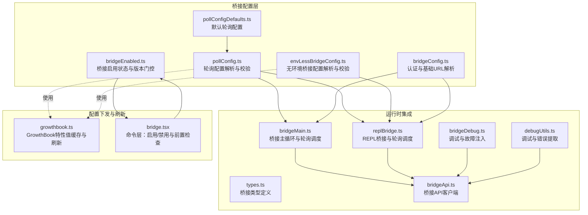
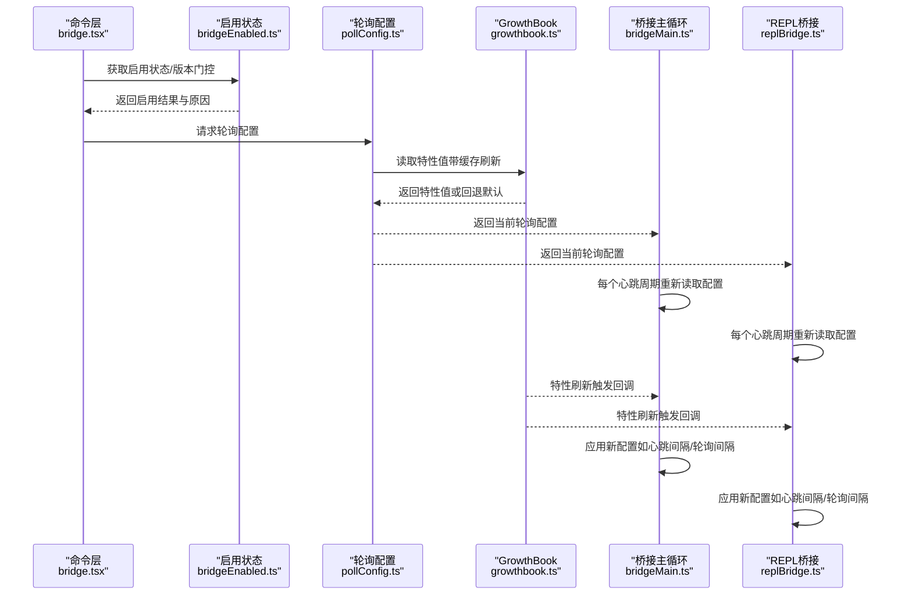
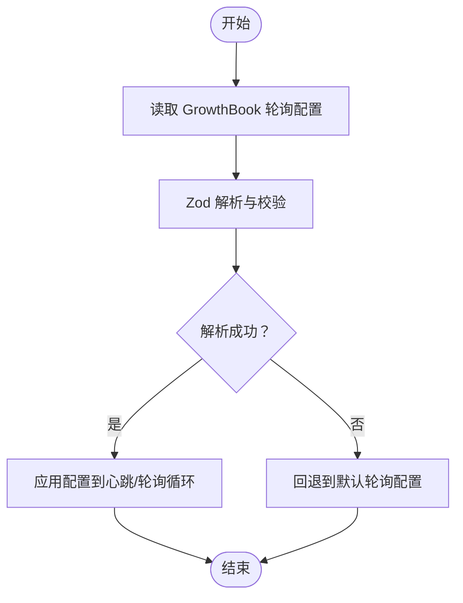
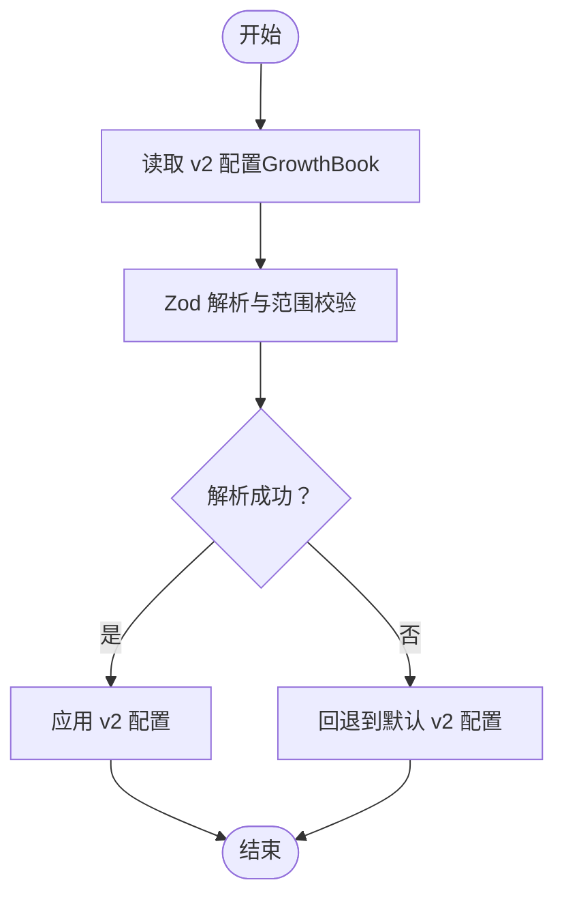
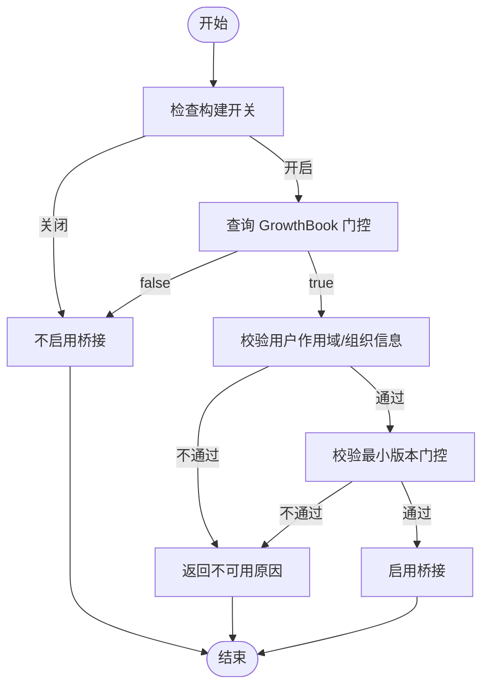
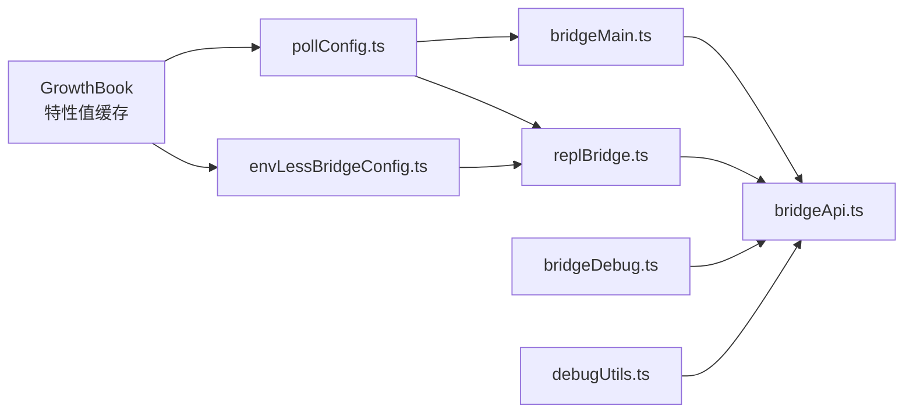

# 配置管理

<cite>
**本文引用的文件**
- [pollConfig.ts](file://src/bridge/pollConfig.ts)
- [pollConfigDefaults.ts](file://src/bridge/pollConfigDefaults.ts)
- [envLessBridgeConfig.ts](file://src/bridge/envLessBridgeConfig.ts)
- [bridgeEnabled.ts](file://src/bridge/bridgeEnabled.ts)
- [bridgeConfig.ts](file://src/bridge/bridgeConfig.ts)
- [bridgeMain.ts](file://src/bridge/bridgeMain.ts)
- [replBridge.ts](file://src/bridge/replBridge.ts)
- [types.ts](file://src/bridge/types.ts)
- [growthbook.ts](file://src/services/analytics/growthbook.ts)
- [bridge.tsx](file://src/commands/bridge/bridge.tsx)
- [bridgeApi.ts](file://src/bridge/bridgeApi.ts)
- [bridgeDebug.ts](file://src/bridge/bridgeDebug.ts)
- [debugUtils.ts](file://src/bridge/debugUtils.ts)
</cite>

## 目录
1. [简介](#简介)
2. [项目结构](#项目结构)
3. [核心组件](#核心组件)
4. [架构总览](#架构总览)
5. [详细组件分析](#详细组件分析)
6. [依赖关系分析](#依赖关系分析)
7. [性能考量](#性能考量)
8. [故障排查指南](#故障排查指南)
9. [结论](#结论)
10. [附录](#附录)

## 简介
本文件面向系统管理员与运维工程师，系统化阐述桥接系统的配置管理机制，覆盖以下主题：
- 轮询配置的实现原理、默认值与环境特定配置（GrowthBook）管理
- 无环境（env-less）桥接路径的配置与兼容性设计
- 桥接启用状态的判定与动态切换机制
- 配置文件结构、参数详解与验证策略
- 配置热重载与实时更新能力
- 错误处理与回退策略
- 实战建议与排障要点

## 项目结构
桥接配置相关代码主要集中在 src/bridge 与 src/services/analytics/growthbook.ts 中，并通过命令层与桥接主循环进行集成。



图示来源
- [pollConfig.ts:1-111](file://src/bridge/pollConfig.ts#L1-L111)
- [pollConfigDefaults.ts:1-83](file://src/bridge/pollConfigDefaults.ts#L1-L83)
- [envLessBridgeConfig.ts:1-166](file://src/bridge/envLessBridgeConfig.ts#L1-L166)
- [bridgeEnabled.ts:1-203](file://src/bridge/bridgeEnabled.ts#L1-L203)
- [bridgeConfig.ts:1-49](file://src/bridge/bridgeConfig.ts#L1-L49)
- [bridgeMain.ts:1-200](file://src/bridge/bridgeMain.ts#L1-L200)
- [replBridge.ts:1-200](file://src/bridge/replBridge.ts#L1-L200)
- [types.ts:1-263](file://src/bridge/types.ts#L1-L263)
- [growthbook.ts:100-157](file://src/services/analytics/growthbook.ts#L100-L157)
- [bridge.tsx:482-508](file://src/commands/bridge/bridge.tsx#L482-L508)
- [bridgeApi.ts:68-147](file://src/bridge/bridgeApi.ts#L68-L147)
- [bridgeDebug.ts:1-36](file://src/bridge/bridgeDebug.ts#L1-L36)
- [debugUtils.ts:84-141](file://src/bridge/debugUtils.ts#L84-L141)

章节来源
- [pollConfig.ts:1-111](file://src/bridge/pollConfig.ts#L1-L111)
- [pollConfigDefaults.ts:1-83](file://src/bridge/pollConfigDefaults.ts#L1-L83)
- [envLessBridgeConfig.ts:1-166](file://src/bridge/envLessBridgeConfig.ts#L1-L166)
- [bridgeEnabled.ts:1-203](file://src/bridge/bridgeEnabled.ts#L1-L203)
- [bridgeConfig.ts:1-49](file://src/bridge/bridgeConfig.ts#L1-L49)
- [bridgeMain.ts:1-200](file://src/bridge/bridgeMain.ts#L1-L200)
- [replBridge.ts:1-200](file://src/bridge/replBridge.ts#L1-L200)
- [types.ts:1-263](file://src/bridge/types.ts#L1-L263)
- [growthbook.ts:100-157](file://src/services/analytics/growthbook.ts#L100-L157)
- [bridge.tsx:482-508](file://src/commands/bridge/bridge.tsx#L482-L508)
- [bridgeApi.ts:68-147](file://src/bridge/bridgeApi.ts#L68-L147)
- [bridgeDebug.ts:1-36](file://src/bridge/bridgeDebug.ts#L1-L36)
- [debugUtils.ts:84-141](file://src/bridge/debugUtils.ts#L84-L141)

## 核心组件
- 轮询配置（pollConfig）
  - 通过 GrowthBook 动态下发，Zod 校验与回退策略，支持单会话与多会话差异化轮询间隔。
- 无环境桥接配置（envLessBridgeConfig）
  - 针对 v2（env-less）路径的超时、重试、心跳等参数，独立于 v1 的最小版本门控。
- 启用状态与版本门控（bridgeEnabled）
  - 基于构建开关与 GrowthBook 门控，结合订阅与作用域校验，决定是否启用桥接与 v2 路径。
- 认证与基础URL（bridgeConfig）
  - 开发者覆盖与 OAuth 存储的优先级策略，统一桥接访问令牌与基础URL来源。
- 运行时集成（bridgeMain/replBridge）
  - 在轮询循环中按周期重新读取 GrowthBook 配置，实现热重载；在心跳循环中按配置执行非独占心跳。
- 类型与API（types/bridgeApi）
  - 明确工作项、会话、权限响应等协议类型；API 客户端封装认证刷新与错误处理。

章节来源
- [pollConfig.ts:94-111](file://src/bridge/pollConfig.ts#L94-L111)
- [envLessBridgeConfig.ts:119-137](file://src/bridge/envLessBridgeConfig.ts#L119-L137)
- [bridgeEnabled.ts:28-55](file://src/bridge/bridgeEnabled.ts#L28-L55)
- [bridgeConfig.ts:17-49](file://src/bridge/bridgeConfig.ts#L17-L49)
- [bridgeMain.ts:657-687](file://src/bridge/bridgeMain.ts#L657-L687)
- [replBridge.ts:158-165](file://src/bridge/replBridge.ts#L158-L165)
- [types.ts:81-176](file://src/bridge/types.ts#L81-L176)
- [bridgeApi.ts:113-139](file://src/bridge/bridgeApi.ts#L113-L139)

## 架构总览
下图展示从命令层到桥接主循环的配置读取与热重载流程，以及 GrowthBook 刷新监听机制如何驱动配置更新。



图示来源
- [bridge.tsx:482-508](file://src/commands/bridge/bridge.tsx#L482-L508)
- [bridgeEnabled.ts:28-55](file://src/bridge/bridgeEnabled.ts#L28-L55)
- [pollConfig.ts:102-110](file://src/bridge/pollConfig.ts#L102-L110)
- [growthbook.ts:107-157](file://src/services/analytics/growthbook.ts#L107-L157)
- [bridgeMain.ts:666-667](file://src/bridge/bridgeMain.ts#L666-L667)
- [replBridge.ts:164-165](file://src/bridge/replBridge.ts#L164-L165)

## 详细组件分析

### 轮询配置（pollConfig）
- 设计目标
  - 通过 GrowthBook 动态下发轮询与心跳节奏，避免硬编码导致的全局变更成本。
  - 使用 Zod 对整包配置进行强校验，任一字段异常即整体回退默认值，确保系统稳定。
- 关键参数
  - 寻找工作期轮询间隔（未达容量）：影响初始连接延迟与断线恢复速度。
  - 达容量轮询间隔：与心跳协同，作为“活性信号+永久关闭的后备”。
  - 非独占心跳间隔：与达容量轮询并行，不互相抑制。
  - 多会话差异化轮询：独立于单会话配置，便于多会话场景精细化调优。
  - 工作回收窗口与会话保活：用于处理过期令牌与代理空闲回收。
- 默认值与约束
  - 未达容量轮询默认值与达容量轮询默认值来自独立默认模块，保证一致性与可维护性。
  - 对“达容量轮询/心跳”采用“0或≥100ms”的细化约束，防止误输入导致高频轮询。
  - 对象级细化确保至少启用一种达容量活性机制（心跳或轮询），避免紧循环。
- 热重载机制
  - 主循环与 REPL 循环在每个心跳周期内重新读取 GrowthBook 配置，实现近实时生效。
- 错误处理与回退
  - 解析失败或字段越界时，整体回退至默认配置，避免部分信任带来的不稳定。



图示来源
- [pollConfig.ts:28-92](file://src/bridge/pollConfig.ts#L28-L92)
- [pollConfig.ts:102-110](file://src/bridge/pollConfig.ts#L102-L110)
- [pollConfigDefaults.ts:44-83](file://src/bridge/pollConfigDefaults.ts#L44-L83)
- [bridgeMain.ts:666-667](file://src/bridge/bridgeMain.ts#L666-L667)
- [replBridge.ts:164-165](file://src/bridge/replBridge.ts#L164-L165)

章节来源
- [pollConfig.ts:1-111](file://src/bridge/pollConfig.ts#L1-L111)
- [pollConfigDefaults.ts:1-83](file://src/bridge/pollConfigDefaults.ts#L1-L83)
- [bridgeMain.ts:657-687](file://src/bridge/bridgeMain.ts#L657-L687)
- [replBridge.ts:158-165](file://src/bridge/replBridge.ts#L158-L165)

### 无环境桥接配置（envLessBridgeConfig）
- 设计目标
  - 为 v2（env-less）路径提供独立的超时、重试、心跳与版本门控，隔离 v1 与 v2 的演进节奏。
- 关键参数
  - 初始化重试次数/基线/抖动/最大延迟：提升首次连接稳定性。
  - HTTP 超时、去重环形缓冲大小、心跳间隔与抖动、令牌刷新缓冲、归档超时、连接超时、最小版本、应用升级提示。
- 校验与回退
  - 字段范围严格限制，越界整体回退默认值，避免部分信任。
- 一次性读取
  - 在初始化阶段读取一次，生命周期内固定，避免频繁切换带来的状态漂移。



图示来源
- [envLessBridgeConfig.ts:62-117](file://src/bridge/envLessBridgeConfig.ts#L62-L117)
- [envLessBridgeConfig.ts:130-137](file://src/bridge/envLessBridgeConfig.ts#L130-L137)

章节来源
- [envLessBridgeConfig.ts:1-166](file://src/bridge/envLessBridgeConfig.ts#L1-L166)

### 桥接启用状态与动态切换（bridgeEnabled）
- 启用判定
  - 构建开关（BRIDGE_MODE）与 GrowthBook 门控（tengu_ccr_bridge）共同决定是否启用桥接。
  - v1 与 v2 分别有独立的最小版本门控与启用标志，互不影响。
- 动态切换
  - 通过 GrowthBook 门控与版本门控，可在不重启进程的情况下改变启用状态。
  - 命令层在每次启用前进行前置检查，返回明确的不可用原因。
- 兼容性
  - 旧版客户端与新版本客户端共存期间，通过“同义别名”与“兼容开关”平滑过渡。



图示来源
- [bridgeEnabled.ts:28-87](file://src/bridge/bridgeEnabled.ts#L28-L87)
- [bridge.tsx:482-508](file://src/commands/bridge/bridge.tsx#L482-L508)

章节来源
- [bridgeEnabled.ts:1-203](file://src/bridge/bridgeEnabled.ts#L1-L203)
- [bridge.tsx:482-508](file://src/commands/bridge/bridge.tsx#L482-L508)

### 认证与基础URL（bridgeConfig）
- 认证优先级
  - 开发者覆盖（仅限特定用户类型）优先于 OAuth 存储；未登录时返回 undefined。
- 基础URL优先级
  - 开发者覆盖优先于 OAuth 配置；始终返回有效 URL。
- 用途
  - 统一桥接 API 访问的令牌与基础地址来源，减少重复逻辑与错误。

章节来源
- [bridgeConfig.ts:17-49](file://src/bridge/bridgeConfig.ts#L17-L49)

### 运行时集成与热重载（bridgeMain/replBridge）
- 轮询与心跳
  - 在达容量状态下，心跳循环与轮询循环并行：心跳周期内可短时中断以执行轮询，随后恢复心跳。
- 热重载
  - 每个心跳周期内重新读取 GrowthBook 配置，确保新策略即时生效。
- 错误检测与恢复
  - 通过连续错误预算与“睡眠检测阈值”识别系统休眠/唤醒，重置错误预算，避免误判。
- API 客户端
  - 封装认证刷新与错误处理，401 时尝试刷新并重试，失败则抛出致命错误。

```mermaid
sequenceDiagram
participant Loop as "心跳循环"
participant Cfg as "轮询配置"
participant API as "API客户端"
participant Srv as "服务器"
Loop->>Cfg : 读取最新配置
Loop->>API : 发送心跳请求
API->>Srv : 心跳/轮询请求
Srv-->>API : 响应含租约状态
API-->>Loop : 返回心跳结果
alt 401 且可刷新
Loop->>API : 触发认证刷新
API-->>Loop : 刷新后重试成功
else 401 且不可刷新
Loop->>Loop : 抛出致命错误
end
```

图示来源
- [bridgeMain.ts:657-687](file://src/bridge/bridgeMain.ts#L657-L687)
- [replBridge.ts:158-165](file://src/bridge/replBridge.ts#L158-L165)
- [bridgeApi.ts:113-139](file://src/bridge/bridgeApi.ts#L113-L139)

章节来源
- [bridgeMain.ts:1268-1378](file://src/bridge/bridgeMain.ts#L1268-L1378)
- [bridgeApi.ts:68-147](file://src/bridge/bridgeApi.ts#L68-L147)

## 依赖关系分析
- 配置来源
  - 轮询配置与无环境配置均来自 GrowthBook，通过统一的刷新监听机制实现热重载。
- 运行时耦合
  - 主循环与 REPL 循环分别在心跳周期内读取配置，确保两者一致。
- 错误注入与可观测性
  - 调试模块支持故障注入，配合日志与事件上报，便于演练与排障。



图示来源
- [growthbook.ts:107-157](file://src/services/analytics/growthbook.ts#L107-L157)
- [pollConfig.ts:102-110](file://src/bridge/pollConfig.ts#L102-L110)
- [envLessBridgeConfig.ts:130-137](file://src/bridge/envLessBridgeConfig.ts#L130-L137)
- [bridgeMain.ts:666-667](file://src/bridge/bridgeMain.ts#L666-L667)
- [replBridge.ts:164-165](file://src/bridge/replBridge.ts#L164-L165)
- [bridgeApi.ts:68-147](file://src/bridge/bridgeApi.ts#L68-L147)
- [bridgeDebug.ts:84-110](file://src/bridge/bridgeDebug.ts#L84-L110)
- [debugUtils.ts:84-141](file://src/bridge/debugUtils.ts#L84-L141)

章节来源
- [growthbook.ts:107-157](file://src/services/analytics/growthbook.ts#L107-L157)
- [bridgeMain.ts:657-687](file://src/bridge/bridgeMain.ts#L657-L687)
- [replBridge.ts:158-165](file://src/bridge/replBridge.ts#L158-L165)
- [bridgeApi.ts:68-147](file://src/bridge/bridgeApi.ts#L68-L147)
- [bridgeDebug.ts:84-110](file://src/bridge/bridgeDebug.ts#L84-L110)
- [debugUtils.ts:84-141](file://src/bridge/debugUtils.ts#L84-L141)

## 性能考量
- 轮询与心跳的协同
  - 非独占心跳与达容量轮询并行，既保证活性又降低 DB 压力。
- 回退与防御
  - Zod 整体回退策略避免部分信任导致的抖动；最小阈值与对象级细化防止误配置引发高频轮询。
- 睡眠检测
  - 基于最大退避阈值的两倍判断系统休眠，及时重置错误预算，避免长时间假死。
- 超时与保活
  - 会话保活与工作回收窗口平衡长链路稳定性与资源占用。

## 故障排查指南
- 常见问题与定位
  - 无法启用桥接：检查构建开关、门控、作用域与版本门控，命令层会给出明确原因。
  - 轮询过于频繁或过慢：确认 GrowthBook 配置下发是否正确，是否存在回退到默认值的情况。
  - 心跳失败：查看 API 客户端的 401 刷新流程与错误详情提取工具。
  - 连接超时：检查 v2 配置中的连接超时与最小版本要求。
- 可用性工具
  - 调试模块支持故障注入与事件上报，便于复现与验证修复。
  - 日志与诊断输出包含详细的上下文与统计信息，辅助根因分析。

章节来源
- [bridge.tsx:482-508](file://src/commands/bridge/bridge.tsx#L482-L508)
- [bridgeApi.ts:113-139](file://src/bridge/bridgeApi.ts#L113-L139)
- [debugUtils.ts:84-141](file://src/bridge/debugUtils.ts#L84-L141)
- [bridgeDebug.ts:84-110](file://src/bridge/bridgeDebug.ts#L84-L110)

## 结论
本配置体系通过 GrowthBook 实现了桥接轮询与无环境路径的动态治理，结合严格的校验与回退策略，在保障稳定性的同时提供了灵活的热重载能力。管理员可通过门控与版本门控实现渐进式发布与快速回滚，配合命令层的前置检查与调试工具，能够高效地完成配置管理与排障。

## 附录

### 配置参数详解（轮询配置）
- 寻找工作期轮询间隔（未达容量）
  - 作用：影响初始连接延迟与断线恢复速度。
  - 默认值：来自默认模块。
  - 校验：必须为整数且≥100ms。
- 达容量轮询间隔
  - 作用：与心跳协同，作为活性信号与后备。
  - 默认值：来自默认模块。
  - 校验：0 表示禁用；>0 时必须≥100ms。
- 非独占心跳间隔
  - 作用：与达容量轮询并行的心跳频率。
  - 默认值：0（禁用）。
  - 校验：≥0；对象级细化要求至少启用一种达容量活性机制。
- 多会话差异化轮询间隔
  - 作用：独立于单会话配置，支持多会话精细化调优。
  - 默认值：与单会话默认值一致。
  - 校验：必须为整数且≥100ms。
- 工作回收窗口
  - 作用：回收未确认的工作项。
  - 默认值：5000ms。
  - 校验：≥1。
- 会话保活（v2）
  - 作用：向上游代理发送静默保活帧，避免空闲回收。
  - 默认值：120000ms。
  - 校验：≥0。

章节来源
- [pollConfig.ts:28-92](file://src/bridge/pollConfig.ts#L28-L92)
- [pollConfigDefaults.ts:44-83](file://src/bridge/pollConfigDefaults.ts#L44-L83)

### 配置参数详解（无环境桥接配置）
- 初始化重试次数
  - 默认：3；范围：1~10。
- 初始化重试基线/抖动/最大延迟
  - 默认：基线 500ms、抖动 0.25、最大 4000ms。
- HTTP 超时
  - 默认：10000ms；范围：≥2000ms。
- 去重环形缓冲大小
  - 默认：2000；范围：100~50000。
- 心跳间隔与抖动
  - 默认：20000ms；范围：5000~30000ms；抖动上限 0.5。
- 令牌刷新缓冲
  - 默认：300000ms；范围：30000~1800000ms。
- 归档超时
  - 默认：1500ms；范围：500~2000ms。
- 连接超时
  - 默认：15000ms；范围：5000~60000ms。
- 最小版本
  - 默认：'0.0.0'；需满足语义化版本格式。
- 应用升级提示
  - 默认：false。

章节来源
- [envLessBridgeConfig.ts:62-117](file://src/bridge/envLessBridgeConfig.ts#L62-L117)
- [envLessBridgeConfig.ts:147-165](file://src/bridge/envLessBridgeConfig.ts#L147-L165)

### 启用状态与版本门控
- 构建开关：BRIDGE_MODE 控制是否启用桥接模式。
- 门控：tengu_ccr_bridge 决定是否启用桥接。
- v1 最小版本门控：tengu_bridge_min_version。
- v2 最小版本门控：env-less 路径专用配置。
- v2 启用标志：tengu_bridge_repl_v2。
- CCR 自动连接默认：tengu_cobalt_harbor。
- CCR 镜像模式：CLAUDE_CODE_CCR_MIRROR 或 tengu_ccr_mirror。

章节来源
- [bridgeEnabled.ts:28-87](file://src/bridge/bridgeEnabled.ts#L28-L87)
- [bridgeEnabled.ts:160-173](file://src/bridge/bridgeEnabled.ts#L160-L173)
- [bridgeEnabled.ts:185-202](file://src/bridge/bridgeEnabled.ts#L185-L202)