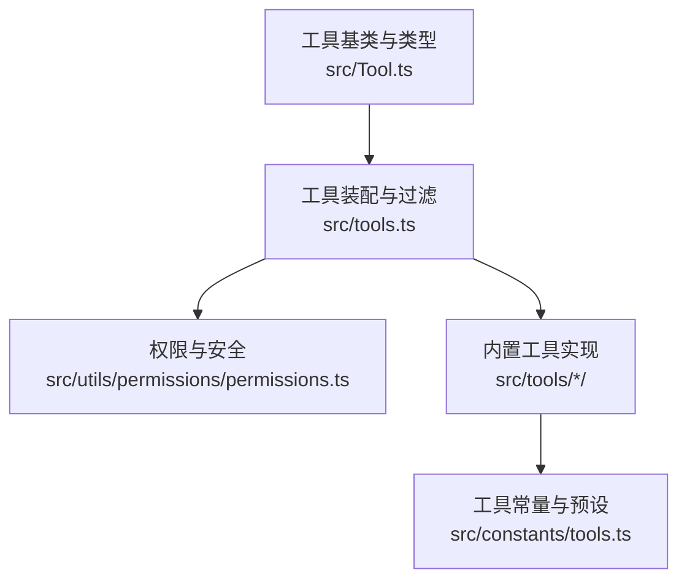
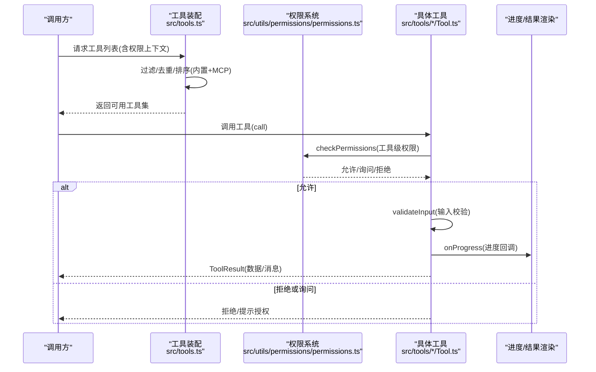
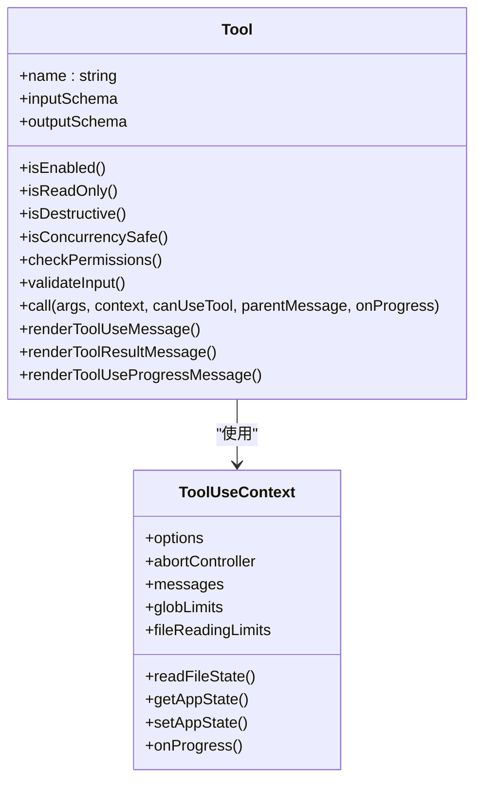
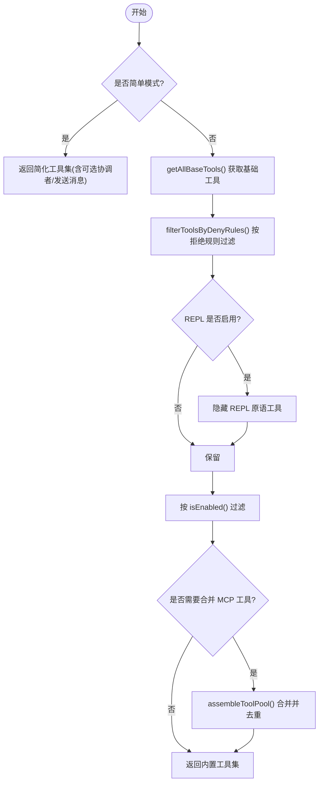
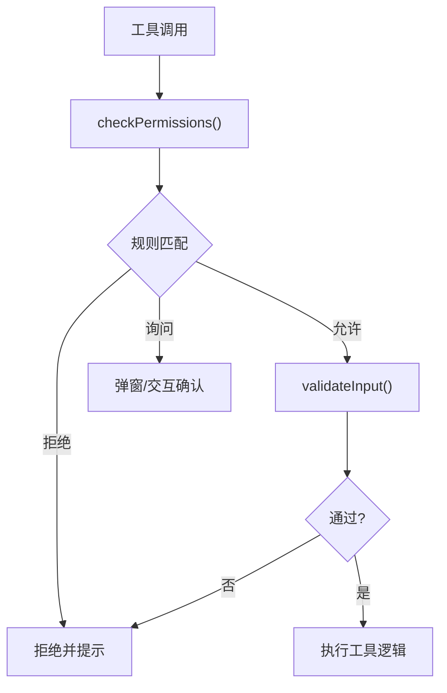
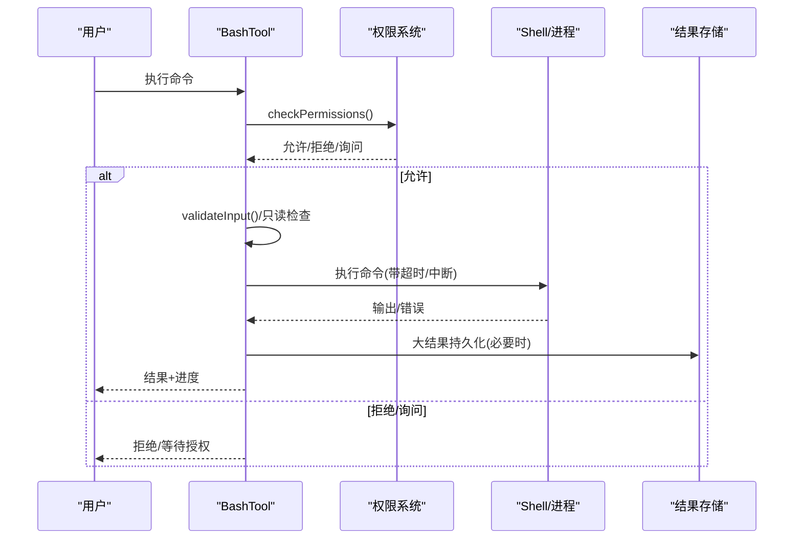
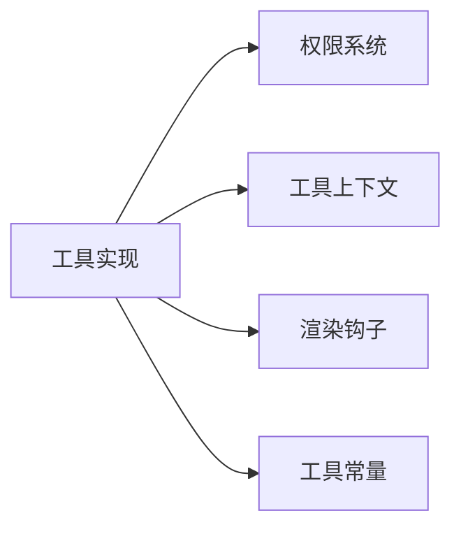

# 工具系统

<cite>
**本文引用的文件**
- [src/Tool.ts](file://src/Tool.ts)
- [src/tools.ts](file://src/tools.ts)
- [src/constants/tools.ts](file://src/constants/tools.ts)
- [src/utils/permissions/permissions.ts](file://src/utils/permissions/permissions.ts)
- [src/tools/BashTool/BashTool.tsx](file://src/tools/BashTool/BashTool.tsx)
- [src/tools/FileReadTool/FileReadTool.ts](file://src/tools/FileReadTool/FileReadTool.ts)
- [src/tools/FileEditTool/FileEditTool.ts](file://src/tools/FileEditTool/FileEditTool.ts)
- [src/tools/GlobTool/GlobTool.ts](file://src/tools/GlobTool/GlobTool.ts)
- [src/tools/WebFetchTool/WebFetchTool.ts](file://src/tools/WebFetchTool/WebFetchTool.ts)
- [src/tools/shared/gitOperationTracking.ts](file://src/tools/shared/gitOperationTracking.ts)
</cite>

## 目录
1. [简介](#简介)
2. [项目结构](#项目结构)
3. [核心组件](#核心组件)
4. [架构总览](#架构总览)
5. [详细组件分析](#详细组件分析)
6. [依赖关系分析](#依赖关系分析)
7. [性能考量](#性能考量)
8. [故障排查指南](#故障排查指南)
9. [结论](#结论)
10. [附录：自定义工具开发指南](#附录自定义工具开发指南)

## 简介
本文件系统性梳理 Claude Code 的工具系统，覆盖工具基类与类型体系、输入输出模式、权限模型、进度状态管理、内置工具能力与实现要点，并提供自定义工具开发指南与最佳实践。目标是帮助工具开发者快速理解架构、正确扩展与集成。

## 项目结构
工具系统由“工具基类与类型”“工具装配与过滤”“权限与安全”“内置工具实现”四大部分组成：
- 工具基类与类型：统一的 Tool 接口、工具上下文、进度类型、结果封装等
- 工具装配与过滤：按环境与权限生成可用工具集，合并内置与 MCP 工具
- 权限与安全：规则来源、分类器、拒绝/询问/允许决策流
- 内置工具：Bash、文件读写/编辑、Glob/Grep、Web 抓取/搜索、技能/任务/计划等

图表来源
- [src/Tool.ts:1-793](file://src/Tool.ts#L1-L793)
- [src/tools.ts:193-390](file://src/tools.ts#L193-L390)
- [src/utils/permissions/permissions.ts:1-200](file://src/utils/permissions/permissions.ts#L1-L200)
- [src/constants/tools.ts:1-113](file://src/constants/tools.ts#L1-L113)

章节来源
- [src/Tool.ts:1-793](file://src/Tool.ts#L1-L793)
- [src/tools.ts:193-390](file://src/tools.ts#L193-L390)
- [src/constants/tools.ts:1-113](file://src/constants/tools.ts#L1-L113)

## 核心组件
- 工具接口与类型
  - 工具类型定义、输入/输出/进度类型、工具上下文、权限上下文、结果封装
  - 工具构建器 buildTool 提供默认行为，确保一致性与安全性
- 工具装配与过滤
  - 按环境特征与权限上下文生成工具集合，支持内置与 MCP 合并、去重与排序
  - 支持简单模式、REPL 模式下的工具可见性控制
- 权限与安全
  - 规则来源与解析、自动分类器、拒绝/询问/允许三态决策、拒绝计数与回退提示
  - 工具级权限匹配器、输入校验钩子、只读/破坏性标记
- 进度与渲染
  - 统一进度事件与 UI 渲染接口，支持分组、排队、拒绝/错误消息定制

章节来源
- [src/Tool.ts:362-793](file://src/Tool.ts#L362-L793)
- [src/tools.ts:271-367](file://src/tools.ts#L271-L367)
- [src/utils/permissions/permissions.ts:109-200](file://src/utils/permissions/permissions.ts#L109-L200)

## 架构总览
工具系统以 Tool 基类为核心，通过 tools.ts 的装配函数在运行时根据权限与环境动态生成工具池；权限模块在调用前进行规则匹配与分类器评估；内置工具实现遵循统一接口，提供输入校验、权限检查、进度渲染与结果消息映射。

图表来源
- [src/tools.ts:271-367](file://src/tools.ts#L271-L367)
- [src/utils/permissions/permissions.ts:137-200](file://src/utils/permissions/permissions.ts#L137-L200)
- [src/Tool.ts:379-503](file://src/Tool.ts#L379-L503)

## 详细组件分析

### 工具基类与类型体系
- 工具接口
  - 必备字段：名称、输入/输出模式、isEnabled/isReadOnly/isDestructive、call/description/prompt
  - 可选增强：并发安全、搜索/读取识别、透明包装、摘要/活动描述、输入回填、权限匹配器、渲染钩子
- 工具上下文
  - 包含命令、调试、思考配置、MCP 客户端/资源、会话状态、文件读取限制、查询追踪、消息队列等
- 进度与结果
  - ToolProgressData/ToolProgress、ToolResult、进度消息过滤、结果消息映射
- 工具构建器
  - buildTool 自动填充默认行为，避免分散实现，保证安全默认

图表来源
- [src/Tool.ts:362-793](file://src/Tool.ts#L362-L793)

章节来源
- [src/Tool.ts:362-793](file://src/Tool.ts#L362-L793)

### 工具装配与过滤
- 工具集合来源
  - getAllBaseTools：按环境/特性开关聚合内置工具，内置搜索工具在嵌入搜索可用时可省略
  - getTools：按权限上下文过滤、REPL 模式隐藏原语工具、简单模式裁剪
  - assembleToolPool/getMergedTools：内置与 MCP 工具合并，保持提示缓存稳定性
- 权限过滤
  - filterToolsByDenyRules：基于拒绝规则剔除工具
- 工具预设
  - parseToolPreset/getToolsForDefaultPreset：支持 --tools 默认预设

图表来源
- [src/tools.ts:193-327](file://src/tools.ts#L193-L327)
- [src/tools.ts:345-367](file://src/tools.ts#L345-L367)

章节来源
- [src/tools.ts:193-327](file://src/tools.ts#L193-L327)
- [src/tools.ts:345-367](file://src/tools.ts#L345-L367)

### 权限模型与安全
- 权限上下文
  - 包含权限模式、附加工作目录、允许/拒绝/询问规则、是否可绕过权限等
- 决策流程
  - 规则匹配(允许/拒绝/询问)、分类器评估、拒绝计数与回退提示、自动化检查前置
- 工具级权限
  - checkPermissions：工具自定义权限逻辑
  - preparePermissionMatcher：为权限规则匹配器准备闭包
  - validateInput：输入合法性校验，失败时返回错误码与行为建议

图表来源
- [src/utils/permissions/permissions.ts:137-200](file://src/utils/permissions/permissions.ts#L137-L200)
- [src/Tool.ts:494-503](file://src/Tool.ts#L494-L503)

章节来源
- [src/utils/permissions/permissions.ts:109-200](file://src/utils/permissions/permissions.ts#L109-L200)
- [src/Tool.ts:494-503](file://src/Tool.ts#L494-L503)

### Bash 工具
- 功能特性
  - 命令拆分与管道解析、搜索/读取/列表命令识别、静默命令判定
  - 只读约束、沙箱策略、超时与中断行为、进度展示阈值
  - Git 操作检测与统计、VS Code 文件更新通知
- 输入输出与权限
  - 输入校验、只读/破坏性标记、权限匹配器、自动分类器输入
  - 大输出结果持久化与预览、终端截断处理
- 进度与渲染
  - 进度消息、排队消息、拒绝/错误消息定制

图表来源
- [src/tools/BashTool/BashTool.tsx:1-200](file://src/tools/BashTool/BashTool.tsx#L1-L200)
- [src/utils/permissions/permissions.ts:137-200](file://src/utils/permissions/permissions.ts#L137-L200)

章节来源
- [src/tools/BashTool/BashTool.tsx:84-172](file://src/tools/BashTool/BashTool.tsx#L84-L172)
- [src/tools/BashTool/BashTool.tsx:154-176](file://src/tools/BashTool/BashTool.tsx#L154-L176)

### 文件读取工具
- 功能特性
  - 设备文件阻断、macOS 截图路径兼容、PDF/图像/笔记本内容读取
  - 行号添加、偏移范围读取、令牌计数与估算、文件历史跟踪
- 输入输出与权限
  - 输入校验(路径存在性/目录性)、权限匹配器、只读标记
  - 大文件/超限处理、结果文本提取用于检索索引
- 进度与渲染
  - 工具使用消息、结果消息、标签渲染、错误消息定制

章节来源
- [src/tools/FileReadTool/FileReadTool.ts:96-128](file://src/tools/FileReadTool/FileReadTool.ts#L96-L128)
- [src/tools/FileReadTool/FileReadTool.ts:133-200](file://src/tools/FileReadTool/FileReadTool.ts#L133-L200)

### 文件编辑工具
- 功能特性
  - 编辑前后对比、补丁生成、引用样式保留、大文件大小限制
  - 团队内存敏感内容防护、路径规范化、权限匹配器
- 输入输出与权限
  - 输入校验(相同字符串、路径忽略、UNC 路径跳过 FS 检查)、写权限检查
  - 自动分类器输入(文件路径+新内容)
- 进度与渲染
  - 工具使用消息、结果消息、拒绝/错误消息定制

章节来源
- [src/tools/FileEditTool/FileEditTool.ts:137-200](file://src/tools/FileEditTool/FileEditTool.ts#L137-L200)
- [src/tools/FileEditTool/FileEditTool.ts:109-114](file://src/tools/FileEditTool/FileEditTool.ts#L109-L114)

### Glob 工具
- 功能特性
  - 通配符搜索、相对路径归一化、结果截断与提示
- 输入输出与权限
  - 输入校验(路径存在且为目录)、权限匹配器(通配符模式)
  - 只读/搜索识别、自动分类器输入(模式)
- 进度与渲染
  - 工具使用消息、结果消息、错误消息定制

章节来源
- [src/tools/GlobTool/GlobTool.ts:94-134](file://src/tools/GlobTool/GlobTool.ts#L94-L134)
- [src/tools/GlobTool/GlobTool.ts:85-87](file://src/tools/GlobTool/GlobTool.ts#L85-L87)

### Web 抓取工具
- 功能特性
  - 预批准主机、HTTPS/HTTP 响应信息、Markdown 处理与长度限制
- 输入输出与权限
  - 输入校验(URL 格式)、域名级规则匹配、预批准豁免
  - 只读/并发安全标记、自动分类器输入(URL+提示)
- 进度与渲染
  - 工具使用消息、进度消息、结果消息

章节来源
- [src/tools/WebFetchTool/WebFetchTool.ts:191-200](file://src/tools/WebFetchTool/WebFetchTool.ts#L191-L200)
- [src/tools/WebFetchTool/WebFetchTool.ts:104-180](file://src/tools/WebFetchTool/WebFetchTool.ts#L104-L180)

### Git 操作追踪
- 功能特性
  - 命令与输出解析，识别提交/推送/合并/变基/PR 等动作
  - 计数器与分析事件上报，支持多平台命令风格
- 应用场景
  - 在 Bash/PowerShell 等工具中作为副作用统计与可视化

章节来源
- [src/tools/shared/gitOperationTracking.ts:135-186](file://src/tools/shared/gitOperationTracking.ts#L135-L186)

## 依赖关系分析
- 工具到权限
  - 工具通过 checkPermissions 与权限系统交互，支持规则来源、分类器与拒绝计数
- 工具到上下文
  - 工具使用 ToolUseContext 获取应用状态、文件读取缓存、MCP 客户端与资源
- 工具到渲染
  - 统一的渲染钩子支持消息、进度、拒绝/错误 UI 定制
- 工具到常量
  - 工具名称、允许集合、预设等集中于 constants/tools.ts，便于全局一致性

图表来源
- [src/Tool.ts:158-300](file://src/Tool.ts#L158-L300)
- [src/constants/tools.ts:36-113](file://src/constants/tools.ts#L36-L113)

章节来源
- [src/Tool.ts:158-300](file://src/Tool.ts#L158-L300)
- [src/constants/tools.ts:36-113](file://src/constants/tools.ts#L36-L113)

## 性能考量
- 工具装配
  - 使用 uniqBy 保持内置工具前缀连续，避免 MCP 工具打乱顺序导致提示缓存失效
  - 过滤/排序后复制数组，避免原地修改影响稳定性
- 输入校验与权限
  - 优先进行快速校验(路径存在性、只读约束)，减少无效执行
  - 权限规则匹配器延迟构建，仅在需要时解析
- I/O 与结果
  - 文件读取限制(最大字节/令牌)、Glob 结果截断、大结果持久化与预览
  - Bash 输出截断与预览阈值，避免 UI 卡顿
- 并发与中断
  - 工具声明并发安全，避免不必要的串行；支持中断行为(cancel/block)以平衡体验

[本节为通用指导，无需特定文件引用]

## 故障排查指南
- 权限相关
  - 拒绝/询问频繁：检查权限规则来源(设置/命令行/会话)、分类器状态、拒绝计数
  - 工具被隐藏：确认是否处于 REPL 模式或简单模式，以及 deny 规则
- 输入校验
  - 文件路径不存在/非目录：查看建议路径与当前工作目录提示
  - URL 格式错误：确认 URL 解析与协议
- 进度与渲染
  - 进度不显示：确认工具是否实现进度回调与 UI 渲染钩子
  - 结果过大：检查 maxResultSizeChars 与持久化阈值，考虑分段读取/搜索

章节来源
- [src/utils/permissions/permissions.ts:137-200](file://src/utils/permissions/permissions.ts#L137-L200)
- [src/tools/GlobTool/GlobTool.ts:94-134](file://src/tools/GlobTool/GlobTool.ts#L94-L134)
- [src/tools/WebFetchTool/WebFetchTool.ts:191-200](file://src/tools/WebFetchTool/WebFetchTool.ts#L191-L200)

## 结论
该工具系统以统一的 Tool 基类为核心，结合严格的权限模型与一致的装配/过滤机制，实现了可扩展、可审计、可可视化的工具生态。内置工具覆盖命令执行、文件操作、搜索与网络抓取等高频场景；通过 buildTool 默认行为与丰富的渲染钩子，开发者可以快速实现新的工具并融入现有工作流。

## 附录：自定义工具开发指南
- 开发步骤
  - 定义输入/输出模式：使用 zod 定义严格 schema，必要时提供 inputJSONSchema
  - 实现工具方法：至少实现 name、inputSchema、outputSchema、call、description、prompt
  - 权限与安全：实现 checkPermissions、validateInput、preparePermissionMatcher、toAutoClassifierInput
  - 渲染与进度：实现 renderToolUseMessage/renderToolResultMessage 等钩子
  - 注册与装配：在工具目录导出工具实例，确保被 tools.ts 正确收集
- 输入模式定义
  - 使用 lazySchema 包裹复杂 schema，提升启动性能
  - 对路径参数进行 expandPath 归一化，避免权限绕过
- 权限配置
  - 利用 alwaysAllow/alwaysDeny/alwaysAsk 规则源，支持通配符匹配
  - 对破坏性/只读工具明确标注，便于分类器与 UI 提示
- 测试方法
  - 单元测试：验证输入校验、权限匹配、错误码与行为
  - 集成测试：模拟工具调用链路，覆盖权限弹窗、进度回调与结果渲染
  - 场景回归：针对 Bash/文件/网络等典型场景编写回归用例

[本节为通用指导，无需特定文件引用]