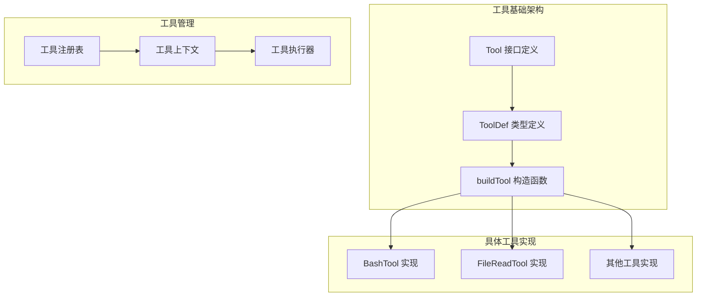
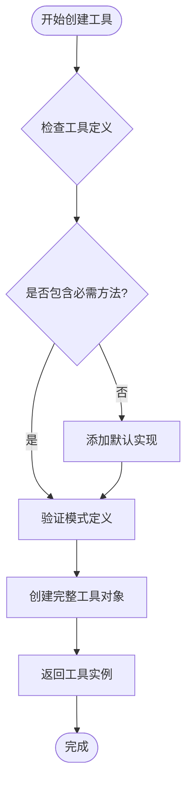
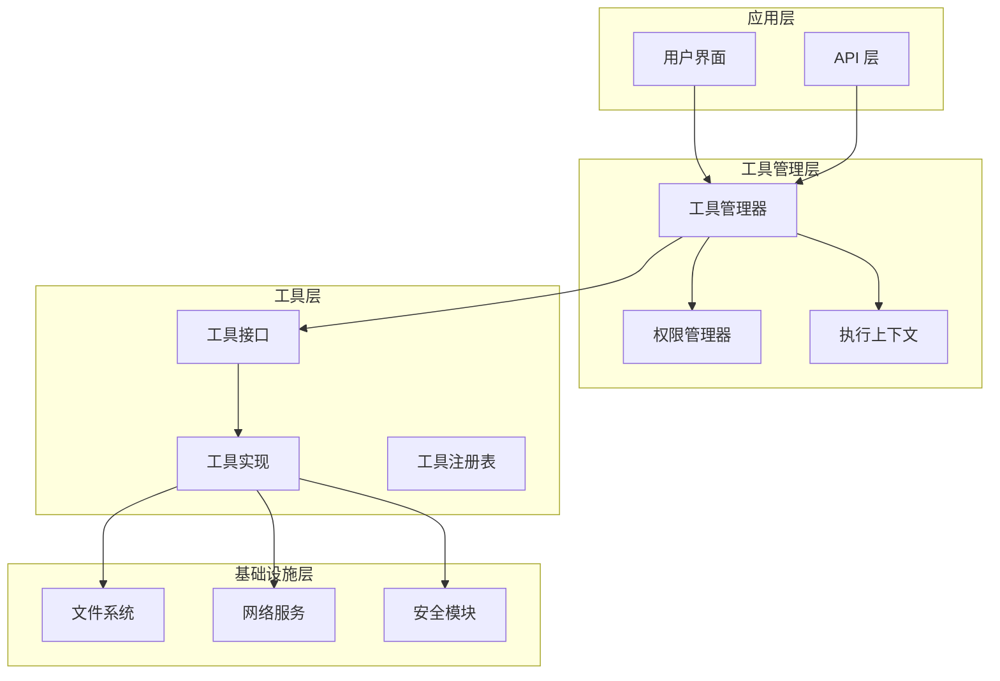
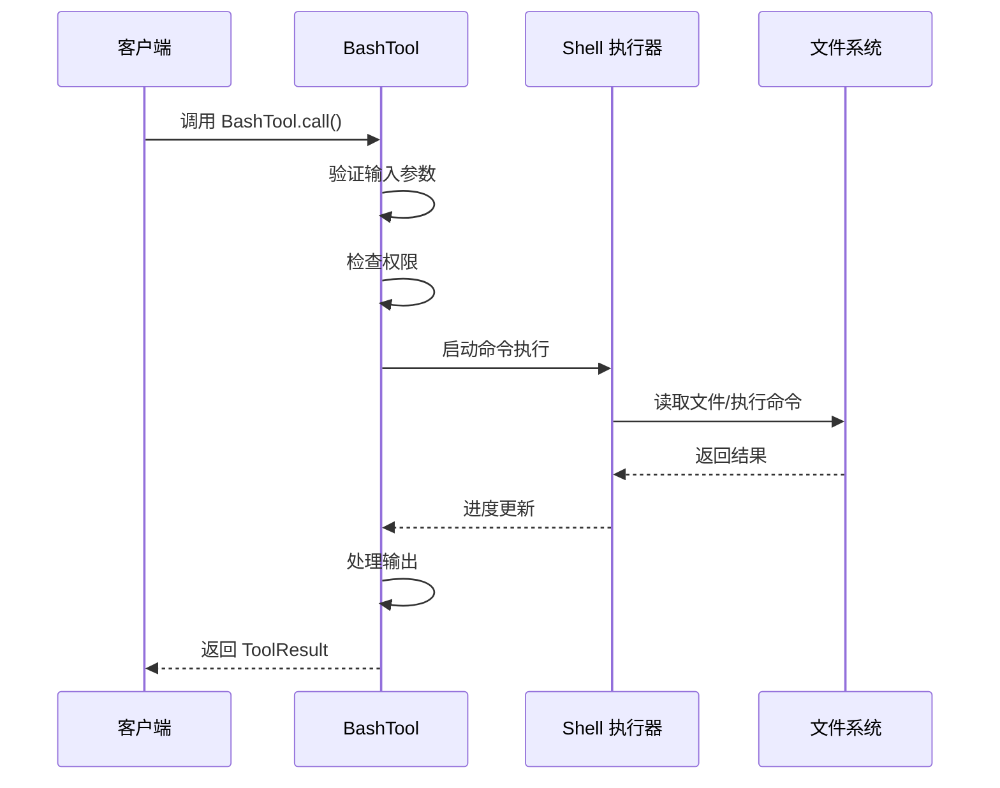
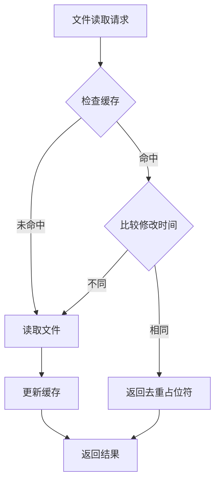
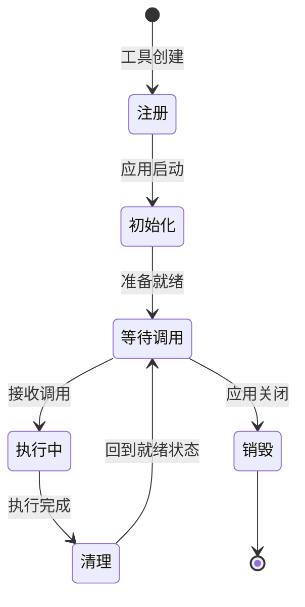
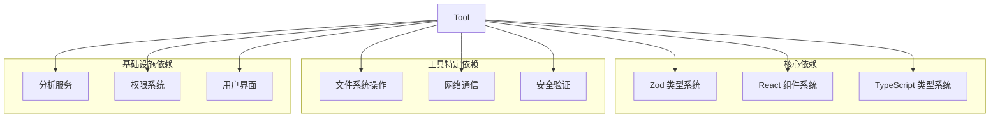

# 工具基础架构

<cite>
**本文档引用的文件**
- [Tool.ts](file://src/Tool.ts)
- [BashTool.tsx](file://src/tools/BashTool/BashTool.tsx)
- [FileReadTool.ts](file://src/tools/FileReadTool/FileReadTool.ts)
</cite>

## 目录
1. [简介](#简介)
2. [项目结构](#项目结构)
3. [核心组件](#核心组件)
4. [架构概览](#架构概览)
5. [详细组件分析](#详细组件分析)
6. [依赖关系分析](#依赖关系分析)
7. [性能考虑](#性能考虑)
8. [故障排除指南](#故障排除指南)
9. [结论](#结论)

## 简介

工具基础架构是 Claude Code 平台的核心基础设施，为所有工具提供统一的抽象层和标准化接口。该架构基于 TypeScript 类型系统构建，确保了类型安全性和开发体验的一致性。

本架构支持多种工具类型，从简单的文件读取工具到复杂的 Bash 命令执行工具，为 AI 模型提供了丰富的操作能力。通过统一的工具接口，开发者可以轻松创建、注册和管理各种工具，同时保持系统的可维护性和可扩展性。

## 项目结构

工具基础架构采用模块化设计，主要包含以下核心组件：

**图表来源**
- [Tool.ts:362-792](file://src/Tool.ts#L362-L792)

**章节来源**
- [Tool.ts:1-793](file://src/Tool.ts#L1-L793)

## 核心组件

### 工具接口定义

工具接口是整个架构的核心，定义了所有工具必须实现的标准方法和属性。主要组件包括：

#### 基础工具类型
- `Tool<Input, Output, P>`: 完整的工具接口定义
- `ToolDef<Input, Output, P>`: 工具定义类型，允许部分实现
- `Tools`: 工具数组的类型别名

#### 核心方法
- `call()`: 工具的主要执行方法
- `description()`: 返回工具的描述信息
- `validateInput()`: 输入参数验证
- `checkPermissions()`: 权限检查

#### 输入输出模式
- `inputSchema`: Zod 类型验证模式
- `outputSchema`: 输出模式定义
- `inputJSONSchema`: JSON Schema 支持

**章节来源**
- [Tool.ts:362-507](file://src/Tool.ts#L362-L507)
- [Tool.ts:394-401](file://src/Tool.ts#L394-L401)

### 工具构造器

`buildTool` 函数提供了工具的标准化创建流程，自动填充默认值并确保工具的一致性：

**图表来源**
- [Tool.ts:783-792](file://src/Tool.ts#L783-L792)

**章节来源**
- [Tool.ts:757-792](file://src/Tool.ts#L757-L792)

## 架构概览

工具基础架构采用分层设计，确保了良好的关注点分离和可维护性：

**图表来源**
- [Tool.ts:158-300](file://src/Tool.ts#L158-L300)

## 详细组件分析

### BashTool 实现分析

BashTool 是最复杂的工具实现之一，展示了工具架构的强大功能：

#### 核心特性
- **并发安全**: 通过 `isConcurrencySafe` 方法标识为只读操作
- **权限检查**: 集成复杂的 Bash 命令权限验证
- **进度监控**: 支持长时间运行命令的进度显示
- **输出处理**: 多种输出格式支持（文本、图像、结构化数据）

#### 执行流程

**图表来源**
- [BashTool.tsx:624-825](file://src/tools/BashTool/BashTool.tsx#L624-L825)

**章节来源**
- [BashTool.tsx:420-825](file://src/tools/BashTool/BashTool.tsx#L420-L825)

### FileReadTool 实现分析

FileReadTool 展示了简单工具的最佳实践：

#### 关键特性
- **只读操作**: 明确标记为 `isReadOnly = true`
- **路径扩展**: 自动处理相对路径和波浪号展开
- **缓存机制**: 实现文件内容去重和缓存
- **错误处理**: 智能的文件不存在错误处理

#### 缓存机制流程

**图表来源**
- [FileReadTool.ts:523-573](file://src/tools/FileReadTool/FileReadTool.ts#L523-L573)

**章节来源**
- [FileReadTool.ts:337-718](file://src/tools/FileReadTool/FileReadTool.ts#L337-L718)

### 工具生命周期管理

工具的生命周期包括注册、初始化、执行和清理四个阶段：

#### 生命周期流程

**图表来源**
- [Tool.ts:783-792](file://src/Tool.ts#L783-L792)

**章节来源**
- [Tool.ts:783-792](file://src/Tool.ts#L783-L792)

## 依赖关系分析

工具基础架构的依赖关系体现了清晰的关注点分离：

**图表来源**
- [Tool.ts:1-14](file://src/Tool.ts#L1-L14)

**章节来源**
- [Tool.ts:1-88](file://src/Tool.ts#L1-L88)

## 性能考虑

工具基础架构在设计时充分考虑了性能优化：

### 缓存策略
- **文件读取缓存**: 避免重复读取相同文件
- **工具结果缓存**: 减少重复计算
- **模式验证缓存**: 提高类型验证效率

### 异步处理
- **非阻塞 I/O**: 所有文件操作都是异步的
- **流式处理**: 大文件采用流式读取
- **并发控制**: 合理的并发限制避免资源争用

### 内存管理
- **弱引用映射**: 使用 WeakMap 避免内存泄漏
- **及时释放**: 确保临时资源及时释放
- **增量处理**: 大数据集采用增量处理策略

## 故障排除指南

### 常见问题及解决方案

#### 工具注册失败
**症状**: 工具无法被发现或调用
**原因**: 
- 缺少必需的方法实现
- 模式定义不正确
- 权限配置错误

**解决方案**:
1. 检查工具定义是否包含所有必需方法
2. 验证 Zod 模式定义的正确性
3. 确认权限规则配置

#### 输入验证错误
**症状**: 工具调用时出现参数错误
**原因**:
- 参数类型不匹配
- 参数范围超出限制
- 必需参数缺失

**解决方案**:
1. 检查输入参数的类型和格式
2. 验证参数范围和约束条件
3. 确保所有必需参数都已提供

#### 权限拒绝
**症状**: 工具调用被拒绝
**原因**:
- 用户没有执行权限
- 文件路径不在允许范围内
- 安全策略阻止操作

**解决方案**:
1. 检查用户的权限设置
2. 验证文件路径的安全性
3. 调整安全策略配置

**章节来源**
- [Tool.ts:95-101](file://src/Tool.ts#L95-L101)

## 结论

工具基础架构为 Claude Code 平台提供了强大而灵活的工具系统。通过统一的接口定义、标准化的工具创建流程和完善的生命周期管理，该架构确保了工具的一致性、可维护性和可扩展性。

关键优势包括：
- **类型安全**: 完整的 TypeScript 类型支持
- **标准化**: 统一的工具接口和实现模式
- **灵活性**: 支持从简单到复杂的各种工具类型
- **安全性**: 内置的权限检查和安全验证
- **性能**: 优化的缓存策略和异步处理

该架构为未来的工具扩展和功能增强奠定了坚实的基础，使得开发者能够专注于工具逻辑的实现，而不必担心底层基础设施的复杂性。