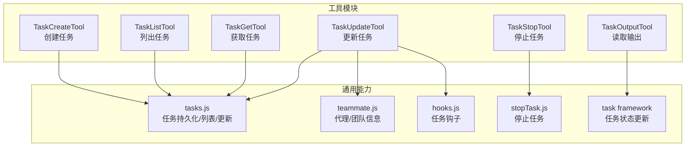
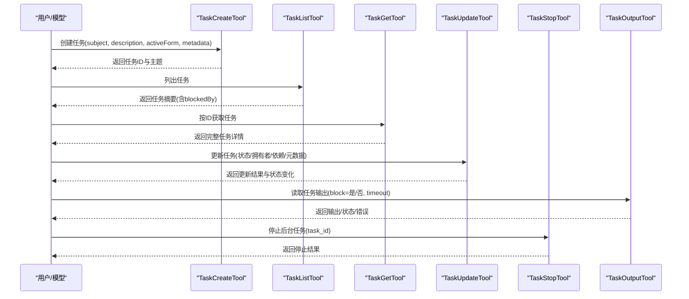
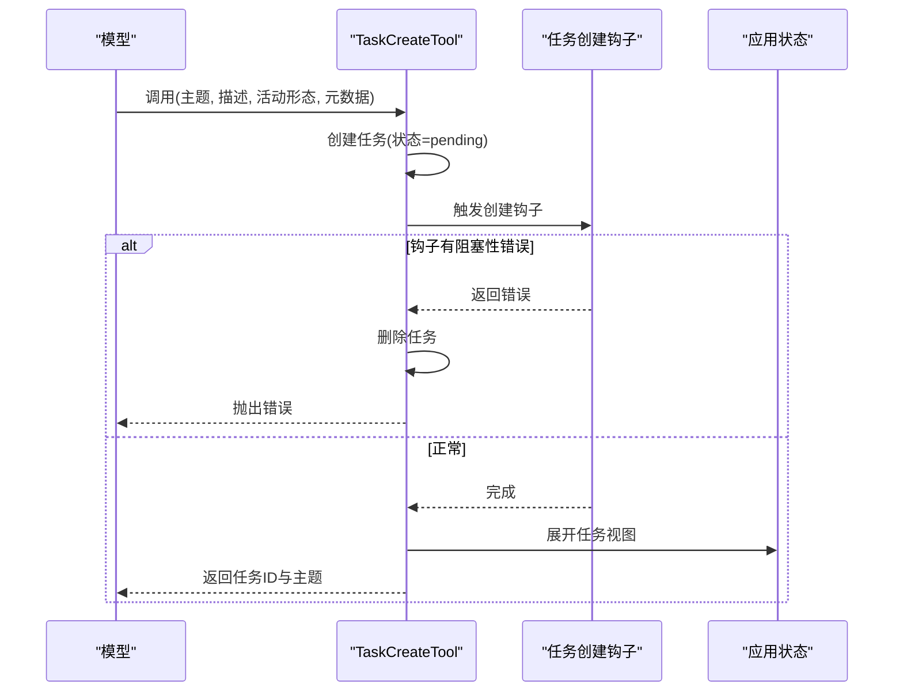
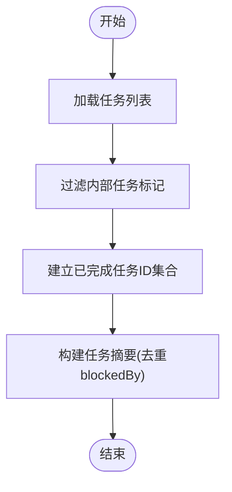
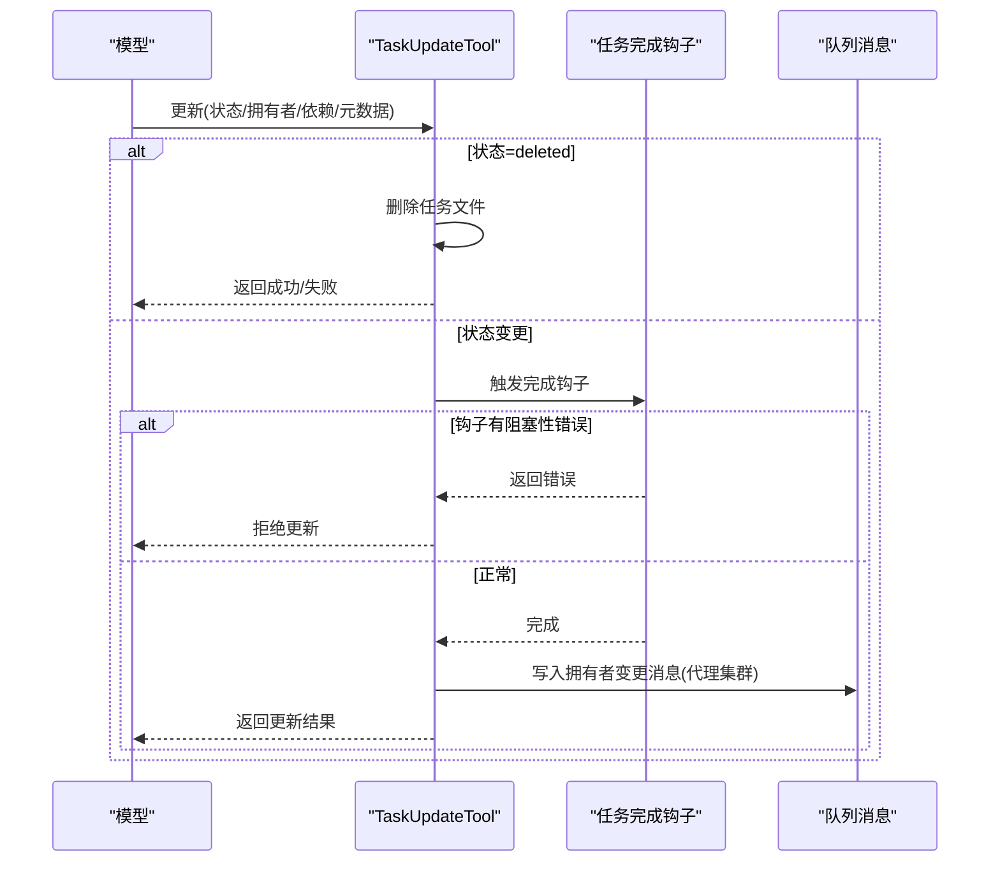
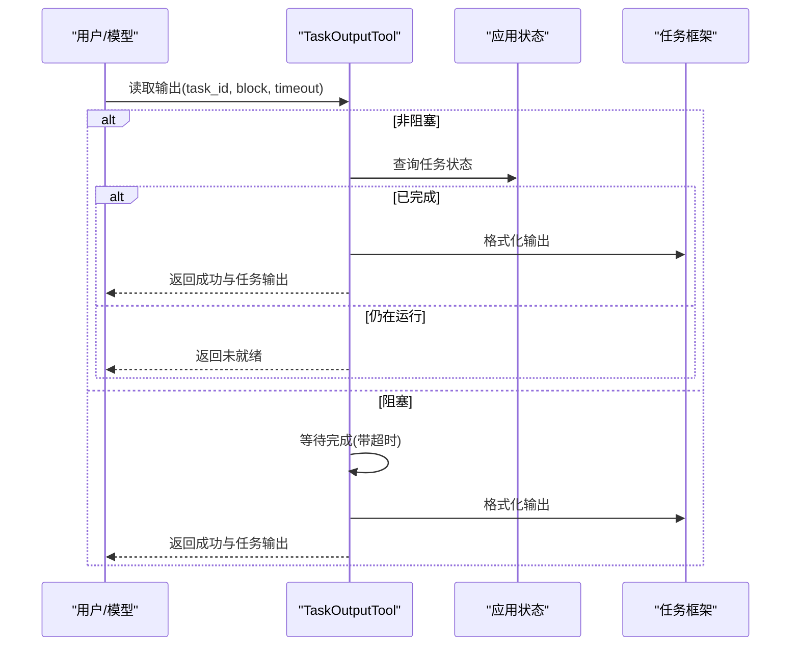
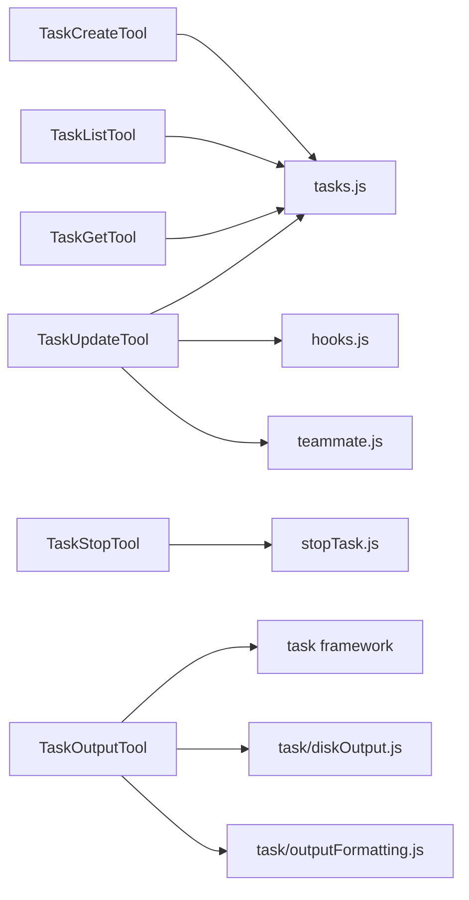

# 任务与工作流工具

<cite>
**本文档引用的文件**
- [TaskCreateTool.ts](file://src/tools/TaskCreateTool/TaskCreateTool.ts)
- [TaskCreateTool/constants.ts](file://src/tools/TaskCreateTool/constants.ts)
- [TaskCreateTool/prompt.ts](file://src/tools/TaskCreateTool/prompt.ts)
- [TaskListTool.ts](file://src/tools/TaskListTool/TaskListTool.ts)
- [TaskListTool/constants.ts](file://src/tools/TaskListTool/constants.ts)
- [TaskListTool/prompt.ts](file://src/tools/TaskListTool/prompt.ts)
- [TaskGetTool.ts](file://src/tools/TaskGetTool/TaskGetTool.ts)
- [TaskGetTool/constants.ts](file://src/tools/TaskGetTool/constants.ts)
- [TaskGetTool/prompt.ts](file://src/tools/TaskGetTool/prompt.ts)
- [TaskUpdateTool.ts](file://src/tools/TaskUpdateTool/TaskUpdateTool.ts)
- [TaskStopTool.ts](file://src/tools/TaskStopTool/TaskStopTool.ts)
- [TaskOutputTool.tsx](file://src/tools/TaskOutputTool/TaskOutputTool.tsx)
</cite>

## 目录
1. [简介](#简介)
2. [项目结构](#项目结构)
3. [核心组件](#核心组件)
4. [架构总览](#架构总览)
5. [详细组件分析](#详细组件分析)
6. [依赖分析](#依赖分析)
7. [性能考虑](#性能考虑)
8. [故障排除指南](#故障排除指南)
9. [结论](#结论)
10. [附录](#附录)

## 简介
本文件系统性介绍任务与工作流工具，覆盖 TaskCreateTool（创建任务）、TaskListTool（列出任务）、TaskGetTool（获取任务）、TaskUpdateTool（更新任务）、TaskStopTool（停止后台任务）与 TaskOutputTool（读取任务输出）。文档从架构、数据流、处理逻辑、集成点、错误处理与性能特征等方面进行深入解析，并提供参数说明、使用示例、任务模板与最佳实践，帮助开发者与使用者高效构建与管理任务生命周期。

## 项目结构
任务工具位于 src/tools 下，每个工具以独立目录组织，包含实现文件、常量与提示词文件。TaskOutputTool 为 UI 友好的前端渲染组件，其余为后端工具定义。

图表来源
- [TaskCreateTool.ts:1-139](file://src/tools/TaskCreateTool/TaskCreateTool.ts#L1-L139)
- [TaskListTool.ts:1-117](file://src/tools/TaskListTool/TaskListTool.ts#L1-L117)
- [TaskGetTool.ts:1-129](file://src/tools/TaskGetTool/TaskGetTool.ts#L1-L129)
- [TaskUpdateTool.ts:1-407](file://src/tools/TaskUpdateTool/TaskUpdateTool.ts#L1-L407)
- [TaskStopTool.ts:1-132](file://src/tools/TaskStopTool/TaskStopTool.ts#L1-L132)
- [TaskOutputTool.tsx:1-584](file://src/tools/TaskOutputTool/TaskOutputTool.tsx#L1-L584)

章节来源
- [TaskCreateTool.ts:1-139](file://src/tools/TaskCreateTool/TaskCreateTool.ts#L1-L139)
- [TaskListTool.ts:1-117](file://src/tools/TaskListTool/TaskListTool.ts#L1-L117)
- [TaskGetTool.ts:1-129](file://src/tools/TaskGetTool/TaskGetTool.ts#L1-L129)
- [TaskUpdateTool.ts:1-407](file://src/tools/TaskUpdateTool/TaskUpdateTool.ts#L1-L407)
- [TaskStopTool.ts:1-132](file://src/tools/TaskStopTool/TaskStopTool.ts#L1-L132)
- [TaskOutputTool.tsx:1-584](file://src/tools/TaskOutputTool/TaskOutputTool.tsx#L1-L584)

## 核心组件
- TaskCreateTool：创建新任务，支持主题、描述、活动形态与元数据；默认状态 pending，自动展开任务视图。
- TaskListTool：列出任务摘要，过滤内部任务，计算未完成依赖，仅返回开放任务 ID。
- TaskGetTool：按 ID 获取任务详情，包含描述、状态、依赖关系等。
- TaskUpdateTool：更新任务字段（主题、描述、活动形态、状态、拥有者、元数据），支持添加阻塞/被阻塞关系，支持删除任务；完成时触发任务完成钩子。
- TaskStopTool：停止运行中的后台任务，校验任务存在与状态，返回停止结果。
- TaskOutputTool：读取任意类型任务的输出，支持阻塞等待与非阻塞检查，格式化输出并渲染 UI。

章节来源
- [TaskCreateTool.ts:48-138](file://src/tools/TaskCreateTool/TaskCreateTool.ts#L48-L138)
- [TaskListTool.ts:33-116](file://src/tools/TaskListTool/TaskListTool.ts#L33-L116)
- [TaskGetTool.ts:38-128](file://src/tools/TaskGetTool/TaskGetTool.ts#L38-L128)
- [TaskUpdateTool.ts:88-406](file://src/tools/TaskUpdateTool/TaskUpdateTool.ts#L88-L406)
- [TaskStopTool.ts:39-131](file://src/tools/TaskStopTool/TaskStopTool.ts#L39-L131)
- [TaskOutputTool.tsx:144-352](file://src/tools/TaskOutputTool/TaskOutputTool.tsx#L144-L352)

## 架构总览
任务工具围绕任务持久化层与状态机协作，通过输入/输出模式统一对外暴露能力。TaskUpdateTool 在状态变更时触发钩子，TaskOutputTool 统一读取不同任务类型的输出并渲染。

图表来源
- [TaskCreateTool.ts:80-129](file://src/tools/TaskCreateTool/TaskCreateTool.ts#L80-L129)
- [TaskListTool.ts:65-90](file://src/tools/TaskListTool/TaskListTool.ts#L65-L90)
- [TaskGetTool.ts:73-98](file://src/tools/TaskGetTool/TaskGetTool.ts#L73-L98)
- [TaskUpdateTool.ts:123-363](file://src/tools/TaskUpdateTool/TaskUpdateTool.ts#L123-L363)
- [TaskStopTool.ts:107-130](file://src/tools/TaskStopTool/TaskStopTool.ts#L107-L130)
- [TaskOutputTool.tsx:208-282](file://src/tools/TaskOutputTool/TaskOutputTool.tsx#L208-L282)

## 详细组件分析

### TaskCreateTool（创建任务）
- 功能要点
  - 输入：主题、描述、可选“进行中”活动形态、可选元数据。
  - 输出：任务ID与主题。
  - 默认状态 pending，无拥有者。
  - 创建后自动展开任务视图。
  - 执行任务创建钩子，若出现阻塞性错误则回滚删除任务并抛错。
- 参数说明
  - subject：任务标题（动词短语）。
  - description：任务描述。
  - activeForm：进行中时的活动形态（如“修复认证问题”）。
  - metadata：附加键值对，用于扩展任务属性。
- 使用示例
  - 在复杂多步骤任务或计划模式下主动创建任务，确保后续追踪与依赖管理。
- 最佳实践
  - 为每个任务提供清晰的主题与描述；必要时设置 activeForm 提升可视化体验。
  - 使用 TaskUpdateTool 设置 owner 与依赖关系。
- 错误处理
  - 钩子阻塞性错误会触发回滚并抛出异常。

图表来源
- [TaskCreateTool.ts:80-114](file://src/tools/TaskCreateTool/TaskCreateTool.ts#L80-L114)

章节来源
- [TaskCreateTool.ts:18-46](file://src/tools/TaskCreateTool/TaskCreateTool.ts#L18-L46)
- [TaskCreateTool.ts:80-129](file://src/tools/TaskCreateTool/TaskCreateTool.ts#L80-L129)
- [TaskCreateTool/constants.ts:1-2](file://src/tools/TaskCreateTool/constants.ts#L1-L2)
- [TaskCreateTool/prompt.ts:1-57](file://src/tools/TaskCreateTool/prompt.ts#L1-L57)

### TaskListTool（列出任务）
- 功能要点
  - 过滤内部任务标记，仅返回公开任务。
  - 计算已完成任务集合，移除 blockedBy 中的已完成任务 ID。
  - 输出：任务ID、主题、状态、拥有者、去重后的 blockedBy。
- 参数说明
  - 无输入参数。
- 使用示例
  - 查看当前可用任务、已阻塞任务与整体进度。
- 最佳实践
  - 优先处理 blockedBy 为空且 owner 为空的任务；按 ID 升序选择。

图表来源
- [TaskListTool.ts:65-84](file://src/tools/TaskListTool/TaskListTool.ts#L65-L84)

章节来源
- [TaskListTool.ts:13-29](file://src/tools/TaskListTool/TaskListTool.ts#L13-L29)
- [TaskListTool.ts:65-90](file://src/tools/TaskListTool/TaskListTool.ts#L65-L90)
- [TaskListTool/constants.ts:1-2](file://src/tools/TaskListTool/constants.ts#L1-L2)
- [TaskListTool/prompt.ts:1-50](file://src/tools/TaskListTool/prompt.ts#L1-L50)

### TaskGetTool（获取任务）
- 功能要点
  - 按任务ID获取任务详情，返回空表示任务不存在。
  - 输出：任务ID、主题、描述、状态、blocks、blockedBy。
- 参数说明
  - taskId：目标任务ID。
- 使用示例
  - 在开始工作前获取完整上下文与依赖关系。
- 最佳实践
  - 确认 blockedBy 为空后再开始执行。

章节来源
- [TaskGetTool.ts:13-34](file://src/tools/TaskGetTool/TaskGetTool.ts#L13-L34)
- [TaskGetTool.ts:73-98](file://src/tools/TaskGetTool/TaskGetTool.ts#L73-L98)
- [TaskGetTool/constants.ts:1-2](file://src/tools/TaskGetTool/constants.ts#L1-L2)
- [TaskGetTool/prompt.ts:1-25](file://src/tools/TaskGetTool/prompt.ts#L1-L25)

### TaskUpdateTool（更新任务）
- 功能要点
  - 支持更新字段：主题、描述、活动形态、状态、拥有者、元数据（合并/删除）。
  - 特殊状态 deleted：直接删除任务文件。
  - 完成状态变更时触发任务完成钩子，若出现阻塞性错误则拒绝更新。
  - 自动为拥有者变更写入队列消息（在代理集群启用时）。
  - 添加 blocks 与 blockedBy：去重后追加依赖关系。
  - 结构化验证提醒：当主线程代理关闭多个任务且无验证步骤时，附加提醒。
- 参数说明
  - taskId：目标任务ID。
  - subject/description/activeForm：可选更新项。
  - status：可选更新项，支持 deleted。
  - addBlocks：新增被此任务阻塞的任务ID列表。
  - addBlockedBy：新增阻塞此任务的任务ID列表（反向关系）。
  - owner：新的拥有者名称。
  - metadata：键值对，设为 null 可删除对应键。
- 使用示例
  - 将任务标记为 in_progress 并自动设置拥有者；完成后标记 completed 并触发验证提醒。
- 最佳实践
  - 使用 blocks/blockedBy 明确依赖；owner 变更时注意通知机制。

图表来源
- [TaskUpdateTool.ts:212-298](file://src/tools/TaskUpdateTool/TaskUpdateTool.ts#L212-L298)

章节来源
- [TaskUpdateTool.ts:33-86](file://src/tools/TaskUpdateTool/TaskUpdateTool.ts#L33-L86)
- [TaskUpdateTool.ts:123-363](file://src/tools/TaskUpdateTool/TaskUpdateTool.ts#L123-L363)

### TaskStopTool（停止后台任务）
- 功能要点
  - 校验 task_id 或兼容的 shell_id（旧版别名）。
  - 校验任务存在且状态为 running。
  - 调用停止逻辑并返回停止结果（消息、任务ID、任务类型、命令）。
- 参数说明
  - task_id：要停止的后台任务ID。
  - shell_id：兼容旧版别名（不推荐）。
- 使用示例
  - 停止长时间运行的后台任务，释放资源。
- 最佳实践
  - 仅对 running 状态的任务调用；避免对非运行任务重复停止。

章节来源
- [TaskStopTool.ts:10-35](file://src/tools/TaskStopTool/TaskStopTool.ts#L10-L35)
- [TaskStopTool.ts:60-91](file://src/tools/TaskStopTool/TaskStopTool.ts#L60-L91)
- [TaskStopTool.ts:107-130](file://src/tools/TaskStopTool/TaskStopTool.ts#L107-L130)

### TaskOutputTool（读取任务输出）
- 功能要点
  - 支持阻塞等待与非阻塞检查两种模式。
  - 统一读取任意任务类型的输出，按类型补充字段（如退出码、提示词、结果、错误）。
  - 渲染 UI：根据任务类型显示不同内容（如 Bash 输出、Agent 结果、远程会话摘要）。
  - 进度回调：等待期间发送等待进度消息。
- 参数说明
  - task_id：目标任务ID。
  - block：是否阻塞等待完成（默认 true）。
  - timeout：最大等待时间（毫秒，默认 30000，范围 0–600000）。
- 使用示例
  - 在任务完成后读取最终输出；或在任务进行中非阻塞检查当前状态。
- 最佳实践
  - 对长时间任务设置合理超时；在 UI 中利用进度消息提升交互体验。

图表来源
- [TaskOutputTool.tsx:208-282](file://src/tools/TaskOutputTool/TaskOutputTool.tsx#L208-L282)

章节来源
- [TaskOutputTool.tsx:30-54](file://src/tools/TaskOutputTool/TaskOutputTool.tsx#L30-L54)
- [TaskOutputTool.tsx:117-143](file://src/tools/TaskOutputTool/TaskOutputTool.tsx#L117-L143)
- [TaskOutputTool.tsx:208-282](file://src/tools/TaskOutputTool/TaskOutputTool.tsx#L208-L282)

## 依赖分析
- 工具间耦合
  - TaskCreateTool 与 TaskUpdateTool 通过任务列表 ID 协作；TaskListTool/TaskGetTool 作为查询入口。
  - TaskUpdateTool 依赖钩子与团队信息；TaskStopTool 依赖停止实现；TaskOutputTool 依赖任务框架与 UI 渲染。
- 外部依赖
  - 任务持久化与状态：tasks.js
  - 团队/代理信息：teammate.js
  - 钩子：hooks.js
  - 停止任务：stopTask.js
  - 输出读取与格式化：task/diskOutput.js、task/outputFormatting.js

图表来源
- [TaskCreateTool.ts:8-15](file://src/tools/TaskCreateTool/TaskCreateTool.ts#L8-L15)
- [TaskListTool.ts:4-9](file://src/tools/TaskListTool/TaskListTool.ts#L4-L9)
- [TaskGetTool.ts:4-9](file://src/tools/TaskGetTool/TaskGetTool.ts#L4-L9)
- [TaskUpdateTool.ts:6-28](file://src/tools/TaskUpdateTool/TaskUpdateTool.ts#L6-L28)
- [TaskStopTool.ts:4-8](file://src/tools/TaskStopTool/TaskStopTool.ts#L4-L8)
- [TaskOutputTool.tsx:23-27](file://src/tools/TaskOutputTool/TaskOutputTool.tsx#L23-L27)

章节来源
- [TaskCreateTool.ts:8-15](file://src/tools/TaskCreateTool/TaskCreateTool.ts#L8-L15)
- [TaskListTool.ts:4-9](file://src/tools/TaskListTool/TaskListTool.ts#L4-L9)
- [TaskGetTool.ts:4-9](file://src/tools/TaskGetTool/TaskGetTool.ts#L4-L9)
- [TaskUpdateTool.ts:6-28](file://src/tools/TaskUpdateTool/TaskUpdateTool.ts#L6-L28)
- [TaskStopTool.ts:4-8](file://src/tools/TaskStopTool/TaskStopTool.ts#L4-L8)
- [TaskOutputTool.tsx:23-27](file://src/tools/TaskOutputTool/TaskOutputTool.tsx#L23-L27)

## 性能考虑
- 输入/输出大小限制：各工具均设置最大结果字符数上限，避免大文本导致内存压力。
- 非阻塞读取：TaskOutputTool 支持非阻塞检查，降低等待成本。
- 去重与过滤：TaskListTool 过滤内部任务并去重 blockedBy，减少无效渲染与通信。
- 钩子与异步：TaskUpdateTool 的钩子与队列消息采用异步处理，避免阻塞主流程。
- 超时控制：TaskOutputTool 的超时参数可防止无限等待。

## 故障排除指南
- 任务创建失败
  - 现象：创建后立即回滚并报错。
  - 排查：检查任务创建钩子是否存在阻塞性错误；确认输入参数合法。
- 任务更新失败
  - 现象：状态更新被拒绝或返回错误。
  - 排查：完成状态变更时的钩子可能返回阻塞性错误；owner 变更未生效时检查代理集群开关。
- 任务输出为空或未就绪
  - 现象：返回未就绪或无输出。
  - 排查：确认 task_id 正确；尝试增大超时；检查任务是否仍在运行。
- 停止任务失败
  - 现象：提示任务不存在或非运行状态。
  - 排查：确认任务ID正确且状态为 running；使用最新参数名 task_id 替代 shell_id。

章节来源
- [TaskCreateTool.ts:105-113](file://src/tools/TaskCreateTool/TaskCreateTool.ts#L105-L113)
- [TaskUpdateTool.ts:247-264](file://src/tools/TaskUpdateTool/TaskUpdateTool.ts#L247-L264)
- [TaskOutputTool.tsx:183-207](file://src/tools/TaskOutputTool/TaskOutputTool.tsx#L183-L207)
- [TaskStopTool.ts:60-91](file://src/tools/TaskStopTool/TaskStopTool.ts#L60-L91)

## 结论
任务与工作流工具提供了从创建、查询、更新到停止与输出读取的完整生命周期管理。通过明确的状态机、依赖关系与钩子机制，结合 UI 友好的输出展示，能够有效支撑复杂任务的组织与协作。建议在实际使用中遵循最佳实践，合理设置依赖与拥有者，充分利用 TaskListTool 的排序与过滤能力，并在长耗时任务中采用合适的超时与非阻塞策略。

## 附录
- 任务模板
  - 创建任务模板：主题（动词短语）、描述（背景/目标/验收）、可选活动形态、可选元数据。
  - 更新任务模板：选择性更新字段（状态/拥有者/依赖/元数据），完成后触发验证提醒。
- 任务管理策略
  - 优先处理 blockedBy 为空且 owner 为空的任务；按 ID 升序选择。
  - 使用 blocks/blockedBy 明确依赖链；owner 变更时及时通知。
- 性能优化建议
  - 合理设置 TaskOutputTool 的超时；使用非阻塞检查减少等待。
  - 避免频繁创建重复任务，先用 TaskListTool/TaskGetTool 核对。
- 故障排除清单
  - 创建失败：检查钩子与输入合法性。
  - 更新失败：检查完成钩子与代理集群配置。
  - 输出异常：核对 task_id、状态与超时设置。
  - 停止失败：确认任务存在且状态为 running。