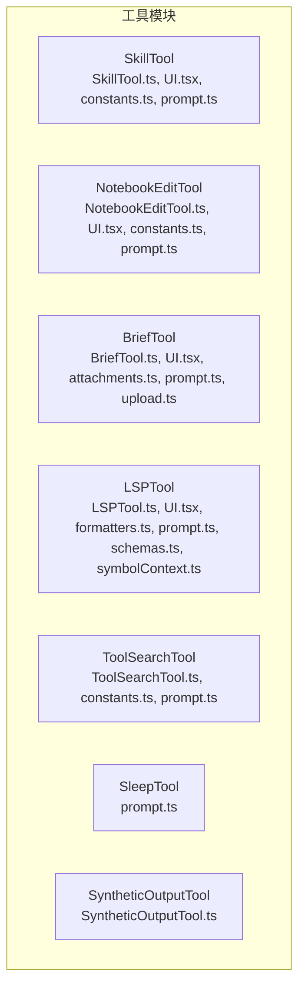
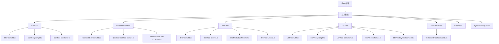
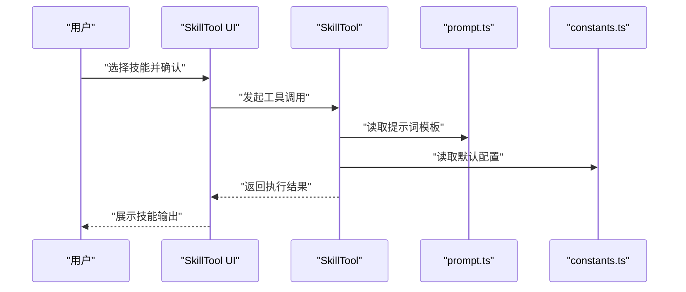
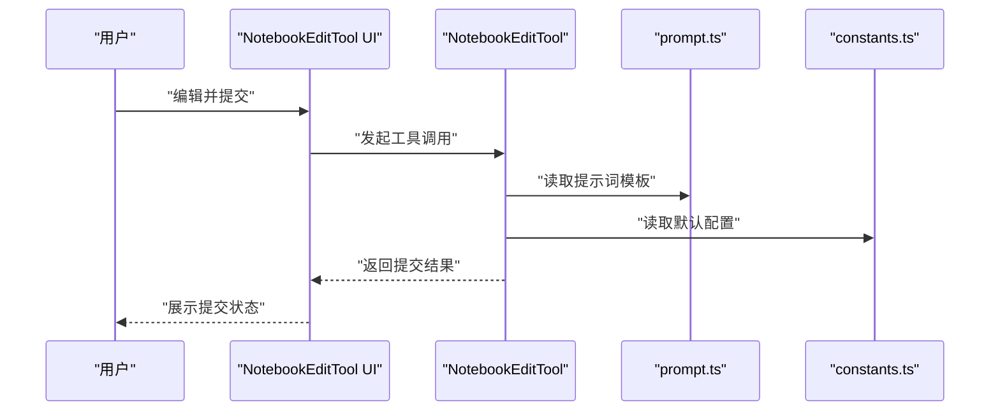
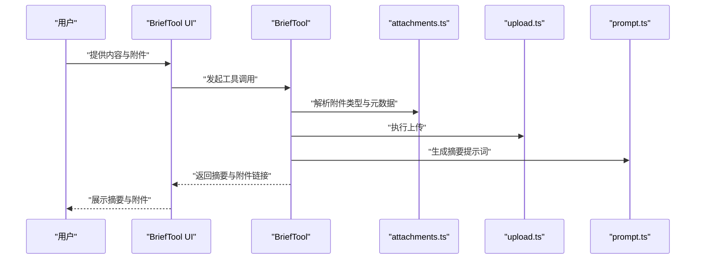
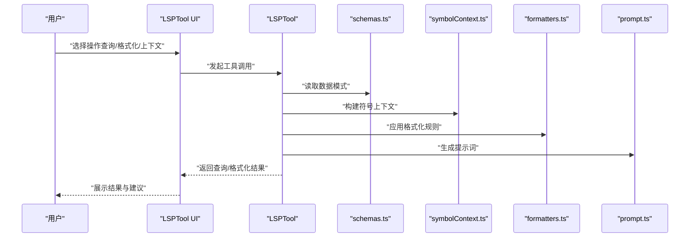
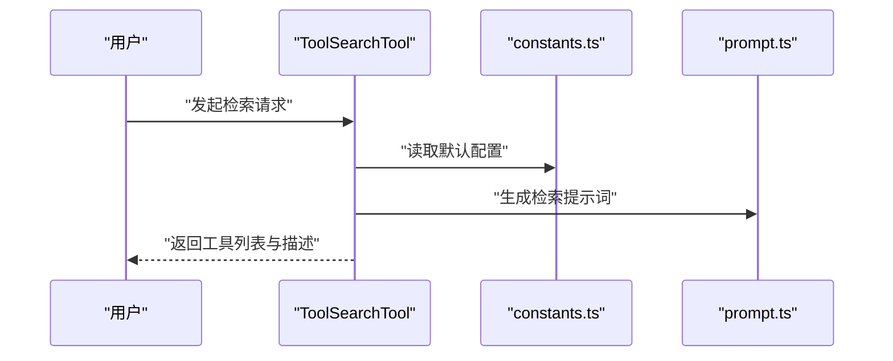
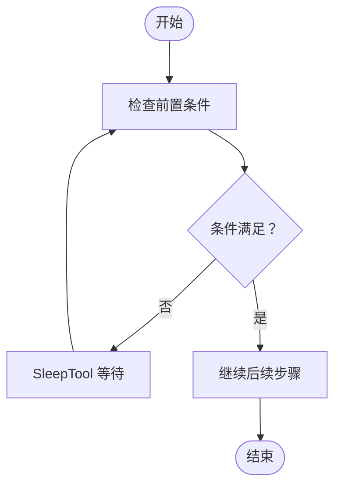
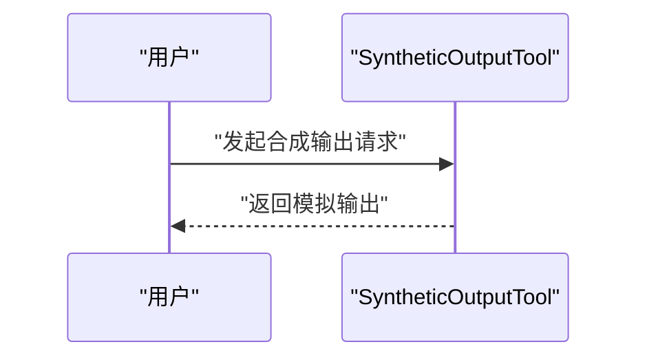
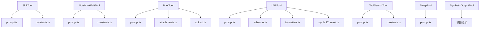

# 专用工具

<cite>
**本文引用的文件**
- [SkillTool.ts](file://src/tools/SkillTool/SkillTool.ts)
- [UI.tsx](file://src/tools/SkillTool/UI.tsx)
- [constants.ts](file://src/tools/SkillTool/constants.ts)
- [prompt.ts](file://src/tools/SkillTool/prompt.ts)
- [NotebookEditTool.ts](file://src/tools/NotebookEditTool/NotebookEditTool.ts)
- [UI.tsx](file://src/tools/NotebookEditTool/UI.tsx)
- [constants.ts](file://src/tools/NotebookEditTool/constants.ts)
- [prompt.ts](file://src/tools/NotebookEditTool/prompt.ts)
- [BriefTool.ts](file://src/tools/BriefTool/BriefTool.ts)
- [UI.tsx](file://src/tools/BriefTool/UI.tsx)
- [attachments.ts](file://src/tools/BriefTool/attachments.ts)
- [prompt.ts](file://src/tools/BriefTool/prompt.ts)
- [upload.ts](file://src/tools/BriefTool/upload.ts)
- [LSPTool.ts](file://src/tools/LSPTool/LSPTool.ts)
- [UI.tsx](file://src/tools/LSPTool/UI.tsx)
- [formatters.ts](file://src/tools/LSPTool/formatters.ts)
- [prompt.ts](file://src/tools/LSPTool/prompt.ts)
- [schemas.ts](file://src/tools/LSPTool/schemas.ts)
- [symbolContext.ts](file://src/tools/LSPTool/symbolContext.ts)
- [ToolSearchTool.ts](file://src/tools/ToolSearchTool/ToolSearchTool.ts)
- [constants.ts](file://src/tools/ToolSearchTool/constants.ts)
- [prompt.ts](file://src/tools/ToolSearchTool/prompt.ts)
- [SleepTool/prompt.ts](file://src/tools/SleepTool/prompt.ts)
- [SyntheticOutputTool.ts](file://src/tools/SyntheticOutputTool/SyntheticOutputTool.ts)
</cite>

## 目录
1. [简介](#简介)
2. [项目结构](#项目结构)
3. [核心组件](#核心组件)
4. [架构总览](#架构总览)
5. [详细组件分析](#详细组件分析)
6. [依赖关系分析](#依赖关系分析)
7. [性能考量](#性能考量)
8. [故障排除指南](#故障排除指南)
9. [结论](#结论)
10. [附录](#附录)

## 简介
本文件系统性梳理并说明以下专用工具的功能特性与使用方法：SkillTool（技能工具）、NotebookEditTool（笔记本编辑工具）、BriefTool（摘要工具）、LSPTool（语言服务器工具）、ToolSearchTool（工具检索工具）、SleepTool（睡眠工具）与 SyntheticOutputTool（合成输出工具）。文档覆盖技能管理、笔记本编辑、摘要生成、语言服务器集成、工具搜索、延迟处理与合成输出等能力，给出参数配置、使用技巧、组合策略、最佳实践与故障排除建议。

## 项目结构
这些工具均位于 src/tools 下的各自子目录中，采用“工具名/实现文件”的组织方式，并辅以 UI 展示、提示词与常量定义等配套模块。下图展示与本文相关的工具模块结构与关键文件映射：

图表来源
- [SkillTool.ts](file://src/tools/SkillTool/SkillTool.ts)
- [NotebookEditTool.ts](file://src/tools/NotebookEditTool/NotebookEditTool.ts)
- [BriefTool.ts](file://src/tools/BriefTool/BriefTool.ts)
- [LSPTool.ts](file://src/tools/LSPTool/LSPTool.ts)
- [ToolSearchTool.ts](file://src/tools/ToolSearchTool/ToolSearchTool.ts)
- [SleepTool/prompt.ts](file://src/tools/SleepTool/prompt.ts)
- [SyntheticOutputTool.ts](file://src/tools/SyntheticOutputTool/SyntheticOutputTool.ts)

章节来源
- [SkillTool.ts](file://src/tools/SkillTool/SkillTool.ts)
- [NotebookEditTool.ts](file://src/tools/NotebookEditTool/NotebookEditTool.ts)
- [BriefTool.ts](file://src/tools/BriefTool/BriefTool.ts)
- [LSPTool.ts](file://src/tools/LSPTool/LSPTool.ts)
- [ToolSearchTool.ts](file://src/tools/ToolSearchTool/ToolSearchTool.ts)
- [SleepTool/prompt.ts](file://src/tools/SleepTool/prompt.ts)
- [SyntheticOutputTool.ts](file://src/tools/SyntheticOutputTool/SyntheticOutputTool.ts)

## 核心组件
本节概述各工具的核心职责与典型应用场景：
- SkillTool：用于技能的加载、切换、执行与可视化呈现，适合需要在对话中调用特定技能或进行技能编排的场景。
- NotebookEditTool：围绕笔记本内容进行编辑、更新与提交，适合需要在会话中对笔记进行增量修改与持久化的任务。
- BriefTool：生成摘要、上传附件并支持交互式输出，适合快速产出要点、报告或带附件的简报。
- LSPTool：集成语言服务器协议，提供符号查询、格式化、上下文信息等能力，适合代码辅助、重构与质量检查。
- ToolSearchTool：检索可用工具列表与描述，帮助用户在复杂工具集里快速定位合适工具。
- SleepTool：延时控制，用于在多步流程中插入等待，确保后续步骤在资源就绪后再执行。
- SyntheticOutputTool：生成合成输出，用于在不需要真实外部调用的情况下模拟工具输出，便于测试与演示。

章节来源
- [SkillTool.ts](file://src/tools/SkillTool/SkillTool.ts)
- [NotebookEditTool.ts](file://src/tools/NotebookEditTool/NotebookEditTool.ts)
- [BriefTool.ts](file://src/tools/BriefTool/BriefTool.ts)
- [LSPTool.ts](file://src/tools/LSPTool/LSPTool.ts)
- [ToolSearchTool.ts](file://src/tools/ToolSearchTool/ToolSearchTool.ts)
- [SleepTool/prompt.ts](file://src/tools/SleepTool/prompt.ts)
- [SyntheticOutputTool.ts](file://src/tools/SyntheticOutputTool/SyntheticOutputTool.ts)

## 架构总览
下图展示工具调用与数据流的关键交互：工具通过统一的工具框架被调用，部分工具依赖 UI 组件进行交互，部分工具通过提示词与常量配置行为，部分工具通过外部服务或本地能力完成具体任务。

图表来源
- [SkillTool.ts](file://src/tools/SkillTool/SkillTool.ts)
- [UI.tsx](file://src/tools/SkillTool/UI.tsx)
- [prompt.ts](file://src/tools/SkillTool/prompt.ts)
- [constants.ts](file://src/tools/SkillTool/constants.ts)
- [NotebookEditTool.ts](file://src/tools/NotebookEditTool/NotebookEditTool.ts)
- [UI.tsx](file://src/tools/NotebookEditTool/UI.tsx)
- [prompt.ts](file://src/tools/NotebookEditTool/prompt.ts)
- [constants.ts](file://src/tools/NotebookEditTool/constants.ts)
- [BriefTool.ts](file://src/tools/BriefTool/BriefTool.ts)
- [UI.tsx](file://src/tools/BriefTool/UI.tsx)
- [prompt.ts](file://src/tools/BriefTool/prompt.ts)
- [attachments.ts](file://src/tools/BriefTool/attachments.ts)
- [upload.ts](file://src/tools/BriefTool/upload.ts)
- [LSPTool.ts](file://src/tools/LSPTool/LSPTool.ts)
- [UI.tsx](file://src/tools/LSPTool/UI.tsx)
- [formatters.ts](file://src/tools/LSPTool/formatters.ts)
- [prompt.ts](file://src/tools/LSPTool/prompt.ts)
- [schemas.ts](file://src/tools/LSPTool/schemas.ts)
- [symbolContext.ts](file://src/tools/LSPTool/symbolContext.ts)
- [ToolSearchTool.ts](file://src/tools/ToolSearchTool/ToolSearchTool.ts)
- [constants.ts](file://src/tools/ToolSearchTool/constants.ts)
- [prompt.ts](file://src/tools/ToolSearchTool/prompt.ts)
- [SleepTool/prompt.ts](file://src/tools/SleepTool/prompt.ts)
- [SyntheticOutputTool.ts](file://src/tools/SyntheticOutputTool/SyntheticOutputTool.ts)

## 详细组件分析

### SkillTool（技能工具）
- 功能概述
  - 负责技能的加载、执行与结果呈现；通过 UI 提供交互入口；通过提示词与常量控制行为与默认值。
- 关键实现点
  - 工具主体：[SkillTool.ts](file://src/tools/SkillTool/SkillTool.ts)
  - 用户界面：[UI.tsx](file://src/tools/SkillTool/UI.tsx)
  - 行为常量与默认值：[constants.ts](file://src/tools/SkillTool/constants.ts)
  - 提示词模板：[prompt.ts](file://src/tools/SkillTool/prompt.ts)
- 使用场景
  - 在对话中动态选择并运行技能，适合需要按需调用特定能力的自动化流程。
- 参数与配置
  - 可通过提示词与常量调整技能名称、上下文与输出风格；UI 提供交互式选择与确认。
- 使用技巧
  - 将技能与会话上下文结合，先用 BriefTool 汇总背景，再用 SkillTool 执行具体动作。
- 最佳实践
  - 对外层流程进行分层：BriefTool 聚焦背景，SkillTool 聚焦执行，避免一次性调用过多复杂逻辑。
- 故障排除
  - 若技能未生效，检查提示词与常量是否正确注入；确认 UI 交互已确认执行。

图表来源
- [SkillTool.ts](file://src/tools/SkillTool/SkillTool.ts)
- [UI.tsx](file://src/tools/SkillTool/UI.tsx)
- [prompt.ts](file://src/tools/SkillTool/prompt.ts)
- [constants.ts](file://src/tools/SkillTool/constants.ts)

章节来源
- [SkillTool.ts](file://src/tools/SkillTool/SkillTool.ts)
- [UI.tsx](file://src/tools/SkillTool/UI.tsx)
- [constants.ts](file://src/tools/SkillTool/constants.ts)
- [prompt.ts](file://src/tools/SkillTool/prompt.ts)

### NotebookEditTool（笔记本编辑工具）
- 功能概述
  - 面向笔记本内容的编辑、更新与提交，适合在会话中对知识库或工作笔记进行增量维护。
- 关键实现点
  - 工具主体：[NotebookEditTool.ts](file://src/tools/NotebookEditTool/NotebookEditTool.ts)
  - 用户界面：[UI.tsx](file://src/tools/NotebookEditTool/UI.tsx)
  - 行为常量与默认值：[constants.ts](file://src/tools/NotebookEditTool/constants.ts)
  - 提示词模板：[prompt.ts](file://src/tools/NotebookEditTool/prompt.ts)
- 使用场景
  - 在分析与总结后，将结论写入笔记本，形成可沉淀的知识资产。
- 参数与配置
  - 通过提示词与常量控制编辑范围、标题、标签与提交策略。
- 使用技巧
  - 先 BriefTool 生成摘要，再 NotebookEditTool 写入结构化条目。
- 最佳实践
  - 保持条目粒度适中，便于后续检索与复用。
- 故障排除
  - 若提交失败，检查提示词中的目标路径与权限；确认 UI 中的确认步骤已完成。

图表来源
- [NotebookEditTool.ts](file://src/tools/NotebookEditTool/NotebookEditTool.ts)
- [UI.tsx](file://src/tools/NotebookEditTool/UI.tsx)
- [prompt.ts](file://src/tools/NotebookEditTool/prompt.ts)
- [constants.ts](file://src/tools/NotebookEditTool/constants.ts)

章节来源
- [NotebookEditTool.ts](file://src/tools/NotebookEditTool/NotebookEditTool.ts)
- [UI.tsx](file://src/tools/NotebookEditTool/UI.tsx)
- [constants.ts](file://src/tools/NotebookEditTool/constants.ts)
- [prompt.ts](file://src/tools/NotebookEditTool/prompt.ts)

### BriefTool（摘要工具）
- 功能概述
  - 生成摘要、上传附件并支持交互式输出，适合快速产出要点、报告或带附件的简报。
- 关键实现点
  - 工具主体：[BriefTool.ts](file://src/tools/BriefTool/BriefTool.ts)
  - 用户界面：[UI.tsx](file://src/tools/BriefTool/UI.tsx)
  - 附件处理：[attachments.ts](file://src/tools/BriefTool/attachments.ts)
  - 提示词模板：[prompt.ts](file://src/tools/BriefTool/prompt.ts)
  - 上传逻辑：[upload.ts](file://src/tools/BriefTool/upload.ts)
- 使用场景
  - 会议纪要、问题摘要、进展汇报等需要结构化输出的场景。
- 参数与配置
  - 通过提示词与附件处理逻辑控制摘要长度、格式与附件类型。
- 使用技巧
  - 将长文本切片输入，先 BriefTool 生成初稿，再人工润色。
- 最佳实践
  - 明确摘要受众与用途，合理设置输出风格与附件范围。
- 故障排除
  - 若附件上传失败，检查上传逻辑与网络权限；确认 UI 中的确认步骤已完成。

图表来源
- [BriefTool.ts](file://src/tools/BriefTool/BriefTool.ts)
- [UI.tsx](file://src/tools/BriefTool/UI.tsx)
- [attachments.ts](file://src/tools/BriefTool/attachments.ts)
- [upload.ts](file://src/tools/BriefTool/upload.ts)
- [prompt.ts](file://src/tools/BriefTool/prompt.ts)

章节来源
- [BriefTool.ts](file://src/tools/BriefTool/BriefTool.ts)
- [UI.tsx](file://src/tools/BriefTool/UI.tsx)
- [attachments.ts](file://src/tools/BriefTool/attachments.ts)
- [prompt.ts](file://src/tools/BriefTool/prompt.ts)
- [upload.ts](file://src/tools/BriefTool/upload.ts)

### LSPTool（语言服务器工具）
- 功能概述
  - 集成语言服务器协议，提供符号查询、格式化、上下文信息等能力，适合代码辅助、重构与质量检查。
- 关键实现点
  - 工具主体：[LSPTool.ts](file://src/tools/LSPTool/LSPTool.ts)
  - 用户界面：[UI.tsx](file://src/tools/LSPTool/UI.tsx)
  - 格式化器：[formatters.ts](file://src/tools/LSPTool/formatters.ts)
  - 提示词模板：[prompt.ts](file://src/tools/LSPTool/prompt.ts)
  - 数据模式：[schemas.ts](file://src/tools/LSPTool/schemas.ts)
  - 符号上下文：[symbolContext.ts](file://src/tools/LSPTool/symbolContext.ts)
- 使用场景
  - 代码补全、错误诊断、符号跳转、格式化与重构建议等。
- 参数与配置
  - 通过提示词与模式定义控制查询范围、输出格式与上下文深度。
- 使用技巧
  - 结合符号上下文与格式化器，先获取上下文，再进行格式化与修复。
- 最佳实践
  - 在大型项目中分模块调用，避免一次性请求过多信息导致超时。
- 故障排除
  - 若无响应，检查语言服务器连接状态与项目根路径；确认 UI 中的确认步骤已完成。

图表来源
- [LSPTool.ts](file://src/tools/LSPTool/LSPTool.ts)
- [UI.tsx](file://src/tools/LSPTool/UI.tsx)
- [formatters.ts](file://src/tools/LSPTool/formatters.ts)
- [prompt.ts](file://src/tools/LSPTool/prompt.ts)
- [schemas.ts](file://src/tools/LSPTool/schemas.ts)
- [symbolContext.ts](file://src/tools/LSPTool/symbolContext.ts)

章节来源
- [LSPTool.ts](file://src/tools/LSPTool/LSPTool.ts)
- [UI.tsx](file://src/tools/LSPTool/UI.tsx)
- [formatters.ts](file://src/tools/LSPTool/formatters.ts)
- [prompt.ts](file://src/tools/LSPTool/prompt.ts)
- [schemas.ts](file://src/tools/LSPTool/schemas.ts)
- [symbolContext.ts](file://src/tools/LSPTool/symbolContext.ts)

### ToolSearchTool（工具检索工具）
- 功能概述
  - 检索可用工具列表与描述，帮助用户在复杂工具集里快速定位合适工具。
- 关键实现点
  - 工具主体：[ToolSearchTool.ts](file://src/tools/ToolSearchTool/ToolSearchTool.ts)
  - 行为常量与默认值：[constants.ts](file://src/tools/ToolSearchTool/constants.ts)
  - 提示词模板：[prompt.ts](file://src/tools/ToolSearchTool/prompt.ts)
- 使用场景
  - 当用户不确定该用哪个工具时，先用 ToolSearchTool 获取候选列表，再决定下一步。
- 参数与配置
  - 通过提示词与常量控制检索关键词、排序与展示策略。
- 使用技巧
  - 使用更具体的关键词缩小范围；结合 BriefTool 的背景信息提升检索准确性。
- 最佳实践
  - 将检索结果与当前任务目标关联，优先选择与上下文最匹配的工具。
- 故障排除
  - 若无结果，尝试简化关键词或扩大检索范围；确认 UI 中的确认步骤已完成。

图表来源
- [ToolSearchTool.ts](file://src/tools/ToolSearchTool/ToolSearchTool.ts)
- [constants.ts](file://src/tools/ToolSearchTool/constants.ts)
- [prompt.ts](file://src/tools/ToolSearchTool/prompt.ts)

章节来源
- [ToolSearchTool.ts](file://src/tools/ToolSearchTool/ToolSearchTool.ts)
- [constants.ts](file://src/tools/ToolSearchTool/constants.ts)
- [prompt.ts](file://src/tools/ToolSearchTool/prompt.ts)

### SleepTool（睡眠工具）
- 功能概述
  - 延时控制，用于在多步流程中插入等待，确保后续步骤在资源就绪后再执行。
- 关键实现点
  - 提示词模板：[SleepTool/prompt.ts](file://src/tools/SleepTool/prompt.ts)
- 使用场景
  - 等待外部资源准备、缓存刷新、异步任务完成等。
- 参数与配置
  - 通过提示词控制等待时长与重试策略。
- 使用技巧
  - 与 ToolSearchTool 或 LSPTool 组合，先检测状态，再 SleepTool 等待。
- 最佳实践
  - 设置合理的最大等待时间与退避策略，避免长时间阻塞。
- 故障排除
  - 若等待无效，检查提示词中的时长单位与逻辑分支。

图表来源
- [SleepTool/prompt.ts](file://src/tools/SleepTool/prompt.ts)

章节来源
- [SleepTool/prompt.ts](file://src/tools/SleepTool/prompt.ts)

### SyntheticOutputTool（合成输出工具）
- 功能概述
  - 生成合成输出，用于在不需要真实外部调用的情况下模拟工具输出，便于测试与演示。
- 关键实现点
  - 工具主体：[SyntheticOutputTool.ts](file://src/tools/SyntheticOutputTool/SyntheticOutputTool.ts)
- 使用场景
  - 单元测试、端到端演示、沙箱环境验证等。
- 参数与配置
  - 通过工具内部逻辑控制输出内容与格式。
- 使用技巧
  - 与 ToolSearchTool 组合，先列出候选工具，再用 SyntheticOutputTool 模拟其输出。
- 最佳实践
  - 输出应尽量贴近真实工具的结构与语义，便于上层流程稳定运行。
- 故障排除
  - 若输出不符合预期，检查工具内部的输出构造逻辑。

图表来源
- [SyntheticOutputTool.ts](file://src/tools/SyntheticOutputTool/SyntheticOutputTool.ts)

章节来源
- [SyntheticOutputTool.ts](file://src/tools/SyntheticOutputTool/SyntheticOutputTool.ts)

## 依赖关系分析
- 内部依赖
  - 各工具均依赖统一的工具框架与提示词模板；部分工具依赖 UI 组件与常量配置。
- 外部依赖
  - LSPTool 依赖语言服务器能力；BriefTool 依赖附件上传能力；SkillTool 依赖技能注册与执行环境。
- 耦合与内聚
  - 工具间低耦合，通过提示词与常量解耦；UI 与工具主体分离，提高可维护性。

图表来源
- [SkillTool.ts](file://src/tools/SkillTool/SkillTool.ts)
- [prompt.ts](file://src/tools/SkillTool/prompt.ts)
- [constants.ts](file://src/tools/SkillTool/constants.ts)
- [NotebookEditTool.ts](file://src/tools/NotebookEditTool/NotebookEditTool.ts)
- [prompt.ts](file://src/tools/NotebookEditTool/prompt.ts)
- [constants.ts](file://src/tools/NotebookEditTool/constants.ts)
- [BriefTool.ts](file://src/tools/BriefTool/BriefTool.ts)
- [prompt.ts](file://src/tools/BriefTool/prompt.ts)
- [attachments.ts](file://src/tools/BriefTool/attachments.ts)
- [upload.ts](file://src/tools/BriefTool/upload.ts)
- [LSPTool.ts](file://src/tools/LSPTool/LSPTool.ts)
- [prompt.ts](file://src/tools/LSPTool/prompt.ts)
- [schemas.ts](file://src/tools/LSPTool/schemas.ts)
- [formatters.ts](file://src/tools/LSPTool/formatters.ts)
- [symbolContext.ts](file://src/tools/LSPTool/symbolContext.ts)
- [ToolSearchTool.ts](file://src/tools/ToolSearchTool/ToolSearchTool.ts)
- [prompt.ts](file://src/tools/ToolSearchTool/prompt.ts)
- [constants.ts](file://src/tools/ToolSearchTool/constants.ts)
- [SleepTool/prompt.ts](file://src/tools/SleepTool/prompt.ts)
- [SyntheticOutputTool.ts](file://src/tools/SyntheticOutputTool/SyntheticOutputTool.ts)

章节来源
- [SkillTool.ts](file://src/tools/SkillTool/SkillTool.ts)
- [NotebookEditTool.ts](file://src/tools/NotebookEditTool/NotebookEditTool.ts)
- [BriefTool.ts](file://src/tools/BriefTool/BriefTool.ts)
- [LSPTool.ts](file://src/tools/LSPTool/LSPTool.ts)
- [ToolSearchTool.ts](file://src/tools/ToolSearchTool/ToolSearchTool.ts)
- [SleepTool/prompt.ts](file://src/tools/SleepTool/prompt.ts)
- [SyntheticOutputTool.ts](file://src/tools/SyntheticOutputTool/SyntheticOutputTool.ts)

## 性能考量
- 并发与批处理
  - 对于 BriefTool 的附件上传与 LSPTool 的批量查询，建议分批处理，避免一次性请求过多资源。
- 缓存与复用
  - 利用提示词与常量的缓存机制减少重复计算；对 LSPTool 的符号上下文进行短期缓存。
- 超时与重试
  - SleepTool 与 ToolSearchTool 应设置合理的超时与重试策略，避免无限等待。
- UI 渲染
  - UI 组件应避免在高频更新中造成卡顿，必要时进行节流或虚拟化。

## 故障排除指南
- 技能工具（SkillTool）
  - 症状：技能未执行
  - 排查：检查提示词与常量是否正确注入；确认 UI 交互已确认执行。
- 笔记本编辑（NotebookEditTool）
  - 症状：提交失败
  - 排查：检查提示词中的目标路径与权限；确认 UI 中的确认步骤已完成。
- 摘要工具（BriefTool）
  - 症状：附件上传失败
  - 排查：检查上传逻辑与网络权限；确认 UI 中的确认步骤已完成。
- 语言服务器（LSPTool）
  - 症状：无响应或结果异常
  - 排查：检查语言服务器连接状态与项目根路径；确认 UI 中的确认步骤已完成。
- 工具检索（ToolSearchTool）
  - 症状：无结果或结果不相关
  - 排查：尝试简化关键词或扩大检索范围；确认 UI 中的确认步骤已完成。
- 睡眠工具（SleepTool）
  - 症状：等待无效
  - 排查：检查提示词中的时长单位与逻辑分支。
- 合成输出（SyntheticOutputTool）
  - 症状：输出不符合预期
  - 排查：检查工具内部的输出构造逻辑。

章节来源
- [SkillTool.ts](file://src/tools/SkillTool/SkillTool.ts)
- [NotebookEditTool.ts](file://src/tools/NotebookEditTool/NotebookEditTool.ts)
- [BriefTool.ts](file://src/tools/BriefTool/BriefTool.ts)
- [LSPTool.ts](file://src/tools/LSPTool/LSPTool.ts)
- [ToolSearchTool.ts](file://src/tools/ToolSearchTool/ToolSearchTool.ts)
- [SleepTool/prompt.ts](file://src/tools/SleepTool/prompt.ts)
- [SyntheticOutputTool.ts](file://src/tools/SyntheticOutputTool/SyntheticOutputTool.ts)

## 结论
上述专用工具覆盖了技能管理、笔记本编辑、摘要生成、语言服务器集成、工具检索、延迟处理与合成输出等关键能力。通过合理的参数配置、使用技巧与组合策略，可以在不同场景下高效完成复杂任务。建议在实际使用中遵循最佳实践，结合 UI 与提示词进行调试与优化，并在出现异常时依据故障排除指南逐项排查。

## 附录
- 使用示例（路径参考）
  - 技能工具：[SkillTool.ts](file://src/tools/SkillTool/SkillTool.ts)，[UI.tsx](file://src/tools/SkillTool/UI.tsx)，[prompt.ts](file://src/tools/SkillTool/prompt.ts)，[constants.ts](file://src/tools/SkillTool/constants.ts)
  - 笔记本编辑：[NotebookEditTool.ts](file://src/tools/NotebookEditTool/NotebookEditTool.ts)，[UI.tsx](file://src/tools/NotebookEditTool/UI.tsx)，[prompt.ts](file://src/tools/NotebookEditTool/prompt.ts)，[constants.ts](file://src/tools/NotebookEditTool/constants.ts)
  - 摘要工具：[BriefTool.ts](file://src/tools/BriefTool/BriefTool.ts)，[UI.tsx](file://src/tools/BriefTool/UI.tsx)，[prompt.ts](file://src/tools/BriefTool/prompt.ts)，[attachments.ts](file://src/tools/BriefTool/attachments.ts)，[upload.ts](file://src/tools/BriefTool/upload.ts)
  - 语言服务器：[LSPTool.ts](file://src/tools/LSPTool/LSPTool.ts)，[UI.tsx](file://src/tools/LSPTool/UI.tsx)，[prompt.ts](file://src/tools/LSPTool/prompt.ts)，[schemas.ts](file://src/tools/LSPTool/schemas.ts)，[formatters.ts](file://src/tools/LSPTool/formatters.ts)，[symbolContext.ts](file://src/tools/LSPTool/symbolContext.ts)
  - 工具检索：[ToolSearchTool.ts](file://src/tools/ToolSearchTool/ToolSearchTool.ts)，[constants.ts](file://src/tools/ToolSearchTool/constants.ts)，[prompt.ts](file://src/tools/ToolSearchTool/prompt.ts)
  - 睡眠工具：[SleepTool/prompt.ts](file://src/tools/SleepTool/prompt.ts)
  - 合成输出：[SyntheticOutputTool.ts](file://src/tools/SyntheticOutputTool/SyntheticOutputTool.ts)