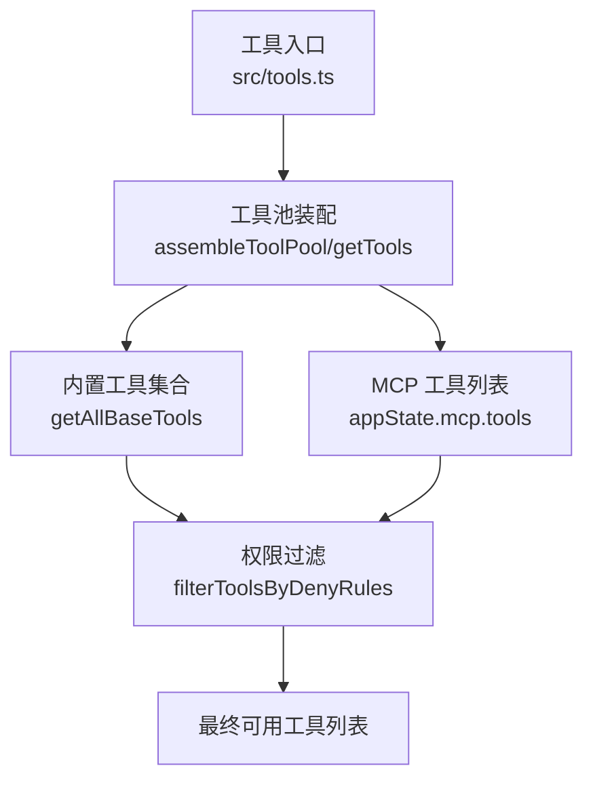
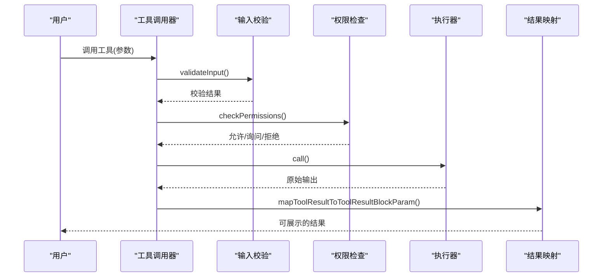
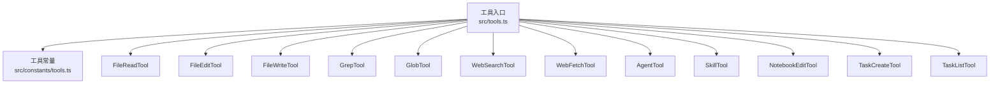

# 内置工具详解

<cite>
**本文档引用的文件**
- [tools.ts](file://src/tools.ts)
- [tools.ts](file://src/constants/tools.ts)
- [BashTool.tsx](file://src/tools/BashTool/BashTool.tsx)
- [PowerShellTool.tsx](file://src/tools/PowerShellTool/PowerShellTool.tsx)
- [FileReadTool.ts](file://src/tools/FileReadTool/FileReadTool.ts)
- [FileEditTool.ts](file://src/tools/FileEditTool/FileEditTool.ts)
- [FileWriteTool.ts](file://src/tools/FileWriteTool/FileWriteTool.ts)
- [GrepTool.ts](file://src/tools/GrepTool/GrepTool.ts)
- [GlobTool.ts](file://src/tools/GlobTool/GlobTool.ts)
- [WebSearchTool.ts](file://src/tools/WebSearchTool/WebSearchTool.ts)
- [WebFetchTool.ts](file://src/tools/WebFetchTool/WebFetchTool.ts)
- [AgentTool.tsx](file://src/tools/AgentTool/AgentTool.tsx)
- [SkillTool.ts](file://src/tools/SkillTool/SkillTool.ts)
- [NotebookEditTool.ts](file://src/tools/NotebookEditTool/NotebookEditTool.ts)
- [TaskCreateTool.ts](file://src/tools/TaskCreateTool/TaskCreateTool.ts)
- [TaskListTool.ts](file://src/tools/TaskListTool/TaskListTool.ts)
</cite>

## 目录
1. [简介](#简介)
2. [项目结构](#项目结构)
3. [核心组件](#核心组件)
4. [架构总览](#架构总览)
5. [详细组件分析](#详细组件分析)
6. [依赖关系分析](#依赖关系分析)
7. [性能考量](#性能考量)
8. [故障排除指南](#故障排除指南)
9. [结论](#结论)

## 简介
本文件系统性梳理 Claude Code 提供的内置工具，覆盖命令执行、文件操作、搜索与网络、代理与技能、笔记本与任务等类别，为使用者提供参数说明、权限要求、最佳实践与组合使用技巧，并解释各工具的特殊能力（如 BashTool 的安全检查、FileEditTool 的差异显示、WebFetchTool 的预批准域名等）。文档同时给出常见问题的解决方案与性能优化建议。

## 项目结构
内置工具的注册与装配集中在统一入口，通过工具池组装机制将内置工具与 MCP 工具合并，支持权限过滤、模式切换与 REPL 隐藏等特性。

**图表来源**
- [tools.ts:345-367](file://src/tools.ts#L345-L367)
- [tools.ts:271-327](file://src/tools.ts#L271-L327)

**章节来源**
- [tools.ts:193-251](file://src/tools.ts#L193-L251)
- [tools.ts:345-367](file://src/tools.ts#L345-L367)

## 核心组件
- 工具注册与筛选：通过 getAllBaseTools 汇总所有内置工具，结合权限上下文进行 deny 规则过滤与启用状态判定；在 REPL 模式下隐藏原始工具以避免误用。
- 工具池装配：assembleToolPool 将内置工具与 MCP 工具合并，去重优先级由名称决定，内置工具优先。
- 工具常量与限制：工具允许范围、异步代理允许清单、协调者模式允许清单等集中定义于 constants/tools.ts，确保跨模块一致性。

**章节来源**
- [tools.ts:193-251](file://src/tools.ts#L193-L251)
- [tools.ts:262-269](file://src/tools.ts#L262-L269)
- [tools.ts:345-367](file://src/tools.ts#L345-L367)
- [tools.ts:36-112](file://src/constants/tools.ts#L36-L112)

## 架构总览
内置工具围绕“输入校验 → 权限决策 → 执行 → 结果映射”的流程运行，部分工具具备延迟执行（defer）与进度回调能力，便于长耗时任务的可观测性与中断控制。

**图表来源**
- [BashTool.tsx:524-623](file://src/tools/BashTool/BashTool.tsx#L524-L623)
- [PowerShellTool.tsx:352-436](file://src/tools/PowerShellTool/PowerShellTool.tsx#L352-L436)
- [WebSearchTool.ts:254-400](file://src/tools/WebSearchTool/WebSearchTool.ts#L254-L400)

## 详细组件分析

### 命令执行工具

#### BashTool（Linux/macOS/WSL）
- 功能概述
  - 在受控环境中执行 shell 命令，支持自动后台化、超时控制、输出截断与图像识别、大输出落盘持久化等。
  - 提供只读检测、搜索/读取命令分类、静默命令识别、阻塞 sleep 检测与替代方案提示。
- 参数说明
  - command: 必填，待执行的 shell 命令字符串
  - timeout: 可选，毫秒数，受最大超时限制
  - description: 可选，简明描述命令用途
  - run_in_background: 可选，是否后台执行
  - dangerouslyDisableSandbox: 可选，危险地禁用沙箱（仅用于调试）
  - _simulatedSedEdit: 内部字段，用于 sed 预览确认后的直接写入
- 权限与安全
  - 严格的安全检查：解析命令、匹配规则、只读约束、路径合法性、破坏性命令警告、沙箱策略等。
  - 支持 Windows 原生平台的沙箱策略拒绝（企业策略要求沙箱但不可用时直接拒绝）。
- 特殊能力
  - 自动后台化：对长时间运行命令自动后台化，减少阻塞。
  - 搜索/读取命令识别：用于 UI 折叠与摘要。
  - 大输出持久化：超过阈值时落盘并通过 FileRead 二次读取。
  - sed 预览直写：经用户确认后直接应用 sed 结果，避免绕过权限。
- 使用示例
  - 后台执行构建脚本：设置 run_in_background: true 并在后续轮次中读取输出文件。
  - 安全扫描：使用只读命令组合（如 find/ls/grep），避免修改类命令。
- 最佳实践
  - 优先使用 run_in_background 处理长耗时任务，保持对话响应性。
  - 对可能产生图像输出的命令，注意输出大小限制与压缩处理。
  - 使用 description 清晰表达意图，便于审计与复现。
- 故障排除
  - 命令被阻塞：模型会提示使用 Monitor 工具或缩短睡眠时间。
  - Windows 沙箱拒绝：检查企业策略与平台支持情况。

**章节来源**
- [BashTool.tsx:227-259](file://src/tools/BashTool/BashTool.tsx#L227-L259)
- [BashTool.tsx:420-538](file://src/tools/BashTool/BashTool.tsx#L420-L538)
- [BashTool.tsx:524-800](file://src/tools/BashTool/BashTool.tsx#L524-L800)

#### PowerShellTool（Windows）
- 功能概述
  - 在 Windows 上执行 PowerShell 命令，提供与 BashTool 类似的安全与权限控制、后台化、输出持久化与图像处理。
  - 针对 Windows 平台的沙箱策略拒绝与 sleep 命令检测。
- 参数说明
  - command: 必填，PowerShell 命令字符串
  - timeout: 可选，毫秒数
  - description: 可选，简明描述
  - run_in_background: 可选，后台执行
  - dangerouslyDisableSandbox: 可选，危险地禁用沙箱
- 权限与安全
  - 同步安全检查与只读命令检测，支持 AST 解析的异步权限评估。
  - Windows 原生不支持沙箱时，若企业策略要求沙箱则直接拒绝。
- 特殊能力
  - PowerShell 命令搜索/读取识别、sleep 检测与替代建议。
  - 图像输出压缩、大输出落盘、进度回调。
- 使用示例
  - 远程服务查询：使用只读命令组合（如 Get-Service/Get-Process）。
  - 文件系统操作：谨慎使用写入类命令，配合只读检查与权限确认。
- 最佳实践
  - 明确区分 Start-Sleep 与短睡眠（<2秒）的节奏性用途。
  - 在企业策略下优先考虑受支持的替代方案。
- 故障排除
  - 沙箱策略拒绝：检查平台支持与企业策略配置。

**章节来源**
- [PowerShellTool.tsx:228-244](file://src/tools/PowerShellTool/PowerShellTool.tsx#L228-L244)
- [PowerShellTool.tsx:272-377](file://src/tools/PowerShellTool/PowerShellTool.tsx#L272-L377)
- [PowerShellTool.tsx:437-662](file://src/tools/PowerShellTool/PowerShellTool.tsx#L437-L662)

### 文件操作工具

#### FileReadTool（文件读取）
- 功能概述
  - 读取文本、图片、PDF、Jupyter Notebook 等内容，支持偏移与行数限制、二进制扩展过滤、设备文件保护、路径建议与相似文件查找。
  - 支持内容令牌上限校验、重复读取去重、会话文件类型检测与新鲜度提示。
- 参数说明
  - file_path: 必填，绝对路径
  - offset: 可选，起始行号
  - limit: 可选，读取行数
  - pages: 可选，PDF 页面范围（如 "1-5"）
- 权限与安全
  - 路径展开、UNC 路径安全处理、二进制扩展过滤、设备文件黑名单。
- 特殊能力
  - 重复读取去重：同一范围且未变更的文件直接返回“文件未变更”占位。
  - PDF 分页提取：可选择导出页面图像到临时目录。
  - 令牌计数与上限校验：避免超大文件导致的令牌溢出。
- 使用示例
  - 读取大文件片段：使用 offset/limit 分段读取。
  - PDF 分析：指定 pages 范围提取页面。
- 最佳实践
  - 对超大文件使用分段读取，避免一次性加载。
  - 使用 pages 参数精确控制 PDF 提取范围。
- 故障排除
  - 设备文件读取失败：检查路径是否为设备文件。
  - 二进制文件无法读取：改用专门工具或转换为文本格式。

**章节来源**
- [FileReadTool.ts:227-246](file://src/tools/FileReadTool/FileReadTool.ts#L227-L246)
- [FileReadTool.ts:337-495](file://src/tools/FileReadTool/FileReadTool.ts#L337-L495)
- [FileReadTool.ts:496-718](file://src/tools/FileReadTool/FileReadTool.ts#L496-L718)

#### FileEditTool（文件编辑）
- 功能概述
  - 在已读取文件基础上进行字符串替换，支持“全部替换”与单次替换，自动检测文件变更、编码与换行符，生成结构化补丁并通知 LSP 与 VSCode。
- 参数说明
  - file_path: 必填，绝对路径
  - old_string: 必填，要替换的旧字符串
  - new_string: 必填，新字符串
  - replace_all: 可选，是否全部替换
- 权限与安全
  - 读取状态检查、文件变更检测、UNC 路径安全处理、笔记本文件专用工具提示。
- 特殊能力
  - 字符串实际匹配：处理引号风格等规范化差异。
  - 差异显示：生成结构化补丁，便于审阅与回滚。
  - 文件历史备份：支持编辑前备份以便撤销。
- 使用示例
  - 替换单个实例：replace_all: false 并提供上下文。
  - 批量替换：replace_all: true，谨慎使用。
- 最佳实践
  - 先 Read 再 Edit，避免并发修改导致的冲突。
  - 使用 replace_all 时提供足够上下文，降低误替换风险。
- 故障排除
  - 文件已被修改：先重新 Read 再编辑。
  - 字符串未找到：使用更精确的上下文或检查引号风格。

**章节来源**
- [FileEditTool.ts:56-63](file://src/tools/FileEditTool/FileEditTool.ts#L56-L63)
- [FileEditTool.ts:86-132](file://src/tools/FileEditTool/FileEditTool.ts#L86-L132)
- [FileEditTool.ts:387-595](file://src/tools/FileEditTool/FileEditTool.ts#L387-L595)

#### FileWriteTool（文件覆盖写入）
- 功能概述
  - 直接覆盖写入文件内容，支持读取状态检查、变更检测、编码与换行符处理、LSP 与 VSCode 通知、Git Diff 计算。
- 参数说明
  - file_path: 必填，绝对路径
  - content: 必填，完整内容
- 权限与安全
  - 读取状态检查、文件变更检测、UNC 路径安全处理。
- 特殊能力
  - 新建/更新两种模式：根据是否存在原内容区分。
  - 结构化补丁：计算新增/删除行数，便于审计。
- 使用示例
  - 生成新文件：content 为完整文本。
  - 更新现有文件：确保已 Read 并符合变更检测。
- 最佳实践
  - 覆盖写入会丢失原有换行风格，请明确指定换行风格。
  - 对重要文件先备份，再进行覆盖写入。
- 故障排除
  - 文件已被修改：先重新 Read 再写入。

**章节来源**
- [FileWriteTool.ts:56-67](file://src/tools/FileWriteTool/FileWriteTool.ts#L56-L67)
- [FileWriteTool.ts:94-145](file://src/tools/FileWriteTool/FileWriteTool.ts#L94-L145)
- [FileWriteTool.ts:223-434](file://src/tools/FileWriteTool/FileWriteTool.ts#L223-L434)

### 搜索工具

#### GrepTool（内容搜索）
- 功能概述
  - 基于 ripgrep 的正则搜索，支持多种输出模式（内容、文件列表、计数），上下文行数、大小写敏感、文件类型过滤、头限制与偏移分页。
- 参数说明
  - pattern: 必填，正则表达式
  - path: 可选，搜索路径
  - glob: 可选，文件名模式
  - output_mode: 可选，内容/文件列表/计数
  - -B/-A/-C/context: 可选，上下文行数
  - -n: 可选，显示行号
  - -i: 可选，大小写不敏感
  - type: 可选，文件类型
  - head_limit: 可选，结果数量限制
  - offset: 可选，偏移
  - multiline: 可选，多行模式
- 权限与安全
  - 路径存在性检查、UNC 路径安全处理、忽略模式与插件缓存排除。
- 特殊能力
  - 多模式输出：按需选择内容、文件或计数。
  - 头限制与偏移：控制输出规模与分页。
- 使用示例
  - 查找函数定义：pattern 为函数签名，output_mode: "content"。
  - 统计文件数量：output_mode: "count"。
- 最佳实践
  - 使用 head_limit 控制输出规模，避免上下文膨胀。
  - 对大范围搜索使用 glob 或 type 进行过滤。
- 故障排除
  - 路径不存在：使用路径建议或相对路径。

**章节来源**
- [GrepTool.ts:33-91](file://src/tools/GrepTool/GrepTool.ts#L33-L91)
- [GrepTool.ts:160-253](file://src/tools/GrepTool/GrepTool.ts#L160-L253)
- [GrepTool.ts:310-577](file://src/tools/GrepTool/GrepTool.ts#L310-L577)

#### GlobTool（文件名匹配）
- 功能概述
  - 基于通配符的文件名匹配，支持路径存在性检查、结果数量限制与截断提示。
- 参数说明
  - pattern: 必填，通配符模式
  - path: 可选，搜索目录
- 权限与安全
  - 路径存在性与目录合法性检查、UNC 路径安全处理。
- 特殊能力
  - 结果截断：默认最多 100 项，避免过多输出。
- 使用示例
  - 查找所有 JS 文件：pattern: "*.js"。
- 最佳实践
  - 使用更具体的 path 缩小搜索范围。
- 故障排除
  - 目录不存在：使用路径建议或相对路径。

**章节来源**
- [GlobTool.ts:26-37](file://src/tools/GlobTool/GlobTool.ts#L26-L37)
- [GlobTool.ts:57-153](file://src/tools/GlobTool/GlobTool.ts#L57-L153)
- [GlobTool.ts:154-199](file://src/tools/GlobTool/GlobTool.ts#L154-L199)

### 网络工具

#### WebSearchTool（网页搜索）
- 功能概述
  - 通过模型流式调用执行网页搜索，支持 allowed_domains/blocked_domains 白名单/黑名单、最大使用次数限制、进度回调与结果聚合。
- 参数说明
  - query: 必填，搜索关键词
  - allowed_domains: 可选，允许的域名列表
  - blocked_domains: 可选，禁止的域名列表
- 权限与安全
  - 需要显式授权，支持添加规则建议。
- 特殊能力
  - 流式进度：实时反馈查询更新与结果接收。
  - 结果聚合：将多个搜索结果与文本总结合并输出。
- 使用示例
  - 查询技术问题：设置 query 与 allowed_domains。
- 最佳实践
  - 同时指定 allowed_domains 与 blocked_domains 会导致错误。
  - 使用 allowed_domains 精准限定信息来源。
- 故障排除
  - 权限未授予：根据建议添加规则。

**章节来源**
- [WebSearchTool.ts:25-38](file://src/tools/WebSearchTool/WebSearchTool.ts#L25-L38)
- [WebSearchTool.ts:152-234](file://src/tools/WebSearchTool/WebSearchTool.ts#L152-L234)
- [WebSearchTool.ts:254-435](file://src/tools/WebSearchTool/WebSearchTool.ts#L254-L435)

#### WebFetchTool（网页抓取与提取）
- 功能概述
  - 抓取指定 URL 的内容并应用提示进行提取，支持预批准域名、重定向检测、二进制内容保存、权限规则匹配。
- 参数说明
  - url: 必填，目标 URL
  - prompt: 必填，对内容应用的提示
- 权限与安全
  - 预批准主机豁免、基于规则的允许/询问/拒绝、认证/私有 URL 警告。
- 特殊能力
  - 预批准域名：对特定域名跳过权限请求。
  - 重定向检测：发现跨域重定向时提示用户使用新 URL。
  - 二进制内容保存：PDF 等二进制内容保存到磁盘并提示路径。
- 使用示例
  - 抓取技术文档并提取要点：设置 url 与 prompt。
- 最佳实践
  - 避免访问需要认证的页面；如需访问，请使用提供认证的 MCP 工具。
  - 对重定向结果使用新的 URL 重新发起请求。
- 故障排除
  - URL 无效：检查 URL 格式。
  - 权限被拒：根据建议添加规则。

**章节来源**
- [WebFetchTool.ts:24-48](file://src/tools/WebFetchTool/WebFetchTool.ts#L24-L48)
- [WebFetchTool.ts:66-180](file://src/tools/WebFetchTool/WebFetchTool.ts#L66-L180)
- [WebFetchTool.ts:208-307](file://src/tools/WebFetchTool/WebFetchTool.ts#L208-L307)

### 代理工具与技能工具

#### AgentTool（子代理）
- 功能概述
  - 派生子代理执行任务，支持工作树隔离、远程隔离、后台运行、进度通知、工具池独立装配与权限模式继承。
- 参数说明
  - description: 必填，任务简述
  - prompt: 必填，任务描述
  - subagent_type: 可选，专用代理类型
  - model: 可选，模型覆盖
  - run_in_background: 可选，后台运行
  - name: 可选，可寻址名称
  - team_name: 可选，团队上下文
  - mode: 可选，权限模式
  - isolation: 可选，工作树/远程隔离
  - cwd: 可选，工作目录覆盖
- 权限与安全
  - 支持多代理团队、MCP 服务器需求检查、权限规则过滤。
- 特殊能力
  - 工作树隔离：在独立 Git 工作树中执行，避免污染主仓库。
  - 远程隔离：在远程环境执行，适合高负载或隔离需求。
  - 进度通知：支持后台任务进度与输出文件读取。
- 使用示例
  - 后台分析日志：run_in_background: true。
  - 远程部署：isolation: "remote"。
- 最佳实践
  - 合理选择隔离方式：工作树适合本地隔离，远程适合资源隔离。
  - 使用 name 为可寻址代理命名，便于后续通信。
- 故障排除
  - MCP 服务器缺失：检查所需服务器是否连接与认证。
  - 权限不足：根据建议添加规则或调整模式。

**章节来源**
- [AgentTool.tsx:82-126](file://src/tools/AgentTool/AgentTool.tsx#L82-L126)
- [AgentTool.tsx:196-238](file://src/tools/AgentTool/AgentTool.tsx#L196-L238)
- [AgentTool.tsx:239-800](file://src/tools/AgentTool/AgentTool.tsx#L239-L800)

#### SkillTool（技能工具）
- 功能概述
  - 提供技能加载与执行能力，支持动态技能目录发现与条件技能激活。
- 参数说明
  - 依赖具体技能定义，通常包含技能标识与参数。
- 使用示例
  - 加载并执行特定技能：通过路径触发技能目录发现与加载。
- 最佳实践
  - 将技能放置在受控目录，避免不受信任的技能注入。
- 故障排除
  - 技能未找到：检查技能目录与路径匹配。

**章节来源**
- [SkillTool.ts:1-200](file://src/tools/SkillTool/SkillTool.ts#L1-L200)

### 笔记本工具

#### NotebookEditTool（笔记本编辑）
- 功能概述
  - 专门用于编辑 Jupyter Notebook 文件，与 FileEditTool 区分，避免对 .ipynb 文件的通用编辑。
- 参数说明
  - 依赖具体笔记本编辑逻辑，通常包含文件路径与编辑指令。
- 使用示例
  - 修改笔记本单元格内容：使用 NotebookEditTool 专用接口。
- 最佳实践
  - 对 .ipynb 文件一律使用 NotebookEditTool，避免误用 FileEditTool 导致格式损坏。

**章节来源**
- [NotebookEditTool.ts:1-200](file://src/tools/NotebookEditTool/NotebookEditTool.ts#L1-L200)

### 任务工具

#### TaskCreateTool（任务创建）
- 功能概述
  - 创建任务并返回任务标识与输出路径，便于后续查询与管理。
- 参数说明
  - 依赖具体任务定义，通常包含任务描述与参数。
- 使用示例
  - 创建分析任务：返回任务 ID 与输出路径。
- 最佳实践
  - 记录任务 ID 以便后续查询与监控。

**章节来源**
- [TaskCreateTool.ts:1-200](file://src/tools/TaskCreateTool/TaskCreateTool.ts#L1-L200)

#### TaskListTool（任务列表）
- 功能概述
  - 列出当前会话中的任务，支持分页与过滤。
- 参数说明
  - 依赖具体任务列表逻辑，通常包含分页参数。
- 使用示例
  - 查看当前任务：获取任务列表与状态。
- 最佳实践
  - 结合 TaskCreateTool 的输出路径进行任务追踪。

**章节来源**
- [TaskListTool.ts:1-200](file://src/tools/TaskListTool/TaskListTool.ts#L1-L200)

## 依赖关系分析
内置工具之间存在以下依赖与耦合关系：
- 工具入口与权限：tools.ts 负责工具注册、权限过滤与工具池装配，是所有工具的统一入口。
- 工具常量：constants/tools.ts 提供工具允许范围与模式限制，确保工具行为一致。
- 文件工具链：FileReadTool/ FileEditTool/ FileWriteTool 共同构成文件操作闭环，遵循“先读取、再编辑/写入、后通知”的流程。
- 搜索工具：GrepTool 与 GlobTool 基于 ripgrep 与通配符引擎，支持权限忽略模式与插件缓存排除。
- 网络工具：WebSearchTool 与 WebFetchTool 依赖模型流式调用与权限规则，前者面向开放搜索，后者面向特定 URL 抓取与提取。
- 代理工具：AgentTool 依赖 MCP 服务器工具可用性与权限规则，支持工作树与远程隔离。

**图表来源**
- [tools.ts:193-251](file://src/tools.ts#L193-L251)
- [tools.ts:36-112](file://src/constants/tools.ts#L36-L112)

**章节来源**
- [tools.ts:193-251](file://src/tools.ts#L193-L251)
- [tools.ts:36-112](file://src/constants/tools.ts#L36-L112)

## 性能考量
- 输出阈值与持久化：BashTool、GrepTool、WebSearchTool 等工具对大输出采用阈值控制与落盘持久化，避免内存与令牌溢出。
- 自动后台化：BashTool/PowerShellTool 对长时间运行命令自动后台化，提升交互响应性。
- 读取去重：FileReadTool 对相同范围且未变更的文件直接返回“文件未变更”占位，减少重复传输。
- 搜索限制：GrepTool 默认头限制与偏移分页，避免大规模内容搜索造成上下文膨胀。
- 权限与规则：通过 deny 规则与权限上下文提前过滤，减少无效调用与错误开销。

[本节为通用指导，无需特定文件引用]

## 故障排除指南
- 命令被阻塞：模型会提示使用 Monitor 工具或缩短睡眠时间；BashTool/PowerShellTool 会对长时间 sleep 进行拦截。
- Windows 沙箱拒绝：当企业策略要求沙箱而平台不支持时，直接拒绝执行。
- UNC 路径安全：对 Windows UNC 路径跳过早期文件系统操作，防止凭据泄露。
- 文件变更冲突：FileEditTool/FileWriteTool 在读取后检测文件变更，若不一致则拒绝写入。
- 权限未授予：WebSearchTool/WebFetchTool 需要显式授权，按建议添加规则。
- 搜索超时：GrepTool 使用 ripgrep 超时控制，超时会抛出异常而非空结果。

**章节来源**
- [BashTool.tsx:524-538](file://src/tools/BashTool/BashTool.tsx#L524-L538)
- [PowerShellTool.tsx:352-377](file://src/tools/PowerShellTool/PowerShellTool.tsx#L352-L377)
- [FileEditTool.ts:275-311](file://src/tools/FileEditTool/FileEditTool.ts#L275-L311)
- [FileWriteTool.ts:198-221](file://src/tools/FileWriteTool/FileWriteTool.ts#L198-L221)
- [WebSearchTool.ts:235-253](file://src/tools/WebSearchTool/WebSearchTool.ts#L235-L253)
- [GrepTool.ts:439-441](file://src/tools/GrepTool/GrepTool.ts#L439-L441)

## 结论
Claude Code 的内置工具体系以统一入口与权限框架为核心，围绕安全性、可观测性与易用性设计。通过 BashTool/PowerShellTool 的安全沙箱与后台化、FileReadTool/FileEditTool/FileWriteTool 的读写一致性与差异显示、GrepTool/GlobTool 的高效搜索、WebSearchTool/WebFetchTool 的可控网络访问、AgentTool 的隔离执行与进度通知，以及 TaskCreateTool/TaskListTool 的任务管理，形成完整的开发与运维工具链。合理使用这些工具并遵循最佳实践，可在保证安全的前提下显著提升开发效率与问题定位能力。