# 命令执行工具

<cite>
**本文档引用的文件**
- [BashTool.tsx](file://src/tools/BashTool/BashTool.tsx)
- [bashSecurity.ts](file://src/tools/BashTool/bashSecurity.ts)
- [destructiveCommandWarning.ts](file://src/tools/BashTool/destructiveCommandWarning.ts)
- [readOnlyValidation.ts](file://src/tools/BashTool/readOnlyValidation.ts)
- [sedEditParser.ts](file://src/tools/BashTool/sedEditParser.ts)
- [sedValidation.ts](file://src/tools/BashTool/sedValidation.ts)
- [PowerShellTool.tsx](file://src/tools/PowerShellTool/PowerShellTool.tsx)
- [commandSemantics.ts](file://src/tools/PowerShellTool/commandSemantics.ts)
- [gitSafety.ts](file://src/tools/PowerShellTool/gitSafety.ts)
- [powershellSecurity.ts](file://src/tools/PowerShellTool/powershellSecurity.ts)
- [primitiveTools.ts](file://src/tools/REPLTool/primitiveTools.ts)
- [constants.ts](file://src/tools/REPLTool/constants.ts)
</cite>

## 目录
1. [简介](#简介)
2. [项目结构](#项目结构)
3. [核心组件](#核心组件)
4. [架构概览](#架构概览)
5. [详细组件分析](#详细组件分析)
6. [依赖关系分析](#依赖关系分析)
7. [性能考虑](#性能考虑)
8. [故障排除指南](#故障排除指南)
9. [结论](#结论)

## 简介

本文档详细介绍 Claude Code 中的命令执行工具系统，重点涵盖 BashTool、PowerShellTool 和 REPLTool 三大核心工具的功能特性、实现原理和使用方法。

这些工具构成了一个完整的命令执行生态系统，提供了从基础 Bash 命令执行到高级 PowerShell 脚本分析，再到交互式编程环境的全方位支持。每个工具都实现了严格的安全检查机制、权限验证和破坏性操作警告功能。

## 项目结构

命令执行工具位于 `src/tools/` 目录下，采用模块化设计：

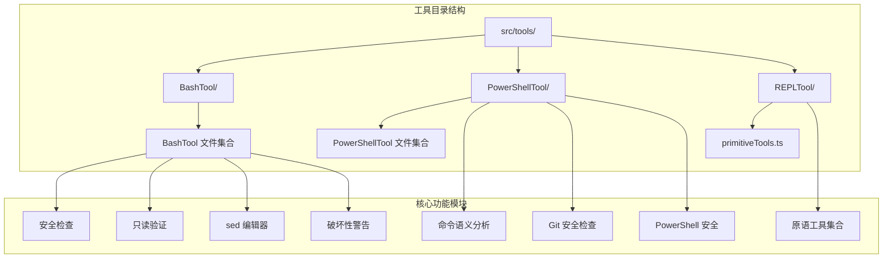

**图表来源**
- [BashTool.tsx](file://src/tools/BashTool/BashTool.tsx)
- [PowerShellTool.tsx](file://src/tools/PowerShellTool/PowerShellTool.tsx)
- [primitiveTools.ts](file://src/tools/REPLTool/primitiveTools.ts)

**章节来源**
- [BashTool.tsx](file://src/tools/BashTool/BashTool.tsx)
- [PowerShellTool.tsx](file://src/tools/PowerShellTool/PowerShellTool.tsx)
- [primitiveTools.ts](file://src/tools/REPLTool/primitiveTools.ts)

## 核心组件

### BashTool - Bash 命令执行工具

BashTool 是最复杂的命令执行工具，提供了全面的命令解析、安全检查和权限管理功能。

#### 主要特性

1. **智能命令解析**：支持复杂的 Bash 命令语法，包括管道、重定向和组合操作
2. **安全检查机制**：多层次的安全验证，防止恶意命令执行
3. **只读模式验证**：确保只读操作不会修改文件系统
4. **sed 编辑器集成**：提供安全的文件编辑功能
5. **破坏性命令警告**：对可能造成数据丢失的操作进行警告

#### 关键功能模块

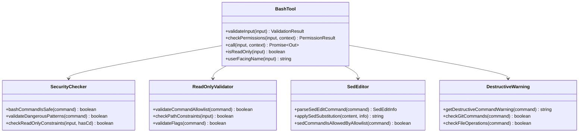

**图表来源**
- [BashTool.tsx](file://src/tools/BashTool/BashTool.tsx)
- [bashSecurity.ts](file://src/tools/BashTool/bashSecurity.ts)
- [readOnlyValidation.ts](file://src/tools/BashTool/readOnlyValidation.ts)
- [sedEditParser.ts](file://src/tools/BashTool/sedEditParser.ts)
- [destructiveCommandWarning.ts](file://src/tools/BashTool/destructiveCommandWarning.ts)

**章节来源**
- [BashTool.tsx](file://src/tools/BashTool/BashTool.tsx)
- [bashSecurity.ts](file://src/tools/BashTool/bashSecurity.ts)
- [readOnlyValidation.ts](file://src/tools/BashTool/readOnlyValidation.ts)
- [sedEditParser.ts](file://src/tools/BashTool/sedEditParser.ts)
- [destructiveCommandWarning.ts](file://src/tools/BashTool/destructiveCommandWarning.ts)

### PowerShellTool - PowerShell 命令执行工具

PowerShellTool 专为 Windows 环境设计，提供了强大的 PowerShell 脚本分析和执行能力。

#### 主要特性

1. **命令语义分析**：深入理解 PowerShell 命令的含义和潜在影响
2. **Git 安全检查**：专门针对 Git 操作的安全验证
3. **危险参数检测**：识别可能被滥用的 PowerShell 参数
4. **权限验证**：基于上下文的权限管理系统

#### 核心组件

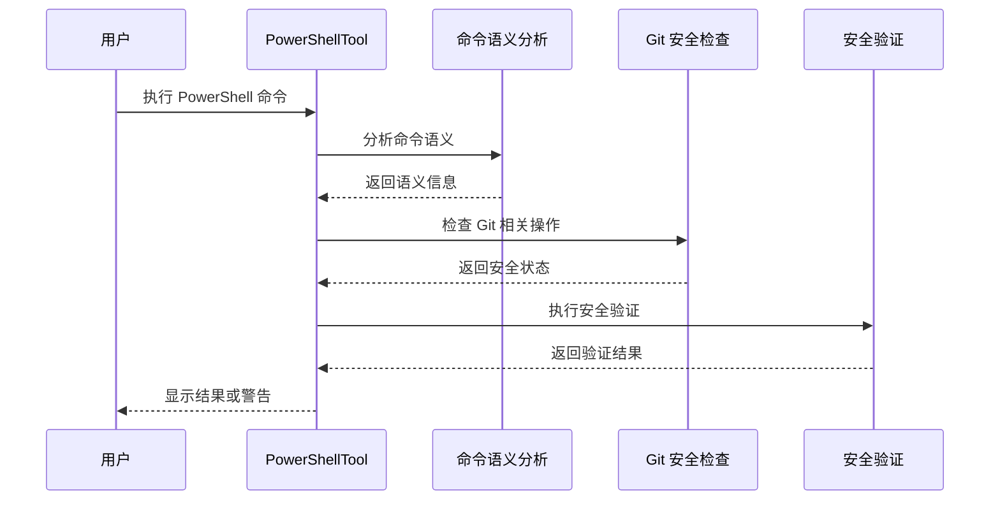

**图表来源**
- [PowerShellTool.tsx](file://src/tools/PowerShellTool/PowerShellTool.tsx)
- [commandSemantics.ts](file://src/tools/PowerShellTool/commandSemantics.ts)
- [gitSafety.ts](file://src/tools/PowerShellTool/gitSafety.ts)
- [powershellSecurity.ts](file://src/tools/PowerShellTool/powershellSecurity.ts)

**章节来源**
- [PowerShellTool.tsx](file://src/tools/PowerShellTool/PowerShellTool.tsx)
- [commandSemantics.ts](file://src/tools/PowerShellTool/commandSemantics.ts)
- [gitSafety.ts](file://src/tools/PowerShellTool/gitSafety.ts)
- [powershellSecurity.ts](file://src/tools/PowerShellTool/powershellSecurity.ts)

### REPLTool - 交互式编程工具

REPLTool 提供了丰富的原语工具集合，支持多种编程语言的交互式执行。

#### 原语工具集合

REPLTool 包含以下核心原语工具：

| 工具名称 | 功能描述 | 使用场景 |
|---------|----------|----------|
| `eval` | 执行任意表达式 | 快速计算和测试 |
| `apply` | 应用函数到参数列表 | 函数式编程 |
| `quote` | 保持表达式不求值 | 宏和元编程 |
| `car` | 获取列表首元素 | 列表操作 |
| `cdr` | 获取列表除首元素外的部分 | 列表操作 |
| `cons` | 构建新列表 | 数据结构操作 |
| `atom` | 检查原子表达式 | 类型判断 |
| `eq` | 检查相等性 | 比较操作 |

**章节来源**
- [primitiveTools.ts](file://src/tools/REPLTool/primitiveTools.ts)
- [constants.ts](file://src/tools/REPLTool/constants.ts)

## 架构概览

命令执行工具系统采用分层架构设计，确保安全性、可扩展性和易用性：

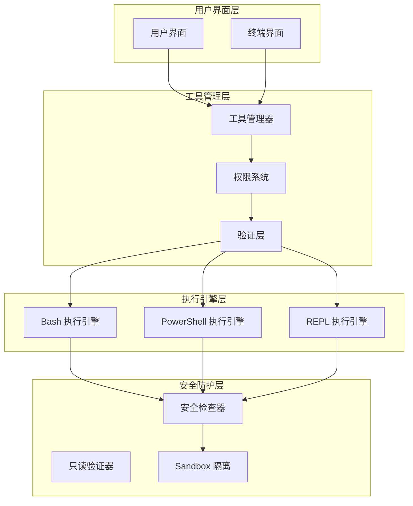

**图表来源**
- [BashTool.tsx](file://src/tools/BashTool/BashTool.tsx)
- [PowerShellTool.tsx](file://src/tools/PowerShellTool/PowerShellTool.tsx)
- [primitiveTools.ts](file://src/tools/REPLTool/primitiveTools.ts)

## 详细组件分析

### BashTool 组件深度分析

#### 命令解析与安全检查

BashTool 实现了多层次的安全检查机制：

1. **命令完整性检查**：防止部分命令的执行
2. **危险模式检测**：识别潜在的恶意命令模式
3. **Git 提交安全检查**：专门针对 Git 操作的安全验证
4. **jq 命令安全检查**：防止危险的 jq 操作

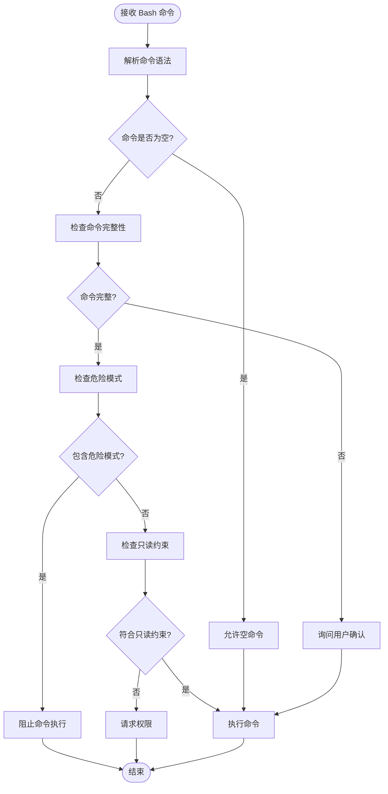

**图表来源**
- [bashSecurity.ts](file://src/tools/BashTool/bashSecurity.ts)
- [readOnlyValidation.ts](file://src/tools/BashTool/readOnlyValidation.ts)

#### 只读模式验证机制

BashTool 的只读模式验证确保所有操作都不会修改文件系统：

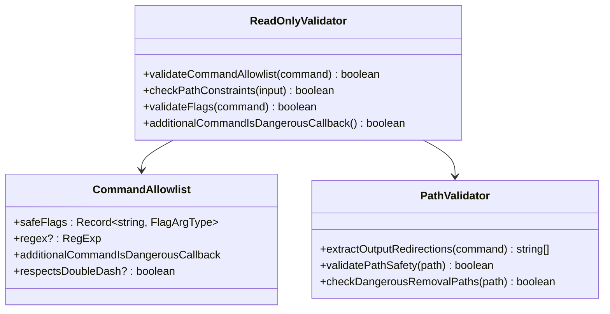

**图表来源**
- [readOnlyValidation.ts](file://src/tools/BashTool/readOnlyValidation.ts)

#### sed 编辑器集成

BashTool 提供了安全的 sed 编辑器集成：

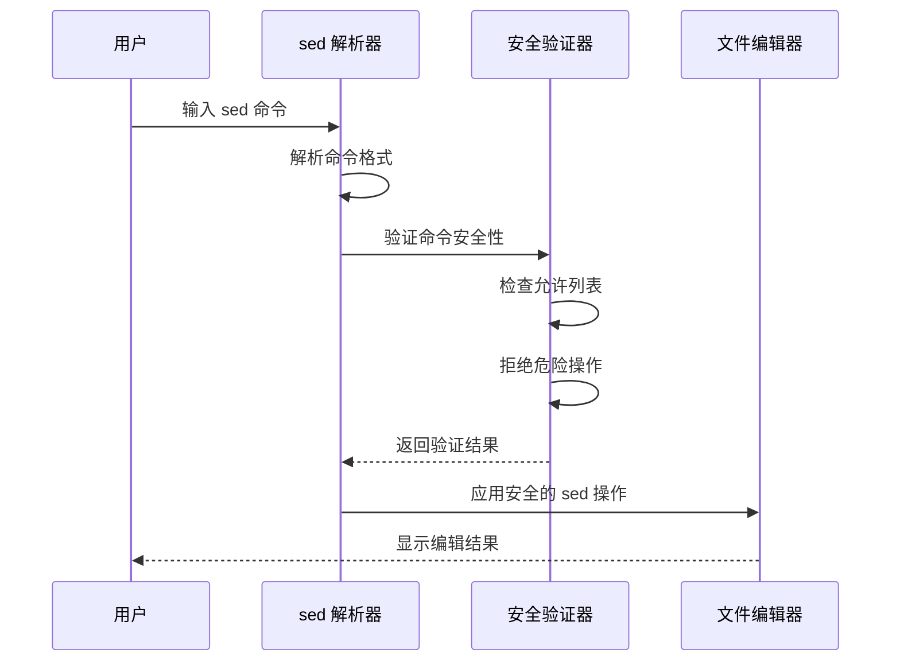

**图表来源**
- [sedEditParser.ts](file://src/tools/BashTool/sedEditParser.ts)
- [sedValidation.ts](file://src/tools/BashTool/sedValidation.ts)

**章节来源**
- [BashTool.tsx](file://src/tools/BashTool/BashTool.tsx)
- [bashSecurity.ts](file://src/tools/BashTool/bashSecurity.ts)
- [readOnlyValidation.ts](file://src/tools/BashTool/readOnlyValidation.ts)
- [sedEditParser.ts](file://src/tools/BashTool/sedEditParser.ts)
- [sedValidation.ts](file://src/tools/BashTool/sedValidation.ts)

### PowerShellTool 组件深度分析

#### 命令语义分析

PowerShellTool 的命令语义分析能够深入理解 PowerShell 命令的含义：

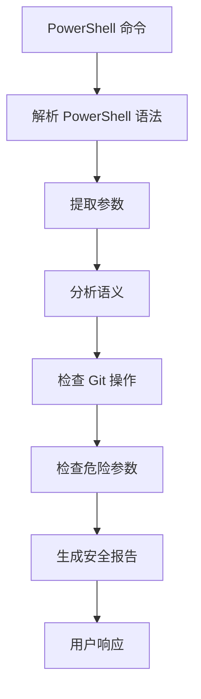

**图表来源**
- [commandSemantics.ts](file://src/tools/PowerShellTool/commandSemantics.ts)
- [gitSafety.ts](file://src/tools/PowerShellTool/gitSafety.ts)

#### 权限验证系统

PowerShellTool 实现了基于上下文的权限验证：

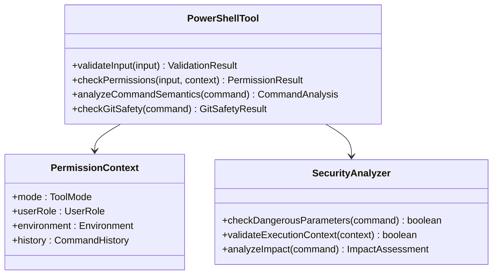

**图表来源**
- [PowerShellTool.tsx](file://src/tools/PowerShellTool/PowerShellTool.tsx)
- [powershellSecurity.ts](file://src/tools/PowerShellTool/powershellSecurity.ts)

**章节来源**
- [PowerShellTool.tsx](file://src/tools/PowerShellTool/PowerShellTool.tsx)
- [commandSemantics.ts](file://src/tools/PowerShellTool/commandSemantics.ts)
- [gitSafety.ts](file://src/tools/PowerShellTool/gitSafety.ts)
- [powershellSecurity.ts](file://src/tools/PowerShellTool/powershellSecurity.ts)

### REPLTool 组件深度分析

#### 原语工具集合

REPLTool 提供了完整的 LISP 风格原语工具集合：

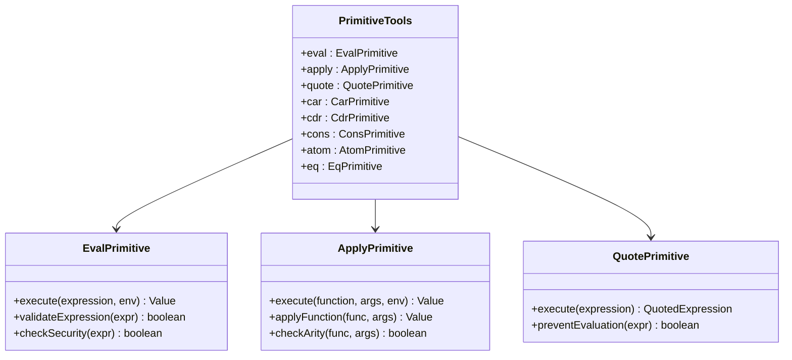

**图表来源**
- [primitiveTools.ts](file://src/tools/REPLTool/primitiveTools.ts)
- [constants.ts](file://src/tools/REPLTool/constants.ts)

**章节来源**
- [primitiveTools.ts](file://src/tools/REPLTool/primitiveTools.ts)
- [constants.ts](file://src/tools/REPLTool/constants.ts)

## 依赖关系分析

命令执行工具之间的依赖关系体现了清晰的分层架构：

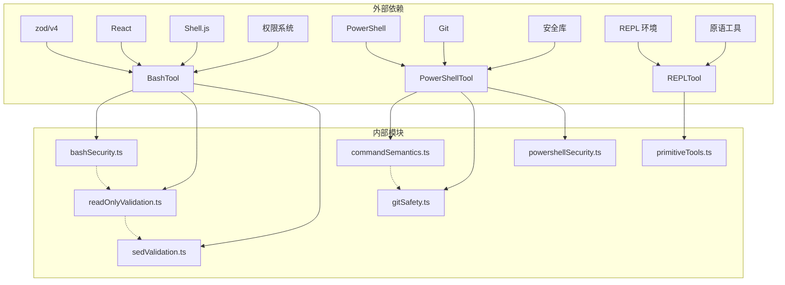

**图表来源**
- [BashTool.tsx](file://src/tools/BashTool/BashTool.tsx)
- [PowerShellTool.tsx](file://src/tools/PowerShellTool/PowerShellTool.tsx)
- [primitiveTools.ts](file://src/tools/REPLTool/primitiveTools.ts)

**章节来源**
- [BashTool.tsx](file://src/tools/BashTool/BashTool.tsx)
- [PowerShellTool.tsx](file://src/tools/PowerShellTool/PowerShellTool.tsx)
- [primitiveTools.ts](file://src/tools/REPLTool/primitiveTools.ts)

## 性能考虑

### BashTool 性能优化

1. **异步生成器模式**：使用异步生成器处理长时间运行的命令
2. **输出流控制**：动态调整输出缓冲区大小
3. **缓存机制**：缓存文件内容和命令结果
4. **并发控制**：限制同时执行的命令数量

### PowerShellTool 性能优化

1. **语义分析缓存**：缓存命令语义分析结果
2. **Git 操作优化**：批量处理 Git 相关操作
3. **参数验证优化**：预编译正则表达式

### REPLTool 性能优化

1. **原语工具缓存**：缓存常用原语工具
2. **表达式求值优化**：优化表达式求值算法
3. **内存管理**：有效管理内存使用

## 故障排除指南

### 常见问题及解决方案

#### BashTool 问题

1. **命令执行超时**
   - 检查命令复杂度和输入数据量
   - 调整超时设置
   - 使用后台执行模式

2. **权限拒绝**
   - 检查用户权限
   - 验证安全策略配置
   - 使用权限提升工具

3. **sed 操作失败**
   - 检查 sed 表达式格式
   - 验证文件路径安全性
   - 确认文件编码

#### PowerShellTool 问题

1. **脚本执行失败**
   - 检查 PowerShell 版本兼容性
   - 验证脚本语法
   - 检查执行策略设置

2. **Git 操作异常**
   - 确认 Git 配置正确
   - 检查网络连接
   - 验证仓库状态

3. **安全警告过多**
   - 调整安全策略级别
   - 检查用户角色配置
   - 更新权限规则

#### REPLTool 问题

1. **原语工具不可用**
   - 检查 REPL 环境配置
   - 验证原语工具版本
   - 确认导入路径正确

2. **表达式求值错误**
   - 检查表达式语法
   - 验证数据类型
   - 确认环境变量设置

**章节来源**
- [BashTool.tsx](file://src/tools/BashTool/BashTool.tsx)
- [PowerShellTool.tsx](file://src/tools/PowerShellTool/PowerShellTool.tsx)
- [primitiveTools.ts](file://src/tools/REPLTool/primitiveTools.ts)

## 结论

命令执行工具系统展现了现代代码平台在安全性、功能性和用户体验方面的平衡。通过分层架构设计、严格的权限管理和智能的安全检查机制，这些工具为开发者提供了强大而安全的命令执行能力。

### 主要优势

1. **安全性优先**：多层安全检查确保命令执行的安全性
2. **功能丰富**：支持多种命令语言和执行模式
3. **用户体验**：直观的界面和详细的反馈信息
4. **可扩展性**：模块化设计便于功能扩展

### 最佳实践建议

1. **谨慎使用危险命令**：始终遵循最小权限原则
2. **定期更新安全策略**：保持安全检查规则的时效性
3. **监控执行日志**：记录重要命令的执行历史
4. **培训用户**：提高用户对安全风险的认识

这个工具系统为代码平台提供了坚实的基础设施，支持各种开发场景下的命令执行需求，同时确保了系统的整体安全性。