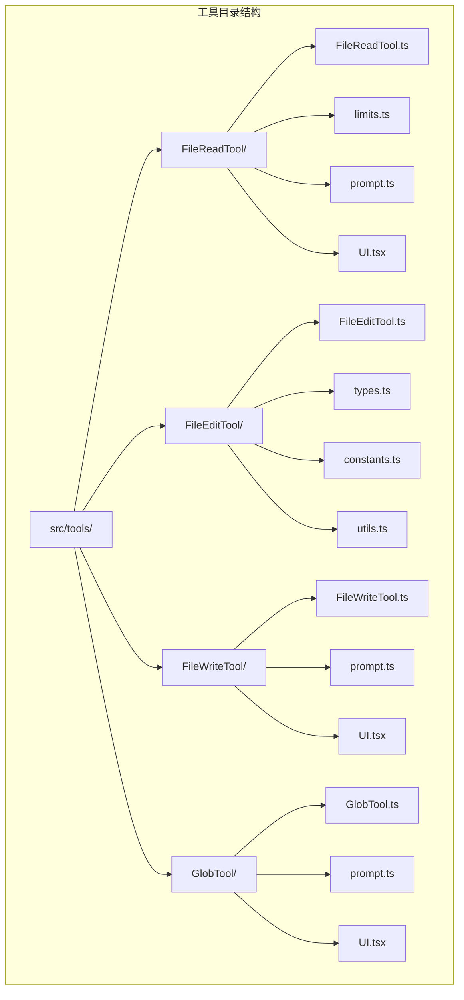
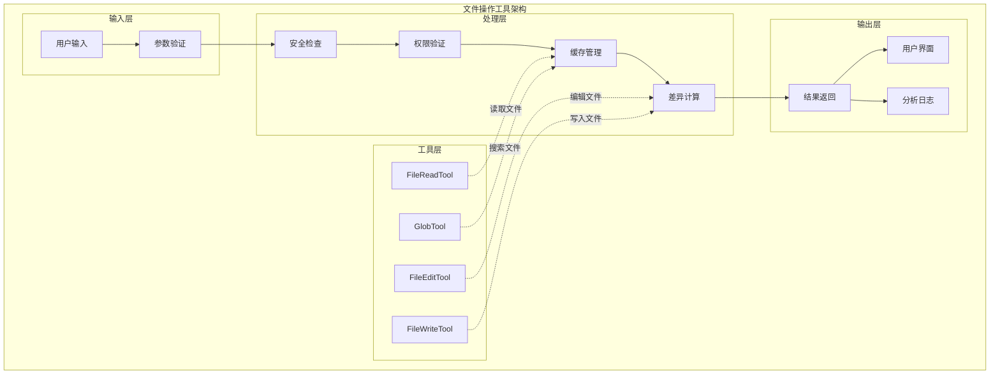
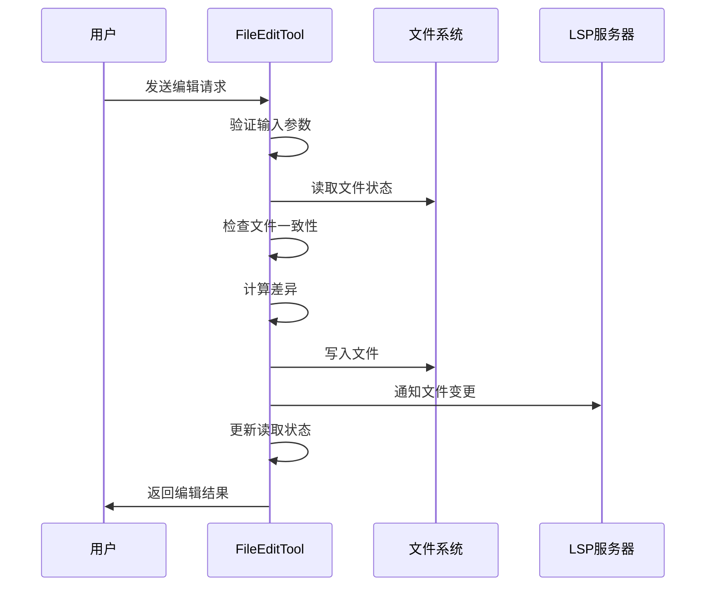
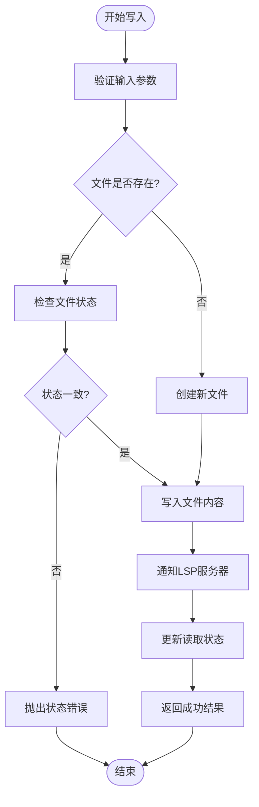
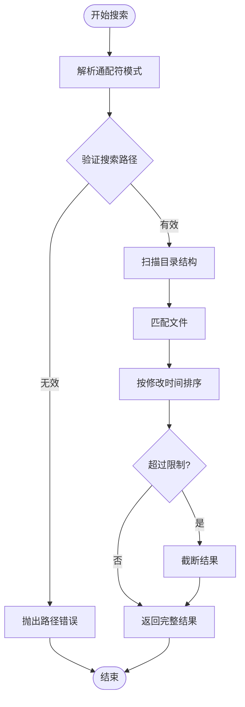
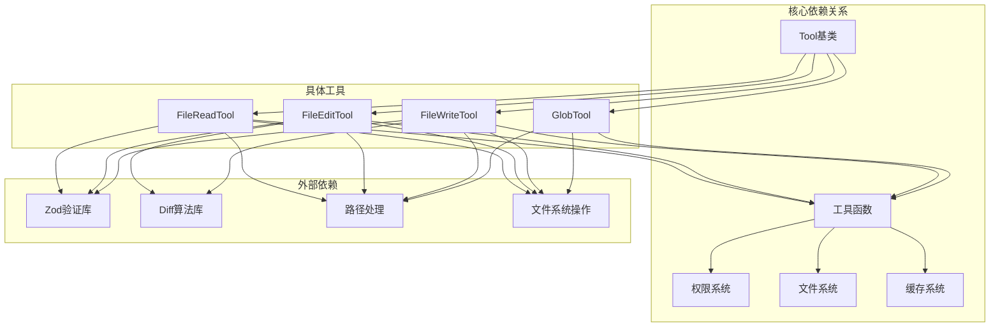
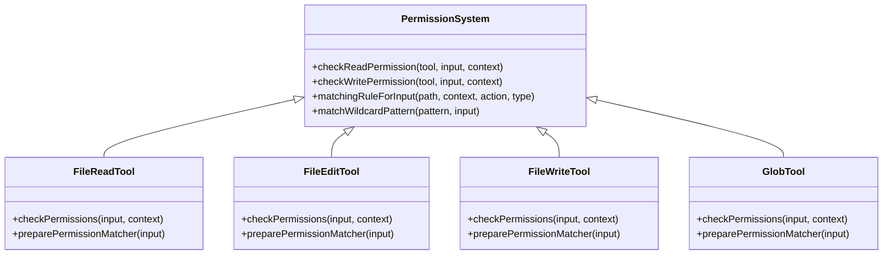

# 文件操作工具

<cite>
**本文档引用的文件**
- [FileReadTool.ts](file://src/tools/FileReadTool/FileReadTool.ts)
- [limits.ts](file://src/tools/FileReadTool/limits.ts)
- [prompt.ts](file://src/tools/FileReadTool/prompt.ts)
- [UI.tsx](file://src/tools/FileReadTool/UI.tsx)
- [FileEditTool.ts](file://src/tools/FileEditTool/FileEditTool.ts)
- [types.ts](file://src/tools/FileEditTool/types.ts)
- [constants.ts](file://src/tools/FileEditTool/constants.ts)
- [utils.ts](file://src/tools/FileEditTool/utils.ts)
- [FileWriteTool.ts](file://src/tools/FileWriteTool/FileWriteTool.ts)
- [prompt.ts](file://src/tools/FileWriteTool/prompt.ts)
- [UI.tsx](file://src/tools/FileWriteTool/UI.tsx)
- [GlobTool.ts](file://src/tools/GlobTool/GlobTool.ts)
- [prompt.ts](file://src/tools/GlobTool/prompt.ts)
- [UI.tsx](file://src/tools/GlobTool/UI.tsx)
</cite>

## 目录
1. [简介](#简介)
2. [项目结构](#项目结构)
3. [核心组件](#核心组件)
4. [架构概览](#架构概览)
5. [详细组件分析](#详细组件分析)
6. [依赖关系分析](#依赖关系分析)
7. [性能考虑](#性能考虑)
8. [故障排除指南](#故障排除指南)
9. [结论](#结论)

## 简介

本文档详细介绍 Claude Code 中的文件操作工具集，包括 FileReadTool、FileEditTool、FileWriteTool 和 GlobTool。这些工具提供了强大的文件系统交互能力，支持文件读取、编辑、写入和搜索功能。

每个工具都经过精心设计，具有以下特点：
- **安全性**：内置权限控制和安全检查机制
- **效率性**：优化的文件处理算法和缓存策略
- **易用性**：直观的用户界面和详细的错误信息
- **可靠性**：完整的错误处理和回滚机制

## 项目结构

文件操作工具位于 `src/tools/` 目录下，采用模块化设计：



**图表来源**
- [FileReadTool.ts:1-800](file://src/tools/FileReadTool/FileReadTool.ts#L1-L800)
- [FileEditTool.ts:1-626](file://src/tools/FileEditTool/FileEditTool.ts#L1-L626)
- [FileWriteTool.ts:1-435](file://src/tools/FileWriteTool/FileWriteTool.ts#L1-L435)
- [GlobTool.ts:1-199](file://src/tools/GlobTool/GlobTool.ts#L1-L199)

## 核心组件

### FileReadTool（文件读取工具）

FileReadTool 是一个功能强大的文件读取工具，支持多种文件格式的读取和处理。

**主要特性**：
- 支持文本文件、图片、PDF、Jupyter Notebook 等多种格式
- 智能大小限制和令牌计数
- 设备文件检测和安全防护
- 文件变更去重机制
- 增强的安全检查和权限验证

**关键参数**：
- `file_path`：要读取的文件绝对路径
- `offset`：起始行号（可选）
- `limit`：读取的行数（可选）
- `pages`：PDF 页面范围（如 "1-5"）

**图表来源**
- [FileReadTool.ts:227-246](file://src/tools/FileReadTool/FileReadTool.ts#L227-L246)

### FileEditTool（文件编辑工具）

FileEditTool 提供精确的文件编辑功能，支持字符串替换和差异显示。

**主要特性**：
- 智能字符串匹配和替换
- 差异显示和预览
- 文件状态管理和一致性检查
- 支持批量编辑操作
- 自动引号风格保持

**关键参数**：
- `file_path`：要编辑的文件路径
- `old_string`：要替换的旧字符串
- `new_string`：新字符串
- `replace_all`：是否替换所有匹配项

**图表来源**
- [types.ts:6-18](file://src/tools/FileEditTool/types.ts#L6-L18)

### FileWriteTool（文件写入工具）

FileWriteTool 专注于文件的完整覆盖写入，确保数据完整性。

**主要特性**：
- 完整文件覆盖写入
- 内容变更检测
- 自动备份和恢复
- 差异计算和显示
- 权限验证和安全检查

**关键参数**：
- `file_path`：目标文件路径（必须为绝对路径）
- `content`：要写入的内容

**图表来源**
- [FileWriteTool.ts:56-65](file://src/tools/FileWriteTool/FileWriteTool.ts#L56-L65)

### GlobTool（通配符搜索工具）

GlobTool 提供高效的文件模式匹配和搜索功能。

**主要特性**：
- 支持标准通配符模式
- 快速文件搜索和匹配
- 结果排序和过滤
- 大规模代码库支持
- 性能优化的搜索算法

**关键参数**：
- `pattern`：通配符模式（如 "**/*.js"）
- `path`：搜索目录（可选，默认为当前工作目录）

**图表来源**
- [GlobTool.ts:26-35](file://src/tools/GlobTool/GlobTool.ts#L26-L35)

## 架构概览



**图表来源**
- [FileReadTool.ts:337-418](file://src/tools/FileReadTool/FileReadTool.ts#L337-L418)
- [FileEditTool.ts:86-132](file://src/tools/FileEditTool/FileEditTool.ts#L86-L132)
- [FileWriteTool.ts:94-142](file://src/tools/FileWriteTool/FileWriteTool.ts#L94-L142)
- [GlobTool.ts:57-93](file://src/tools/GlobTool/GlobTool.ts#L57-L93)

## 详细组件分析

### FileReadTool 详细分析

#### 功能特性

FileReadTool 具有以下核心功能：

1. **多格式支持**：
   - 文本文件读取和格式化
   - 图片文件的视觉呈现
   - PDF 文件的内容提取
   - Jupyter Notebook 的单元格处理

2. **安全防护机制**：
   - 设备文件检测（/dev/zero, /dev/random 等）
   - UNC 路径安全检查
   - 二进制文件类型识别
   - 文件权限验证

3. **性能优化**：
   - 文件变更去重机制
   - 智能令牌计数
   - 缓存策略优化

#### 参数说明

| 参数名 | 类型 | 必需 | 描述 | 默认值 |
|--------|------|------|------|--------|
| file_path | string | 是 | 要读取的文件绝对路径 | - |
| offset | number | 否 | 起始行号（从1开始） | 1 |
| limit | number | 否 | 读取的行数 | - |
| pages | string | 否 | PDF 页面范围（如 "1-5"） | - |

#### 使用示例

```javascript
// 读取整个文件
await FileReadTool.call({
  file_path: "/home/user/document.txt"
});

// 读取文件特定部分
await FileReadTool.call({
  file_path: "/home/user/large.log",
  offset: 1000,
  limit: 500
});

// 读取 PDF 特定页面
await FileReadTool.call({
  file_path: "/home/user/report.pdf",
  pages: "1-5"
});
```

**章节来源**
- [FileReadTool.ts:496-651](file://src/tools/FileReadTool/FileReadTool.ts#L496-L651)
- [limits.ts:1-93](file://src/tools/FileReadTool/limits.ts#L1-L93)
- [prompt.ts:1-50](file://src/tools/FileReadTool/prompt.ts#L1-L50)

### FileEditTool 详细分析

#### 功能特性

FileEditTool 提供了精确的文件编辑能力：

1. **智能编辑功能**：
   - 字符串精确匹配和替换
   - 批量编辑支持
   - 引号风格自动保持
   - 差异计算和预览

2. **文件状态管理**：
   - 读取状态跟踪
   - 文件修改时间检查
   - 冲突检测和解决
   - 自动备份机制

3. **用户体验优化**：
   - 详细的错误信息
   - 编辑建议和提示
   - 实时差异显示
   - 撤销和恢复功能

#### 参数说明

| 参数名 | 类型 | 必需 | 描述 | 默认值 |
|--------|------|------|------|--------|
| file_path | string | 是 | 要编辑的文件路径 | - |
| old_string | string | 是 | 要替换的旧字符串 | - |
| new_string | string | 是 | 新字符串 | - |
| replace_all | boolean | 否 | 是否替换所有匹配项 | false |

#### 编辑流程



**图表来源**
- [FileEditTool.ts:387-574](file://src/tools/FileEditTool/FileEditTool.ts#L387-L574)

#### 使用示例

```javascript
// 替换单个字符串
await FileEditTool.call({
  file_path: "/home/user/config.json",
  old_string: "DEBUG=true",
  new_string: "DEBUG=false"
});

// 批量替换所有匹配项
await FileEditTool.call({
  file_path: "/home/user/script.py",
  old_string: "console.log",
  new_string: "print",
  replace_all: true
});
```

**章节来源**
- [FileEditTool.ts:137-362](file://src/tools/FileEditTool/FileEditTool.ts#L137-L362)
- [utils.ts:234-350](file://src/tools/FileEditTool/utils.ts#L234-L350)

### FileWriteTool 详细分析

#### 功能特性

FileWriteTool 专注于文件的完整写入操作：

1. **安全写入机制**：
   - 文件存在性检查
   - 修改时间验证
   - 内容一致性确认
   - 自动备份和恢复

2. **差异计算**：
   - 变更前后的文件对比
   - 结构化差异显示
   - 行数统计和分析
   - 变更影响评估

3. **用户反馈**：
   - 详细的写入结果
   - 文件内容预览
   - 错误信息诊断
   - 成功确认提示

#### 参数说明

| 参数名 | 类型 | 必需 | 描述 | 默认值 |
|--------|------|------|------|--------|
| file_path | string | 是 | 目标文件路径（必须为绝对路径） | - |
| content | string | 是 | 要写入的内容 | - |

#### 写入流程



**图表来源**
- [FileWriteTool.ts:223-417](file://src/tools/FileWriteTool/FileWriteTool.ts#L223-L417)

#### 使用示例

```javascript
// 创建新文件
await FileWriteTool.call({
  file_path: "/home/user/new_file.txt",
  content: "Hello World!"
});

// 覆盖现有文件
await FileWriteTool.call({
  file_path: "/home/user/existing_file.txt",
  content: "Updated content"
});
```

**章节来源**
- [FileWriteTool.ts:153-222](file://src/tools/FileWriteTool/FileWriteTool.ts#L153-L222)
- [UI.tsx:362-404](file://src/tools/FileWriteTool/UI.tsx#L362-L404)

### GlobTool 详细分析

#### 功能特性

GlobTool 提供高效的文件模式匹配功能：

1. **通配符支持**：
   - 标准通配符模式
   - 递归目录搜索
   - 多级模式匹配
   - 排除模式支持

2. **性能优化**：
   - 大规模文件系统支持
   - 结果数量限制
   - 搜索进度跟踪
   - 内存使用优化

3. **结果处理**：
   - 按修改时间排序
   - 路径相对化处理
   - 截断结果提示
   - 搜索统计信息

#### 参数说明

| 参数名 | 类型 | 必需 | 描述 | 默认值 |
|--------|------|------|------|--------|
| pattern | string | 是 | 通配符模式（如 "**/*.js"） | - |
| path | string | 否 | 搜索目录（默认为当前工作目录） | 当前工作目录 |

#### 搜索算法



**图表来源**
- [GlobTool.ts:154-176](file://src/tools/GlobTool/GlobTool.ts#L154-L176)

#### 使用示例

```javascript
// 搜索所有JavaScript文件
await GlobTool.call({
  pattern: "**/*.js"
});

// 搜索特定目录下的Python文件
await GlobTool.call({
  pattern: "src/**/*.py",
  path: "/home/user/project"
});

// 搜索配置文件
await GlobTool.call({
  pattern: "*.{json,yaml,yml}",
  path: "/etc"
});
```

**章节来源**
- [GlobTool.ts:94-134](file://src/tools/GlobTool/GlobTool.ts#L94-L134)
- [prompt.ts:1-8](file://src/tools/GlobTool/prompt.ts#L1-L8)

## 依赖关系分析



**图表来源**
- [FileReadTool.ts:28-94](file://src/tools/FileReadTool/FileReadTool.ts#L28-L94)
- [FileEditTool.ts:14-71](file://src/tools/FileEditTool/FileEditTool.ts#L14-L71)
- [FileWriteTool.ts:15-54](file://src/tools/FileWriteTool/FileWriteTool.ts#L15-L54)
- [GlobTool.ts:3-24](file://src/tools/GlobTool/GlobTool.ts#L3-L24)

### 权限系统集成

每个工具都集成了统一的权限控制系统：



**图表来源**
- [FileReadTool.ts:395-405](file://src/tools/FileReadTool/FileReadTool.ts#L395-L405)
- [FileEditTool.ts:122-132](file://src/tools/FileEditTool/FileEditTool.ts#L122-L132)
- [FileWriteTool.ts:132-142](file://src/tools/FileWriteTool/FileWriteTool.ts#L132-L142)
- [GlobTool.ts:135-142](file://src/tools/GlobTool/GlobTool.ts#L135-L142)

**章节来源**
- [FileReadTool.ts:395-405](file://src/tools/FileReadTool/FileReadTool.ts#L395-L405)
- [FileEditTool.ts:122-132](file://src/tools/FileEditTool/FileEditTool.ts#L122-L132)
- [FileWriteTool.ts:132-142](file://src/tools/FileWriteTool/FileWriteTool.ts#L132-L142)
- [GlobTool.ts:135-142](file://src/tools/GlobTool/GlobTool.ts#L135-L142)

## 性能考虑

### 内存优化策略

1. **流式处理**：
   - 大文件分块读取
   - 按需内存分配
   - 及时释放资源

2. **缓存机制**：
   - 文件读取状态缓存
   - 差异计算结果缓存
   - 模式匹配结果缓存

3. **并发控制**：
   - 读取操作并发安全
   - 写入操作原子性保证
   - 资源竞争避免

### 性能监控指标

| 指标名称 | 目标值 | 监控方式 | 影响因素 |
|----------|--------|----------|----------|
| 文件读取速度 | > 100 MB/s | 读取时间统计 | 文件大小、磁盘性能 |
| 搜索响应时间 | < 100ms | 搜索延迟监控 | 模式复杂度、文件数量 |
| 内存使用 | < 500MB | 内存使用监控 | 缓存大小、并发数 |
| 差异计算时间 | < 500ms | 差异计算统计 | 文件大小、变更量 |

### 优化建议

1. **大文件处理**：
   - 使用 offset 和 limit 参数
   - 分批处理大型文件
   - 启用文件变更去重

2. **搜索优化**：
   - 使用更具体的模式
   - 限制搜索范围
   - 缓存搜索结果

3. **并发控制**：
   - 避免同时大量写入
   - 合理设置超时时间
   - 监控系统资源使用

## 故障排除指南

### 常见错误及解决方案

#### 文件读取错误

| 错误类型 | 错误代码 | 解决方案 |
|----------|----------|----------|
| 文件不存在 | ENOENT | 检查文件路径，使用 suggestPathUnderCwd |
| 权限不足 | EACCES | 检查文件权限，调整权限设置 |
| 设备文件访问 | 设备文件阻塞 | 避免读取设备文件 |
| 文件过大 | 超过大小限制 | 使用 offset 和 limit 参数 |

#### 文件编辑错误

| 错误类型 | 错误代码 | 解决方案 |
|----------|----------|----------|
| 文件未读取 | 未读取状态 | 先使用 FileReadTool 读取文件 |
| 文件被修改 | 时间戳不匹配 | 重新读取文件后编辑 |
| 字符串未找到 | 匹配失败 | 检查字符串内容，使用更精确的匹配 |
| 权限不足 | EACCES | 检查文件权限 |

#### 文件写入错误

| 错误类型 | 错误代码 | 解决方案 |
|----------|----------|----------|
| 文件未读取 | 未读取状态 | 先使用 FileReadTool 读取文件 |
| 文件被修改 | 时间戳不匹配 | 重新读取文件后写入 |
| 权限不足 | EACCES | 检查文件权限 |
| 路径无效 | ENOENT | 检查目标路径 |

#### 搜索错误

| 错误类型 | 错误代码 | 解决方案 |
|----------|----------|----------|
| 目录不存在 | ENOENT | 检查搜索路径 |
| 模式无效 | 语法错误 | 检查通配符语法 |
| 权限不足 | EACCES | 检查目录权限 |

### 调试技巧

1. **启用详细日志**：
   ```bash
   export DEBUG=FileReadTool,FileEditTool,FileWriteTool,GlobTool
   ```

2. **检查文件状态**：
   ```javascript
   // 检查文件修改时间
   const mtime = await getFileModificationTime(filePath);
   
   // 检查文件大小
   const stat = await fs.stat(filePath);
   ```

3. **验证权限设置**：
   ```javascript
   // 检查权限规则
   const rule = matchingRuleForInput(
     filePath,
     toolPermissionContext,
     'read',
     'deny'
   );
   ```

**章节来源**
- [FileReadTool.ts:609-650](file://src/tools/FileReadTool/FileReadTool.ts#L609-L650)
- [FileEditTool.ts:137-362](file://src/tools/FileEditTool/FileEditTool.ts#L137-L362)
- [FileWriteTool.ts:153-222](file://src/tools/FileWriteTool/FileWriteTool.ts#L153-L222)
- [GlobTool.ts:94-134](file://src/tools/GlobTool/GlobTool.ts#L94-L134)

## 结论

文件操作工具集为 Claude Code 提供了强大而安全的文件系统交互能力。每个工具都经过精心设计，在功能完整性、安全性、性能和用户体验方面都达到了很高的水准。

### 主要优势

1. **功能完整性**：涵盖了文件读取、编辑、写入和搜索的所有核心需求
2. **安全性保障**：内置多重安全检查和权限验证机制
3. **性能优化**：采用了多种优化策略确保高效运行
4. **用户体验**：提供了友好的错误信息和反馈机制

### 最佳实践建议

1. **权限管理**：合理配置权限规则，确保文件访问安全
2. **性能优化**：根据文件大小选择合适的参数，避免不必要的全量操作
3. **错误处理**：建立完善的错误处理机制，及时发现和解决问题
4. **监控告警**：建立性能监控和异常告警机制

这些工具为开发者提供了可靠的文件操作基础，支持各种复杂的开发场景和自动化任务。