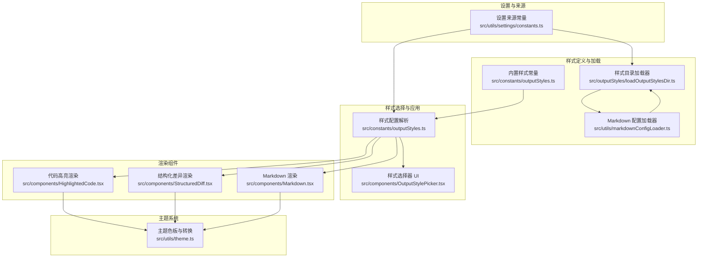
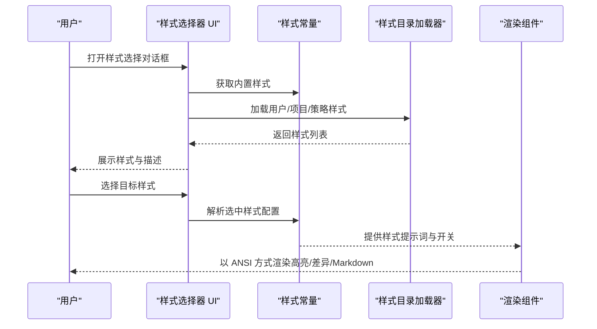
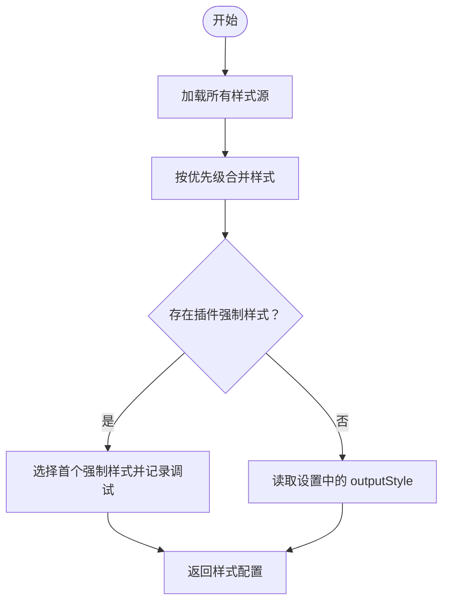
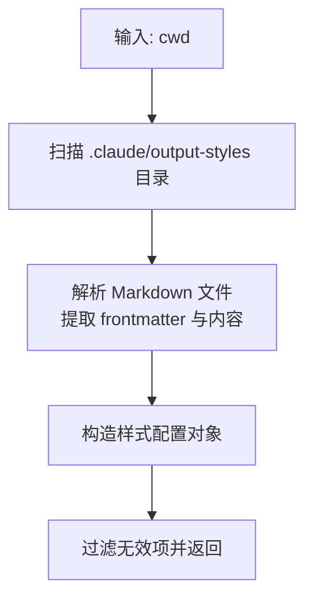
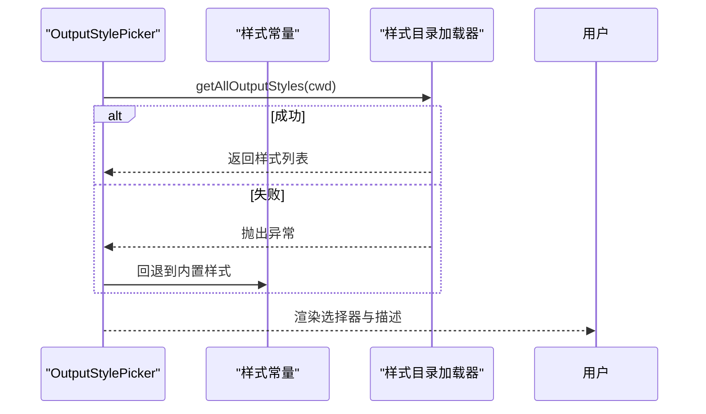
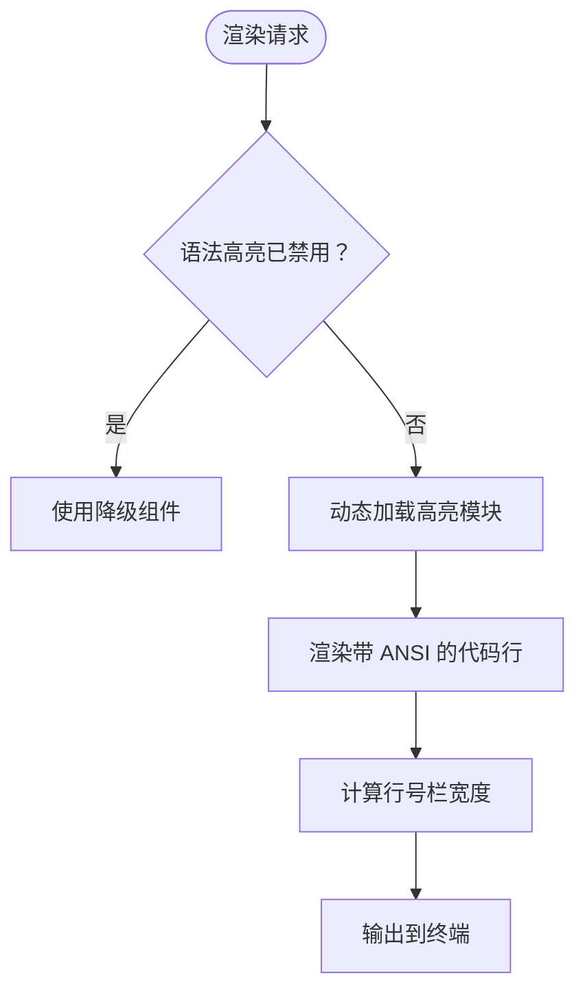
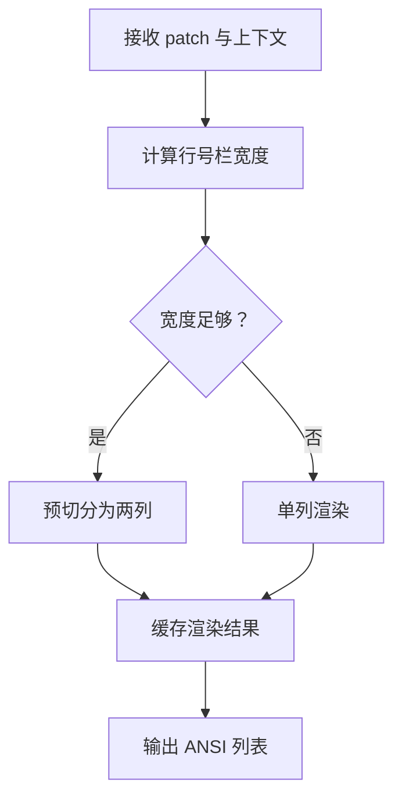
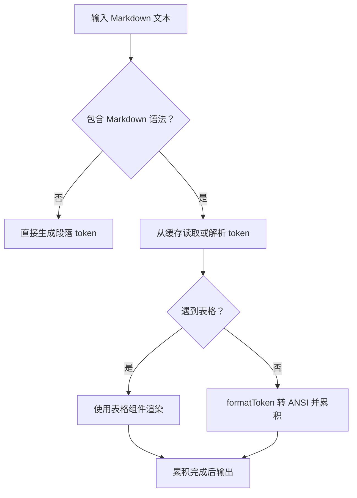
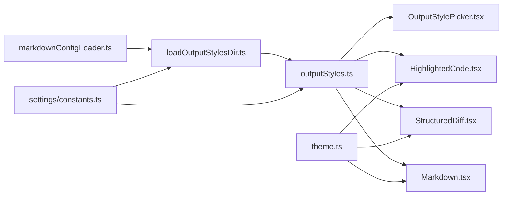

# 输出样式系统

<cite>
**本文档引用的文件**
- [src/constants/outputStyles.ts](file://src/constants/outputStyles.ts)
- [src/outputStyles/loadOutputStylesDir.ts](file://src/outputStyles/loadOutputStylesDir.ts)
- [src/components/OutputStylePicker.tsx](file://src/components/OutputStylePicker.tsx)
- [src/components/HighlightedCode.tsx](file://src/components/HighlightedCode.tsx)
- [src/components/StructuredDiff.tsx](file://src/components/StructuredDiff.tsx)
- [src/components/Markdown.tsx](file://src/components/Markdown.tsx)
- [src/utils/markdownConfigLoader.ts](file://src/utils/markdownConfigLoader.ts)
- [src/utils/settings/constants.ts](file://src/utils/settings/constants.ts)
- [src/utils/theme.ts](file://src/utils/theme.ts)
</cite>

## 目录
1. [简介](#简介)
2. [项目结构](#项目结构)
3. [核心组件](#核心组件)
4. [架构总览](#架构总览)
5. [详细组件分析](#详细组件分析)
6. [依赖关系分析](#依赖关系分析)
7. [性能考量](#性能考量)
8. [故障排除指南](#故障排除指南)
9. [结论](#结论)
10. [附录](#附录)

## 简介
本文件全面阐述 Claude Code 的输出样式系统（Output Style System），涵盖设计架构、样式配置、样式应用与定制机制。系统支持多种输出风格（如解释型、学习型等），并通过 Markdown 配置目录动态加载用户/项目/策略来源的样式定义；同时在渲染层提供代码高亮、结构化差异显示、Markdown 渲染等能力，并通过主题系统实现跨终端的颜色一致性。

## 项目结构
输出样式系统主要由以下模块组成：
- 样式常量与选择器：定义内置样式、聚合与解析逻辑，以及样式选择器 UI。
- 样式加载器：从用户、项目、策略等多源目录加载 Markdown 配置，生成样式对象。
- 渲染组件：负责在终端中以 ANSI 形式渲染代码高亮、结构化差异与 Markdown 内容。
- 主题系统：提供多套主题色板，确保不同终端环境下的颜色一致性。
- 设置常量：定义设置来源优先级与启用规则，影响样式加载与覆盖。

**图表来源**
- [src/constants/outputStyles.ts:1-217](file://src/constants/outputStyles.ts#L1-L217)
- [src/outputStyles/loadOutputStylesDir.ts:1-99](file://src/outputStyles/loadOutputStylesDir.ts#L1-L99)
- [src/utils/markdownConfigLoader.ts:29-430](file://src/utils/markdownConfigLoader.ts#L29-L430)
- [src/components/OutputStylePicker.tsx:1-112](file://src/components/OutputStylePicker.tsx#L1-L112)
- [src/components/HighlightedCode.tsx:1-190](file://src/components/HighlightedCode.tsx#L1-L190)
- [src/components/StructuredDiff.tsx:1-190](file://src/components/StructuredDiff.tsx#L1-L190)
- [src/components/Markdown.tsx:1-236](file://src/components/Markdown.tsx#L1-L236)
- [src/utils/theme.ts:1-640](file://src/utils/theme.ts#L1-L640)
- [src/utils/settings/constants.ts:1-203](file://src/utils/settings/constants.ts#L1-L203)

**章节来源**
- [src/constants/outputStyles.ts:1-217](file://src/constants/outputStyles.ts#L1-L217)
- [src/outputStyles/loadOutputStylesDir.ts:1-99](file://src/outputStyles/loadOutputStylesDir.ts#L1-L99)
- [src/utils/markdownConfigLoader.ts:29-430](file://src/utils/markdownConfigLoader.ts#L29-L430)
- [src/components/OutputStylePicker.tsx:1-112](file://src/components/OutputStylePicker.tsx#L1-L112)
- [src/components/HighlightedCode.tsx:1-190](file://src/components/HighlightedCode.tsx#L1-L190)
- [src/components/StructuredDiff.tsx:1-190](file://src/components/StructuredDiff.tsx#L1-L190)
- [src/components/Markdown.tsx:1-236](file://src/components/Markdown.tsx#L1-L236)
- [src/utils/theme.ts:1-640](file://src/utils/theme.ts#L1-L640)
- [src/utils/settings/constants.ts:1-203](file://src/utils/settings/constants.ts#L1-L203)

## 核心组件
- 样式配置与解析
  - 内置样式常量：定义默认样式与解释型/学习型等内置风格的提示词与行为开关。
  - 样式聚合函数：合并插件、用户、项目、策略来源的样式，按优先级覆盖。
  - 强制样式：插件可声明强制使用的样式，冲突时仅保留一个并记录调试日志。
- 样式目录加载
  - 从用户主目录、项目根目录及策略管理目录扫描 Markdown 文件，解析 frontmatter 生成样式配置。
  - 支持布尔/字符串形式的 keep-coding-instructions 标记。
- 样式选择器 UI
  - 动态加载所有可用样式，提供交互式选择与描述展示。
- 渲染组件
  - 代码高亮：基于 ColorFile/expectColorFile 提供语法高亮，支持全屏模式下的行号栏。
  - 结构化差异：基于 ColorDiff/expectColorDiff 提供带语法高亮的差异渲染，缓存列分割结果。
  - Markdown：基于 marked 解析，缓存 token，支持表格组件与 ANSI 渲染。
- 主题系统
  - 多主题色板（明/暗、色盲友好、ANSI 兼容）与 ANSI 转换工具，保证跨终端一致性。
- 设置来源
  - 定义用户、项目、本地、标志位、策略等来源的优先级与启用规则。

**章节来源**
- [src/constants/outputStyles.ts:11-217](file://src/constants/outputStyles.ts#L11-L217)
- [src/outputStyles/loadOutputStylesDir.ts:13-99](file://src/outputStyles/loadOutputStylesDir.ts#L13-L99)
- [src/components/OutputStylePicker.tsx:1-112](file://src/components/OutputStylePicker.tsx#L1-L112)
- [src/components/HighlightedCode.tsx:1-190](file://src/components/HighlightedCode.tsx#L1-L190)
- [src/components/StructuredDiff.tsx:1-190](file://src/components/StructuredDiff.tsx#L1-L190)
- [src/components/Markdown.tsx:1-236](file://src/components/Markdown.tsx#L1-L236)
- [src/utils/theme.ts:1-640](file://src/utils/theme.ts#L1-L640)
- [src/utils/settings/constants.ts:1-203](file://src/utils/settings/constants.ts#L1-L203)

## 架构总览
输出样式系统采用“配置驱动 + 渲染适配”的分层架构：
- 配置层：内置样式 + Markdown 目录样式 + 插件样式聚合，最终确定当前输出样式。
- 应用层：渲染组件根据样式配置与主题色板进行 ANSI 渲染。
- 交互层：样式选择器提供 UI 交互，支持动态刷新与错误回退。

**图表来源**
- [src/components/OutputStylePicker.tsx:28-112](file://src/components/OutputStylePicker.tsx#L28-L112)
- [src/constants/outputStyles.ts:137-217](file://src/constants/outputStyles.ts#L137-L217)
- [src/outputStyles/loadOutputStylesDir.ts:26-99](file://src/outputStyles/loadOutputStylesDir.ts#L26-L99)

**章节来源**
- [src/components/OutputStylePicker.tsx:1-112](file://src/components/OutputStylePicker.tsx#L1-L112)
- [src/constants/outputStyles.ts:137-217](file://src/constants/outputStyles.ts#L137-L217)
- [src/outputStyles/loadOutputStylesDir.ts:1-99](file://src/outputStyles/loadOutputStylesDir.ts#L1-L99)

## 详细组件分析

### 样式配置与聚合（outputStyles）
- 设计要点
  - 使用 OutputStyles 映射内置/自定义样式名称到配置对象，包含 name/description/prompt/source/keepCodingInstructions/forceForPlugin 等字段。
  - getAllOutputStyles 按优先级合并：插件样式 > 用户样式 > 项目样式 > 策略样式，内置样式作为基础。
  - getOutputStyleConfig 优先检查插件强制样式，否则读取设置中的 outputStyle，默认为 default。
- 性能与健壮性
  - 使用 memoize 缓存样式聚合结果，避免重复 IO 与解析。
  - 对 frontmatter 中的 force-for-plugin 进行校验，非插件样式忽略该标记并记录调试信息。
- 自定义扩展
  - 插件可通过 forceForPlugin 在启用时自动应用其样式，冲突时仅保留第一个并告警。

**图表来源**
- [src/constants/outputStyles.ts:137-217](file://src/constants/outputStyles.ts#L137-L217)

**章节来源**
- [src/constants/outputStyles.ts:11-217](file://src/constants/outputStyles.ts#L11-L217)

### 样式目录加载（loadOutputStylesDir）
- 设计要点
  - 从用户主目录、项目根目录及策略目录扫描 output-styles 子目录，解析每个 Markdown 文件为样式配置。
  - frontmatter 支持 name/description/keep-coding-instructions/force-for-plugin 等键。
  - 使用 memoize 缓存目录扫描与解析结果，提供 clearOutputStyleCaches 清理缓存。
- 错误处理
  - 文件读取/解析失败时记录错误并跳过该文件，保证整体流程稳定。
- 兼容性
  - 支持布尔/字符串两种 keep-coding-instructions 表达方式，统一为布尔值。

**图表来源**
- [src/outputStyles/loadOutputStylesDir.ts:26-99](file://src/outputStyles/loadOutputStylesDir.ts#L26-L99)
- [src/utils/markdownConfigLoader.ts:297-430](file://src/utils/markdownConfigLoader.ts#L297-L430)

**章节来源**
- [src/outputStyles/loadOutputStylesDir.ts:1-99](file://src/outputStyles/loadOutputStylesDir.ts#L1-L99)
- [src/utils/markdownConfigLoader.ts:29-430](file://src/utils/markdownConfigLoader.ts#L29-L430)

### 样式选择器 UI（OutputStylePicker）
- 设计要点
  - 初始化时异步加载所有样式，映射为选项列表，支持默认样式与描述回退。
  - 提供完成/取消回调，支持独立命令模式隐藏输入引导与边框。
- 错误回退
  - 加载失败时回退到内置样式列表，保证 UI 可用性。

**图表来源**
- [src/components/OutputStylePicker.tsx:28-112](file://src/components/OutputStylePicker.tsx#L28-L112)
- [src/constants/outputStyles.ts:137-175](file://src/constants/outputStyles.ts#L137-L175)

**章节来源**
- [src/components/OutputStylePicker.tsx:1-112](file://src/components/OutputStylePicker.tsx#L1-L112)

### 代码高亮渲染（HighlightedCode）
- 设计要点
  - 通过 expectColorFile 动态加载语法高亮模块，若不可用则降级为纯文本。
  - 支持全屏模式下的行号栏，宽度基于最大行号长度计算。
  - 通过 useSettings 读取 syntaxHighlightingDisabled 控制是否启用高亮。
- 性能优化
  - 使用 memo 包装与 WeakMap 缓存测量与渲染结果，减少重复计算。

**图表来源**
- [src/components/HighlightedCode.tsx:18-136](file://src/components/HighlightedCode.tsx#L18-L136)

**章节来源**
- [src/components/HighlightedCode.tsx:1-190](file://src/components/HighlightedCode.tsx#L1-L190)

### 结构化差异渲染（StructuredDiff）
- 设计要点
  - 使用 expectColorDiff 动态加载差异高亮模块，支持全屏模式下拆分为左右两列（行号栏 + 内容）。
  - 通过 WeakMap + Map 实现渲染缓存，key 包含主题、宽度、dim、gutterWidth 等参数，避免重复解析与切片。
  - 当终端宽度不足以容纳行号栏时自动回退为单列渲染。
- 性能优化
  - 预切分列仅在冷缓存时执行，后续仅做 WeakMap 查找与叶子节点渲染。
  - 限制内层 Map 大小，避免频繁调整导致内存膨胀。

**图表来源**
- [src/components/StructuredDiff.tsx:46-94](file://src/components/StructuredDiff.tsx#L46-L94)

**章节来源**
- [src/components/StructuredDiff.tsx:1-190](file://src/components/StructuredDiff.tsx#L1-L190)

### Markdown 渲染（Markdown）
- 设计要点
  - 使用 marked 解析 Markdown，缓存 token（LRU 风格），提升虚拟滚动场景下的重渲染性能。
  - 非 Markdown 文本快速路径：通过正则检测语法标记，无语法时直接渲染为段落。
  - 表格使用专用组件，其他内容通过 formatToken 与主题色板转换为 ANSI 字符串。
  - 支持流式渲染：StreamingMarkdown 仅重新解析新增块，保持稳定前缀的缓存。
- 性能优化
  - tokenCache 最大容量控制，淘汰最旧条目。
  - 快速路径避免不必要的 lexer 调用。

**图表来源**
- [src/components/Markdown.tsx:32-71](file://src/components/Markdown.tsx#L32-L71)

**章节来源**
- [src/components/Markdown.tsx:1-236](file://src/components/Markdown.tsx#L1-L236)

### 主题系统（Theme）
- 设计要点
  - 提供 light/dark 及 ANSI/daltonized 等多主题，每主题包含语义色、差异色、Agent/Grove/Chrome/TUI V2 等专用色。
  - 支持将主题色转换为 ANSI 转义序列，适配不同终端（如 Apple Terminal）。
- 兼容性
  - ANSI 主题仅使用 16 色，确保在不支持真彩的终端中正常显示。
  - 色盲友好主题通过调整色彩搭配提升可辨识度。

**章节来源**
- [src/utils/theme.ts:1-640](file://src/utils/theme.ts#L1-L640)

### 设置来源与优先级（Settings Constants）
- 设计要点
  - 定义用户、项目、本地、标志位、策略等来源的优先级与启用规则。
  - 支持解析 CLI 标志位，动态组合启用来源集合。
- 与样式系统的关联
  - 样式加载受设置来源启用与否影响，仅启用的来源才会被加载与合并。

**章节来源**
- [src/utils/settings/constants.ts:1-203](file://src/utils/settings/constants.ts#L1-L203)

## 依赖关系分析
- 组件耦合
  - 样式常量与样式目录加载器通过 Markdown 配置解耦，便于插件与用户自定义扩展。
  - 渲染组件依赖主题系统与设置常量，形成“配置 → 渲染”的清晰边界。
- 外部依赖
  - marked 用于 Markdown 解析与 token 缓存。
  - chalk 用于 ANSI 转换与颜色输出。
  - diff 库用于结构化差异的高亮渲染。
- 循环依赖
  - 未发现循环导入；各模块职责单一，通过函数/类接口交互。

**图表来源**
- [src/constants/outputStyles.ts:1-217](file://src/constants/outputStyles.ts#L1-L217)
- [src/outputStyles/loadOutputStylesDir.ts:1-99](file://src/outputStyles/loadOutputStylesDir.ts#L1-L99)
- [src/utils/markdownConfigLoader.ts:29-430](file://src/utils/markdownConfigLoader.ts#L29-L430)
- [src/components/OutputStylePicker.tsx:1-112](file://src/components/OutputStylePicker.tsx#L1-L112)
- [src/components/HighlightedCode.tsx:1-190](file://src/components/HighlightedCode.tsx#L1-L190)
- [src/components/StructuredDiff.tsx:1-190](file://src/components/StructuredDiff.tsx#L1-L190)
- [src/components/Markdown.tsx:1-236](file://src/components/Markdown.tsx#L1-L236)
- [src/utils/theme.ts:1-640](file://src/utils/theme.ts#L1-L640)
- [src/utils/settings/constants.ts:1-203](file://src/utils/settings/constants.ts#L1-L203)

**章节来源**
- [src/constants/outputStyles.ts:1-217](file://src/constants/outputStyles.ts#L1-L217)
- [src/outputStyles/loadOutputStylesDir.ts:1-99](file://src/outputStyles/loadOutputStylesDir.ts#L1-L99)
- [src/utils/markdownConfigLoader.ts:29-430](file://src/utils/markdownConfigLoader.ts#L29-L430)
- [src/components/OutputStylePicker.tsx:1-112](file://src/components/OutputStylePicker.tsx#L1-L112)
- [src/components/HighlightedCode.tsx:1-190](file://src/components/HighlightedCode.tsx#L1-L190)
- [src/components/StructuredDiff.tsx:1-190](file://src/components/StructuredDiff.tsx#L1-L190)
- [src/components/Markdown.tsx:1-236](file://src/components/Markdown.tsx#L1-L236)
- [src/utils/theme.ts:1-640](file://src/utils/theme.ts#L1-L640)
- [src/utils/settings/constants.ts:1-203](file://src/utils/settings/constants.ts#L1-L203)

## 性能考量
- 缓存策略
  - 样式聚合：getAllOutputStyles 使用 memoize 缓存，避免重复 IO。
  - 目录扫描：loadMarkdownFilesForSubdir 使用 memoize 与自定义键（subdir+cwd），减少重复遍历。
  - Markdown：tokenCache 限制大小，LRU 风格淘汰，避免内存膨胀。
  - 结构化差异：WeakMap + Map 缓存渲染结果，仅在冷缓存时执行昂贵操作。
  - 代码高亮：memo 包装与测量缓存，减少重复计算。
- 快速路径
  - Markdown：通过正则快速判断是否包含语法标记，无语法时直接生成段落 token。
  - 代码高亮：禁用高亮时直接降级，避免模块加载与渲染。
- 流式渲染
  - StreamingMarkdown 仅增量解析新增块，保持稳定前缀缓存，显著降低长文本增量更新成本。

[本节为通用性能建议，无需特定文件引用]

## 故障排除指南
- 样式无法加载
  - 检查设置来源是否启用（用户/项目/策略），确认对应目录存在且可访问。
  - 查看调试日志，关注 force-for-plugin 标记在非插件样式上的忽略提示。
- 渲染异常
  - 代码高亮：若 expectColorFile 不存在，将自动降级为纯文本；检查终端与依赖安装。
  - 结构化差异：当终端宽度不足时会回退为单列渲染；适当增大终端宽度或禁用高亮。
  - Markdown：若 marked 解析失败，组件会回退到纯文本渲染；检查 Markdown 内容格式。
- 主题显示异常
  - 确认主题名称与终端 ANSI 支持情况；必要时切换到 ANSI 主题。
- 缓存问题
  - 使用 clearOutputStyleCaches 清理样式缓存，触发重新加载。

**章节来源**
- [src/constants/outputStyles.ts:177-217](file://src/constants/outputStyles.ts#L177-L217)
- [src/outputStyles/loadOutputStylesDir.ts:94-99](file://src/outputStyles/loadOutputStylesDir.ts#L94-L99)
- [src/components/HighlightedCode.tsx:34-61](file://src/components/HighlightedCode.tsx#L34-L61)
- [src/components/StructuredDiff.tsx:129-141](file://src/components/StructuredDiff.tsx#L129-L141)
- [src/components/Markdown.tsx:81-101](file://src/components/Markdown.tsx#L81-L101)
- [src/utils/theme.ts:598-640](file://src/utils/theme.ts#L598-L640)

## 结论
输出样式系统通过“配置驱动 + 渲染适配”的架构实现了高度可定制与跨平台兼容的终端输出体验。内置样式与 Markdown 目录样式结合插件扩展，满足多样化需求；渲染组件在性能与功能间取得平衡，兼顾长文本与高频交互场景。配合主题系统与设置来源优先级，开发者与用户可以灵活地定制输出风格并获得一致的视觉体验。

[本节为总结性内容，无需特定文件引用]

## 附录

### 支持的输出样式类型
- 默认样式：高效完成任务，响应简洁。
- 解释型样式：在交互式 CLI 中提供教育性洞察，帮助理解实现选择与代码库模式。
- 学习型样式：通过“动手实践”请求用户参与关键决策，促进学习与协作。

**章节来源**
- [src/constants/outputStyles.ts:41-135](file://src/constants/outputStyles.ts#L41-L135)

### 样式配置与自定义选项
- 配置来源
  - 内置样式：系统自带，不可删除。
  - 插件样式：插件可声明强制样式，冲突时仅保留一个。
  - 用户样式：位于用户主目录的 .claude/output-styles。
  - 项目样式：位于项目根目录的 .claude/output-styles。
  - 策略样式：来自企业策略管理。
- 自定义字段
  - name/description：样式名称与描述。
  - prompt：样式对应的提示词模板。
  - keep-coding-instructions：是否保留编码指令。
  - force-for-plugin：仅对插件样式有效，启用后可强制应用。

**章节来源**
- [src/constants/outputStyles.ts:11-27](file://src/constants/outputStyles.ts#L11-L27)
- [src/outputStyles/loadOutputStylesDir.ts:52-78](file://src/outputStyles/loadOutputStylesDir.ts#L52-L78)
- [src/utils/settings/constants.ts:7-22](file://src/utils/settings/constants.ts#L7-L22)

### 使用示例与配置指南
- 选择样式
  - 通过样式选择器打开偏好对话框，浏览描述并选择目标样式。
- 创建自定义样式
  - 在用户或项目目录下创建 Markdown 文件，使用 frontmatter 指定 name/description/prompt 等字段。
  - 启用相应设置来源后，重启或刷新界面即可看到新样式。
- 禁用高亮
  - 在设置中关闭语法高亮，渲染将自动降级为纯文本。
- 流式输出
  - 使用 StreamingMarkdown 渲染长文本增量更新，保持稳定前缀缓存。

**章节来源**
- [src/components/OutputStylePicker.tsx:28-112](file://src/components/OutputStylePicker.tsx#L28-L112)
- [src/outputStyles/loadOutputStylesDir.ts:26-99](file://src/outputStyles/loadOutputStylesDir.ts#L26-L99)
- [src/components/Markdown.tsx:186-236](file://src/components/Markdown.tsx#L186-L236)

### 与 UI 组件的集成方式
- 样式选择器
  - 通过 OutputStylePicker 与样式常量交互，动态加载样式列表并提供选择回调。
- 渲染组件
  - HighlightedCode/StructuredDiff/Markdown 通过 useTheme/useSettings 读取主题与设置，实现一致的视觉风格。
- 主题转换
  - theme.ts 提供主题色板与 ANSI 转换，确保在不同终端环境下颜色一致。

**章节来源**
- [src/components/OutputStylePicker.tsx:1-112](file://src/components/OutputStylePicker.tsx#L1-L112)
- [src/components/HighlightedCode.tsx:1-190](file://src/components/HighlightedCode.tsx#L1-L190)
- [src/components/StructuredDiff.tsx:1-190](file://src/components/StructuredDiff.tsx#L1-L190)
- [src/components/Markdown.tsx:1-236](file://src/components/Markdown.tsx#L1-L236)
- [src/utils/theme.ts:1-640](file://src/utils/theme.ts#L1-L640)