# 迁移系统

<cite>
**本文引用的文件**
- [migrateAutoUpdatesToSettings.ts](file://src/migrations/migrateAutoUpdatesToSettings.ts)
- [migrateBypassPermissionsAcceptedToSettings.ts](file://src/migrations/migrateBypassPermissionsAcceptedToSettings.ts)
- [migrateEnableAllProjectMcpServersToSettings.ts](file://src/migrations/migrateEnableAllProjectMcpServersToSettings.ts)
- [migrateFennecToOpus.ts](file://src/migrations/migrateFennecToOpus.ts)
- [migrateLegacyOpusToCurrent.ts](file://src/migrations/migrateLegacyOpusToCurrent.ts)
- [migrateOpusToOpus1m.ts](file://src/migrations/migrateOpusToOpus1m.ts)
- [migrateReplBridgeEnabledToRemoteControlAtStartup.ts](file://src/migrations/migrateReplBridgeEnabledToRemoteControlAtStartup.ts)
- [migrateSonnet1mToSonnet45.ts](file://src/migrations/migrateSonnet1mToSonnet45.ts)
- [migrateSonnet45ToSonnet46.ts](file://src/migrations/migrateSonnet45ToSonnet46.ts)
- [settings.ts](file://src/utils/settings/settings.ts)
- [config.ts](file://src/utils/config.ts)
- [constants.ts](file://src/utils/settings/constants.ts)
- [types.ts](file://src/utils/settings/types.ts)
</cite>

## 目录
1. [简介](#简介)
2. [项目结构](#项目结构)
3. [核心组件](#核心组件)
4. [架构总览](#架构总览)
5. [详细组件分析](#详细组件分析)
6. [依赖关系分析](#依赖关系分析)
7. [性能考量](#性能考量)
8. [故障排除指南](#故障排除指南)
9. [结论](#结论)
10. [附录](#附录)

## 简介
本文件系统性阐述 Claude Code 的迁移系统设计与实现，覆盖迁移策略、执行流程、回滚机制、配置迁移功能（自动更新、权限设置、模型版本升级）、错误处理与可观测性、以及运维最佳实践。目标读者为系统管理员与运维工程师，帮助其在升级、回退与排障时快速定位问题并安全操作。

## 项目结构
迁移系统由“迁移脚本”和“配置/设置读写工具”两部分组成：
- 迁移脚本：位于 src/migrations 下，每个文件负责特定领域的迁移逻辑（如模型别名迁移、配置键迁移等）。
- 配置与设置工具：位于 src/utils 下，提供全局配置与多源设置的读取、合并、持久化能力，并为迁移提供原子写入与缓存失效支持。

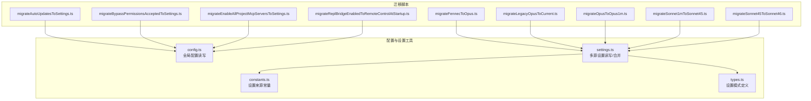

图表来源
- [migrateAutoUpdatesToSettings.ts:1-62](file://src/migrations/migrateAutoUpdatesToSettings.ts#L1-L62)
- [migrateBypassPermissionsAcceptedToSettings.ts:1-41](file://src/migrations/migrateBypassPermissionsAcceptedToSettings.ts#L1-L41)
- [migrateEnableAllProjectMcpServersToSettings.ts:1-119](file://src/migrations/migrateEnableAllProjectMcpServersToSettings.ts#L1-L119)
- [migrateFennecToOpus.ts:1-46](file://src/migrations/migrateFennecToOpus.ts#L1-L46)
- [migrateLegacyOpusToCurrent.ts:1-58](file://src/migrations/migrateLegacyOpusToCurrent.ts#L1-L58)
- [migrateOpusToOpus1m.ts:1-44](file://src/migrations/migrateOpusToOpus1m.ts#L1-L44)
- [migrateReplBridgeEnabledToRemoteControlAtStartup.ts:1-23](file://src/migrations/migrateReplBridgeEnabledToRemoteControlAtStartup.ts#L1-L23)
- [migrateSonnet1mToSonnet45.ts:1-49](file://src/migrations/migrateSonnet1mToSonnet45.ts#L1-L49)
- [migrateSonnet45ToSonnet46.ts:1-68](file://src/migrations/migrateSonnet45ToSonnet46.ts#L1-L68)
- [config.ts:797-800](file://src/utils/config.ts#L797-L800)
- [settings.ts:416-524](file://src/utils/settings/settings.ts#L416-L524)
- [constants.ts:7-22](file://src/utils/settings/constants.ts#L7-L22)
- [types.ts:255-800](file://src/utils/settings/types.ts#L255-L800)

章节来源
- [migrateAutoUpdatesToSettings.ts:1-62](file://src/migrations/migrateAutoUpdatesToSettings.ts#L1-L62)
- [migrateBypassPermissionsAcceptedToSettings.ts:1-41](file://src/migrations/migrateBypassPermissionsAcceptedToSettings.ts#L1-L41)
- [migrateEnableAllProjectMcpServersToSettings.ts:1-119](file://src/migrations/migrateEnableAllProjectMcpServersToSettings.ts#L1-L119)
- [migrateFennecToOpus.ts:1-46](file://src/migrations/migrateFennecToOpus.ts#L1-L46)
- [migrateLegacyOpusToCurrent.ts:1-58](file://src/migrations/migrateLegacyOpusToCurrent.ts#L1-L58)
- [migrateOpusToOpus1m.ts:1-44](file://src/migrations/migrateOpusToOpus1m.ts#L1-L44)
- [migrateReplBridgeEnabledToRemoteControlAtStartup.ts:1-23](file://src/migrations/migrateReplBridgeEnabledToRemoteControlAtStartup.ts#L1-L23)
- [migrateSonnet1mToSonnet45.ts:1-49](file://src/migrations/migrateSonnet1mToSonnet45.ts#L1-L49)
- [migrateSonnet45ToSonnet46.ts:1-68](file://src/migrations/migrateSonnet45ToSonnet46.ts#L1-L68)
- [config.ts:797-800](file://src/utils/config.ts#L797-L800)
- [settings.ts:416-524](file://src/utils/settings/settings.ts#L416-L524)
- [constants.ts:7-22](file://src/utils/settings/constants.ts#L7-L22)
- [types.ts:255-800](file://src/utils/settings/types.ts#L255-L800)

## 核心组件
- 迁移脚本：每个迁移函数以“仅在必要时迁移”的原则运行，避免重复写入；多数迁移通过读取全局配置或用户设置，进行字段迁移与清理，并记录事件日志。
- 设置系统：提供多源设置合并（用户、项目、本地、策略、标志位），支持原子写入、缓存失效与错误处理；迁移脚本通过该系统安全地更新 settings.json。
- 全局配置：提供全局配置读写接口，迁移脚本可在此记录迁移完成状态或时间戳，确保幂等性与跳过逻辑。

章节来源
- [settings.ts:309-368](file://src/utils/settings/settings.ts#L309-L368)
- [settings.ts:416-524](file://src/utils/settings/settings.ts#L416-L524)
- [config.ts:797-800](file://src/utils/config.ts#L797-L800)

## 架构总览
迁移系统遵循“按需迁移 + 幂等 + 可观测”的设计原则：
- 按需迁移：迁移函数先检查是否需要迁移，避免无意义写入。
- 幂等：通过比较目标值、使用唯一完成标记或只在缺失时写入，保证多次运行不产生副作用。
- 可观测：迁移成功/失败均记录事件日志，便于审计与诊断。

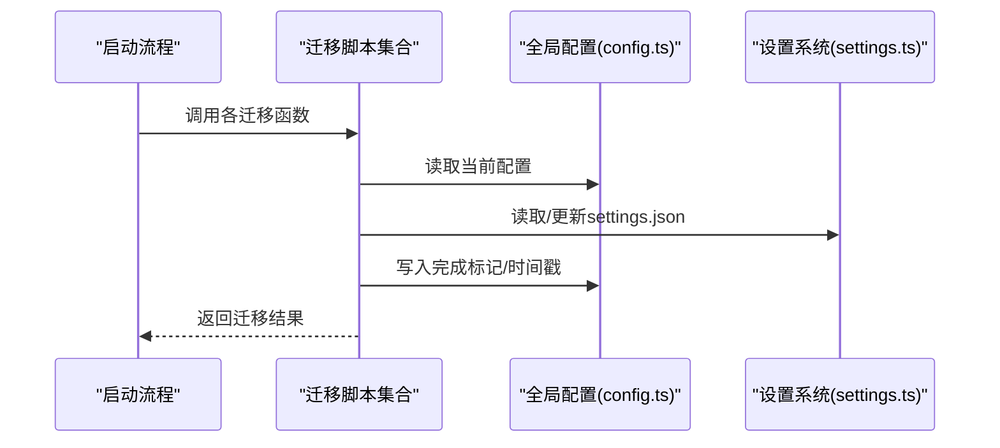

图表来源
- [migrateAutoUpdatesToSettings.ts:13-61](file://src/migrations/migrateAutoUpdatesToSettings.ts#L13-L61)
- [migrateBypassPermissionsAcceptedToSettings.ts:14-40](file://src/migrations/migrateBypassPermissionsAcceptedToSettings.ts#L14-L40)
- [migrateEnableAllProjectMcpServersToSettings.ts:17-118](file://src/migrations/migrateEnableAllProjectMcpServersToSettings.ts#L17-L118)
- [migrateFennecToOpus.ts:18-45](file://src/migrations/migrateFennecToOpus.ts#L18-L45)
- [migrateLegacyOpusToCurrent.ts:29-57](file://src/migrations/migrateLegacyOpusToCurrent.ts#L29-L57)
- [migrateOpusToOpus1m.ts:24-43](file://src/migrations/migrateOpusToOpus1m.ts#L24-L43)
- [migrateReplBridgeEnabledToRemoteControlAtStartup.ts:10-22](file://src/migrations/migrateReplBridgeEnabledToRemoteControlAtStartup.ts#L10-L22)
- [migrateSonnet1mToSonnet45.ts:25-48](file://src/migrations/migrateSonnet1mToSonnet45.ts#L25-L48)
- [migrateSonnet45ToSonnet46.ts:29-67](file://src/migrations/migrateSonnet45ToSonnet46.ts#L29-L67)
- [config.ts:797-800](file://src/utils/config.ts#L797-L800)
- [settings.ts:416-524](file://src/utils/settings/settings.ts#L416-L524)

## 详细组件分析

### 自动更新迁移（从全局配置迁移到用户设置）
- 目标：将用户显式禁用自动更新的偏好迁移到 settings.json 的环境变量中，保留用户意图。
- 关键点：
  - 仅当用户明确禁用且非原生保护场景才迁移。
  - 写入 settings.json 的 env 字段后，同步设置进程级环境变量。
  - 成功后从全局配置移除旧字段。
  - 失败时记录错误事件并继续启动流程。

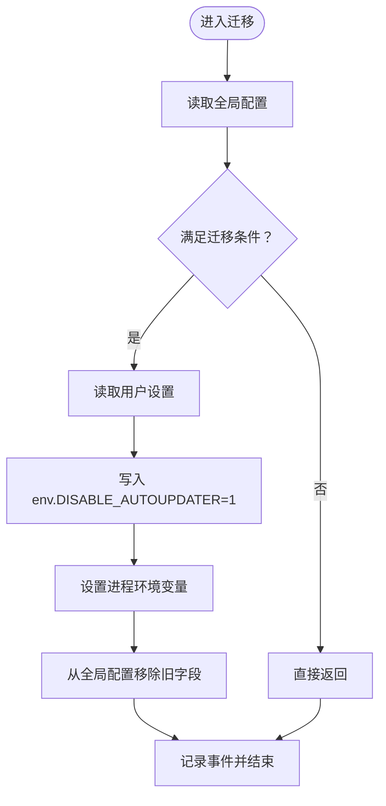

图表来源
- [migrateAutoUpdatesToSettings.ts:13-61](file://src/migrations/migrateAutoUpdatesToSettings.ts#L13-L61)

章节来源
- [migrateAutoUpdatesToSettings.ts:13-61](file://src/migrations/migrateAutoUpdatesToSettings.ts#L13-L61)

### 权限豁免接受迁移（从全局配置迁移到用户设置）
- 目标：将 bypassPermissionsModeAccepted 迁移到 settings.json 中的 skipDangerousModePermissionPrompt，使设置更集中。
- 关键点：
  - 仅在用户设置中不存在目标键时写入。
  - 成功后从全局配置移除旧字段。

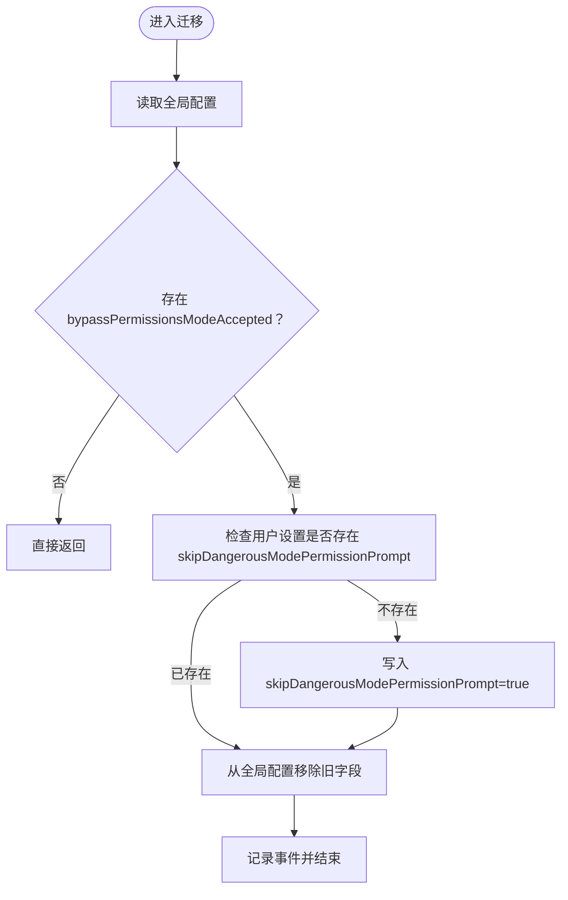

图表来源
- [migrateBypassPermissionsAcceptedToSettings.ts:14-40](file://src/migrations/migrateBypassPermissionsAcceptedToSettings.ts#L14-L40)

章节来源
- [migrateBypassPermissionsAcceptedToSettings.ts:14-40](file://src/migrations/migrateBypassPermissionsAcceptedToSettings.ts#L14-L40)

### MCP 服务器批准字段迁移（从项目配置迁移到本地设置）
- 目标：将项目配置中的 enableAllProjectMcpServers、enabledMcpjsonServers、disabledMcpjsonServers 迁移到本地设置，统一管理。
- 关键点：
  - 合并数组去重，避免重复条目。
  - 仅在目标设置未存在时迁移，否则仅标记清理。
  - 成功后从项目配置移除对应字段。
  - 失败记录错误事件但不中断启动。

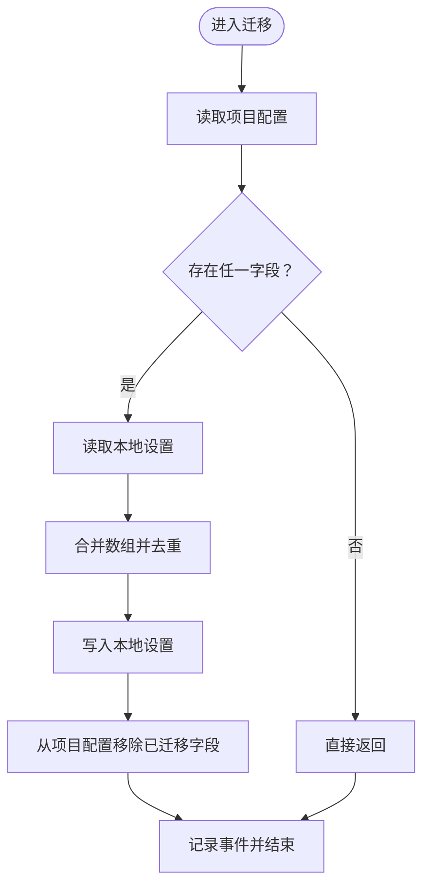

图表来源
- [migrateEnableAllProjectMcpServersToSettings.ts:17-118](file://src/migrations/migrateEnableAllProjectMcpServersToSettings.ts#L17-L118)

章节来源
- [migrateEnableAllProjectMcpServersToSettings.ts:17-118](file://src/migrations/migrateEnableAllProjectMcpServersToSettings.ts#L17-L118)

### 模型别名迁移：Fennec → Opus
- 目标：将已弃用的 fennec 模型别名迁移为 opus 对应别名，保持用户设置一致性。
- 关键点：
  - 仅对用户设置生效，避免影响项目/策略等其他来源。
  - 支持 fastMode 的自动开启场景。
  - 幂等：读写同一来源，避免重复迁移。

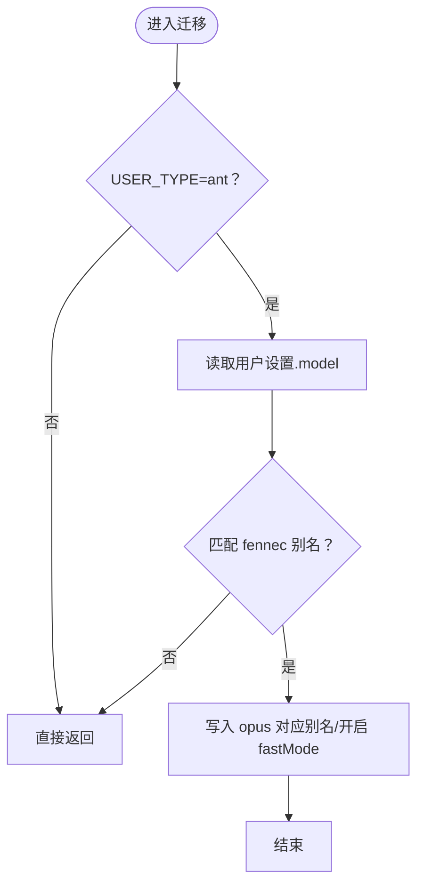

图表来源
- [migrateFennecToOpus.ts:18-45](file://src/migrations/migrateFennecToOpus.ts#L18-L45)

章节来源
- [migrateFennecToOpus.ts:18-45](file://src/migrations/migrateFennecToOpus.ts#L18-L45)

### 模型别名迁移：Legacy Opus → 当前 Opus
- 目标：将第一方用户的显式 Opus 4.0/4.1 别名清理为当前 opus 别名，并记录时间戳用于一次性提示。
- 关键点：
  - 仅在启用迁移开关时执行。
  - 仅对用户设置生效，避免全局推广。
  - 记录迁移事件与时间戳。

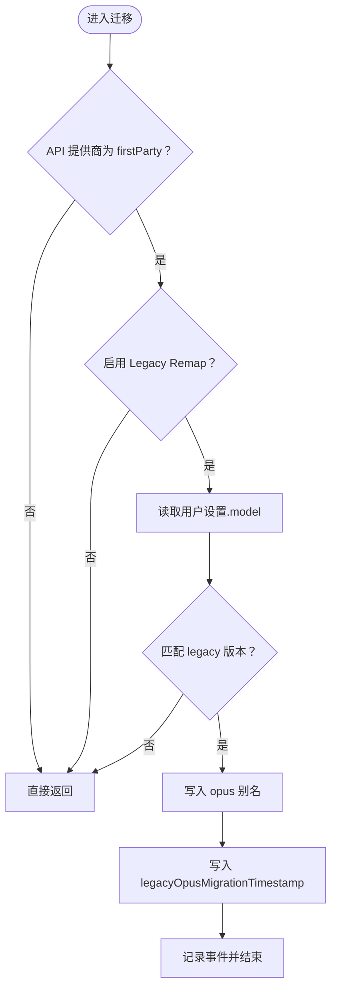

图表来源
- [migrateLegacyOpusToCurrent.ts:29-57](file://src/migrations/migrateLegacyOpusToCurrent.ts#L29-L57)

章节来源
- [migrateLegacyOpusToCurrent.ts:29-57](file://src/migrations/migrateLegacyOpusToCurrent.ts#L29-L57)

### 模型迁移：Opus → Opus 1M（合并体验）
- 目标：将用户设置中的 opus 迁移为 opus[1m]（在符合条件时），保持主循环默认模型一致性。
- 关键点：
  - 仅在合并开关开启时执行。
  - 仅当用户设置精确为 opus 时写入。
  - 与默认模型解析结果对比，避免与默认冲突。

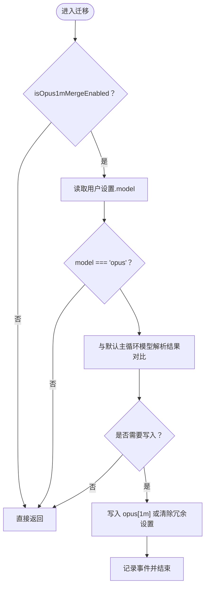

图表来源
- [migrateOpusToOpus1m.ts:24-43](file://src/migrations/migrateOpusToOpus1m.ts#L24-L43)

章节来源
- [migrateOpusToOpus1m.ts:24-43](file://src/migrations/migrateOpusToOpus1m.ts#L24-L43)

### 配置键迁移：replBridgeEnabled → remoteControlAtStartup
- 目标：将内部实现细节的配置键迁移为对外一致的 remoteControlAtStartup。
- 关键点：
  - 仅在旧键存在且新键未设置时迁移。
  - 使用 saveGlobalConfig 原子更新并删除旧键。

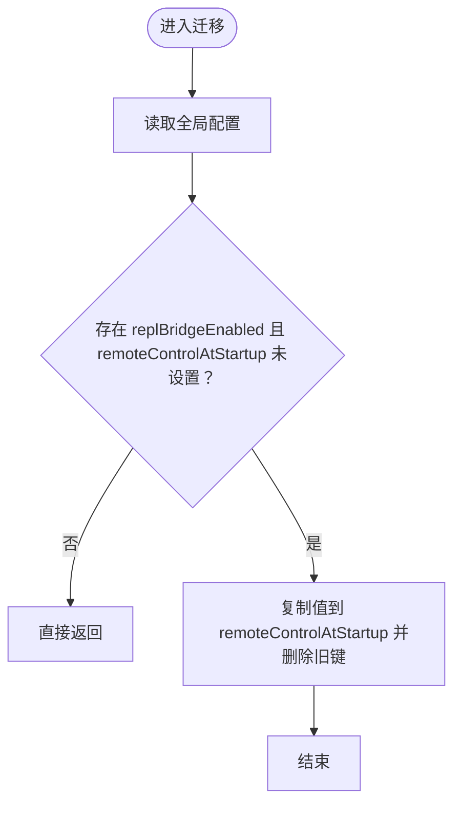

图表来源
- [migrateReplBridgeEnabledToRemoteControlAtStartup.ts:10-22](file://src/migrations/migrateReplBridgeEnabledToRemoteControlAtStartup.ts#L10-L22)

章节来源
- [migrateReplBridgeEnabledToRemoteControlAtStartup.ts:10-22](file://src/migrations/migrateReplBridgeEnabledToRemoteControlAtStartup.ts#L10-L22)

### 模型迁移：Sonnet 1M → Sonnet 4.5（保留历史选择）
- 目标：将之前针对 Sonnet 4.5 1M 的用户设置 pin 为显式版本，以保留其历史选择。
- 关键点：
  - 通过全局配置完成标记避免重复迁移。
  - 同步更新内存中的主循环模型覆盖。

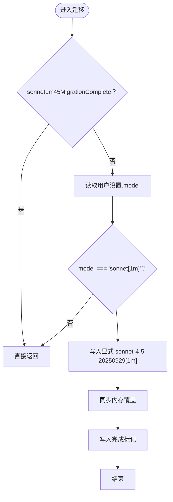

图表来源
- [migrateSonnet1mToSonnet45.ts:25-48](file://src/migrations/migrateSonnet1mToSonnet45.ts#L25-L48)

章节来源
- [migrateSonnet1mToSonnet45.ts:25-48](file://src/migrations/migrateSonnet1mToSonnet45.ts#L25-L48)

### 模型迁移：Sonnet 4.5 → Sonnet 4.6（订阅用户）
- 目标：为符合条件的订阅用户（Pro/Max/Team Premium）将显式 Sonnet 4.5 别名迁移为当前 sonnet 别名。
- 关键点：
  - 仅在 firstParty 且订阅用户身份满足时执行。
  - 仅对用户设置执行，避免项目/策略污染。
  - 新用户跳过通知，仅老用户记录时间戳。

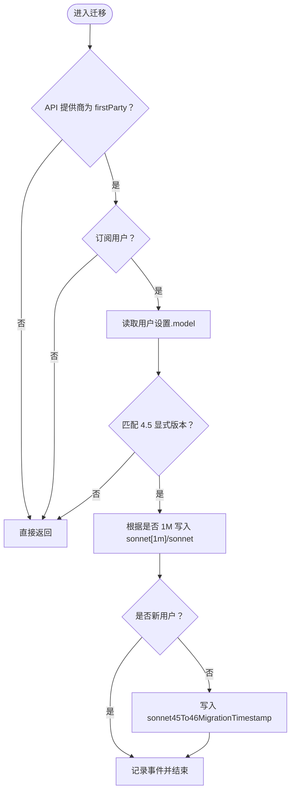

图表来源
- [migrateSonnet45ToSonnet46.ts:29-67](file://src/migrations/migrateSonnet45ToSonnet46.ts#L29-L67)

章节来源
- [migrateSonnet45ToSonnet46.ts:29-67](file://src/migrations/migrateSonnet45ToSonnet46.ts#L29-L67)

## 依赖关系分析
- 迁移脚本依赖：
  - 全局配置读写：用于读取/写入完成标记、时间戳与旧字段清理。
  - 设置系统：用于读取/写入 settings.json，确保原子性与缓存一致性。
- 设置系统内部：
  - 多源设置合并：用户、项目、本地、策略、标志位按优先级合并。
  - 文件解析与校验：基于 Zod 模式，支持无效规则过滤与错误收集。
  - 缓存与写入：写入后重置缓存，确保后续读取一致。

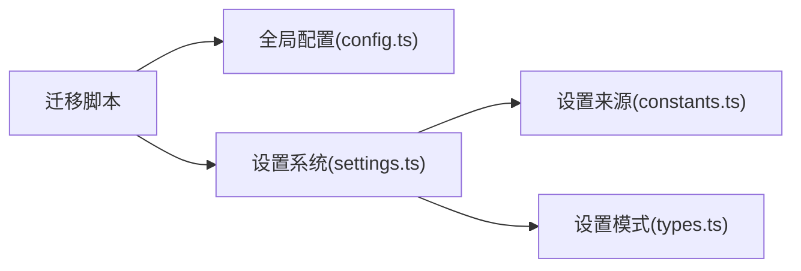

图表来源
- [config.ts:797-800](file://src/utils/config.ts#L797-L800)
- [settings.ts:416-524](file://src/utils/settings/settings.ts#L416-L524)
- [constants.ts:7-22](file://src/utils/settings/constants.ts#L7-L22)
- [types.ts:255-800](file://src/utils/settings/types.ts#L255-L800)

章节来源
- [config.ts:797-800](file://src/utils/config.ts#L797-L800)
- [settings.ts:416-524](file://src/utils/settings/settings.ts#L416-L524)
- [constants.ts:7-22](file://src/utils/settings/constants.ts#L7-L22)
- [types.ts:255-800](file://src/utils/settings/types.ts#L255-L800)

## 性能考量
- 幂等与跳过：多数迁移在进入时即进行“是否需要迁移”的快速判断，避免不必要的磁盘写入与解析。
- 原子写入：设置系统在写入前创建目录、合并现有设置、使用同步刷新写入，减少并发写入风险。
- 缓存失效：写入后重置会话缓存，确保后续读取不会命中旧数据。
- 错误隔离：迁移失败仅记录错误事件，不影响整体启动流程，降低迁移对稳定性的影响。

## 故障排除指南
- 症状：迁移未生效或重复迁移
  - 排查要点：
    - 检查迁移函数的前置条件（如订阅类型、用户类型、开关状态）。
    - 查看全局配置中的完成标记/时间戳是否已存在。
    - 确认目标设置来源是否已被写入（例如用户设置 vs 项目设置）。
  - 相关文件路径：
    - [migrateFennecToOpus.ts:18-45](file://src/migrations/migrateFennecToOpus.ts#L18-L45)
    - [migrateLegacyOpusToCurrent.ts:29-57](file://src/migrations/migrateLegacyOpusToCurrent.ts#L29-L57)
    - [migrateOpusToOpus1m.ts:24-43](file://src/migrations/migrateOpusToOpus1m.ts#L24-L43)
    - [migrateSonnet1mToSonnet45.ts:25-48](file://src/migrations/migrateSonnet1mToSonnet45.ts#L25-L48)
    - [migrateSonnet45ToSonnet46.ts:29-67](file://src/migrations/migrateSonnet45ToSonnet46.ts#L29-L67)

- 症状：settings.json 写入失败或损坏
  - 排查要点：
    - 检查文件权限与磁盘空间。
    - 观察设置系统写入流程中的错误日志（包含 JSON 语法错误与写入异常）。
    - 确认写入后缓存是否被正确重置。
  - 相关文件路径：
    - [settings.ts:416-524](file://src/utils/settings/settings.ts#L416-L524)

- 症状：迁移事件未记录
  - 排查要点：
    - 检查迁移函数内的事件记录调用是否被执行。
    - 确认日志输出级别与采集链路正常。
  - 相关文件路径：
    - [migrateAutoUpdatesToSettings.ts:38-60](file://src/migrations/migrateAutoUpdatesToSettings.ts#L38-L60)
    - [migrateBypassPermissionsAcceptedToSettings.ts:28-39](file://src/migrations/migrateBypassPermissionsAcceptedToSettings.ts#L28-L39)
    - [migrateEnableAllProjectMcpServersToSettings.ts:110-117](file://src/migrations/migrateEnableAllProjectMcpServersToSettings.ts#L110-L117)

章节来源
- [migrateFennecToOpus.ts:18-45](file://src/migrations/migrateFennecToOpus.ts#L18-L45)
- [migrateLegacyOpusToCurrent.ts:29-57](file://src/migrations/migrateLegacyOpusToCurrent.ts#L29-L57)
- [migrateOpusToOpus1m.ts:24-43](file://src/migrations/migrateOpusToOpus1m.ts#L24-L43)
- [migrateSonnet1mToSonnet45.ts:25-48](file://src/migrations/migrateSonnet1mToSonnet45.ts#L25-L48)
- [migrateSonnet45ToSonnet46.ts:29-67](file://src/migrations/migrateSonnet45ToSonnet46.ts#L29-L67)
- [settings.ts:416-524](file://src/utils/settings/settings.ts#L416-L524)

## 结论
Claude Code 的迁移系统以“按需、幂等、可观测”为核心设计，结合全局配置与多源设置系统，实现了从自动更新、权限设置、MCP 服务器批准到模型别名与版本升级的全链路迁移能力。通过原子写入与缓存失效机制，迁移过程具备高可靠性；通过事件记录与错误隔离，运维人员可以快速定位问题并进行干预。

## 附录

### 迁移执行流程与回滚机制
- 执行流程：
  - 启动时依次调用各迁移函数，每个函数独立判断并执行。
  - 成功后写入完成标记或时间戳，避免重复迁移。
  - 失败记录事件，不影响启动。
- 回滚机制：
  - 本系统未提供通用回滚接口；建议通过备份 settings.json 与全局配置，在重大变更前手动备份，必要时恢复。
  - 对于幂等迁移（如模型别名迁移），可重复运行以确保一致性。

章节来源
- [migrateAutoUpdatesToSettings.ts:13-61](file://src/migrations/migrateAutoUpdatesToSettings.ts#L13-L61)
- [migrateBypassPermissionsAcceptedToSettings.ts:14-40](file://src/migrations/migrateBypassPermissionsAcceptedToSettings.ts#L14-L40)
- [migrateEnableAllProjectMcpServersToSettings.ts:17-118](file://src/migrations/migrateEnableAllProjectMcpServersToSettings.ts#L17-L118)
- [migrateFennecToOpus.ts:18-45](file://src/migrations/migrateFennecToOpus.ts#L18-L45)
- [migrateLegacyOpusToCurrent.ts:29-57](file://src/migrations/migrateLegacyOpusToCurrent.ts#L29-L57)
- [migrateOpusToOpus1m.ts:24-43](file://src/migrations/migrateOpusToOpus1m.ts#L24-L43)
- [migrateReplBridgeEnabledToRemoteControlAtStartup.ts:10-22](file://src/migrations/migrateReplBridgeEnabledToRemoteControlAtStartup.ts#L10-L22)
- [migrateSonnet1mToSonnet45.ts:25-48](file://src/migrations/migrateSonnet1mToSonnet45.ts#L25-L48)
- [migrateSonnet45ToSonnet46.ts:29-67](file://src/migrations/migrateSonnet45ToSonnet46.ts#L29-L67)

### 配置迁移功能清单
- 自动更新迁移：将用户显式禁用自动更新的偏好迁移到 settings.json 的 env 变量。
- 权限设置迁移：将 bypassPermissionsModeAccepted 迁移到 skipDangerousModePermissionPrompt。
- MCP 服务器迁移：将项目配置中的 MCP 批准字段迁移到本地设置，合并数组并去重。
- 模型别名迁移：将 fennec 系列别名迁移为 opus 对应别名；清理 legacy Opus 4.0/4.1；在合并体验下将 opus 迁移为 opus[1m]；保留 Sonnet 4.5 1M 用户的显式版本；为订阅用户迁移 Sonnet 4.5 → 4.6。
- 配置键迁移：将 replBridgeEnabled 迁移为 remoteControlAtStartup。

章节来源
- [migrateAutoUpdatesToSettings.ts:13-61](file://src/migrations/migrateAutoUpdatesToSettings.ts#L13-L61)
- [migrateBypassPermissionsAcceptedToSettings.ts:14-40](file://src/migrations/migrateBypassPermissionsAcceptedToSettings.ts#L14-L40)
- [migrateEnableAllProjectMcpServersToSettings.ts:17-118](file://src/migrations/migrateEnableAllProjectMcpServersToSettings.ts#L17-L118)
- [migrateFennecToOpus.ts:18-45](file://src/migrations/migrateFennecToOpus.ts#L18-L45)
- [migrateLegacyOpusToCurrent.ts:29-57](file://src/migrations/migrateLegacyOpusToCurrent.ts#L29-L57)
- [migrateOpusToOpus1m.ts:24-43](file://src/migrations/migrateOpusToOpus1m.ts#L24-L43)
- [migrateReplBridgeEnabledToRemoteControlAtStartup.ts:10-22](file://src/migrations/migrateReplBridgeEnabledToRemoteControlAtStartup.ts#L10-L22)
- [migrateSonnet1mToSonnet45.ts:25-48](file://src/migrations/migrateSonnet1mToSonnet45.ts#L25-L48)
- [migrateSonnet45ToSonnet46.ts:29-67](file://src/migrations/migrateSonnet45ToSonnet46.ts#L29-L67)

### 最佳实践与常见问题
- 最佳实践
  - 在大规模部署前，先在测试环境中验证迁移脚本，确认幂等性与事件记录。
  - 对关键迁移（如模型别名、MCP 服务器）增加白名单/黑名单控制，避免误迁移。
  - 为迁移添加完成标记或时间戳，避免重复执行。
  - 使用原子写入与缓存失效，确保一致性。
- 常见问题
  - settings.json 写入失败：检查权限、磁盘空间与 JSON 语法；查看写入异常日志。
  - 迁移未生效：确认前置条件（订阅类型、用户类型、开关状态）；检查完成标记。
  - 事件未记录：确认迁移函数内事件调用是否被执行。

章节来源
- [settings.ts:416-524](file://src/utils/settings/settings.ts#L416-L524)
- [config.ts:797-800](file://src/utils/config.ts#L797-L800)