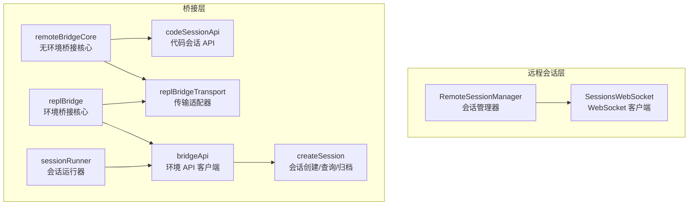
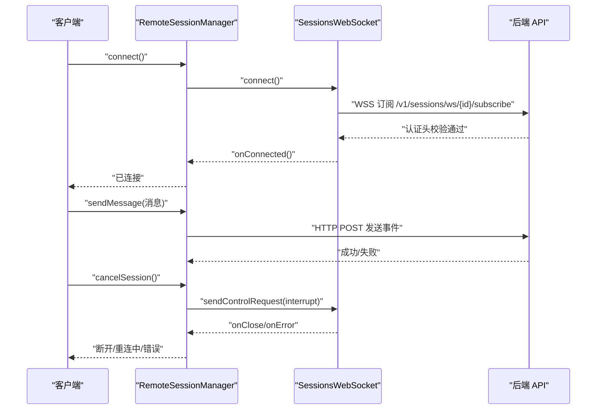
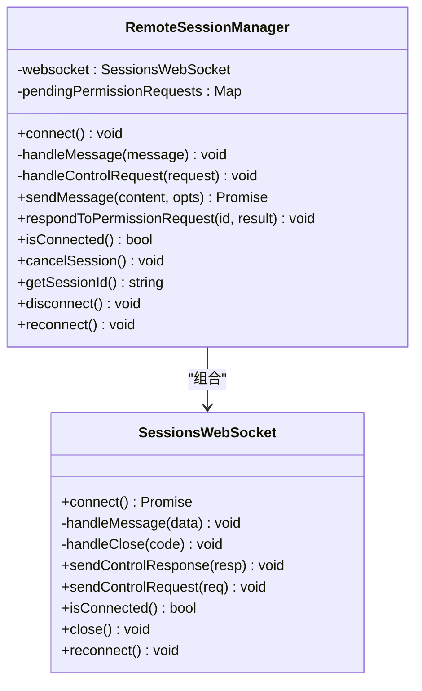
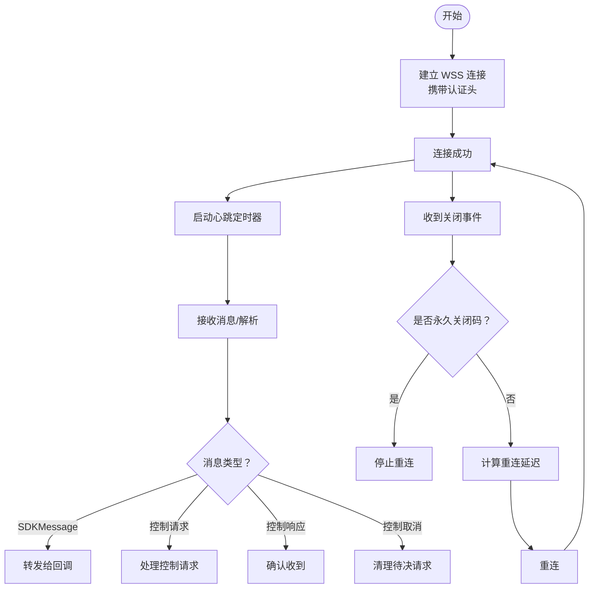
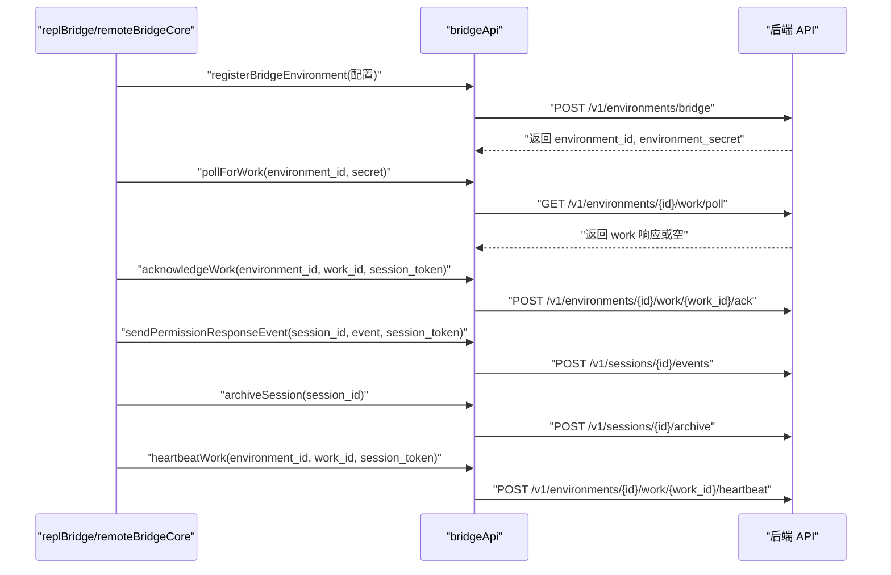
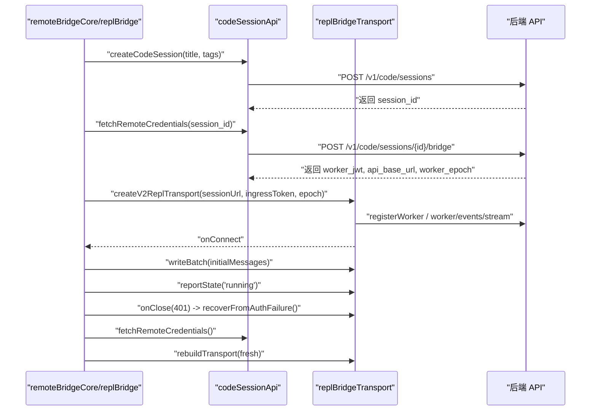
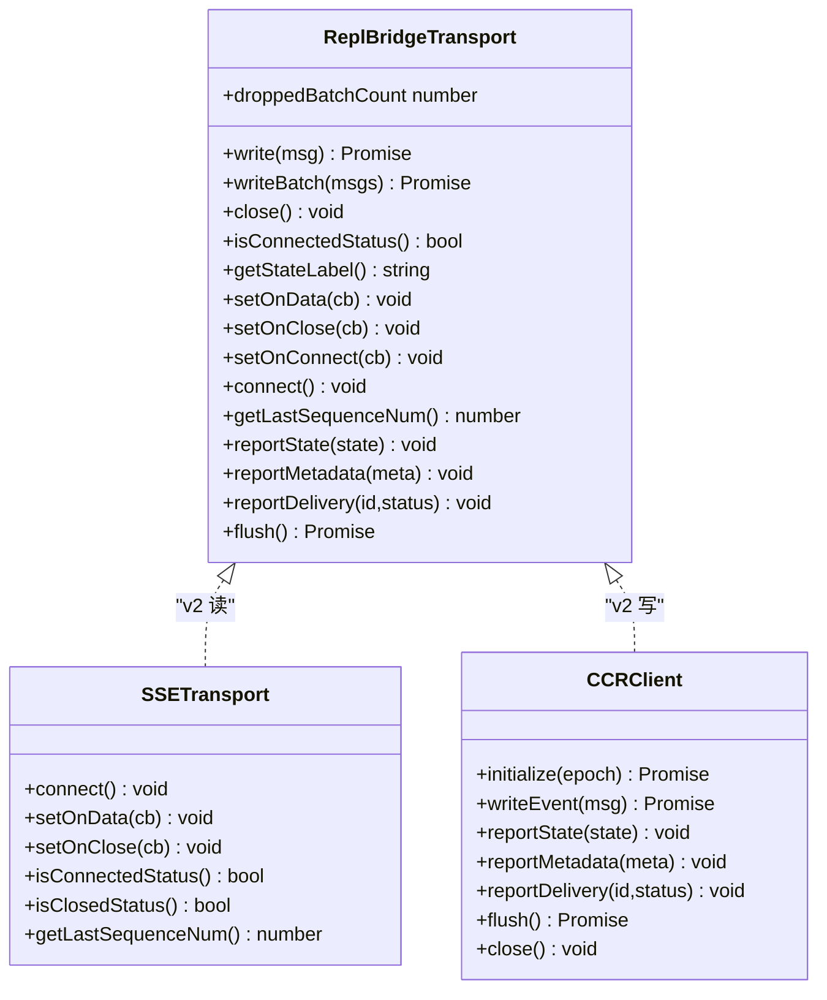
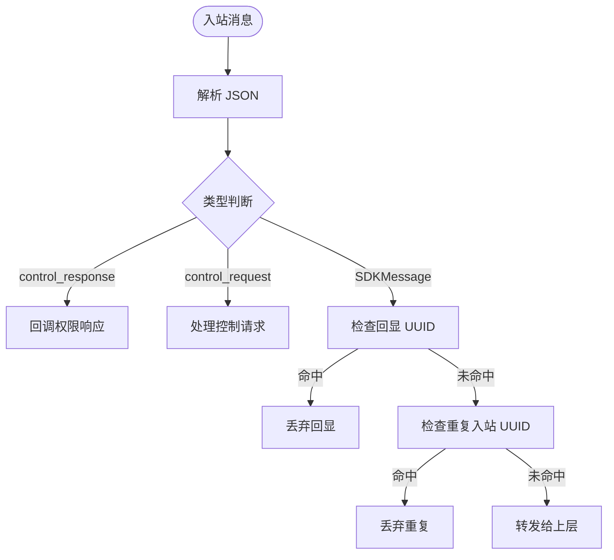
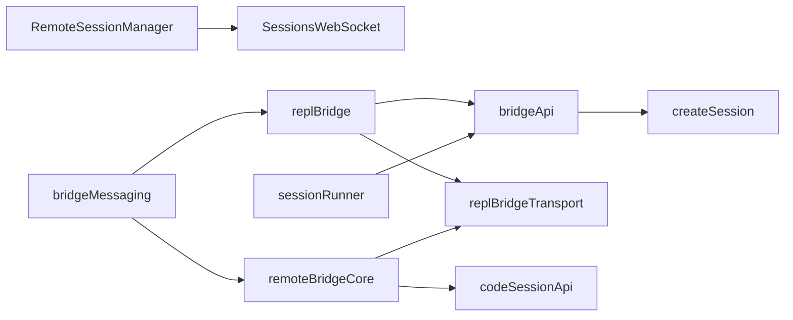

# 远程会话管理

<cite>
**本文引用的文件**
- [RemoteSessionManager.ts](file://src/remote/RemoteSessionManager.ts)
- [SessionsWebSocket.ts](file://src/remote/SessionsWebSocket.ts)
- [createSession.ts](file://src/bridge/createSession.ts)
- [codeSessionApi.ts](file://src/bridge/codeSessionApi.ts)
- [sessionRunner.ts](file://src/bridge/sessionRunner.ts)
- [types.ts](file://src/bridge/types.ts)
- [bridgeApi.ts](file://src/bridge/bridgeApi.ts)
- [remoteBridgeCore.ts](file://src/bridge/remoteBridgeCore.ts)
- [replBridge.ts](file://src/bridge/replBridge.ts)
- [replBridgeTransport.ts](file://src/bridge/replBridgeTransport.ts)
- [bridgeMessaging.ts](file://src/bridge/bridgeMessaging.ts)
</cite>

## 目录
1. [简介](#简介)
2. [项目结构](#项目结构)
3. [核心组件](#核心组件)
4. [架构总览](#架构总览)
5. [详细组件分析](#详细组件分析)
6. [依赖关系分析](#依赖关系分析)
7. [性能考量](#性能考量)
8. [故障排除指南](#故障排除指南)
9. [结论](#结论)
10. [附录](#附录)

## 简介
本文件面向远程协作开发者与系统管理员，系统性阐述 Claude Code 的远程会话管理系统：从远程会话的创建与连接、会话初始化与认证、消息同步与权限控制，到远程触发、远程会话管理与协作机制，再到会话状态跟踪、性能监控与故障恢复策略。文档以代码为依据，提供可操作的配置建议与排障方法，并强调安全与性能优化要点。

## 项目结构
远程会话管理由“远程会话层”和“桥接（Bridge）层”两大部分组成：
- 远程会话层：负责通过 WebSocket 订阅会话事件流、处理控制请求与响应、发送用户消息、中断与重连等。
- 桥接层：负责在本地启动/管理会话进程、与后端环境注册/轮询工作项、建立入站/出站传输通道、处理权限与控制请求、以及会话生命周期管理（创建、归档、标题同步等）。

图示来源
- [RemoteSessionManager.ts:1-344](file://src/remote/RemoteSessionManager.ts#L1-L344)
- [SessionsWebSocket.ts:1-405](file://src/remote/SessionsWebSocket.ts#L1-L405)
- [remoteBridgeCore.ts:1-800](file://src/bridge/remoteBridgeCore.ts#L1-L800)
- [replBridge.ts:1-800](file://src/bridge/replBridge.ts#L1-L800)
- [replBridgeTransport.ts:1-371](file://src/bridge/replBridgeTransport.ts#L1-L371)
- [bridgeApi.ts:1-540](file://src/bridge/bridgeApi.ts#L1-L540)
- [createSession.ts:1-385](file://src/bridge/createSession.ts#L1-L385)
- [codeSessionApi.ts:1-169](file://src/bridge/codeSessionApi.ts#L1-L169)
- [sessionRunner.ts:1-551](file://src/bridge/sessionRunner.ts#L1-L551)

章节来源
- [RemoteSessionManager.ts:1-344](file://src/remote/RemoteSessionManager.ts#L1-L344)
- [SessionsWebSocket.ts:1-405](file://src/remote/SessionsWebSocket.ts#L1-L405)
- [remoteBridgeCore.ts:1-800](file://src/bridge/remoteBridgeCore.ts#L1-L800)
- [replBridge.ts:1-800](file://src/bridge/replBridge.ts#L1-L800)
- [replBridgeTransport.ts:1-371](file://src/bridge/replBridgeTransport.ts#L1-L371)
- [bridgeApi.ts:1-540](file://src/bridge/bridgeApi.ts#L1-L540)
- [createSession.ts:1-385](file://src/bridge/createSession.ts#L1-L385)
- [codeSessionApi.ts:1-169](file://src/bridge/codeSessionApi.ts#L1-L169)
- [sessionRunner.ts:1-551](file://src/bridge/sessionRunner.ts#L1-L551)

## 核心组件
- RemoteSessionManager：封装远程会话的连接、消息收发、权限请求处理、中断与断线重连逻辑；协调 WebSocket 与 HTTP 发送路径。
- SessionsWebSocket：通用 WebSocket 客户端，负责连接、心跳、错误与关闭处理、有限重试与永久关闭码判定。
- bridgeApi：环境 API 客户端，提供环境注册、轮询工作项、停止工作、注销环境、发送权限响应事件、会话归档、重连会话、心跳等。
- createSession：通过 HTTP 创建/获取/归档桥接会话，支持带初始历史的会话创建与标题更新。
- codeSessionApi：直接面向 CCR v2 的代码会话 API，创建会话与获取远端凭据（worker_jwt）。
- replBridge：基于环境的 REPL 桥接核心，负责环境注册、会话创建、轮询/恢复、入站/出站传输、控制请求处理与会话生命周期管理。
- remoteBridgeCore：无环境桥接核心，直接使用 CCR v2 协议，无需环境层，适合 REPL 场景。
- replBridgeTransport：统一 v1/v2 传输抽象，屏蔽底层差异（HybridTransport 或 SSETransport + CCRClient）。
- bridgeMessaging：桥接消息处理与去重、控制请求路由、结果消息构造等纯函数工具。
- sessionRunner：本地会话进程管理器，负责子进程生命周期、权限请求转发、活动记录、令牌刷新等。

章节来源
- [RemoteSessionManager.ts:95-324](file://src/remote/RemoteSessionManager.ts#L95-L324)
- [SessionsWebSocket.ts:82-404](file://src/remote/SessionsWebSocket.ts#L82-L404)
- [bridgeApi.ts:68-451](file://src/bridge/bridgeApi.ts#L68-L451)
- [createSession.ts:34-180](file://src/bridge/createSession.ts#L34-L180)
- [codeSessionApi.ts:26-80](file://src/bridge/codeSessionApi.ts#L26-L80)
- [replBridge.ts:260-800](file://src/bridge/replBridge.ts#L260-L800)
- [remoteBridgeCore.ts:140-800](file://src/bridge/remoteBridgeCore.ts#L140-L800)
- [replBridgeTransport.ts:23-371](file://src/bridge/replBridgeTransport.ts#L23-L371)
- [bridgeMessaging.ts:132-462](file://src/bridge/bridgeMessaging.ts#L132-L462)
- [sessionRunner.ts:248-551](file://src/bridge/sessionRunner.ts#L248-L551)

## 架构总览
远程会话管理采用“双路径”设计：
- 远程会话路径：客户端通过 RemoteSessionManager 建立 WebSocket 订阅，接收 SDKMessage 流；同时通过 HTTP 发送用户消息；控制请求（如权限请求、中断）通过 WebSocket 控制通道处理。
- 桥接路径：本地通过 bridgeApi 注册环境，轮询工作项；根据工作项选择 v1（HybridTransport）或 v2（SSETransport + CCRClient）传输；remoteBridgeCore 与 replBridge 提供无环境与有环境两种桥接模式。

图示来源
- [RemoteSessionManager.ts:108-141](file://src/remote/RemoteSessionManager.ts#L108-L141)
- [SessionsWebSocket.ts:100-205](file://src/remote/SessionsWebSocket.ts#L100-L205)
- [SessionsWebSocket.ts:234-288](file://src/remote/SessionsWebSocket.ts#L234-L288)

章节来源
- [RemoteSessionManager.ts:95-324](file://src/remote/RemoteSessionManager.ts#L95-L324)
- [SessionsWebSocket.ts:82-404](file://src/remote/SessionsWebSocket.ts#L82-L404)

## 详细组件分析

### 组件一：RemoteSessionManager（远程会话管理）
- 职责
  - 管理单个远程会话的生命周期：连接、断开、重连。
  - 处理会话消息：区分 SDKMessage 与控制消息（请求/响应/取消），并分派给回调。
  - 权限请求处理：缓存待决权限请求，回调上层决策，再通过 WebSocket 发送控制响应。
  - 用户消息发送：通过 HTTP POST 将消息事件投递到会话。
  - 中断控制：向服务器发送中断请求。
- 关键流程
  - 连接：创建 SessionsWebSocket 并注册回调。
  - 消息处理：类型守卫识别消息类型，分别处理 SDKMessage、控制请求、控制响应与取消。
  - 权限响应：构造控制响应并发送。
  - 断线重连：调用 WebSocket 的强制重连接口。

图示来源
- [RemoteSessionManager.ts:95-324](file://src/remote/RemoteSessionManager.ts#L95-L324)
- [SessionsWebSocket.ts:82-404](file://src/remote/SessionsWebSocket.ts#L82-L404)

章节来源
- [RemoteSessionManager.ts:95-324](file://src/remote/RemoteSessionManager.ts#L95-L324)

### 组件二：SessionsWebSocket（会话 WebSocket 客户端）
- 职责
  - 建立与后端的 WSS 订阅连接，携带认证头。
  - 心跳维持：周期性 ping。
  - 错误与关闭处理：区分永久关闭码与临时断开，执行有限重试与指数退避。
  - 控制消息发送：支持控制请求与控制响应。
- 关键点
  - 永久关闭码集合：遇到特定关闭码立即停止重连。
  - 会话不存在（4001）：允许有限次数重试，避免短暂压缩导致的误判。
  - 重连调度：带标签的延迟重连，避免风暴。

图示来源
- [SessionsWebSocket.ts:100-205](file://src/remote/SessionsWebSocket.ts#L100-L205)
- [SessionsWebSocket.ts:234-288](file://src/remote/SessionsWebSocket.ts#L234-L288)
- [SessionsWebSocket.ts:290-299](file://src/remote/SessionsWebSocket.ts#L290-L299)

章节来源
- [SessionsWebSocket.ts:17-36](file://src/remote/SessionsWebSocket.ts#L17-L36)
- [SessionsWebSocket.ts:82-404](file://src/remote/SessionsWebSocket.ts#L82-L404)

### 组件三：桥接 API 与会话创建（bridgeApi + createSession + codeSessionApi）
- 职责
  - bridgeApi：环境 API 客户端，提供环境注册、轮询工作项、停止工作、注销环境、发送权限响应事件、会话归档、重连会话、心跳等。
  - createSession：通过 HTTP 创建/获取/归档桥接会话，支持初始历史注入与标题同步。
  - codeSessionApi：直接面向 CCR v2 的代码会话 API，创建会话与获取远端凭据（worker_jwt）。
- 关键流程
  - 环境注册：携带 runner 版本、机器名、目录、分支、仓库信息与最大会话数等元数据。
  - 工作轮询：按配置的轮询间隔与超时拉取工作项，返回工作 ID、环境 ID、会话令牌等。
  - 会话创建：支持带初始历史的会话创建，或直接创建空会话。
  - 凭据获取：通过 /v1/code/sessions/{id}/bridge 获取 worker_jwt、api_base_url、worker_epoch 等。

图示来源
- [bridgeApi.ts:141-451](file://src/bridge/bridgeApi.ts#L141-L451)
- [createSession.ts:34-180](file://src/bridge/createSession.ts#L34-L180)
- [codeSessionApi.ts:26-80](file://src/bridge/codeSessionApi.ts#L26-L80)

章节来源
- [bridgeApi.ts:68-451](file://src/bridge/bridgeApi.ts#L68-L451)
- [createSession.ts:34-180](file://src/bridge/createSession.ts#L34-L180)
- [codeSessionApi.ts:26-80](file://src/bridge/codeSessionApi.ts#L26-L80)

### 组件四：REPL 桥接核心（replBridge 与 remoteBridgeCore）
- 职责
  - replBridge：基于环境的桥接核心，负责环境注册、会话创建、轮询/恢复、入站/出站传输、控制请求处理与会话生命周期管理。
  - remoteBridgeCore：无环境桥接核心，直接使用 CCR v2 协议，无需环境层，适合 REPL 场景。
- 关键流程
  - 初始化：创建会话、获取远端凭据、构建 v2 传输、设置回调、启动心跳与刷新计划。
  - 刷新与重建：基于凭据过期时间进行主动刷新，或在 401 时进行恢复重建。
  - 历史刷新：在连接后批量刷新初始历史，保证顺序与去重。
  - 终止：发送结果消息、归档会话、清理资源与遥测。

图示来源
- [remoteBridgeCore.ts:140-800](file://src/bridge/remoteBridgeCore.ts#L140-L800)
- [replBridge.ts:260-800](file://src/bridge/replBridge.ts#L260-L800)
- [replBridgeTransport.ts:119-371](file://src/bridge/replBridgeTransport.ts#L119-L371)
- [codeSessionApi.ts:93-169](file://src/bridge/codeSessionApi.ts#L93-L169)

章节来源
- [remoteBridgeCore.ts:140-800](file://src/bridge/remoteBridgeCore.ts#L140-L800)
- [replBridge.ts:260-800](file://src/bridge/replBridge.ts#L260-L800)
- [replBridgeTransport.ts:119-371](file://src/bridge/replBridgeTransport.ts#L119-L371)
- [codeSessionApi.ts:93-169](file://src/bridge/codeSessionApi.ts#L93-L169)

### 组件五：传输适配器（replBridgeTransport）
- 职责
  - 统一 v1（HybridTransport）与 v2（SSETransport + CCRClient）传输接口。
  - v2 写路径通过 CCRClient + SerialBatchEventUploader，读路径通过 SSETransport。
  - 支持报告状态、元数据、交付进度，以及在关闭前刷新写队列。
- 关键点
  - v2 初始化：注册 worker（epoch）、建立 SSE 读流与 CCRClient 写入通道。
  - epoch 不匹配：通过关闭资源并上报特定关闭码，触发上层轮询/重建。
  - outboundOnly：仅启用写路径，不接收入站提示与控制请求。

图示来源
- [replBridgeTransport.ts:23-371](file://src/bridge/replBridgeTransport.ts#L23-L371)

章节来源
- [replBridgeTransport.ts:23-371](file://src/bridge/replBridgeTransport.ts#L23-L371)

### 组件六：消息处理与去重（bridgeMessaging）
- 职责
  - 解析入站消息，区分 SDKMessage、控制请求与控制响应。
  - 去重：基于 recentPostedUUIDs（回显过滤）与 recentInboundUUIDs（重复入站过滤）。
  - 控制请求处理：对 initialize、set_model、set_max_thinking_tokens、set_permission_mode、interrupt 等进行响应。
  - 结果消息：构造最小化结果事件用于会话归档。

图示来源
- [bridgeMessaging.ts:132-208](file://src/bridge/bridgeMessaging.ts#L132-L208)
- [bridgeMessaging.ts:243-391](file://src/bridge/bridgeMessaging.ts#L243-L391)

章节来源
- [bridgeMessaging.ts:132-462](file://src/bridge/bridgeMessaging.ts#L132-L462)

### 组件七：本地会话运行器（sessionRunner）
- 职责
  - 启动子进程承载会话，解析 NDJSON 输出，提取活动与错误。
  - 转发权限请求至服务器，处理用户消息首条文本抽取。
  - 支持令牌刷新（stdin 注入新令牌）、进程终止/强制终止、转录日志写入。
- 关键点
  - 安全文件名清洗，避免路径穿越。
  - 活动缓冲与最近 stderr 行环形缓冲，便于诊断。
  - 与桥接层配合实现标题同步与权限模式切换。

章节来源
- [sessionRunner.ts:24-26](file://src/bridge/sessionRunner.ts#L24-L26)
- [sessionRunner.ts:107-200](file://src/bridge/sessionRunner.ts#L107-L200)
- [sessionRunner.ts:248-551](file://src/bridge/sessionRunner.ts#L248-L551)

## 依赖关系分析
- RemoteSessionManager 依赖 SessionsWebSocket 与远程消息发送工具，负责会话控制与消息转发。
- replBridge 依赖 bridgeApi 与 replBridgeTransport，负责环境与会话生命周期管理。
- remoteBridgeCore 依赖 codeSessionApi 与 replBridgeTransport，负责直接 CCR v2 会话与凭据刷新。
- bridgeMessaging 为两类桥接核心共享的消息解析与去重工具。
- sessionRunner 与 bridgeApi 协作，支撑本地会话进程与环境交互。

图示来源
- [RemoteSessionManager.ts:100-141](file://src/remote/RemoteSessionManager.ts#L100-L141)
- [replBridge.ts:32-68](file://src/bridge/replBridge.ts#L32-L68)
- [remoteBridgeCore.ts:32-54](file://src/bridge/remoteBridgeCore.ts#L32-L54)
- [bridgeMessaging.ts:132-208](file://src/bridge/bridgeMessaging.ts#L132-L208)
- [sessionRunner.ts:1-14](file://src/bridge/sessionRunner.ts#L1-L14)

章节来源
- [RemoteSessionManager.ts:95-324](file://src/remote/RemoteSessionManager.ts#L95-L324)
- [replBridge.ts:260-800](file://src/bridge/replBridge.ts#L260-L800)
- [remoteBridgeCore.ts:140-800](file://src/bridge/remoteBridgeCore.ts#L140-L800)
- [bridgeMessaging.ts:132-462](file://src/bridge/bridgeMessaging.ts#L132-L462)
- [sessionRunner.ts:1-14](file://src/bridge/sessionRunner.ts#L1-L14)

## 性能考量
- 传输与序列化
  - v2 写路径采用 CCRClient + SerialBatchEventUploader，内部批量化与串行排队，减少网络往返与服务端压力。
  - 入站消息解析与去重使用环形缓冲与集合，时间复杂度 O(1)，空间复杂度 O(N)。
- 心跳与重连
  - SessionsWebSocket 心跳周期与断线重连延迟可配置，避免频繁抖动与风暴。
  - remoteBridgeCore 的凭据刷新在到期前主动刷新，降低 401 风险与重建成本。
- 历史刷新与顺序
  - 初始历史刷新使用 FlushGate 与去重集合，确保服务端接收顺序与去重，避免重复消息与回放。
- 本地进程与日志
  - sessionRunner 使用转录文件与 stderr 环形缓冲，便于诊断且避免磁盘写放大。

章节来源
- [replBridgeTransport.ts:274-283](file://src/bridge/replBridgeTransport.ts#L274-L283)
- [SessionsWebSocket.ts:17-26](file://src/remote/SessionsWebSocket.ts#L17-L26)
- [remoteBridgeCore.ts:317-377](file://src/bridge/remoteBridgeCore.ts#L317-L377)
- [bridgeMessaging.ts:429-461](file://src/bridge/bridgeMessaging.ts#L429-L461)
- [sessionRunner.ts:268-285](file://src/bridge/sessionRunner.ts#L268-L285)

## 故障排除指南
- 远程会话连接问题
  - 检查认证头与组织 UUID 是否正确传递。
  - 观察 SessionsWebSocket 的永久关闭码与 4001 重试上限，必要时调整重连策略。
  - 若出现“会话不存在”，确认会话是否被压缩或归档，等待重试窗口结束。
- 权限请求与控制请求
  - 确保 RemoteSessionManager 正确缓存并响应权限请求，避免服务器挂起。
  - 对于未知控制请求子类型，返回错误响应以避免阻塞。
- 401 与凭据刷新
  - remoteBridgeCore 在 401 时自动尝试刷新凭据并重建传输；若失败，检查 OAuth 刷新链路与凭据有效期。
- 传输重建与 epoch 不匹配
  - v2 传输在 epoch 不匹配时会关闭并上报特定关闭码，触发上层轮询/重建；确保每次刷新都伴随新的 worker_epoch。
- 归档与清理
  - 终止时先发送结果消息，再进行会话归档；若归档 401，尝试刷新 OAuth 后重试。
- 本地会话进程
  - 检查 sessionRunner 的 stderr 环形缓冲与转录日志，定位子进程异常；必要时强制终止并重启。

章节来源
- [RemoteSessionManager.ts:153-214](file://src/remote/RemoteSessionManager.ts#L153-L214)
- [SessionsWebSocket.ts:246-288](file://src/remote/SessionsWebSocket.ts#L246-L288)
- [remoteBridgeCore.ts:530-590](file://src/bridge/remoteBridgeCore.ts#L530-L590)
- [replBridgeTransport.ts:209-232](file://src/bridge/replBridgeTransport.ts#L209-L232)
- [bridgeApi.ts:454-500](file://src/bridge/bridgeApi.ts#L454-L500)
- [sessionRunner.ts:352-366](file://src/bridge/sessionRunner.ts#L352-L366)

## 结论
该远程会话管理系统通过“远程会话层 + 桥接层”的双路径设计，既满足远程控制与协作需求，又兼顾本地会话的可控性与可观测性。其关键优势在于：
- 明确的控制通道与消息去重机制，保障会话一致性与稳定性。
- v2 传输与凭据刷新策略，降低 401 与重建频率。
- 丰富的生命周期管理与遥测，便于监控与排障。
建议在生产环境中结合组织策略启用严格的权限模式与审计日志，并持续关注凭据刷新与传输重建的健康度。

## 附录
- 配置示例（概念性说明）
  - 远程会话连接：提供会话 ID、组织 UUID、访问令牌获取器，调用 RemoteSessionManager.connect()。
  - 会话创建（桥接）：通过 createSession 创建带初始历史的会话，或通过 codeSessionApi 直接创建 CCR v2 会话。
  - 环境注册与轮询：使用 bridgeApi.registerBridgeEnvironment 与 pollForWork，按需停止工作与注销环境。
  - 本地会话运行：通过 sessionRunner.spawn 启动子进程，监听活动与权限请求，必要时刷新令牌。
- 安全建议
  - 严格限制访问令牌范围与有效期，定期刷新。
  - 使用受信设备令牌增强 Elevated 安全级别。
  - 仅在必要时启用 outboundOnly 模式，避免误用造成权限与控制受限。
- 性能优化
  - 合理设置心跳与重连参数，避免过度重试。
  - 使用 v2 传输与批量化写入，减少网络开销。
  - 启用转录日志与活动缓冲，提升诊断效率。